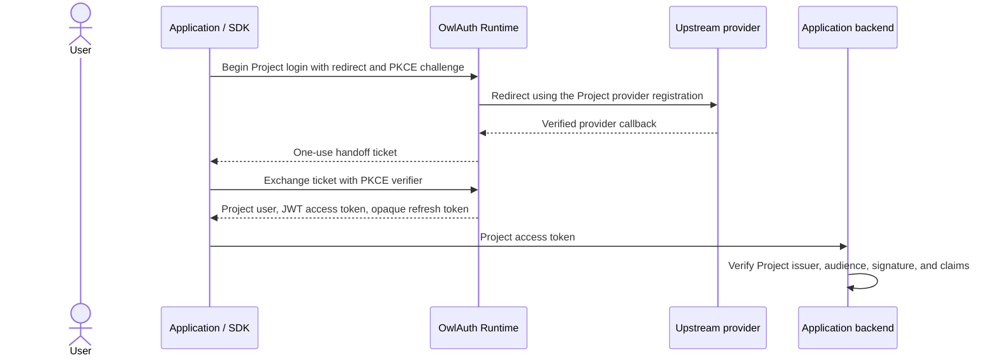

# OwlAuth

OwlAuth is self-hostable authentication and identity infrastructure for applications. One deployment can host multiple isolated Projects, and each Project can contain multiple web, mobile, native, or server Applications that share its user directory and authentication policy.

OwlAuth federates with upstream OAuth/OIDC providers such as GitHub and Google and targets first-party passwordless email OTP/magic-link authentication through user-configured SMTP. Applications integrate through a Project Auth API, revisioned user projections, optional signed webhooks, and language SDKs; OwlAuth is not a general-purpose downstream OAuth/OIDC authorization server or provider-token broker.

> [!IMPORTANT]
> OwlAuth is Beta for its delivered self-hosted server, CLI, hosted web, and Project Auth SDK scope. The repository implements PostgreSQL-backed Project/Application authority; GitHub, Google, and strict custom OIDC federation; passwordless email; managed provider profile synchronization; PKCE handoff and Project session/token lifecycles; revisioned Application projections and signed webhooks; operational Control, Console, CLI, and optional remote MCP surfaces; and three protocol SDKs. Pre-1.0 APIs, configuration, and operational requirements may change. Beta is not deployment certification or a production support commitment: operators remain responsible for hardening, monitoring, upgrades, and a tested PostgreSQL/external-store/key backup, PITR, and restore program. SCIM, bulk directory/export, hosted multi-tenant control, and downstream OAuth authorization-server behavior are outside the current product.

## Product model

- A **Deployment** is one administrative trust domain operated under one policy.
- A **Project** is the isolation boundary for users, linked identities, provider configuration, sessions, refresh families, access tokens, and signing keys.
- An **Application** is a web, mobile, native, or server integration inside a Project. Applications in the same Project share users and Project token trust.
- A **provider configuration** is a Project-owned upstream OAuth/OIDC client registration that can be assigned to one or more Applications; an optional managed connection retains only a server-side least-scope renewable credential for bounded profile synchronization.
- A **first-party email identity** is proved by a newest/one-use OTP or magic link delivered through Project SMTP (or explicit deployment-default opt-in) and never silently linked by matching provider email.
- An Application receives one bounded `user_revision` projection after handoff and may subscribe to signed durable-outbox webhooks only for users already bound to it.
- An application backend verifies short-lived Project JWTs and remains responsible for business authorization such as organization membership, roles, billing, or document access.

Applications that require isolated users or token audiences use separate Projects. OwlAuth intentionally does not model product organizations, tenant membership, or business RBAC. The optional Project `belongs_to` field is opaque indexed metadata for an external control system, not an OwlAuth authorization boundary.

## Authentication model



The handoff ticket is short-lived, one-use, and bound to the Project, Application, exact redirect, browser transaction, and PKCE challenge. Project access tokens are short-lived signed JWTs. Refresh tokens are opaque, stateful, one-use credentials with strict family rotation and replay revocation.

The server exposes three isolated transport planes over one shared application/domain core:

- **Runtime / Protocol Plane:** hosted provider/email login, public Project configuration, handoff exchange, revisioned user/session operations, token refresh, logout, Project JWKS, and bounded delivery workers.
- **Client Plane:** backend-only Project user directory, exact lookup, Application projection reads, and online token introspection under one Project client key; no browser surface or Client SDK.
- **Control Plane:** Project, Application, provider/managed-connection, SMTP/email policy, user/identity, Application webhook, session, policy, key, and audit administration under the single deployment operator key.

The three planes use distinct listeners, credentials, and policies even when one `owlauth-server` process composes all of them.

## Repository layout

```text
.
├── crates
│   ├── owlauth-server  # server library, executable, migrations, and hosted-web ownership
│   │   ├── migrations  # reviewed PostgreSQL migration assets
│   │   └── web         # Runtime/Control hosted-web ownership boundary
│   ├── owlauth-cli     # endpoint-discovered self-hosted administration CLI
│   └── owlauth-types   # public HTTP DTO and OpenAPI authority
├── spec                # normative server/CLI architecture and technology register
│   └── technology      # detailed canonical technology decisions
├── docs                # VitePress user and operator documentation
├── plugins             # shared Codex and Claude integration skill
└── sdks
    ├── typescript      # npm: `@owlauth/client`
    ├── python          # PyPI: `owlauth-client`, import: `owlauth`
    ├── rust            # crates.io: `owlauth-client`
    └── spec            # language-neutral SDK contract and conformance rules
```

Start with:

- [User documentation](https://owlauth-docs.owlfoundry.org)
- [Server architecture specifications](spec/README.md)
- [Technology selection register](spec/10-implementation-technology-selections.md)
- [Identity connection, passwordless email, and user-sync specification](spec/11-identity-connections-passwordless-email-and-user-sync.md)
- [Product UI and interaction design specification](spec/12-product-ui-and-interaction-design.md)
- [Detailed technology decisions](spec/technology/README.md)
- [SDK specifications](sdks/spec/README.md)
- [Building a SaaS around OwlAuth](docs/guide/building-saas.md)
- [Contributing guide](CONTRIBUTING.md)
- [Security policy](SECURITY.md)

The architecture and SDK specifications distinguish delivered Beta behavior from explicitly deferred or out-of-scope capabilities.

## Development

Install the pinned repository toolchains and run the complete local checks:

```bash
make install
make check
make test
make build
make package-check
```

Start a complete local Runtime, Client, and Control process with disposable development configuration:

```bash
cp .env.example .env
make dev
```

Runtime is served at `http://127.0.0.1:8080/`, Client at `http://127.0.0.1:8082/`, and the Control Console at
`http://127.0.0.1:8081/console/`. The development Control key is the
`OWLAUTH_CONTROL_API_KEY` value in `.env`. Stop the foreground server with `Ctrl-C`, then run
`make dev-down` when the PostgreSQL and Redis containers are no longer needed.

Use `make openapi` to export all three plane contracts and `make web-e2e` to run the isolated real-browser
gate. The browser gate starts its own PostgreSQL, OwlAuth Runtime, Client, and Control listeners, a
controlled standards-compatible OIDC provider, and real Application actors. Container-backed Rust
integration tests skip locally when Docker is unavailable; CI requires Docker execution:

```bash
make test-containers
```

Database migrations are embedded from [`crates/owlauth-server/migrations/`](crates/owlauth-server/migrations/README.md). The tracked prepared Runtime and Control assets under [`crates/owlauth-server/web/`](crates/owlauth-server/web/README.md) make ordinary Cargo and package builds deterministic and offline; `make web-build` regenerates and validates them.

## CLI installation

The CLI provides strict endpoint-discovered profiles, self-hosted administration, and checksum-verified self-update. It discovers and pins the OwlAuth server product, instance, authority, API base, and operator credential class before choosing its typed client or reading a referenced credential.

Unix-like systems:

```bash
curl -fsSL https://raw.githubusercontent.com/owlfoundry/owlauth/main/scripts/install.sh | sh
```

Windows PowerShell:

```powershell
irm https://raw.githubusercontent.com/owlfoundry/owlauth/main/scripts/install.ps1 | iex
```

Both installers download native archives from GitHub Releases and require a matching `SHA256SUMS` entry. The default install directory is `$HOME/.local/bin`; override it with `OWLAUTH_INSTALL_DIR`. Select a release with `OWLAUTH_VERSION`.

```bash
owlauth --version
owlauth update --dry-run
owlauth update
```

## Packages and releases

The server, CLI, and each SDK follow independent SemVer. Server and CLI tags share the crates.io version namespace of their exact `owlauth-types` dependency, so those two tag families form one strictly increasing crate version sequence.

| Component      | Package                                                   | Release tag             |
| -------------- | --------------------------------------------------------- | ----------------------- |
| Server         | `owlauth-key-provider`, `owlauth-types`, `owlauth-server` | `server-v{version}`     |
| CLI            | `owlauth-types`, `owlauth-cli`                            | `cli-v{version}`        |
| TypeScript SDK | `@owlauth/client`                                         | `typescript-v{version}` |
| Python SDK     | `owlauth-client`                                          | `python-v{version}`     |
| Rust SDK       | `owlauth-client`                                          | `rust-v{version}`       |

Committed package manifests use non-publishable development sentinels (`0.0.0-dev`, or `0.0.0.dev0` for Python). A release tag points at the current `main` commit and is the sole release-version authority. Release workflows materialize it only in isolated workflow workspaces, so releases do not require version-bump commits.

Server images are published at `ghcr.io/owlfoundry/owlauth`: `main` updates `dev`, a server release publishes its version and updates `latest`, and `build/server/{tag}` publishes the isolated smoke-tested tag `build-{tag}`.

Release notes are generated from structured squash PR titles and filtered by component scope. See [CONTRIBUTING.md](CONTRIBUTING.md) for the title and release conventions.

## License

OwlAuth is licensed under the [BSD 3-Clause License](LICENSE).
