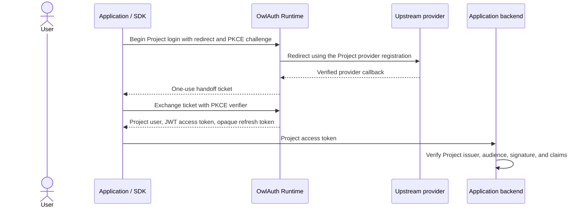

# OwlAuth

OwlAuth is self-hostable authentication and identity infrastructure for applications. One deployment can host multiple isolated Projects, and each Project can contain multiple web, mobile, native, or server Applications that share its user directory and authentication policy.

OwlAuth uses OAuth/OIDC to federate with upstream identity providers such as GitHub and Google. Applications integrate with OwlAuth through a Project Auth API and language SDKs; OwlAuth is not a general-purpose downstream OAuth/OIDC authorization server.

> [!IMPORTANT]
> OwlAuth is pre-alpha. The repository currently contains architecture specifications, release infrastructure, placeholder SDKs, a checksum-verifying CLI updater, and a server scaffold with a health endpoint and generated OpenAPI. Project login, persistence, sessions, token issuance, Control APIs, and MCP are not implemented. Do not use the current scaffold for production authentication.

## Product model

- A **Deployment** is one administrative trust domain operated under one policy.
- A **Project** is the isolation boundary for users, linked identities, provider configuration, sessions, refresh families, access tokens, and signing keys.
- An **Application** is a web, mobile, native, or server integration inside a Project. Applications in the same Project share users and Project token trust.
- A **provider configuration** is a Project-owned upstream OAuth/OIDC client registration that can be assigned to one or more Applications.
- An application backend verifies short-lived Project JWTs and remains responsible for business authorization such as organization membership, roles, billing, or document access.

Applications that require isolated users or token audiences use separate Projects. OwlAuth intentionally does not model product organizations, tenant membership, or business RBAC. The optional Project `belongs_to` field is opaque indexed metadata for an external control system, not an OwlAuth authorization boundary.

## Authentication model



The handoff ticket is short-lived, one-use, and bound to the Project, Application, exact redirect, browser transaction, and PKCE challenge. Project access tokens are short-lived signed JWTs. Refresh tokens are opaque, stateful, one-use credentials with strict family rotation and replay revocation.

The target server exposes two isolated transport planes over one shared application/domain core:

- **Runtime / Protocol Plane:** public Project configuration, upstream login, handoff exchange, user/session operations, token refresh, logout, and Project JWKS.
- **Control Plane:** Project, Application, provider, user, policy, key, management-principal, and audit administration.

The two planes use distinct listeners and authentication policies even when one `owlauth-server` process composes both.

## Repository layout

```text
.
├── crates
│   ├── owlauth-server  # server library and `owlauth-server` executable
│   ├── owlauth-cli     # remote Control CLI and `owlauth` executable
│   └── owlauth-types   # public HTTP DTO and OpenAPI authority
├── spec                # normative server and CLI architecture
├── docs                # VitePress user and operator documentation
├── plugins             # shared Codex and Claude integration skill
└── sdks
    ├── typescript      # npm: `@owlauth/client`
    ├── python          # PyPI: `owlauth-client`, import: `owlauth`
    ├── rust            # crates.io: `owlauth-client`
    └── spec            # language-neutral SDK contract and conformance rules
```

Start with:

- [User documentation](https://owlauth.owlfoundry.org)
- [Server architecture specifications](spec/README.md)
- [SDK specifications](sdks/spec/README.md)
- [Contributing guide](CONTRIBUTING.md)
- [Security policy](SECURITY.md)

The architecture and SDK specifications describe the required target behavior. They do not imply that the pre-alpha scaffold already implements it.

## Development

Install the pinned repository toolchains and run the complete local checks:

```bash
make install
make check
make test
make build
make package-check
```

Generate the current OpenAPI document from the Rust definitions without committing the generated output:

```bash
cargo run --package owlauth-server -- --openapi
```

Run the current server scaffold:

```bash
cargo run --package owlauth-server
curl http://127.0.0.1:8080/health
```

Database migrations belong in `crates/owlauth-server/migrations/`. The target design embeds and applies pending migrations before readiness; the current scaffold does not yet implement the migration runner.

## CLI installation

The published CLI currently provides version/help output and checksum-verified self-update. Planned Control commands are not available yet.

Unix-like systems:

```bash
curl -fsSL https://raw.githubusercontent.com/owlfoundry/owlauth/main/scripts/install.sh | sh
```

Windows PowerShell:

```powershell
irm https://raw.githubusercontent.com/owlfoundry/owlauth/main/scripts/install.ps1 | iex
```

Both installers download native archives from GitHub Releases and require a matching `SHA256SUMS` entry. The default install directory is `$HOME/.local/bin`; override it with `OWLAUTH_INSTALL_DIR`. Select a release with `OWLAUTH_VERSION`.

```bash
owlauth --version
owlauth update --dry-run
owlauth update
```

## Packages and releases

The server, CLI, and each SDK follow independent SemVer. `owlauth-types` follows the server version.

| Component | Package | Release tag |
| --- | --- | --- |
| Server | `owlauth-server`, `owlauth-types` | `server-v{version}` |
| CLI | `owlauth-cli` | `cli-v{version}` |
| TypeScript SDK | `@owlauth/client` | `typescript-v{version}` |
| Python SDK | `owlauth-client` | `python-v{version}` |
| Rust SDK | `owlauth-client` | `rust-v{version}` |

A release tag points at the current `main` commit. Release workflows derive the version from the tag and materialize it only in isolated workflow workspaces, so releases do not require version-bump commits.

Server images are published at `ghcr.io/owlfoundry/owlauth`: `main` updates `dev`, a server release publishes its version and updates `latest`, and `build/server/{tag}` publishes the isolated smoke-tested tag `build-{tag}`.

Release notes are generated from structured squash PR titles and filtered by component scope. See [CONTRIBUTING.md](CONTRIBUTING.md) for the title and release conventions.

## License

OwlAuth is licensed under the [BSD 3-Clause License](LICENSE).
