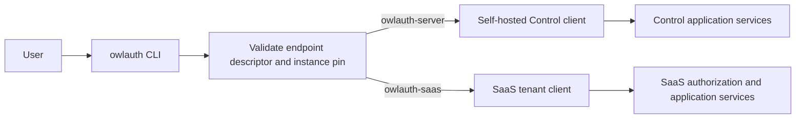
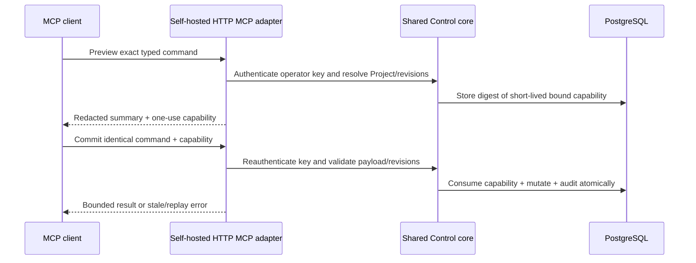

# CLI, plugins, and agent integrations

OwlAuth separates documentation assistance, remote administration, and future agent tools. None of these surfaces may bypass Project isolation or Control authorization.

## Current availability

| Surface                 | Current status                                                                                 |
| ----------------------- | ---------------------------------------------------------------------------------------------- |
| `owlauth` CLI           | Descriptor-pinned self-hosted Control commands and checksum-verified self-update are available |
| Codex/Claude plugin     | Repository-distributed integration skill and reference material only                           |
| Remote Control commands | Typed Project/Application/user/session/provider/key/projection/webhook commands are available  |
| MCP server/tools        | Self-hosted Control reads plus one preview/commit mutation are available when enabled          |

The plugin does not bundle a server, launch a local MCP process, expose Project Auth operations, or create credentials. Treat it as documentation and guardrails for the pre-alpha repository.

## Plugin responsibility

The shared source under [`plugins/owlauth`](https://github.com/owlfoundry/owlauth/tree/main/plugins/owlauth) is packaged for Codex and Claude. Its integration skill should help an agent:

- recognize the implemented pre-alpha Runtime, Control, and SDK boundaries and avoid inventing deferred routes or commands;
- select the TypeScript, Python, or Rust SDK and preserve its explicit Application-owned navigation, storage, and refresh-coordination boundary;
- distinguish downstream Project Auth from upstream OAuth/OIDC federation;
- understand that Project/Application IDs and publishable keys are public identifiers, not Control credentials;
- inspect generated OpenAPI as an ephemeral contract view;
- require the component's candidate-bound final evidence manifest before describing an SDK operation as release-qualified; exported methods, package versions, workspace tests, generated OpenAPI, and fixtures alone are insufficient, and current manifests prove one exact Runtime/source coordinate rather than a range;
- direct security reports to the private disclosure path.

Plugin text or model output is never authority. Do not paste provider secrets, `OWLAUTH_CONTROL_API_KEY`, handoff tickets, access/refresh tokens, PKCE verifiers, cookies, private keys, full callback URLs, or user profiles into agent context.

## Current CLI

Installers download native CLI archives from `cli-v{version}` GitHub Releases and verify them against `SHA256SUMS`. The executable currently supports descriptor-pinned self-hosted administration and self-update:

```bash
owlauth profile add local --endpoint https://identity.example --yes
owlauth --profile local system
owlauth --profile local project list
owlauth --profile local project user sessions PROJECT_ID USER_ID
owlauth --profile local application user-event list PROJECT_ID APPLICATION_ID --limit 50
owlauth --profile local webhook delivery list PROJECT_ID APPLICATION_ID --limit 50
owlauth update --dry-run
```

The CLI must not access PostgreSQL/Redis, load server modules, run migrations, or host Runtime/Control listeners. Audit export and SaaS tenant commands remain deferred.

## Remote CLI trust model

The `owlauth` executable supports endpoint profiles without a user-configured product type. Self-hosted dispatch is implemented; SaaS dispatch remains planned. A profile stores a trusted endpoint. Before reading a credential, the CLI validates origin-root `GET /.well-known/owlauth`, confirms/pins the declared product, instance, authority, API base, and credential class on first use, and selects an isolated typed client:



Discovery failure or endpoint identity change fails before credential release. The CLI does not probe both authenticated APIs or switch products after `401`, `403`, `404`, or command failure. A discovered server uses the operator key and full deployment authority; a discovered SaaS endpoint uses a SaaS API key plus current Organization membership, scope, ownership, entitlement, and revisions.

Common Project-management commands share a conceptual interface where SaaS offers a tenant-safe equivalent. Organization, membership, Service Account, SaaS API-key, billing, entitlement, and usage commands are SaaS-only. Shared command names do not share wire DTOs, credentials, IDs, or authorization.

Credentials come from a TTY prompt, protected file descriptor, OS credential store, or secret-provider integration—not normal process arguments or shell history. Human and machine output remain separate; both redact credentials and profile data. Destructive commands require an explicit target/revision and deliberate confirmation, but confirmation never replaces remote authorization.

## Remote HTTP MCP

The self-hosted server now provides the first bounded Control adapter; the separate SaaS endpoint remains governed by the SaaS implementation plan. OwlAuth defines two standards-conformant Streamable HTTP MCP server boundaries:

| Endpoint owner                       | Authentication                                         | Authority                                                                            |
| ------------------------------------ | ------------------------------------------------------ | ------------------------------------------------------------------------------------ |
| self-hosted `owlauth-server` Control | `owl_ctrl_v1_...` operator Bearer key on every request | full deployment operator                                                             |
| OwlAuth SaaS API                     | `owl_saas_v1_...` SaaS API key on every request        | current tenant principal, Organization, scope, ownership, entitlement, and revisions |

Each endpoint exposes `mcp` relative to its administrative base URL. The self-hosted endpoint is disabled by default and is enabled with `OWLAUTH_CONTROL_MCP_ENABLED=true`; discovery publishes `mcp_url` only while the route is composed. Its current stateless JSON-response catalog identifies `owlauth-server` and exposes eight read-only tools for system capabilities, Project/Application inventory, projection policy, and webhook endpoint/delivery inspection. Its only mutation is a high-impact projection-policy update with separate preview and commit tools and no direct alias. It creates no MCP session and declares no prompts or resources. The SaaS endpoint will publish its own catalog when implemented. MCP clients therefore do not maintain an OwlAuth product-mode tool table. Tool discovery is not authorization; every invocation reauthenticates and reauthorizes.

Neither endpoint is a Runtime route or local plugin process. CLI, plugins, installers, and agent packages never bundle, launch, download, supervise, or impersonate an MCP server. The protected MCP host sends the Bearer header; the key never enters prompt/model context, tools, results, URLs, or protocol session IDs.

A tool maps to one bounded owning-product application command/query with explicit target/revisions, closed input/output, idempotency, timeout/rate/audit policy, and preview/commit confirmation for high-impact actions. MCP does not provide raw SQL, generic HTTP/OpenAPI forwarding, repository access, CLI/shell/filesystem execution, unrestricted bulk mutation, or export of secrets, provider tokens, sessions, operator/API keys, private keys, or user-profile dumps.

### High-impact confirmation



The self-hosted capability binds the fixed deployment-operator actor, Control audience, deployment instance, exact MCP Control endpoint, exact commit tool, normalized command, explicit Project, Project metadata revision, and target revision. PostgreSQL stores only its digest and uses its own clock for the bounded expiry. PostgreSQL—not Redis—enforces one use in the same transaction as the conditional mutation, expansion operation, and audit event.

The SaaS endpoint uses its own capability bound to the SaaS principal/API-key ID, Organization, tool, Managed Project/target, permission, entitlement/revisions, and SaaS audience. Commit reauthenticates current SaaS authority, consumes the capability, persists actor-bound command intent, and only then invokes an allowlisted managed Control command. Prompt text, tool discovery, session IDs, and UI approval are not authorization.

## External control gateways

A product with organization-aware administration may place its own API/RBAC gateway before OwlAuth Control. The gateway authenticates the tenant administrator, checks membership/roles, maps trusted ownership to Project `belongs_to`, verifies the target and revision, and forwards only allowlisted Control commands with the deployment's server-side operator key.

OwlAuth does not attenuate the operator key or infer tenant ownership from `belongs_to`; the external gateway owns every narrower permission decision. Generic Control forwarding or an operator key exposed to a browser/agent would grant deployment-wide authority.

For the normative target boundaries, read the [self-hosted CLI and MCP specification](https://github.com/owlfoundry/owlauth/blob/main/spec/07-cli-and-mcp-boundaries.md) and the [SaaS CLI and HTTP MCP specification](https://github.com/owlfoundry/owlauth/blob/main/spec/saas/07-cli-and-http-mcp-surfaces.md).
