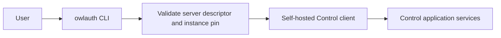

# CLI, plugins, and agent integrations

OwlAuth separates documentation assistance, remote administration, and future agent tools. None of these surfaces may bypass Project isolation or Control authorization.

## Current availability

| Surface                 | Current status                                                                                 |
| ----------------------- | ---------------------------------------------------------------------------------------------- |
| `owlauth` CLI           | Descriptor-pinned self-hosted Control commands and checksum-verified self-update are available |
| Codex/Claude plugin     | Repository-distributed integration skill and reference material only                           |
| Remote Control commands | Typed Project/Application/user/session/provider/key/webhook commands are available             |
| MCP server/tools        | Full self-hosted Control administration is available when explicitly enabled                   |

The plugin does not bundle a server, launch a local MCP process, expose Project Auth operations, or create credentials. Treat it as documentation and guardrails for the Beta repository.

## Plugin responsibility

The shared source under [`plugins/owlauth`](https://github.com/owlfoundry/owlauth/tree/main/plugins/owlauth) is packaged for Codex and Claude. Its integration skill should help an agent:

- recognize the implemented Beta Runtime, Server API, Control, and Runtime SDK boundaries and avoid inventing deferred routes or commands;
- select the TypeScript, Python, or Rust SDK and preserve its explicit Application-owned navigation, storage, and refresh-coordination boundary;
- distinguish downstream Project Auth from upstream OAuth/OIDC federation;
- understand that Project/Application IDs and publishable keys are public identifiers, Project server keys are backend-only Server credentials, and neither is a Control credential;
- inspect generated OpenAPI as an ephemeral contract view;
- require the component's candidate-bound final evidence manifest before describing an SDK operation as release-qualified; exported methods, package versions, workspace tests, generated OpenAPI, and fixtures alone are insufficient, and current manifests prove one exact Runtime/source coordinate rather than a range;
- direct security reports to the private disclosure path.

Plugin text or model output is never authority. Outside the explicitly invoked full-authority remote MCP tools described below, do not put provider secrets, `OWLAUTH_CONTROL_API_KEY`, handoff tickets, access/refresh tokens, PKCE verifiers, cookies, private keys, full callback URLs, or user profiles into agent context. The operator key remains transport-only even for MCP.

## Install and configure the CLI

Installers download native archives from `cli-v{version}` GitHub Releases and verify them against `SHA256SUMS`. See [Getting started](/guide/getting-started#install-the-cli) for supported platforms, version selection, and install-directory overrides.

Keep the deployment operator key in a secret-managed environment variable. A profile stores only that variable's name, along with the discovered and pinned endpoint identity:

```bash
# OWLAUTH_PRODUCTION_OPERATOR is injected by the approved secret provider.
owlauth profile add production \
  --endpoint https://identity.example \
  --credential-env OWLAUTH_PRODUCTION_OPERATOR \
  --yes
owlauth profile inspect production
owlauth profile check production
owlauth profile use production
```

`profile add` prints the discovery result before saving it. Omit `--yes` to inspect without accepting it. `profile check` validates the saved identity pin without reading the credential; `profile use` validates before changing the default. If an endpoint is deliberately replaced, `profile rebind` requires explicit confirmation and a different credential-variable reference.

Remote query and mutation results, discovery previews, and profile inspection are JSON, so the same payloads can be inspected by a person or consumed by automation. Profile selection may succeed without a payload, updater diagnostics are human-readable text, and failures are stable human diagnostics on stderr rather than a JSON error contract:

```bash
owlauth --profile production system
owlauth --profile production project list
owlauth --profile production project get PROJECT_ID
owlauth --profile production application list PROJECT_ID
owlauth --profile production project user sessions PROJECT_ID USER_ID
owlauth --profile production application user-event list \
  PROJECT_ID APPLICATION_ID --limit 50
owlauth --profile production webhook endpoint list PROJECT_ID APPLICATION_ID
owlauth --profile production webhook delivery list \
  PROJECT_ID APPLICATION_ID --limit 50
```

Create operations require a caller-retained idempotency key. Security-sensitive state transitions require the current revision and `--yes`:

```bash
owlauth --profile production project create \
  --display-name 'Example Project' \
  --idempotency-key project_create_20260806

owlauth --profile production project disable PROJECT_ID \
  --expected-security-revision 7 \
  --yes

owlauth --profile production project enable PROJECT_ID \
  --expected-security-revision 8 \
  --yes

# Permanent deletion immediately fences the Project and cannot be undone.
owlauth --profile production project delete PROJECT_ID \
  --expected-security-revision 9 \
  --yes
```

Use `owlauth COMMAND --help` at each command level for the complete typed surface. Server-key creation reveals credential material once; capture that JSON directly into approved backend secret custody and do not paste it into shell arguments, logs, tickets, or agent context. Rotate a server key by creating and acknowledging a replacement, deploying it, and then revoking the predecessor. Resource secrets accepted by provider or webhook commands are also read from explicitly named environment variables and may not reuse the operator credential.

```bash
owlauth update --dry-run
owlauth update
```

The CLI must not access PostgreSQL, load server modules, run migrations, or host Auth or Control listeners. Audit export remains deferred.

## Remote CLI trust model

The `owlauth` executable supports profiles for self-hosted deployments. A profile stores a trusted endpoint. Before reading a credential, the CLI validates origin-root `GET /.well-known/owlauth`, confirms and pins the `owlauth-server` product, instance, authority, API base, and `operator-api-key` credential class on first use, and selects its typed Control client:



Discovery failure or endpoint identity change fails before credential release. The CLI does not infer endpoint identity from `401`, `403`, `404`, or command failure. A discovered server uses the operator key and therefore has full deployment authority.

The current CLI reads the operator credential from the environment-variable reference saved in the profile. It never stores the credential value or accepts it as a normal command argument. Supply that variable through the deployment's approved secret injection, keep command output out of untrusted logs, and unset interactive-shell exports when finished. Destructive commands require an explicit target/revision and deliberate confirmation, but confirmation never replaces remote authorization.

## Configure remote HTTP MCP

The self-hosted server provides a bounded Streamable HTTP MCP Control adapter authenticated by the `owl_ctrl_v1_...` operator Bearer key on every request. It has full deployment-operator authority and is disabled by default. Enable it in the Control server environment:

```bash
OWLAUTH_CONTROL_MCP_ENABLED=true
```

Restart the server, then read the authoritative endpoint from Control discovery rather than constructing a URL:

```bash
curl --fail --silent --show-error \
  https://identity.example/.well-known/owlauth | jq .mcp_url
```

Discovery publishes `mcp_url` only while the route is enabled. Configure a protected MCP host for that Streamable HTTP URL and have the host inject `Authorization: Bearer $OWLAUTH_CONTROL_API_KEY` from secret storage. Header syntax and environment expansion are host-specific. Never put the expanded key in model-visible configuration, prompts, tool arguments, URLs, logs, or protocol session IDs.

For a transport diagnostic, have the secret provider create a mode-`0600` curl config outside the repository and model-visible workspace. Point `OWLAUTH_MCP_CURL_CONFIG` at it; the protected file contains the real header in this form:

```text
header = "Authorization: Bearer owl_ctrl_v1_..."
```

The following initializes the stateless JSON-response endpoint without putting the key in command arguments or shell history. This direct `curl` form is for operator troubleshooting, not for exposing the credential to an agent:

```bash
export OWLAUTH_MCP_URL='https://identity.example/control/mcp'
# OWLAUTH_MCP_CURL_CONFIG is injected with the protected config-file path.

curl --fail --silent --show-error --config "$OWLAUTH_MCP_CURL_CONFIG" \
  "$OWLAUTH_MCP_URL" \
  --header 'Accept: application/json, text/event-stream' \
  --header 'Content-Type: application/json' \
  --data '{
    "jsonrpc": "2.0",
    "id": 1,
    "method": "initialize",
    "params": {
      "protocolVersion": "2025-06-18",
      "capabilities": {},
      "clientInfo": {"name": "operator-diagnostic", "version": "1.0.0"}
    }
  }' | jq
```

After initialization, an MCP client uses `tools/list` and `tools/call`. A stateless `tools/call` diagnostic for the capability summary is:

```bash
curl --fail --silent --show-error --config "$OWLAUTH_MCP_CURL_CONFIG" \
  "$OWLAUTH_MCP_URL" \
  --header 'MCP-Protocol-Version: 2025-06-18' \
  --header 'Accept: application/json, text/event-stream' \
  --header 'Content-Type: application/json' \
  --data '{
    "jsonrpc": "2.0",
    "id": 2,
    "method": "tools/call",
    "params": {"name": "owlauth_system_get", "arguments": {}}
  }' | jq
```

The catalog exposes the complete authenticated Control operation inventory: 85 independently named tools in the current contract. `tools/list` is cursor-paginated; MCP hosts must follow `nextCursor` until it is absent. Each reviewed Control operation has a fixed method, fixed `/v1` route, closed input schema, and typed output schema. The adapter accepts no caller-selected method, path, arbitrary header, Runtime route, Server API route, or external URL.

The original nine bounded query tools retain their established names:

- `owlauth_system_get`
- `owlauth_projects_list` and `owlauth_project_get`
- `owlauth_applications_list` and `owlauth_application_get`
- `owlauth_webhook_endpoints_list` and `owlauth_webhook_deliveries_list`
- `owlauth_project_users_list` and `owlauth_project_user_lookup_email`

Every other tool is named `owlauth_{operationId}` from the Control OpenAPI contract. The resulting management surface covers Project/Application metadata and policy, server keys, signing keys, providers and assignments, email and SMTP configuration, webhook lifecycle and replay, Project users and sessions, managed provider connections, and identity-mutation intents. Inspect the generated tool schema rather than guessing fields.

Generated tool arguments follow one stable mapping:

- path and query parameters are top-level arguments;
- an `Idempotency-Key` header is the top-level `idempotency_key` argument;
- the operation's JSON request entity is the `body` object;
- omitted optional values remain omitted rather than being synthesized;
- resource IDs and expected revisions retain their Control contract validation.

For example, an agent can create a Project directly:

```json
{
  "name": "owlauth_create_project",
  "arguments": {
    "idempotency_key": "project_create_20260808",
    "body": {
      "display_name": "Example Project",
      "belongs_to": "tenant-42"
    }
  }
}
```

It can then update that exact Project using the current metadata revision:

```json
{
  "name": "owlauth_update_project",
  "arguments": {
    "project_id": "00000000-0000-0000-0000-000000000000",
    "body": {
      "display_name": "Renamed Project",
      "belongs_to": "tenant-42",
      "expected_metadata_revision": 1
    }
  }
}
```

MCP deliberately adds no read-only role or adapter-specific confirmation step. The authenticated operator key grants full deployment Control authority. Server-required `confirm`, `expected_*_revision`, and idempotency fields still apply exactly as declared by each operation; CLI-only `--yes` prompts do not apply to MCP.

Full parity includes secret-bearing Control operations. Provider client secrets, SMTP passwords, and webhook signing secrets are write-only request fields and therefore become model-visible tool arguments when those tools are invoked. Project server-key creation returns a credential exactly once, so that credential becomes a model-visible tool result. Reviewed identity queries may likewise return model-visible identity presentation fields. Use these tools only with a trusted MCP host/model and approved secret and personal-data handling. The operator key itself must remain in host secret storage and is never a tool argument or result. Stored provider tokens, sessions, signing private keys, protected-material handles, and raw repository data remain unavailable.

The endpoint creates no MCP session and declares no prompts or resources. Every request reauthenticates the operator key and checks the configured Control authority. It is not a Runtime route or local plugin process; the CLI, plugins, installers, and agent packages do not launch or impersonate it. Dispatch stays inside the server's Control router and preserves the same DTO parsing, Project ownership, revision, idempotency, state-transition, custody, and application/domain checks as direct Control HTTP.

## External control gateways

A product with organization-aware administration may place its own API/RBAC gateway before OwlAuth Control. The gateway authenticates the tenant administrator, checks membership/roles, maps trusted ownership to Project `belongs_to`, verifies the target and revision, and forwards only allowlisted Control commands with the deployment's server-side operator key.

OwlAuth does not attenuate the operator key or infer tenant ownership from `belongs_to`; the external gateway owns every narrower permission decision. Generic Control forwarding or an operator key exposed to a browser/agent would grant deployment-wide authority.

For the normative boundaries, read the [CLI and MCP specification](https://github.com/owlfoundry/owlauth/blob/main/spec/07-cli-and-mcp-boundaries.md).
