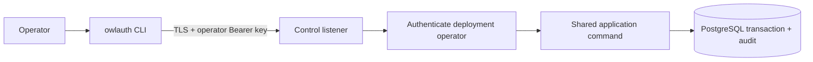

# CLI, plugins, and agent integrations

OwlAuth separates documentation assistance, remote administration, and future agent tools. None of these surfaces may bypass Project isolation or Control authorization.

## Current availability

| Surface | Current status |
| --- | --- |
| `owlauth` CLI | Available with help/version output and checksum-verified self-update only |
| Codex/Claude plugin | Repository-distributed integration skill and reference material only |
| Remote Control commands | Planned; no Project/Application/provider/user commands exist yet |
| MCP server/tools | Planned; no MCP transport or tools exist yet |

The plugin does not bundle a server, launch a local MCP process, expose Project Auth operations, or create credentials. Treat it as documentation and guardrails for the pre-alpha repository.

## Plugin responsibility

The shared source under [`plugins/owlauth`](https://github.com/owlfoundry/owlauth/tree/main/plugins/owlauth) is packaged for Codex and Claude. Its integration skill should help an agent:

- recognize the current scaffold and avoid inventing unavailable routes or commands;
- select the TypeScript, Python, or Rust package identity without claiming implemented auth flows;
- distinguish downstream Project Auth from upstream OAuth/OIDC federation;
- understand that Project/Application IDs and publishable keys are public identifiers, not Control credentials;
- inspect generated OpenAPI as an ephemeral contract view;
- direct security reports to the private disclosure path.

Plugin text or model output is never authority. Do not paste provider secrets, `OWLAUTH_CONTROL_API_KEY`, handoff tickets, access/refresh tokens, PKCE verifiers, cookies, private keys, full callback URLs, or user profiles into agent context.

## Current CLI

Installers download native CLI archives from `cli-v{version}` GitHub Releases and verify them against `SHA256SUMS`. The executable currently supports:

```bash
owlauth --help
owlauth --version
owlauth update --dry-run
owlauth update
```

There are no current commands for Projects, Applications, providers, users, sessions, policy, keys, or audit. The CLI must not access PostgreSQL/Redis, load server modules, run migrations, or host Runtime/Control listeners.

## Target remote Control CLI

The planned CLI is a remote client of the isolated Control listener:



Every future command will need a stable Control contract, deployment-operator authentication, explicit Project target, current revision, safe output, and idempotency/confirmation rules. Local-looking IDs cannot bypass server qualification.

Credentials must come from a TTY prompt, protected file descriptor, OS credential store, or secret-provider integration—not normal process arguments or shell history. Human and machine output remain separate; both redact credential and profile data. Destructive commands require an explicit target and revision plus deliberate confirmation, but confirmation never replaces server authorization.

## Future server-side MCP

MCP is an optional **Control adapter inside `owlauth-server`**, never a local authorization server bundled into an agent plugin and never a Runtime route.

A tool must map to one bounded shared-core command/query with:

- authenticated deployment operator using `OWLAUTH_CONTROL_API_KEY`;
- explicit Project and target revision;
- closed input schema and bounded output;
- deterministic side effects and idempotency policy;
- timeout, rate, and audit policy;
- preview/commit confirmation for high-impact actions without pretending UI approval is additional authority.

MCP will not provide raw SQL, generic HTTP forwarding, repository access, shell/filesystem execution, unrestricted bulk mutation, or export of secrets, provider tokens, sessions, the operator API key, private keys, or user-profile dumps.

### High-impact confirmation

```mermaid
sequenceDiagram
    participant Agent as MCP client
    participant Adapter as Server-side MCP adapter
    participant Core as Shared Control core
    participant PG as PostgreSQL

    Agent->>Adapter: Preview exact typed command
    Adapter->>Core: Authenticate operator key; resolve Project and revisions
    Core->>PG: Store digest of short-lived bound capability
    Adapter-->>Agent: Redacted summary + one-use capability
    Agent->>Adapter: Commit identical command + capability
    Adapter->>Core: Reauthenticate key; validate payload and revisions
    Core->>PG: Consume capability + mutate + audit atomically
    Adapter-->>Agent: Bounded result or stale/replay error
```

The capability binds the fixed deployment-operator actor, tool, normalized command, Project, metadata revision, target revision, and Control audience. PostgreSQL—not Redis—enforces one use in the same transaction as the mutation. Prompt text, tool selection, and UI approval are not authorization.

## External control gateways

A product with organization-aware administration may place its own API/RBAC gateway before OwlAuth Control. The gateway authenticates the tenant administrator, checks membership/roles, maps trusted ownership to Project `belongs_to`, verifies the target and revision, and forwards only allowlisted Control commands with the deployment's server-side operator key.

OwlAuth does not attenuate the operator key or infer tenant ownership from `belongs_to`; the external gateway owns every narrower permission decision. Generic Control forwarding or an operator key exposed to a browser/agent would grant deployment-wide authority.

For the normative target boundary, read the [CLI and MCP specification](https://github.com/owlfoundry/owlauth/blob/main/spec/07-cli-and-mcp-boundaries.md).
