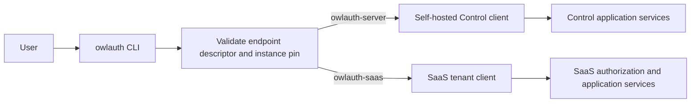
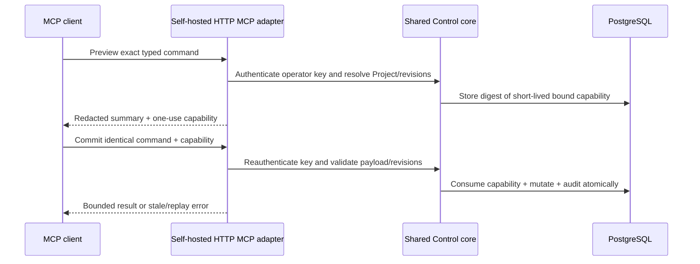

# CLI, plugins, and agent integrations

OwlAuth separates documentation assistance, remote administration, and future agent tools. None of these surfaces may bypass Project isolation or Control authorization.

## Current availability

| Surface | Current status |
| --- | --- |
| `owlauth` CLI | Available with help/version output and checksum-verified self-update only |
| Codex/Claude plugin | Repository-distributed integration skill and reference material only |
| Remote Control commands | Planned; no Project/Application/provider/user commands exist yet |
| MCP server/tools | Planned; no MCP transport or tools exist yet |

The plugin does not bundle a server, launch a local MCP process, expose Project Auth operations, or create credentials. Treat it as documentation and guardrails for the pre-alpha repository.

## Plugin responsibility

The shared source under [`plugins/owlauth`](https://github.com/owlfoundry/owlauth/tree/main/plugins/owlauth) is packaged for Codex and Claude. Its integration skill should help an agent:

- recognize the current scaffold and avoid inventing unavailable routes or commands;
- select the TypeScript, Python, or Rust package identity without claiming implemented auth flows;
- distinguish downstream Project Auth from upstream OAuth/OIDC federation;
- understand that Project/Application IDs and publishable keys are public identifiers, not Control credentials;
- inspect generated OpenAPI as an ephemeral contract view;
- direct security reports to the private disclosure path.

Plugin text or model output is never authority. Do not paste provider secrets, `OWLAUTH_CONTROL_API_KEY`, handoff tickets, access/refresh tokens, PKCE verifiers, cookies, private keys, full callback URLs, or user profiles into agent context.

## Current CLI

Installers download native CLI archives from `cli-v{version}` GitHub Releases and verify them against `SHA256SUMS`. The executable currently supports:

```bash
owlauth --help
owlauth --version
owlauth update --dry-run
owlauth update
```

There are no current commands for Projects, Applications, providers, users, sessions, policy, keys, or audit. The CLI must not access PostgreSQL/Redis, load server modules, run migrations, or host Runtime/Control listeners.

## Target remote CLI

The planned `owlauth` executable supports profiles for both self-hosted and SaaS administration without a user-configured product type. A profile stores a trusted endpoint. Before reading a credential, the CLI validates origin-root `GET /.well-known/owlauth`, confirms/pins the declared product, instance, authority, API base, and credential class on first use, and selects an isolated typed client:



Discovery failure or endpoint identity change fails before credential release. The CLI does not probe both authenticated APIs or switch products after `401`, `403`, `404`, or command failure. A discovered server uses the operator key and full deployment authority; a discovered SaaS endpoint uses a SaaS API key plus current Organization membership, scope, ownership, entitlement, and revisions.

Common Project-management commands share a conceptual interface where SaaS offers a tenant-safe equivalent. Organization, membership, Service Account, SaaS API-key, billing, entitlement, and usage commands are SaaS-only. Shared command names do not share wire DTOs, credentials, IDs, or authorization.

Credentials come from a TTY prompt, protected file descriptor, OS credential store, or secret-provider integration—not normal process arguments or shell history. Human and machine output remain separate; both redact credentials and profile data. Destructive commands require an explicit target/revision and deliberate confirmation, but confirmation never replaces remote authorization.

## Future remote HTTP MCP

OwlAuth defines two separate standards-conformant Streamable HTTP MCP servers:

| Endpoint owner | Authentication | Authority |
| --- | --- | --- |
| self-hosted `owlauth-server` Control | `owl_ctrl_v1_...` operator Bearer key on every request | full deployment operator |
| OwlAuth SaaS API | `owl_saas_v1_...` SaaS API key on every request | current tenant principal, Organization, scope, ownership, entitlement, and revisions |

Each endpoint exposes `mcp` relative to its administrative base URL. The MCP `initialize` exchange identifies `owlauth-server` or `owlauth-saas`, and `tools/list` returns the endpoint's current schemas. MCP clients therefore do not maintain an OwlAuth product-mode tool table. Tool discovery is not authorization; every invocation reauthenticates and reauthorizes.

Neither endpoint is a Runtime route or local plugin process. CLI, plugins, installers, and agent packages never bundle, launch, download, supervise, or impersonate an MCP server. The protected MCP host sends the Bearer header; the key never enters prompt/model context, tools, results, URLs, or protocol session IDs.

A tool maps to one bounded owning-product application command/query with explicit target/revisions, closed input/output, idempotency, timeout/rate/audit policy, and preview/commit confirmation for high-impact actions. MCP does not provide raw SQL, generic HTTP/OpenAPI forwarding, repository access, CLI/shell/filesystem execution, unrestricted bulk mutation, or export of secrets, provider tokens, sessions, operator/API keys, private keys, or user-profile dumps.

### High-impact confirmation



The self-hosted capability binds the fixed deployment-operator actor, tool, normalized command, Project, metadata revision, target revision, and Control audience. PostgreSQL—not Redis—enforces one use in the same transaction as the mutation.

The SaaS endpoint uses its own capability bound to the SaaS principal/API-key ID, Organization, tool, Managed Project/target, permission, entitlement/revisions, and SaaS audience. Commit reauthenticates current SaaS authority, consumes the capability, persists actor-bound command intent, and only then invokes an allowlisted managed Control command. Prompt text, tool discovery, session IDs, and UI approval are not authorization.

## External control gateways

A product with organization-aware administration may place its own API/RBAC gateway before OwlAuth Control. The gateway authenticates the tenant administrator, checks membership/roles, maps trusted ownership to Project `belongs_to`, verifies the target and revision, and forwards only allowlisted Control commands with the deployment's server-side operator key.

OwlAuth does not attenuate the operator key or infer tenant ownership from `belongs_to`; the external gateway owns every narrower permission decision. Generic Control forwarding or an operator key exposed to a browser/agent would grant deployment-wide authority.

For the normative target boundaries, read the [self-hosted CLI and MCP specification](https://github.com/owlfoundry/owlauth/blob/main/spec/07-cli-and-mcp-boundaries.md) and the [SaaS CLI and HTTP MCP specification](https://github.com/owlfoundry/owlauth/blob/main/spec/saas/07-cli-and-http-mcp-surfaces.md).
