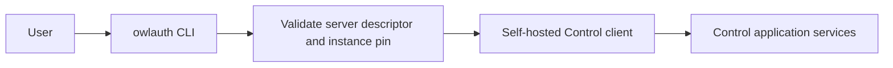

# CLI, plugins, and agent integrations

OwlAuth separates documentation assistance, remote administration, and future agent tools. None of these surfaces may bypass Project isolation or Control authorization.

## Current availability

| Surface                 | Current status                                                                                 |
| ----------------------- | ---------------------------------------------------------------------------------------------- |
| `owlauth` CLI           | Descriptor-pinned self-hosted Control commands and checksum-verified self-update are available |
| Codex/Claude plugin     | Repository-distributed integration skill and reference material only                           |
| Remote Control commands | Typed Project/Application/user/session/provider/key/webhook commands are available             |
| MCP server/tools        | Seven self-hosted read-only Control tools are available when explicitly enabled                |

The plugin does not bundle a server, launch a local MCP process, expose Project Auth operations, or create credentials. Treat it as documentation and guardrails for the Beta repository.

## Plugin responsibility

The shared source under [`plugins/owlauth`](https://github.com/owlfoundry/owlauth/tree/main/plugins/owlauth) is packaged for Codex and Claude. Its integration skill should help an agent:

- recognize the implemented Beta Runtime, backend Client, Control, and Runtime SDK boundaries and avoid inventing deferred routes or commands;
- select the TypeScript, Python, or Rust SDK and preserve its explicit Application-owned navigation, storage, and refresh-coordination boundary;
- distinguish downstream Project Auth from upstream OAuth/OIDC federation;
- understand that Project/Application IDs and publishable keys are public identifiers, Project client keys are backend-only Client credentials, and neither is a Control credential;
- inspect generated OpenAPI as an ephemeral contract view;
- require the component's candidate-bound final evidence manifest before describing an SDK operation as release-qualified; exported methods, package versions, workspace tests, generated OpenAPI, and fixtures alone are insufficient, and current manifests prove one exact Runtime/source coordinate rather than a range;
- direct security reports to the private disclosure path.

Plugin text or model output is never authority. Do not paste provider secrets, `OWLAUTH_CONTROL_API_KEY`, handoff tickets, access/refresh tokens, PKCE verifiers, cookies, private keys, full callback URLs, or user profiles into agent context.

## Current CLI

Installers download native CLI archives from `cli-v{version}` GitHub Releases and verify them against `SHA256SUMS`. The executable currently supports descriptor-pinned self-hosted administration and self-update:

```bash
owlauth profile add local --endpoint https://identity.example --yes
owlauth --profile local system
owlauth --profile local project list
owlauth --profile local project user sessions PROJECT_ID USER_ID
owlauth --profile local application user-event list PROJECT_ID APPLICATION_ID --limit 50
owlauth --profile local webhook delivery list PROJECT_ID APPLICATION_ID --limit 50
owlauth update --dry-run
```

The CLI must not access PostgreSQL/Redis, load server modules, run migrations, or host Runtime/Client/Control listeners. Audit export remains deferred.

## Remote CLI trust model

The `owlauth` executable supports profiles for self-hosted deployments. A profile stores a trusted endpoint. Before reading a credential, the CLI validates origin-root `GET /.well-known/owlauth`, confirms and pins the `owlauth-server` product, instance, authority, API base, and `operator-api-key` credential class on first use, and selects its typed Control client:



Discovery failure or endpoint identity change fails before credential release. The CLI does not infer endpoint identity from `401`, `403`, `404`, or command failure. A discovered server uses the operator key and therefore has full deployment authority.

Credentials come from a TTY prompt, protected file descriptor, OS credential store, or secret-provider integration—not normal process arguments or shell history. Human and machine output remain separate; both redact credentials and profile data. Destructive commands require an explicit target/revision and deliberate confirmation, but confirmation never replaces remote authorization.

## Remote HTTP MCP

The self-hosted server provides a bounded standards-conformant Streamable HTTP MCP Control adapter authenticated by the `owl_ctrl_v1_...` operator Bearer key on every request. It has full deployment-operator authority.

The endpoint exposes `mcp` relative to the administrative base URL. It is disabled by default and enabled with `OWLAUTH_CONTROL_MCP_ENABLED=true`; discovery publishes `mcp_url` only while the route is composed. Its current stateless JSON-response catalog identifies `owlauth-server` and exposes exactly seven read-only tools for system capabilities, Project/Application inventory, and webhook endpoint/delivery inspection. It has no mutation tool, creates no MCP session, and declares no prompts or resources. Tool discovery is not authorization; every invocation reauthenticates the operator key and revalidates current target revisions.

The endpoint is not a Runtime route or local plugin process. CLI, plugins, installers, and agent packages never bundle, launch, download, supervise, or impersonate an MCP server. The protected MCP host sends the Bearer header; the key never enters prompt/model context, tools, results, URLs, or protocol session IDs.

Each tool maps to one bounded Control query with explicit targets, closed input/output, and timeout/rate policy. MCP does not provide raw SQL, generic HTTP/OpenAPI forwarding, repository access, CLI/shell/filesystem execution, mutation, unrestricted bulk reads, or export of secrets, provider tokens, sessions, operator/API keys, private keys, or user-profile dumps. Any future mutation requires a separately reviewed server-enforced authorization, idempotency, audit, and confirmation design before it enters the catalog.

## External control gateways

A product with organization-aware administration may place its own API/RBAC gateway before OwlAuth Control. The gateway authenticates the tenant administrator, checks membership/roles, maps trusted ownership to Project `belongs_to`, verifies the target and revision, and forwards only allowlisted Control commands with the deployment's server-side operator key.

OwlAuth does not attenuate the operator key or infer tenant ownership from `belongs_to`; the external gateway owns every narrower permission decision. Generic Control forwarding or an operator key exposed to a browser/agent would grant deployment-wide authority.

For the normative boundaries, read the [CLI and MCP specification](https://github.com/owlfoundry/owlauth/blob/main/spec/07-cli-and-mcp-boundaries.md).
