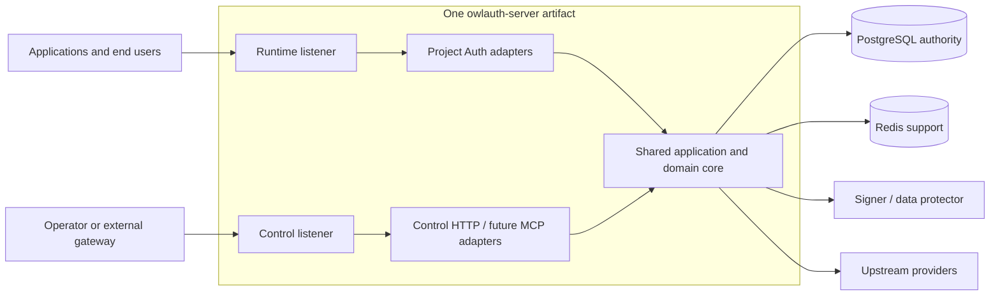
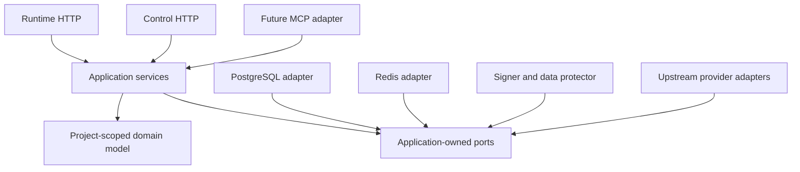

# Architecture

OwlAuth is designed as self-hostable, project-scoped authentication and identity infrastructure. It is a modular monolith: one Rust server artifact, one shared application/domain core, and two isolated transport planes.

::: warning Design versus implementation
This page summarizes the approved target architecture. The current pre-alpha server implements only `/health` and OpenAPI generation. It has no Project model, authentication flow, persistence, tokens, plane separation, migration runner, provider adapter, or key lifecycle yet.
:::

The normative details live in the repository [`spec/`](https://github.com/owlfoundry/owlauth/tree/main/spec).

## Deployment, Project, and Application

| Concept | Meaning |
| --- | --- |
| **Deployment** | One OwlAuth installation and administrative trust domain with one operator policy and PostgreSQL authority. |
| **Project** | The isolation boundary for users, linked identities, provider configuration, browser sessions, Application sessions, refresh families, access tokens, policy, and signing keys. |
| **Application** | A web, mobile, native, or server integration inside one Project, with a public ID, type, allowed origins, and exact post-login redirects. |
| **Provider configuration** | A Project-owned upstream OAuth/OIDC client registration assigned to selected Applications. |
| **Project user** | A stable local user in exactly one Project, linked to one or more verified upstream issuer/subject identities. |

Applications inside one Project intentionally share its user directory and token trust boundary. `app_id` records which Application initiated a session, but the Project is the token issuer and audience boundary. Use separate Projects where Applications must not share users or token trust.

The same upstream account can map independently in different Projects. Email, display name, or avatar data never serves as a cross-Project identity or an automatic linking key.

## What OwlAuth owns

OwlAuth owns:

- upstream GitHub, Google, or OIDC federation;
- Project-scoped users and linked identities;
- login transactions and one-use Application handoff;
- Project browser sessions and Application sessions;
- short-lived Project access tokens and rotating refresh families;
- Project provider configuration and signing-key lifecycle;
- administrative Control operations and security audit.

An application backend still owns business authorization: organizations, team membership, roles, billing, documents, and product-specific policy. OwlAuth does not model tenant memberships or product RBAC.

A Project has optional indexed `belongs_to` metadata for an external control system. OwlAuth treats it as opaque correlation data—not as a tenant, principal, scope, ownership proof, token claim, or implicit query filter.

## Authentication flow

OAuth/OIDC exists only between OwlAuth and the upstream provider. The downstream Application uses OwlAuth's Project Auth protocol.

```mermaid
sequenceDiagram
    actor User
    participant App as Application / SDK
    participant Runtime as OwlAuth Runtime
    participant Provider as Upstream OAuth/OIDC provider
    participant PG as PostgreSQL

    App->>Runtime: Begin login with Project, Application, exact redirect, PKCE challenge
    Runtime->>PG: Validate Project/Application/provider; create bound transaction
    Runtime-->>User: Redirect to upstream provider
    User->>Provider: Authenticate
    Provider-->>Runtime: Code + server-bound state
    Runtime->>Provider: Exchange once; validate issuer and subject
    Runtime->>PG: Resolve Project user; create browser session and one-use handoff
    Runtime-->>App: Exact redirect with opaque handoff ticket
    App->>Runtime: Exchange ticket + PKCE verifier
    Runtime->>PG: Atomically consume ticket and create Application session
    Runtime-->>App: Project user + access token + rotating refresh token
```

Two redirects remain distinct:

1. the **provider callback**, an OwlAuth Runtime URL registered with the upstream provider;
2. the **Application redirect**, an exact Application allowlist entry receiving only a short-lived, one-use, PKCE-bound handoff ticket.

Provider tokens never flow to the Application. OwlAuth access and refresh tokens never appear in redirect URLs.

### Session and token boundaries

A Project browser session can support sign-in reuse among active Applications in the same Project. Each Application then receives its own Application session and refresh family. Application disablement invalidates that Application's state without logging the user out of other Applications; Project or user disablement invalidates all affected Runtime state through authoritative revisions.

Project access tokens are short-lived signed JWTs with exact Project issuer/audience, Project user subject, `app_id`, session ID, timestamps, type, unique token ID, and claims revision. Backends must verify signature, allowlisted algorithm, `kid`, issuer, audience, type, and time claims.

Refresh tokens are opaque and one-use. Rotation is serialized in PostgreSQL. Reuse of a consumed generation revokes the entire family; a lost ambiguous refresh response requires reauthentication rather than replaying the old token indefinitely.

## Runtime and Control planes



### Runtime / Protocol Plane

Runtime is public and latency-sensitive. The target surface covers public Project/Application configuration, login start, provider callback, handoff exchange, current user, refresh, logout, and Project JWKS. Every operation is Project-qualified.

### Control Plane

Control administers Projects, Applications, provider registrations, users, sessions, policies, keys, management principals, and audit. It uses a separate listener, credential audience, middleware, scopes, CORS, rate/concurrency budgets, and network exposure. Public Project IDs, Application IDs, publishable keys, Project tokens, and provider credentials are never Control credentials.

The two routers remain isolated even in combined mode; routing by `Host` on one untrusted socket is not equivalent to listener separation.

## Shared core and packages



- `crates/owlauth-server` is the single server package. The target shared core, adapters, composition, and embedded migrations remain here.
- `crates/owlauth-types` owns public Runtime, Control, and health wire vocabulary plus OpenAPI derivation—not domain entities or database rows.
- `crates/owlauth-cli` is a remote Control client. It cannot depend on the server, access storage, or load keys.
- `sdks/*` consume the public Runtime Project Auth contract. The Rust SDK receives no privileged server dependency.

Dependencies point inward. HTTP frameworks, SQL rows, Redis clients, provider payloads, CLI types, MCP schemas, and SDK code cannot become the domain model.

## Storage and consistency

PostgreSQL is the sole transactional authority for Project ownership, identities, login state, handoff consumption, sessions, refresh rotation, revocation, policy, management access, keys, and audit. Security-critical mutations use Project-qualified predicates, constraints, conditional updates, and transactions.

Redis is non-authoritative. It may coordinate rate limits, cache public configuration/JWKS, and carry invalidation hints. Losing or flushing Redis must not change identity, grant duplicate credential use, undo revocation, activate a key, or cross a Project boundary.

Migration files belong in `crates/owlauth-server/migrations/` and are embedded in the server artifact. A configured migration capability will apply pending migrations before listeners become ready; serving pools need no DDL privilege. This runner is target design and is not implemented today.

## Composition and deployment modes

The target one-binary interface has three composition modes:

```text
owlauth-server serve --plane=all
owlauth-server serve --plane=runtime
owlauth-server serve --plane=control
```

These commands are **not currently available**. `all` will bind both isolated listeners in one process; `runtime` and `control` will compose only their adapters. Every mode uses the same schema and domain rules. A split topology runs the same artifact against shared PostgreSQL; Runtime never calls Control for ordinary requests.

Physical separation is justified by scaling, private Control placement, resource quotas, region placement, or operational ownership—not by duplicating policy or creating independent authorities.

## Contract authority

Reviewed Rust definitions in `crates/owlauth-types` are the public wire/OpenAPI authority. Runtime and Control contracts remain separate. Generated OpenAPI is a derived, ephemeral artifact and is never committed. A generated operation cannot expose a route or grant authorization by itself.
