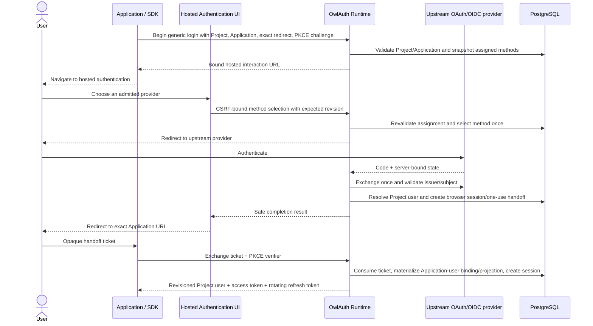
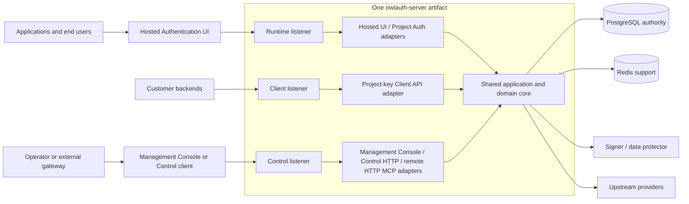
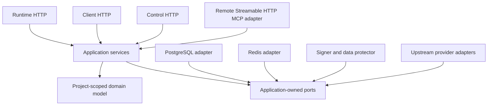

# Architecture

OwlAuth is designed as self-hostable, project-scoped authentication and identity infrastructure. It is a modular monolith: one Rust server artifact, one shared application/domain core, and three isolated transport planes.

::: warning Current Beta scope
The repository delivers PostgreSQL-backed Project, Application, provider, SMTP, signing-key, user, projection, and webhook state; isolated Runtime, Client, and Control planes; embedded Hosted Authentication and Management Console surfaces; OIDC and passwordless-email login; managed provider renewal and bounded profile synchronization; PKCE handoff; Project JWT/session/refresh/logout lifecycle; signed durable projection webhooks; a backend-only Client OpenAPI; an optional remote self-hosted Control MCP adapter; and TypeScript, Python, and Rust Runtime protocol SDKs. Pre-1.0 interfaces and deployment requirements may change. Beta is not deployment certification or a production support commitment: operators own hardening, monitoring, upgrades, and tested backup/PITR/restore. SCIM, bulk directory/export, hosted multi-tenant control, and a general downstream OAuth authorization-server surface are outside the product.
:::

The normative details live in the repository [`spec/`](https://github.com/owlfoundry/owlauth/tree/main/spec).

## Deployment, Project, and Application

| Concept                         | Meaning                                                                                                                                                                         |
| ------------------------------- | ------------------------------------------------------------------------------------------------------------------------------------------------------------------------------- |
| **Deployment**                  | One OwlAuth installation and administrative trust domain with one operator policy and PostgreSQL authority.                                                                     |
| **Project**                     | The isolation boundary for users, linked identities, provider configuration, browser sessions, Application sessions, refresh families, access tokens, policy, and signing keys. |
| **Application**                 | A web, mobile, native, or server integration inside one Project, with a public ID, type, allowed origins, and exact post-login redirects.                                       |
| **Provider configuration**      | A Project-owned upstream OAuth/OIDC client registration assigned to selected Applications.                                                                                      |
| **Managed provider connection** | An optional server-only renewable credential lifecycle for bounded linked-identity profile synchronization; never a token vault for Applications.                               |
| **Project user**                | A stable local user in exactly one Project, linked to explicitly proven upstream and/or first-party email identities.                                                           |
| **Application user projection** | A bounded revisioned view returned to one Application and optionally synchronized by signed durable webhooks after that Application has seen the user.                          |

Applications inside one Project intentionally share its user directory and token trust boundary. `app_id` records which Application initiated a session, but the Project is the token issuer and audience boundary. Use separate Projects where Applications must not share users or token trust.

The same upstream account can map independently in different Projects. Email, display name, or avatar data never serves as a cross-Project identity or an automatic linking key.

## What OwlAuth owns

OwlAuth owns:

- upstream GitHub, Google, or OIDC federation and bounded managed profile synchronization;
- first-party verified email OTP and magic-link authentication through Project-selected SMTP;
- Project-scoped users, explicitly linked identities, and monotonic user revisions;
- login transactions and one-use Application handoff;
- Project browser sessions and Application sessions;
- short-lived Project access tokens and rotating refresh families;
- Project provider/SMTP configuration and signing-key lifecycle;
- bounded Application user projections and signed durable webhook synchronization;
- administrative Control operations and security audit.

An application backend still owns business authorization: organizations, team membership, roles, billing, documents, and product-specific policy. OwlAuth does not model tenant memberships or product RBAC.

A Project has optional indexed `belongs_to` metadata for an external control system. OwlAuth treats it as opaque correlation data—not as a tenant, principal, scope, ownership proof, token claim, or implicit query filter.

## Authentication flow

OAuth/OIDC exists only between OwlAuth and the upstream provider. The downstream Application uses OwlAuth's Project Auth protocol.



Two redirects remain distinct:

1. the **provider callback**, an OwlAuth Runtime URL registered with the upstream provider;
2. the **Application redirect**, an exact Application allowlist entry receiving only a short-lived, one-use, PKCE-bound handoff ticket.

A Project can instead admit email in the generic transaction. The Hosted UI selects email once, then accepts the address; challenge creation and a mail outbox pinned to one SMTP configuration generation and eligibility revision commit together. Proof completion revalidates that pinned PostgreSQL eligibility, so disabling or marking the generation compromised denies later proof even if an SMTP attempt already delivered it. Verification resolves a first-party email identity and then produces the same exact-redirect, PKCE-bound handoff. Start/verification errors do not reveal whether an address exists, and matching provider email never silently links identities.

Provider access tokens never flow to the Application. Provider dispatch uses a closed, persisted kind rather than issuer-based fallback: generic OIDC excludes the reserved named issuers; Google uses the exact `https://accounts.google.com` issuer through the strict OIDC profile; GitHub uses fixed OAuth endpoints, requests exactly `read:user`, and identifies an account only by its immutable numeric REST user ID. GitHub is login-only and cannot authorize identity mutation or managed profile synchronization.

OwlAuth may retain an encrypted least-scope renewable credential only when the selected provider kind supports managed profile synchronization; it cannot be used for caller-selected provider APIs. OwlAuth access and refresh tokens never appear in redirect URLs. Handoff, refresh, and current-user return one bounded projection with Project-user `user_revision` and Application-specific `projection_revision`, while optional signed webhooks asynchronously update only Applications that already have a binding to that user.

### Session and token boundaries

A Project browser session can support sign-in reuse among active Applications in the same Project only after an explicit same-origin Hosted UI confirmation. Runtime derives the session from its hardened cookie, revalidates Project/user/session/auth-age/policy revisions, and races confirmation against provider/email selection on the login transaction; page input cannot name a user or session. Each Application then receives its own Application session and refresh family. Application disablement invalidates that Application's state without logging the user out of other Applications; Project or user disablement invalidates all affected Runtime state through authoritative revisions.

Project access tokens are short-lived signed JWTs with exact Project issuer/audience, Project user subject, `app_id`, session ID, timestamps, type, unique token ID, and claims revision. Backends must verify signature, allowlisted algorithm, `kid`, issuer, audience, type, and time claims.

Refresh tokens are opaque and one-use. Rotation is serialized in PostgreSQL. Reuse of a consumed generation revokes the entire family; a lost ambiguous refresh response requires reauthentication rather than replaying the old token indefinitely.

## Runtime, Client, and Control planes



### Runtime / Protocol Plane

Runtime is public and latency-sensitive. Its implemented surface covers the Hosted Authentication UI, public Project/Application configuration, generic login start and OIDC method selection, provider proof completion, handoff exchange, current user, refresh, logout, and Project JWKS. Runtime-capable processes own the worker executors for Runtime identity and Application behavior as those capabilities ship; asynchronous work must not make Control availability or webhook delivery part of a login commit. Every operation is Project-qualified.

### Client Plane

Client is a secret-bearing, backend-only JSON API on its own listener. Customer backends authenticate with a Project-bound `owl_client_v1` key created and acknowledged through Control; browsers, Runtime SDKs, publishable Application keys, Project tokens, and the operator key are not Client credentials. Its minimal surface provides Project user directory reads, exact user lookup, Application projection reads, and online Project-token introspection. It serves no HTML, static assets, redirects, cookies, CORS grants, CLI discovery, Console, MCP, or credential-management routes. Client uses a separate PostgreSQL pool, readiness roster/digest-version proof, listener budget, and plane-local admission process bound.

### Control Plane

Control currently serves the embedded Management Console, the credential-free origin-root `/.well-known/owlauth` CLI descriptor, the implemented Project, Application, provider, user, session, policy, and key APIs, and an optional bounded Streamable HTTP MCP endpoint. Broader audit administration remains planned. Control accepts only the deployment's `OWLAUTH_CONTROL_API_KEY`; a valid Bearer key has full deployment Control authority and is not stored in PostgreSQL. The Console keeps it only in active page memory. Public Project IDs, Application IDs, publishable keys, Project tokens, and provider credentials are never Control credentials.

The three routers remain isolated even in combined mode. Distinct Runtime and Control origins are recommended because they isolate the Console's in-memory operator key from public Runtime script execution. An explicitly configured shared origin requires disjoint non-root paths, Runtime cookie path containment, no service workers, restrictive opener policy, and deliberate acceptance of one browser/XSS trust boundary; routing by `Host` or path on one untrusted socket is not equivalent to the required internal listener separation.

The accepted hosted-web stack is one private React 19/TypeScript/Vite 8 package in the repository pnpm workspace with two independent visual builds. Runtime and Control have separate generated clients, entry graphs, output roots, manifests, and Rust embeds; they share no emitted chunk. Client has a third plane-pure OpenAPI 3.1 document but deliberately has no browser bundle or SDK. Rust serves only manifest-allowlisted embedded assets and generates external-only strict-CSP shells from configured plane bases. Node.js is a build tool and is absent from the server runtime, published-binary asset path, and final container.

## Shared core and packages



- `crates/owlauth-server` is the single server package. The shared core, adapters, composition, and embedded migrations remain here.
- `crates/owlauth-types` owns public Runtime, Client, Control, and health wire vocabulary plus plane-pure OpenAPI derivation—not domain entities or database rows.
- `crates/owlauth-cli` is the remote client for self-hosted Control, with endpoint-discovered profiles pinned to the OwlAuth server product, instance, authority, API base, and operator credential class before credential release. It cannot depend on the server implementation, access storage, load keys, or launch local MCP.
- `sdks/*` consume the public Runtime Project Auth contract. The Rust SDK receives no privileged server dependency.

Dependencies point inward. HTTP frameworks, SQL rows, Redis clients, provider payloads, CLI types, MCP schemas, and SDK code cannot become the domain model.

## Storage and consistency

PostgreSQL is the sole transactional authority for Project ownership, identities/managed connections, login/email challenge state, handoff consumption, sessions, refresh rotation, user revisions/Application bindings and projections, mail/webhook outboxes, revocation, policy, keys, and audit. The deployment operator key is process configuration, not database state. Security-critical mutations use Project-qualified predicates, constraints, conditional updates, and transactions.

Redis is non-authoritative. It may coordinate rate limits, cache public configuration/JWKS, and carry invalidation hints. Losing or flushing Redis must not change identity, grant duplicate credential use, undo revocation, activate a key, or cross a Project boundary.

SeaORM 2 implements ordinary PostgreSQL repositories. SQLx 0.9 embeds migration files from `crates/owlauth-server/migrations/`, coordinates PostgreSQL startup migration locking, and verifies exact serving-schema compatibility. `OWLAUTH_MIGRATION_MODE` defaults to `auto`; `verify` performs no DDL. Runtime, Client, and Control use independent serving pools on one database authority, and SeaORM schema sync is disabled.

## Composition and deployment modes

The implemented one-binary interface selects one of four composition modes through configuration:

```text
OWLAUTH_MODE=all owlauth-server
OWLAUTH_MODE=runtime owlauth-server
OWLAUTH_MODE=client owlauth-server
OWLAUTH_MODE=control owlauth-server
```

`all` binds all three isolated listeners in one process; `runtime`, `client`, and `control` compose only the selected plane's adapters. The executable accepts no serving command arguments. Every mode uses the same schema and domain rules, and a split topology runs the same artifact against shared PostgreSQL without Runtime or Client calling Control for ordinary requests.

Physical separation is justified by scaling, private Control placement, resource quotas, region placement, or operational ownership—not by duplicating policy or creating independent authorities.

## Contract authority

Reviewed Rust definitions in `crates/owlauth-types` are the public wire/OpenAPI authority. Runtime, Client, and Control contracts remain separate. Generated OpenAPI is a derived, ephemeral artifact and is never committed. A generated operation cannot expose a route or grant authorization by itself.
