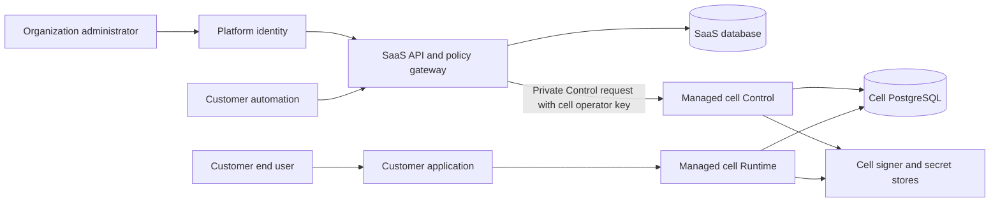
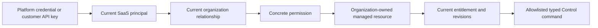
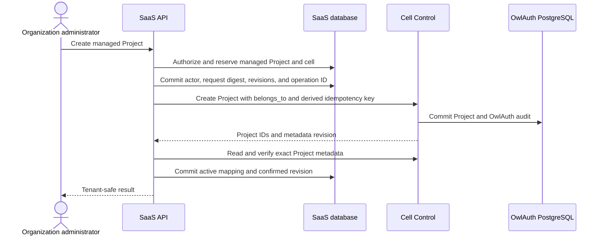

# Building a SaaS with OwlAuth

OwlAuth is a self-hosted authentication service, not a hosted multi-tenant control product. It does not provide organizations, tenant roles, customer API keys, subscriptions, billing, fleet placement, or tenant-scoped Control credentials.

You can nevertheless use ordinary OwlAuth deployments as the authentication cells behind a SaaS product. Your service owns tenant identity, authorization, commercial policy, and orchestration; OwlAuth continues to own Project users, login, sessions, tokens, provider configuration, and signing keys.

::: warning Integration guide, not a built-in mode
This chapter describes an architecture you can build around OwlAuth. The repository does not ship a hosted SaaS service, tenant API or CLI client, tenant console, billing system, or managed-cell orchestrator. Do not expose OwlAuth's deployment operator key to customers.
:::

## System boundary

A production design normally has three distinct authorities:

1. your **SaaS control service**, with its own database for accounts, organizations, memberships, roles, subscriptions, and managed-resource ownership;
2. an optional, isolated **platform identity deployment** used to authenticate people entering your SaaS console;
3. one or more **managed OwlAuth cells** that serve customer Projects.

The SaaS service is the tenant policy-enforcement point. It calls only published OwlAuth Control APIs; it must not import `owlauth-server`, share its repositories, or read or write an OwlAuth database directly.

A managed cell is one OwlAuth administrative trust domain. It includes an `owlauth-server` deployment, PostgreSQL, optional Redis, a separately preserved software custody root or custom-provider authority, public Runtime ingress, backend-only Client ingress, private Control ingress, and one deployment operator key. A cell can hold Projects for several organizations only when your trusted SaaS service is the sole operator.

## Keep identities separate

The same person can have several unrelated identities:

| Identity            | Meaning                                                   | Authority                                         |
| ------------------- | --------------------------------------------------------- | ------------------------------------------------- |
| SaaS account        | person allowed to authenticate to your management product | platform identity plus current SaaS account state |
| Organization member | SaaS account with current roles in one organization       | your SaaS database                                |
| Service account     | non-human principal belonging to one organization         | your SaaS database                                |
| Project user        | end user authenticating to one customer Project           | the assigned OwlAuth cell                         |

A Project user must never gain organization administration rights merely because an email address, provider account, or display name matches a SaaS account. Authentication proves a subject; your SaaS database remains authoritative for current membership, role, resource ownership, and commercial state.

## Data ownership

Keep one clear authority for each fact:

| Concern                                                                                | Authority                                                                                |
| -------------------------------------------------------------------------------------- | ---------------------------------------------------------------------------------------- |
| Accounts, organizations, memberships, invitations, roles, and service accounts         | SaaS database                                                                            |
| Customer API-key digests, scopes, expiry, and revocation                               | SaaS database                                                                            |
| Subscription, entitlement, quota, and billing interpretation                           | SaaS database and the explicitly reconciled payment-provider contract                    |
| Cell placement and organization-to-Project registry                                    | SaaS database                                                                            |
| Project users, identities, applications, providers, sessions, tokens, and signing keys | assigned OwlAuth cell                                                                    |
| OwlAuth Project `belongs_to`                                                           | checked copy of an external organization identifier, never ownership authority by itself |
| External actor attribution                                                             | SaaS audit record                                                                        |
| Accepted OwlAuth Control action                                                        | OwlAuth audit record with the fixed `deployment_operator` actor                          |

An organization may own several managed Projects. A managed Project should have one stable organization owner and cell assignment in your registry. Treat cell migration as an explicit migration product because issuer URLs, callbacks, keys, sessions, provider secrets, and recovery authority are deployment-sensitive.

## Tenant authorization gateway

OwlAuth Control accepts one `OWLAUTH_CONTROL_API_KEY` and grants it full authority over the deployment. It does not attenuate that key by organization, role, Project, or `belongs_to`. Your gateway must perform every narrower authorization decision before using it.

For each customer management request:

01. parse and bound the request;
02. authenticate exactly one SaaS account or service account;
03. resolve current principal and organization status;
04. resolve current membership or service-account grants;
05. authorize one concrete product permission;
06. resolve the target managed resource through your registry;
07. verify that the target belongs to the authorized organization;
08. evaluate current entitlement, lifecycle state, and revisions;
09. commit a durable actor-bound operation before any external side effect;
10. map the operation to a closed, typed OwlAuth Control command;
11. call the trusted cell Control origin with its operator key;
12. finalize or reconcile the original operation and preserve correlation across both audit streams.

Never expose a generic Control proxy, arbitrary path and body forwarding, caller-selected cell origins, or raw OwlAuth Project IDs that bypass organization-qualified lookup. A valid operator key would make any such mistake deployment-wide.

## Use `belongs_to` only as a consistency check

When provisioning a managed Project, set its OwlAuth `belongs_to` metadata to your organization's stable opaque public identifier. Store the returned OwlAuth Project IDs and metadata revision in your own managed-Project registry.

Before sensitive Project-bound mutations, resolve the Project from your registry and verify the exact current `belongs_to` and metadata revision. A mismatch should:

- fail the customer operation closed;
- create a security and reconciliation signal;
- prevent best-effort mutation;
- require repair from authoritative registry and OwlAuth state.

Caller-supplied `belongs_to` is never proof of ownership. Changing it alone is not a safe organization-transfer workflow.

## Provision Projects with a durable saga

Your SaaS database and OwlAuth PostgreSQL cannot share one transaction. Provisioning therefore needs an explicit, idempotent saga:

Derive a globally unique Control idempotency key from the durable SaaS operation ID; do not forward a customer idempotency value directly into OwlAuth's deployment-wide namespace. If the external result is ambiguous, reconcile the same operation using the retained idempotent result or authoritative reads. Do not create a replacement Project merely because a timeout occurred.

Useful managed-resource states include `provisioning`, `active`, `updating`, `suspending`, `disabled`, `provisioning_failed`, and `reconciliation_required`. Protect those transitions with your own monotonic revision independently of OwlAuth's metadata revision.

## Keep Runtime and Client off the management critical path

Customer applications and end users should use the assigned OwlAuth Runtime directly. Customer backends should use the assigned Client listener with a Project client key for user-directory reads, exact lookup, Application projection reads, and online token introspection. A healthy Runtime or Client request should not synchronously depend on:

- your SaaS API or console;
- platform identity;
- the payment provider;
- the cell's Control listener;
- a fleet reconciliation worker.

If you place a global Runtime edge in front of cells, it needs an authoritative and safely cached Project-to-cell routing design. Public Project identifiers must be fleet-unique when routing by Project ID alone; otherwise include an authoritative cell or region namespace. Do not turn the Runtime edge into a synchronous tenant-RBAC or billing dependency.

## Credential boundaries

Use different credentials and secret namespaces for each trust domain:

| Credential                      | Accepted by                       | Meaning                                                 |
| ------------------------------- | --------------------------------- | ------------------------------------------------------- |
| Platform identity credential    | SaaS API                          | authenticated management subject only                   |
| Customer API key                | SaaS API                          | SaaS principal plus a scope ceiling                     |
| Cell operator API key           | one managed cell Control listener | full deployment Control authority                       |
| Project client key              | one managed cell Client listener  | one Project's backend directory/introspection authority |
| Application publishable key     | managed Runtime                   | public Application identification and abuse attribution |
| Project access or refresh token | managed Runtime/customer backend  | Project user and Application session context            |

A customer API key must never be forwarded to OwlAuth. A cell operator key must never appear in customer responses, browsers, tenant records, logs, traces, metrics, support bundles, or agent context. Project client keys are one-time Control reveals that must be acknowledged only after durable external secret-manager storage; they belong exclusively in customer backend custody and never in browsers, Runtime SDK configuration, URLs, or frontend bundles. Use one operator key per cell to limit blast radius, and keep Control ingress private even though network position does not replace Bearer authentication.

If you issue customer API keys, store only a versioned digest and safe lookup metadata after one-time secret display. Effective permission should be the intersection of the key's immutable scope ceiling and the principal's current permissions. Revoking membership or disabling the principal must therefore remove authority immediately.

## Cells, failures, and recovery

A cell is the unit of administrative trust, capacity, backup, recovery, and incident blast radius. Keep Platform Identity and managed customer cells separate in production, including PostgreSQL authority, operator keys, signer namespaces, secret stores, and recovery paths.

| Failure                                | Management behavior                                            | Customer Runtime behavior                                     |
| -------------------------------------- | -------------------------------------------------------------- | ------------------------------------------------------------- |
| SaaS database unavailable              | fail tenant management closed                                  | continue from cell authority                                  |
| SaaS API unavailable                   | console and automation unavailable                             | continue                                                      |
| Platform identity unavailable          | new administrator login affected                               | continue                                                      |
| Cell Control unavailable               | affected commands fail or reconcile                            | Runtime and Client continue if their dependencies are healthy |
| Cell Client unavailable                | backend directory/introspection requests fail                  | browser Runtime authentication continues                      |
| Cell Runtime or PostgreSQL unavailable | affected cell unavailable                                      | affected cell unavailable                                     |
| Operator-key mismatch                  | Control calls fail until rotation/reconciliation               | Runtime and Client credentials remain independent             |
| Payment provider unavailable           | preserve bounded last-confirmed commercial state and reconcile | continue                                                      |

Bound work per cell with deadlines, concurrency limits, circuit breakers, and queues so one unhealthy cell cannot exhaust fleet control capacity. Persist actor attribution and operation intent before workers perform an external effect. Revalidate organization, managed-resource, entitlement, and OwlAuth revisions immediately before that effect.

Back up the SaaS registry, platform identity deployment, and each managed cell as separate authorities. After restoring different authorities from different points in time, fail ownership-sensitive management closed until the registry and OwlAuth Project metadata are reconciled. Never repair ownership automatically from ambiguous evidence.

## Billing and metering

Prefer initial billing models derived from SaaS-authoritative management state, such as active managed Projects, configured Applications, administrator seats, enabled features, region, or dedicated-cell class. They avoid placing billing instrumentation in the authentication hot path.

Do not bill from ordinary logs, metrics, or security audit events unless you define a durable meter contract covering:

- the exact qualifying event;
- organization and Project attribution;
- stable idempotency identity;
- event and receipt time semantics;
- replay, late arrival, correction, and backfill;
- retention and privacy;
- completeness and reconciliation;
- behavior during source or billing outages.

Runtime-volume billing such as monthly active users or successful authentications requires an explicit durable aggregate or outbox contract. Authentication must not wait synchronously for the SaaS billing service or payment provider. Subscription cancellation should follow deliberate grace, notification, suspension, recovery, export, and retention policy rather than allowing a payment webhook to disable OwlAuth directly.

## Recommended implementation order

1. Build organization, membership, role, and managed-Project registry authority.
2. Add a narrow typed gateway for the minimum OwlAuth Control operations you expose.
3. Implement actor-bound durable operations, idempotent provisioning, and reconciliation.
4. Isolate cell operator keys and private Control networking.
5. Route customer Runtime traffic independently from management availability.
6. Add service accounts and customer API keys only when automation needs them.
7. Start commercial enforcement from management-owned resource limits.
8. Add Runtime-derived meters only after defining and testing a durable measurement contract.
9. Add dedicated cells, regions, or migration only when product requirements justify their operational cost.

## Security checklist

Before serving multiple organizations, verify at least:

- cross-organization resource and child-ID substitution is denied;
- caller-supplied cell, Project, and `belongs_to` values cannot override registry resolution;
- stale SaaS and OwlAuth revisions fail closed;
- API-key scope ceilings intersect current principal permissions;
- disabled accounts, service accounts, organizations, and credentials lose authority;
- no endpoint behaves as a generic Control proxy;
- operator keys are redacted and unique per cell;
- failed and ambiguous provisioning is reconciled without duplicate resources;
- platform identity and managed customer cells are operationally isolated;
- Runtime and Client remain independent from SaaS, Control, and billing outages;
- restore-time ownership drift blocks mutation until reconciliation.

OwlAuth's own test suite provides evidence for the specifically exercised Project-isolation and server invariants. It does not certify a deployment or prove the tenant isolation, billing correctness, fleet orchestration, or cross-system recovery of the SaaS layer you build around it.
