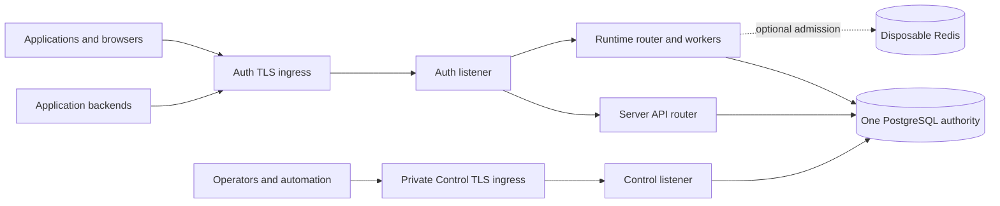

# Deployment

This guide describes the deployment behavior implemented by the current OwlAuth server artifact. It is an operator checklist, not a supported Helm chart, Kubernetes operator, systemd unit, or managed-service promise.

::: warning Beta deployment scope
OwlAuth is pre-1.0. Configuration and schema requirements may change between reviewed releases. The published image and binaries are tested artifacts, but they do not certify a particular infrastructure design. Before carrying production traffic, operators must review the release, harden its network and secret boundaries, and prove backup, point-in-time recovery, restore, upgrade, and rollback procedures in their own environment.
:::

## Supported artifacts

A `server-v{version}` release provides:

- native `owlauth-server` archives and `SHA256SUMS` in the GitHub Release;
- the versioned tag `ghcr.io/owlfoundry/owlauth:{oci-version-tag}`;
- `ghcr.io/owlfoundry/owlauth:latest`, promoted only after the versioned release succeeds;
- exact-version Runtime, Server API, and Control OpenAPI documents.

Use a version tag or a resolved image digest for production. For a release SemVer containing build metadata, the OCI tag replaces `+` with `_`: release `1.2.3+build.1` publishes image tag `1.2.3_build.1`. The `dev` tag follows `main`; `build-*` tags are branch test images. Neither is a production release coordinate.

The final image contains the server binary, embedded Runtime and Control assets, CA certificates, `curl`, and `tini`. It runs as UID/GID `10001`, has no Node.js build tools, and defaults to:

```text
OWLAUTH_MODE=auth
OWLAUTH_AUTH_ADDR=0.0.0.0:8080
```

The image's built-in health check calls `http://127.0.0.1:8080/health`. Override that check when running `control` mode, changing the Auth bind port, or using a non-root Auth base path.

## Topology

OwlAuth is one server artifact with two externally meaningful endpoints:



Auth always contains both the public Runtime surface and the backend-only Server API surface. They share one listener and transport budget, but retain separate routers, credentials, CORS policy, admission, readiness inputs, state, and PostgreSQL pools. Control has its own listener, operator credential, HTTP budget, and pool.

Choose one composition:

| `OWLAUTH_MODE` | Listeners        | Intended use                                                          |
| -------------- | ---------------- | --------------------------------------------------------------------- |
| `all`          | Auth and Control | Small installation or first operational qualification                 |
| `auth`         | Auth only        | Public/runtime and backend-serving process, including Runtime workers |
| `control`      | Control only     | Privately placed administration process                               |

A split deployment runs `auth` and `control` processes from the same released artifact against the same PostgreSQL server and database. There is no Auth-to-Control RPC in the ordinary request path. Do not create separate databases for the two processes.

For production, prefer distinct Auth and Control origins. Control accepts one deployment-wide operator key with full administrative authority, so bind it to a private network and expose it only through an operator-controlled ingress. Network placement supplements the Bearer credential; it does not replace it.

## Prepare configuration

The executable reads configuration only from environment variables and rejects every unknown `OWLAUTH_*` name before binding a listener. It has no serving subcommand and no compatibility aliases. The committed [`.env.example`](https://github.com/owlfoundry/owlauth/blob/main/.env.example) is the complete local-development starting inventory, not a production secret file.

Create a reviewed environment independently for each process. Preserve the same deployment identity, database authority, protection material, and fleet roster where a value is shared, but do not inject credentials a process does not need merely for template convenience.

### Generate independent secrets

All protection and digest roots are exactly 32 random bytes encoded as unpadded base64url. Generate every root independently; configuration rejects reuse across active and retained protection authorities.

One portable generation pattern is:

```bash
openssl rand -base64 32 | tr '+/' '-_' | tr -d '=\n'
```

A Control key is the fixed prefix plus an independently generated 32-byte value:

```bash
printf 'owl_ctrl_v1_'
openssl rand -base64 32 | tr '+/' '-_' | tr -d '=\n'
printf '\n'
```

Do not copy any key from `.env.example`. Store the resulting values in an approved secret manager and deliver them without command-line arguments, shell history, logs, image layers, or agent context. The published binary does not implement generic `*_FILE` aliases; if the platform exposes files, use a protected launcher that reads them and constructs the exact documented environment before `exec`.

The bundled image uses `OWLAUTH_SOFTWARE_CUSTODY_KEY` as its static software-custody root. It has no online rotation or retained-key mechanism and must never be replaced in place. Losing it makes PostgreSQL protected material unrecoverable; restoring a different value is not recovery.

### Required configuration groups

Start from `.env.example`, replacing every development value. Review these groups rather than treating the file as an opaque blob:

| Group                    | Important variables and rules                                                                                                                                                  |
| ------------------------ | ------------------------------------------------------------------------------------------------------------------------------------------------------------------------------ |
| Composition and identity | `OWLAUTH_MODE`, one stable `OWLAUTH_INSTANCE_ID`, and Auth fleet identity described below                                                                                      |
| Listener identity        | `OWLAUTH_AUTH_ADDR`, `OWLAUTH_AUTH_BASE_URL`, `OWLAUTH_CONTROL_ADDR`, `OWLAUTH_CONTROL_BASE_URL`                                                                               |
| Control authority        | `OWLAUTH_CONTROL_API_KEY` on `all` or `control` processes                                                                                                                      |
| PostgreSQL               | `OWLAUTH_POSTGRES_URL`, optional per-surface and migration URLs, pool bounds, migration mode and timeouts                                                                      |
| Custody and protection   | software custody, Runtime, email identity, projection email, managed reauthorization, identity-mutation evidence, managed credential, and Server-key digest roots and versions |
| Admission                | `OWLAUTH_ADMISSION_DIGEST_KEY`, optional Redis URL, namespace, timeout, and maximum Auth process count                                                                         |
| Fleet readiness          | `OWLAUTH_AUTH_PROCESS_ID`, `OWLAUTH_REQUIRED_AUTH_PROCESS_IDS`, and Server digest readiness lease TTL                                                                          |
| Outbound delivery        | optional deployment SMTP generation, extra DER trust anchors, and exact private-IP exceptions                                                                                  |
| Transport bounds         | independent `OWLAUTH_AUTH_*` and `OWLAUTH_CONTROL_*` timeout, body, in-flight, connection, header, and URI limits                                                              |
| Shutdown                 | `OWLAUTH_SHUTDOWN_TIMEOUT_MS`, default `10000`                                                                                                                                 |

For the official executable and image, the selected mode requires these roots in addition to the listener and PostgreSQL settings:

| Selected mode      | Required configuration beyond the common groups                                                                                                                        |
| ------------------ | ---------------------------------------------------------------------------------------------------------------------------------------------------------------------- |
| Every mode         | instance ID; software custody; projection-email protection; managed-reauthorization digest/protection; identity-mutation-evidence digest/protection; Server-key digest |
| `auth` or `all`    | Auth process ID; Runtime digest/protection; managed-credential protection; admission digest                                                                            |
| `control` or `all` | Control operator API key                                                                                                                                               |
| `control`          | explicit required Auth process roster                                                                                                                                  |

The email-identity ring is optional as a complete group. Its absence is not automatic generation or a way to use plaintext email authority: verified/durable email capabilities fail closed in their scope. If any email-identity variable is present, provide its active version, digest key, and protection key together. Use the complete local template to identify delivered capability inputs, then remove a group only after confirming the selected mode and intended feature do not require it.

Set `OWLAUTH_PROVIDER_ALLOW_HTTP_LOOPBACK=false` or omit it in production. HTTP is accepted only for an explicitly opted-in IP-literal loopback development provider; normal provider origins require HTTPS.

## External URLs, TLS, and ingress

`OWLAUTH_AUTH_BASE_URL` and `OWLAUTH_CONTROL_BASE_URL` are trusted external identities. Each must be an absolute HTTP(S) URL with a canonical trailing-slash path and no query, fragment, user information, percent encoding, or backslash. OwlAuth derives hosted links, cookies, callback identities, Control discovery, and MCP origin policy from these values—not from the request `Host`, `Forwarded`, or `X-Forwarded-*` headers.

The server currently binds plain HTTP sockets. Terminate production TLS at a reverse proxy or load balancer and forward to the configured listener address. There is no server TLS-certificate setting and no trusted-forwarding mode.

A straightforward distinct-origin configuration is:

```dotenv
OWLAUTH_AUTH_ADDR=0.0.0.0:8080
OWLAUTH_AUTH_BASE_URL=https://auth.example.com/
OWLAUTH_CONTROL_ADDR=0.0.0.0:8081
OWLAUTH_CONTROL_BASE_URL=https://control.internal.example.com/
```

The ingress must:

- preserve the configured path prefix instead of silently rewriting it;
- route Auth and Control to their independently bound listeners;
- enforce bounded header, URI, body, connection, and deadline settings before OwlAuth's own bounds;
- reject spoofed forwarding headers according to the ingress's policy, even though OwlAuth ignores them;
- restrict Control to intended operator networks and identities;
- keep Server API routes on Auth reachable only from intended application backends where network policy permits.

OwlAuth uses the direct TCP peer for source admission. Behind a proxy, that peer is the proxy, not the original browser. Forwarding headers do not restore per-user source identity. Account for that behavior when sizing ingress limits and OwlAuth admission policy; do not claim end-user-IP rate limiting through an unsupported proxy mode.

Distinct origins are recommended. If Auth and Control intentionally share one origin, both base URLs must use disjoint, non-root, non-overlapping paths, for example `/identity/` and `/identity-control/`. This accepts one browser/XSS trust boundary. The Control CLI descriptor remains at `/.well-known/owlauth` on the Control origin even when the Console/API use a non-root Control base, so the proxy must route that exact origin-root path to Control.

When a base path is not `/`, probes move under it as well. For `OWLAUTH_AUTH_BASE_URL=https://example.com/identity/`, use `/identity/health` and `/identity/ready`. Override the image health check accordingly.

### Provider callbacks and Application redirects

Provider callbacks are derived by OwlAuth and are not operator-supplied aliases. The route is:

```text
{OWLAUTH_AUTH_BASE_URL}projects/{project_public_id}/auth/callback/{provider_key}
```

Use the exact callback returned by the Control provider preflight/onboarding flow when configuring GitHub, Google, or custom OIDC. Do not infer a callback from an internal bind address or proxy header.

Application redirects are a separate exact allowlist configured on each Application. They receive a one-use PKCE-bound handoff ticket, not an upstream provider token. Changing the Auth external base changes newly derived callback identity and is therefore a reviewed migration, not a routine load-balancer edit.

## PostgreSQL

PostgreSQL is the durable authority. `OWLAUTH_POSTGRES_URL` is required. Optional URLs can provide distinct credentials and roles for Runtime, Server API, Control, and migration:

```text
OWLAUTH_RUNTIME_POSTGRES_URL
OWLAUTH_SERVER_POSTGRES_URL
OWLAUTH_CONTROL_POSTGRES_URL
OWLAUTH_MIGRATION_POSTGRES_URL
```

All five URLs must resolve to the same hostname, port, and database path. User names, passwords, and URL options may differ. Configuration rejects a different server or database before listener binding.

Runtime, Server API, and Control have separate pools with defaults of 20, 10, and 5 maximum connections respectively. Capacity planning must multiply each enabled pool by the number of processes and leave room for the dedicated migration connection and operational access. A combined `all` process can therefore open all three pools; an `auth` process opens Runtime and Server pools; a `control` process opens Control only.

For hardened role separation:

1. provision the database and roles outside OwlAuth;
2. give serving roles the DML/sequence access their surface requires plus read access to `_sqlx_migrations`;
3. use a separate migration login for `OWLAUTH_MIGRATION_POSTGRES_URL`;
4. optionally set `OWLAUTH_MIGRATION_OWNER_ROLE` to a lowercase non-login owner role that the migration login may assume.

The binary validates and activates that owner role with `SET ROLE`, but it does not provision database users, passwords, grants, TLS policy, replicas, backups, or connection pooling for the operator. The repository does not currently publish a tested minimum `GRANT` manifest for separate Runtime, Server API, and Control roles; derive and audit privileges against the released migrations before enabling that separation.

### Schema startup modes

`OWLAUTH_MIGRATION_MODE` supports exactly:

- `auto` (default): connect through the migration URL, apply the embedded SQLx migrations under PostgreSQL's migration lock and bounded lock/statement/whole-run deadlines, close that dedicated connection, then verify exact history before creating serving pools;
- `verify`: perform no DDL and require the serving URL's migration count, versions, success state, and checksums to match the binary exactly.

Every serving pool independently repeats exact history verification. An absent history table, failed migration, pending/missing version, checksum mismatch, or unexpected newer version prevents startup. Do not edit an applied migration, delete SQLx history, or point different surfaces at look-alike databases.

Use `auto` only in a controlled schema-change phase. Run ordinary replicas in `verify` after the exact release schema is installed. Concurrent `auto` starts are lock-coordinated, but that is not a zero-downtime compatibility guarantee. The executable has no migration-only mode: after a successful `auto` migration it continues normal startup and can serve its selected endpoint, so keep the controlled migrator isolated from traffic until the rollout is approved.

## Auth fleet identity and scaling

Every Auth process requires one stable `OWLAUTH_AUTH_PROCESS_ID`. `OWLAUTH_REQUIRED_AUTH_PROCESS_IDS` is the unique comma-separated roster that must be ready for fleet-wide protection and Server-key digest transitions. Entries are not whitespace-trimmed. If omitted on an Auth process it defaults to that process alone; a Control-only process must receive the roster explicitly. The configuration accepts at most 64 roster entries.

For multiple Auth replicas:

- assign a stable unique process ID to each logical replica slot;
- deploy the same roster and every shared protection/digest ring to each process that consumes it, while keeping mode-only roots scoped to their owning process;
- set `OWLAUTH_AUTH_MAX_PROCESSES` to a conservative upper bound at least as large as the roster and no greater than 64;
- keep one `OWLAUTH_INSTANCE_ID` for the deployment;
- use one admission namespace and digest root across the Auth fleet;
- add or remove roster members as an explicit staged operation, not an autoscaler side effect.

A starting Auth process claims a new incarnation for its stable process ID. A replacement makes the older incarnation's readiness evidence stale, so the old process becomes unready rather than continuing to represent the slot. Load balancers must remove it on `/ready`. The roster mechanism supports deliberate replacement; it does not make arbitrary ephemeral IDs or unbounded autoscaling safe.

Runtime background workers for mail, provider-exchange recovery, managed synchronization, webhooks, and key/readiness maintenance run in Auth processes. Scale Auth with both request and worker load in mind. Control processes do not replace those workers.

## Redis

`OWLAUTH_ADMISSION_REDIS_URL` is optional and accepts `redis://` or `rediss://`. Redis coordinates distributed Runtime/Server admission counters; it is not identity, session, revocation, key, or migration authority.

Without Redis, OwlAuth uses the conservative per-process share derived from `OWLAUTH_AUTH_MAX_PROCESSES`. If configured Redis times out or fails, admission enters a sticky conservative local fallback for the current quota window. Redis recovery, loss, flush, or failover cannot add quota because successful distributed decisions also consume the local share.

Do not restore Redis as identity state. It may be flushed or recreated during disaster recovery. Monitor `runtime_admission_backend_error`, `runtime_admission_fallback_entered`, and `runtime_admission_backend_recovered` log events if Redis is configured.

## Run the container

Pull and pin a release first:

```bash
export OWLAUTH_VERSION='X.Y.Z'
export OWLAUTH_IMAGE_TAG="${OWLAUTH_VERSION//+/_}"
docker pull "ghcr.io/owlfoundry/owlauth:${OWLAUTH_IMAGE_TAG}"
docker image inspect "ghcr.io/owlfoundry/owlauth:${OWLAUTH_IMAGE_TAG}"
```

A combined process can be started from a protected, production-specific environment file:

```bash
docker run --detach \
  --name owlauth \
  --restart unless-stopped \
  --env-file /etc/owlauth/owlauth.env \
  --publish 127.0.0.1:8080:8080 \
  --publish 127.0.0.1:8081:8081 \
  "ghcr.io/owlfoundry/owlauth:${OWLAUTH_IMAGE_TAG}"
```

The environment file must set `OWLAUTH_MODE=all`, bind both listeners to container-reachable addresses, use external HTTPS base URLs, and contain independently generated production credentials. Loopback host publication above assumes a same-host reverse proxy; choose network attachment and publication appropriate to the actual ingress.

For split containers, give Auth and Control separate environment files and publish only their selected listener. A Control container must override the image default mode/address and its fixed Auth health check, for example with an orchestrator probe against its configured Control `/health` path. If a mounted DER trust anchor is used, make it an absolute in-container path readable by UID `10001`; each file must contain exactly one valid DER certificate and be at most 65,536 bytes.

The repository's `dev/compose.yml` and `.env.example` are disposable local-development infrastructure. They use public credentials and are not a production Compose template.

## Probes and lifecycle

Both selected listeners expose unauthenticated JSON probes under their configured base path:

| Probe         | Success                        | Meaning                                                                             |
| ------------- | ------------------------------ | ----------------------------------------------------------------------------------- |
| `GET /health` | `200 {"status":"ok"}`          | The listener event loop can answer; this does not check PostgreSQL or key readiness |
| `GET /ready`  | `200 {"status":"ok"}`          | The selected endpoint can admit business traffic                                    |
| `GET /ready`  | `503 {"status":"unavailable"}` | Startup, draining, or an endpoint-critical readiness input is unavailable           |

Auth readiness checks the startup/draining flag, Runtime PostgreSQL/exact-incarnation readiness, and Server-key digest fleet readiness. Control readiness reflects successful startup and draining state; it is not a fresh database query on every probe. Neither probe certifies Redis, live SMTP delivery, webhook destinations, every upstream provider, background-worker progress, backup correctness, or the production environment. Use `/ready` for load-balancer admission and `/health` only for process liveness.

Configuration, provider composition, migrations, serving-pool creation, provider/key reconciliation, and selected socket binding complete before readiness is enabled. In `all` mode both sockets bind before either is marked ready.

On `SIGTERM` or `Ctrl-C`, OwlAuth marks listeners unready and begins graceful HTTP-server and Runtime-worker drain before closing pools and exiting. The drain deadline is `OWLAUTH_SHUTDOWN_TIMEOUT_MS` (10 seconds by default); maintenance-task cleanup and pool close happen afterward, so it is not an absolute whole-process exit deadline. Set the orchestrator termination grace period longer than this deadline. The image runs under `tini`, which forwards `SIGTERM` to the server.

## Observability

The executable emits newline-delimited JSON logs to standard output. `RUST_LOG` controls the tracing filter and defaults to `info`. Preserve structured fields such as `event`, request/correlation identifiers, endpoint, and safe failure class, while enforcing the [Security](/guide/security) disclosure rules at collection and export.

At minimum alert on:

- process exit or restart loops;
- `/ready` failures and prolonged drain;
- schema, pool, provider-readiness, custody, and Server-digest startup failures;
- admission fallback/recovery events;
- mail, webhook, managed-provider, signing-key, and readiness-maintenance failures;
- PostgreSQL saturation, lock/statement timeouts, replication/backup health, and storage growth.

The current server does not expose a Prometheus endpoint, bundled OpenTelemetry exporter, dashboard, or alert rules. Add infrastructure-level metrics and log-derived alerts without logging credentials, tokens, callback query values, email addresses, webhook bodies, or profiles.

## Upgrade and rollback

Treat a server upgrade as an artifact, configuration, key-ring, and schema change together.

1. Read the exact release notes and pin the version/digest.
2. Back up PostgreSQL and the complete matching custody/configuration recovery set.
3. Restore that set in an isolated environment and qualify the new binary with `OWLAUTH_MIGRATION_MODE=verify` when no schema change is expected, or `auto` in a controlled migration phase when one is included.
4. If a migration is required, drain business traffic unless the release explicitly documents and proves mixed-version compatibility. Run one controlled `auto` process, then start the target release replicas in `verify` mode.
5. Require each selected endpoint's `/ready` before admitting traffic. Replace Auth slots deliberately so stable process IDs and fleet readiness remain observable.
6. Keep the previous artifact and pre-upgrade recovery point until post-upgrade authentication, Server API, Control, worker, and backup checks pass.

Do not assume an old binary can restart after a new migration. Exact history verification rejects unexpected forward versions, and the project does not promise universal N/N-1 schema compatibility. If rollback cannot use the upgraded schema, keep traffic blocked and restore PostgreSQL plus the matched custody/configuration set to the pre-upgrade recovery point. Never “roll back” by editing SQLx history or replacing unreadable keys.

## Backup, restore, and disaster recovery

One recoverable set includes:

- PostgreSQL physical backup and continuous WAL/PITR history, or the managed-service equivalent;
- `OWLAUTH_SOFTWARE_CUSTODY_KEY` or the exact custom provider authority;
- every active and retained protection/digest key with its version mapping;
- deployment and Auth process identities, exact external base URLs, database-role configuration, admission namespace, and provider/SMTP trust configuration;
- the Control operator credential and externally custodied one-time Project server keys as required by their consumers.

A database-only backup is insufficient. PostgreSQL protected envelopes and signing handles remain bound to the matching custody authority. Redis is disposable and is not part of identity recovery.

Test this restore sequence continuously:

1. block all external traffic;
2. restore the custody/provider authority and exact process configuration;
3. restore PostgreSQL to one selected point;
4. start the complete declared Auth roster from the matched release in an isolated network with `OWLAUTH_MIGRATION_MODE=verify`;
5. require every Auth `/ready`, exercise opening protected material plus signing and verification against committed JWKs, and inspect durable mail, webhook, and managed-provider worker recovery;
6. start the intended Control process or processes in `verify`, require each `/ready`, and inspect administrative and signing-lifecycle recovery;
7. reopen traffic only after the complete Auth roster and intended Control endpoints are ready.

An unreadable live envelope, missing retained key, or signing handle that cannot produce a signature verifiable by its committed public JWK is a restore failure. Do not generate a replacement and declare recovery successful. Run a later schema upgrade as a separate operation after the restored release is proven.

## Production readiness checklist

Before admitting users, verify all of the following:

- a normalized released image tag or digest is pinned; `dev`, `build-*`, and mutable `latest` are not the deployment coordinate;
- every example credential has been replaced by an independent secret and the recovery set is escrowed and restore-tested;
- Auth and Control external URLs, base paths, TLS certificates, callback registrations, and ingress routes match exactly;
- Control is private and distinct-origin unless one shared browser trust boundary was explicitly accepted;
- all PostgreSQL URLs identify one authority, pool totals fit capacity, migration ownership is reviewed, and PITR is healthy;
- every Auth replica has a stable process ID, the same explicit roster/rings, a bounded maximum process count, and working `/ready` removal;
- proxy and OwlAuth transport limits are aligned, with deliberate handling of direct-peer admission behind the proxy;
- provider, SMTP, and webhook egress policies and private-IP exceptions are least-privilege and monitored;
- graceful termination, worker recovery, Redis fallback, schema failure, key loss, and PostgreSQL restore have been exercised;
- log collection and alerting are operational without exporting sensitive data.

Continue with [Architecture](/guide/architecture) for system boundaries and [Security](/guide/security) for key lifecycle, token verification, browser safety, and disclosure requirements.
