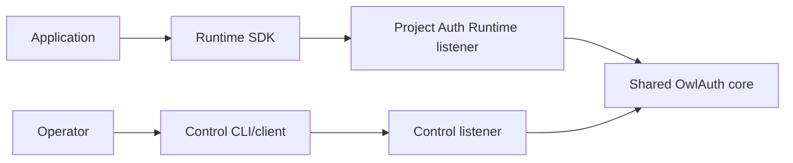

# SDKs

OwlAuth maintains package identities for first-party TypeScript, Python, and Rust Runtime clients.

::: warning Placeholder packages
The current SDKs contain only a `Client` that stores a base URL. They do not make HTTP requests, initialize a Project/Application, start login, process a handoff, issue or refresh tokens, persist sessions, or map Project Auth errors. The target APIs below are design direction, not callable examples.
:::

## Packages and compatibility

| Language | Registry package | Import | Current runtime floor |
| --- | --- | --- | --- |
| TypeScript | `@owlauth/client` | `@owlauth/client` | Node.js 20+ |
| Python | `owlauth-client` | `owlauth` | Python 3.11+ |
| Rust | `owlauth-client` | `owlauth_client` | repository Rust baseline |

Each SDK follows independent SemVer and release tags (`typescript-v{version}`, `python-v{version}`, and `rust-v{version}`). Server and SDK versions do not move in lockstep; compatibility must be expressed as tested Runtime contract ranges rather than matching numbers.

## Target client boundary

An SDK will initialize from public Project/Application configuration:

- trusted OwlAuth Runtime base URL;
- public `project_id`;
- public `application_id`;
- a publishable Application key or configuration revision where required.

These values select and attribute an integration. They are not secrets, user credentials, Project access tokens, or Control authority.

Default SDKs target the **Runtime Project Auth contract only**. Administrative Control operations require a deliberately isolated client module or the remote CLI. The Rust SDK gets no privileged path to `owlauth-server`, PostgreSQL, domain entities, or key providers.

## Target sign-in lifecycle

The planned high-level SDK flow is:

1. generate fresh PKCE verifier/challenge and correlation state with a CSPRNG;
2. call Runtime login start for the exact Project, Application, provider, and registered redirect;
3. hand off explicitly to a browser or native user agent;
4. capture the Application redirect and remove the ticket from browser history promptly;
5. validate state, expiry, Project/Application context, and handoff success/error exclusivity;
6. exchange the one-use ticket directly with the PKCE verifier;
7. return the bounded Project user, Application session metadata, short-lived access token, and rotating refresh token.

The SDK never collects the user's upstream password. It never receives provider tokens. Opening a browser is an explicit application action, not a hidden constructor side effect.

## Multiple Applications in one Project

Applications in a Project share its user directory and token trust boundary. A Project browser session may allow the user to authenticate another active Application without returning to the provider, subject to current Project policy.

Each Application still has its own redirects, origins, status, Application session, and refresh family. SDK state must bind the exact Application. An SDK must not use a ticket, refresh token, or session from one Application or Project in another.

## Token lifecycle

Target SDK behavior includes:

- redacted secret wrappers where the language supports them;
- short-lived access-token expiry handling with a documented skew window;
- single-flight refresh for one refresh family within a process;
- atomic replacement through an application-provided token store;
- no blind retry after an ambiguous handoff or refresh response;
- reauthentication after a definitive expired, revoked, replayed, or indeterminate refresh outcome;
- explicit compare-and-swap or external serialization for multi-process token stores.

SDKs do not silently choose persistent storage. The application supplies a reviewed store or keeps credentials in memory. Browser storage, native secure storage, backup, concurrency, and deletion need platform-specific designs.

An application backend—not the browser SDK—verifies Project access-token signature, algorithm, Project issuer/audience, type, time claims, and required Application/session context. Business authorization remains in the backend.

## Generated and handwritten layers

Reviewed Rust definitions in `crates/owlauth-types` produce separate Runtime and Control OpenAPI descriptions in the target architecture. The OpenAPI artifact is generated ephemerally from the exact source revision and is not committed.

Generated code may own wire models, serialization, endpoint declarations, and low-level operations. Handwritten code owns transport policy, PKCE custody, redirect handling, refresh coordination, token-store integration, safe retries, and idiomatic errors.

The three clients share semantic behavior while using native conventions such as promises and `AbortSignal`, Python exceptions and typing, or Rust `Result` and non-exhaustive errors.

## Error semantics

Target public errors distinguish configuration, protocol, login, handoff, authentication, session, refresh, rate limiting, transport, timeout, cancellation, and an **indeterminate** one-use operation. Errors include a stable safe code/category, optional correlation ID, and retry classification.

Raw bodies, authorization headers, callback URLs, tokens, tickets, PKCE verifiers, cookies, provider details, and HTTP-library implementation exceptions are not stable public error data. Equivalent server responses map to equivalent semantic classes in every SDK.

## Validation stages

Machine-readable fixtures and conformance cases live under [`sdks/spec/`](https://github.com/owlfoundry/owlauth/tree/main/sdks/spec). The current corpus is intentionally small and does not prove Project Auth behavior.

Current CI can truthfully run package builds, type/lint checks, unit tests, OpenAPI generation checks, and fixture/conformance tests. Mock transport tests are unit or contract tests—not end-to-end tests.

When Runtime Project Auth is implemented, CI must start a real OwlAuth server with isolated PostgreSQL, Redis/key configuration as applicable, Projects, Applications, and provider test doubles or approved test providers. TypeScript, Python, and Rust clients must then exercise the same claimed flows. No placeholder suite should be labeled E2E before that exists.

## Security expectations

SDK logs, errors, debug output, snapshots, telemetry, and fixtures must redact provider callback values, handoff tickets, Project access/refresh tokens, PKCE verifiers, cookies, and client/provider secrets. Production transport requires HTTPS, certificate and hostname verification, bounded responses, deadlines, and origin-safe redirect policy.

Read the language-neutral [SDK specifications](https://github.com/owlfoundry/owlauth/tree/main/sdks/spec) for the normative target behavior.
