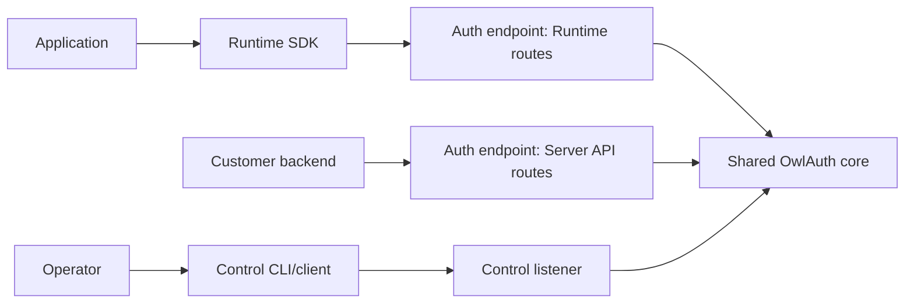

# SDKs

OwlAuth maintains Beta first-party TypeScript, Python, and Rust Runtime protocol clients.

::: warning Beta API
The SDKs implement public configuration and JWKS retrieval, generic Hosted login start, caller-held PKCE state, callback validation and handoff exchange, refresh, current user, Application logout, browser-logout preparation, and stable redacted errors. They remain pre-1.0 and may change independently. Exact-artifact qualification proves one source commit, Runtime contract, corpus, archive, and runtime coordinate; it is not a broad compatibility range, deployment certification, or production support commitment.
:::

## Packages and compatibility

| Language   | Registry package  | Import            | Current runtime floor    |
| ---------- | ----------------- | ----------------- | ------------------------ |
| TypeScript | `@owlauth/client` | `@owlauth/client` | Node.js 20+              |
| Python     | `owlauth-client`  | `owlauth`         | Python 3.11+             |
| Rust       | `owlauth-client`  | `owlauth_client`  | repository Rust baseline |

Each SDK follows independent SemVer and release tags (`typescript-v{version}`, `python-v{version}`, and `rust-v{version}`). Server and SDK versions do not move in lockstep. Current qualification proves one exact source commit, Runtime contract digest, corpus digest, and SDK archive digest rather than a broad server range; matching version numbers do not imply compatibility.

TypeScript publishes one package, `@owlauth/client`. Its protocol API uses the same Web-standard core in the declared browser and Node.js matrices; there is no separately published browser package or `@owlauth/client/browser` entry point.

## SDK boundary

An SDK initializes from public Project/Application configuration:

- trusted OwlAuth Auth base URL;
- public `project_id`;
- public `application_id`;
- a publishable Application key or configuration revision where required.

These values select and attribute an integration. They are not secrets, user credentials, Project access tokens, or Control authority.

Default SDKs target the **Runtime Project Auth contract only**. They reject Server API and Control operation/security imports. Administrative Control operations use the remote CLI or another deliberately isolated operator client. Customer backends call the separate Server API from generated code or direct HTTP; OwlAuth does not publish an official Server API SDK. The Rust SDK gets no privileged path to `owlauth-server`, PostgreSQL, domain entities, or key providers.



## Customer backend Server OpenAPI

Every server release attaches three independent exact-version documents:

- `owlauth-runtime-openapi.json` for browser/native Project Auth SDKs;
- `owlauth-server-openapi.json` for customer backend user reads and online token introspection;
- `owlauth-control-openapi.json` for deployment administration.

Generate a customer-owned Server API library with any OpenAPI 3.1-compatible tool, or call the five JSON endpoints directly. Supply a Project server key only from a trusted backend as one `Authorization: Bearer` credential. Never place that key in browser/native code, Hosted assets, URLs, cookies, or Runtime SDK configuration.

For a source checkout, export the same document deterministically:

```bash
cargo run --locked -p owlauth-types --bin export-openapi -- \
  server owlauth-server-openapi.json
```

The Server document is a wire contract, not an OwlAuth authorization/business SDK: customer code still owns organizations, billing, business permissions, repositories, caching policy, and framework integration.

## Sign-in lifecycle

The explicit protocol flow is:

1. the SDK generates a fresh PKCE verifier/challenge, correlation state, and bound pending-transaction value with a CSPRNG;
2. the SDK calls generic Runtime login start for the exact Project, Application, and registered redirect; Runtime and Hosted UI remain authoritative for the admitted method selection;
3. the Application retains the pending transaction and explicitly navigates a browser or native user agent to the returned target;
4. the Application captures the redirect, removes the ticket from browser history or equivalent platform state promptly, and supplies the callback plus retained transaction to the SDK;
5. the SDK validates state, expiry, Project/Application context, and handoff success/error exclusivity;
6. the SDK exchanges the one-use ticket directly with the PKCE verifier without blind retry;
7. the SDK returns the bounded Project user, Application session metadata, and one typed access/refresh credential-pair result.

The SDK never collects the user's upstream password or receives provider tokens. It does not navigate, mutate history, choose storage, install interceptors, or maintain framework session state; those behaviors belong to the Application or another integration library.

## Multiple Applications in one Project

Applications in a Project share its user directory and token trust boundary. A Project browser session may allow the user to authenticate another active Application without returning to the provider, subject to current Project policy.

Each Application still has its own redirects, origins, status, Application session, and refresh family. SDK state must bind the exact Application. An SDK must not use a ticket, refresh token, or session from one Application or Project in another.

## Token lifecycle

Core SDK behavior includes:

- redacted secret wrappers where the language supports them;
- short-lived access-token timing metadata with a documented skew window;
- one explicit refresh operation that accepts one generation and returns its successor pair as one result;
- no blind retry after an ambiguous handoff or refresh response;
- typed outcomes that require reauthentication after a definitive expired, revoked, replayed, or indeterminate refresh result.

The Application or an external stateful integration owns pending-state and credential persistence, single-flight refresh, atomic compare-and-swap replacement, backup, concurrency, and deletion. The core SDK does not silently retain credentials or provide `localStorage`, native keychain, filesystem, backend-session, or framework adapters.

An application backend—not a TypeScript client running in the browser—verifies Project access-token signature, algorithm, Project issuer/audience, type, time claims, and required Application/session context. Business authorization remains in the backend.

## Generated and handwritten layers

Reviewed Rust definitions in `crates/owlauth-types` produce separate Runtime, Server API, and Control OpenAPI descriptions. Documents are generated ephemerally from the exact source revision and are not committed; exact-version copies are attached to server releases.

Generated code may own wire models, serialization, endpoint declarations, and low-level operations. Handwritten core SDK code owns transport policy, PKCE custody, callback validation, safe one-use request semantics, Project/Application isolation, redaction, and idiomatic errors. Application or separate integration code owns navigation, history mutation, persistence, refresh coordination, and framework state.

The three clients share semantic behavior while using native conventions such as promises and `AbortSignal`, Python exceptions and typing, or Rust `Result` and non-exhaustive errors.

## Error semantics

Public errors distinguish configuration, protocol, login, handoff, authentication, session, refresh, optional SaaS/ingress rate limiting, transport, timeout, cancellation, and an **indeterminate** one-use operation. Errors include a stable safe code/category, optional correlation ID, and retry classification. A valid Core `408 request_timeout` is a caller-decision `Timeout` for non-sensitive operations, but is `Indeterminate` with the existing quarantine action for a dispatched handoff, refresh, or logout operation because the server deadline may expire after authority work starts. Malformed `408` responses fail conservatively as invalid responses.

Raw bodies, authorization headers, callback URLs, tokens, tickets, PKCE verifiers, cookies, provider details, and HTTP-library implementation exceptions are not stable public error data. Equivalent server responses map to equivalent semantic classes in every SDK.

## Optional debug logging

All three clients provide an optional debug hook and leave it disabled by default. TypeScript accepts `debugHook` in `ClientOptions`; Python accepts `debug_hook` on `Client`; Rust exposes `Client::with_debug_hook` and the `DebugHook` trait without requiring a logging facade. One real network attempt emits at most one immutable completion event with only operation, `GET`/`POST`, closed outcome, elapsed milliseconds, dispatch status, and optional status/safe error fields. A failing hook is isolated from the protocol result.

Events never contain a URL/path/query, headers, cookies, body, redirect/callback, Project/Application/publishable identifiers, email/profile/projection data, OAuth state, PKCE, handoff, access/refresh credentials, transport object, exception object, or arbitrary error message. Applications may forward these closed events to their logger, but must not wrap the transport with raw request/response logging.

## Operation traceability

The claimed surface is the following language-neutral set. The generated contract and shared corpus establish wire and semantic parity; the same-server journey exercises each public operation through exact installed candidate bytes.

| Operation ID                    | TypeScript                                                          | Python                                                                 | Rust                                                                   | Same-server behavior                                                                                                      |
| ------------------------------- | ------------------------------------------------------------------- | ---------------------------------------------------------------------- | ---------------------------------------------------------------------- | ------------------------------------------------------------------------------------------------------------------------- |
| `get_public_application_config` | `getPublicConfiguration()`                                          | `get_public_configuration()`                                           | `public_configuration()`                                               | Reads the admitted context and rejects wrong Project, Application, and publishable-key combinations                       |
| `get_project_jwks`              | `getProjectJwks()`                                                  | `get_project_jwks()`                                                   | `project_jwks()`                                                       | Requires an authoritative non-empty key set with current revision metadata                                                |
| `start_login`                   | `beginLogin()`                                                      | `begin_login()`                                                        | `begin_login()`                                                        | Starts ordinary, replay/race, logout, and fault journeys through Runtime and Hosted UI                                    |
| `exchange_handoff`              | `validateCallback()` plus `exchangeHandoff()`, or `completeLogin()` | `validate_callback()` plus `exchange_handoff()`, or `complete_login()` | `validate_callback()` plus `exchange_handoff()`, or `complete_login()` | Confirms success, rejects local replay, and maps a dropped committed response to an indeterminate result without retry    |
| `refresh_session`               | `refresh()`                                                         | `refresh()`                                                            | `refresh()`                                                            | Confirms successor rotation, predecessor replay rejection, concurrent family invalidation, and dropped-response ambiguity |
| `get_current_user`              | `currentUser()`                                                     | `current_user()`                                                       | `current_user()`                                                       | Confirms the Project-user/Application-projection binding and denial after revocation where applicable                     |
| `logout_application_session`    | `logoutApplication()`                                               | `logout_application()`                                                 | `logout_application()`                                                 | Confirms revocation and post-logout denial; a dropped committed response quarantines credentials                          |
| `prepare_browser_logout`        | `prepareBrowserLogout()`                                            | `prepare_browser_logout()`                                             | `prepare_browser_logout()`                                             | Returns a Hosted confirmation target without navigation; the live journey confirms subsequent refresh denial              |

The raw same-server fragments record the exact observed operation IDs for each participating SDK and the fault-injected subset. Final manifests may mark an operation `sameServer: passed` only when that list exactly equals the candidate descriptor's claimed operations.

## Validation and release evidence

Machine-readable fixtures and required schema-versioned conformance cases live under [`sdks/spec/`](https://github.com/owlfoundry/owlauth/tree/main/sdks/spec). Package builds, type/lint checks, unit tests, OpenAPI checks, and fixture conformance remain distinct from interoperability evidence.

One archive is built per component and bound to a canonical candidate descriptor containing its SHA-256 digest, version, source commit, workflow run/attempt, contract digests, claimed operations, and corpus digest. Clean consumers install those exact bytes rather than importing workspace source. The same archive then passes:

| Component  | Exact-artifact package matrix                        | Same-server matrix   | Browser boundary                                                                                               |
| ---------- | ---------------------------------------------------- | -------------------- | -------------------------------------------------------------------------------------------------------------- |
| TypeScript | Node.js 20, 22, and 24; Vite 8.1.5 production bundle | Chromium and Firefox | The externally installed tarball's browser bundle executes in both real browsers                               |
| Python     | Python 3.11, 3.12, 3.13, and 3.14                    | Chromium job         | The wheel uses its normal HTTP transport; a bounded raw helper drives Hosted/provider navigation               |
| Rust       | Stable Rust                                          | Chromium job         | An external Cargo consumer uses the extracted `.crate`; a bounded raw helper drives Hosted/provider navigation |

Chromium and Firefox are the current declared browser baseline. WebKit and Safari are not currently supported.

The real-server suite starts one OwlAuth Auth/Control process topology with isolated PostgreSQL and key/configuration stores. Browser-direct product custody, backend product custody, TypeScript, Python, and Rust receive distinct Project/Application assignments and mutable credentials while sharing that server coordinate. Firefox runs the TypeScript assignment; Chromium runs all three SDK assignments. Backend-custody product evidence does not imply that every core SDK owns backend state.

After all package and same-server fragments pass, CI creates `typescript-final-evidence.json`, `python-final-evidence.json`, and `rust-final-evidence.json`. Each manifest binds the candidate descriptor, exact archive, matrices, per-operation coverage, assignments, and same-server commit. Release workflows verify the component manifest against the tag/run candidate, attach it to the GitHub Release, and publish the already-qualified archive without rebuilding it. Non-PR runs attest candidate archives/descriptors and final manifests.

Mock transport tests remain unit or contract tests, never end-to-end tests. Exported methods, generated OpenAPI, workspace tests, conformance fixtures, or a package version alone are not release qualification. Current manifests prove an exact Runtime/source coordinate, not a compatibility range or production support.

## Security expectations

SDK logs, errors, debug output, snapshots, telemetry, and fixtures must redact provider callback values, handoff tickets, Project access/refresh tokens, PKCE verifiers, cookies, and client/provider secrets. Production transport requires HTTPS, certificate and hostname verification, bounded responses, deadlines, and origin-safe redirect policy.

Read the language-neutral [SDK specifications](https://github.com/owlfoundry/owlauth/tree/main/sdks/spec) for normative behavior and the exact Application-owned state boundary.
