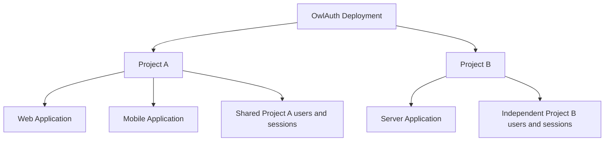

::: danger Pre-alpha implementation
The repository is **not a working Project Auth service yet**. The current server exposes only `GET /health` and generated OpenAPI for that scaffold. Project login, hosted authentication pages, the Management Console, upstream-provider integration, persistence, sessions, token issuance, Runtime and Control APIs, migrations, and MCP are not implemented. The SDKs currently store only a base URL. Do not use this release for production authentication.
:::

## The product model

A single OwlAuth **Deployment** is one administrative trust domain. It can contain many isolated **Projects**. A Project represents one product or related application family, and contains one or more **Applications**.

Applications in one Project share users and Project token trust. Applications that require isolated users or token audiences belong in separate Projects. A person using the same GitHub identity in two Projects maps to two independent Project users.

OwlAuth owns authentication, identity linking, Project sessions, and Project token claims. Your application backend still owns business authorization—organizations, memberships, billing roles, document access, and other product policy.

## OAuth/OIDC is upstream only

OwlAuth brokers sign-in to a Project's configured upstream provider, then returns an OwlAuth Project user and session credentials through a one-use, PKCE-bound handoff. Downstream Applications consume the **Project Auth API**; they do not register general OAuth grants or receive OAuth/OIDC tokens from OwlAuth.

A Project access token is an OwlAuth application-session JWT. It is not an upstream provider token and it does not make OwlAuth a general-purpose OAuth authorization server.

## Read next

- [Architecture](/guide/architecture) — Projects, Applications, authentication flow, logical planes, storage, and deployment.
- [Getting started](/guide/getting-started) — build and inspect the current scaffold without confusing it with the target design.
- [SDKs](/guide/sdks) — current package status and the planned Project Auth client boundary.
- [CLI and agent integrations](/guide/agent-integrations) — the updater-only CLI, documentation plugin, and future server-side MCP boundary.
- [Security](/guide/security) — target invariants, operational trust boundaries, and vulnerability reporting.
