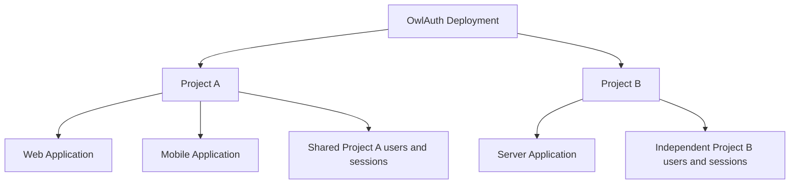

::: warning Beta
OwlAuth is Beta for its delivered self-hosted server, backend-only Client API, CLI, Hosted Authentication and Management Console, and TypeScript/Python/Rust Runtime Project Auth SDK scope. It includes OIDC and passwordless-email login, managed provider profile synchronization, Project session/token lifecycles, revisioned Application projections with signed webhooks, and optional remote Control MCP. Pre-1.0 interfaces and deployment requirements may change. Beta is not deployment certification or a production support commitment; operators own hardening, monitoring, upgrades, and tested backup/PITR/restore. SCIM, bulk directory/export, hosted multi-tenant control, and downstream OAuth authorization-server behavior are outside the current product.
:::

## The product model

A single OwlAuth **Deployment** is one administrative trust domain. It can contain many isolated **Projects**. A Project represents one product or related application family, and contains one or more **Applications**.

Applications in one Project share users and Project token trust. Applications that require isolated users or token audiences belong in separate Projects. A person using the same GitHub identity in two Projects maps to two independent Project users.

OwlAuth owns authentication, identity linking, Project sessions, and Project token claims. Your application backend still owns business authorization—organizations, memberships, billing roles, document access, and other product policy.

## OAuth/OIDC is upstream only

OwlAuth can broker sign-in to a Project's configured upstream provider or verify a first-party email OTP/magic link, then returns an OwlAuth Project user projection and session credentials through the same one-use, PKCE-bound handoff. Downstream Applications consume the **Project Auth API**; they do not register general OAuth grants or receive OAuth/OIDC provider tokens from OwlAuth.

A Project access token is an OwlAuth application-session JWT. It is not an upstream provider token and it does not make OwlAuth a general-purpose OAuth authorization server.

## Read next

- [Architecture](/guide/architecture) — Projects, Applications, authentication flow, logical planes, storage, and deployment.
- [Getting started](/guide/getting-started) — build, validate, and inspect the current Beta implementation.
- [SDKs](/guide/sdks) — implemented protocol operations and the explicit Application-owned state boundary.
- [Building a SaaS](/guide/building-saas) — compose external tenant authorization, managed cells, reconciliation, and billing around self-hosted OwlAuth.
- [CLI and agent integrations](/guide/agent-integrations) — endpoint-discovered CLI boundaries, documentation plugin, and remote HTTP MCP capabilities.
- [Security](/guide/security) — target invariants, operational trust boundaries, and vulnerability reporting.
