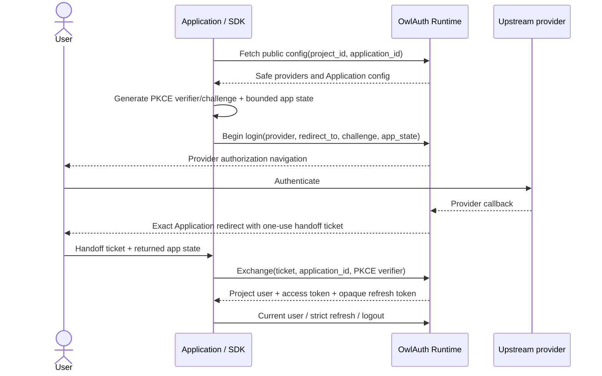

# 04 — Project Auth handoff and credential lifecycle

## Current status

Public configuration retrieval, provider login initiation, PKCE, handoff exchange, Project credential storage/refresh, current-user lookup, and logout are not implemented in any official SDK. Current packages must not be presented as production authentication clients.

This specification becomes applicable as each capability is implemented and validated against a real OwlAuth Runtime.

## Lifecycle overview

The Application never exchanges an upstream authorization code and never receives provider access/refresh tokens. OwlAuth Runtime owns the upstream OAuth/OIDC exchange and identity validation.

## Public configuration

A client is initialized for one Runtime base URL, `project_id`, and `application_id`, plus a publishable key if required. It may retrieve bounded public configuration containing enabled provider display keys, safe Runtime URLs, Application type, and feature flags.

The SDK validates structural consistency with its configured Project/Application but does not treat configuration as authority. Provider secrets, provider tokens, management metadata, `belongs_to`, internal identifiers, user counts, policy internals, or Control URLs must not appear.

Configuration may be cached only with the Runtime-defined revision/TTL semantics. A stale provider/redirect/config entry cannot override Runtime's authoritative login-start validation.

## Login initiation and PKCE custody

For every login attempt, the lifecycle helper:

1. generates a fresh high-entropy PKCE verifier using the operating-system CSPRNG;
2. derives only an `S256` challenge; `plain` and caller-requested downgrade are rejected;
3. generates or accepts bounded Application correlation state under an explicit API;
4. records a short-lived pending transaction bound to Runtime origin, Project, Application, selected provider, exact Application redirect, challenge/verifier, state, and creation/expiry;
5. submits login start to the Project-qualified Runtime route;
6. returns an explicit browser/native navigation result and opaque local transaction handle without logging URL query values or secrets.

The SDK's verifier protects the downstream one-use handoff. Runtime may independently use provider-side PKCE with the upstream provider; that server-generated verifier is never visible to the SDK.

Opening a browser or performing platform navigation is explicit Application behavior or a separately reviewed platform adapter, not a hidden constructor/network side effect. The SDK never collects an upstream password.

## Application redirect and handoff result

After upstream authentication, Runtime redirects the user agent to the exact previously registered Application URI with a short-lived opaque handoff ticket and the bounded Application state. It does not put a Project access token or refresh token in the URL.

The Application supplies this result to the SDK through a documented browser/native callback boundary. The SDK validates:

- exact pending Project/Application/Runtime transaction context;
- returned Application state using constant-time comparison where applicable;
- transaction expiry and one-use local consumption;
- exclusivity and bounds of success versus safe error fields;
- expected redirect/platform adapter context.

The SDK removes handoff values from browser history before third-party resources load where it controls browser integration. A handoff ticket remains untrusted until Runtime exchanges it successfully.

Local pending state is consumed so callback replay fails. If the local callback is invalid, no handoff exchange occurs and secret-bearing values remain redacted.

## One-use handoff exchange

The SDK sends the handoff ticket, configured `application_id`, and retained PKCE verifier only to the configured Runtime over accepted secure transport. Runtime re-establishes the Project from its Project-qualified route/ticket and atomically consumes the ticket while creating the Application session and refresh family.

Handoff exchange is one-use. A timeout, cancellation, disconnect, or lost response may mean Runtime committed while the client did not receive credentials. The SDK does not replay automatically. It returns `Indeterminate`, destroys unusable local PKCE/ticket material, and requires a fresh login unless a future protocol defines an authoritative reconciliation operation.

A successful response must match the configured Project/Application context and contains a bounded current Project user, session metadata, a short-lived Project access token, and an opaque refresh token. Provider codes/tokens and browser cookies are absent.

## Project access token

The Project access token is a signed OwlAuth JWT for one Project user and Application session. It is not a generic OAuth access token or an upstream provider credential.

SDKs expose raw access material only through deliberate credential APIs and redact it everywhere else. They retain expiry/timing metadata needed for refresh scheduling without treating decoded unverified claims as trusted authorization.

Application backends validate the JWT against the exact Project issuer/audience and Project JWKS, including allowlisted algorithm, `kid`, token type, `app_id` policy, and time claims. SDK possession or decoding does not perform that backend authorization.

## Credential persistence boundary

SDKs never silently choose persistent storage. Default behavior is memory-only unless a documented platform adapter is explicitly selected. An Application-supplied store receives only the minimum Project/Application session values and owns encryption, access control, backup, deletion, and process-sharing policy.

Stored state includes a schema version and exact Runtime/Project/Application binding. Loading state under another binding fails and does not migrate credentials across Projects.

A credential update is atomic: the new access/refresh pair and associated generation/version replace the old pair together. Crashes or partial writes cannot create a mixed generation that the SDK treats as valid.

## Strict refresh rotation

Runtime refresh tokens are opaque, one-use, and belong to one Project/Application/user/session family. Any reuse of a consumed generation revokes the entire family, including a successor created by a concurrent request.

The SDK therefore:

- performs single-flight refresh per local family so concurrent callers share one result;
- serializes store updates with compare-and-swap/version semantics;
- sends the token only to the configured Project-qualified refresh operation;
- commits the returned access/refresh pair atomically before exposing it;
- invalidates local family state on definitive expired/revoked/replay/session errors;
- never retries an old refresh token after an ambiguous outcome.

On timeout, cancellation, disconnect, or lost response, the result is `Indeterminate`: Runtime may have consumed the token. The SDK clears or quarantines the uncertain family and requires reauthentication unless an authoritative future recovery protocol exists. Availability does not weaken replay containment.

In-process single-flight does not coordinate multiple processes. A multi-process store must provide atomic leases/compare-and-swap, or the Application must serialize refresh externally. An SDK must not claim safe cross-process rotation without that contract and tests.

## Current user

With a valid Project access token, the SDK may call the Project-qualified current-user operation. The result is a bounded Project-local user/session view and must match the configured Project/Application context.

The response never exposes linked-provider tokens, provider secret references, `belongs_to`, management scopes, another Project's users, or arbitrary provider payloads. Authentication/session invalidation maps to typed errors and local credential cleanup as specified in spec 05.

## Logout

The lifecycle API distinguishes:

- **Application logout:** revoke the selected Application session/refresh family and clear local credentials;
- **Project browser logout:** request termination of the underlying Project browser session where supported, preventing refresh for all derived Application sessions in that Project/browser.

The Application chooses the mode explicitly. Application-only logout must not claim to sign out other Applications. Project browser logout must not claim to invalidate already issued JWTs before their short expiry; it blocks authoritative session/refresh operations.

SDK local cleanup occurs even when the Application deliberately chooses to forget credentials, but the result distinguishes confirmed Runtime revocation from an ambiguous network outcome. Browser cookie clearing remains Runtime/user-agent behavior under its CSRF/session policy.

## Clock, entropy, and diagnostics

Production entropy comes only from an operating-system CSPRNG. Tests inject deterministic entropy/clock interfaces without weakening production defaults. Expiry scheduling uses receipt instants and a documented skew window, while Runtime remains authoritative.

PKCE verifiers, handoff tickets, Project access tokens, refresh tokens, cookies, full callback URLs, and user profiles never enter default logs, errors, traces, metrics, snapshots, or telemetry.

## Acceptance criteria

- Deterministic tests verify S256 vectors and fresh verifier/state generation.
- Cases cover Project/Application mismatch, state mismatch/replay/expiry, safe provider failure, handoff one-use behavior, and redaction.
- Credential-store tests prove exact context binding and atomic generation replacement.
- Refresh tests cover single-flight, replay-family revocation, definitive invalidation, ambiguous lost responses, and multi-process limitations.
- Current-user and both logout modes preserve Project/Application/session semantics.
- Real-server E2E passes before any of these capabilities is advertised as implemented.
