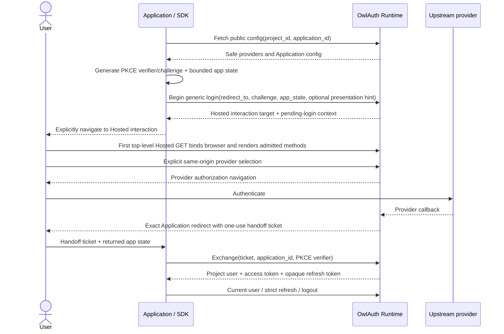

# 04 — Project Auth handoff and credential lifecycle

## Current status

Public configuration retrieval, generic Hosted Project login initiation, PKCE, handoff exchange, Project credential operations, current-user lookup, and logout exist in the Beta official SDKs. The normative rules below are the Block E convergence target and do not claim that every current implementation already conforms. The packages remain explicit protocol cores rather than persistence, navigation, framework-session, or backend-token-verification libraries, and they must not be presented as production-supported until their independently versioned source, corpus, exact-artifact, real-server, and release criteria are met.

## Lifecycle overview

The Application never exchanges an upstream authorization code and never receives provider access/refresh tokens. OwlAuth Runtime owns the upstream OAuth/OIDC exchange and identity validation.

## Public configuration

A client is initialized for one Runtime base URL, `project_id`, and `application_id`, plus a publishable key if required. It may retrieve bounded public configuration containing enabled provider display keys, safe Runtime URLs, Application type, and feature flags.

The SDK validates structural consistency with its configured Project/Application but does not treat configuration as authority. Provider secrets, provider tokens, management metadata, `belongs_to`, internal identifiers, user counts, policy internals, or Control URLs must not appear.

Configuration may be cached only with the Runtime-defined revision/TTL semantics. A stale provider/redirect/config entry cannot override Runtime's authoritative login-start validation. The response must match the configured Project/Application and its bounded `publishable_keys` list must contain the configured publishable key; duplicate provider keys or unsupported provider-kind enum values are protocol failures.

Project JWKS retrieval is a transport capability, not a claim that the core SDK authorizes backend requests. The document requires positive `revision` and `signing_epoch`, at most 100 unique `kid` values, and the selected `OKP`/`Ed25519`/`EdDSA`/`sig` key shape with bounded base64url `x`. Unknown algorithms, duplicate keys, or malformed key material are protocol failures until a reviewed compatibility change ships.

## Login initiation and PKCE custody

For every login attempt, the protocol API:

1. generates a fresh high-entropy PKCE verifier using the operating-system CSPRNG;
2. derives only an `S256` challenge; `plain` and caller-requested downgrade are rejected;
3. generates or accepts bounded Application correlation state under an explicit API;
4. constructs a versioned short-lived pending-login value bound to Runtime origin, Project, Application, exact Application redirect, challenge/verifier, state, and creation/expiry, with no selected provider;
5. optionally supplies a bounded presentation hint that cannot select, enable, or authorize a method and is not retained as caller authority;
6. submits generic login start to the Project-qualified Runtime route;
7. returns the Hosted interaction navigation target and pending-login value without logging URL query values or secrets.

The SDK's verifier protects the downstream one-use handoff. Runtime may independently use provider-side PKCE with the upstream provider; that server-generated verifier is never visible to the SDK. The Application owns custody of the returned pending transaction across the user-agent round trip; the core SDK neither persists it nor selects a platform store.

Opening a browser or performing platform navigation is explicit Application or external integration behavior, not a hidden constructor/network side effect. Generic start may run in a backend that has no Runtime browser cookie: the first top-level Hosted GET performs the server-authoritative one-browser binding before method selection. The SDK neither performs that navigation nor selects an upstream provider and never collects an upstream password.

## Application redirect and handoff result

After upstream authentication, Runtime redirects the user agent to the exact previously registered Application URI with a short-lived opaque handoff ticket and the bounded Application state. It does not put a Project access token or refresh token in the URL.

The Application supplies the callback value and its retained pending transaction to the SDK's explicit callback-validation/exchange API. The SDK validates:

- exact pending Project/Application/Runtime transaction context;
- returned Application state using constant-time comparison where applicable;
- transaction expiry;
- exactly one bounded `state` and exactly one of bounded `handoff` success or bounded safe `error`, with no duplicate reserved field, fragment, credentials, or extra reserved callback field;
- an error callback as a normalized `Handoff`/login failure that requires pending disposal and never dispatches exchange; and
- expected redirect scheme, authority, path, and pre-registered non-reserved query fields.

The Application or an external browser/native integration removes handoff values from browser history or platform-visible state before third-party resources can observe them. The core SDK performs no navigation or history mutation. A handoff ticket remains untrusted until Runtime exchanges it successfully.

The pending transaction is one-attempt material. Local validation does not consume it merely because malformed input was inspected. A successful validation produces one one-use validated callback bound to that exact pending value; exchange atomically consumes the pending/validated material immediately before dispatch. The Application removes or marks its durable copy consumed at the same boundary and does not restore it after any definitive or ambiguous outcome. The SDK exposes no automatic retry path. If local callback validation fails, no handoff exchange occurs and secret-bearing values remain redacted.

## One-use handoff exchange

The SDK sends the handoff ticket, configured `application_id`, and retained PKCE verifier only to the configured Runtime over accepted secure transport. Runtime re-establishes the Project from its Project-qualified route/ticket and atomically consumes the ticket while creating the Application session and refresh family.

Handoff exchange is one-use. A timeout, cancellation, disconnect, or lost response may mean Runtime committed while the client did not receive credentials. The SDK does not replay automatically or expose an internal retry path. It returns `Indeterminate` with the required caller action to delete or quarantine the caller-owned pending transaction and requires a fresh login unless a future protocol defines an authoritative reconciliation operation.

A successful response must match the configured Project/Application context and contains a bounded current Project user, session metadata, and one typed credential-pair result with a short-lived Project access token and opaque refresh token. Provider codes/tokens and browser cookies are absent.

## Project access token

The Project access token is a signed OwlAuth JWT for one Project user and Application session. It is not a generic OAuth access token or an upstream provider credential.

SDKs expose raw access material only through deliberate credential APIs and redact it everywhere else. They return explicit expiry/timing metadata that callers may use for refresh scheduling without treating decoded unverified claims as trusted authorization.

Application backends validate the JWT against the exact Project issuer/audience and Project JWKS, including allowlisted algorithm, `kid`, token type, `app_id` policy, and time claims. SDK possession or decoding does not perform that backend authorization.

## Application-owned state boundary

The core SDK does not choose or implement persistent credential storage and does not silently retain an Application session. It returns pending-login state and credential results explicitly. Browser storage, native secure storage, backend sessions, backup, deletion, request interception, and framework state belong to the Application or another integration library.

Any persisted record includes a schema version and exact Runtime/Project/Application binding. Loading state under another binding fails and never migrates credentials across Projects. Pending-login state is short-lived secret material and is stored separately from post-login credentials.

A credential update is atomic at the Application boundary: the new access/refresh pair and associated generation/version replace the old pair together. Crashes or partial writes cannot create a mixed generation that an Application treats as valid. The core API returns each pair as one result and never offers separate partial-update operations.

## Strict refresh rotation

Runtime refresh tokens are opaque, one-use, and belong to one Project/Application/user/session family. Any reuse of a consumed generation revokes the entire family, including a successor created by a concurrent request.

The core refresh API therefore:

- accepts one explicit credential generation and sends its refresh token only to the configured Project-qualified operation;
- returns the successor access/refresh pair in one typed credential-pair result whose `refresh_generation` is exactly the submitted generation plus one, never merely greater;
- classifies definitive expired/revoked/replay/session errors so the caller can invalidate the family;
- never automatically retries an old refresh token after an ambiguous outcome.

The Application or an external stateful integration MUST perform single-flight refresh per family, atomically compare-and-swap the returned pair before another caller can use either generation, and invalidate or quarantine state according to the SDK's semantic result. On timeout, cancellation, disconnect, or lost response, the SDK returns `Indeterminate`: Runtime may have consumed the token, so the caller discards or quarantines the uncertain family and requires reauthentication unless an authoritative future recovery protocol exists. Availability does not weaken replay containment.

The core SDK does not claim in-process or cross-process refresh coordination. A stateful integration that makes such a claim must provide and test the necessary single-flight plus atomic lease/compare-and-swap contract.

## Current user

With a valid Project access token, the SDK may call the Project-qualified current-user operation. The result is a bounded Project-local user/session view and must match the configured Project/Application context.

The response never exposes linked-provider tokens, provider secret references, `belongs_to`, management scopes, another Project's users, or arbitrary provider payloads. Authentication/session invalidation maps to typed errors with the required caller credential action specified in spec 05.

## Logout

The protocol API distinguishes separate credential and DTO classes:

- **Application logout:** directly send the Project access token to the Project-qualified Runtime operation, which derives and idempotently revokes only that exact Application session/refresh family; no browser cookie or caller-named session substitutes for the token. The caller then clears or quarantines its local credentials according to the semantic result.
- **Project browser logout:** first send the Project access token to a direct preparation operation. Runtime returns a short-lived one-use Hosted confirmation target bound to the exact Application session and its Project browser session. The SDK returns that target as data and never navigates. The top-level Hosted flow requires the matching hardened Project-session cookie and same-origin CSRF before atomically consuming the preparation and terminating the browser session. No Bearer token appears in the target URL or page state.

The Application chooses the mode explicitly. Application-only logout must not claim to sign out other Applications. Project browser logout must not claim to invalidate already issued JWTs before their short expiry; it blocks authoritative session/refresh operations.

The SDK result distinguishes confirmed Runtime revocation from an ambiguous network outcome. The Application or external state layer deliberately clears or quarantines its own credentials for either mode; the core API cannot clear caller-owned storage. Browser cookie clearing remains Runtime/user-agent behavior under its CSRF/session policy.

## Clock, entropy, and diagnostics

Production entropy comes only from an operating-system CSPRNG. Tests inject deterministic entropy/clock interfaces without weakening production defaults. Runtime remains authoritative. The initial client bounds follow the current server constants with an explicit one-minute clock-skew allowance: login `expires_at` must fall between 60 seconds before and 11 minutes after the client's pre-dispatch creation instant, and pending state becomes locally expired only when client time is more than 60 seconds past that timestamp. Browser-logout `expires_at` must fall between 60 seconds before and 2 minutes after the receipt instant; a value inside the lower skew window may be returned for an immediate Runtime-authoritative attempt rather than rejected as malformed. Access `expires_in` is an integer from 1 through 3,600 seconds, and session expiry receives the same 60-second lower skew tolerance. These bounds are compatibility policy and therefore change only with the selected contract/spec/corpus review.

PKCE verifiers, handoff tickets, Project access tokens, refresh tokens, cookies, full callback URLs, and user profiles never enter default logs, errors, traces, metrics, snapshots, or telemetry.

## Acceptance criteria

- Deterministic tests verify S256 vectors and fresh verifier/state generation.
- Cases cover Project/Application mismatch, state mismatch/replay/expiry, safe provider failure, handoff one-use behavior, and redaction.
- Explicit-state tests prove exact context binding, paired credential results with no partial-update operation, and no hidden persistence or navigation side effects.
- Refresh tests cover replay-family revocation, definitive invalidation, ambiguous lost responses, no automatic replay, and the documented caller coordination contract.
- Current-user and both logout modes preserve Project/Application/session semantics without claiming cleanup of caller-owned state.
- Real-server E2E passes before any of these capabilities is advertised as implemented.
