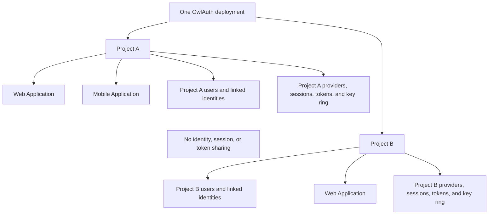
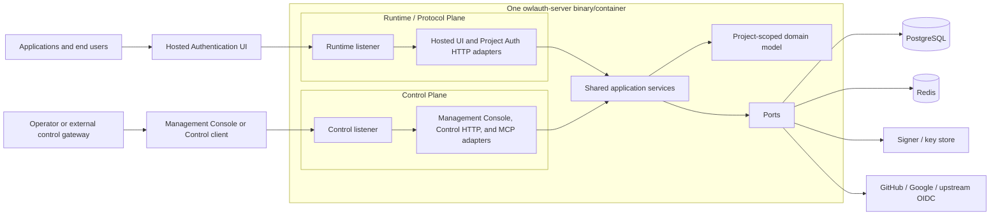
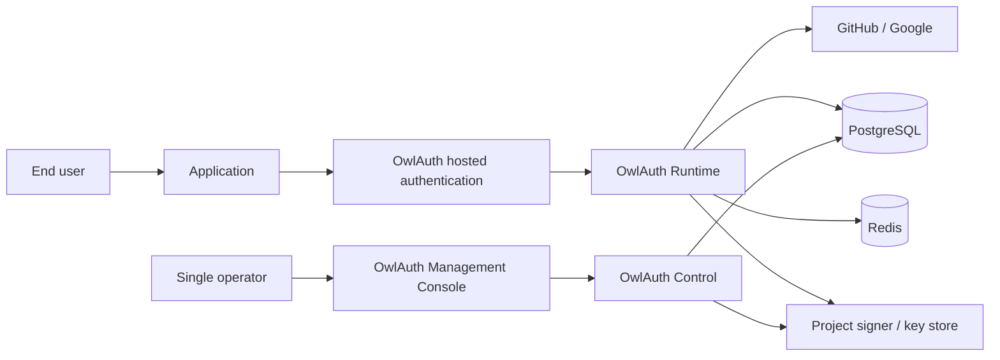
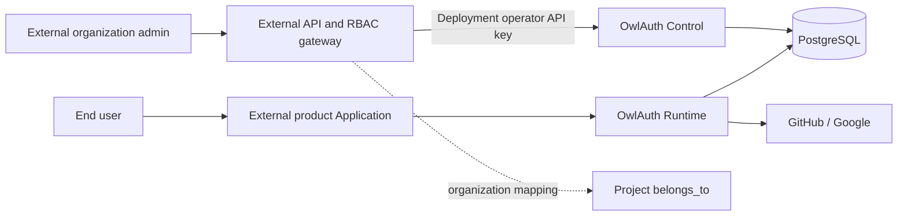

# 01 — System context, Projects, and logical planes

## Product model

OwlAuth is a self-hostable authentication and identity service for applications. A single deployment lets one operator define multiple isolated Projects. Each Project can register multiple web, mobile, server, or native Applications that share one Project user directory and authentication policy.

OwlAuth brokers login to configured upstream identity providers, maps verified provider identities to Project-scoped users, and returns a Project user plus OwlAuth session credentials to the initiating Application. Applications and their backends do not integrate with OwlAuth as general OAuth clients; they use the Project Auth API and SDK.

OwlAuth owns authentication, identity linking, Project sessions, and Project token claims. An application backend still owns business authorization such as organization membership, document access, billing roles, and domain-specific permissions.

## Core concepts

| Concept | Meaning | Isolation and security role |
| --- | --- | --- |
| Deployment | one OwlAuth installation and administrative trust domain | one operator policy, one PostgreSQL authority |
| Project | isolated authentication namespace for one product or related application family | owns users, identities, provider configuration, sessions, tokens, and keys |
| Application | one web/mobile/native/server integration inside a Project | owns public app identifier, type, allowed origins, and post-login redirects |
| Provider configuration | a Project's GitHub/Google/OIDC client registration assigned to one or more Applications | owns provider client ID, callback identity, and secret-store reference |
| Project user | stable local identity inside exactly one Project | not reused or discoverable across Projects |
| Linked identity | verified upstream issuer/subject attached to a Project user | unique within the Project |
| Project browser session | user/browser authentication state reusable by Applications in the same Project | never authenticates another Project |
| Handoff ticket | short-lived one-use credential used to deliver a login result to an Application | bound to Project, Application, redirect, browser transaction, and PKCE |
| Project access token | short-lived signed OwlAuth token for the Project backend | Project issuer/audience and Application context; not a generic OAuth access token |
| Refresh token/family | opaque rotating credential for one Application session | Project/Application/user bound and PostgreSQL-authoritative |
| `belongs_to` | nullable opaque Project metadata supplied by an external control system | index/correlation only; no built-in tenant authorization semantics |

Project identifiers are globally unique within the deployment. User identifiers may use globally unique UUIDs operationally, but their semantic identity is `(project_id, user_id)`. The same provider account can map to independent users in different Projects.

## Actors and adjacent systems

| Actor or system | Relationship to OwlAuth | Trust position |
| --- | --- | --- |
| End user | authenticates through an Application and upstream provider | browser, redirects, and supplied data are untrusted |
| Application | starts login, exchanges a handoff ticket, stores/uses session results | public app identifiers are not secrets; redirect and origin registration is authoritative |
| Application backend | verifies Project tokens and applies business authorization | separate authorization boundary |
| Upstream identity provider | authenticates the end user and returns stable issuer/subject claims | remote security dependency with provider-specific validation |
| Deployment operator | creates Projects/Applications/providers and manages users, keys, and policy | trusted holder of the deployment-wide Control API key; all Control actions audit as the deployment operator |
| External control gateway | optionally proxies Control for another product's organization/RBAC layer | separate policy-enforcement point; must validate `belongs_to` and object access |
| PostgreSQL | stores authoritative Project, identity, login, session, token, key, and audit state | privileged durability and consistency boundary |
| Redis | provides non-authoritative caching, rate coordination, and invalidation hints | disposable support dependency; values may be stale or absent |
| Signer/key store or KMS | protects private keys and performs Project-scoped signing/data protection | privileged cryptographic boundary |
| SDK, CLI, or MCP caller | adapts Runtime or Control interfaces | untrusted input; never an authorization authority |

## Project and Application isolation



Applications inside one Project share users and may reuse a valid Project browser session, subject to each Application's current status, redirect allowlist, origin policy, and login policy. Applications never inherit Control authority from sharing a Project.

Project boundaries apply to every Runtime operation. The selected Project is resolved from a server-issued Project identifier or trusted route parameter and is included in every repository predicate and transaction constraint. Caller-supplied object IDs cannot move a resource between Projects.

## Logical plane architecture

OwlAuth is a modular monolith with two transport planes over one shared core.



Transport adapters perform parsing, admission control, caller authentication, Project/Application resolution, and response mapping. They do not implement identity linking, handoff consumption, session validity, refresh-family behavior, key transitions, or audit transactions.

## Runtime / Protocol Plane

Runtime serves latency-sensitive public Project authentication traffic:

- hosted Project/Application login, provider interaction, progress, and safe error/return pages;
- public Project/Application auth configuration;
- login start and upstream provider callbacks;
- one-use handoff exchange;
- Project access-token and refresh-token lifecycle;
- current Project user/session lookup;
- logout and session revocation initiated by the end user;
- Project-scoped public verification keys.

Runtime is not a general OAuth authorization server. OAuth/OIDC protocol handling exists only inside upstream provider adapters. Runtime's downstream contract is the OwlAuth Project Auth API.

## Control Plane

Control serves its embedded Management Console and authenticated administrative operations:

- credential-free Console shell plus API-key-authenticated Console requests;
- Project lifecycle and optional `belongs_to` metadata;
- Applications, publishable configuration, allowed origins, and post-login redirects;
- per-Project provider client IDs and secret references;
- Project user lookup, disablement, merge, and linked-identity removal;
- Project claims/session policy and token configuration;
- Project signing-key lifecycle commands and state inspection;
- Project-scoped and deployment-scoped audit queries and safe health metadata.

Control uses a distinct listener, narrower network exposure, and exactly one deployment-level operator API key loaded from process configuration. A valid key grants the entire deployment's Control authority; OwlAuth has no server-side Control principals, permission sets, credential-management endpoints, or Control sessions of any kind. Public Application identifiers, publishable keys, Runtime access/refresh tokens, and upstream provider credentials are never Control credentials. Conversely, the operator API key is never accepted by Runtime. Control routes cannot be mounted into the Runtime router.

## Standalone deployment



In standalone operation, one operator manages every Project. `belongs_to` is null unless the operator uses it as private metadata. OwlAuth does not model organizations, memberships, invitations, or tenant roles.

## Integration behind an external control system



The external gateway authenticates its administrators, resolves organization membership, applies its own RBAC, maps the organization to a Project `belongs_to` value, verifies the target Project and revision, and then invokes allowlisted Control operations using the deployment operator API key. OwlAuth does not attenuate that key: only the gateway constrains which externally owned Projects and operations its callers may reach.

`belongs_to` does not cause implicit filtering or authorization. Possession of the OwlAuth operator API key is deployment-wide Control authority. An external product must not expose the key or forward arbitrary Control requests.

## Deployment shape

One repository and one Rust server package produce one `owlauth-server` binary and one container artifact with three composition modes:

```text
owlauth-server serve --plane=all
owlauth-server serve --plane=runtime
owlauth-server serve --plane=control
```

`all` composes both planes in one process but binds distinct Runtime and Control listeners. `runtime` and `control` compose only selected adapters and capabilities. Every mode uses the same domain modules, Project rules, schema, and configuration model.

A typical topology assigns `auth.example.com` to Runtime and `admin.auth.example.com` or a private address to Control. Hostname separation does not replace listener isolation or administrative authentication.

## Trust boundaries

1. **Project boundary:** every Project-owned resource and credential is resolved and mutated with an authoritative `project_id`; no unqualified lookup can cross Projects.
2. **Public Runtime boundary:** every request is hostile until parsed, bounded, and Project/Application validated.
3. **Administrative boundary:** the Control listener verifies the configured deployment operator API key before resolving a target Project or mutation; the key is independent of every Runtime Application and user identity.
4. **Browser redirect boundary:** login state, provider callback values, redirect targets, cookies, and handoff values are attacker-controlled inputs.
5. **Shared-core boundary:** only application services initiate domain state transitions; adapters and rows are not authority.
6. **Persistence boundary:** PostgreSQL constraints and transactions protect durable invariants; stored rows are validated when mapped into domain types.
7. **Cache boundary:** Redis values may be missing, delayed, duplicated, or stale and never establish a security fact.
8. **Cryptographic boundary:** private-key operations occur behind Project-aware signer/data-protector interfaces; only public keys and opaque references cross it.
9. **External-provider boundary:** remote calls use exact configured endpoints, TLS, timeouts, response bounds, state binding, and issuer/subject validation.
10. **External-gateway boundary:** `belongs_to` is evidence for the gateway's policy decision, not proof that OwlAuth performed tenant authorization.
11. **Agent boundary:** MCP prompt text and tool arguments cannot authorize side effects or expose credentials.

## Design scope

OwlAuth provides upstream social/OIDC federation, Project-scoped users and identities, Applications, sessions, token verification, provider configuration, user administration, and audit. Password authentication, SAML, SCIM, LDAP synchronization, organization membership, tenant RBAC, SaaS API keys, billing, and general business RBAC/ABAC are outside this server architecture. The separate SaaS architecture is defined in [`spec/saas/`](saas/).
