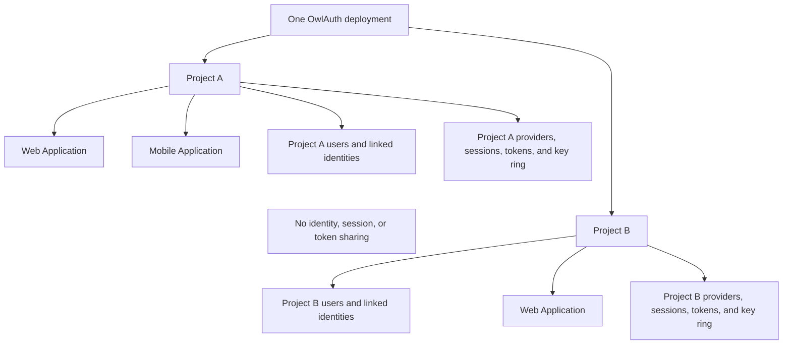
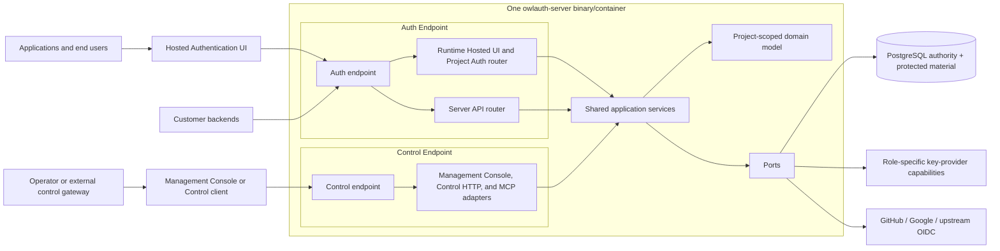
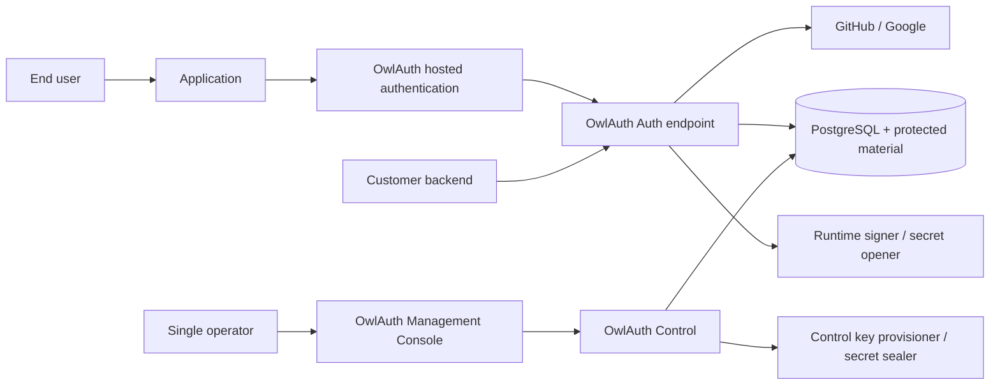
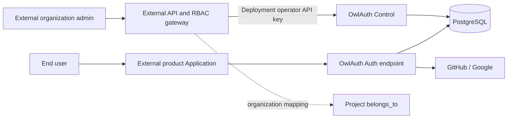

# 01 — System context, Projects, and logical planes

## Product model

OwlAuth is a self-hostable authentication and identity service for applications. A single deployment lets one operator define multiple isolated Projects. Each Project can register multiple web, mobile, server, or native Applications that share one Project user directory and authentication policy.

OwlAuth authenticates through configured upstream identity providers or first-party passwordless email, maps proven identities to Project-scoped users, and returns a revisioned Project user projection plus OwlAuth session credentials to the initiating Application. It may manage a provider connection solely for bounded profile synchronization and may notify an already bound Application through signed user-projection webhooks. Applications and their backends do not integrate with OwlAuth as general OAuth clients; they use the Project Auth API and SDK and never receive upstream provider credentials.

OwlAuth owns authentication, identity linking, Project sessions, and Project token claims. A customer backend may use a Project server key on the separate Server API to read its Project user directory and authoritatively introspect an OwlAuth access token. It still owns business authorization such as organization membership, document access, billing roles, and domain-specific permissions, and it owns any generated OpenAPI client or SaaS/BFF framework integration.

## Core concepts

| Concept                     | Meaning                                                                                 | Isolation and security role                                                             |
| --------------------------- | --------------------------------------------------------------------------------------- | --------------------------------------------------------------------------------------- |
| Deployment                  | one OwlAuth installation and administrative trust domain                                | one operator policy, one PostgreSQL authority                                           |
| Project                     | isolated authentication namespace for one product or related application family         | owns users, identities, provider configuration, sessions, tokens, and keys              |
| Application                 | one web/mobile/native/server integration inside a Project                               | owns public app identifier, type, allowed origins, and post-login redirects             |
| Provider configuration      | a Project's GitHub/Google/OIDC client registration assigned to one or more Applications | owns provider client ID, callback identity, and protected-secret material ID            |
| Project user                | stable local identity inside exactly one Project                                        | not reused or discoverable across Projects                                              |
| Linked identity             | verified upstream issuer/subject attached to a Project user                             | unique within the Project                                                               |
| Project browser session     | user/browser authentication state reusable by Applications in the same Project          | never authenticates another Project                                                     |
| Handoff ticket              | short-lived one-use credential used to deliver a login result to an Application         | bound to Project, Application, redirect, browser transaction, and PKCE                  |
| Project access token        | short-lived signed OwlAuth token for the Project backend                                | Project issuer/audience and Application context; not a generic OAuth access token       |
| Refresh token/family        | opaque rotating credential for one Application session                                  | Project/Application/user bound and PostgreSQL-authoritative                             |
| Managed provider connection | optional renewable provider credential and sync lifecycle for one linked identity       | server-only, least-scope profile synchronization; never an Application token vault      |
| Email identity/challenge    | first-party verified email plus OTP or magic-link proof                                 | Project-bound, one-use, enumeration-safe, and tied to the Application login transaction |
| User projection/webhook     | revisioned Application-visible user view and asynchronous change notification           | emitted only after an Application-user binding; bounded and credential-free             |
| Project server key          | server-generated confidential credential for one Project's read-only Server API         | hash-only, independently revocable, never accepted by Runtime or Control                |
| `belongs_to`                | nullable opaque Project metadata supplied by an external control system                 | index/correlation only; no built-in tenant authorization semantics                      |

Project identifiers are globally unique within the deployment. User identifiers may use globally unique UUIDs operationally, but their semantic identity is `(project_id, user_id)`. The same provider account can map to independent users in different Projects.

## Actors and adjacent systems

| Actor or system            | Relationship to OwlAuth                                                                                                                        | Trust position                                                                                              |
| -------------------------- | ---------------------------------------------------------------------------------------------------------------------------------------------- | ----------------------------------------------------------------------------------------------------------- |
| End user                   | authenticates through an Application and upstream provider                                                                                     | browser, redirects, and supplied data are untrusted                                                         |
| Application                | starts login, exchanges a handoff ticket, stores/uses session results                                                                          | public app identifiers are not secrets; redirect and origin registration is authoritative                   |
| Application backend        | calls the Server API with its Project server key, verifies/introspects Project tokens, and applies business authorization                      | trusted customer server for one Project; never deployment Control authority                                 |
| Upstream identity provider | authenticates the end user and returns stable issuer/subject claims                                                                            | remote security dependency with provider-specific validation                                                |
| Deployment operator        | creates Projects/Applications/providers and manages users, keys, and policy                                                                    | trusted holder of the deployment-wide Control API key; all Control actions audit as the deployment operator |
| External control gateway   | optionally proxies Control for another product's organization/RBAC layer                                                                       | separate policy-enforcement point; must validate `belongs_to` and object access                             |
| PostgreSQL                 | stores authoritative Project, identity, login, session, token, key, and audit state                                                            | privileged durability and consistency boundary                                                              |
| Key-provider capability    | provisions/signs Project keys or seals/opens configuration secrets; bundled mode uses PostgreSQL envelopes, custom mode may use remote custody | privileged role-specific cryptographic boundary                                                             |
| SDK, CLI, or MCP caller    | adapts Runtime or Control interfaces                                                                                                           | untrusted input; never an authorization authority                                                           |

## Project and Application isolation



Applications inside one Project share users and may reuse a valid Project browser session, subject to each Application's current status, redirect allowlist, origin policy, and login policy. Applications never inherit Control authority from sharing a Project.

Project boundaries apply to every Runtime operation. The selected Project is resolved from a server-issued Project identifier or trusted route parameter and is included in every repository predicate and transaction constraint. Caller-supplied object IDs cannot move a resource between Projects.

## Endpoint and surface architecture

OwlAuth is a modular monolith with one Auth endpoint and one independently bound Control endpoint over one shared core. Auth contains two strictly isolated HTTP surfaces: browser-facing Runtime Project Auth and JSON-only customer-backend Server API. The exact Server credential, API, OpenAPI, caching, and isolation rules are owned by [spec 13](13-server-api-and-project-server-keys.md).



Auth's shared transport address does not merge its surfaces: Runtime and Server API have distinct route trees, state, caller authentication, CORS/HTML/JSON behavior, PostgreSQL pools, readiness inputs, and OpenAPI contracts. Transport adapters perform bounded parsing, caller authentication, Project/Application resolution, and response mapping. They do not implement identity linking, handoff consumption, session validity, refresh-family behavior, key transitions, or audit transactions.

## Runtime / Protocol Plane

Runtime serves latency-sensitive public Project authentication traffic:

- hosted Project/Application login, provider interaction, progress, and safe error/return pages;
- public Project/Application auth configuration;
- login start and upstream provider callbacks;
- one-use handoff exchange;
- Project access-token and refresh-token lifecycle;
- current Project user/session lookup;
- logout and session revocation initiated by the end user;
- Project-scoped public verification keys.

Runtime is not a general OAuth authorization server. OAuth/OIDC protocol handling exists only inside upstream provider adapters. Runtime's downstream contract is the OwlAuth Project Auth API.

## Server API Surface

The Server API serves JSON-only customer-backend traffic authenticated by an independently rotatable key for exactly one Project:

- bounded Project user listing and exact lookup;
- exact materialized Application user projection lookup;
- authoritative online Project access-token introspection;
- a separate complete Server OpenAPI for customer-generated clients.

The Server API is mounted on Auth but uses a distinct internal router with no browser CORS, cookies, HTML, redirects, operator routes, or Runtime session operations. It cannot mutate users or Project configuration. OwlAuth publishes no official Server API SDK; existing language SDKs remain Runtime Project Auth clients.

## Control Plane

Control serves its embedded Management Console and authenticated administrative operations:

- credential-free Console shell plus API-key-authenticated Console requests;
- an optional remote Streamable HTTP MCP adapter authenticated by the same operator API key;
- Project lifecycle, optional `belongs_to` metadata, and Project server-key creation/list/revocation;
- Applications, publishable configuration, allowed origins, and post-login redirects;
- per-Project provider client IDs and secret references;
- Project user lookup, disablement, merge, and linked-identity removal;
- Project claims/session policy and token configuration;
- Project signing-key lifecycle commands and state inspection;
- Project-scoped and deployment-scoped audit queries and safe health metadata.

Control uses a distinct endpoint, narrower network exposure, and exactly one deployment-level operator API key loaded from process configuration. A valid key grants the entire deployment's Control authority; OwlAuth has no server-side Control principals, permission sets, credential-management endpoints, or Control sessions of any kind. Public Application identifiers, publishable keys, Runtime access/refresh tokens, and upstream provider credentials are never Control credentials. Conversely, the operator API key is never accepted by either Auth surface. Control REST, Console, and HTTP MCP routes cannot be mounted into Auth. Project server keys are never accepted by Control or Runtime, and the operator key is never accepted by the Server API.

## Standalone deployment



In standalone operation, one operator manages every Project. `belongs_to` is null unless the operator uses it as private metadata. OwlAuth does not model organizations, memberships, invitations, or tenant roles.

## Integration behind an external control system



The external gateway authenticates its administrators, resolves organization membership, applies its own RBAC, maps the organization to a Project `belongs_to` value, verifies the target Project and revision, and then invokes allowlisted Control operations using the deployment operator API key. OwlAuth does not attenuate that key: only the gateway constrains which externally owned Projects and operations its callers may reach.

`belongs_to` does not cause implicit filtering or authorization. Possession of the OwlAuth operator API key is deployment-wide Control authority. An external product must not expose the key or forward arbitrary Control requests.

## Deployment shape

One repository and one Rust domain/application server package produce the official `owlauth-server` binary and container artifact with three composition modes. The separate narrow `owlauth-key-provider` SPI contains no alternate server policy; the official artifact links only the bundled local software-custody implementation, while an independent provider crate may be statically composed into a custom binary:

```text
OWLAUTH_MODE=all owlauth-server
OWLAUTH_MODE=auth owlauth-server
OWLAUTH_MODE=control owlauth-server
```

`all` binds the Auth and Control endpoints in one process. `auth` composes both required Auth surfaces on one listener, while preserving their internal routers, credentials, readiness inputs, and PostgreSQL pools. `control` composes only the administrative endpoint and capabilities. Every mode uses the same domain modules, Project rules, schema, and configuration model.

A typical topology assigns `auth.example.com` to Auth and `admin.auth.example.com` or a private address to Control. Customer backends call Server API paths on the Auth origin. Hostname separation does not replace endpoint isolation or the corresponding Project-server/operator authentication.

## Trust boundaries

01. **Project boundary:** every Project-owned resource and credential is resolved and mutated with an authoritative `project_id`; no unqualified lookup can cross Projects.
02. **Public Runtime boundary:** every request is hostile until parsed, bounded, and Project/Application validated.
03. **Customer-backend boundary:** the JSON-only Server API surface verifies one active Project server key before resolving bounded same-Project reads or introspection; this key is independent of the deployment operator key and every Runtime Application/end-user credential.
04. **Administrative boundary:** the Control endpoint verifies the configured deployment operator API key before resolving a target Project or mutation; the key is independent of every Auth Application, user identity, and Project server key.
05. **Browser redirect boundary:** login state, provider callback values, redirect targets, cookies, and handoff values are attacker-controlled inputs.
06. **Shared-core boundary:** only application services initiate domain state transitions; adapters and rows are not authority.
07. **Persistence boundary:** PostgreSQL constraints and transactions protect durable invariants; stored rows are validated when mapped into domain types.
08. **Traffic-governance boundary:** OwlAuth Core owns no deployment-wide IP/route/global quota, bot/risk, traffic-shaping, or commercial limit. A SaaS or operator-owned ingress may enforce those controls, but they never authenticate a caller or establish an identity fact.
09. **Cryptographic boundary:** plaintext private-key and provider/SMTP/webhook secret operations occur behind role-specific key-provider capabilities. PostgreSQL carries public keys and bounded purpose/context-bound software ciphertext or opaque custom-provider handles/envelopes; the bundled software custody root remains deployment-injected and outside PostgreSQL.
10. **External-provider boundary:** remote calls use exact configured endpoints, TLS, timeouts, response bounds, state binding, and issuer/subject validation.
11. **External-gateway boundary:** `belongs_to` is evidence for the gateway's policy decision, not proof that OwlAuth performed tenant authorization.
12. **Agent boundary:** MCP is a remote HTTP adapter owned by the serving product; protocol self-description, prompt text, tool arguments, transport sessions, and UI approval cannot authorize side effects or expose credentials. No plugin/CLI launches a local MCP server.

## Design scope

OwlAuth provides upstream social/OIDC federation, managed identity-profile connections, first-party passwordless email OTP/magic-link authentication, Project-scoped users and identities, Applications, sessions, revisioned user projections, signed Application webhooks, token verification/introspection, Project server keys for the bounded Server API, provider/SMTP configuration, user administration, and audit. Provider-token brokering, password authentication, SAML, SCIM, bulk directory synchronization, LDAP synchronization, organization membership, tenant RBAC, arbitrary customer business API keys, billing, hosted multi-tenant orchestration, and general business RBAC/ABAC are outside the OwlAuth product. The detailed identity expansion is owned by [spec 11](11-identity-connections-passwordless-email-and-user-sync.md), and the Project Server API/key boundary by [spec 13](13-server-api-and-project-server-keys.md).
