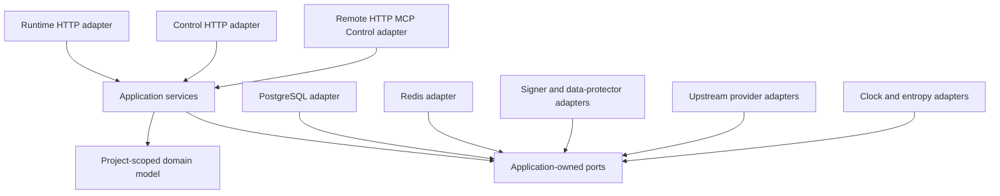
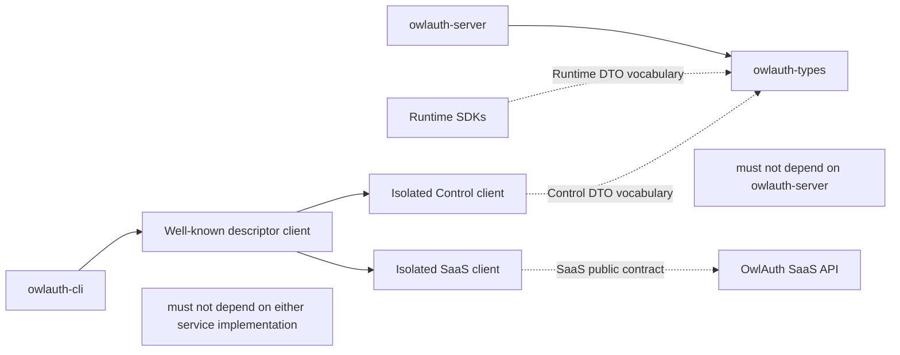

# 02 — Shared core, Project domain, and package boundaries

## Dependency rule

Dependencies point inward. Runtime HTTP, Control HTTP, PostgreSQL, Redis, KMS, upstream providers, the CLI's discovered self-hosted client, self-hosted HTTP MCP, and SDKs are adapters around Project-scoped application and domain policy. The discovered SaaS client and SaaS MCP terminate at SaaS application services instead.

Domain and application modules MUST NOT import HTTP framework types, OpenAPI types, SQL rows, database drivers, Redis clients, provider SDK payloads, CLI parsing, MCP schemas, or client SDK code. Adapter mappings are explicit.

## Package ownership

### `crates/owlauth-server`

This is the single server package. It owns:

- the `owlauth-server` executable and `all`, `runtime`, and `control` composition roots;
- internal Project/Application/identity/login/session/token/key domain modules;
- application services, Project-bound invariants, and deployment-operator Control admission policy;
- persistence, cache, upstream-provider, signer, data-protection, clock, entropy, and audit ports;
- PostgreSQL and Redis adapters and embedded migrations;
- Runtime HTTP and Hosted Authentication UI, Control HTTP and Management Console, remote Streamable HTTP MCP, telemetry, health, and process-lifecycle adapters.

PostgreSQL implementation technology and migration behavior are owned by spec 04; hosted web surfaces, route/base separation, and browser credential behavior are owned by spec 09. Server-only concepts remain internal modules. Logical plane separation does not create separate Cargo packages or duplicated service layers.

### `crates/owlauth-types`

This package owns stable public HTTP DTOs, wire enums, error serialization, endpoint metadata, and OpenAPI derivation. It separates Runtime Project Auth contracts from Control administrative contracts. It does not own domain entities, Project authorization, persistence rows, or provider payloads.

`owlauth-types` MUST NOT depend on the server, CLI, storage drivers, or client SDKs.

### `crates/owlauth-cli`

This package owns the one `owlauth` remote administration experience: argument parsing, endpoint profiles, well-known product/instance/authority/API-base/credential-class discovery and pinning, safe credential input, product-specific typed clients, confirmation, machine output, and public server/SaaS API calls. It MUST NOT link either service implementation, open PostgreSQL/Redis, invoke domain repositories, load Project keys, act as a local Control Plane, or launch a local MCP process.

The CLI uses isolated self-hosted Control and SaaS client modules selected only after endpoint discovery validation. Default Runtime SDK surfaces do not gain administrative operations merely because the CLI and SDK share transport primitives. The two CLI clients do not call or fall back to one another.

### `sdks/*`

SDKs consume public Runtime Project Auth contracts and language-neutral behavior. They initialize with public `project_id`, `application_id`, and publishable configuration; these values identify the Project/Application but never authorize Control operations.

SDKs have no privileged knowledge of rows or domain types. The Rust SDK receives no additional authority from sharing the implementation language. A Control client, if distributed, remains an explicitly separate module/feature and contract.

## Product dependency graph

Forbidden dependencies apply transitively:

- `owlauth-cli -> owlauth-server` or any SaaS service implementation package;
- any client SDK, Control client, or SaaS client `->` its service implementation;
- `owlauth-server -> owlauth-cli | client SDK`;
- `owlauth-types -> owlauth-server | owlauth-cli | client SDK`.

## Project-bound application services

| Service | Representative commands and queries | Plane access |
| --- | --- | --- |
| `ProjectApplicationService` | create/disable Project, read/update metadata, set `belongs_to` | Control |
| `ApplicationConfigurationService` | register/disable Application, manage origins, redirects, publishable key revisions | Control; Runtime reads authoritative state |
| `ProviderConfigurationService` | configure per-Project provider client registrations/secrets and assign them to Applications | Control; Runtime uses active assigned configuration |
| `IdentityConnectionService` | retain/rotate a renewable profile credential, synchronize bounded source profile, reauthorize/revoke/disconnect | Runtime login and bounded workers; Control lifecycle commands |
| `PasswordlessEmailService` | begin/verify OTP or magic-link proof, resolve email identity, enqueue challenge delivery | Runtime; Control configures policy/SMTP |
| `LoginApplicationService` | begin login, validate provider or email completion, complete one-use handoff | Runtime |
| `IdentityApplicationService` | resolve/create Project user, explicitly link/unlink proven identities, disable/merge user, materialize user revision | Runtime and Control with command-specific authorization |
| `ApplicationUserSyncService` | maintain Application-user binding/projection, append immutable events, administer endpoint delivery/replay | Runtime/identity mutations append; Control configures and inspects |
| `SessionApplicationService` | create/validate Project browser session, issue Application session, terminate session | Runtime; Control can revoke through administrative commands |
| `TokenApplicationService` | issue Project access token, rotate refresh family, revoke family | Runtime |
| `ProjectPolicyService` | manage token claims, lifetimes, provider/app admission, and session policy | Control writes; Runtime evaluates |
| `KeyLifecycleService` | provision, publish, activate, retire, and revoke Project signing keys | Control commands; Runtime signs and publishes Project JWKS |
| `DeploymentOperatorAccessService` | authenticate the process-configured operator API key for the Control listener | Control adapters |
| `AuditApplicationService` | append Project/deployment security events and query Control views | both append; Control queries as the deployment operator |

Every Project-bound service method receives a validated `ProjectId` established by the adapter and revalidated against authoritative state. A payload field cannot override the route/actor Project context.

## Domain aggregates and invariants

| Aggregate | Owned invariants |
| --- | --- |
| Project | status, public identifier, token namespace, optional `belongs_to`, revision, isolation boundary |
| Application | Project ownership, type, status, public app identifier, allowed origins, exact post-login redirects |
| Provider configuration | Project ownership, provider issuer/kind, client ID, opaque secret reference, callback identity, revision |
| Project user and linked identities | Project ownership, stable user ID, unique Project/provider issuer/subject, explicit link/merge proof, disabled behavior |
| Login transaction and handoff | Project/Application/browser/provider/redirect/PKCE binding, expiry, one-use completion and exchange |
| Project browser session | Project/user/browser binding, rotation, expiry, and termination; reusable across Applications in one Project |
| Application session and refresh family | Project/Application/user binding, one current generation, strict replay-family revocation |
| Project signing-key ring | Project issuer/purpose, unique `kid`, publish-before-sign lifecycle, verification overlap |
| Audit event | immutable actor/action/Project/target/outcome/correlation semantics without recoverable secrets; Control actor is always the deployment operator |

Aggregate boundaries define transaction scope where one aggregate can enforce the rule alone. Cross-aggregate commands use an application-owned unit of work and PostgreSQL constraints; adapters cannot approximate them with unrelated writes.

## Project isolation rule

Every Project-owned table has `project_id` directly or reaches it through a constraint that PostgreSQL can verify. Security-critical queries include Project qualification even when object IDs are globally unique. Composite foreign keys or equivalent constraints prevent a child row from referencing a parent in another Project.

A Runtime request resolves Project and Application before provider, user, session, ticket, or token lookup. A Control request first authenticates the deployment operator API key and then invokes a Project-bound command. A valid key grants all Control commands; `belongs_to` does not replace Project qualification and is never an authorization check.

Project disablement cannot transfer child resources to another Project. A disabled Project rejects new login, handoff, refresh, current-user, and signing operations while preserving identifiers and durable state for audit and controlled recovery. The Control model exposes no hard-delete transition for Projects, Applications, providers, or users.

## Ports

Application-owned ports expose semantics rather than vendor APIs:

- `UnitOfWork` and repositories with Project qualification, isolation, conditional mutation, and conflict classification;
- `Signer` and `VerificationKeyDirectory` keyed by Project/key-ring purpose and opaque key references;
- `DataProtector` for integrity-bound encryption of recoverable login state;
- `UpstreamProviderClient` with bounded authorization URL, code exchange, issuer/subject validation, profile retrieval, and adapter-declared renewable-profile capability; it exposes no generic provider API or downstream token export;
- `ProviderCredentialProtector` for Project/identity/generation-bound renewable credential encryption and rotation;
- `ProjectSecretStore` for write-only provider, SMTP, and webhook secret provisioning through opaque references;
- `MailDelivery` and `WebhookDelivery` with exact envelope/endpoint, deadlines, response classification, and no authority over durable outbox state;
- `Cache` for disposable values and `RateLimiter` for coordinated admission control;
- `Clock` and `EntropySource`;
- `AuditSink` only for events not required in the same PostgreSQL transaction;
- telemetry interfaces accepting redacted, bounded-cardinality fields.

Redis locks, PostgreSQL advisory locks, or process mutexes MUST NOT leak through domain ports as generic correctness primitives. A port describes the atomic business operation that must be preserved.

## Request path

## Error ownership

- Domain errors express stable Project/authentication meaning without transport or vendor codes.
- Persistence errors distinguish conflict, not found, unavailable, serialization retry, and integrity failure without exposing SQL or cross-Project existence.
- Provider errors distinguish unavailable, rejected callback, invalid claims, and configuration failure without returning provider tokens.
- Cache failures are explicitly degradable or fail-closed according to spec 08.
- Runtime maps errors to the Project Auth API contract and avoids Project/user enumeration.
- Control maps errors to deployment-operator administrative problem details.
- CLI, SDK, and MCP map only public errors.
- Unknown failures produce a generic external response and a correlated redacted internal event.
