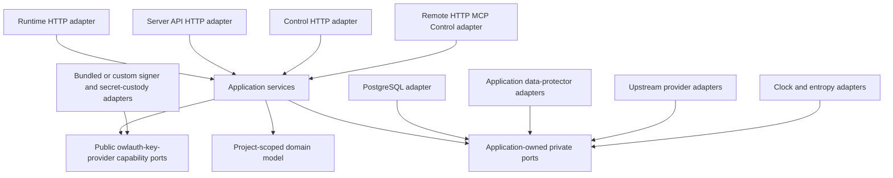
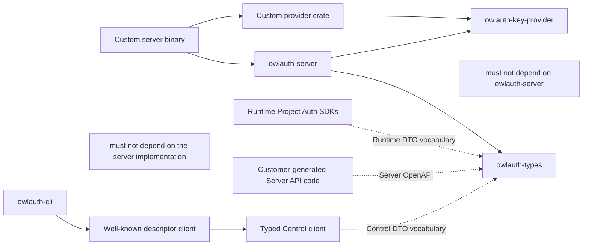
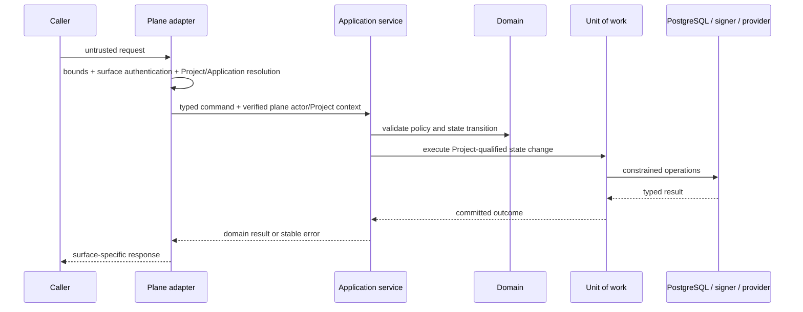

# 02 — Shared core, Project domain, and package boundaries

## Dependency rule

Dependencies point inward. Runtime HTTP, Server API HTTP, Control HTTP, PostgreSQL, key providers, upstream providers, the CLI's discovered Control client, remote HTTP MCP, and Runtime SDKs are adapters around Project-scoped application and domain policy. The public key-provider SPI is an outer composition boundary, not a second domain or application layer.

Domain and application modules MUST NOT import HTTP framework types, OpenAPI types, SQL rows, database drivers, provider SDK payloads, CLI parsing, MCP schemas, or client SDK code. Adapter mappings are explicit.

## Package ownership

### `crates/owlauth-server`

This is the single server package. It owns:

- the `owlauth-server` executable and `all`, `auth`, and `control` composition roots;
- internal Project/Application/identity/login/session/token/key domain modules;
- application services, Project-bound invariants, and deployment-operator Control authorization policy;
- persistence, upstream-provider, data-protection, clock, entropy, and audit ports plus consumption/composition of the public key-provider capabilities;
- PostgreSQL adapters and embedded migrations;
- one Auth listener containing isolated Runtime HTTP/Hosted Authentication UI and Server API adapters, plus the Control listener/Management Console, remote Streamable HTTP MCP, telemetry, health, and process-lifecycle adapters.

PostgreSQL implementation technology and migration behavior are owned by spec 04; hosted web surfaces, route/base separation, and browser credential behavior are owned by spec 09. Server-only concepts remain internal modules except for the deliberately independent `owlauth-key-provider` SPI and the narrow public server composition API needed by custom binaries. Logical plane separation does not create separate domain packages or duplicated service layers.

### `crates/owlauth-key-provider`

This published package owns the narrow provider-neutral Rust SPI for replaceable signing-key and provider/SMTP/webhook configuration-secret custody. It defines bounded opaque handles/envelopes, normalized signing algorithms/public keys/signatures, canonical context values, safe fingerprints, redacted error classes, and role-specific object-safe async capabilities for Control provisioning/sealing and Runtime signing/opening.

It MUST NOT depend on `owlauth-server`, `owlauth-types`, PostgreSQL/HTTP/configuration crates, or a vendor SDK. It owns no Project policy, key-ring lifecycle, persistence, idempotency, audit, readiness, or provider selection. Independent community/deployment provider crates depend on this package; `owlauth-server` consumes it through a high-level public composition builder. The official binary statically links only the bundled local software-custody provider, which is not a KMS. The OwlAuth repository and official distribution include no vendor KMS/HSM implementation; a deployment compiles its custom provider into a custom binary. V1 has no runtime Rust dynamic-library, directory-scanned, subprocess, or sidecar plugin mechanism.

### `crates/owlauth-types`

This package owns stable public HTTP DTOs, wire enums, error serialization, endpoint metadata, and OpenAPI derivation. It separates Runtime Project Auth, customer-backend Server API, and Control administrative contracts. It does not own domain entities, Project authorization, persistence rows, or provider payloads.

`owlauth-types` MUST NOT depend on the server, CLI, storage drivers, or client SDKs.

### `crates/owlauth-cli`

This package owns the `owlauth` remote administration experience: argument parsing, endpoint profiles, well-known OwlAuth server product/instance/authority/API-base/credential-class discovery and pinning, safe operator-credential input, the typed Control client, confirmation, machine output, and public Control API calls. It MUST NOT link the server implementation, open PostgreSQL, invoke domain repositories, load Project keys, act as a local Control Plane, or launch a local MCP process.

Default Runtime SDK surfaces do not gain administrative operations merely because the CLI and SDK share transport primitives.

### `sdks/*`

SDKs consume only public Runtime Project Auth contracts and language-neutral behavior. They initialize with public `project_id`, `application_id`, and publishable configuration; these values identify the Project/Application but never authorize Server API or Control operations. Customer backends consume the separate Server OpenAPI directly and own generated clients; OwlAuth publishes no Server API SDK.

SDKs have no privileged knowledge of rows or domain types. The Rust SDK receives no additional authority from sharing the implementation language. A Control client, if distributed, remains an explicitly separate module/feature and contract.

## Product dependency graph

Forbidden dependencies apply transitively:

- `owlauth-cli -> owlauth-server`;
- any client SDK or Control client `->` the server implementation;
- `owlauth-server -> owlauth-cli | client SDK`;
- `owlauth-types -> owlauth-server | owlauth-cli | client SDK`;
- `owlauth-key-provider -> owlauth-server | owlauth-types | PostgreSQL/HTTP/configuration | vendor SDK`.

The SPI dependency does not make arbitrary server internals public. `owlauth-server` exposes a builder or equivalent `run_with_providers` entry point accepting capability objects and typed server configuration; repositories, routers, database rows, and private application errors remain internal.

## Project-bound application services

| Service                           | Representative commands and queries                                                                                  | Plane access                                                       |
| --------------------------------- | -------------------------------------------------------------------------------------------------------------------- | ------------------------------------------------------------------ |
| `ProjectApplicationService`       | create/disable Project, read/update metadata, set `belongs_to`                                                       | Control                                                            |
| `ApplicationConfigurationService` | register/disable Application, manage origins, redirects, publishable key revisions                                   | Control; Runtime reads authoritative state                         |
| `ProviderConfigurationService`    | configure per-Project provider client registrations/secrets and assign them to Applications                          | Control; Runtime uses active assigned configuration                |
| `IdentityConnectionService`       | retain/rotate a renewable profile credential, synchronize bounded source profile, reauthorize/revoke/disconnect      | Runtime login and bounded workers; Control lifecycle commands      |
| `PasswordlessEmailService`        | begin/verify OTP or magic-link proof, resolve email identity, enqueue challenge delivery                             | Runtime; Control configures policy/SMTP                            |
| `LoginApplicationService`         | begin login, validate provider or email completion, complete one-use handoff                                         | Runtime                                                            |
| `IdentityApplicationService`      | resolve/create Project user, explicitly link/unlink proven identities, disable/merge user, materialize user revision | Runtime and Control with command-specific authorization            |
| `ApplicationUserSyncService`      | maintain Application-user binding/projection, append immutable events, administer endpoint delivery/replay           | Runtime/identity mutations append; Control configures and inspects |
| `SessionApplicationService`       | create/validate Project browser session, issue Application session, terminate session                                | Runtime; Control can revoke through administrative commands        |
| `TokenApplicationService`         | issue Project access token, rotate refresh family, revoke family                                                     | Runtime                                                            |
| `ProjectPolicyService`            | manage token claims, lifetimes, provider/Application eligibility, and session policy                                 | Control writes; Runtime evaluates                                  |
| `KeyLifecycleService`             | provision, publish, activate, retire, and revoke Project signing keys                                                | Control commands; Runtime signs and publishes Project JWKS         |
| `ProjectServerAccessService`      | create/revoke Project server-key commitments and authenticate one exact Project server actor                         | Control lifecycle; Server API authentication                       |
| `ProjectServerQueryService`       | bounded Project users/Application projections and authoritative access-token introspection                           | Server API                                                         |
| `DeploymentOperatorAccessService` | authenticate the process-configured operator API key for the Control listener                                        | Control adapters                                                   |
| `AuditApplicationService`         | append Project/deployment security events and query Control views                                                    | both append; Control queries as the deployment operator            |

Every Project-bound service method receives a validated `ProjectId` established by the adapter and revalidated against authoritative state. A payload field cannot override the route/actor Project context.

## Domain aggregates and invariants

| Aggregate                              | Owned invariants                                                                                                                                 |
| -------------------------------------- | ------------------------------------------------------------------------------------------------------------------------------------------------ |
| Project                                | status, public identifier, token namespace, optional `belongs_to`, revision, isolation boundary                                                  |
| Application                            | Project ownership, type, status, public app identifier, allowed origins, exact post-login redirects                                              |
| Provider configuration                 | Project ownership, provider issuer/kind, client ID, stable protected-material ID, callback identity, revision                                    |
| Project user and linked identities     | Project ownership, stable user ID, unique Project/provider issuer/subject, explicit link/merge proof, disabled behavior                          |
| Login transaction and handoff          | Project/Application/browser/provider/redirect/PKCE binding, expiry, one-use completion and exchange                                              |
| Project browser session                | Project/user/browser binding, rotation, expiry, and termination; reusable across Applications in one Project                                     |
| Application session and refresh family | Project/Application/user binding, one current generation, strict replay-family revocation                                                        |
| Project signing-key ring               | Project issuer/purpose, unique `kid`, publish-before-sign lifecycle, verification overlap                                                        |
| Audit event                            | immutable actor/action/Project/target/outcome/correlation semantics without recoverable secrets; Control actor is always the deployment operator |

Aggregate boundaries define transaction scope where one aggregate can enforce the rule alone. Cross-aggregate commands use an application-owned unit of work and PostgreSQL constraints; adapters cannot approximate them with unrelated writes.

## Project isolation rule

Every Project-owned table has `project_id` directly or reaches it through a constraint that PostgreSQL can verify. Security-critical queries include Project qualification even when object IDs are globally unique. Composite foreign keys or equivalent constraints prevent a child row from referencing a parent in another Project.

A Runtime request resolves Project and Application before provider, user, session, ticket, or token lookup. A Server API request authenticates one Project server key, requires the route Project to match that exact Project, and invokes only the read-only Server query boundary. A Control request first authenticates the deployment operator API key and then invokes a Project-bound command. A valid key grants all Control commands; `belongs_to` does not replace Project qualification and is never an authorization check.

Project disablement cannot transfer child resources to another Project. A disabled Project rejects new login, handoff, refresh, current-user, and signing operations while preserving identifiers and durable state for audit and controlled recovery. The Control model exposes no hard-delete transition for Projects, Applications, providers, or users.

## Ports

Application-owned ports expose semantics rather than vendor APIs:

- `UnitOfWork` and repositories with Project qualification, isolation, conditional mutation, and conflict classification;
- a Control signing-key provisioner that creates/reconciles an exact algorithm under a stable operation identity and returns an opaque bounded handle plus normalized public key, and a separate Runtime signer that signs complete JWS inputs by exact handle/algorithm without create/list/export/destroy authority;
- `VerificationKeyDirectory` keyed by Project/key-ring purpose and authoritative public material;
- `DataProtector` for integrity-bound encryption of recoverable login state;
- `UpstreamProviderClient` with bounded authorization URL, code exchange, issuer/subject validation, profile retrieval, and adapter-declared renewable-profile capability; it exposes no generic provider API or downstream token export;
- `ProviderCredentialProtector` for Project/identity/generation-bound renewable credential encryption and rotation;
- a Control configuration-secret sealer that returns an opaque bounded envelope and stable safe fingerprint for exact server-derived purpose/owner/generation context, plus separate Runtime/worker openers that can open only the selected envelope under the same context and cannot provision, enumerate, or mutate unrelated material;
- `MailDelivery` and `WebhookDelivery` with exact envelope/endpoint, deadlines, response classification, and no authority over durable outbox state;
- `Clock` and `EntropySource`;
- `AuditSink` only for events not required in the same PostgreSQL transaction;
- telemetry interfaces accepting redacted, bounded-cardinality fields.

PostgreSQL advisory locks or process mutexes MUST NOT leak through domain ports as generic correctness primitives. A port describes the atomic business operation that must be preserved.

## Request path

## Error ownership

- Domain errors express stable Project/authentication meaning without transport or vendor codes.
- Persistence errors distinguish conflict, not found, unavailable, serialization retry, and integrity failure without exposing SQL or cross-Project existence.
- Upstream-provider errors distinguish unavailable, rejected callback, invalid claims, and configuration failure without returning provider tokens.
- Key-provider errors use a bounded redacted taxonomy that distinguishes unsupported algorithm/version, unavailable, rejected, ambiguous external signing-key effect, invalid material, and integrity failure without vendor payloads, opaque values, plaintext, or key bytes.
- Cache failures are explicitly degradable or fail-closed according to spec 08.
- Runtime maps errors to the Project Auth API contract and avoids Project/user enumeration.
- Control maps errors to deployment-operator administrative problem details.
- CLI, SDK, and MCP map only public errors.
- Unknown failures produce a generic external response and a correlated redacted internal event.
