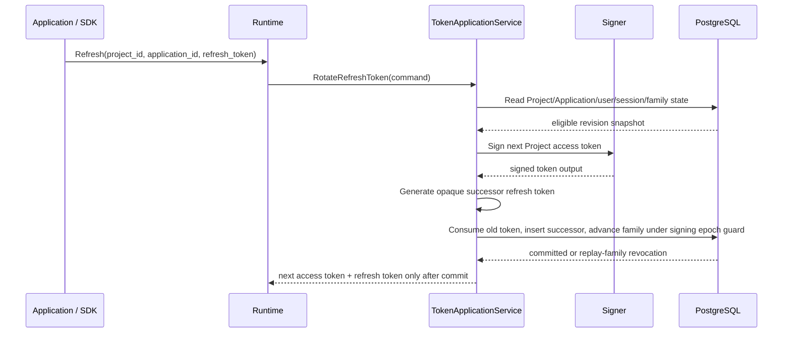

# 03 — Project authentication flows and security invariants

## Runtime protocol profile

OwlAuth exposes a Project Auth protocol to downstream Applications. It is not a general OAuth/OIDC authorization server: downstream Applications do not register OAuth grants, request OAuth scopes, receive OIDC ID tokens, or use OwlAuth client secrets.

OAuth/OIDC is used only between OwlAuth and a Project's configured upstream provider. The downstream protocol uses a Project/Application login transaction, a short-lived one-use handoff ticket with PKCE, a Project access token, and a stateful rotating refresh token.

## Public identifiers and credentials

| Value | Form | Purpose | Security role |
| --- | --- | --- | --- |
| `project_id` | public stable identifier | select isolated Project auth namespace | not a secret or authorization credential |
| `application_id` | public stable identifier | identify web/mobile/native/server Application | not a secret or Control credential |
| Publishable application key | public revocable identifier | SDK initialization, quotas, and abuse attribution | never grants administrative or user authority |
| Login transaction handle | high-entropy opaque browser value | bind provider redirect and browser interaction | digest in PostgreSQL; short-lived and one-use where transitioned |
| Upstream provider state | high-entropy opaque value | bind provider callback to Project login transaction | digest in PostgreSQL; exact provider/Project binding |
| Handoff ticket | high-entropy opaque value | transfer authenticated result to an Application | digest in PostgreSQL; one-use and PKCE-bound |
| Project browser session | opaque hardened cookie | reuse authentication among Applications in one Project | digest in PostgreSQL; Project/user/browser bound |
| Project access token | short-lived signed JWT | authenticate Project user to that Project's backend | Project issuer/audience; Application and session context |
| Refresh token | high-entropy opaque value | rotate one Application session family | digest in PostgreSQL; Project/Application/user bound |
| Provider secret | secret-store reference | authenticate OwlAuth to GitHub/Google/upstream provider | Project provider adapter only; never browser-visible |
| Deployment operator API key | single secret loaded from `OWLAUTH_CONTROL_API_KEY` | administer the entire deployment through Control | Control-listener only and categorically never accepted by Runtime |

A Project access token is an OwlAuth application-session credential, not an OAuth access token. Its use as an HTTP Bearer token does not make Runtime an OAuth authorization server.

## Project token namespace

Each Project has a stable issuer derived from trusted Runtime configuration and immutable Project identity:

```text
https://auth.example.com/projects/{project_id}
```

A Project access token contains at least:

| Claim | Meaning |
| --- | --- |
| `iss` | exact Project issuer |
| `aud` | exact immutable Project public ID |
| `sub` | Project-scoped user ID |
| `app_id` | initiating Application ID |
| `sid` | Application session ID |
| `iat`, `nbf`, `exp` | bounded issuance and validity times |
| `jti` | unique token identifier |
| `typ` | Project access-token type |
| `auth_time` | time of the underlying Project authentication |
| `claims_rev` | Project/user claims-policy revision |

Project-defined custom claims are bounded, namespaced, and generated from current Project policy. Provider payloads, provider tokens, email verification internals, `belongs_to`, the operator API key, and secret references never enter the token.

The Application backend verifies signature, allowlisted algorithm, `kid`, exact Project issuer, exact Project audience, token type, and time claims. The Project is also the token trust boundary: Applications in one Project share backend token trust by default, while `app_id` records the initiating Application for policy/audit and may be allowlisted by a backend for additional restriction. Applications requiring mutually isolated token audiences use separate Projects. A token from Project A is invalid for Project B even if signing infrastructure is shared physically.

## Login start and upstream callback

Two redirect classes remain separate:

- **provider callback URI:** trusted OwlAuth Runtime URI registered with GitHub/Google for one Project/provider configuration;
- **application redirect URI:** exact Application allowlist entry to which OwlAuth may return a handoff ticket.

```mermaid
sequenceDiagram
    actor User as End user
    participant App as Application / SDK
    participant Hosted as Runtime Hosted Authentication UI
    participant Runtime
    participant Core as Shared core
    participant PG as PostgreSQL
    participant Provider as GitHub / Google

    User->>App: Start sign-in
    App->>Runtime: Begin login(project_id, application_id, provider, redirect_to, PKCE challenge, app_state)
    Runtime->>Core: BeginLogin(command)
    Core->>PG: Validate active Project/Application/provider and exact redirect; create transaction
    PG-->>Core: login transaction
    Core-->>Runtime: bounded hosted interaction URL
    Runtime-->>App: hosted authentication URL
    App-->>User: Navigate to hosted authentication
    User->>Hosted: Open bound interaction
    Hosted->>Runtime: Continue with transaction-bound provider
    Runtime->>Core: Revalidate interaction and build provider authorization
    Core-->>Runtime: provider authorization request + upstream state
    Runtime-->>User: Set Project interaction cookie; redirect to provider
    User->>Provider: Authenticate
    Provider-->>Runtime: Exact Project/provider callback + provider code + state
    Runtime->>Core: ClaimProviderCallback(command)
    Core->>PG: Atomically move pending transaction to provider_exchange_in_progress
    PG-->>Core: claimed callback transaction
    Core->>Provider: Exchange provider code and validate identity exactly once
    Provider-->>Core: verified issuer + subject + bounded claims
    Core->>PG: Revalidate assignment; resolve/create Project user; create browser session and handoff ticket
    PG-->>Core: committed login result
    Core-->>Runtime: exact Application redirect + opaque handoff ticket + app_state
    Runtime-->>Hosted: Safe completion result
    Hosted-->>User: Redirect to exact Application URL
    User->>App: handoff ticket + app_state
```

### Login-start invariants

- Project, Application, provider configuration, and redirect entry are active and belong to the same Project; the provider configuration is explicitly assigned to that Application.
- `redirect_to` is parsed safely and exact-match compared with the selected Application's registered value. Wildcards, prefixes, substring matching, user-info confusion, and redirect chaining are forbidden.
- Web/native login handoff requires Application-generated PKCE S256. `plain` and omitted challenges are rejected.
- The upstream provider adapter independently uses provider-side PKCE S256 when supported or required; its verifier is server-generated, transaction-bound, encrypted at rest, and never reused as the Application verifier.
- Application-provided state is bounded and retained as integrity-bound ciphertext solely for return; it is never interpreted as authority.
- The transaction binds Project, Application, provider, exact provider callback, exact application redirect, PKCE challenge, browser interaction, and trusted external origin.
- A valid Project browser session may satisfy local authentication for another active Application in the same Project without another provider redirect, subject to Project policy. It never authenticates another Project.
- Public identifiers and publishable keys may drive rate/quota policy but cannot bypass these checks.

### Hosted-interaction invariants

- The Hosted Authentication UI is a Runtime adapter governed by spec 09. It loads an opaque transaction handle and derives Project/Application/provider/redirect state from PostgreSQL; page fields and query parameters cannot replace that state.
- The displayed/continued provider is the active configuration already bound to the transaction, is assigned to the Application, and is revalidated before redirect. A future provider-picker contract would require an explicit transaction-state revision rather than accepting an arbitrary page value.
- Project branding and Application display values are bounded public configuration and rendered as untrusted content. Hosted pages load no caller-controlled executable resources or navigation targets.
- A completion page redirects only to the exact Application URL stored at login start and includes only the permitted handoff and bounded application state. A local error/restart page cannot redirect from provider or caller error input.
- Runtime and Control hosted web surfaces may share an external origin only under the explicit non-overlapping base-path model in spec 09; the operator key is never available to the hosted interaction.

### Provider-callback invariants

- The callback route itself identifies the expected Project and provider configuration; callback parameters cannot select another Project/provider.
- OwlAuth validates upstream state digest, login transaction status, browser binding, provider ID, Project ID, exact callback URI, expiry, and one-use transition.
- Before the external exchange, PostgreSQL atomically moves the transaction from `pending_authentication` to `provider_exchange_in_progress`; concurrent callbacks cannot claim it.
- Provider code exchange uses only the Project's configured client ID, secret reference, transaction-bound provider PKCE verifier where applicable, endpoint allowlist, TLS policy, and timeout. It is not automatically retried after an ambiguous outcome.
- Explicit or ambiguous exchange failure moves the transaction to terminal `provider_exchange_failed`; the user starts a new login instead of replaying the provider code.
- Provider issuer/signature/claims where applicable and stable provider subject are validated by the provider adapter.
- Local identity lookup uses `(project_id, provider_issuer, provider_subject)`, never email, display name, login name, or avatar URL.
- An unknown verified identity creates a Project user and linked identity atomically. The same provider identity in another Project creates/resolves an independent user.
- Matching email never silently links users. Link or merge requires explicit proof and Project-bound domain preconditions.
- A disabled Project or user cannot produce a handoff ticket.
- Callback completion revalidates that the provider registration remains actively assigned to the Application; an assignment revision mismatch terminates the login.
- Provider access/refresh tokens are used only transiently for the configured identity/profile retrieval and are discarded after callback completion. They are never returned downstream or retained in Project profile data.
- Provider credentials and full provider payloads never enter redirect parameters, user profile JSON, audit context, or ordinary logs.

## Handoff exchange

The Application exchanges the ticket through a direct Runtime call. No Project token or refresh token appears in a redirect URL.

```mermaid
sequenceDiagram
    participant App as Application / SDK
    participant Runtime
    participant Core as SessionApplicationService
    participant Signer
    participant PG as PostgreSQL

    App->>Runtime: Exchange(ticket, application_id, PKCE verifier)
    Runtime->>Core: ExchangeHandoff(command)
    Core->>PG: Read ticket and authoritative Project/Application/user state
    PG-->>Core: eligible revision snapshot
    Core->>Signer: Sign prepared Project access-token claims
    Signer-->>Core: signed token output
    Core->>PG: Conditionally consume ticket; create Application session and refresh family under signing epoch guard
    PG-->>Core: committed or conflict
    Core-->>Runtime: user + session metadata + access token + refresh token
    Runtime-->>App: bounded Project Auth response
```

The final transaction:

- verifies the handoff ticket digest and unconsumed status;
- binds exact Project, Application, redirect result, user, provider result, and PKCE verifier;
- revalidates Project/Application/user status, current Application-provider assignment, and policy revisions;
- requires the Project signing-key epoch used for prepared claims to remain active;
- consumes the ticket exactly once;
- creates one Application session and refresh-family generation;
- appends the audit event atomically.

Signed output prepared from a stale snapshot is discarded. A losing exchange returns a generic expired/invalid handoff result and never receives token material.

## Application and browser session model

A Project browser session is bound to Project, user, browser credential, authentication time, and user/Project security revisions. It is intentionally independent of an Application so that multiple Applications in the same Project can share sign-in state.

An Application session is bound to Project, Application, user, Project browser session where applicable, claims revision, and refresh family. Disabling one Application invalidates that Application's handoff tickets, Application sessions, and refresh families but does not log the user out of other Applications or terminate the Project browser session.

Disabling a user or Project advances a security revision that logically invalidates every affected browser session, Application session, handoff ticket, and refresh family without requiring an unbounded row update.

## Refresh rotation



A refresh token is one-use and one family has one current generation. At most one transaction presenting generation `n` creates generation `n+1`. Any later or concurrent presentation of consumed generation `n` is replay and revokes the entire family, including a successor created by a competing request. There is no stable winner after reuse is detected.

This strict policy favors containment. SDKs serialize refresh per family and treat an ambiguous lost rotation response as reauthentication rather than retrying the old token indefinitely.

Refresh revalidates Project, Application, user, Application session, family, claims policy, expiry, and active signing epoch. If the Application session references a Project browser session, refresh also checks that browser session's current status and revision; Project browser logout therefore blocks further refresh for every derived session. Refresh cannot move a session to another Project/Application or broaden claims.

## Current user and profile data

A valid Project access token can request the current Project user from the Runtime current-user endpoint. The response includes only Project policy-approved user/profile fields and the current Application/session context. It does not expose linked-provider tokens, secret references, management metadata, `belongs_to`, users in another Project, or arbitrary provider payloads.

The handoff exchange and refresh response may include the same bounded current-user representation so an Application does not need a second request solely to initialize local state.

## Logout and revocation

- Application logout revokes the selected Application session and refresh family and clears Application-held credentials.
- Project browser logout atomically marks the current Project browser session terminated. Derived Application access tokens retain offline expiry, but every refresh checks the referenced browser-session status/revision and fails after termination.
- A user may choose Application-only logout without terminating other Applications in the Project.
- User disablement invalidates all of that Project user's browser/Application sessions, handoff tickets, and refresh families through the user security revision.
- Project disablement invalidates every Runtime operation in the Project through the Project security revision.
- Application disablement invalidates only that Application's Runtime credentials and pending handoffs.
- Revocation responses do not reveal whether an unrelated Project, user, session, or token exists.

Already issued self-contained Project access tokens remain cryptographically valid until short expiry unless the application backend uses a separately defined online status check. New handoff, refresh, and current-user operations observe authoritative status immediately after PostgreSQL commit.

## Browser, native, and request safety

Browser state-changing operations use CSRF protection bound to Project interaction or browser session. Cookies are `Secure`, `HttpOnly`, host-only where possible, narrowly scoped, and use a reviewed `SameSite` policy. Session credentials rotate after authentication and privilege changes.

Web pages use restrictive CSP, framing, referrer, and cache-control policies. Provider values, Project tokens, refresh tokens, and user data are not exposed to third-party resources. A handoff ticket may appear only in the exact final Application redirect, is short-lived/one-use/PKCE-bound, and the Application SDK removes it from browser history immediately after capture before loading third-party resources. Native redirects use exact registered schemes/universal links and PKCE; custom-scheme ambiguity is rejected.

Request bodies, headers, parameter counts, and string lengths have endpoint-specific bounds. Duplicate singleton parameters, ambiguous encodings, unsupported content types, and conflicting credentials are rejected. External Runtime URLs and provider callbacks derive from trusted configuration, not arbitrary `Host` or forwarding headers.

## Cryptography, logging, and audit

Random values come from the operating-system CSPRNG. Raw tickets, refresh tokens, cookies, and provider credentials cross the smallest possible interface and are stored only as digests or encrypted provider-specific material where recovery is necessary.

Logs, traces, metrics, errors, audit events, OpenAPI examples, and agent context never contain provider tokens, provider codes, handoff tickets, Project access tokens, refresh tokens, PKCE verifiers, cookies, provider secrets, the deployment operator API key, private keys, full callback URLs, or complete user profiles. Audit events record Project, Application, stable user/target references where authorized, action, outcome, reason class, and correlation without recoverable credentials.
