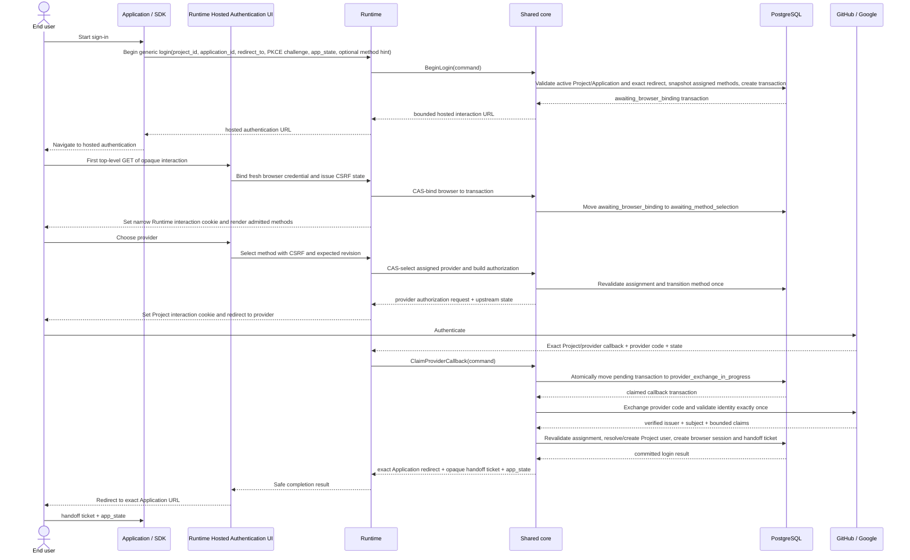
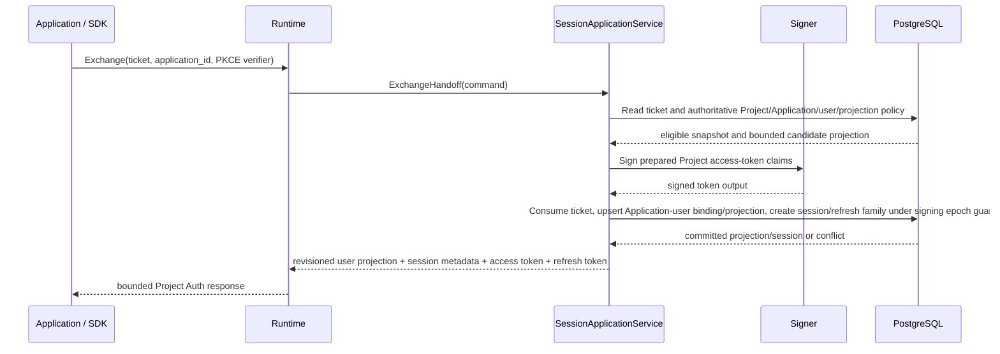
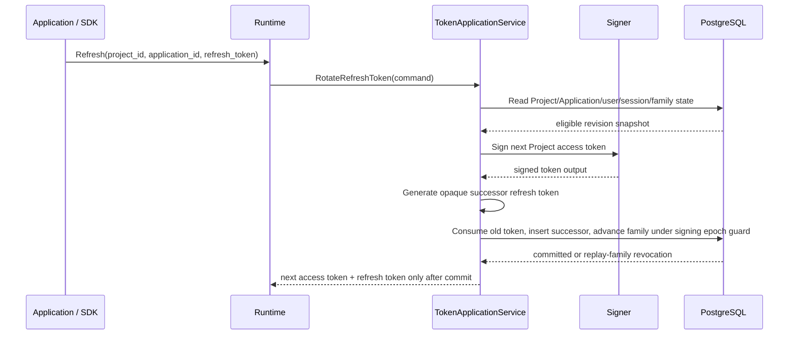

# 03 — Project authentication flows and security invariants

## Runtime protocol profile

OwlAuth exposes a Project Auth protocol to downstream Applications. It is not a general OAuth/OIDC authorization server: downstream Applications do not register OAuth grants, request OAuth scopes, receive OIDC ID tokens, or use OwlAuth client secrets.

OAuth/OIDC is used only between OwlAuth and a Project's configured upstream provider. A Project may alternatively prove a first-party email identity through the OTP or magic-link flow owned by [spec 11](11-identity-connections-passwordless-email-and-user-sync.md). Both methods converge on the same downstream Project/Application login transaction, short-lived one-use handoff ticket with PKCE, Project access token, and stateful rotating refresh token.

## Public identifiers and credentials

| Value                       | Form                                                | Purpose                                                 | Security role                                                     |
| --------------------------- | --------------------------------------------------- | ------------------------------------------------------- | ----------------------------------------------------------------- |
| `project_id`                | public stable identifier                            | select isolated Project auth namespace                  | not a secret or authorization credential                          |
| `application_id`            | public stable identifier                            | identify web/mobile/native/server Application           | not a secret or Control credential                                |
| Publishable application key | public revocable identifier                         | SDK initialization, quotas, and abuse attribution       | never grants administrative or user authority                     |
| Login transaction handle    | high-entropy opaque browser value                   | bind provider redirect and browser interaction          | digest in PostgreSQL; short-lived and one-use where transitioned  |
| Upstream provider state     | high-entropy opaque value                           | bind provider callback to Project login transaction     | digest in PostgreSQL; exact provider/Project binding              |
| Handoff ticket              | high-entropy opaque value                           | transfer authenticated result to an Application         | digest in PostgreSQL; one-use and PKCE-bound                      |
| Project browser session     | opaque hardened cookie                              | reuse authentication among Applications in one Project  | digest in PostgreSQL; Project/user/browser bound                  |
| Project access token        | short-lived signed JWT                              | authenticate Project user to that Project's backend     | Project issuer/audience; Application and session context          |
| Refresh token               | high-entropy opaque value                           | rotate one Application session family                   | digest in PostgreSQL; Project/Application/user bound              |
| Provider secret             | secret-store reference                              | authenticate OwlAuth to GitHub/Google/upstream provider | Project provider adapter only; never browser-visible              |
| Deployment operator API key | single secret loaded from `OWLAUTH_CONTROL_API_KEY` | administer the entire deployment through Control        | Control-listener only and categorically never accepted by Runtime |

A Project access token is an OwlAuth application-session credential, not an OAuth access token. Its use as an HTTP Bearer token does not make Runtime an OAuth authorization server.

## Project token namespace

Each Project has a stable issuer derived from trusted Runtime configuration and immutable Project identity:

```text
https://auth.example.com/projects/{project_id}
```

A Project access token contains at least:

| Claim               | Meaning                                       |
| ------------------- | --------------------------------------------- |
| `iss`               | exact Project issuer                          |
| `aud`               | exact immutable Project public ID             |
| `sub`               | Project-scoped user ID                        |
| `app_id`            | initiating Application ID                     |
| `sid`               | Application session ID                        |
| `iat`, `nbf`, `exp` | bounded issuance and validity times           |
| `jti`               | unique token identifier                       |
| `typ`               | Project access-token type                     |
| `auth_time`         | time of the underlying Project authentication |
| `claims_rev`        | Project/user claims-policy revision           |

Project-defined custom claims are bounded, namespaced, and generated from current Project policy. Provider payloads, provider tokens, email verification internals, `belongs_to`, the operator API key, and secret references never enter the token.

The Application backend verifies signature, allowlisted algorithm, `kid`, exact Project issuer, exact Project audience, token type, and time claims. The Project is also the token trust boundary: Applications in one Project share backend token trust by default, while `app_id` records the initiating Application for policy/audit and may be allowlisted by a backend for additional restriction. Applications requiring mutually isolated token audiences use separate Projects. A token from Project A is invalid for Project B even if signing infrastructure is shared physically.

## Login start and upstream callback

Two redirect classes remain separate:

- **provider callback URI:** trusted OwlAuth Runtime URI registered with GitHub/Google for one Project/provider configuration;
- **application redirect URI:** exact Application allowlist entry to which OwlAuth may return a handoff ticket.



### Login-start invariants

- Project, Application, and redirect entry are active and belong to the same Project. Login start snapshots the bounded set and revisions of currently assigned active provider/email methods; it does not bind or start one method.
- `redirect_to` is parsed safely and exact-match compared with the selected Application's registered value. Wildcards, prefixes, substring matching, user-info confusion, and redirect chaining are forbidden.
- Web/native login handoff requires Application-generated PKCE S256. `plain` and omitted challenges are rejected.
- The first restricted OIDC adapter requires provider-side PKCE S256. Its verifier is generated only after provider selection, transaction-bound, encrypted at rest, and never reused as the Application verifier. A future reviewed provider profile may omit provider-side PKCE only when that upstream protocol does not support it; this never makes the OIDC nonce optional.
- Application-provided state is bounded and retained as integrity-bound ciphertext solely for return; it is never interpreted as authority. An optional method hint affects presentation only and cannot select, enable, or authorize a method.
- Generic start creates `awaiting_browser_binding` and binds Project, Application, exact Application redirect, PKCE challenge, trusted external origin, allowed-method snapshot, optional presentation hint, and monotonic transaction revision, but no browser, CSRF state, or selected method. This supports both browser-direct and backend-custody Applications without accepting a caller-named browser identity.
- Only the first top-level Hosted GET of the opaque interaction may compare-and-swap `awaiting_browser_binding` to `awaiting_method_selection`, bind a fresh Runtime-generated browser credential digest, issue same-origin CSRF state, and set the narrow interaction cookie. The bootstrap requires a top-level document navigation and rejects subresources, API fetches, and framed requests. Its navigation may legitimately be cross-origin from the Application; Fetch Metadata is used to distinguish navigation from cross-origin API/subresource traffic, not to require a same-origin initiator. Query values cannot replace the interaction or browser binding. A transaction already bound to another browser fails generically rather than rebinding. All later mutating commands require the bound cookie and same-origin CSRF protections.
- After browser binding, the transaction binds Project, Application, exact Application redirect, PKCE challenge, browser interaction, trusted external origin, allowed-method snapshot, CSRF state, and monotonic transaction revision. An explicit same-origin command compare-and-swaps one method from `awaiting_method_selection`; provider selection then binds exact provider configuration/callback/upstream state, while email selection permits address/challenge creation under spec 11.
- Method selection is one-way once provider exchange or email proof state starts. Changing method requires a new login transaction; query/page fields cannot mutate the stored selection.
- A valid Project browser session may satisfy local authentication for another active Application in the same Project without another provider redirect, but only through the explicit reuse confirmation transition below. It never authenticates another Project.
- Public identifiers and publishable keys may drive rate/quota policy but cannot bypass these checks.

### Project browser-session reuse

When Project policy permits reuse and the Hosted request presents a currently valid Project browser-session cookie, the UI may offer a bounded “continue as” action separate from provider/email method selection. The display is not authority. An explicit same-origin `ConfirmBrowserSessionReuse` command carries CSRF and expected login-transaction revision; Runtime derives the browser credential from the hardened cookie rather than a page-supplied session/user ID.

One PostgreSQL transaction compare-and-swaps `awaiting_method_selection` directly to `handoff_issued`, while revalidating the exact Project/Application/redirect/PKCE transaction, current Project/user/browser-session status and security revisions, session authentication age/reuse policy, and browser binding. It creates exactly one ordinary handoff ticket and audit event. A concurrent provider/email selection or reuse confirmation loses the same transaction-revision/status guard. A terminated, expired, wrong-Project, stale-revision, or otherwise ineligible browser session fails generically and cannot fall back to a caller-selected identity; the user may restart and choose an admitted provider/email method.

Reuse is not an authentication method in the allowed provider/email snapshot and cannot bypass fresh authentication where policy requires it. The resulting handoff still creates the destination Application binding/projection and Application session only when exchanged successfully.

### Hosted-interaction invariants

- The Hosted Authentication UI is a Runtime adapter governed by spec 09. It loads an opaque transaction handle and derives Project/Application/allowed-method/selected-method/redirect state from PostgreSQL; page fields and query parameters cannot replace that state.
- It displays only methods in the admitted snapshot. Provider/email selection submits a same-origin CSRF-protected Runtime command with the expected transaction revision; the server revalidates current assignment and permits exactly one method-specific transition. The separate browser-session reuse action follows its own confirmation command and competes on the same `awaiting_method_selection` revision/status. A provider authorization request uses only the resulting stored provider configuration.
- Project branding and Application display values are bounded public configuration and rendered as untrusted content. Hosted pages load no caller-controlled executable resources or navigation targets.
- A completion page redirects only to the exact Application URL stored at login start and includes only the permitted handoff and bounded application state. A local error/restart page cannot redirect from provider or caller error input.
- Runtime and Control hosted web surfaces may share an external origin only under the explicit non-overlapping base-path model in spec 09; the operator key is never available to the hosted interaction.

### Provider-callback invariants

- The stable callback route is exactly `projects/{project_public_id}/auth/callback/{provider_key}` relative to the configured Runtime base. The path identifies the expected Project and provider configuration; callback parameters cannot select another Project/provider, interaction class, or proof slot, and no second alias is accepted.
- Upstream state resolves exactly one persisted typed owner before any external I/O: an ordinary `login` transaction owned by this spec or an `identity_mutation` intent/slot owned by spec 11. OwlAuth validates that owner's state digest/status, interaction browser binding, provider/Application assignment, Project, exact callback URI, expiry, and one-use transition. There is no fallback across classes.
- Before the external exchange, PostgreSQL atomically moves the selected typed owner from `provider_authorization_started` to `provider_exchange_in_progress`; concurrent callbacks cannot claim it. The remaining handoff/user-creation rules in this section apply only to `login`; mutation completion may persist only candidate/existing-identity evidence and one server-side receipt under spec 11.
- The OIDC adapter generates a fresh high-entropy nonce only when the provider method wins selection, sends it in the authorization request, stores only its purpose-keyed digest and key version, and requires an exact nonce match in the validated ID token. Missing, duplicate, mismatched, or replayed nonce is terminal; caller input cannot supply it.
- Provider code exchange uses only the Project's configured client ID, secret reference, the transaction-bound provider PKCE verifier when required by that provider profile, the mandatory transaction-bound OIDC nonce for OIDC, endpoint allowlist, TLS policy, and timeout. The first restricted OIDC profile requires both PKCE S256 and nonce. Exchange is not automatically retried after an ambiguous outcome.
- Explicit or ambiguous exchange failure moves the exact typed owner to terminal `provider_exchange_failed`; login starts a new login and mutation starts a new intent/slot ceremony instead of replaying the provider code.
- Provider issuer/signature/claims where applicable and stable provider subject are validated by the provider adapter.
- Local identity lookup uses `(project_id, provider_issuer, provider_subject)`, never email, display name, login name, or avatar URL.
- For `login`, an unknown verified identity creates a Project user and linked identity atomically, and the same provider identity in another Project creates/resolves an independent user. For `identity_mutation`, an unknown identity creates only short-term candidate evidence; durable identity creation/attachment waits for final Control confirmation under spec 11.
- Matching email never silently links users. Link or merge requires explicit proof and Project-bound domain preconditions.
- A disabled Project or user cannot produce a handoff ticket or mutation receipt.
- Callback completion revalidates that the provider registration remains actively assigned to the captured Application; an assignment revision mismatch terminalizes the exact login or mutation slot.
- Provider access tokens are transient and discarded after the bounded identity/profile call. Only ordinary `login` authorization may request the adapter-declared least scopes for managed profile synchronization and retain its renewable credential under the connection lifecycle, encryption, rotation, and stale-result rules in spec 11; login-only providers retain none. An `identity_mutation` slot requests only the adapter-declared non-renewable authentication/profile-proof scope subset, never offline access or managed scopes, and discards any renewable credential returned unexpectedly after extracting the bounded proof result.
- No provider access/refresh token is returned downstream, stored in Project profile data, exposed through a generic provider API, or usable for Application-requested scopes. Provider credentials and full provider payloads never enter redirects, user projections, webhooks, audit context, Redis, or ordinary logs.

## Handoff exchange

The Application exchanges the ticket through a direct Runtime call. No Project token or refresh token appears in a redirect URL.



The final transaction:

- verifies the handoff ticket digest and unconsumed status;
- binds exact Project, Application, redirect result, user, selected authentication-method result, and PKCE verifier;
- revalidates Project/Application/user status and policy revisions, plus the current Application-provider assignment only for a provider-authenticated handoff;
- requires the Project signing-key epoch used for prepared claims to remain active;
- consumes the ticket exactly once;
- creates or reuses the unique `(project_id, application_id, user_id)` binding and materializes its authoritative bounded projection with `user_revision`, `projection_revision`, schema, digest, and current policy snapshot;
- creates one Application session and refresh-family generation;
- when the webhook event contract is installed, emits `user.projection.created` only for a binding first created by this transaction and creates targets only for already-active eligible endpoints; deploying webhook support or adding an endpoint later never invents a historical created event;
- appends the audit event atomically.

Binding/projection, session/family, optional initial event targets, ticket consumption, and audit either commit together or not at all. Signed output prepared from a stale snapshot is discarded. A losing exchange returns a generic expired/invalid handoff result and never receives token material.

## Protocol expiry and revision bounds

The v1 protocol profile uses the fixed server safety bounds below. Only browser-session reuse authentication age and Project access-token lifetime are Project-configurable, within their listed ranges and owning revisions:

| Value | Bound | Authority and revision behavior |
| --- | --- | --- |
| Login transaction | 10 minutes from generic start | Captured at creation; no policy change may extend it |
| Handoff ticket | At most 60 seconds from issue | `expires_at = min(issued_at + 60 seconds, login_transaction.expires_at)`; one-use and bound to current authoritative revisions |
| Project browser-session idle lifetime | 8 hours | Current activity and Project/user/session-policy revisions are checked |
| Project browser-session absolute lifetime | 24 hours from authentication | Never extended by activity |
| Browser-session reuse authentication age | Project-configurable from 0 through 24 hours; default 8 hours | Owned by `session_revision`, captured at start and revalidated at confirmation |
| Application session and refresh-family absolute lifetime | 30 days | Project/Application/user/browser-session and policy revisions are checked on every refresh |
| Project access-token lifetime | Current Project claims policy from 60 through 3,600 seconds | Owned by `claims_revision`; exact value is captured for each issuance |
| Allowed clock skew | Deployment safety bound; default 60 seconds | Applied consistently to provider, token, and protocol-expiry validation |
| Logout preparation | 60 seconds from issue | Purpose-bound and one-use; cannot outlive the source Application/browser session |
| Replay evidence | At least the owning session/family lifetime plus allowed skew | Cleanup cannot recreate permission to use an old one-use credential |

A change to either configurable Project value invalidates stale pending work through the owning revision at its next authoritative decision but does not retroactively extend or silently rewrite an expiry. Fixed v1 bounds are not Project policy. A claims-policy reduction cannot shorten the verification overlap required by an access token validly issued under an older policy.

## Application and browser session model

A Project browser session is bound to Project, user, browser credential, authentication time, and user/Project security revisions. It is intentionally independent of an Application so that multiple Applications in the same Project can share sign-in state. Authoritative activity is recorded only when fresh provider/email authentication creates or rotates the browser session, or when an explicit eligible browser-session reuse confirmation commits. The commit updates `last_activity_at` monotonically and sets `idle_expires_at` to the earlier of eight hours after that activity and `absolute_expires_at`. Passive Hosted reads, failed commands, Application handoff/current-user/refresh traffic, and background/backend traffic do not extend browser-session idle life.

An Application session is bound to Project, Application, user, Project browser session where applicable, claims revision, and refresh family. Disabling one Application invalidates that Application's handoff tickets, Application sessions, and refresh families but does not log the user out of other Applications or terminate the Project browser session.

Disabling a user or Project advances a security revision that logically invalidates every affected browser session, Application session, handoff ticket, and refresh family without requiring an unbounded row update.

## Refresh rotation



A refresh token is one-use and one family has one current generation. At most one transaction presenting generation `n` creates generation `n+1`. Any later or concurrent presentation of consumed generation `n` is replay and revokes the entire family, including a successor created by a competing request. There is no stable winner after reuse is detected.

This strict policy favors containment. The core SDK never blindly retries an ambiguous rotation. The Application or an external stateful integration serializes refresh per family, atomically replaces or quarantines its caller-owned credential pair, and treats an ambiguous lost rotation response as reauthentication.

Refresh revalidates Project, Application, user, Application session, family, claims policy, expiry, and active signing epoch. If the Application session references a Project browser session, refresh also checks that browser session's current status and revision; Project browser logout therefore blocks further refresh for every derived session. Refresh cannot move a session to another Project/Application or broaden claims.

## Current user and profile data

A valid Project access token can request the current Project user from the Runtime current-user endpoint. The response uses the Application-specific projection from spec 11, including monotonic Project-user `user_revision` and binding-specific `projection_revision`, and includes only Project policy-approved profile fields plus current Application/session context. It does not expose linked-provider tokens, source-profile internals, secret references, connection management metadata, `belongs_to`, users in another Project, or arbitrary provider payloads.

The handoff exchange and every successful refresh return the same versioned current-user projection so an Application can initialize or reconcile local state without a second request. An Application may additionally consume spec 11's signed asynchronous projection events, but webhook delivery is never a prerequisite for login/session success.

## Logout and revocation

Application logout and Project browser logout use different credential and DTO classes:

- Application logout is a direct Project-qualified Runtime API command authenticated only by the current Project access token. Runtime derives the exact Project/Application/user/session from verified claims, revokes that Application session and refresh family idempotently, and never accepts a browser cookie or caller-named session as substitute authority. The caller then clears or quarantines its own credentials.
- Project browser logout begins with a direct preparation command authenticated by the current Project access token. Runtime creates a short-lived, purpose-bound, one-use opaque preparation tied to the exact Project/Application/user/Application session and underlying Project browser session and returns only a top-level Hosted confirmation target.
- The first eligible top-level Hosted confirmation GET validates the preparation against the matching hardened Project-session cookie, conditionally binds fresh CSRF state to that same browser, and renders no mutation. Its same-origin POST must return that CSRF proof and consumes the preparation in the same transaction that terminates the browser session. A missing/wrong cookie, browser, Project, session, CSRF proof, consumed preparation, or expiry fails generically. The access token is never placed in the Hosted URL, cookie, or page state, and the core SDK returns the target without navigating.
- Project browser logout atomically marks the current Project browser session terminated. Derived Application access tokens retain offline expiry, but every refresh checks the referenced browser-session status/revision and fails after termination.
- A user may choose Application-only logout without terminating other Applications in the Project.
- User disablement invalidates all of that Project user's browser/Application sessions, handoff tickets, and refresh families through the user security revision.
- Project disablement invalidates every Runtime operation in the Project through the Project security revision.
- Application disablement invalidates only that Application's Runtime credentials and pending handoffs.
- Revocation responses do not reveal whether an unrelated Project, user, session, or token exists.

Already issued self-contained Project access tokens remain cryptographically valid until short expiry unless the application backend uses a separately defined online status check. New handoff, refresh, and current-user operations observe authoritative status immediately after PostgreSQL commit.

## Browser, native, and request safety

Browser state-changing operations use CSRF protection bound to Project interaction or browser session. Cookies are `Secure`, `HttpOnly`, host-only where possible, narrowly scoped, and use a reviewed `SameSite` policy. Session credentials rotate after authentication and privilege changes.

Web pages use restrictive CSP, framing, referrer, and cache-control policies. Provider values, Project tokens, refresh tokens, and user data are not exposed to third-party resources. A handoff ticket may appear only in the exact final Application redirect and is short-lived, one-use, and PKCE-bound. The Application or its browser integration removes it from history immediately after capture before loading third-party resources; the core SDK validates explicitly supplied callback state but performs no navigation or history mutation. Native redirects use exact registered schemes/universal links and PKCE; custom-scheme ambiguity is rejected.

Request bodies, headers, parameter counts, and string lengths have endpoint-specific bounds. Duplicate singleton parameters, ambiguous encodings, unsupported content types, and conflicting credentials are rejected. External Runtime URLs and provider callbacks derive from trusted configuration, not arbitrary `Host` or forwarding headers.

## Cryptography, logging, and audit

Random values come from the operating-system CSPRNG. Raw tickets, refresh tokens, cookies, and provider credentials cross the smallest possible interface and are stored only as digests or encrypted provider-specific material where recovery is necessary.

Logs, traces, metrics, errors, audit events, OpenAPI examples, and agent context never contain provider tokens, provider codes, handoff tickets, Project access tokens, refresh tokens, PKCE verifiers, cookies, provider secrets, the deployment operator API key, private keys, full callback URLs, or complete user profiles. Audit events record Project, Application, stable user/target references where authorized, action, outcome, reason class, and correlation without recoverable credentials.
