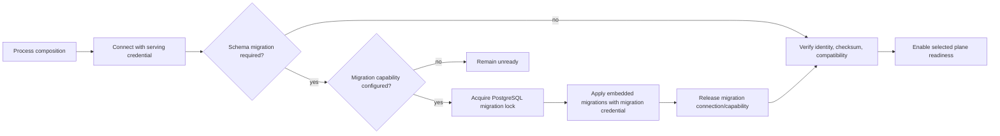

# 04 — PostgreSQL, Redis, and Project-scoped durable state

## Storage authority

PostgreSQL is OwlAuth's sole authoritative transactional store. Projects, Applications, redirect/origin registrations, provider configuration, Project users, linked identities, login transactions, handoff tickets, sessions, refresh families, revocation, policy, management credentials, Project key metadata, provisioning operations, and audit events are correct only when established by committed PostgreSQL state.

Redis is a deployment dependency for distributed rate coordination, bounded caching, and invalidation hints. It is not an authority for Project ownership, identity, handoff consumption, session validity, refresh rotation, revocation, provider configuration, management authorization, or key state. Redis can be flushed and rebuilt without changing durable meaning.

Runtime and Control use one schema and one shared core. There are no per-plane databases, cross-plane RPC transactions, message brokers, or distributed commits.

## Logical data model

```mermaid
erDiagram
    PROJECTS ||--o{ APPLICATIONS : contains
    PROJECTS ||--o{ PROVIDER_CONFIGURATIONS : configures
    APPLICATIONS ||--o{ APPLICATION_PROVIDER_CONFIGS : permits
    PROVIDER_CONFIGURATIONS ||--o{ APPLICATION_PROVIDER_CONFIGS : assigned
    PROJECTS ||--o{ PROJECT_USERS : owns
    PROJECTS ||--|| PROJECT_POLICIES : governs
    PROJECTS ||--o{ PROJECT_BROWSER_SESSIONS : isolates
    PROJECTS ||--o{ PROJECT_KEY_RINGS : signs
    APPLICATIONS ||--o{ APPLICATION_REDIRECT_URIS : allows
    APPLICATIONS ||--o{ APPLICATION_ORIGINS : allows
    APPLICATIONS ||--o{ APPLICATION_PUBLIC_KEYS : identifies
    PROJECT_USERS ||--o{ LINKED_IDENTITIES : owns
    PROVIDER_CONFIGURATIONS ||--o{ LINKED_IDENTITIES : verifies
    APPLICATIONS ||--o{ LOGIN_TRANSACTIONS : starts
    PROVIDER_CONFIGURATIONS ||--o{ LOGIN_TRANSACTIONS : authenticates
    PROJECT_USERS ||--o{ HANDOFF_TICKETS : receives
    LOGIN_TRANSACTIONS ||--o| HANDOFF_TICKETS : produces
    PROJECT_USERS ||--o{ PROJECT_BROWSER_SESSIONS : authenticates
    PROJECT_BROWSER_SESSIONS o|--o{ APPLICATION_SESSIONS : authenticates
    APPLICATIONS ||--o{ APPLICATION_SESSIONS : receives
    PROJECT_USERS ||--o{ APPLICATION_SESSIONS : owns
    APPLICATION_SESSIONS ||--|| REFRESH_FAMILIES : refreshes
    REFRESH_FAMILIES ||--o{ REFRESH_TOKENS : rotates
    PROJECT_KEY_RINGS ||--o{ SIGNING_KEYS : contains
    SIGNING_KEYS ||--o{ KEY_STATE_EVENTS : transitions
    PROJECT_KEY_RINGS ||--o{ JWKS_PUBLICATION_LEASES : observed_by
    PROJECTS ||--o{ AUDIT_EVENTS : scopes
    PROJECTS ||--o{ MCP_CONFIRMATION_CAPABILITIES : binds
    MANAGEMENT_PRINCIPALS ||--o{ MANAGEMENT_CREDENTIALS : authenticates
    MANAGEMENT_PRINCIPALS ||--o{ MCP_CONFIRMATION_CAPABILITIES : owns

    PROJECTS {
        uuid id PK
        text public_id UK
        text name
        enum status
        text belongs_to
        bigint security_revision
        bigint metadata_revision
        timestamptz created_at
        timestamptz updated_at
    }
    APPLICATIONS {
        uuid id PK
        uuid project_id FK
        text public_id UK
        text name
        enum application_type
        enum status
        bigint security_revision
    }
    APPLICATION_REDIRECT_URIS {
        uuid id PK
        uuid project_id FK
        uuid application_id FK
        text exact_uri
        enum redirect_type
    }
    APPLICATION_ORIGINS {
        uuid id PK
        uuid project_id FK
        uuid application_id FK
        text exact_origin
    }
    APPLICATION_PUBLIC_KEYS {
        uuid id PK
        uuid project_id FK
        uuid application_id FK
        text public_key_id UK
        enum status
        timestamptz expires_at
    }
    PROVIDER_CONFIGURATIONS {
        uuid id PK
        uuid project_id FK
        text provider_key
        enum provider_kind
        text issuer
        text client_id
        text secret_ref
        enum status
        bigint security_revision
    }
    APPLICATION_PROVIDER_CONFIGS {
        uuid project_id FK
        uuid application_id FK
        uuid provider_configuration_id FK
        enum status
        bigint security_revision
    }
    PROJECT_POLICIES {
        uuid project_id PK
        bigint claims_revision
        bigint session_revision
        jsonb claims_policy
        jsonb session_policy
    }
    PROJECT_USERS {
        uuid id PK
        uuid project_id FK
        enum status
        jsonb profile_attributes
        bigint security_revision
        timestamptz created_at
        timestamptz updated_at
    }
    LINKED_IDENTITIES {
        uuid id PK
        uuid project_id FK
        uuid user_id FK
        uuid provider_configuration_id FK
        text provider_issuer
        text provider_subject
        jsonb profile_attributes
        timestamptz linked_at
    }
    LOGIN_TRANSACTIONS {
        uuid id PK
        uuid project_id FK
        uuid application_id FK
        uuid provider_configuration_id FK
        uuid redirect_uri_id FK
        uuid user_id FK
        text transaction_handle_digest UK
        text upstream_state_digest UK
        text browser_binding_digest
        text app_state_ciphertext
        text handoff_pkce_challenge
        text provider_pkce_verifier_ciphertext
        jsonb revision_snapshot
        enum status
        timestamptz expires_at
    }
    HANDOFF_TICKETS {
        uuid id PK
        uuid project_id FK
        uuid application_id FK
        uuid login_transaction_id FK
        uuid user_id FK
        text ticket_digest UK
        jsonb revision_snapshot
        timestamptz expires_at
        timestamptz consumed_at
    }
    PROJECT_BROWSER_SESSIONS {
        uuid id PK
        uuid project_id FK
        uuid user_id FK
        text credential_digest UK
        enum status
        bigint security_revision
        jsonb revision_snapshot
        timestamptz authenticated_at
        timestamptz expires_at
    }
    APPLICATION_SESSIONS {
        uuid id PK
        uuid project_id FK
        uuid application_id FK
        uuid user_id FK
        uuid browser_session_id FK
        enum status
        jsonb revision_snapshot
        timestamptz authenticated_at
        timestamptz expires_at
    }
    REFRESH_FAMILIES {
        uuid id PK
        uuid project_id FK
        uuid application_id FK
        uuid user_id FK
        uuid application_session_id FK
        enum status
        bigint current_generation
        jsonb revision_snapshot
        timestamptz expires_at
    }
    REFRESH_TOKENS {
        uuid id PK
        uuid project_id FK
        uuid family_id FK
        bigint generation
        text token_digest UK
        uuid predecessor_id FK
        uuid successor_id FK
        timestamptz consumed_at
        timestamptz revoked_at
    }
    PROJECT_KEY_RINGS {
        uuid id PK
        uuid project_id FK
        text issuer
        text purpose
        text algorithm
        bigint revision
    }
    SIGNING_KEYS {
        uuid id PK
        uuid project_id FK
        uuid key_ring_id FK
        text kid
        jsonb public_jwk
        text signer_key_ref
        enum state
        timestamptz published_at
        timestamptz sign_not_before
        timestamptz verify_not_after
    }
    KEY_PROVISIONING_OPERATIONS {
        uuid id PK
        uuid project_id FK
        uuid key_ring_id FK
        text idempotency_key
        text provider_operation_ref
        enum status
        timestamptz updated_at
    }
    KEY_STATE_EVENTS {
        uuid id PK
        uuid project_id FK
        uuid signing_key_id FK
        enum from_state
        enum to_state
        uuid actor_id
        timestamptz occurred_at
    }
    JWKS_PUBLICATION_LEASES {
        uuid project_id FK
        uuid key_ring_id FK
        text runtime_instance_id
        bigint loaded_revision
        timestamptz observed_at
        timestamptz lease_expires_at
    }
    MANAGEMENT_PRINCIPALS {
        uuid id PK
        text principal_name UK
        enum status
        text_array scopes
    }
    MANAGEMENT_CREDENTIALS {
        uuid id PK
        uuid principal_id FK
        enum credential_type
        text credential_digest
        timestamptz expires_at
        timestamptz revoked_at
    }
    CONTROL_IDEMPOTENCY_RECORDS {
        uuid principal_id FK
        uuid project_id FK
        text idempotency_key
        text request_digest
        uuid result_resource_id
        timestamptz expires_at
    }
    MCP_CONFIRMATION_CAPABILITIES {
        uuid id PK
        uuid principal_id FK
        uuid project_id FK
        text capability_digest UK
        text command_digest
        bigint project_metadata_revision
        bigint target_revision
        timestamptz expires_at
        timestamptz consumed_at
    }
    AUDIT_EVENTS {
        uuid id PK
        uuid project_id FK
        text actor_kind
        uuid actor_id
        text action
        text target_kind
        uuid target_id
        text outcome
        uuid correlation_id
        jsonb safe_context
        timestamptz occurred_at
    }
```

The diagram expresses ownership and cardinality, not literal SQL names or every index. Nullable relationships such as `login_transactions.user_id`, `application_sessions.browser_session_id`, and deployment-scoped `audit_events.project_id` are constrained by their state/type.

## Project isolation constraints

- `projects.public_id` is immutable and identifies the Runtime namespace.
- `projects.belongs_to` is nullable bounded opaque text with a non-unique B-tree index. It has no foreign key to an OwlAuth organization because OwlAuth has no organization model.
- Every Project-owned object carries `project_id`. Composite foreign keys or equivalent constraints ensure every referenced parent has the same Project.
- Repository operations accept `ProjectId` as a required argument for Project-owned state; unqualified object lookup is forbidden in Runtime and Project-bound Control use cases.
- `(project_id, provider_issuer, provider_subject)` is unique for linked identities.
- Application/provider public keys are unique in a namespace that cannot resolve to another Project accidentally.
- Project transfer does not exist. Changing `belongs_to` changes external metadata, not Project identity or child ownership.
- Project disablement advances `security_revision`; all Runtime operations compare their revision snapshot and fail closed.

## Entity constraints

### Projects and Applications

- An Application belongs to exactly one Project and cannot move.
- Application public IDs and publishable keys are identifiers, not secrets. Their rotation affects abuse/quota attribution, not user or Control authority.
- `(project_id, application_id, exact_uri)` and `(project_id, application_id, exact_origin)` are unique.
- Redirect registration validates URI syntax and type; Runtime compares the exact stored string and does not perform lossy normalization.
- Disabling an Application advances its security revision and invalidates pending handoffs, Application sessions, and refresh families through revision comparison. Project browser sessions remain valid.

### Provider configurations

- `(project_id, provider_key)` is unique. A provider configuration represents one upstream OAuth/OIDC client registration with canonical issuer/kind, client ID, callback identity, and opaque secret-manager reference.
- A Project may define multiple registrations for the same provider kind, such as separate web/native client IDs. An Application can select only an active configuration assignment established through a same-Project join constraint.
- Assigning/unassigning a provider advances the assignment `security_revision`. Login transaction, callback completion, and handoff exchange revalidate the captured assignment revision.
- Provider callback identity is derived from trusted Runtime external URL, Project public ID, and provider key; caller input cannot replace it.
- Secret bytes are absent from PostgreSQL, Redis, public Project config, Runtime responses, and audit events.
- Provider configuration disablement/revision invalidates pending login callbacks for that provider without affecting another Project.

### Project users and identities

- `project_users.id` is a stable local subject under one Project. Email is neither primary key nor linking key.
- A linked identity belongs to one Project user and the same Project provider configuration.
- Matching email/profile data never links users automatically.
- Merge locks both Project users, proves they share the same Project, rejects issuer/subject conflicts, moves identities, and tombstones the losing user ID. Cross-Project merge is forbidden.
- User disablement advances `security_revision`, making sessions, tickets, and refresh families bound to older revisions unusable.

### Login transactions and handoff tickets

- Transaction handles, upstream state, browser bindings, and handoff tickets use keyed digests with key-version metadata.
- Bounded Application state and any server-generated upstream provider PKCE verifier must be recoverable across the redirect, so they are stored as purpose-bound authenticated ciphertext through `DataProtector` and are never logged or used outside that transaction.
- `login_transactions.user_id` is null until authentication resolves a Project user.
- Login transaction states are `pending_authentication`, `provider_exchange_in_progress`, `provider_exchange_failed`, `authenticated`, `handoff_issued`, `completed`, `expired`, and `cancelled` with explicit transitions. `provider_exchange_failed` is terminal and requires a new login.
- A login transaction produces at most one handoff ticket.
- A handoff ticket binds Project, Application, exact redirect, Project user, provider result, active Application-provider assignment, PKCE challenge, and relevant revisions.
- Conditional update of `consumed_at` from null is the handoff's one-use serialization point.

### Sessions and refresh families

- A Project browser session is Project/user/browser-bound and carries only Project/user/session-policy revisions. It is not Application-bound.
- An Application session belongs to one Project/Application/user and may reference the Project browser session that authenticated it.
- A refresh family belongs to one Application session and retains Project/Application/user/policy revisions.
- If an Application session references a Project browser session, refresh locks/revalidates that browser session status and revision. A terminated browser session cannot mint another access token.
- `(family_id, generation)` is unique; exactly one unconsumed current generation is allowed for an active family.
- Rotation consumes the current token, inserts the successor, and advances the generation atomically.
- Any presentation of a consumed generation revokes the family and commits the replay audit event atomically.

### Project key rings

- A key ring is unique by `(project_id, issuer, purpose, algorithm)` and increments its revision on lifecycle change.
- Exactly one key is `Active` in a Project key ring, enforced by a partial unique constraint and domain policy.
- `(project_id, kid)` is unique; a `kid` is never reused for different material in that Project.
- `signer_key_ref` is opaque; private material and wrapping keys are absent from PostgreSQL and Redis.
- Token issuance obtains a shared signing-epoch guard for the active key-ring revision. Lifecycle activation/retirement obtains the conflicting exclusive guard. Concurrent issuance does not update a single hot key row.
- A JWKS publication lease's `observed_at` records when that specific loaded revision was first loaded; heartbeat renewal changes only `lease_expires_at`. Key activation waits the full propagation interval from the latest qualifying observation.
- Entering `Retiring` sets `verify_not_after` conservatively from transition time plus maximum Project token lifetime, clock skew, JWKS cache retention, and propagation margin.

### Management and audit

- Management credentials are typed, scoped, expiring, rotatable, and revocable. They cannot authenticate Runtime users or Applications.
- Control idempotency is unique by `(principal_id, idempotency_key)`. Project-bound records carry the target Project. Reuse with another request digest is a conflict.
- MCP confirmation capabilities are stored only as digests, expire, and are consumed exactly once in the same PostgreSQL transaction as the bound command and audit event.
- Audit events are append-only. Security mutations and their audit event commit in the same PostgreSQL transaction.
- Project-scoped events carry `project_id`; deployment-level events use a constrained null Project and cannot be confused with a Project event.
- `safe_context` follows action-specific schemas and excludes arbitrary payloads and credentials.

## Authoritative transaction boundaries

| Operation | Rows/aggregates serialized together | Commit invariant |
| --- | --- | --- |
| Claim provider callback | Project/login transaction, provider and Application-assignment revisions, audit | exactly one callback moves to `provider_exchange_in_progress`; no automatic retry after ambiguous exchange |
| Complete provider callback | claimed transaction, provider/assignment revisions, linked identity, Project user, browser session, handoff ticket, audit | identity resolves within one Project; at most one ticket produced; failure becomes terminal |
| Exchange handoff | ticket, Project/Application/provider-assignment/user/policy revisions, Application session, refresh family/token, signing epoch, audit | one successful consumer and one committed Application session |
| Rotate refresh token | family, Application session, referenced browser session, presented/successor token, Project/Application/user/policy revisions, signing epoch, audit | at most one successor; terminated browser session denies refresh; detected reuse revokes family |
| Application logout/revoke | selected Application session/family and audit | selected credentials cannot become active again |
| Project browser logout | browser-session status/revision and audit | browser credential cannot authenticate another handoff and derived sessions cannot refresh |
| Disable Project | Project status/security revision and audit | every Project Runtime operation observes disablement after commit |
| Disable Application | Application status/security revision and audit | its tickets/sessions/families become logically invalid; other Applications remain valid |
| Disable user | Project user status/security revision and audit | all credentials for that Project user become logically invalid |
| Link/unlink/merge identity | Project users and identities plus audit | Project boundary and issuer/subject uniqueness preserved |
| Any externally proxied Project mutation | observed Project metadata revision plus command-specific rows and audit | ownership metadata cannot change between gateway authorization and child mutation commit |
| Update `belongs_to` | Project metadata revision, Control idempotency, audit | external metadata changes without child ownership change |
| Transition signing key | Project key ring revision, involved key metadata, publication evidence, state event | exactly one active key and transition conditions satisfied |

Every Project-bound Control mutation accepts an optional expected Project metadata revision; external-gateway calls require it and compare it in the same transaction as the child mutation. Security-sensitive operations use row locks, unique constraints, compare-and-swap revisions, or serializable transactions according to the invariant. Serialization/deadlock retries are bounded and happen only before externally visible irreversible effects.

Provider and KMS calls do not run while a PostgreSQL transaction is held. Cryptographic output may be prepared before the final conditional transaction, but no credential response is returned unless Project state and signing epoch commit successfully. Prepared signatures discarded after a conflict are not issued credentials.

## Redis roles

### Permitted data

Redis keys include deployment, Project, purpose, and schema-version namespaces. Permitted categories are:

- distributed Runtime and Control rate counters and short-lived abuse signals;
- short-lived caches of public Project/Application auth configuration and Project JWKS;
- version-addressed caches of non-secret provider presentation metadata;
- best-effort Project/Application/user/key cache-invalidation notifications after PostgreSQL commit;
- bounded idempotency hints that never replace PostgreSQL records or uniqueness.

Every cache entry has a TTL and source revision. A cache hit cannot replace Project qualification or turn an authoritative denial into an allow.

### Forbidden authority

Redis MUST NOT be the sole store or serialization point for:

- Project/Application/provider status or `belongs_to`;
- Project users or linked identities;
- login/callback completion or handoff consumption;
- browser/Application sessions or refresh families;
- revocation or management authorization;
- Project key lifecycle, JWKS publication proof, or private material;
- audit records;
- locks whose loss could cross Projects, duplicate a credential, or permit an invalid transition.

## Cache invalidation and security changes

Control commits a mutation and audit event to PostgreSQL first, then publishes a best-effort invalidation carrying Project, entity, identifier, and new revision. Runtime treats invalidation as a latency optimization.

Project/Application/provider/user disablement, redirect removal, policy changes, credential revocation, and key changes are read from PostgreSQL at the login start, callback, handoff, refresh, current-user, and signing decision points. Their correctness does not depend on Redis delivery or TTL.

Already issued Project access tokens retain their signed expiry semantics. Cache invalidation cannot revoke a token already accepted offline by an Application backend.

## Migration architecture

Migration source files live under `crates/owlauth-server/migrations/` and are embedded into the server artifact. PostgreSQL records migration identity, order, and checksum.

The process distinguishes:

- a restricted serving credential used by Runtime/Control repositories with no schema DDL authority;
- an optional separate migration credential/capability used only before listeners admit traffic.

A configured migration capability applies pending migrations automatically before traffic and is not retained in serving pools. Processes without it verify exact compatibility and remain unready if migration is required. Concurrent starts coordinate through PostgreSQL, not Redis.

Migration history is immutable, checksum-verified, ordered, and transactional. A PostgreSQL operation that cannot use one transaction has an explicit resumable state machine in schema metadata; partial state is incompatible and cannot serve.

## Durability and recovery model

A recoverable OwlAuth state consists of:

- a transactionally consistent PostgreSQL backup;
- deployment external URLs and Project issuer derivation configuration;
- provider and management secret references plus access to their secret store;
- every active/retained Project signer key reference and corresponding key-store material;
- active and retained `DataProtector` key versions needed by unexpired login transactions;
- wrapping-key material where software key adapters use envelope encryption;
- schema-history state corresponding to the backup.

If DataProtector versions are unavailable, restored login transactions are explicitly cancelled before Runtime becomes ready; they are never treated as decryptable. If a required signer key cannot be resolved, affected Project signing remains unready instead of silently changing issuer or key identity.

Redis is excluded from recovery. It is flushed or moved to a new recovery namespace so stale values cannot affect restored authority. Restore preserves Project/user/Application IDs, `belongs_to`, issuer, sessions/families, `kid`, public keys, and opaque secret/key references.
