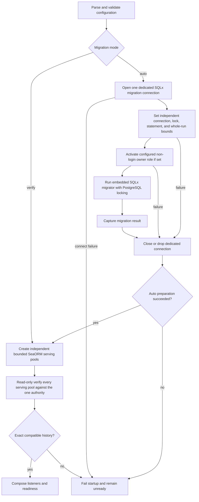

# 04 — PostgreSQL and Project-scoped durable state

## Storage authority

PostgreSQL is OwlAuth's sole authoritative transactional store. Projects, Applications, redirect/origin registrations, provider configuration, Project server-key commitments, Project users, linked/email identities, managed provider connections, login/email challenges, handoff tickets, sessions, refresh families, user revisions/Application projections, SMTP and webhook configuration, durable delivery outboxes, revocation, policy, Project key metadata, provisioning operations, and audit events are correct only when established by committed PostgreSQL state. Raw Project server credentials are deliberately excluded after their one-time create response, and the deployment operator API key exists only in Control process configuration.

Runtime, Server API, and Control use one schema and one shared core. There are no per-plane databases, cross-plane RPC transactions, message brokers, or distributed commits.

## PostgreSQL adapter implementation

The PostgreSQL adapter inside `crates/owlauth-server` uses SeaORM 2 for ordinary repository and Unit-of-Work queries. SeaORM entities, active models, query expressions, connections, transactions, and errors remain adapter-private and are explicitly mapped to application/domain types and persistence error classes. Application services receive transaction-bound semantic repositories through the application-owned `UnitOfWork`; a business transaction can include multiple repositories and the durable audit appender without exposing ORM types.

Runtime, Server API, and Control use independent bounded SeaORM serving pools even in `all` mode. All serving pools in one OwlAuth deployment connect to the same configured PostgreSQL server and database authority; split processes MAY use plane-specific login credentials and DDL-free roles, but not independent database targets. Schema-version equality is not evidence that two databases are one authority. Pool acquisition, statement, transaction, lock, and cancellation behavior are bounded according to specs 06 and 08. Every physical serving connection receives the same independently validated PostgreSQL `lock_timeout` through connection startup options, and pool creation queries the effective value before readiness. A lock timeout is a persistence/contention failure: the current statement or transaction rolls back and no mutation is automatically replayed.

SQLx 0.9 is used directly only for embedded migration execution, DDL-free serving-schema compatibility verification, and migration-focused tests. It is not a second ordinary repository style. The production schema is controlled by reviewed SQL files under `crates/owlauth-server/migrations/`; SeaORM schema synchronization and entity-registry schema management MUST remain disabled. OwlAuth does not depend on `sea-orm-migration`, create a separate persistence/migration workspace crate, or expose either library across application ports.

The concrete dependency and revisit decision is recorded in [`TS-001`](technology/ts-001-postgresql-repositories-and-migrations.md) and registered by [spec 10](10-implementation-technology-selections.md). This document remains the authority for storage and migration behavior.

## Logical data model

```mermaid
erDiagram
    PROJECTS ||--o{ APPLICATIONS : contains
    PROJECTS ||--o{ PROVIDER_CONFIGURATIONS : configures
    APPLICATIONS ||--o{ APPLICATION_PROVIDER_CONFIGS : permits
    PROVIDER_CONFIGURATIONS ||--o{ APPLICATION_PROVIDER_CONFIGS : assigned
    PROJECTS ||--o{ PROJECT_USERS : owns
    PROJECTS ||--|| PROJECT_POLICIES : governs
    PROJECTS ||--o{ PROJECT_BROWSER_SESSIONS : isolates
    PROJECTS ||--o{ PROJECT_KEY_RINGS : signs
    APPLICATIONS ||--o{ APPLICATION_REDIRECT_URIS : allows
    APPLICATIONS ||--o{ APPLICATION_ORIGINS : allows
    APPLICATIONS ||--o{ APPLICATION_PUBLIC_KEYS : identifies
    PROJECT_USERS ||--o{ LINKED_IDENTITIES : owns
    PROVIDER_CONFIGURATIONS ||--o{ LINKED_IDENTITIES : verifies
    APPLICATIONS ||--o{ LOGIN_TRANSACTIONS : starts
    PROVIDER_CONFIGURATIONS o|--o{ LOGIN_TRANSACTIONS : selected_provider
    PROJECT_USERS ||--o{ HANDOFF_TICKETS : receives
    LOGIN_TRANSACTIONS ||--o| HANDOFF_TICKETS : produces
    PROJECT_USERS ||--o{ PROJECT_BROWSER_SESSIONS : authenticates
    PROJECT_BROWSER_SESSIONS o|--o{ APPLICATION_SESSIONS : authenticates
    APPLICATIONS ||--o{ APPLICATION_SESSIONS : receives
    PROJECT_USERS ||--o{ APPLICATION_SESSIONS : owns
    APPLICATION_SESSIONS ||--o{ BROWSER_LOGOUT_PREPARATIONS : prepares
    PROJECT_BROWSER_SESSIONS ||--o{ BROWSER_LOGOUT_PREPARATIONS : terminates
    APPLICATION_SESSIONS ||--|| REFRESH_FAMILIES : refreshes
    REFRESH_FAMILIES ||--o{ REFRESH_TOKENS : rotates
    PROJECT_KEY_RINGS ||--o{ SIGNING_KEYS : contains
    SIGNING_KEYS ||--o{ KEY_STATE_EVENTS : transitions
    PROJECT_KEY_RINGS ||--o{ JWKS_PUBLICATION_LEASES : observed_by
    PROJECTS o|--o{ AUDIT_EVENTS : scopes
    PROJECTS o|--o{ MCP_CONFIRMATION_CAPABILITIES : binds
    PROJECTS o|--o{ CONTROL_IDEMPOTENCY_RECORDS : targets
    PROJECTS ||--o{ KEY_PROVISIONING_OPERATIONS : provisions
    PROJECT_KEY_RINGS ||--o{ KEY_PROVISIONING_OPERATIONS : tracks
    PROJECTS o|--o{ PROTECTED_MATERIAL : scopes
    PROTECTED_MATERIAL ||--o| SIGNING_KEYS : backs
    PROTECTED_MATERIAL ||--o| PROVIDER_CONFIGURATIONS : protects

    PROJECTS {
        uuid id PK
        text public_id UK
        text name
        enum status
        text belongs_to
        bigint security_revision
        bigint metadata_revision
        timestamptz created_at
        timestamptz updated_at
    }
    APPLICATIONS {
        uuid id PK
        uuid project_id FK
        text public_id UK
        text name
        enum application_type
        enum status
        bigint security_revision
        bigint projection_revision
    }
    APPLICATION_REDIRECT_URIS {
        uuid id PK
        uuid project_id FK
        uuid application_id FK
        text exact_uri
        enum redirect_type
    }
    APPLICATION_ORIGINS {
        uuid id PK
        uuid project_id FK
        uuid application_id FK
        text exact_origin
    }
    APPLICATION_PUBLIC_KEYS {
        uuid id PK
        uuid project_id FK
        uuid application_id FK
        text public_key_id UK
        enum status
        timestamptz expires_at
    }
    PROVIDER_CONFIGURATIONS {
        uuid id PK
        uuid project_id FK
        text provider_key
        enum provider_kind
        text issuer
        text client_id
        bigint secret_generation
        uuid secret_material_id FK
        enum status
        bigint security_revision
    }
    APPLICATION_PROVIDER_CONFIGS {
        uuid project_id FK
        uuid application_id FK
        uuid provider_configuration_id FK
        enum status
        bigint security_revision
    }
    PROJECT_POLICIES {
        uuid project_id PK
        bigint claims_revision
        bigint session_revision
        bigint projection_revision
        jsonb claims_policy
        jsonb session_policy
    }
    PROJECT_USERS {
        uuid id PK
        uuid project_id FK
        enum status
        jsonb profile_attributes
        bigint security_revision
        bigint user_revision
        timestamptz created_at
        timestamptz updated_at
    }
    LINKED_IDENTITIES {
        uuid id PK
        uuid project_id FK
        uuid user_id FK
        uuid created_via_provider_configuration_id FK
        text provider_issuer
        text provider_subject
        jsonb profile_attributes
        bigint identity_revision
        timestamptz linked_at
    }
    LOGIN_TRANSACTIONS {
        uuid id PK
        uuid project_id FK
        uuid application_id FK
        uuid provider_configuration_id FK
        uuid redirect_uri_id FK
        uuid user_id FK
        text transaction_handle_digest UK
        text upstream_state_digest UK
        text browser_binding_digest
        text csrf_digest
        text app_state_ciphertext
        text handoff_pkce_challenge
        text provider_pkce_verifier_ciphertext
        text oidc_nonce_digest
        text provider_callback_uri
        jsonb allowed_methods_snapshot
        enum selected_method_kind
        bigint transaction_revision
        jsonb revision_snapshot
        enum status
        timestamptz expires_at
    }
    HANDOFF_TICKETS {
        uuid id PK
        uuid project_id FK
        uuid application_id FK
        uuid login_transaction_id FK
        uuid user_id FK
        text ticket_digest UK
        jsonb revision_snapshot
        timestamptz expires_at
        timestamptz consumed_at
    }
    PROJECT_BROWSER_SESSIONS {
        uuid id PK
        uuid project_id FK
        uuid user_id FK
        text credential_digest UK
        enum status
        bigint security_revision
        jsonb revision_snapshot
        timestamptz authenticated_at
        timestamptz last_activity_at
        timestamptz idle_expires_at
        timestamptz absolute_expires_at
    }
    APPLICATION_SESSIONS {
        uuid id PK
        uuid project_id FK
        uuid application_id FK
        uuid user_id FK
        uuid browser_session_id FK
        enum status
        jsonb revision_snapshot
        timestamptz authenticated_at
        timestamptz expires_at
    }
    BROWSER_LOGOUT_PREPARATIONS {
        uuid id PK
        uuid project_id FK
        uuid application_id FK
        uuid user_id FK
        uuid application_session_id FK
        uuid browser_session_id FK
        text preparation_digest UK
        text csrf_digest
        enum status
        bigint revision
        jsonb revision_snapshot
        timestamptz created_at
        timestamptz expires_at
        timestamptz consumed_at
    }
    REFRESH_FAMILIES {
        uuid id PK
        uuid project_id FK
        uuid application_id FK
        uuid user_id FK
        uuid application_session_id FK
        enum status
        bigint current_generation
        int allowed_clock_skew_seconds
        jsonb revision_snapshot
        timestamptz expires_at
    }
    REFRESH_TOKENS {
        uuid id PK
        uuid project_id FK
        uuid family_id FK
        bigint generation
        text token_digest UK
        uuid predecessor_id FK
        uuid successor_id FK
        timestamptz consumed_at
        timestamptz revoked_at
    }
    PROJECT_KEY_RINGS {
        uuid id PK
        uuid project_id FK
        text issuer
        text purpose
        text algorithm
        bigint revision
    }
    SIGNING_KEYS {
        uuid id PK
        uuid project_id FK
        uuid key_ring_id FK
        text kid
        jsonb public_jwk
        uuid signer_material_id FK
        enum state
        timestamptz published_at
        timestamptz sign_not_before
        timestamptz verify_not_after
    }
    KEY_PROVISIONING_OPERATIONS {
        uuid id PK
        uuid project_id FK
        uuid key_ring_id FK
        text idempotency_key
        text provider_operation_ref
        uuid resulting_material_id FK
        enum status
        timestamptz updated_at
    }
    PROTECTED_MATERIAL {
        uuid id PK
        uuid project_id FK
        enum scope_kind
        enum material_kind
        enum owner_kind
        uuid owner_id
        bigint owner_generation
        text provider_id
        integer format_version
        bytes context_digest
        bytes opaque_envelope_or_handle
        bytes safe_fingerprint
        enum state
        timestamptz created_at
        timestamptz erased_at
    }
    KEY_STATE_EVENTS {
        uuid id PK
        uuid project_id FK
        uuid signing_key_id FK
        enum from_state
        enum to_state
        text actor_kind
        timestamptz occurred_at
    }
    JWKS_PUBLICATION_LEASES {
        uuid project_id FK
        uuid key_ring_id FK
        text runtime_instance_id
        bigint loaded_revision
        timestamptz observed_at
        timestamptz lease_expires_at
    }
    CONTROL_IDEMPOTENCY_RECORDS {
        text idempotency_key UK
        uuid project_id FK
        text request_digest
        uuid result_resource_id
        text purpose_bound_result_ciphertext
        integer result_protector_key_version
        timestamptz result_erase_at
        timestamptz expires_at
    }
    MCP_CONFIRMATION_CAPABILITIES {
        uuid id PK
        bytea capability_digest UK
        text actor_kind
        text audience
        text instance_id
        text control_endpoint
        text tool_name
        bytea command_digest
        uuid project_id FK
        bigint project_metadata_revision
        uuid application_id
        bigint target_revision
        timestamptz created_at
        timestamptz expires_at
        timestamptz consumed_at
    }
    AUDIT_EVENTS {
        uuid id PK
        uuid project_id FK
        text actor_kind
        text action
        text target_kind
        uuid target_id
        text outcome
        uuid correlation_id
        jsonb safe_context
        timestamptz occurred_at
    }
```

The diagram expresses ownership and cardinality, not literal SQL names or every index. Nullable relationships such as `login_transactions.user_id`, `application_sessions.browser_session_id`, `control_idempotency_records.project_id`, and deployment-scoped `audit_events.project_id` are constrained by their state/type. Project creation idempotency and deployment-level audit commands therefore remain representable without inventing a Project.

The identity-expansion tables below extend that core model. They are shown separately so the primary session/key diagram remains readable. Project-owned rows use the same direct `project_id` and same-Project composite constraints; `deployment_smtp_generations` and deployment-scoped `protected_material` are explicit deployment-scoped exceptions. Deployment-default SMTP material uses the same protected PostgreSQL envelope lifecycle as Project SMTP material rather than a process-configured secret handle.

```mermaid
erDiagram
    PROJECTS ||--o{ EMAIL_IDENTITIES : owns
    PROJECT_USERS ||--o{ EMAIL_IDENTITIES : proves
    EMAIL_IDENTITIES ||--|{ EMAIL_IDENTITY_LOOKUPS : indexes
    LINKED_IDENTITIES ||--o| MANAGED_PROVIDER_CONNECTIONS : manages
    MANAGED_PROVIDER_CONNECTIONS ||--|{ MANAGED_PROVIDER_CREDENTIALS : versions
    MANAGED_PROVIDER_CONNECTIONS ||--o{ MANAGED_CREDENTIAL_RENEWALS : fences
    PROJECTS ||--o{ MANAGED_REAUTHORIZATION_INTERACTIONS : owns
    PROJECT_USERS ||--o{ MANAGED_REAUTHORIZATION_INTERACTIONS : reauthorizes
    LINKED_IDENTITIES ||--o{ MANAGED_REAUTHORIZATION_INTERACTIONS : proves
    MANAGED_PROVIDER_CONNECTIONS ||--o{ MANAGED_REAUTHORIZATION_INTERACTIONS : replaces
    APPLICATIONS ||--o{ MANAGED_REAUTHORIZATION_INTERACTIONS : authorizes
    PROVIDER_CONFIGURATIONS ||--o{ MANAGED_REAUTHORIZATION_INTERACTIONS : exchanges
    CONTROL_IDEMPOTENCY_RECORDS ||--o| MANAGED_REAUTHORIZATION_INTERACTIONS : creates_or_replays
    PROJECTS ||--o{ IDENTITY_MUTATION_INTENTS : owns
    IDENTITY_MUTATION_INTENTS ||--|{ IDENTITY_MUTATION_PROOF_SLOTS : requires
    APPLICATIONS ||--o{ IDENTITY_MUTATION_PROOF_SLOTS : authorizes
    IDENTITY_MUTATION_PROOF_SLOTS ||--o| IDENTITY_MUTATION_CANDIDATE_EVIDENCE : proves
    IDENTITY_MUTATION_PROOF_SLOTS ||--o| IDENTITY_PROOF_RECEIPTS : receipts
    IDENTITY_MUTATION_INTENTS ||--o{ IDENTITY_PROOF_RECEIPTS : consumes
    LOGIN_TRANSACTIONS o|--o{ EMAIL_CHALLENGES : login_verifies
    IDENTITY_MUTATION_PROOF_SLOTS o|--o{ EMAIL_CHALLENGES : mutation_verifies
    EMAIL_CHALLENGES ||--|{ EMAIL_CHALLENGE_PROOFS : offers
    PROJECTS ||--o{ SMTP_CONFIGURATIONS : versions
    SMTP_CONFIGURATIONS o|--o{ EMAIL_CHALLENGES : project_delivery
    DEPLOYMENT_SMTP_GENERATIONS o|--o{ EMAIL_CHALLENGES : default_delivery
    EMAIL_CHALLENGES ||--o{ MAIL_OUTBOX : delivers
    APPLICATIONS ||--o{ APPLICATION_USER_BINDINGS : has_seen
    PROJECT_USERS ||--o{ APPLICATION_USER_BINDINGS : visible_to
    APPLICATION_USER_BINDINGS ||--|| APPLICATION_USER_PROJECTIONS : materializes
    APPLICATIONS ||--o{ WEBHOOK_ENDPOINTS : configures
    APPLICATION_USER_BINDINGS ||--o{ USER_PROJECTION_EVENTS : emits
    USER_PROJECTION_EVENTS ||--o{ WEBHOOK_DELIVERIES : targets
    WEBHOOK_ENDPOINTS ||--o{ WEBHOOK_DELIVERIES : receives
    PROJECTS o|--o{ SECRET_PROVISIONING_OPERATIONS : protects
    PROTECTED_MATERIAL ||--o{ SECRET_PROVISIONING_OPERATIONS : results_in
    PROTECTED_MATERIAL ||--o{ SMTP_CONFIGURATIONS : supplies
    PROTECTED_MATERIAL ||--o{ DEPLOYMENT_SMTP_GENERATIONS : supplies
    PROTECTED_MATERIAL ||--o{ WEBHOOK_ENDPOINTS : signs

    EMAIL_IDENTITIES {
        uuid id PK
        uuid project_id FK
        uuid user_id FK
        text email_ciphertext
        enum status
        timestamptz verified_at
    }
    EMAIL_IDENTITY_LOOKUPS {
        uuid id PK
        uuid project_id FK
        uuid email_identity_id FK
        integer canonicalization_version
        integer digest_key_version
        text lookup_digest
    }
    MANAGED_PROVIDER_CONNECTIONS {
        uuid id PK
        uuid project_id FK
        uuid linked_identity_id FK
        uuid provider_configuration_id FK
        enum state
        bigint revision
        bigint generation
        bigint credential_generation
        jsonb bounded_source_profile
        text source_profile_digest
        timestamptz next_sync_at
        timestamptz lease_expires_at
    }
    MANAGED_PROVIDER_CREDENTIALS {
        uuid project_id FK
        uuid managed_connection_id FK
        bigint connection_generation
        bigint credential_generation
        integer credential_aead_key_version
        text credential_ciphertext
        timestamptz superseded_at
        timestamptz destroyed_at
    }
    MANAGED_CREDENTIAL_RENEWALS {
        uuid id PK
        uuid project_id FK
        uuid managed_connection_id FK
        bigint expected_connection_generation
        bigint expected_credential_generation
        bigint successor_connection_generation
        bigint successor_credential_generation
        text adapter_attempt_id
        enum status
        timestamptz submitted_at
        timestamptz lease_expires_at
    }
    MANAGED_REAUTHORIZATION_INTERACTIONS {
        uuid id PK
        uuid project_id FK
        uuid user_id FK
        uuid linked_identity_id FK
        uuid managed_connection_id FK
        uuid application_id FK
        uuid provider_configuration_id FK
        bigint expected_connection_generation
        bigint expected_credential_generation
        bigint expected_connection_revision
        bigint expected_user_revision
        bigint expected_project_security_revision
        bigint expected_user_security_revision
        bigint expected_identity_revision
        bigint expected_application_security_revision
        bigint provider_revision
        bigint assignment_revision
        bigint capability_revision
        text callback_uri
        jsonb managed_scopes
        boolean provider_pkce_required
        bigint interaction_revision
        enum status
        text hosted_handle_digest
        integer hosted_handle_digest_key_version
        text upstream_state_digest
        integer upstream_state_digest_key_version
        text browser_binding_digest
        integer browser_binding_digest_key_version
        text csrf_digest
        integer csrf_digest_key_version
        text pkce_verifier_ciphertext
        integer pkce_protector_key_version
        text oidc_nonce_digest
        integer oidc_nonce_digest_key_version
        timestamptz expires_at
    }
    IDENTITY_MUTATION_INTENTS {
        uuid id PK
        uuid project_id FK
        enum operation_kind
        bigint intent_revision
        enum status
        text hosted_handle_digest
        text browser_binding_digest
        text csrf_digest
        timestamptz expires_at
    }
    IDENTITY_MUTATION_PROOF_SLOTS {
        uuid id PK
        uuid project_id FK
        uuid identity_mutation_intent_id FK
        enum slot_role
        enum identity_kind
        uuid application_id FK
        uuid provider_configuration_id FK
        enum state
        bigint slot_revision
    }
    IDENTITY_MUTATION_CANDIDATE_EVIDENCE {
        uuid id PK
        uuid project_id FK
        uuid identity_mutation_intent_id FK
        uuid identity_mutation_proof_slot_id FK
        enum identity_kind
        text evidence_ciphertext
        text evidence_digest
        integer protector_key_version
        bigint evidence_revision
    }
    IDENTITY_PROOF_RECEIPTS {
        uuid id PK
        uuid project_id FK
        uuid identity_mutation_intent_id FK
        uuid identity_mutation_proof_slot_id FK
        enum evidence_kind
        text receipt_digest
        bigint evidence_revision
        bigint intent_revision
        enum status
        timestamptz expires_at
    }
    EMAIL_CHALLENGES {
        uuid id PK
        uuid project_id FK
        enum owner_kind
        uuid login_transaction_id FK
        uuid identity_mutation_intent_id FK
        uuid identity_mutation_proof_slot_id FK
        integer email_digest_key_version
        text email_lookup_digest
        text email_ciphertext
        bigint generation
        enum smtp_selection_kind
        uuid smtp_configuration_id FK
        bigint smtp_generation
        bigint smtp_revision
        enum status
        timestamptz expires_at
        timestamptz consumed_at
    }
    EMAIL_CHALLENGE_PROOFS {
        uuid id PK
        uuid project_id FK
        uuid email_challenge_id FK
        enum proof_kind
        integer proof_digest_key_version
        text proof_digest
        integer failed_attempts
        timestamptz expires_at
    }
    SMTP_CONFIGURATIONS {
        uuid id PK
        uuid project_id FK
        bigint generation
        enum status
        text host
        integer port
        enum tls_mode
        uuid credential_material_id FK
        jsonb sender_and_templates
        bigint revision
    }
    DEPLOYMENT_SMTP_GENERATIONS {
        uuid id PK
        bigint generation UK
        enum status
        bigint revision
        uuid credential_material_id FK
        bytes safe_configuration_fingerprint
    }
    MAIL_OUTBOX {
        uuid id PK
        uuid project_id FK
        uuid email_challenge_id FK
        text message_id
        enum smtp_selection_kind
        uuid smtp_configuration_id FK
        bigint smtp_generation
        bigint smtp_revision
        text encrypted_envelope_and_body
        enum status
        integer attempt_count
        timestamptz next_attempt_at
        timestamptz lease_expires_at
    }
    APPLICATION_USER_BINDINGS {
        uuid id PK
        uuid project_id FK
        uuid application_id FK
        uuid user_id FK
        timestamptz first_delivered_at
        enum status
    }
    APPLICATION_USER_PROJECTIONS {
        uuid application_user_binding_id PK
        uuid project_id FK
        bigint user_revision
        bigint projection_revision
        text projection_schema
        text projection_digest
        jsonb bounded_projection
    }
    WEBHOOK_ENDPOINTS {
        uuid id PK
        uuid project_id FK
        uuid application_id FK
        text exact_url
        enum status
        uuid current_secret_material_id FK
        uuid overlap_secret_material_id FK
        jsonb event_filter
        bigint revision
    }
    USER_PROJECTION_EVENTS {
        uuid id PK
        uuid project_id FK
        uuid application_user_binding_id FK
        text event_type
        bigint user_revision
        bigint projection_revision
        jsonb immutable_payload
        timestamptz occurred_at
    }
    WEBHOOK_DELIVERIES {
        uuid id PK
        uuid project_id FK
        uuid event_id FK
        uuid endpoint_id FK
        enum status
        integer attempt_count
        timestamptz next_attempt_at
        timestamptz lease_expires_at
    }
    SECRET_PROVISIONING_OPERATIONS {
        uuid id PK
        uuid project_id FK
        text idempotency_key
        text purpose
        bytes request_fingerprint
        uuid reserved_material_id
        enum status
        timestamptz updated_at
    }
```

`project_users` additionally carries monotonic `user_revision`, a canonical materialized-base-profile digest, and an optional same-user designated primary profile identity reference/discriminator that names one exact provider or email identity rather than only an identity kind. The Project email-auth policy—not a possibly absent SMTP configuration row—stores explicit deployment-default opt-in. Nullable SMTP relationships are constrained by `smtp_selection_kind`: Project selection requires the same-Project configuration ID/generation/revision and no default generation; deployment-default selection requires no Project configuration ID and an existing deployment registry generation/revision. A new `login_transaction` is `awaiting_browser_binding` with no selected provider/method or browser/CSRF binding: it snapshots admitted methods and revisions, the first eligible top-level Hosted GET conditionally binds one browser and advances to `awaiting_method_selection`, then one CSRF/browser-bound expected-revision command selects provider or email. `provider_configuration_id` and upstream fields are null unless provider is selected. A managed connection has distinct monotonic counters: `generation` fences connection lifecycle and remote work, while `credential_generation` names the current versioned renewable ciphertext. Credential replacement advances both; a destructive lifecycle transition may advance the connection fence while destroying the current credential without inventing a ciphertext successor. Managed reauthorization and renewal therefore capture both expected generations and both successor generations where a successor exists. Credential/payload columns are purpose-bound versioned ciphertext or stable protected-material IDs according to spec 11. V1 managed renewable credentials remain PostgreSQL AEAD ciphertext under their dedicated ring. Signing handles and provider/SMTP/webhook configuration-secret envelopes live in bounded `protected_material` rows; owner rows and snapshots reference the immutable material ID rather than copying randomized ciphertext.

### Protected-material identity and lifecycle

- `protected_material.id` is server-generated before sealing/provisioning and is the only durable join/reservation/snapshot identity. Randomized ciphertext, a vendor handle, or a fingerprint MUST NOT act as a primary/foreign key.
- `scope_kind` constrains `project_id`: Project material requires a Project and deployment-default SMTP material requires null Project. Same-Project composite references prevent a Project owner from selecting another Project's material. Deployment-scoped uniqueness uses `NULLS NOT DISTINCT` or equivalent disjoint partial indexes; ordinary PostgreSQL null-distinct uniqueness is not sufficient.
- Material kind, typed owner kind/UUID/generation, provider ID, provider-format version, canonical context digest, and opaque bytes are immutable after commit. Every owner, including a deployment-default SMTP generation, therefore has a stable UUID independent of its human-visible monotonic generation. The exact provider context binds deployment instance, scope/Project, material ID, these owner coordinates, field purpose, and context version. The server recomputes and compares the context digest before invoking a signer/opener; copying an envelope/handle to another owner or generation fails closed.
- Envelope/handle, fingerprint, provider identifier, and format version have strict independent byte/character bounds. Unknown provider/version, a missing row, an unexpected material kind, or context mismatch is an integrity/configuration failure, never a signal to try another provider or generation.
- `(scope_kind, project_id, owner_kind, owner_id, owner_generation, material_kind)` is unique. Each signer or provider/SMTP/webhook generation stores matching owner coordinates and uses a composite FK or deferred constraint trigger to prove that its material ID names exactly that tuple; the protected row cannot be attached to a second owner class/generation. A commit-final deferred constraint rejects every pending, live, or erased material row without exactly one matching owning row; an ownerless reservation may exist only inside the transaction that creates its owner. Snapshot, operation, cleanup, and delivery rows may reference the stable material ID but do not own or copy its opaque bytes.
- Configuration-secret creation first commits/locks a durable pending secret operation under the Control idempotency key and normalized non-secret request digest, and reserves one immutable material ID plus owner ID/generation; it stores no plaintext or envelope. Sealing then occurs outside a database transaction under that exact stable context. The final conditional transaction records/compares the keyed secret request fingerprint, inserts the `protected_material` row and owning configuration/generation, completes the operation/idempotency result, and appends audit atomically. Concurrent/restarted retries compare the non-secret digest, reuse the reserved IDs, and conditionally compare the fingerprint, so a different submitted secret conflicts while an identical secret remains comparable even though each sealing attempt may produce different randomized ciphertext. Because the sealer returns a self-contained envelope and creates no externally named secret object, a crash before finalization leaves no authoritative external cleanup obligation.
- Retirement, disablement, compromise, and cleanup serialize on the material row and owning generation. Live-authority crypto-erasure clears or irreversibly replaces opaque envelope bytes and records terminal `erased_at` while retaining the bounded tombstone/idempotency facts needed to fence stale writers. No transition can reactivate an erased material ID. This removes live server access; it does not claim physical deletion from retained PostgreSQL backups, WAL/PITR archives, replicas, or provider-side backups. Operator retention and root/provider-credential handling define recovery from those historical copies.
- Signing-key material follows key-ring state rather than configuration-secret cleanup. Bundled software provisioning has no external side effect and commits its envelope with key metadata. A remote signing provider may create an external key before commit, so only `key_provisioning_operations` retains stable provider operation identity, inspection/reconciliation, and safe orphan-destruction state.

## Project isolation constraints

- `projects.public_id` is immutable and identifies the Runtime namespace.
- `projects.belongs_to` is nullable bounded opaque text with a non-unique B-tree index. It has no foreign key to an OwlAuth organization because OwlAuth has no organization model.
- Every Project-owned object carries `project_id`. Composite foreign keys or equivalent constraints ensure every referenced parent has the same Project.
- Repository operations accept `ProjectId` as a required argument for Project-owned state; unqualified object lookup is forbidden in Runtime and Project-bound Control use cases.
- Canonical `(project_id, provider_issuer, provider_subject)` is unique for linked identities across all provider registrations in that Project.
- Application/provider public keys are unique in a namespace that cannot resolve to another Project accidentally.
- Project transfer does not exist. Changing `belongs_to` changes external metadata, not Project identity or child ownership.
- Project disablement advances `security_revision`; all Runtime operations compare their revision snapshot and fail closed.

## Entity constraints

### Projects and Applications

- An Application belongs to exactly one Project and cannot move.
- Application public IDs and publishable keys are identifiers, not secrets. Their rotation affects abuse/quota attribution, not user or Control authority.
- `(project_id, application_id, exact_uri)` and `(project_id, application_id, exact_origin)` are unique.
- Redirect registration validates URI syntax and type; Runtime compares the exact stored string and does not perform lossy normalization.
- Disabling an Application advances its security revision and invalidates pending handoffs, Application sessions, and refresh families through revision comparison. Project browser sessions remain valid.

### Project server keys

- A Project server-key row belongs directly to one Project and has immutable key UUID, public key ID, digest/key version, and Project ownership.
- PostgreSQL stores only a purpose/Project/key-bound 32-byte HMAC commitment plus a non-authenticating display prefix; the raw generated credential is never durable or recoverable.
- Status is `active` or `revoked`, revision is monotonic, and status/revocation timestamps are coherent. Nullable `credential_acknowledged_at` records only the explicit external-storage assertion. A database INSERT trigger requires every new key to start null; only a later active-key update may transition it to a coherent timestamp exactly once with revision `+1`, and it cannot be cleared or rewritten. Revoked rows remain for audit and public-ID non-reuse.
- Creating a key locks the owning Project row, verifies active Project state, rejects any existing active unacknowledged key, enforces the simple active-key limit, commits the new row with null acknowledgement plus idempotency/audit outcome, and returns the request-local secret once. A partial unique index permits at most one active unacknowledged key per Project. The indexed row is also returned as a bounded nullable gate authority alongside cursor-paginated history. Durable replay never contains or reconstructs the credential.
- Acknowledgement locks and revision-checks the exact same-Project active key, stores no credential material, and commits the timestamp, idempotency result, and audit atomically. Revocation locks and revision-checks the exact same-Project key and remains valid while acknowledgement is null. Client authentication joins active key and Project authority and compares the fixed digest in constant time.
- `last_used_at` is lifecycle-neutral coarsened metadata updated only while active through a guarded best-effort write. It does not advance revision, race a revoke into conflict, prove authority, or block an authenticated request.
- Server-key creation writes the configured active digest version, and verification selects the exact persisted version from the process-local active/retained ring. PostgreSQL does not model Auth replicas or digest-readiness observations. Operators distribute verifier versions before write cutover and prove zero active references before retirement.
- V1 Client user/email/projection/introspection reads query PostgreSQL on every request and have no process response cache.

### Provider configurations

- `(project_id, provider_key)` is unique. A provider configuration represents one upstream OAuth/OIDC client registration with canonical issuer/kind, client ID, callback identity, monotonic secret generation, and one same-Project protected-secret material ID. `provider_secret_generations` owns every `(project_id, provider_id, generation, material_id)` tuple as `pending`, `active`, `retired`, or never-published `abandoned`; the provider's current pointer has a deferred composite foreign key to that exact tuple, and protected-material owner validation resolves through this generation ledger rather than only the current pointer. Secret replacement reserves the next pending generation under a durable `replace` operation, seals outside the transaction, then atomically activates it, retires and crypto-erases the old material, updates display name/client ID, and advances the provider revision exactly once. Metadata-only display-name/client-ID update uses the same provider-revision compare-and-swap without changing a secret generation. Provider key, kind, issuer, callback identity, Project ownership, and historical generation tuples remain immutable.
- `provider_secret_operations` distinguishes `create` from `replace`, stores the exact target generation and normalized safe metadata, and is unique both by `(project_id, operation_alias)` and `(project_id, provider_id, target_secret_generation)`. Creation recovery considers only unfinished `create` operations; replacement history cannot be mistaken for initial provisioning recovery. An unfinished replacement is exposed as safe pending state and can be resumed with re-entered secret material through its stored alias/target metadata or explicitly abandoned under the unchanged Provider revision. Abandon atomically crypto-erases the pending material, marks the operation and generation abandoned, audits the decision, and leaves the active Provider revision/generation unchanged; a later replacement uses a fresh higher generation, so historical tuples are never reused.
- Provider-secret generation identity and lifecycle are database-enforced: identity/creation fields are immutable, only `pending → active`, `pending → abandoned`, and `active → retired` transitions are allowed, at most one generation per Provider is active, the current Provider pointer must resolve to pending while provisioning and active otherwise, and deferred checks validate protected-material ownership in both directions. Deleting a generation while its protected material remains is rejected; an explicit owner teardown must remove both sides in one transaction.
- Every Project owns one provider-egress-policy row/revision. Its mode is either `allow_all` with an empty origin set or `exact_origins` with 1–1024 unique canonical origins. New Projects default to `allow_all`; exact origins are recommended for least privilege. This policy constrains custom OIDC only: fixed Google/GitHub named profiles remain server-owned. `allow_all` admits any canonical HTTPS issuer and discovered endpoint origin, including operator-managed private-network destinations. Development IP-literal loopback HTTP still requires the process development opt-in; `exact_origins` additionally requires it to be listed.
- Policy updates compare-and-swap only the provider-egress-policy revision, audit the safe mode/count change, and do not advance unrelated claims/session/projection revisions or rewrite provider configurations. Preflight responses snapshot the observed policy revision only as information; create and every Runtime Custom OIDC outbound boundary reload current authority. Tightening can immediately make an existing Custom OIDC provider unavailable without changing its stored lifecycle status, assignment, issuer, or revision. Google/GitHub revalidate their immutable server-owned destination descriptors and never consult this Project origin set.
- A Project may define multiple registrations for the same provider kind, such as separate web/native client IDs. An Application can select only an active configuration assignment established through a same-Project join constraint.
- Assigning/unassigning a provider advances the assignment `security_revision`. Login transaction, callback completion, and handoff exchange revalidate the captured assignment revision.
- Provider callback identity is derived from trusted Runtime external URL and is exactly `projects/{project_public_id}/auth/callback/{provider_key}` relative to that base; caller input cannot replace it and no alternate callback alias is accepted.
- Plaintext secret bytes are absent from PostgreSQL. PostgreSQL contains only the bounded opaque authenticated envelope and safe keyed fingerprint in its protected-material record; neither value nor plaintext appears in public Project config, Runtime responses, audit events, or logs.
- Provider configuration disablement/revision invalidates pending login callbacks for that provider without affecting another Project.

### Project users and identities

- `project_users.id` is a stable local subject under one Project. Email is neither primary key nor linking key.
- `(project_id, provider_issuer, provider_subject)` is unique across all provider registrations in that Project.
- A linked identity belongs to one Project user. Its immutable `created_via_provider_configuration_id` references the same-Project registration that first created it and is provenance only, not authorization ownership for later authentication.
- A later callback through another registration with the same canonical issuer may resolve the same `(project_id, provider_issuer, provider_subject)` identity only after revalidating that the current registration and Application assignment are active and that the verified issuer exactly equals the current registration's canonical issuer. Creation provenance is never used to bypass those checks.
- Matching email/profile data never links users automatically.
- One proven identity may be designated as the user's exact primary profile source. Initial creation selects its creating provider or email identity; linking/sync never switches it implicitly, and unlinking it atomically selects another exact same-user proven identity or clears its source-owned fields. The `clear` unlink disposition disables the removed identity while retaining that exact same-user reference as historical provenance; the disabled source contributes no materialized fields, and choosing another source requires a later explicit mutation. It never creates a null-primary ordinary user. The discriminator and identity reference are constrained together: provider selection references a same-user linked provider identity and email selection references a same-user email identity.
- Merge locks both Project users in canonical UUID order, proves they share the same Project, rejects issuer/subject and email-alias conflicts, resolves the exact primary-profile-source choice explicitly, moves every losing-user identity and eligible managed connection, and tombstones the losing user ID. The retained losing `project_users` row atomically enters an irreversible `merged` terminal status, stores one exact same-Project `merged_into_user_id`, and clears both primary-identity references; a deferred constraint requires the exact completed merge tombstone and an active winner, so this null-primary shape cannot represent an ordinary active or disabled user, a chain, or a cycle. Cross-Project merge is forbidden. V1 never reassigns credentials issued to the losing user: all losing-user Project browser sessions, Application sessions, and refresh families are revoked in the merge transaction. For each Application, an existing winner binding is retained; otherwise the losing binding is reassigned to the winner while preserving that binding's immutable original `created_at` as its first-delivery timestamp. Before receipt consumption or any movement, the transaction computes the distinct post-merge Application-binding union under both locked users and fails closed if it exceeds 64. That deterministic conflict atomically terminalizes the exact ready intent as `cancelled`, expires its unconsumed receipts, records the safe audit outcome, and moves no identity/binding/session/connection; another disposition requires a new intent. Duplicate losing bindings/projections are terminalized after their authoritative state is folded into the retained winner binding; retaining a winner binding does not rewrite its own first-delivery timestamp. Historical Application sessions retain their immutable losing-user credential owner and reference binding identity independently of the binding's current user ownership, so reassignment never rewrites credential attribution. Winner-issued sessions remain valid only when their ordinary captured security revisions still match; merge does not silently upgrade them.
- User disablement advances `security_revision`, making sessions, tickets, and refresh families bound to older revisions unusable.
- `project_users.user_revision` is monotonic and advances only for Application-visible profile/security changes under the deterministic spec 11 mapper; observation timestamps alone do not advance it.

### Managed connections, email, and delivery state

- A linked provider identity has at most one managed connection. `(project_id, linked_identity_id)` is unique; generation and state guards reject sync output prepared before credential replacement, reauthorization, unlink, disconnect, provider disablement, or user disablement.
- V1 recoverable provider credentials are versioned AEAD ciphertext in PostgreSQL and bind deployment/Project/provider/identity/connection generation/credential generation/purpose as authenticated context. Every replacement advances both generations and makes its predecessor inaccessible in the same commit. External generic secret storage and ordinary profile JSON never contain them. Disconnect/unlink atomically advances/terminalizes the connection generation and destroys access to active ciphertext without inventing a credential successor.
- A credential renewal creates a durable operation under the expected connection and credential generations. Its states are `prepared`, `submitted`, `successor_committed`, `reauth_required`, and `abandoned`. `submitted` commits before external invocation; a crash while only `prepared` may be reclaimed, but any non-idempotent lost/ambiguous outcome or lease loss after `submitted` cannot reuse the predecessor. The guarded resolution advances the connection fence, destroys predecessor accessibility, and moves the connection to `reauth_required`. An adapter-declared idempotent replay reuses the same operation/attempt ID. Received successor connection and credential generations commit before an optional profile fetch.
- `managed_reauthorization_interactions` is a third typed callback owner distinct from login and identity mutation. It stores the exact same-Project connection/user/provider identity row, expected connection/credential generations, connection revision, and relevant user/identity/provider/assignment authority revisions, one exact active Application/provider assignment and managed-capability revision, callback/scope/PKCE-requirement snapshot, purpose-keyed Hosted/browser/CSRF material, and monotonic interaction revision, exact status, ten-minute expiry, and terminal timestamps. Upstream-state digest, conditional PKCE verifier ciphertext, and mandatory OIDC nonce digest/version are null before fixed-provider start; that one CAS generates and stores them while returning the redirect, after which they are immutable. Its opaque Hosted target is retained only in purpose-bound Control idempotency result ciphertext through expiry for identical lost-response replay; later reads never return it. Exact composite FKs and XOR/class constraints prevent a login, mutation slot, or another connection from owning its state.
- Email identities carry one or more versioned lookup aliases. `(project_id, canonicalization_version, digest_key_version, lookup_digest)` is unique. New aliases use only the process-local active digest version; create/lookup derives bounded candidates from active and retained versions under the same email-namespace serialization rule. Operators coordinate fleet distribution, alias backfill, write cutover, collision validation, rollback, and retirement externally. Recoverable email is encrypted/protected separately and is never the linking key for a provider identity.
- Email challenge families identify one typed owner through an XOR constraint: `owner_kind = login` requires one same-Project login transaction and null mutation references; `owner_kind = identity_mutation` requires one same-Project `(intent_id, proof_slot_id)` and null login reference. Both permit only the newest pending generation and may own separate OTP and magic-link proof rows. Proof digests, OTP attempt increments, expiry, and parent `consumed_at` are authoritative; exactly one conditional parent transition invalidates sibling proofs. Login ownership may create the user/browser-session/handoff result; mutation ownership can create only immutable candidate/existing-identity evidence, one slot receipt, and an intent revision/readiness transition.
- An authorized email challenge and its mail-outbox item commit together. Both rows immutably pin Project-versus-deployment-default selection, nullable Project SMTP configuration ID, and exact generation plus security-eligibility revision; `message_id` is stable across retries and encrypted payload retention is bounded. Before enqueue, a Project-scoped transaction advisory lock serializes the side-effect decision across typed owners. PostgreSQL checks active outbox count and recent actually-enqueued history for every active/retained canonical-recipient digest candidate. If the hard active-outbox bound is reached or the same Project/recipient was recently enqueued, the transaction still advances the real owner/challenge generation but stores that challenge as terminal `delivery_unavailable` with no outbox. Suppressed challenges never extend the recipient window. The public protocol returns the same generic accepted response in both cases. `(project_id, generation)` is unique for Project SMTP history; Project email-auth policy owns explicit deployment-default opt-in. Deployment-default generations have a deployment-scoped PostgreSQL status/revision registry referencing one deployment-scoped protected-material record and its safe fingerprint. Replacement never retargets existing rows.
- Project/default SMTP generation disablement or compromise atomically advances that generation's eligibility revision/status. Every proof completion and mail claim conditionally revalidates the challenge's pinned selection/generation/revision in PostgreSQL, so all later attempts fail closed immediately after commit. Bounded cleanup then terminalizes pending jobs/challenges without making an unbounded fan-out part of the security commit. Planned rotation selects a new generation while retaining the old generation's eligibility revision only through the maximum usefulness of its challenges.
- `identity_mutation_intents` has one immutable operation kind (`link`, `unlink`, or `merge`), exact Project, existing users and expected user/security revisions, operation-specific disposition, purpose-keyed Hosted-handle digest/version, interaction browser-binding plus CSRF digest/version, monotonic intent revision, `created_at`, `expires_at`, and status `pending_proof`, `ready`, `completed`, `expired`, or `cancelled`. Link stores one exact destination user and prospective identity kind; unlink/merge additionally reference exact existing same-Project identities/users and revisions. The domain constructor—not request slot input—derives the mandatory roles: link requires exactly one fresh `destination_owner` existing-identity slot and one `candidate_identity` prospective slot; unlink requires exactly one fresh `identity_owner` slot for the exact identity being removed; merge requires exactly one fresh `winner_owner` and one fresh `loser_owner` existing-identity slot. A slot role cannot be omitted, duplicated, or changed by Control input. The intent expires no later than ten minutes after creation and cannot be retargeted or reopened.
- The intent table stores only the Hosted-handle digest. The create response's exact raw Hosted target is additionally retained as purpose-bound ciphertext only inside the deployment-operator idempotency result through the intent deadline, allowing replay of the same idempotent create outcome after a lost response. Idempotent replay never rotates the handle or creates another active intent. Expiry/cancellation cleanup erases that ciphertext; after erasure, reconciliation returns the existing terminal intent without a target and a new intent requires explicit terminalization plus a new idempotency key.
- `identity_mutation_proof_slots` belongs by same-Project composite key to exactly one intent and has an immutable server-derived role/ordinal/purpose, destination or existing user revision snapshot, existing-identity discriminator/reference/revision when applicable, prospective identity kind when not, exact active Application, exact provider/email assignment plus policy/security revisions, and method-specific state `pending`, `provider_authorization_started`, `provider_exchange_in_progress`, `provider_exchange_failed`, `email_address_entry`, `email_challenge_pending`, `proved`, or `expired`. `(project_id, intent_id, slot_id)`, `(project_id, intent_id, slot_ordinal)`, and `(project_id, intent_id, slot_role)` are unique. Slot target/authority columns cannot change after insert. Method selection, upstream-state creation, provider callback claim, email challenge creation, and proof completion each compare the expected intent revision and current slot state, then increment the intent revision; provider exchange failure is terminal for that slot and cannot switch method or interaction class.
- A proved prospective link slot owns one immutable `identity_mutation_candidate_evidence` row. The complete provider issuer/subject/current-registration evidence/bounded profile or email accepted aliases/normalized address is one purpose-bound short-term ciphertext plus a context-bound digest, kind, key version, and candidate revision; no sensitive candidate field is a read column. Candidate evidence is same-Project/intent/slot constrained, absent from every DTO, and cannot create or own a durable identity. Final Control confirmation decrypts under the exact context, recomputes current accepted aliases/authority, checks the digest/revision, and locks the provider/email identity namespace before create/attach; any existing owner causes link failure and requires merge. Successful confirmation copies only admitted fields into the durable identity under its long-term protection and deletes the candidate row in the same transaction. Completed, expired, or cancelled intents delete/crypto-erase candidate evidence no later than fifteen minutes after terminalization; restore runs this cleanup before claims, and missing candidate short-term keys terminalize only affected intents. Key retirement/inventory and backup retention account for that bounded window.
- Each `identity_proof_receipt` belongs by same-Project composite key to exactly one intent and one required slot, and each slot accepts at most one receipt. The receipt records existing-identity or candidate-evidence discriminator/reference and revision, exact destination/existing user revisions, the identity-mutation interaction browser-binding digest/version plus captured intent revision, purpose, status, issued/expiry/consumed times, and purpose-keyed digest/version. A Project browser session is not an unconditional receipt parent and mutation proof never creates/rotates one; any future policy that lets a recent destination session satisfy a role must model a distinct server-derived session-evidence slot with exact user/session/security snapshots. Unique intent-slot attachment plus globally unique digest prevents one receipt satisfying another intent or slot. Runtime receipt attachment is compare-and-swap, moves only that slot to `proved`, increments the intent revision, and leaves the intent `pending_proof`. A separate explicit Hosted browser/CSRF confirmation compare-and-swaps `pending_proof` plus every required slot proved/current to `ready` and increments the intent revision. The effective confirmation deadline is `LEAST(intent.expires_at, every attached receipt.expires_at)`; cleanup or stale confirmation atomically transitions intent/non-consumed receipts/slots to expired. Proof receipts retain their independent five-minute ceiling. Cancellation remains safely readable during bounded retention. Only operator-authenticated Control confirmation may consume a fully ready current intent, receipts, mutation, and audit atomically; recovery creates a new intent. Receipt capability bytes never enter Control, URLs, redirects, browser storage, or read DTOs.
- `(project_id, application_id, user_id)` is unique for Application-user bindings. One Project user has at most 64 bindings; binding creation checks this hard limit while holding that user row exclusively, and fan-out reads at most 65 active rows to fail closed if authoritative state violates the bound. A materialized projection belongs to exactly one binding and records the authoritative Project-user revision and canonical source digest. It advances its own monotonic `projection_revision` only when its canonical bounded projection changes; source observation timestamps alone do not advance it.
- A user-base mutation re-materializes its bounded set of Application bindings and inserts immutable events/targets in the same transaction. Every eligible projection automatically includes the designated, active, verified first-party email; there is no Project/Application delivery switch or expansion operation. Control-confirmed identity mutation invokes a narrow transaction-scoped projection materializer that can only read that exact designated durable email through the email-identity ring and write context-bound projection-email ciphertext for the exact Project/Application/user/projection revision. Control receives neither plaintext nor a general Runtime protector, and no stale projection window or cross-plane distributed commit is introduced. Composite foreign keys keep every immutable event attached to the exact Project/Application binding plus a same-Project historical user, every delivery attached to an event in the same Project/Application, and every replay parent attached to the same Project/Application/endpoint/event. `(event_id, endpoint_id)` is unique; replay creates a distinct delivery attempt referencing the same immutable event.
- Projection-email ciphertext persists its protection-key version. New ciphertext uses the process-local active `OWLAUTH_PROJECTION_EMAIL_*` version and reads select that exact version from the local active/retained ring. PostgreSQL stores no projection-email key authority, staged cutover, process observation, or publication lease. Operators own fleet distribution, ciphertext inventory and backfill, collision/integrity validation, write cutover, rollback, and retirement; a version remains retained until no durable ciphertext or in-flight operation references it.
- Provider/SMTP/webhook configuration-secret writes use a durable pending operation plus stable reserved protected-material/owner IDs. The Control sealer returns a bounded self-contained opaque envelope and safe request fingerprint under that fixed context; one final PostgreSQL transaction commits the material record, exact owner/generation transition, operation/idempotency result, and audit. A retry reuses the same context and resolves the same committed material ID; randomized ciphertext is never identity. The bundled provider has no external write, reservation, cleanup, shared-volume, or matched-snapshot path. Managed renewable credentials retain their separate dedicated PostgreSQL AEAD lifecycle.
- Mail/webhook leases may expire and duplicate an external attempt, but conditional delivery/event/challenge state prevents a lease from becoming identity or ordering authority.

### Login transactions and handoff tickets

- Transaction handles, upstream state, browser bindings, OIDC nonces, and handoff tickets use purpose-keyed digests with key-version metadata.
- Bounded Application state and any server-generated upstream provider PKCE verifier required by the selected provider profile must be recoverable across the redirect, so they are stored as purpose-bound authenticated ciphertext through `DataProtector` and are never logged or used outside that transaction. The first restricted OIDC profile requires provider-side PKCE S256. A fresh OIDC nonce is mandatory independently of provider-side PKCE and does not need recovery after authorization construction: only its purpose-keyed digest and digest-key version are stored for exact ID-token comparison.
- `login_transactions.user_id`, selected method, selected provider, and method-specific proof state are null at generic start; user remains null until authentication resolves a Project user.
- Login transaction states are `awaiting_browser_binding`, `awaiting_method_selection`, `email_address_entry`, `email_challenge_pending`, `provider_authorization_started`, `provider_exchange_in_progress`, `provider_exchange_failed`, `authenticated`, `handoff_issued`, `completed`, `expired`, and `cancelled`. Generic start creates `awaiting_browser_binding` with null browser/CSRF fields. Only the first eligible top-level Hosted GET may conditionally bind a fresh browser credential and CSRF state and move it to `awaiting_method_selection`; it cannot rebind a transaction owned by another browser. Provider/email selection compare-and-swaps one method-specific transition from `awaiting_method_selection` under browser binding, CSRF, current assignment/policy, allowed-method snapshot, and expected `transaction_revision`. A separate confirmed browser-session-reuse command may atomically move `awaiting_method_selection` directly to `handoff_issued` after current Project/user/session/reuse-policy checks. All three choices compete on the same status/revision; method cannot change after one wins. `provider_exchange_failed` is terminal and requires a new login.
- OIDC provider selection atomically establishes the exact stored callback URL snapshot, upstream-state digest, mandatory OIDC nonce digest, provider/assignment revisions, first provider state, and a recoverable provider PKCE verifier when required by that profile. The first restricted OIDC profile requires both PKCE S256 and nonce. An OIDC callback cannot resolve identity until the adapter validates the exact nonce from the required ID token.
- Resend advances only the newest email-challenge generation under the already selected email method; it does not change transaction method. A login transaction expires 10 minutes after generic start and produces at most one handoff ticket; retry or policy change cannot extend it.
- A handoff ticket binds Project, Application, exact redirect, Project user, selected authentication-method result, PKCE challenge, and relevant revisions. Its `expires_at` is `LEAST(issued_at + 60 seconds, login_transaction.expires_at)`, so 60 seconds is the fixed maximum rather than a promise to outlive its parent transaction. Provider-authenticated tickets additionally bind and revalidate the active Application-provider assignment; email-authenticated tickets have no invented provider dependency.
- Conditional update of `consumed_at` from null is the handoff's one-use serialization point.
- Login aggregate metadata is retained for a fixed 24 hours after the transaction deadline. Explicit retention maintenance then locks an expiry-ordered bounded batch with `FOR UPDATE SKIP LOCKED` and deletes the login root; same-Project foreign keys cascade its method snapshots, callback owner, email challenges/outbox, magic-transfer contexts, and handoff ticket. This row-retention boundary is later than short-term payload crypto-erasure and cannot make an expired interaction live again.

### Sessions and refresh families

- A Project browser session is Project/user/browser-bound and carries only Project/user/session-policy revisions. It is not Application-bound. It stores independent last-activity/idle expiry and absolute expiry under fixed v1 bounds of 8 hours idle and 24 hours absolute. New Projects enable explicit browser-session reuse by default with a maximum authentication age of 8 hours; operators may disable reuse through Project policy. Only committed fresh provider/email authentication and explicit eligible browser-session reuse are authoritative activity. Their transaction updates `last_activity_at` monotonically and sets `idle_expires_at = LEAST(activity_time + 8 hours, absolute_expires_at)`; passive/failed Hosted requests and Application handoff/current-user/refresh or other backend traffic do not update activity.
- A Project access-token-authenticated browser-logout preparation stores only a purpose-keyed digest and binds the exact Project/Application/user/Application session, referenced Project browser session, revision snapshot, 60-second expiry, and one-use `consumed_at`. Its first eligible top-level Hosted GET requires the matching browser-session cookie and conditionally stores fresh CSRF state without terminating the session. The same-origin POST returns that proof; preparation consumption and browser-session termination commit together. The access token never enters a URL or page state. The raw preparation appears only in the returned Hosted target and is absent from PostgreSQL, audit, logs, and browser cookies; PostgreSQL stores its purpose-keyed digest.
- An Application session belongs to one Project/Application/user and may reference the Project browser session that authenticated it.
- A refresh family belongs to one Application session and retains Project/Application/user/policy revisions. Application sessions and families share the fixed v1 absolute deadline 30 days after creation, while revocation or an owning resource's earlier expiry may terminate them sooner; no Project policy configures a shorter or longer lifetime. Replay evidence is retained through at least that deadline plus allowed clock skew. The family snapshots the deployment's `allowed_clock_skew_seconds` at creation; every later generation derives its retention from that immutable family value rather than caller input.
- If an Application session references a Project browser session, refresh locks/revalidates that browser session status and revision. A terminated browser session cannot mint another access token.
- `(family_id, generation)` is unique; exactly one unconsumed current generation is allowed for an active family.
- Rotation consumes the current token, inserts the successor, and advances the generation atomically.
- Any presentation of a consumed generation revokes the family and commits the replay audit event atomically.
- Browser-logout interaction metadata is retained for 24 hours after its fixed deadline. Once an Application session is 24 hours past absolute expiry and no browser-logout interaction references it, retention deletes only generations whose independent `retain_until` has elapsed, in a separately bounded batch. The Application session becomes eligible only after no generation remains; deleting it then cascades the empty refresh family. A Project browser session is eligible 24 hours after absolute expiry and only after no browser-logout interaction, Application session, or handoff ticket references it.

### Project key rings

- A key ring is unique by `(project_id, issuer, purpose, algorithm)` and increments its revision on lifecycle change.
- Exactly one key is `Active` in a Project key ring, enforced by a partial unique constraint and domain policy.
- `(project_id, kid)` is unique; a `kid` is never reused for different material in that Project.
- `signer_material_id` identifies one immutable protected-material record. For the bundled provider its bounded opaque value is randomized AEAD ciphertext of the Ed25519 seed; for a custom remote signer it is a provider-owned opaque handle. PostgreSQL never contains plaintext private material or the software custody root.
- Token issuance obtains a shared signing-epoch guard for the active key-ring revision. Lifecycle activation/retirement obtains the conflicting exclusive guard. Concurrent issuance does not update a single hot key row.
- Project signing-key publication and activation are distinct revisioned lifecycle transitions, but PostgreSQL stores no replica publication lease. Runtime serves eligible public material from current PostgreSQL authority; deployment rollout and cache-convergence observation are external responsibilities.
- Entering `Retiring` sets `verify_not_after` conservatively from transition time plus maximum Project token lifetime, clock skew, JWKS cache retention, and propagation margin.

### Deployment operator and audit

- The single Control API key is loaded from `OWLAUTH_CONTROL_API_KEY`, remains only in process configuration, and has no PostgreSQL row, digest, identifier, permission set, expiry, or lifecycle endpoint.
- Control idempotency is deployment-operator-scoped: `idempotency_key` is unique across the deployment. Project-bound records also carry the target Project. Reuse with another request digest is a conflict.
- An idempotency record for creation of a durable resource remains as a replay/tombstone record for at least the lifetime of that resource and MUST NOT expire into permission to execute the same key again; its `expires_at` is null while lifetime retention applies. Other eligible command records have a documented retention window longer than every supported client retry and reconciliation window. After expiry, an unknown create outcome is reconciliation-required rather than automatically replayable. Backup/restore preserves each record consistently with its committed resource transaction.
- Audit events are append-only. Security mutations and their audit event commit in the same PostgreSQL transaction. Every Control event has the fixed actor kind `deployment_operator`; OwlAuth stores no server-side operator identity.
- Project-scoped events carry `project_id`; deployment-level events use a constrained null Project and cannot be confused with a Project event.
- `safe_context` follows action-specific schemas and excludes arbitrary payloads and credentials.
- Generic retention maintenance never deletes `audit_events`, `key_state_events`, identity-mutation/managed-reauthorization create-result authority, durable-resource idempotency tombstones, merge tombstones, or live protected-material/resource generations. Those authorities require their own reviewed retention or archival contract; an elapsed interaction deadline alone is not permission to remove them.

## Authoritative transaction boundaries

| Operation                                | Rows/aggregates serialized together                                                                                                                                                                                                                                                                                                                       | Commit invariant                                                                                                                                                                                                                                                                                                                                                                                                                                                                                                                                                                                                                                                                |
| ---------------------------------------- | --------------------------------------------------------------------------------------------------------------------------------------------------------------------------------------------------------------------------------------------------------------------------------------------------------------------------------------------------------- | ------------------------------------------------------------------------------------------------------------------------------------------------------------------------------------------------------------------------------------------------------------------------------------------------------------------------------------------------------------------------------------------------------------------------------------------------------------------------------------------------------------------------------------------------------------------------------------------------------------------------------------------------------------------------------- |
| Bind Hosted browser                      | Project/login transaction revision and allowed-method snapshot, fresh browser credential digest and CSRF state                                                                                                                                                                                                                                            | one eligible top-level Hosted GET moves `awaiting_browser_binding` to `awaiting_method_selection`; another browser cannot rebind it                                                                                                                                                                                                                                                                                                                                                                                                                                                                                                                                             |
| Create managed reauthorization           | Control idempotency record and purpose-bound create-result ciphertext, exact Project/user/identity/managed connection plus connection/credential generations and revisions, current Application/provider assignment plus capability/revisions, fixed callback/scopes and PKCE/OIDC requirements, fresh Hosted handle, audit                               | one identical deployment-operator request creates or replays one ten-minute `awaiting_browser_binding` interaction and raw Hosted target through expiry; provider authorization values remain null until fixed-provider start, a request-digest mismatch conflicts, and no ordinary login is created                                                                                                                                                                                                                                                                                                                                                                            |
| Bind managed-reauthorization browser     | exact interaction revision/status/expiry and frozen authority, fresh browser credential digest and CSRF state                                                                                                                                                                                                                                             | one eligible top-level Hosted GET moves `awaiting_browser_binding` to `awaiting_provider_start`; another browser cannot rebind or inspect it                                                                                                                                                                                                                                                                                                                                                                                                                                                                                                                                    |
| Start managed reauthorization            | exact interaction revision in `awaiting_provider_start`, matching browser/CSRF, current Project/user/identity/connection and credential generations, provider/Application assignment and capability revisions, stored callback/scope/PKCE/OIDC requirements                                                                                               | one same-origin CAS generates and stores fresh upstream-state digest, conditional PKCE verifier ciphertext, and mandatory OIDC nonce digest, moves to `provider_authorization_started`, and immediately returns only the fixed provider redirect carrying those exact generated values; later requests cannot regenerate them and no authority or proof value is caller-selected                                                                                                                                                                                                                                                                                                |
| Cancel or expire managed reauthorization | exact interaction revision/status/deadline, Control idempotency when operator-cancelled, purpose-bound target/result material, audit where required                                                                                                                                                                                                       | a pending interaction becomes terminal exactly once, its raw-target replay material is erased by the bounded deadline, and it cannot reopen or affect the managed connection                                                                                                                                                                                                                                                                                                                                                                                                                                                                                                    |
| Select login method                      | Project/login transaction revision and allowed-method snapshot, current Application method/provider assignment revision, browser/CSRF binding; exact callback/upstream-state/provider-PKCE/OIDC-nonce facts for OIDC                                                                                                                                      | exactly one assigned current provider/email method moves `awaiting_method_selection` to its first method-specific state; method cannot be switched                                                                                                                                                                                                                                                                                                                                                                                                                                                                                                                              |
| Confirm browser-session reuse            | Project/login transaction revision, exact Application/redirect/PKCE, current Project user and browser-session status/security/auth-age/reuse-policy revisions, monotonic activity/idle-expiry update clamped to absolute expiry, browser/CSRF binding, handoff, audit                                                                                     | one eligible same-Project browser session moves `awaiting_method_selection` directly to `handoff_issued`; concurrent reuse/method selection loses and no caller-selected identity is accepted                                                                                                                                                                                                                                                                                                                                                                                                                                                                                   |
| Claim provider callback                  | upstream state resolves exactly one typed owner: Project/provider-selected login transaction, exact identity-mutation intent/slot, or exact managed-reauthorization interaction; captured provider/Application-assignment revisions and owner state                                                                                                       | before provider I/O, exactly one callback compare-and-swaps its typed owner from `provider_authorization_started` to `provider_exchange_in_progress`; class, Project, callback, conditional provider-PKCE, OIDC nonce, proof slot, and managed connection facts cannot be substituted; a losing duplicate is read-only and cannot terminalize the winner; no fallback or automatic retry after ambiguous exchange                                                                                                                                                                                                                                                               |
| Complete provider callback               | typed claimed login/mutation/managed-reauthorization owner, exact adapter-validated issuer/subject plus provider-profile-required proof including mandatory nonce for OIDC, and captured provider/Application-assignment revisions plus owner-specific rows                                                                                               | identity proof resolves only after every reviewed provider-profile check and within one Project; login may commit linked identity, optional protected managed successor, Project user/browser session/handoff; mutation may commit only immutable candidate/existing-identity evidence and one intent-slot receipt, never managed credential, user/session/handoff, or ownership mutation; managed reauthorization requires the frozen existing identity plus exact managed scopes/renewable successor and first commits only the generation-fenced connection/credential successor, `active` state, interaction completion, and audit; failure cannot fall back across classes |
| Exchange handoff                         | ticket, Project/Application/user revisions, provider assignment when applicable, Application-user binding/materialized projection, optional eligible initial event/targets, Application session, refresh family/token, signing epoch, audit                                                                                                               | one successful consumer; binding/projection exists from first handoff; session and projection commit together                                                                                                                                                                                                                                                                                                                                                                                                                                                                                                                                                                   |
| Rotate refresh token                     | family, Application session, referenced browser session, presented/successor token, Project/Application/user/policy revisions, signing epoch, audit                                                                                                                                                                                                       | at most one successor; terminated browser session denies refresh; detected reuse revokes family                                                                                                                                                                                                                                                                                                                                                                                                                                                                                                                                                                                 |
| Application logout/revoke                | verified Project access-token claims, selected Application session/family and audit                                                                                                                                                                                                                                                                       | direct idempotent revocation affects only the exact Application session; selected credentials cannot become active again                                                                                                                                                                                                                                                                                                                                                                                                                                                                                                                                                        |
| Prepare Project browser logout           | verified Project access-token claims, exact Application/browser session and one-use preparation digest/revisions                                                                                                                                                                                                                                          | returns only a short-lived Hosted target; no Bearer credential enters the URL                                                                                                                                                                                                                                                                                                                                                                                                                                                                                                                                                                                                   |
| Bind Project browser-logout confirmation | one-use preparation revision, matching browser cookie/session, fresh CSRF digest                                                                                                                                                                                                                                                                          | one eligible top-level GET binds confirmation CSRF without logout; another browser cannot claim or inspect it                                                                                                                                                                                                                                                                                                                                                                                                                                                                                                                                                                   |
| Confirm Project browser logout           | one-use preparation, matching browser cookie, same-origin CSRF, browser-session status/revision and audit                                                                                                                                                                                                                                                 | preparation consumption and termination are atomic; browser credential cannot authenticate another handoff and derived sessions cannot refresh                                                                                                                                                                                                                                                                                                                                                                                                                                                                                                                                  |
| Disable Project                          | Project status/security revision and audit                                                                                                                                                                                                                                                                                                                | every Project Runtime operation observes disablement after commit                                                                                                                                                                                                                                                                                                                                                                                                                                                                                                                                                                                                               |
| Disable Application                      | Application status/security revision and audit                                                                                                                                                                                                                                                                                                            | its tickets/sessions/families become logically invalid; other Applications remain valid                                                                                                                                                                                                                                                                                                                                                                                                                                                                                                                                                                                         |
| Disable user                             | Project user status/security/user revisions, bounded bound-Application projections and installed-contract events/deliveries, audit                                                                                                                                                                                                                        | all credentials become logically invalid and each existing binding observes a disabled projection atomically                                                                                                                                                                                                                                                                                                                                                                                                                                                                                                                                                                    |
| Link/unlink identity                     | revisioned identity-mutation intent, domain-derived slots, server-side purpose-bound receipts and exact interaction browser snapshot, Project user/revision, candidate/existing identities, designated source, any managed connection/ciphertext, bounded bound-Application projections and installed-contract events/deliveries, audit                   | mandatory proof roles cannot be omitted; no receipt capability enters Control; uniqueness/source precedence preserved; unlink disconnects credential atomically; intent/receipts/candidate cleanup/mutation complete together and affected projections advance together                                                                                                                                                                                                                                                                                                                                                                                                         |
| Merge users                              | revisioned identity-mutation intent, server-side merge receipts, canonically locked winner/loser users, identities and managed connections, exact explicit source choice, winner/loser Application bindings/projections, immutable losing credential attribution and session/security disposition, installed-contract events/deliveries, tombstone, audit | same-Project uniqueness preserved; the distinct post-merge binding union is at most 64 or the ready intent terminalizes without movement; each Application has one resolved winner binding/source and receives only its actual committed projection transition; intent and receipts cannot be replayed                                                                                                                                                                                                                                                                                                                                                                          |
| Any externally proxied Project mutation  | observed Project metadata revision plus command-specific rows and audit                                                                                                                                                                                                                                                                                   | ownership metadata cannot change between gateway authorization and child mutation commit                                                                                                                                                                                                                                                                                                                                                                                                                                                                                                                                                                                        |
| Update `belongs_to`                      | Project metadata revision, Control idempotency, audit                                                                                                                                                                                                                                                                                                     | external metadata changes without child ownership change                                                                                                                                                                                                                                                                                                                                                                                                                                                                                                                                                                                                                        |
| Begin email challenge                    | typed email-selected owner: login transaction/revision or exact identity-mutation intent/slot/revision; current captured Application email assignment/policy, browser/CSRF binding, newest challenge/proofs, pinned SMTP selection/configuration/generation/eligibility revision, mail outbox                                                             | one generic accepted command compare-and-swaps only its typed owner and commits newest proof plus exact delivery generation/revision together or neither; mutation ownership cannot borrow login redirect/PKCE/handoff authority                                                                                                                                                                                                                                                                                                                                                                                                                                                |
| Disable/compromise SMTP generation       | exact Project SMTP configuration or deployment-default registry generation status/eligibility revision, audit                                                                                                                                                                                                                                             | after commit every mail claim and proof completion pinned to the prior revision fails closed; bounded cleanup may follow                                                                                                                                                                                                                                                                                                                                                                                                                                                                                                                                                        |
| Complete email challenge                 | typed login-or-mutation owner, newest challenge generation, pinned SMTP selection/configuration/generation plus current eligibility status/revision, and owner-specific rows                                                                                                                                                                              | only a still-eligible exact SMTP generation can back one newest proof; login resolves one Project user/browser session/handoff without email-based provider linking and waits for handoff exchange to bind the Application; mutation stores only exact candidate/existing-identity evidence and one intent-slot receipt, never a user/session/handoff or ownership change                                                                                                                                                                                                                                                                                                       |
| Resolve managed credential renewal       | durable renewal operation, expected connection/credential generations and state, successor generations plus AEAD ciphertext or destructive reauth transition, audit where required                                                                                                                                                                        | both successor generations commit before optional profile fetch; destructive resolution advances the connection fence and removes credential accessibility without inventing a successor; ambiguous non-replayable submission cannot reuse the predecessor                                                                                                                                                                                                                                                                                                                                                                                                                      |
| Commit provider profile sync             | current managed connection generation, provider/user revisions, source profile, user revision, bound Application projections/installed-contract events, audit where required                                                                                                                                                                              | optional provider I/O occurs only after any successor commit; already validated callback claims may avoid another provider call, but every result uses this separate guarded transaction and stale remote output cannot overwrite a newer credential/identity/user state                                                                                                                                                                                                                                                                                                                                                                                                        |
| Materialize user projection change       | Project user/base revision, bounded affected binding projection revisions, immutable events/deliveries, audit                                                                                                                                                                                                                                             | every targeted Application sees one immutable snapshot for its committed monotonic projection revision                                                                                                                                                                                                                                                                                                                                                                                                                                                                                                                                                                          |
| Configure SMTP/webhook secret            | protected-material row/envelope, exact owner generation/revision, Control idempotency, audit                                                                                                                                                                                                                                                              | one self-contained sealed envelope and owner commit atomically under one stable material ID; retry never compares ciphertext or exposes envelope/plaintext bytes                                                                                                                                                                                                                                                                                                                                                                                                                                                                                                                |
| Replay webhook event                     | immutable event, eligible endpoint revision, new delivery record, Control idempotency, audit                                                                                                                                                                                                                                                              | payload/Project/Application/user/event ID cannot be changed by replay                                                                                                                                                                                                                                                                                                                                                                                                                                                                                                                                                                                                           |
| Transition signing key                   | Project key ring revision, involved key metadata, publication evidence, state event                                                                                                                                                                                                                                                                       | exactly one active key and transition conditions satisfied                                                                                                                                                                                                                                                                                                                                                                                                                                                                                                                                                                                                                      |

Every Project-bound Control mutation accepts an optional expected Project metadata revision; external-gateway calls require it and compare it in the same transaction as the child mutation. Security-sensitive operations use row locks, unique constraints, compare-and-swap revisions, or serializable transactions according to the invariant. Serialization/deadlock retries are bounded and happen only before externally visible irreversible effects.

Upstream-provider and key-provider calls do not run while a PostgreSQL transaction is held. Cryptographic output may be prepared before the final conditional transaction, but no credential response is returned unless Project state and signing epoch commit successfully. Prepared signatures discarded after a conflict are not issued credentials.

## Migration architecture

SQL migration source files live under `crates/owlauth-server/migrations/` and are embedded into the server artifact at build time by SQLx 0.9. After the first deployment, migration files are append-only repository artifacts. SQLx's `_sqlx_migrations` table and built-in checksum validation are the sole migration-history mechanism; OwlAuth adds no parallel history, checksum, or generic migration framework.

The `MIGRATION_MODE` configuration defaults to `auto` and is one of:

- `auto`: before serving pools or listeners are created, open one dedicated SQLx `PgConnection` to the single configured serving server/database target using an optional migration login credential (defaulting to the serving credential), activate the configured non-login owner role when used, configure independent bounded PostgreSQL `lock_timeout` and `statement_timeout` values, and run the embedded SQLx migrator with PostgreSQL locking enabled under a separately validated larger whole-run guard. Migration configuration cannot override the server or database target;
- `verify`: perform no DDL and use the restricted serving connection to compare the target's SQLx history with the embedded migration set.

The deployment configures one serving PostgreSQL server/database target. Runtime, Server API, and Control may use distinct credentials, roles, and pools for that target, and every actual pool verifies the same migration history. Configuration that points the planes at different database targets is invalid and fails before listeners bind; matching migration histories do not make independent databases one authority. Verification requires the target's successful SQLx history to match the embedded ordered migration set exactly: every embedded version must be present with its expected checksum, and no unexpected forward version may exist. Verification fails closed on an absent history table, failed or dirty entry, pending or missing embedded version, checksum mismatch, or unexpected forward history. The serving role has read privilege on SQLx history only; it does not gain schema DDL authority.

The dedicated migration connection is closed or dropped before any serving pool is created, on success, migration error, timeout, cancellation, or panic unwinding. Closing a cancelled backend rolls back its transaction and releases SQLx's session advisory migration lock; it is never returned to a live pool. PostgreSQL lock timeout (`55P03`), statement cancellation (`57014`), and whole-run loss of control remain distinct bounded startup failures without SQL or database text exposure. Concurrent `auto` starts coordinate through SQLx's PostgreSQL migration lock, not an OwlAuth lock protocol.

A failed later additive migration may leave an earlier successful checksum-matching prefix committed. The process remains unready; the operator removes the blocker or remediates the statement and restarts `auto`, which resumes from that exact prefix. Operators MUST NOT delete history, edit applied migration bytes, disable constraints, or use `verify` to serve with pending embedded history. `verify` remains DDL-free and fails closed.

For hardened deployments, a non-login role owns the schema, SQLx history table, and migration-created objects. The migration login is permitted to assume it and MUST activate it before the migrator creates or changes objects. Owner default privileges or explicit migration grants provide each DDL-free serving role with only its required schema, table, sequence, and migration-history access.

Migrations are transactional unless PostgreSQL cannot perform the operation in one transaction and the migration explicitly declares and documents a bounded resumable procedure. Populated upgrades isolate metadata expansion, bounded backfill, ordinary index construction, constraint attachment, DML-compatible validation, and final contract steps when doing so shortens lock retention. Eligible FK/CHECK constraints begin `NOT VALID`, protect every new write, and are validated later; each populated ordinary index is built in its own transactional migration. OwlAuth does not use SQLx no-transaction concurrent-index scripts whose DDL can commit before history and become crash-ambiguous. These bounds do not promise universal zero-downtime migration: cardinality or future contract work can require a maintenance window. Partial or ambiguous state is incompatible and cannot serve.

Until the first production deployment is declared, OwlAuth has no schema or data compatibility promise: the checked-in migrations are a clean baseline of the final model and may be rebuilt rather than carrying pre-release expansion, backfill, bridge, or contraction history. The baseline admits only protected PostgreSQL material ownership; encrypted-file columns, roots, dual reads, importer authority, and old-writer triggers do not exist. Once any baseline is deployed, every applied migration byte becomes append-only. Future changes must add ordered migrations and explicitly prove any required N/N-1 expand/migrate/switch/contract overlap before contraction rather than inferring compatibility from additive-looking SQL.

## Durability and recovery model

A recoverable OwlAuth state consists of:

- a transactionally consistent PostgreSQL backup, including Application bindings/projections, immutable events/deliveries, protected-material envelopes/handles and their lifecycle tombstones, and committed attempt state;
- deployment external URLs, immutable environment/public instance ID, and Project issuer derivation configuration;
- the exact deployment-injected 32-byte software custody master key for the bundled provider, or access/credentials needed to resolve every retained custom-provider signer handle; the root/provider authority is deliberately not stored in the database backup;
- the current `OWLAUTH_CONTROL_API_KEY` supplied independently to Control processes when Control is enabled;
- every Project server-key digest root/version still referenced by an active key, supplied independently to Control/Client as their narrow issuer/verifier capabilities;
- active and accepted email canonicalization versions, keyed lookup-digest keys, and all aliases needed during rotation;
- long-term email-identity PII protector keys and managed-credential AEAD keys for every active retained ciphertext;
- short-term `DataProtector`/digest versions needed by unexpired login, email challenge, and encrypted mail-outbox state;
- schema-history state corresponding to the backup.

An active Project server key is not recoverable or rehashable without its exact digest root/version. Server readiness fails while the restored active-key inventory references an unavailable verifier version. A compromised version is recovered by explicitly revoking and reissuing every affected key and redeploying customer backends; retirement is allowed only after an authoritative zero-active-reference inventory.

Short-term transaction/challenge/outbox ciphertext whose required protector is unavailable is explicitly cancelled or terminalized before the affected capability becomes ready; it is never guessed as decryptable or delivered under another generation. By contrast, an old key protecting recoverable long-term email PII or an active managed credential cannot retire until a complete, uniqueness-safe re-encryption/rewrap pass is proven. Missing such material keeps that identity/profile capability unready or requires an explicit destructive reauthorization workflow. A missing, erased, unknown-provider/version, context-invalid, or undecryptable protected-material record fails only its exact provider/SMTP/webhook/signing purpose closed; it never falls back to another Project, provider, or generation. A wrong or missing bundled software custody root makes the affected protected material unrecoverable until the matching root is restored. If a custom signer handle cannot be resolved, affected Project signing remains unready instead of silently changing issuer or key identity.

After restore, renewal operations, mail jobs, projection refreshes, and webhook deliveries continue only from their committed generation/cursor/outbox state and re-run the same eligibility guards. Email proof completion also revalidates the restored pinned SMTP generation/status/revision before consumption. No synthetic `user.projection.created` event is generated for a binding merely because webhook schema/endpoint support was added after its original handoff. Restore preserves the deployment public instance ID, Project/user/Application IDs, `belongs_to`, issuer, sessions/families, `kid`, public keys, protected-material IDs/envelopes/handles, provider identifiers/format versions, and lifecycle state. Database consistency no longer depends on a matched encrypted-file-store snapshot.
