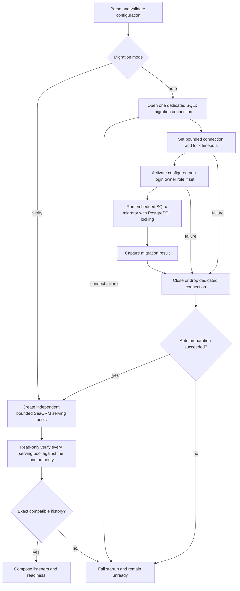

# 04 — PostgreSQL, Redis, and Project-scoped durable state

## Storage authority

PostgreSQL is OwlAuth's sole authoritative transactional store. Projects, Applications, redirect/origin registrations, provider configuration, Project users, linked/email identities, managed provider connections, login/email challenges, handoff tickets, sessions, refresh families, user revisions/Application projections, SMTP and webhook configuration, durable delivery outboxes, revocation, policy, Project key metadata, provisioning operations, and audit events are correct only when established by committed PostgreSQL state. The deployment operator API key is deliberately excluded: it exists only in Control process configuration.

Redis is a deployment dependency for distributed rate coordination, bounded caching, and invalidation hints. It is not an authority for Project ownership, identity, handoff consumption, session validity, refresh rotation, revocation, provider configuration, Control authentication, or key state. Redis can be flushed and rebuilt without changing durable meaning.

Runtime and Control use one schema and one shared core. There are no per-plane databases, cross-plane RPC transactions, message brokers, or distributed commits.

## PostgreSQL adapter implementation

The PostgreSQL adapter inside `crates/owlauth-server` uses SeaORM 2 for ordinary repository and Unit-of-Work queries. SeaORM entities, active models, query expressions, connections, transactions, and errors remain adapter-private and are explicitly mapped to application/domain types and persistence error classes. Application services receive transaction-bound semantic repositories through the application-owned `UnitOfWork`; a business transaction can include multiple repositories and the durable audit appender without exposing ORM types.

Runtime and Control use independent bounded SeaORM serving pools even in `all` mode. All serving pools in one OwlAuth deployment connect to the same configured PostgreSQL server and database authority; split processes MAY use plane-specific login credentials and DDL-free roles, but not independent database targets. Schema-version equality is not evidence that two databases are one authority. Pool acquisition, statement, transaction, lock, and cancellation behavior are bounded according to specs 06 and 08.

SQLx 0.9 is used directly only for embedded migration execution, DDL-free serving-schema compatibility verification, and migration-focused tests. It is not a second ordinary repository style. The production schema is controlled by reviewed SQL files under `crates/owlauth-server/migrations/`; SeaORM schema synchronization and entity-registry schema management MUST remain disabled. OwlAuth does not depend on `sea-orm-migration`, create a separate persistence/migration workspace crate, or expose either library across application ports.

The concrete dependency and revisit decision is recorded in [`TS-001`](technology/ts-001-postgresql-repositories-and-migrations.md) and registered by [spec 10](10-implementation-technology-selections.md). This document remains the authority for storage and migration behavior.

## Logical data model

```mermaid
erDiagram
    PROJECTS ||--o{ APPLICATIONS : contains
    PROJECTS ||--o{ PROVIDER_CONFIGURATIONS : configures
    APPLICATIONS ||--o{ APPLICATION_PROVIDER_CONFIGS : permits
    PROVIDER_CONFIGURATIONS ||--o{ APPLICATION_PROVIDER_CONFIGS : assigned
    PROJECTS ||--o{ PROJECT_USERS : owns
    PROJECTS ||--|| PROJECT_POLICIES : governs
    PROJECTS ||--o{ PROJECT_BROWSER_SESSIONS : isolates
    PROJECTS ||--o{ PROJECT_KEY_RINGS : signs
    APPLICATIONS ||--o{ APPLICATION_REDIRECT_URIS : allows
    APPLICATIONS ||--o{ APPLICATION_ORIGINS : allows
    APPLICATIONS ||--o{ APPLICATION_PUBLIC_KEYS : identifies
    PROJECT_USERS ||--o{ LINKED_IDENTITIES : owns
    PROVIDER_CONFIGURATIONS ||--o{ LINKED_IDENTITIES : verifies
    APPLICATIONS ||--o{ LOGIN_TRANSACTIONS : starts
    PROVIDER_CONFIGURATIONS o|--o{ LOGIN_TRANSACTIONS : selected_provider
    PROJECT_USERS ||--o{ HANDOFF_TICKETS : receives
    LOGIN_TRANSACTIONS ||--o| HANDOFF_TICKETS : produces
    PROJECT_USERS ||--o{ PROJECT_BROWSER_SESSIONS : authenticates
    PROJECT_BROWSER_SESSIONS o|--o{ APPLICATION_SESSIONS : authenticates
    APPLICATIONS ||--o{ APPLICATION_SESSIONS : receives
    PROJECT_USERS ||--o{ APPLICATION_SESSIONS : owns
    APPLICATION_SESSIONS ||--o{ BROWSER_LOGOUT_PREPARATIONS : prepares
    PROJECT_BROWSER_SESSIONS ||--o{ BROWSER_LOGOUT_PREPARATIONS : terminates
    APPLICATION_SESSIONS ||--|| REFRESH_FAMILIES : refreshes
    REFRESH_FAMILIES ||--o{ REFRESH_TOKENS : rotates
    PROJECT_KEY_RINGS ||--o{ SIGNING_KEYS : contains
    SIGNING_KEYS ||--o{ KEY_STATE_EVENTS : transitions
    PROJECT_KEY_RINGS ||--o{ JWKS_PUBLICATION_LEASES : observed_by
    PROJECTS o|--o{ AUDIT_EVENTS : scopes
    PROJECTS o|--o{ MCP_CONFIRMATION_CAPABILITIES : binds
    PROJECTS o|--o{ CONTROL_IDEMPOTENCY_RECORDS : targets
    PROJECTS ||--o{ KEY_PROVISIONING_OPERATIONS : provisions
    PROJECT_KEY_RINGS ||--o{ KEY_PROVISIONING_OPERATIONS : tracks

    PROJECTS {
        uuid id PK
        text public_id UK
        text name
        enum status
        text belongs_to
        bigint security_revision
        bigint metadata_revision
        timestamptz created_at
        timestamptz updated_at
    }
    APPLICATIONS {
        uuid id PK
        uuid project_id FK
        text public_id UK
        text name
        enum application_type
        enum status
        bigint security_revision
        bigint projection_revision
    }
    APPLICATION_REDIRECT_URIS {
        uuid id PK
        uuid project_id FK
        uuid application_id FK
        text exact_uri
        enum redirect_type
    }
    APPLICATION_ORIGINS {
        uuid id PK
        uuid project_id FK
        uuid application_id FK
        text exact_origin
    }
    APPLICATION_PUBLIC_KEYS {
        uuid id PK
        uuid project_id FK
        uuid application_id FK
        text public_key_id UK
        enum status
        timestamptz expires_at
    }
    PROVIDER_CONFIGURATIONS {
        uuid id PK
        uuid project_id FK
        text provider_key
        enum provider_kind
        text issuer
        text client_id
        text secret_ref
        enum status
        bigint security_revision
    }
    APPLICATION_PROVIDER_CONFIGS {
        uuid project_id FK
        uuid application_id FK
        uuid provider_configuration_id FK
        enum status
        bigint security_revision
    }
    PROJECT_POLICIES {
        uuid project_id PK
        bigint claims_revision
        bigint session_revision
        bigint projection_revision
        jsonb claims_policy
        jsonb session_policy
    }
    PROJECT_USERS {
        uuid id PK
        uuid project_id FK
        enum status
        jsonb profile_attributes
        bigint security_revision
        timestamptz created_at
        timestamptz updated_at
    }
    LINKED_IDENTITIES {
        uuid id PK
        uuid project_id FK
        uuid user_id FK
        uuid created_via_provider_configuration_id FK
        text provider_issuer
        text provider_subject
        jsonb profile_attributes
        timestamptz linked_at
    }
    LOGIN_TRANSACTIONS {
        uuid id PK
        uuid project_id FK
        uuid application_id FK
        uuid provider_configuration_id FK
        uuid redirect_uri_id FK
        uuid user_id FK
        text transaction_handle_digest UK
        text upstream_state_digest UK
        text browser_binding_digest
        text csrf_digest
        text app_state_ciphertext
        text handoff_pkce_challenge
        text provider_pkce_verifier_ciphertext
        text oidc_nonce_digest
        text provider_callback_uri
        jsonb allowed_methods_snapshot
        enum selected_method_kind
        bigint transaction_revision
        jsonb revision_snapshot
        enum status
        timestamptz expires_at
    }
    HANDOFF_TICKETS {
        uuid id PK
        uuid project_id FK
        uuid application_id FK
        uuid login_transaction_id FK
        uuid user_id FK
        text ticket_digest UK
        jsonb revision_snapshot
        timestamptz expires_at
        timestamptz consumed_at
    }
    PROJECT_BROWSER_SESSIONS {
        uuid id PK
        uuid project_id FK
        uuid user_id FK
        text credential_digest UK
        enum status
        bigint security_revision
        jsonb revision_snapshot
        timestamptz authenticated_at
        timestamptz last_activity_at
        timestamptz idle_expires_at
        timestamptz absolute_expires_at
    }
    APPLICATION_SESSIONS {
        uuid id PK
        uuid project_id FK
        uuid application_id FK
        uuid user_id FK
        uuid browser_session_id FK
        enum status
        jsonb revision_snapshot
        timestamptz authenticated_at
        timestamptz expires_at
    }
    BROWSER_LOGOUT_PREPARATIONS {
        uuid id PK
        uuid project_id FK
        uuid application_id FK
        uuid user_id FK
        uuid application_session_id FK
        uuid browser_session_id FK
        text preparation_digest UK
        text csrf_digest
        enum status
        bigint revision
        jsonb revision_snapshot
        timestamptz created_at
        timestamptz expires_at
        timestamptz consumed_at
    }
    REFRESH_FAMILIES {
        uuid id PK
        uuid project_id FK
        uuid application_id FK
        uuid user_id FK
        uuid application_session_id FK
        enum status
        bigint current_generation
        int allowed_clock_skew_seconds
        jsonb revision_snapshot
        timestamptz expires_at
    }
    REFRESH_TOKENS {
        uuid id PK
        uuid project_id FK
        uuid family_id FK
        bigint generation
        text token_digest UK
        uuid predecessor_id FK
        uuid successor_id FK
        timestamptz consumed_at
        timestamptz revoked_at
    }
    PROJECT_KEY_RINGS {
        uuid id PK
        uuid project_id FK
        text issuer
        text purpose
        text algorithm
        bigint revision
    }
    SIGNING_KEYS {
        uuid id PK
        uuid project_id FK
        uuid key_ring_id FK
        text kid
        jsonb public_jwk
        text signer_key_ref
        enum state
        timestamptz published_at
        timestamptz sign_not_before
        timestamptz verify_not_after
    }
    KEY_PROVISIONING_OPERATIONS {
        uuid id PK
        uuid project_id FK
        uuid key_ring_id FK
        text idempotency_key
        text provider_operation_ref
        enum status
        timestamptz updated_at
    }
    KEY_STATE_EVENTS {
        uuid id PK
        uuid project_id FK
        uuid signing_key_id FK
        enum from_state
        enum to_state
        text actor_kind
        timestamptz occurred_at
    }
    JWKS_PUBLICATION_LEASES {
        uuid project_id FK
        uuid key_ring_id FK
        text runtime_instance_id
        bigint loaded_revision
        timestamptz observed_at
        timestamptz lease_expires_at
    }
    CONTROL_IDEMPOTENCY_RECORDS {
        text idempotency_key UK
        uuid project_id FK
        text request_digest
        uuid result_resource_id
        timestamptz expires_at
    }
    MCP_CONFIRMATION_CAPABILITIES {
        uuid id PK
        uuid project_id FK
        text capability_digest UK
        text command_digest
        bigint project_metadata_revision
        bigint target_revision
        timestamptz expires_at
        timestamptz consumed_at
    }
    AUDIT_EVENTS {
        uuid id PK
        uuid project_id FK
        text actor_kind
        text action
        text target_kind
        uuid target_id
        text outcome
        uuid correlation_id
        jsonb safe_context
        timestamptz occurred_at
    }
```

The diagram expresses ownership and cardinality, not literal SQL names or every index. Nullable relationships such as `login_transactions.user_id`, `application_sessions.browser_session_id`, `control_idempotency_records.project_id`, `mcp_confirmation_capabilities.project_id`, and deployment-scoped `audit_events.project_id` are constrained by their state/type. Project creation idempotency and deployment-level audit/MCP commands therefore remain representable without inventing a Project.

The identity-expansion tables below extend that core model. They are shown separately so the primary session/key diagram remains readable. Project-owned rows use the same direct `project_id` and same-Project composite constraints; `deployment_smtp_generations` is the explicit deployment-scoped exception and contains only default-generation eligibility plus a safe process-configuration fingerprint, never secret material.

```mermaid
erDiagram
    PROJECTS ||--o{ EMAIL_IDENTITIES : owns
    PROJECT_USERS ||--o{ EMAIL_IDENTITIES : proves
    EMAIL_IDENTITIES ||--|{ EMAIL_IDENTITY_LOOKUPS : indexes
    LINKED_IDENTITIES ||--o| MANAGED_PROVIDER_CONNECTIONS : manages
    MANAGED_PROVIDER_CONNECTIONS ||--o{ MANAGED_CREDENTIAL_RENEWALS : fences
    LOGIN_TRANSACTIONS ||--o{ EMAIL_CHALLENGES : verifies
    EMAIL_CHALLENGES ||--|{ EMAIL_CHALLENGE_PROOFS : offers
    PROJECTS ||--o{ SMTP_CONFIGURATIONS : versions
    SMTP_CONFIGURATIONS o|--o{ EMAIL_CHALLENGES : project_delivery
    DEPLOYMENT_SMTP_GENERATIONS o|--o{ EMAIL_CHALLENGES : default_delivery
    EMAIL_CHALLENGES ||--o{ MAIL_OUTBOX : delivers
    APPLICATIONS ||--o{ APPLICATION_USER_BINDINGS : has_seen
    PROJECT_USERS ||--o{ APPLICATION_USER_BINDINGS : visible_to
    APPLICATION_USER_BINDINGS ||--|| APPLICATION_USER_PROJECTIONS : materializes
    APPLICATIONS ||--o{ WEBHOOK_ENDPOINTS : configures
    APPLICATION_USER_BINDINGS ||--o{ USER_PROJECTION_EVENTS : emits
    PROJECTS ||--o{ PROJECTION_EXPANSION_OPERATIONS : converges
    USER_PROJECTION_EVENTS ||--o{ WEBHOOK_DELIVERIES : targets
    WEBHOOK_ENDPOINTS ||--o{ WEBHOOK_DELIVERIES : receives
    PROJECTS ||--o{ SECRET_PROVISIONING_OPERATIONS : protects

    EMAIL_IDENTITIES {
        uuid id PK
        uuid project_id FK
        uuid user_id FK
        text email_ciphertext
        enum status
        timestamptz verified_at
    }
    EMAIL_IDENTITY_LOOKUPS {
        uuid id PK
        uuid project_id FK
        uuid email_identity_id FK
        integer canonicalization_version
        integer digest_key_version
        text lookup_digest
    }
    MANAGED_PROVIDER_CONNECTIONS {
        uuid id PK
        uuid project_id FK
        uuid linked_identity_id FK
        uuid provider_configuration_id FK
        enum state
        bigint generation
        integer credential_aead_key_version
        text credential_ciphertext
        jsonb bounded_source_profile
        text source_profile_digest
        timestamptz next_sync_at
        timestamptz lease_expires_at
    }
    MANAGED_CREDENTIAL_RENEWALS {
        uuid id PK
        uuid project_id FK
        uuid managed_connection_id FK
        bigint expected_generation
        bigint successor_generation
        text adapter_attempt_id
        enum status
        timestamptz submitted_at
        timestamptz lease_expires_at
    }
    EMAIL_CHALLENGES {
        uuid id PK
        uuid project_id FK
        uuid login_transaction_id FK
        integer email_digest_key_version
        text email_lookup_digest
        text email_ciphertext
        bigint generation
        enum smtp_selection_kind
        uuid smtp_configuration_id FK
        bigint smtp_generation
        bigint smtp_revision
        enum status
        timestamptz expires_at
        timestamptz consumed_at
    }
    EMAIL_CHALLENGE_PROOFS {
        uuid id PK
        uuid project_id FK
        uuid email_challenge_id FK
        enum proof_kind
        integer proof_digest_key_version
        text proof_digest
        integer failed_attempts
        timestamptz expires_at
    }
    SMTP_CONFIGURATIONS {
        uuid id PK
        uuid project_id FK
        bigint generation
        enum status
        text host
        integer port
        enum tls_mode
        text credential_secret_ref
        jsonb sender_and_templates
        bigint revision
    }
    DEPLOYMENT_SMTP_GENERATIONS {
        bigint generation PK
        enum status
        bigint revision
        text safe_configuration_fingerprint
    }
    MAIL_OUTBOX {
        uuid id PK
        uuid project_id FK
        uuid email_challenge_id FK
        text message_id
        enum smtp_selection_kind
        uuid smtp_configuration_id FK
        bigint smtp_generation
        bigint smtp_revision
        text encrypted_envelope_and_body
        enum status
        integer attempt_count
        timestamptz next_attempt_at
        timestamptz lease_expires_at
    }
    APPLICATION_USER_BINDINGS {
        uuid id PK
        uuid project_id FK
        uuid application_id FK
        uuid user_id FK
        timestamptz first_delivered_at
        enum status
    }
    APPLICATION_USER_PROJECTIONS {
        uuid application_user_binding_id PK
        uuid project_id FK
        bigint user_revision
        bigint projection_revision
        bigint project_policy_revision
        bigint application_policy_revision
        text projection_schema
        text projection_digest
        jsonb bounded_projection
    }
    WEBHOOK_ENDPOINTS {
        uuid id PK
        uuid project_id FK
        uuid application_id FK
        text exact_url
        enum status
        text current_secret_ref
        text overlap_secret_ref
        jsonb event_filter
        bigint revision
    }
    USER_PROJECTION_EVENTS {
        uuid id PK
        uuid project_id FK
        uuid application_user_binding_id FK
        text event_type
        bigint user_revision
        bigint projection_revision
        jsonb immutable_payload
        timestamptz occurred_at
    }
    PROJECTION_EXPANSION_OPERATIONS {
        uuid id PK
        uuid project_id FK
        uuid application_id FK
        bigint policy_revision
        uuid binding_cursor
        enum status
        timestamptz lease_expires_at
    }
    WEBHOOK_DELIVERIES {
        uuid id PK
        uuid project_id FK
        uuid event_id FK
        uuid endpoint_id FK
        enum status
        integer attempt_count
        timestamptz next_attempt_at
        timestamptz lease_expires_at
    }
    SECRET_PROVISIONING_OPERATIONS {
        uuid id PK
        uuid project_id FK
        text idempotency_key
        text purpose
        text provider_operation_ref
        enum status
        timestamptz updated_at
    }
```

`project_users` additionally carries monotonic `user_revision`, a canonical materialized-base-profile digest, and an optional same-user designated primary profile identity reference/discriminator. The Project email-auth policy—not a possibly absent SMTP configuration row—stores explicit deployment-default opt-in. Nullable SMTP relationships are constrained by `smtp_selection_kind`: Project selection requires the same-Project configuration ID/generation/revision and no default generation; deployment-default selection requires no Project configuration ID and an existing deployment registry generation/revision. `projection_expansion_operations.application_id` is null only for a Project-wide projection-policy revision and otherwise identifies one same-Project Application. A new `login_transaction` is `awaiting_browser_binding` with no selected provider/method or browser/CSRF binding: it snapshots admitted methods and revisions, the first eligible top-level Hosted GET conditionally binds one browser and advances to `awaiting_method_selection`, then one CSRF/browser-bound expected-revision command selects provider or email. `provider_configuration_id` and upstream fields are null unless provider is selected. Credential/payload columns are purpose-bound versioned ciphertext or opaque secret references according to spec 11; specifically, v1 managed renewable credentials are PostgreSQL AEAD ciphertext so replacement is one authoritative database transition, while provider/SMTP/webhook configuration secrets remain opaque external references.

## Project isolation constraints

- `projects.public_id` is immutable and identifies the Runtime namespace.
- `projects.belongs_to` is nullable bounded opaque text with a non-unique B-tree index. It has no foreign key to an OwlAuth organization because OwlAuth has no organization model.
- Every Project-owned object carries `project_id`. Composite foreign keys or equivalent constraints ensure every referenced parent has the same Project.
- Repository operations accept `ProjectId` as a required argument for Project-owned state; unqualified object lookup is forbidden in Runtime and Project-bound Control use cases.
- Canonical `(project_id, provider_issuer, provider_subject)` is unique for linked identities across all provider registrations in that Project.
- Application/provider public keys are unique in a namespace that cannot resolve to another Project accidentally.
- Project transfer does not exist. Changing `belongs_to` changes external metadata, not Project identity or child ownership.
- Project disablement advances `security_revision`; all Runtime operations compare their revision snapshot and fail closed.

## Entity constraints

### Projects and Applications

- An Application belongs to exactly one Project and cannot move.
- Application public IDs and publishable keys are identifiers, not secrets. Their rotation affects abuse/quota attribution, not user or Control authority.
- `(project_id, application_id, exact_uri)` and `(project_id, application_id, exact_origin)` are unique.
- Redirect registration validates URI syntax and type; Runtime compares the exact stored string and does not perform lossy normalization.
- Disabling an Application advances its security revision and invalidates pending handoffs, Application sessions, and refresh families through revision comparison. Project browser sessions remain valid.

### Provider configurations

- `(project_id, provider_key)` is unique. A provider configuration represents one upstream OAuth/OIDC client registration with canonical issuer/kind, client ID, callback identity, and opaque secret-manager reference.
- A Project may define multiple registrations for the same provider kind, such as separate web/native client IDs. An Application can select only an active configuration assignment established through a same-Project join constraint.
- Assigning/unassigning a provider advances the assignment `security_revision`. Login transaction, callback completion, and handoff exchange revalidate the captured assignment revision.
- Provider callback identity is derived from trusted Runtime external URL and is exactly `projects/{project_public_id}/auth/callback/{provider_key}` relative to that base; caller input cannot replace it and no alternate callback alias is accepted.
- Secret bytes are absent from PostgreSQL, Redis, public Project config, Runtime responses, and audit events.
- Provider configuration disablement/revision invalidates pending login callbacks for that provider without affecting another Project.

### Project users and identities

- `project_users.id` is a stable local subject under one Project. Email is neither primary key nor linking key.
- `(project_id, provider_issuer, provider_subject)` is unique across all provider registrations in that Project.
- A linked identity belongs to one Project user. Its immutable `created_via_provider_configuration_id` references the same-Project registration that first created it and is provenance only, not authorization ownership for later authentication.
- A later callback through another registration with the same canonical issuer may resolve the same `(project_id, provider_issuer, provider_subject)` identity only after revalidating that the current registration and Application assignment are active and that the verified issuer exactly equals the current registration's canonical issuer. Creation provenance is never used to bypass those checks.
- Matching email/profile data never links users automatically.
- One proven identity may be designated as the user's primary provider-owned profile source. Initial creation selects its creating identity; linking/sync never switches it implicitly, and unlinking it atomically selects another same-user proven identity or clears its source-owned fields.
- Merge locks both Project users in canonical UUID order, proves they share the same Project, rejects issuer/subject and email-alias conflicts, resolves the primary-profile-source choice explicitly, moves identities and eligible managed connections, and tombstones the losing user ID. Cross-Project merge is forbidden. V1 never reassigns credentials issued to the losing user: all losing-user Project browser sessions, Application sessions, and refresh families are revoked in the merge transaction. For each Application, an existing winner binding is retained; otherwise the losing binding is reassigned to the winner while preserving its original first-delivery timestamp. Duplicate losing bindings/projections are terminalized after their authoritative state is folded into the retained winner binding. Winner-issued sessions remain valid only when their ordinary captured security revisions still match; merge does not silently upgrade them.
- User disablement advances `security_revision`, making sessions, tickets, and refresh families bound to older revisions unusable.
- `project_users.user_revision` is monotonic and advances only for Application-visible profile/security changes under the deterministic spec 11 mapper; observation timestamps alone do not advance it.

### Managed connections, email, and delivery state

- A linked provider identity has at most one managed connection. `(project_id, linked_identity_id)` is unique; generation and state guards reject sync output prepared before credential replacement, reauthorization, unlink, disconnect, provider disablement, or user disablement.
- V1 recoverable provider credentials are versioned AEAD ciphertext in PostgreSQL and bind deployment/Project/provider/identity/connection generation/purpose as authenticated context. Every replacement advances generation and makes its predecessor inaccessible in the same commit. Redis, external generic secret storage, and ordinary profile JSON never contain them. Disconnect/unlink atomically advances/terminalizes the generation and destroys access to active ciphertext.
- A credential renewal creates a durable operation under the expected connection generation. Its states are `prepared`, `submitted`, `successor_committed`, `reauth_required`, and `abandoned`. `submitted` commits before external invocation; a crash while only `prepared` may be reclaimed, but any non-idempotent lost/ambiguous outcome or lease loss after `submitted` cannot reuse the predecessor. The guarded resolution advances generation and moves the connection to `reauth_required`. An adapter-declared idempotent replay reuses the same operation/attempt ID. A received successor ciphertext commits before an optional profile fetch.
- Email identities carry one or more versioned lookup aliases. `(project_id, canonicalization_version, digest_key_version, lookup_digest)` is unique, rotation backfills and checks the new alias before write cutover, and create/lookup checks every accepted version under the same email-namespace serialization rule. Recoverable email is encrypted/protected separately and is never the linking key for a provider identity.
- Email challenge families permit only the newest pending generation and may own separate OTP and magic-link proof rows. Proof digests, OTP attempt increments, expiry, and parent `consumed_at` are authoritative; exactly one conditional parent transition can create the user/session/handoff result and invalidates sibling proofs.
- Email challenge creation and its mail-outbox item commit together. Both rows immutably pin Project-versus-deployment-default selection, nullable Project SMTP configuration ID, and exact generation plus security-eligibility revision; `message_id` is stable across retries and encrypted payload retention is bounded. `(project_id, generation)` is unique for Project SMTP history; Project email-auth policy owns explicit deployment-default opt-in. Deployment-default generations have a deployment-scoped PostgreSQL status/revision registry whose safe fingerprint must match process configuration; no SMTP secret bytes enter it. Replacement never retargets existing rows.
- Project/default SMTP generation disablement or compromise atomically advances that generation's eligibility revision/status. Every proof completion and mail claim conditionally revalidates the challenge's pinned selection/generation/revision in PostgreSQL, so all later attempts fail closed immediately after commit. Bounded cleanup then terminalizes pending jobs/challenges without making an unbounded fan-out part of the security commit. Planned rotation selects a new generation while retaining the old generation's eligibility revision only through the maximum usefulness of its challenges.
- `(project_id, application_id, user_id)` is unique for Application-user bindings. One Project user has at most 64 bindings; binding creation checks this hard limit while holding that user row exclusively, and fan-out reads at most 65 active rows to fail closed if authoritative state violates the bound. A materialized projection belongs to exactly one binding and records the Project-user revision plus independent Project and Application projection-policy revision snapshots. It advances its own monotonic `projection_revision` when its canonical bounded projection or either governing projection-policy revision changes; source observation timestamps alone do not advance it.
- A user-base mutation re-materializes its bounded set of Application bindings and inserts immutable events/targets in the same transaction. A Project/Application projection-policy mutation instead commits one durable expansion operation; Runtime lazily repairs a stale requested binding, and workers advance the durable cursor in bounded batches whose per-binding projection/event/delivery changes commit atomically. `(event_id, endpoint_id)` is unique; replay creates a distinct delivery attempt referencing the same immutable event.
- SMTP/webhook credential writes use durable secret-provisioning operations and opaque Project-scoped references. A retry resolves the same provider operation; an ambiguous external write is reconciled instead of silently creating another secret. Managed renewable credentials deliberately do not use this external dual-write path in v1.
- Mail/webhook leases may expire and duplicate an external attempt, but conditional delivery/event/challenge state prevents a lease from becoming identity or ordering authority.

### Login transactions and handoff tickets

- Transaction handles, upstream state, browser bindings, OIDC nonces, and handoff tickets use purpose-keyed digests with key-version metadata.
- Bounded Application state and any server-generated upstream provider PKCE verifier required by the selected provider profile must be recoverable across the redirect, so they are stored as purpose-bound authenticated ciphertext through `DataProtector` and are never logged or used outside that transaction. The first restricted OIDC profile requires provider-side PKCE S256. A fresh OIDC nonce is mandatory independently of provider-side PKCE and does not need recovery after authorization construction: only its purpose-keyed digest and digest-key version are stored for exact ID-token comparison.
- `login_transactions.user_id`, selected method, selected provider, and method-specific proof state are null at generic start; user remains null until authentication resolves a Project user.
- Login transaction states are `awaiting_browser_binding`, `awaiting_method_selection`, `email_address_entry`, `email_challenge_pending`, `provider_authorization_started`, `provider_exchange_in_progress`, `provider_exchange_failed`, `authenticated`, `handoff_issued`, `completed`, `expired`, and `cancelled`. Generic start creates `awaiting_browser_binding` with null browser/CSRF fields. Only the first eligible top-level Hosted GET may conditionally bind a fresh browser credential and CSRF state and move it to `awaiting_method_selection`; it cannot rebind a transaction owned by another browser. Provider/email selection compare-and-swaps one method-specific transition from `awaiting_method_selection` under browser binding, CSRF, current assignment/policy, allowed-method snapshot, and expected `transaction_revision`. A separate confirmed browser-session-reuse command may atomically move `awaiting_method_selection` directly to `handoff_issued` after current Project/user/session/reuse-policy checks. All three choices compete on the same status/revision; method cannot change after one wins. `provider_exchange_failed` is terminal and requires a new login.
- OIDC provider selection atomically establishes the exact stored callback URL snapshot, upstream-state digest, mandatory OIDC nonce digest, provider/assignment revisions, first provider state, and a recoverable provider PKCE verifier when required by that profile. The first restricted OIDC profile requires both PKCE S256 and nonce. An OIDC callback cannot resolve identity until the adapter validates the exact nonce from the required ID token.
- Resend advances only the newest email-challenge generation under the already selected email method; it does not change transaction method. A login transaction expires 10 minutes after generic start and produces at most one handoff ticket; retry or policy change cannot extend it.
- A handoff ticket binds Project, Application, exact redirect, Project user, selected authentication-method result, PKCE challenge, and relevant revisions. Its `expires_at` is `LEAST(issued_at + 60 seconds, login_transaction.expires_at)`, so 60 seconds is the fixed maximum rather than a promise to outlive its parent transaction. Provider-authenticated tickets additionally bind and revalidate the active Application-provider assignment; email-authenticated tickets have no invented provider dependency.
- Conditional update of `consumed_at` from null is the handoff's one-use serialization point.

### Sessions and refresh families

- A Project browser session is Project/user/browser-bound and carries only Project/user/session-policy revisions. It is not Application-bound. It stores independent last-activity/idle expiry and absolute expiry under fixed v1 bounds of 8 hours idle and 24 hours absolute. Only committed fresh provider/email authentication and explicit eligible browser-session reuse are authoritative activity. Their transaction updates `last_activity_at` monotonically and sets `idle_expires_at = LEAST(activity_time + 8 hours, absolute_expires_at)`; passive/failed Hosted requests and Application handoff/current-user/refresh or other backend traffic do not update activity.
- A Project access-token-authenticated browser-logout preparation stores only a purpose-keyed digest and binds the exact Project/Application/user/Application session, referenced Project browser session, revision snapshot, 60-second expiry, and one-use `consumed_at`. Its first eligible top-level Hosted GET requires the matching browser-session cookie and conditionally stores fresh CSRF state without terminating the session. The same-origin POST returns that proof; preparation consumption and browser-session termination commit together. The access token never enters a URL or page state. The raw preparation appears only in the returned Hosted target and is absent from PostgreSQL, audit, logs, and browser cookies; PostgreSQL stores its purpose-keyed digest.
- An Application session belongs to one Project/Application/user and may reference the Project browser session that authenticated it.
- A refresh family belongs to one Application session and retains Project/Application/user/policy revisions. Application sessions and families share the fixed v1 absolute deadline 30 days after creation, while revocation or an owning resource's earlier expiry may terminate them sooner; no Project policy configures a shorter or longer lifetime. Replay evidence is retained through at least that deadline plus allowed clock skew. The family snapshots the deployment's `allowed_clock_skew_seconds` at creation; every later generation derives its retention from that immutable family value rather than caller input.
- If an Application session references a Project browser session, refresh locks/revalidates that browser session status and revision. A terminated browser session cannot mint another access token.
- `(family_id, generation)` is unique; exactly one unconsumed current generation is allowed for an active family.
- Rotation consumes the current token, inserts the successor, and advances the generation atomically.
- Any presentation of a consumed generation revokes the family and commits the replay audit event atomically.

### Project key rings

- A key ring is unique by `(project_id, issuer, purpose, algorithm)` and increments its revision on lifecycle change.
- Exactly one key is `Active` in a Project key ring, enforced by a partial unique constraint and domain policy.
- `(project_id, kid)` is unique; a `kid` is never reused for different material in that Project.
- `signer_key_ref` is opaque; private material and wrapping keys are absent from PostgreSQL and Redis.
- Token issuance obtains a shared signing-epoch guard for the active key-ring revision. Lifecycle activation/retirement obtains the conflicting exclusive guard. Concurrent issuance does not update a single hot key row.
- A JWKS publication lease's `observed_at` records when that specific loaded revision was first loaded; heartbeat renewal changes only `lease_expires_at`. Key activation waits the full propagation interval from the latest qualifying observation.
- Entering `Retiring` sets `verify_not_after` conservatively from transition time plus maximum Project token lifetime, clock skew, JWKS cache retention, and propagation margin.

### Deployment operator and audit

- The single Control API key is loaded from `OWLAUTH_CONTROL_API_KEY`, remains only in process configuration, and has no PostgreSQL or Redis row, digest, identifier, permission set, expiry, or lifecycle endpoint.
- Control idempotency is deployment-operator-scoped: `idempotency_key` is unique across the deployment. Project-bound records also carry the target Project. Reuse with another request digest is a conflict.
- An idempotency record for creation of a durable resource remains as a replay/tombstone record for at least the lifetime of that resource and MUST NOT expire into permission to execute the same key again; its `expires_at` is null while lifetime retention applies. Other eligible command records have a documented retention window longer than every supported client retry and reconciliation window. After expiry, an unknown create outcome is reconciliation-required rather than automatically replayable. Backup/restore preserves each record consistently with its committed resource transaction.
- MCP confirmation capabilities are stored only as digests, expire, and are consumed exactly once in the same PostgreSQL transaction as the bound command and audit event. They bind the deployment operator, command, Project, and revisions without creating a durable operator identity.
- Audit events are append-only. Security mutations and their audit event commit in the same PostgreSQL transaction. Every Control event has the fixed actor kind `deployment_operator`; OwlAuth stores no server-side operator identity.
- Project-scoped events carry `project_id`; deployment-level events use a constrained null Project and cannot be confused with a Project event.
- `safe_context` follows action-specific schemas and excludes arbitrary payloads and credentials.

## Authoritative transaction boundaries

| Operation | Rows/aggregates serialized together | Commit invariant |
| --- | --- | --- |
| Bind Hosted browser | Project/login transaction revision and allowed-method snapshot, fresh browser credential digest and CSRF state | one eligible top-level Hosted GET moves `awaiting_browser_binding` to `awaiting_method_selection`; another browser cannot rebind it |
| Select login method | Project/login transaction revision and allowed-method snapshot, current Application method/provider assignment revision, browser/CSRF binding; exact callback/upstream-state/provider-PKCE/OIDC-nonce facts for OIDC | exactly one assigned current provider/email method moves `awaiting_method_selection` to its first method-specific state; method cannot be switched |
| Confirm browser-session reuse | Project/login transaction revision, exact Application/redirect/PKCE, current Project user and browser-session status/security/auth-age/reuse-policy revisions, monotonic activity/idle-expiry update clamped to absolute expiry, browser/CSRF binding, handoff, audit | one eligible same-Project browser session moves `awaiting_method_selection` directly to `handoff_issued`; concurrent reuse/method selection loses and no caller-selected identity is accepted |
| Claim provider callback | Project/provider-selected login transaction, provider and Application-assignment revisions, audit | exactly one callback moves `provider_authorization_started` to `provider_exchange_in_progress`; no automatic retry after ambiguous exchange |
| Complete provider callback | claimed transaction, exact adapter-validated OIDC issuer/subject/nonce result, provider/assignment revisions, linked identity, optional managed-credential generation, Project user, browser session, handoff ticket, audit | identity resolves only after required ID-token nonce validation and within one Project; managed successor is protected before commit; at most one ticket is produced; failure becomes terminal |
| Exchange handoff | ticket, Project/Application/user/projection-policy revisions, provider assignment when applicable, Application-user binding/materialized projection, optional eligible initial event/targets, Application session, refresh family/token, signing epoch, audit | one successful consumer; binding/projection exists from first handoff; session and projection commit together |
| Rotate refresh token | family, Application session, referenced browser session, presented/successor token, Project/Application/user/policy revisions, signing epoch, audit | at most one successor; terminated browser session denies refresh; detected reuse revokes family |
| Application logout/revoke | verified Project access-token claims, selected Application session/family and audit | direct idempotent revocation affects only the exact Application session; selected credentials cannot become active again |
| Prepare Project browser logout | verified Project access-token claims, exact Application/browser session and one-use preparation digest/revisions | returns only a short-lived Hosted target; no Bearer credential enters the URL |
| Bind Project browser-logout confirmation | one-use preparation revision, matching browser cookie/session, fresh CSRF digest | one eligible top-level GET binds confirmation CSRF without logout; another browser cannot claim or inspect it |
| Confirm Project browser logout | one-use preparation, matching browser cookie, same-origin CSRF, browser-session status/revision and audit | preparation consumption and termination are atomic; browser credential cannot authenticate another handoff and derived sessions cannot refresh |
| Disable Project | Project status/security revision and audit | every Project Runtime operation observes disablement after commit |
| Disable Application | Application status/security revision and audit | its tickets/sessions/families become logically invalid; other Applications remain valid |
| Disable user | Project user status/security/user revisions, bounded bound-Application projections and installed-contract events/deliveries, audit | all credentials become logically invalid and each existing binding observes a disabled projection atomically |
| Link/unlink identity | Project user/revision, identities, designated source, any managed connection/ciphertext, bounded bound-Application projections and installed-contract events/deliveries, audit | uniqueness/source precedence preserved; unlink disconnects credential atomically; affected projections advance together |
| Merge users | locked winner/loser users, identities and managed connections, explicit source choice, winner/loser Application bindings/projections, session/security disposition, installed-contract events/deliveries, tombstone, audit | same-Project uniqueness preserved; each Application has one resolved winner binding/source and receives only its actual committed projection transition |
| Any externally proxied Project mutation | observed Project metadata revision plus command-specific rows and audit | ownership metadata cannot change between gateway authorization and child mutation commit |
| Update `belongs_to` | Project metadata revision, Control idempotency, audit | external metadata changes without child ownership change |
| Begin email challenge | email-selected login transaction/revision, newest challenge/proofs, pinned SMTP selection/configuration/generation/eligibility revision, mail outbox | one generic accepted command commits proof and exact delivery generation/revision together or neither |
| Disable/compromise SMTP generation | exact Project SMTP configuration or deployment-default registry generation status/eligibility revision, audit | after commit every mail claim and proof completion pinned to the prior revision fails closed; bounded cleanup may follow |
| Complete email challenge | login/challenge generation, pinned SMTP selection/configuration/generation plus current eligibility status/revision, email identity, Project user/revision, browser session, handoff, mail/challenge state, audit | only a still-eligible exact SMTP generation can back one newest proof; one Project user/handoff resolves without email-based provider linking; Application binding waits for handoff exchange |
| Resolve managed credential renewal | durable renewal operation, expected managed-connection generation/state, successor AEAD ciphertext or destructive reauth transition, audit where required | successor generation commits before optional profile fetch; ambiguous non-replayable submission cannot reuse predecessor |
| Commit provider profile sync | current managed connection generation, provider/user revisions, source profile, user revision, bound Application projections/installed-contract events, audit where required | stale remote output cannot overwrite a newer credential/identity/user state |
| Materialize user projection change | Project user/base revision, bounded affected binding projection/policy revisions, immutable events/deliveries, audit | every targeted Application sees one immutable snapshot for its committed monotonic projection revision |
| Change projection policy | Project/Application policy revision, durable expansion operation, Control idempotency, audit | new Runtime reads cannot return the old policy and webhook convergence has one resumable bounded cursor |
| Expand projection policy | claimed expansion cursor, one bounded binding batch, projection revisions, immutable events/deliveries | each binding advances atomically at most once for the target policy revision; crash resumes after committed cursor |
| Configure SMTP/webhook secret | durable secret operation, Project/Application config revision, Control idempotency, audit | ambiguous secret-store effects reconcile to one opaque reference and never expose bytes |
| Replay webhook event | immutable event, eligible endpoint revision, new delivery record, Control idempotency, audit | payload/Project/Application/user/event ID cannot be changed by replay |
| Transition signing key | Project key ring revision, involved key metadata, publication evidence, state event | exactly one active key and transition conditions satisfied |

Every Project-bound Control mutation accepts an optional expected Project metadata revision; external-gateway calls require it and compare it in the same transaction as the child mutation. Security-sensitive operations use row locks, unique constraints, compare-and-swap revisions, or serializable transactions according to the invariant. Serialization/deadlock retries are bounded and happen only before externally visible irreversible effects.

Provider and KMS calls do not run while a PostgreSQL transaction is held. Cryptographic output may be prepared before the final conditional transaction, but no credential response is returned unless Project state and signing epoch commit successfully. Prepared signatures discarded after a conflict are not issued credentials.

## Redis roles

### Permitted data

Redis keys include deployment, Project, purpose, and schema-version namespaces. Permitted categories are:

- distributed Runtime and Control rate counters and short-lived abuse signals;
- short-lived caches of public Project/Application auth configuration and Project JWKS;
- version-addressed caches of non-secret provider presentation metadata;
- best-effort Project/Application/user/key cache-invalidation notifications after PostgreSQL commit;
- bounded idempotency hints that never replace PostgreSQL records or uniqueness.

Every cache entry has a TTL and source revision. A cache hit cannot replace Project qualification or turn an authoritative denial into an allow.

### Forbidden authority

Redis MUST NOT be the sole store or serialization point for:

- Project/Application/provider status or `belongs_to`;
- Project users or linked identities;
- login/callback completion or handoff consumption;
- browser/Application sessions or refresh families;
- revocation or Control authentication;
- Project key lifecycle, JWKS publication proof, or private material;
- audit records;
- locks whose loss could cross Projects, duplicate a credential, or permit an invalid transition.

## Cache invalidation and security changes

Control commits a mutation and audit event to PostgreSQL first, then publishes a best-effort invalidation carrying Project, entity, identifier, and new revision. Runtime treats invalidation as a latency optimization.

Project/Application/provider/user disablement, redirect removal, policy changes, and key changes are read from PostgreSQL at the login start, callback, handoff, refresh, current-user, and signing decision points. Their correctness does not depend on Redis delivery or TTL.

Already issued Project access tokens retain their signed expiry semantics. Cache invalidation cannot revoke a token already accepted offline by an Application backend.

## Migration architecture

SQL migration source files live under `crates/owlauth-server/migrations/` and are embedded into the server artifact at build time by SQLx 0.9. Released migration files are append-only repository artifacts. SQLx's `_sqlx_migrations` table and built-in checksum validation are the migration-history mechanism; OwlAuth does not add a second history table, checksum algorithm, or generic migration framework.

The `MIGRATION_MODE` configuration defaults to `auto` and is one of:

- `auto`: before serving pools or listeners are created, open one dedicated SQLx `PgConnection` to the single configured serving server/database target using an optional migration login credential (defaulting to the serving credential), configure bounded connection and PostgreSQL `lock_timeout`, activate the configured non-login owner role when used, and run the embedded SQLx migrator with PostgreSQL locking enabled. Migration configuration cannot override the server or database target;
- `verify`: perform no DDL and use the restricted serving connection to compare the target's SQLx history with the embedded migration set.

The deployment configures one serving PostgreSQL server/database target. Runtime and Control may use distinct credentials, roles, and pools for that target, and every actual pool verifies the same migration history. Configuration that points the planes at different database targets is invalid and fails before listeners bind; matching migration histories do not make independent databases one authority. Verification fails closed on an absent history table, failed/dirty entry, pending or missing version, checksum mismatch, or database-ahead version. The serving role has only the read privilege on migration history needed for this check; it does not gain schema DDL authority.

The dedicated migration connection is closed or dropped before any serving pool is admitted, on success, migration error, timeout, cancellation, or panic unwinding. A session-scoped advisory lock is never returned to a live pool. Concurrent `auto` starts coordinate through SQLx's PostgreSQL migration lock, not Redis or an OwlAuth lock protocol.

For hardened deployments, a non-login role owns the schema, SQLx history table, and migration-created objects. The migration login is permitted to assume it and MUST activate it before the migrator creates or changes objects. Owner default privileges or explicit migration grants provide each DDL-free serving role with only its required schema, table, sequence, and migration-history access.

Migrations are transactional unless PostgreSQL cannot perform the operation in one transaction and the migration explicitly declares and documents a bounded resumable procedure. Partial or ambiguous state is incompatible and cannot serve. Rolling releases use expand/migrate/switch/contract: release N's schema remains usable by release N-1 during overlap, and destructive contraction occurs only in a later release after old binaries are drained. An additive derived-integrity column whose existing-row rewrite can exceed the startup migration deadline remains nullable during expansion: compatibility defaults/triggers fill N and N-1 writes, current reads lazily repair legacy rows without semantic revision churn, and a bounded resumable inventory/backfill must prove closure before a later contract migration adds `NOT NULL` or removes compatibility machinery.

## Durability and recovery model

A recoverable OwlAuth state consists of:

- a transactionally consistent PostgreSQL backup, including Application bindings/projections, projection-expansion cursors, immutable events/deliveries, and their committed attempt state;
- deployment external URLs, immutable environment/public instance ID, and Project issuer derivation configuration;
- provider, SMTP, and webhook secret references plus access to every active/overlap retained generation in their secret store, including deployment-default SMTP process handles whose generation/fingerprint matches the restored PostgreSQL registry;
- the current `OWLAUTH_CONTROL_API_KEY` supplied independently to Control processes when Control is enabled;
- every active/retained Project signer key reference and corresponding key-store material;
- active and accepted email canonicalization versions, keyed lookup-digest keys, and all aliases needed during rotation;
- long-term email-identity PII protector keys and managed-credential AEAD keys for every active retained ciphertext;
- short-term `DataProtector`/digest versions needed by unexpired login, email challenge, and encrypted mail-outbox state;
- wrapping-key material where software key adapters use envelope encryption;
- schema-history state corresponding to the backup.

Short-term transaction/challenge/outbox ciphertext whose required protector is unavailable is explicitly cancelled or terminalized before the affected capability becomes ready; it is never guessed as decryptable or delivered under another generation. By contrast, an old key protecting recoverable long-term email PII or an active managed credential cannot retire until a complete, uniqueness-safe re-encryption/rewrap pass is proven. Missing such material keeps that identity/profile capability unready or requires an explicit destructive reauthorization workflow. Missing external SMTP/webhook/provider secret references fails only their purpose closed and enters reconciliation/repair; it never falls back to another Project or secret generation. If a required signer key cannot be resolved, affected Project signing remains unready instead of silently changing issuer or key identity.

After restore, renewal operations, mail jobs, projection expansions, and webhook deliveries continue only from their committed generation/cursor/outbox state and re-run the same eligibility guards. Email proof completion also revalidates the restored pinned SMTP generation/status/revision before consumption. No synthetic `user.projection.created` event is generated for a binding merely because webhook schema/endpoint support was added after its original handoff. Redis is excluded from recovery and is flushed or moved to a new recovery namespace. Restore preserves the deployment public instance ID, Project/user/Application IDs, `belongs_to`, issuer, sessions/families, `kid`, public keys, and opaque secret/key references.
