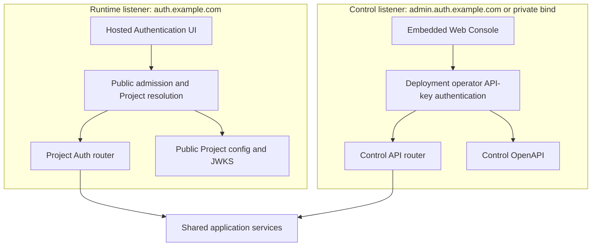
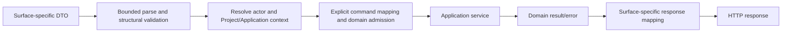

# 05 — Runtime and Control HTTP contracts

## Contract authority

Reviewed Rust definitions in `crates/owlauth-types` are the source of stable HTTP wire vocabulary and OpenAPI descriptions. Domain entities, PostgreSQL rows, provider payloads, secret references, and internal commands are not public DTOs.

The package separates contracts by surface:

- `runtime` contains Project Auth, session, current-user, and public key/configuration DTOs;
- `control` contains administrative DTOs and problem details;
- `health` contains minimal listener-specific health vocabulary.

Runtime and Control operations are never combined merely because one process serves both listeners. Generated OpenAPI is a derived view and cannot grant an operation exposure or authorization.

## Listener and router isolation



Listeners have distinct bind addresses, trusted-proxy settings, TLS policy, routers, middleware, authentication, CORS, rate limits, request bounds, connection budgets, metrics dimensions, and readiness. Routing by `Host` on one untrusted socket is not equivalent. Distinct Runtime and Control external origins are recommended to isolate the browser-held operator key from public Runtime script execution. An explicitly configured shared origin requires disjoint non-root base paths, Runtime cookie path containment, no service workers, restrictive opener policy, and deliberate acceptance of one browser/XSS trust boundary as defined by spec 09. Internal listener isolation remains unchanged.

In `--plane=all`, a request accepted by one listener cannot dispatch to the other plane's router through path, host, forwarding header, content type, or method manipulation.

## Management Console surface

The Control listener serves the embedded administrative Console at the configured Control-base-relative `console/` path. The credential-free shell accepts the operator's deployment API key and then calls the same Control-base-relative `v1/*` contract with a Bearer header. It has no direct application-service, repository, database, or secret-provider path.

Console HTML/assets and client-side routes are server-owned implementation surfaces, not OpenAPI operations. Stable API DTOs remain in `owlauth-types`. Runtime never serves the Console or receives its deployment key.

## Hosted Authentication UI surface

The Runtime listener serves typed Project-scoped Hosted interactions and their fingerprinted assets under the configured Runtime base. An ordinary Application login generic start creates the unbound `login` class; Control create commands may create the separate `identity_mutation` class with server-derived immutable proof roles or an exact `managed_reauthorization` class for one existing connection. Only the first eligible top-level Hosted GET may conditionally bind a fresh Runtime interaction-browser credential and CSRF state before rendering its typed next actions; an API fetch, subresource, frame, copied URL after binding, query value, or initiating backend cannot provide or replace that browser authority. Ordinary reads and every method/confirmation command require the already matching class and binding; no class fallback or conversion exists.

For `login`, the UI presents only the transaction's admitted provider/email methods, submits one explicit method-selection command, shows progress or bounded local errors, may reuse a valid Project browser session, and completes an Application return. It resolves all authority from stored login-transaction and public Project/Application state; caller input or an optional start hint cannot select/enable a method or replace Project, Application, provider assignment, callback, exact redirect, browser binding, or PKCE. Only successful `login` authentication returns to the exact registered Application redirect with the short-lived one-use handoff allowed by spec 03.

For `identity_mutation`, the UI renders only the intent's server-derived roles and exact captured Application method-policy authority. Provider/email completion proves one slot without creating a Project user/session/handoff or mutating ownership, and the separate explicit Hosted confirmation only marks a fully proved current intent `ready`; later Control confirmation owns the mutation/audit.

For `managed_reauthorization`, the UI renders one fixed provider action for the exact frozen existing user/identity/connection and captured active Application assignment. Its callback requires the adapter's exact managed scopes and may only generation-fence and replace that connection's encrypted renewable credential, restore `active`, complete the interaction, and audit. Only after that successor transaction commits may an optional bounded profile result be obtained and committed through the separate current-generation profile-sync transaction with its user/projection/event guards. It creates no user, identity, browser/Application session, handoff, receipt, or ownership mutation. Hosted UI assets and pages never expose the Control endpoint/key, receipt capability, or mount Control routes.

The complete two-surface route partition, distinct/shared external URL models, key/browser storage behavior, CSP, caching, redirect safety, and packaging requirements are owned by [spec 09](09-hosted-web-surfaces-and-control-auth.md).

## Runtime Project Auth surface

A representative stable path model is:

| Route | Purpose | Caller security |
| --- | --- | --- |
| `GET /v1/projects/{project_id}/auth/config` | bounded public configuration for one Application | active Project/Application public identifiers; no secrets |
| `POST /v1/projects/{project_id}/auth/login/start` | create one generic `awaiting_browser_binding` hosted login transaction with an allowed-method snapshot | exact Application, redirect, PKCE, origin/interaction controls; optional method hint is presentation-only |
| `GET /auth/interactions/{interaction}` | top-level Hosted bootstrap and bounded interaction presentation | first eligible top-level navigation may bind one fresh Runtime browser/CSRF context; later reads require that exact binding; no copied-browser disclosure |
| `POST /v1/projects/{project_id}/auth/interactions/{interaction}/method` | compare-and-swap selection of one admitted current provider or email method | opaque interaction in `awaiting_method_selection`, browser binding, same-origin CSRF, expected transaction revision; no method switching |
| `POST /v1/projects/{project_id}/auth/interactions/{interaction}/session/reuse` | explicitly confirm an eligible current Project browser session and issue the ordinary handoff | hardened cookie, same-origin CSRF, browser binding, expected transaction revision, current Project/user/session/auth-age/reuse-policy checks; page cannot name user/session |
| `GET /projects/{project_public_id}/auth/callback/{provider_key}` | receive the exact upstream callback after stored provider selection; no alias exists | trusted Runtime base plus immutable Project public ID/provider key, server-owned state binding, and exact typed `login`, `identity_mutation`, or `managed_reauthorization` completion class |
| `POST /v1/projects/{project_id}/auth/interactions/{interaction}/email/challenges` | accept email after stored email selection, then create an enumeration-safe newest challenge and pinned durable mail job | assigned email method, browser/CSRF/revision binding, email/IP rate policy and server safety floors |
| `POST /v1/projects/{project_id}/auth/interactions/{interaction}/email/otp/verify` | consume newest OTP challenge | opaque interaction, proof attempt/expiry/generation and transaction binding |
| `POST /v1/projects/{project_id}/auth/interactions/{interaction}/email/link/verify` | consume a fragment-staged magic-link proof after explicit user confirmation | same-origin CSRF protection, digest-bound token, exact stored transaction and safe local error/redirect policy |
| `POST /v1/projects/{project_id}/auth/handoff/exchange` | exchange one-use ticket for revisioned user/session credentials | Application binding and PKCE verifier |
| `POST /v1/projects/{project_id}/auth/sessions/refresh` | rotate refresh family | Project/Application-bound opaque refresh token |
| `GET /v1/projects/{project_id}/auth/users/me` | return bounded current Project user | valid Project access token |
| `POST /v1/projects/{project_id}/auth/sessions/logout` | idempotently revoke only the access token's exact Application session/family | Project access token; no browser-cookie or caller-named session authority |
| `POST /v1/projects/{project_id}/auth/browser-logout/prepare` | create a 60-second one-use Project-browser logout preparation and return a Hosted target | Project access token bound to its exact Application and referenced Project browser session; no Bearer value in URL |
| `GET /auth/browser-logout/{preparation}` | bind fresh confirmation CSRF and render the top-level Project-browser logout confirmation without terminating a session | opaque preparation plus matching hardened Project-session cookie; one eligible top-level navigation; no logout mutation or credential disclosure |
| `POST /v1/projects/{project_id}/auth/browser-logout/{preparation}/confirm` | consume the preparation and terminate its exact Project browser session | matching cookie, same-origin CSRF, current preparation/session revisions; no caller-named user/session |
| `GET /auth/managed-reauthorizations/{interaction}` | bind and render one Control-created reauthorization for an exact existing managed connection | opaque interaction, first top-level browser/CSRF binding, current connection/provider/Application assignment and expected revisions/generations; no caller-selected target, scope, or operator credential |
| `POST /v1/projects/{project_id}/auth/managed-reauthorizations/{interaction}/start` | explicitly begin the fixed provider authorization with exact managed scopes | matching browser/CSRF, pending interaction revision, current frozen authority; returns only the provider redirect and cannot issue a handoff |
| `GET /auth/identity-mutations/{intent}` | render only the exact short-lived Control-created link/unlink/merge proof intent and its server-owned proof slots | opaque intent, first top-level browser/CSRF binding, current intent revision/status; no directory browsing, caller-selected user/identity, or operator credential |
| `POST /v1/projects/{project_id}/auth/identity-mutations/{intent}/proofs/{proof_slot}/method` | select one admitted provider/email proof for the exact server-owned slot | browser/CSRF/expected-intent revision; stored Project, destination/existing user, existing identity or prospective kind, purpose, Application, and assignment cannot be replaced |
| `POST /v1/projects/{project_id}/auth/identity-mutations/{intent}/proofs/{proof_slot}/email/challenges` | create the newest enumeration-safe email candidate proof and pinned mail job for that slot | exact captured Application email assignment/policy and SMTP eligibility, browser/CSRF/intent revision; no Application redirect/PKCE or handoff authority |
| `POST /v1/projects/{project_id}/auth/identity-mutations/{intent}/proofs/{proof_slot}/email/otp/verify` | verify the newest slot OTP into immutable candidate/existing-identity evidence and one server-side receipt | exact intent/slot/generation/purpose and current captured eligibility; cannot create/attach identity or user/session credentials |
| `POST /v1/projects/{project_id}/auth/identity-mutations/{intent}/proofs/{proof_slot}/email/link/verify` | explicitly verify one fragment-staged magic proof into the same slot result | same-origin transfer/browser CSRF rules plus exact intent/slot/generation; GET cannot consume and no receipt value is returned |
| `POST /v1/projects/{project_id}/auth/identity-mutations/{intent}/confirm` | explicitly finish the Hosted proof ceremony and make a fully proved intent ready for Control confirmation | matching browser/CSRF, every required fresh server-side receipt attached and current; no mutation or receipt value is returned |
| `GET /projects/{project_id}/.well-known/jwks.json` | publish Project verification keys | public, cacheable, revisioned |
| Runtime health route | deployment probe | no Project/topology/secret disclosure |

These paths define the wire-level resource model. Every Runtime operation is Project-qualified, provider/email proof callbacks and Application redirects remain separate URL classes, and no downstream general-purpose OAuth surface exists. Identity-mutation Hosted paths are not account-portal or mutation authority: they can open only from one stored Control-created intent, attach server-side purpose-bound proof receipts to its exact slots, and mark the ceremony ready; only the later operator-authenticated Control confirmation can consume those receipts and commit link/unlink/merge. Managed-reauthorization Hosted paths can replace only one frozen existing connection generation and return no Application credential. Runtime and Control never return receipt or provider-credential capability bytes. Generic login start never performs a provider redirect or sends email. In ordinary login, method selection is an explicit one-way transaction transition and provider/email methods converge on the same handoff/session contract. Identity-mutation proof is a separate persisted class and can converge only on candidate/existing-identity evidence, a receipt, and intent readiness—never a handoff, session, user creation, or ownership mutation. Managed reauthorization is a third exact typed class, never a mutation or login fallback, and can converge only on the current connection successor/profile/audit. Handoff, refresh, and current-user responses share the generated versioned projection with monotonic `user_revision` and Application-specific `projection_revision` owned by spec 11; Runtime exposes no list-all-users/change-feed route.

### Public auth configuration

Public configuration may include:

- Project public ID and display/branding fields;
- Application public ID/type;
- publishable application key metadata;
- enabled provider display keys;
- safe Runtime URLs and SDK feature flags;
- allowed authentication methods that contain no secret; the server still snapshots and revalidates assignment when starting/selecting a method.

It never includes provider client secrets, provider access tokens, the Control endpoint or operator API key, `belongs_to`, user counts, internal IDs, KMS references, Redis/PostgreSQL topology, or policy internals. Runtime authentication middleware does not recognize `OWLAUTH_CONTROL_API_KEY`; presenting that value to any Runtime route never grants access.

### Runtime parsing and errors

Runtime rejects:

- duplicate singleton parameters;
- ambiguous encoding or conflicting credentials;
- cross-Project object combinations;
- unsupported media types/methods;
- unbounded arrays, objects, forms, headers, and URLs;
- redirects/origins not exactly registered for the selected Application.

Errors use a stable OwlAuth Project Auth shape containing a machine code, safe message, and optional correlation ID. Provider errors are normalized. Responses do not reveal whether another Project, Application, user, identity, ticket, session, or refresh token exists.

An ordinary-login provider callback failure redirects only to the Application URI already validated and stored in that login transaction; otherwise Runtime renders a local safe error. An identity-mutation callback has no Application redirect or handoff authority and returns only to its exact stored Hosted intent/slot continuation with a generic safe outcome.

### CORS and browser exposure

CORS is deny-by-default and Application-specific. Runtime compares the exact request origin with active Application origins where an endpoint is browser-callable. Redirect navigation is not treated as CORS authorization. Native Applications use registered redirect types and do not gain permissive browser origins.

Publishable keys and public IDs can identify rate/quotas but do not authorize user data. Current-user and refresh responses require actual session credentials.

## Control service discovery

The Control listener exposes credential-free origin-root `GET /.well-known/owlauth` for CLI endpoint discovery before any key is released. The CLI profile stores the administrative service origin; the descriptor returns the canonical Control base path. In a shared Runtime/Control origin, the trusted reverse proxy reserves this exact root route for Control discovery while all other plane routes remain under their disjoint bases; no catch-all or redirect is allowed. It returns the shared versioned descriptor shape owned by root spec 07 with product `owlauth-server`, stable non-secret deployment instance ID, canonical external Control API base, supported public Control API versions, credential class `operator-api-key`, and the canonical remote MCP URL only when MCP is enabled. This root spec owns those self-hosted values and route behavior; it does not redefine the common CLI profile schema.

The descriptor contains no Project, user, `belongs_to`, health/dependency, private capability, operator-key fingerprint, internal listener, or topology data. It is side-effect-free, rejects redirects/authority confusion, and uses the public cache/response policy defined by spec 07. A distinct Runtime-only origin does not serve this Control descriptor; a Runtime URL therefore cannot be mistaken for an administrative CLI target.

## Control surface

Control resources are rooted at `/v1/` and Project-owned operations always carry Project identity in the path:

| Resource family | Representative operations |
| --- | --- |
| `/projects` | create/read/update/disable; read/write/filter exact `belongs_to` |
| `/projects/{project}/applications` | register/disable app; origins, redirects, publishable keys |
| `/projects/{project}/providers` | configure/disable provider client registrations, resource-keyed reconcile of interrupted secret provisioning with write-only secret re-entry, assign Applications, rotate secret reference and managed-sync policy |
| `/projects/{project}/users` | query/disable users; inspect revision/source provenance, exact primary source, identities, bindings, and managed-connection metadata; inspect/sync/revoke/disconnect connections; idempotently create/read/cancel exact managed-reauthorization interactions, returning the opaque Hosted target only from create or identical create-result replay through expiry |
| `/projects/{project}/identity-mutation-intents` | idempotently create a short-lived revisioned explicit link/unlink/merge intent whose mandatory proof roles are server-derived and receive its opaque Hosted target; read only bounded intent/slot status; cancel, or confirm an explicitly Hosted-confirmed `ready` intent by ID/expected revision so receipts, mutation, candidate cleanup, completion, and audit commit together |
| `/projects/{project}/email-auth` | configure assigned OTP/magic-link policy, sign-up/linking bounds, Project SMTP generations, and explicit deployment-default opt-in; test, activate, disable/mark-compromised, and inspect safe Project delivery eligibility |
| `/system/smtp-default-generations` | reconcile the process-configured deployment-default generation/fingerprint and activate/disable/mark-compromised its deployment-scoped eligibility metadata | deployment operator only; no secret input/read-back and no Project fallback authority |
| `/projects/{project}/applications/{application}/webhooks` | configure exact endpoints/event filters, rotate write-only secret, inspect safe health/deliveries, and replay immutable events |
| `/projects/{project}/sessions` | list and revoke Project/Application sessions |
| `/projects/{project}/policy` | claims, token lifetime, login/session policy |
| `/projects/{project}/signing-keys` | inspect/provision/publish/activate/retire/revoke and resource-keyed reconcile of interrupted provisioning |
| `/audit-events` and Project audit subresource | filtered immutable queries |
| `/system` | validate the operator key and return bounded Console/client capabilities |
| Control health | safe probe response under the configured probe policy |

The webhook resource returns only safe endpoint/secret-version/delivery metadata. Secret input is write-only, and replay names an existing immutable event plus its existing endpoint; Control has no arbitrary event-send route. Webhook payload/signature headers are an Application integration contract but endpoint configuration/replay remain Control operations. The exact `v1` HMAC grammar and duplicate/out-of-order receiver fixtures are generated and versioned with public contracts.

A provisioning resource that remains pending after an ambiguous response or process restart is
visible in its ordinary bounded list. Its Project-qualified resource ID addresses the existing
durable operation through a dedicated `reconcile` command; operation aliases are not exposed or
stored by the Console. Signing reconciliation reuses the original external alias. Provider
reconciliation requires exact secret re-entry, keeps that input write-only, and rejects a changed
secret before another external write. Both commands require the currently observed Project
metadata revision. A signing key with no material is represented with a null public JWK only while
`provisioning` or `abandoned`; abandoning it terminalizes both resource and operation atomically.

Identity-mutation-intent create freezes the operation-specific target: unlink/merge name exact existing users/identities and expected user/security/identity revisions, while link names the exact destination user/revisions plus prospective identity kind without pretending an unknown provider subject or email identity already exists. The server derives mandatory role cardinality: link has `destination_owner` plus `candidate_identity`, unlink has `identity_owner`, and merge has `winner_owner` plus `loser_owner`; Control cannot omit, duplicate, or invent roles. For each role, Control selects the exact existing identity where required plus one exact active Application and current provider/email assignment/policy revision used only as proof eligibility authority. The request freezes requested primary source or clear behavior, binding/session disposition, ten-minute ceiling, and explicit confirmation. Only the create response contains the opaque Hosted target. Its exact target is retained as purpose-bound ciphertext in the deployment-operator idempotency result only until intent expiry, so replay after a lost create response returns the identical target and never rotates it or creates another active intent; cleanup erases that ciphertext, after which reconciliation returns the existing terminal intent without a target and a new intent requires a new idempotency key. Later reads expose bounded operation kind, exact wire status (`pending_proof`, `ready`, `completed`, `expired`, or `cancelled`), revision, effective confirmation expiry, and safe slot readiness. Cancellation remains readable during bounded retention. It never exposes the Hosted target again, proof receipts, candidate evidence, raw proof state, email/provider subjects, or credential material. Each provider/email proof completion can only attach immutable candidate/existing-identity evidence, move its exact slot to `proved`, and increment the still-`pending_proof` intent revision. Only the separate explicit Hosted browser/CSRF confirmation can compare-and-swap all mandatory current slots from `pending_proof` to `ready`; Control confirmation revalidates that exact ready revision and all attached server-side receipts in the mutation transaction. The effective deadline is the minimum of intent expiry and attached receipt expiries; stale-ready observation transitions or is treated as `expired`, and recovery requires a new intent. Expiry or cancellation terminalizes it, and no endpoint can retarget, replace a proved slot, or reopen it.

Every `/v1` business route requires the valid deployment operator API key, which grants the whole Control surface. The credential-free well-known descriptor is discovery metadata only and admits no command/query. There are no principal, permission, Control-credential-management, or session-escalation routes. Project provider/SMTP/webhook secret-setting is resource configuration, not creation of another Control credential. Command/domain validation remains deny-by-default: a generic PATCH cannot bypass lifecycle transitions. Mutations include target revision and use deployment-operator-scoped Control idempotency where retry could duplicate a resource or external side effect. Every external-gateway mutation also supplies the observed Project `metadata_revision`, compared in the same PostgreSQL transaction as the child command.

### Control authentication

Control accepts exactly one HTTP authentication form:

```http
Authorization: Bearer <operator-api-key>
```

The expected canonical ASCII value is loaded from the required `OWLAUTH_CONTROL_API_KEY` environment variable whenever the `control` or `all` plane is composed. Its `owl_ctrl_v1_` grammar and 256-bit random payload are owned by spec 06. After strict Bearer and structural parsing, the server compares the complete presented key with the configured bytes using a constant-time comparison. Missing, malformed, duplicate, or mismatched authorization fails before route handling. The key remains in protected process configuration only and is never written to PostgreSQL or Redis.

A valid key represents the deployment operator and grants the entire deployment's Control authority. OwlAuth has no server-side operator principals, permissions, credential endpoints, browser Control sessions, or secondary authentication transitions. Network placement and optional transport TLS/mTLS hardening do not create alternate application credentials.

The following are never Control credentials:

- Project/Application public IDs or publishable keys;
- Project access/refresh tokens;
- upstream provider client IDs/secrets/tokens;
- network location, client-certificate identity, forwarding headers, or knowledge of internal IDs alone.

The operator API key appears only in the Authorization header, never URLs, bodies, query parameters, or output. Runtime categorically rejects it as an authentication credential. The built-in Console keeps it only in active page memory and sends it to same-origin Control routes as specified by spec 09; no credential cookie or server-side Console session is created.

### HTTP MCP route

When enabled, the Control listener exposes `mcp` relative to its configured external base as a standards-conformant Streamable HTTP endpoint. Every MCP protocol request uses the same operator Bearer key and full deployment authority. It is absent from Runtime and never accepts a Runtime/SaaS credential. Normal MCP initialization and tool discovery own protocol self-description; MCP schemas are not REST/OpenAPI operations. Transport, tool, confirmation, redaction, and no-local-process rules are owned by spec 07.

### `belongs_to` contract

`belongs_to` is nullable, bounded opaque text on Project only.

- The deployment operator can set it during Project creation/update and read or filter by exact value.
- Ordinary Project list/search has no implicit ownership filter.
- An explicit `belongs_to` filter uses the PostgreSQL index and exact comparison; partial/regex search is not supported.
- Multiple Projects may share one value; the field is not unique.
- Child resources never duplicate the field and inherit only structural Project ownership through `project_id`.
- The field is absent from Runtime, tokens, SDK public configuration, metrics labels, and end-user audit views.

This contract supports external indexing but does not promise tenant isolation. External gateway responsibilities are owned by spec 07.

### Control errors

Control uses stable problem details containing safe code/type, status, correlation ID, optional bounded field violations, and revision/conflict metadata. Authentication and hidden-resource failures avoid Project enumeration.

PostgreSQL, Redis, KMS, secret-store, and provider errors map to dependency classes without vendor detail. An authentication denial does not disclose the protected resource or its `belongs_to` value.

## Contract mapping



DTO validation handles wire shape. Domain validation enforces current Project ownership and state. Every operation defines owning plane, authentication, Project resolution, input bounds, idempotency/concurrency, side effects, sensitive fields, errors, and caching.

## SDK, CLI, and MCP separation

Default SDK generation consumes Runtime Project Auth only. Control uses a distinct client module/feature or CLI-owned typed transport generated solely from the Control contract. The well-known service descriptor is a small shared CLI-discovery contract, not authorization or product capability discovery. Health/internal diagnostics and MCP schemas do not enter either client automatically.

MCP tools are hand-designed Control capabilities over application commands, not generated generic forwarding. No client can access server-internal rows or provider payloads.

## Compatibility semantics

A wire change is incompatible when it removes/renames an operation or field, adds required input, narrows accepted values, changes Project/Application resolution, authentication, side effects, idempotency, or stable error meaning. Additive fields/enums require an explicit unknown-value policy.

Runtime Project Auth and Control administrative compatibility are evaluated independently. Internal module, PostgreSQL, Redis, and provider representations have no direct wire compatibility because every crossing uses explicit mapping.
