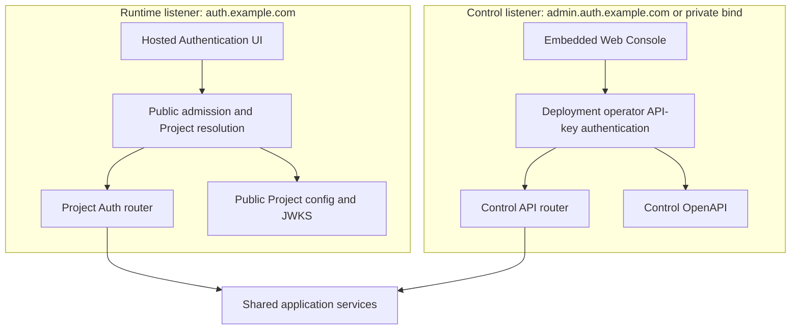
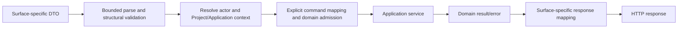

# 05 — Runtime and Control HTTP contracts

## Contract authority

Reviewed Rust definitions in `crates/owlauth-types` are the source of stable HTTP wire vocabulary and OpenAPI descriptions. Domain entities, PostgreSQL rows, provider payloads, secret references, and internal commands are not public DTOs.

The package separates contracts by surface:

- `runtime` contains Project Auth, session, current-user, and public key/configuration DTOs;
- `control` contains administrative DTOs and problem details;
- `health` contains minimal listener-specific health vocabulary.

Runtime and Control operations are never combined merely because one process serves both listeners. Generated OpenAPI is a derived view and cannot grant an operation exposure or authorization.

## Listener and router isolation



Listeners have distinct bind addresses, trusted-proxy settings, TLS policy, routers, middleware, authentication, CORS, rate limits, request bounds, connection budgets, metrics dimensions, and readiness. Routing by `Host` on one untrusted socket is not equivalent. Distinct Runtime and Control external origins are recommended to isolate the browser-held operator key from public Runtime script execution. An explicitly configured shared origin requires disjoint non-root base paths, Runtime cookie path containment, no service workers, restrictive opener policy, and deliberate acceptance of one browser/XSS trust boundary as defined by spec 09. Internal listener isolation remains unchanged.

In `--plane=all`, a request accepted by one listener cannot dispatch to the other plane's router through path, host, forwarding header, content type, or method manipulation.

## Management Console surface

The Control listener serves the embedded administrative Console at the configured Control-base-relative `console/` path. The credential-free shell accepts the operator's deployment API key and then calls the same Control-base-relative `v1/*` contract with a Bearer header. It has no direct application-service, repository, database, or secret-provider path.

Console HTML/assets and client-side routes are server-owned implementation surfaces, not OpenAPI operations. Stable API DTOs remain in `owlauth-types`. Runtime never serves the Console or receives its deployment key.

## Hosted Authentication UI surface

The Runtime listener serves Project/Application-bound hosted authentication interactions and their fingerprinted assets under the configured Runtime base. The UI presents only the transaction's admitted provider/email methods, submits one explicit method-selection command, shows progress or bounded local errors, may reuse a valid Project browser session, and completes an Application return. It resolves all authority from stored login-transaction and public Project/Application state; caller input or an optional start hint cannot select/enable a method or replace Project, Application, provider assignment, callback, exact redirect, browser binding, or PKCE.

After successful authentication, navigation returns only to the exact registered Application redirect captured by the transaction and carries only the short-lived one-use handoff allowed by spec 03. Hosted UI assets and pages never expose the Control endpoint/key or mount Control routes.

The complete two-surface route partition, distinct/shared external URL models, key/browser storage behavior, CSP, caching, redirect safety, and packaging requirements are owned by [spec 09](09-hosted-web-surfaces-and-control-auth.md).

## Runtime Project Auth surface

A representative stable path model is:

| Route | Purpose | Caller security |
| --- | --- | --- |
| `GET /v1/projects/{project_id}/auth/config` | bounded public configuration for one Application | active Project/Application public identifiers; no secrets |
| `POST /v1/projects/{project_id}/auth/login/start` | create one generic hosted login transaction with an allowed-method snapshot | exact Application, redirect, PKCE, origin/interaction controls; optional method hint is presentation-only |
| `POST /v1/projects/{project_id}/auth/interactions/{interaction}/method` | compare-and-swap selection of one admitted current provider or email method | opaque interaction, browser binding, same-origin CSRF, expected transaction revision; no method switching |
| `POST /v1/projects/{project_id}/auth/interactions/{interaction}/session/reuse` | explicitly confirm an eligible current Project browser session and issue the ordinary handoff | hardened cookie, same-origin CSRF, browser binding, expected transaction revision, current Project/user/session/auth-age/reuse-policy checks; page cannot name user/session |
| `GET /v1/projects/{project_id}/auth/providers/{provider}/callback` | receive exact upstream callback after stored provider selection | server-owned state and Project/provider binding |
| `POST /v1/projects/{project_id}/auth/interactions/{interaction}/email/challenges` | accept email after stored email selection, then create an enumeration-safe newest challenge and pinned durable mail job | assigned email method, browser/CSRF/revision binding, email/IP rate policy and server safety floors |
| `POST /v1/projects/{project_id}/auth/interactions/{interaction}/email/otp/verify` | consume newest OTP challenge | opaque interaction, proof attempt/expiry/generation and transaction binding |
| `POST /v1/projects/{project_id}/auth/interactions/{interaction}/email/link/verify` | consume a fragment-staged magic-link proof after explicit user confirmation | same-origin CSRF protection, digest-bound token, exact stored transaction and safe local error/redirect policy |
| `POST /v1/projects/{project_id}/auth/handoff/exchange` | exchange one-use ticket for revisioned user/session credentials | Application binding and PKCE verifier |
| `POST /v1/projects/{project_id}/auth/sessions/refresh` | rotate refresh family | Project/Application-bound opaque refresh token |
| `GET /v1/projects/{project_id}/auth/users/me` | return bounded current Project user | valid Project access token |
| `POST /v1/projects/{project_id}/auth/sessions/logout` | revoke Application and/or Project browser session | current session plus CSRF/interaction policy |
| `GET /projects/{project_id}/.well-known/jwks.json` | publish Project verification keys | public, cacheable, revisioned |
| Runtime health route | deployment probe | no Project/topology/secret disclosure |

These paths define the wire-level resource model. Every Runtime operation is Project-qualified, provider/email proof callbacks and Application redirects remain separate URL classes, and no downstream general-purpose OAuth surface exists. Generic start never performs a provider redirect or sends email. Method selection is an explicit one-way transaction transition; provider and email methods then converge on the same handoff/session contract. Handoff, refresh, and current-user responses share the generated versioned projection with monotonic `user_revision` and Application-specific `projection_revision` owned by spec 11; Runtime exposes no list-all-users/change-feed route.

### Public auth configuration

Public configuration may include:

- Project public ID and display/branding fields;
- Application public ID/type;
- publishable application key metadata;
- enabled provider display keys;
- safe Runtime URLs and SDK feature flags;
- allowed authentication methods that contain no secret; the server still snapshots and revalidates assignment when starting/selecting a method.

It never includes provider client secrets, provider access tokens, the Control endpoint or operator API key, `belongs_to`, user counts, internal IDs, KMS references, Redis/PostgreSQL topology, or policy internals. Runtime authentication middleware does not recognize `OWLAUTH_CONTROL_API_KEY`; presenting that value to any Runtime route never grants access.

### Runtime parsing and errors

Runtime rejects:

- duplicate singleton parameters;
- ambiguous encoding or conflicting credentials;
- cross-Project object combinations;
- unsupported media types/methods;
- unbounded arrays, objects, forms, headers, and URLs;
- redirects/origins not exactly registered for the selected Application.

Errors use a stable OwlAuth Project Auth shape containing a machine code, safe message, and optional correlation ID. Provider errors are normalized. Responses do not reveal whether another Project, Application, user, identity, ticket, session, or refresh token exists.

Provider callback failures redirect only to the Application URI already validated and stored in the login transaction; otherwise Runtime renders a local safe error.

### CORS and browser exposure

CORS is deny-by-default and Application-specific. Runtime compares the exact request origin with active Application origins where an endpoint is browser-callable. Redirect navigation is not treated as CORS authorization. Native Applications use registered redirect types and do not gain permissive browser origins.

Publishable keys and public IDs can identify rate/quotas but do not authorize user data. Current-user and refresh responses require actual session credentials.

## Control surface

Control resources are rooted at `/v1/` and Project-owned operations always carry Project identity in the path:

| Resource family | Representative operations |
| --- | --- |
| `/projects` | create/read/update/disable; read/write/filter exact `belongs_to` |
| `/projects/{project}/applications` | register/disable app; origins, redirects, publishable keys |
| `/projects/{project}/providers` | configure/disable provider client registrations, assign Applications, rotate secret reference and managed-sync policy |
| `/projects/{project}/users` | query/disable/merge users; inspect revision/source provenance; explicitly link/unlink identities; inspect/sync/reauthorize/revoke/disconnect managed connections |
| `/projects/{project}/email-auth` | configure assigned OTP/magic-link policy, sign-up/linking bounds, Project SMTP generations, and explicit deployment-default opt-in; test, activate, disable/mark-compromised, and inspect safe Project delivery eligibility |
| `/system/smtp-default-generations` | reconcile the process-configured deployment-default generation/fingerprint and activate/disable/mark-compromised its deployment-scoped eligibility metadata | deployment operator only; no secret input/read-back and no Project fallback authority |
| `/projects/{project}/applications/{application}/webhooks` | configure exact endpoints/event filters, rotate write-only secret, inspect safe health/deliveries, and replay immutable events |
| `/projects/{project}/sessions` | list and revoke Project/Application sessions |
| `/projects/{project}/policy` | claims, token lifetime, login/session policy |
| `/projects/{project}/signing-keys` | inspect/provision/publish/activate/retire/revoke |
| `/audit-events` and Project audit subresource | filtered immutable queries |
| `/system` | validate the operator key and return bounded Console/client capabilities |
| Control health | safe probe response under the configured probe policy |

The webhook resource returns only safe endpoint/secret-version/delivery metadata. Secret input is write-only, and replay names an existing immutable event plus its existing endpoint; Control has no arbitrary event-send route. Webhook payload/signature headers are an Application integration contract but endpoint configuration/replay remain Control operations. The exact `v1` HMAC grammar and duplicate/out-of-order receiver fixtures are generated and versioned with public contracts.

Every business route requires the valid deployment operator API key, which grants the whole Control surface. There are no principal, permission, Control-credential-management, or session-escalation routes. Project provider/SMTP/webhook secret-setting is resource configuration, not creation of another Control credential. Command/domain validation remains deny-by-default: a generic PATCH cannot bypass lifecycle transitions. Mutations include target revision and use deployment-operator-scoped Control idempotency where retry could duplicate a resource or external side effect. Every external-gateway mutation also supplies the observed Project `metadata_revision`, compared in the same PostgreSQL transaction as the child command.

### Control authentication

Control accepts exactly one HTTP authentication form:

```http
Authorization: Bearer <operator-api-key>
```

The expected canonical ASCII value is loaded from the required `OWLAUTH_CONTROL_API_KEY` environment variable whenever the `control` or `all` plane is composed. Its `owl_ctrl_v1_` grammar and 256-bit random payload are owned by spec 06. After strict Bearer and structural parsing, the server compares the complete presented key with the configured bytes using a constant-time comparison. Missing, malformed, duplicate, or mismatched authorization fails before route handling. The key remains in protected process configuration only and is never written to PostgreSQL or Redis.

A valid key represents the deployment operator and grants the entire deployment's Control authority. OwlAuth has no server-side operator principals, permissions, credential endpoints, browser Control sessions, or secondary authentication transitions. Network placement and optional transport TLS/mTLS hardening do not create alternate application credentials.

The following are never Control credentials:

- Project/Application public IDs or publishable keys;
- Project access/refresh tokens;
- upstream provider client IDs/secrets/tokens;
- network location, client-certificate identity, forwarding headers, or knowledge of internal IDs alone.

The operator API key appears only in the Authorization header, never URLs, bodies, query parameters, or output. Runtime categorically rejects it as an authentication credential. The built-in Console keeps it only in active page memory and sends it to same-origin Control routes as specified by spec 09; no credential cookie or server-side Console session is created.

### `belongs_to` contract

`belongs_to` is nullable, bounded opaque text on Project only.

- The deployment operator can set it during Project creation/update and read or filter by exact value.
- Ordinary Project list/search has no implicit ownership filter.
- An explicit `belongs_to` filter uses the PostgreSQL index and exact comparison; partial/regex search is not supported.
- Multiple Projects may share one value; the field is not unique.
- Child resources never duplicate the field and inherit only structural Project ownership through `project_id`.
- The field is absent from Runtime, tokens, SDK public configuration, metrics labels, and end-user audit views.

This contract supports external indexing but does not promise tenant isolation. External gateway responsibilities are owned by spec 07.

### Control errors

Control uses stable problem details containing safe code/type, status, correlation ID, optional bounded field violations, and revision/conflict metadata. Authentication and hidden-resource failures avoid Project enumeration.

PostgreSQL, Redis, KMS, secret-store, and provider errors map to dependency classes without vendor detail. An authentication denial does not disclose the protected resource or its `belongs_to` value.

## Contract mapping



DTO validation handles wire shape. Domain validation enforces current Project ownership and state. Every operation defines owning plane, authentication, Project resolution, input bounds, idempotency/concurrency, side effects, sensitive fields, errors, and caching.

## SDK, CLI, and MCP separation

Default SDK generation consumes Runtime Project Auth only. Control uses a distinct client module/feature or CLI-owned typed transport generated solely from the Control contract. Health/internal diagnostics and MCP schemas do not enter either client automatically.

MCP tools are hand-designed Control capabilities over application commands, not generated generic forwarding. No client can access server-internal rows or provider payloads.

## Compatibility semantics

A wire change is incompatible when it removes/renames an operation or field, adds required input, narrows accepted values, changes Project/Application resolution, authentication, side effects, idempotency, or stable error meaning. Additive fields/enums require an explicit unknown-value policy.

Runtime Project Auth and Control administrative compatibility are evaluated independently. Internal module, PostgreSQL, Redis, and provider representations have no direct wire compatibility because every crossing uses explicit mapping.
