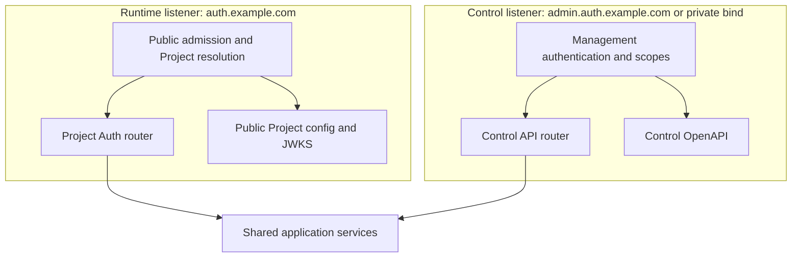
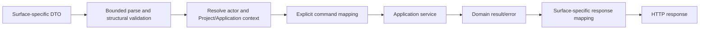

# 05 — Runtime and Control HTTP contracts

## Contract authority

Reviewed Rust definitions in `crates/owlauth-types` are the source of stable HTTP wire vocabulary and OpenAPI descriptions. Domain entities, PostgreSQL rows, provider payloads, secret references, and internal commands are not public DTOs.

The package separates contracts by surface:

- `runtime` contains Project Auth, session, current-user, and public key/configuration DTOs;
- `control` contains administrative DTOs and problem details;
- `health` contains minimal listener-specific health vocabulary.

Runtime and Control operations are never combined merely because one process serves both listeners. Generated OpenAPI is a derived view and cannot grant an operation exposure or authorization.

## Listener and router isolation

Listeners have distinct bind addresses, trusted-proxy settings, TLS policy, routers, middleware, authentication, CORS, rate limits, request bounds, connection budgets, metrics dimensions, and readiness. Routing by `Host` on one untrusted socket is not equivalent.

In `--plane=all`, a request accepted by one listener cannot dispatch to the other plane's router through path, host, forwarding header, content type, or method manipulation.

## Runtime Project Auth surface

A representative stable path model is:

| Route | Purpose | Caller security |
| --- | --- | --- |
| `GET /v1/projects/{project_id}/auth/config` | bounded public configuration for one Application | active Project/Application public identifiers; no secrets |
| `POST /v1/projects/{project_id}/auth/login/{provider}/start` | create login transaction and provider redirect | exact Application, redirect, PKCE, origin/interaction controls |
| `GET /v1/projects/{project_id}/auth/providers/{provider}/callback` | receive exact upstream callback | server-owned state and Project/provider binding |
| `POST /v1/projects/{project_id}/auth/handoff/exchange` | exchange one-use ticket for user/session credentials | Application binding and PKCE verifier |
| `POST /v1/projects/{project_id}/auth/sessions/refresh` | rotate refresh family | Project/Application-bound opaque refresh token |
| `GET /v1/projects/{project_id}/auth/users/me` | return bounded current Project user | valid Project access token |
| `POST /v1/projects/{project_id}/auth/sessions/logout` | revoke Application and/or Project browser session | current session plus CSRF/interaction policy |
| `GET /projects/{project_id}/.well-known/jwks.json` | publish Project verification keys | public, cacheable, revisioned |
| Runtime health route | deployment probe | no Project/topology/secret disclosure |

These paths define the wire-level resource model. Every Runtime operation is Project-qualified, provider callback and Application redirect classes remain separate, and no downstream general-purpose OAuth surface exists.

### Public auth configuration

Public configuration may include:

- Project public ID and display/branding fields;
- Application public ID/type;
- publishable application key metadata;
- enabled provider display keys;
- safe Runtime URLs and SDK feature flags;
- allowed authentication methods that contain no secret.

It never includes provider client secrets, provider access tokens, management endpoints/credentials/scopes, `belongs_to`, user counts, internal IDs, KMS references, Redis/PostgreSQL topology, or policy internals.

### Runtime parsing and errors

Runtime rejects:

- duplicate singleton parameters;
- ambiguous encoding or conflicting credentials;
- cross-Project object combinations;
- unsupported media types/methods;
- unbounded arrays, objects, forms, headers, and URLs;
- redirects/origins not exactly registered for the selected Application.

Errors use a stable OwlAuth Project Auth shape containing a machine code, safe message, and optional correlation ID. Provider errors are normalized. Responses do not reveal whether another Project, Application, user, identity, ticket, session, or refresh token exists.

Provider callback failures redirect only to the Application URI already validated and stored in the login transaction; otherwise Runtime renders a local safe error.

### CORS and browser exposure

CORS is deny-by-default and Application-specific. Runtime compares the exact request origin with active Application origins where an endpoint is browser-callable. Redirect navigation is not treated as CORS authorization. Native Applications use registered redirect types and do not gain permissive browser origins.

Publishable keys and public IDs can identify rate/quotas but do not authorize user data. Current-user and refresh responses require actual session credentials.

## Control surface

Control resources are rooted at `/v1/` and Project-owned operations always carry Project identity in the path:

| Resource family | Representative operations | Scope family |
| --- | --- | --- |
| `/projects` | create/read/update/disable; read/write `belongs_to` | `projects:*`, `projects.belongs_to:*` |
| `/projects/{project}/applications` | register/disable app; origins, redirects, publishable keys | `applications:*`, `applications.keys:*` |
| `/projects/{project}/providers` | configure/disable provider client registrations, assign Applications, rotate secret reference | `providers:*`, `providers.secrets:*` |
| `/projects/{project}/users` | query/disable/merge users; view/unlink identities | `users:*`, `users.identities:*` |
| `/projects/{project}/sessions` | list and revoke Project/Application sessions | `sessions:*` |
| `/projects/{project}/policy` | claims, token lifetime, login/session policy | `policies:*` |
| `/projects/{project}/signing-keys` | inspect/provision/publish/activate/retire/revoke | `keys:*` |
| `/audit-events` and Project audit subresource | filtered immutable queries | `audit:read` |
| `/management-principals` and `/credentials` | provision/revoke Control access | `management:*` |
| `/system` and Control health | safe deployment metadata | `system:read` or probe policy |

Route authorization is deny-by-default and command-specific. A generic PATCH cannot bypass lifecycle transitions. Mutations include target revision and use Control idempotency where retry could duplicate a resource or external side effect. Every external-gateway mutation also supplies the observed Project `metadata_revision`, compared in the same PostgreSQL transaction as the child command.

### Control authentication

Accepted credential classes are explicit deployment policy, such as mTLS identities, short-lived operator sessions for the Control audience, or scoped service credentials. Every credential maps to a current `ManagementPrincipal` and scopes in PostgreSQL.

The following are never Control credentials:

- Project/Application public IDs or publishable keys;
- Project access/refresh tokens;
- upstream provider client IDs/secrets/tokens;
- network location, forwarding headers, or knowledge of internal IDs alone.

Browser-based Control sessions use CSRF and step-up/fresh-authentication policy for high-impact commands. Service credentials appear only in authenticated transport/headers, never URLs.

### `belongs_to` contract

`belongs_to` is nullable, bounded opaque text on Project only.

- Project creation/update can set it only with `projects.belongs_to:write`.
- Reading it or explicitly filtering by exact value requires `projects.belongs_to:read`.
- Without that read scope, Project representations omit the field rather than returning null/redacted hints.
- Ordinary Project list/search has no implicit ownership filter and does not include the field.
- An explicit `belongs_to` filter uses the PostgreSQL index and exact comparison; partial/regex search is not supported.
- Multiple Projects may share one value; the field is not unique.
- Child resources never duplicate the field and inherit only structural Project ownership through `project_id`.
- The field is absent from Runtime, tokens, SDK public configuration, metrics labels, and end-user audit views.

This contract supports external indexing but does not promise tenant isolation. External gateway responsibilities are owned by spec 07.

### Control errors

Control uses stable problem details containing safe code/type, status, correlation ID, optional bounded field violations, and authorized revision/conflict metadata. Authentication, authorization, and hidden-resource failures avoid Project/principal enumeration.

PostgreSQL, Redis, KMS, secret-store, and provider errors map to dependency classes without vendor detail. A scope denial does not disclose the protected resource or its `belongs_to` value.

## Contract mapping

DTO validation handles wire shape. Domain validation enforces current Project ownership and state. Every operation defines owning plane, authentication, scope, Project resolution, input bounds, idempotency/concurrency, side effects, sensitive fields, errors, and caching.

## SDK, CLI, and MCP separation

Default SDK generation consumes Runtime Project Auth only. Control uses a distinct client module/feature or CLI-owned typed transport generated solely from the Control contract. Health/internal diagnostics and MCP schemas do not enter either client automatically.

MCP tools are hand-designed Control capabilities over application commands, not generated generic forwarding. No client can access server-internal rows or provider payloads.

## Compatibility semantics

A wire change is incompatible when it removes/renames an operation or field, adds required input, narrows accepted values, changes Project/Application resolution, authentication, side effects, idempotency, or stable error meaning. Additive fields/enums require an explicit unknown-value policy.

Runtime Project Auth and Control administrative compatibility are evaluated independently. Internal module, PostgreSQL, Redis, and provider representations have no direct wire compatibility because every crossing uses explicit mapping.
