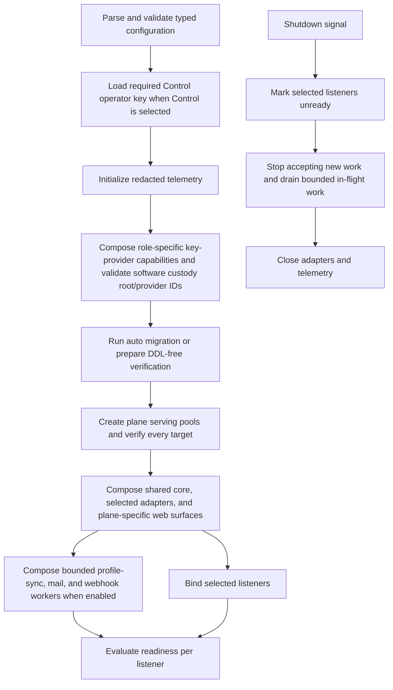
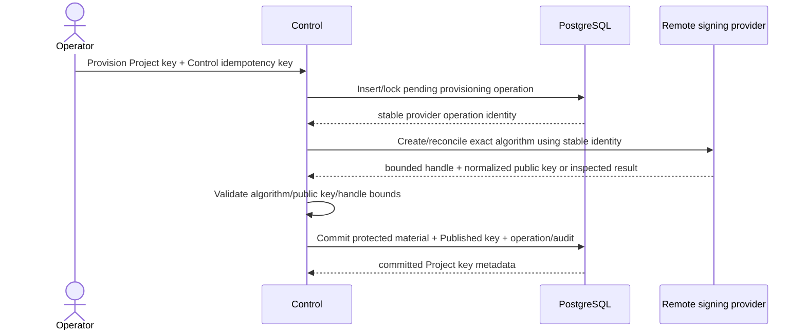
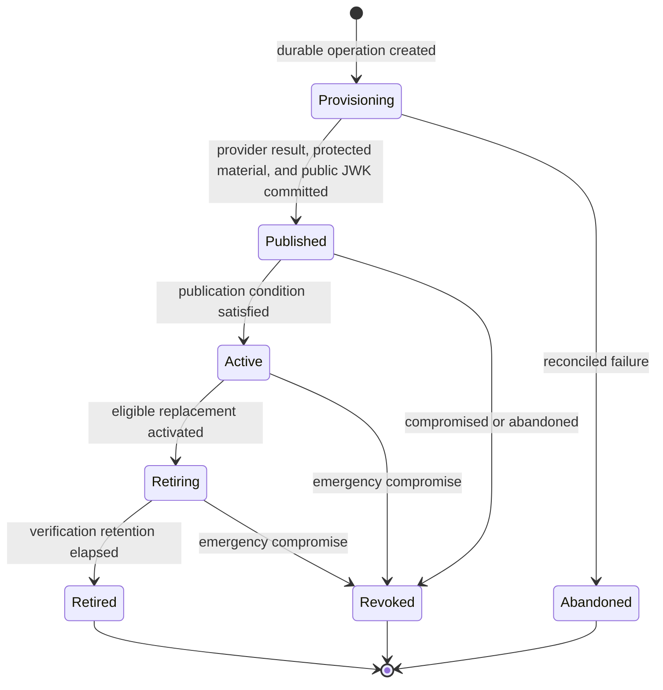
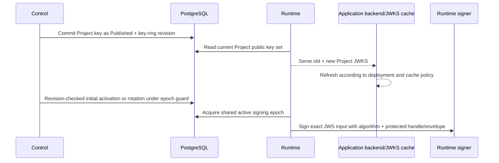

# 06 — Process composition, Project keys, and operational security

## Composition modes

One `owlauth-server` artifact supports:

| Mode      | Auth listener | Runtime surface | Server API surface | Control listener | PostgreSQL schema |
| --------- | ------------- | --------------- | ------------------ | ---------------- | ----------------- |
| `all`     | enabled       | enabled         | enabled            | enabled          | shared            |
| `auth`    | enabled       | enabled         | enabled            | absent           | shared            |
| `control` | absent        | absent          | absent             | enabled          | shared            |

Mode changes adapter composition, exposure, dependency readiness, and database role; it does not change Project/domain semantics.

Auth-capable processes (`auth` and `all`) always compose both Runtime and Server API surfaces. They also compose the provider-profile, mail, and Application-webhook worker executors because these workers support Runtime identity/Application behavior and must not depend on Control availability. `control` alone can configure resources and enqueue mutation-derived events but does not execute these outbound jobs; without an Auth process they remain durably pending and the corresponding capability reports unavailable/degraded. Multiple Auth processes may execute workers concurrently through PostgreSQL claims/leases and guarded commits; no singleton worker or external lock service is correctness authority.

## Process lifecycle



No business route reports ready before schema compatibility and plane-critical dependencies. Migration credentials are absent from serving pools and released before listeners bind. Shutdown has a fixed drain bound and preserves transaction semantics.

## Explicit retention maintenance

The server artifact exposes `owlauth-server maintenance prune [--batch-size <1..=10000>]` for an operator-owned scheduled job. It is not a listener mode and starts no HTTP surface or Runtime worker. It reads only `OWLAUTH_POSTGRES_URL` and, before any DML, verifies the exact released SQLx migration count, versions, success state, and checksums. The role requires read access to migration history plus the relevant maintenance DML privileges. Every cutoff uses PostgreSQL transaction time, and the command emits one JSON report. `batch-size` defaults to 1,000 and bounds each cleanup class independently.

Each cleanup class uses a short independent transaction, bounded lock/statement deadlines, expiry ordering, and `FOR UPDATE SKIP LOCKED`. Repeated or concurrent invocations are safe; an external CronJob, systemd timer, or equivalent invokes the command until operational metrics show no due backlog. The fixed v1 row-retention grace is 24 hours after the owning interaction/session deadline or terminal SMTP-test completion. Webhook event/delivery deletion continues to use each event's PostgreSQL-authored 30-day `retain_until` rather than this grace.

The command may delete only expired login aggregates and their cascading children, expired browser-logout interactions, individually bounded expired refresh generations followed by empty expired Application/refresh aggregates, unreferenced expired Project browser session aggregates, terminal SMTP-test operations whose recipient material is already erased, and already-retention-eligible webhook attempts/deliveries/events. SMTP-test idempotent replay, digest-conflict detection, and unknown-outcome reconciliation are supported until 24 hours after terminal completion; after that retained operation is deleted, the caller must use a fresh key and a later test is a new delivery side effect. The command never deletes or weakens append-only audit/key history, identity-mutation or managed-reauthorization create-result authority, Control/durable-resource idempotency tombstones, merge tombstones, or current durable resource/material authority.

## Typed configuration

Configuration has one precedence model, rejects unknown fields, and separates global, Auth transport, Runtime surface, Server API surface, Control, PostgreSQL serving/migration, key-provider/software-custody, data-protection, and telemetry sections.

### Global fields

- immutable deployment external Auth and Control base URLs; a shared external origin uses two disjoint non-root prefixes, while Runtime and Server API share the Auth base and Control remains a separate listener;
- Project issuer derivation rule;
- immutable environment/instance namespace and its stable non-secret public instance ID used by the well-known CLI descriptor;
- selected plane mode;
- the fixed protocol lifetime and clock-skew safety bounds below, plus non-overridable email-auth safety floors/ceilings from spec 11; only access-token lifetime and browser-session reuse age are Project-configurable, within their stated ranges and owning revisions;
- trusted key-provider composition and credentials plus distinct retained key sets for short-term transaction/mail state, long-term email PII, and v1 PostgreSQL managed-credential AEAD; the bundled signing/configuration-secret provider instead receives one static deployment software custody root as defined below;
- optional deployment-default SMTP adapter selection with explicit PostgreSQL-backed generation and protected credential material, unavailable to a Project unless that Project explicitly opts in; process configuration contains transport selection/policy but not the SMTP credential or an alternate secret handle;
- outbound provider/SMTP/webhook DNS, proxy, TLS, private-network allowlist, destination, and concurrency policy.

The public instance ID is stable across ordinary upgrade, process replacement, and backup/restore. Deliberate replacement is an administrative service-identity change that causes pinned CLI profiles to fail before key release until the operator explicitly accepts/rebinds the new identity.

Project/provider/Application/email/webhook policy is authoritative PostgreSQL state, not replicated process configuration. Deployment defaults and egress policy constrain Project choices but never imply cross-Project configuration fallback. PostgreSQL stores deployment-default SMTP generation/status/revision, protected credential-material ID/envelope, and a safe configuration fingerprint. Startup/readiness validates the exact generation/material/provider capability; plaintext secret bytes remain unavailable to configuration, health, DTOs, and logs.

The v1 Project Auth protocol bounds are exact implementation and readiness inputs:

| Value                                                    | v1 bound                                                    | Authority and effect                                                                        |
| -------------------------------------------------------- | ----------------------------------------------------------- | ------------------------------------------------------------------------------------------- |
| login transaction                                        | fixed 10 minutes                                            | captured at start; no later configuration change extends it                                 |
| one-use handoff                                          | fixed maximum 60 seconds                                    | `min(issued_at + 60 seconds, login transaction expiry)`; captured when issued               |
| Project browser session idle / absolute lifetime         | fixed 8 hours / 24 hours                                    | authoritative activity and `session_revision`; activity never extends the absolute deadline |
| browser-session reuse maximum authentication age         | Project-configurable 0–24 hours, default 8 hours            | `session_revision`; revalidated at confirmation                                             |
| Application session and refresh-family absolute lifetime | fixed 30 days                                               | Project, Application, user, and session revisions revalidated on refresh                    |
| Project access token                                     | Project-configurable 60–3,600 seconds                       | `claims_revision`; exact lifetime captured for each issuance                                |
| allowed clock skew                                       | fixed deployment safety bound, default 60 seconds           | applied consistently to OwlAuth and upstream-provider token/time checks                     |
| Project browser-logout preparation                       | fixed 60 seconds                                            | one-use and bound to the initiating Application and Project browser sessions                |
| consumed-credential replay evidence                      | at least the owning family/session lifetime plus clock skew | configuration and cleanup cannot shorten this floor                                         |

Fixed bounds are not Project policy and cannot be lengthened or shortened per Project. Policy changes use the owning revision checks rather than synchronously rewriting unbounded pending/session rows. Runtime startup and readiness reject unsupported bounds, replay retention below the safety floor, or an active/retained digest or data-protection key set that cannot cover every unexpired value plus allowed skew.

### Auth listener and internal surface fields

- one bind address, external Auth base URL, TLS/trusted-proxy mode, connection budget, request-shape bounds, deadlines, health endpoint, and instance-local readiness endpoint;
- Runtime-only cookie security, Project namespace behavior, public configuration, hosted authentication UI, JWKS cache bounds, and exact browser CORS enforcement;
- Server API-only JSON response policy with no browser CORS/cookies/HTML/redirects and Project server-key authentication;
- separate Runtime and Server API routers, state, authorization middleware, metrics, PostgreSQL serving pools, pool bounds, and readiness inputs despite the shared transport;
- dedicated active/retained `OWLAUTH_SERVER_KEY_DIGEST_KEY` ring available as generation/digest capability only in Control and candidate-verification capability only in the Server API surface;
- process-local active/retained key-ring inventory; deployment coordination, rollout ordering, and fleet convergence are operator responsibilities rather than Auth/Control protocol state.

### Control listener fields

- distinct internal bind address and configured external Control base URL;
- TLS and optional mTLS transport roots as hardening, not alternate Control identity;
- the single operator API key from `OWLAUTH_CONTROL_API_KEY`;
- strict request-shape, connection, deadline, and concurrency budgets;
- deny-by-default CORS, private-network assumptions, and Management Console security-header policy;
- explicit remote HTTP MCP enablement, canonical path under the Control base, protocol/message/session/stream/concurrency bounds, and external MCP URL published by the well-known descriptor.

`OWLAUTH_CONTROL_API_KEY` is required when mode is `control` or `all`; startup fails before binding Control, Console business routes, or an enabled HTTP MCP endpoint if it is absent or does not match the canonical format below. Mode `auth` does not require or load it. No configuration field defines additional keys, operator identities, permissions, or Control sessions. Any built-in Control UI invokes the same Control API using the same Bearer key and creates no server-side login/session model.

### Infrastructure fields

- one PostgreSQL serving server/database target, with optional Runtime/Server/Control login credential references, independent pool bounds, DDL-free roles, bounded connect/acquire waits, and one validated 10-60000 ms database-enforced `lock_timeout` applied and verified on every Runtime, Server API, and Control physical connection;
- `MIGRATION_MODE`, defaulting to `auto` and accepting only `auto` or `verify`, with semantics owned by spec 04;
- optional separate PostgreSQL migration login credential and non-login owner role used only by `auto` against the one configured serving server/database target, plus independent validated 10-300000 ms migration lock wait, 100-3600000 ms per-statement deadline, and 1000-86400000 ms whole-run guard that is strictly greater than both migration timeouts; migration configuration cannot override that target;
- key-provider selection/composition, provider identifiers and credentials, Project key namespace, exact allowed signing algorithms, opaque-value bounds, and the capabilities required by the selected process mode;
- active and retained key-ring versions distributed consistently to every process that needs the corresponding narrow capability; OwlAuth validates only the process-local inventory and does not configure a replica roster, publish per-replica observations, or gate local readiness on fleet convergence;
- generic Runtime data-protection/digest active and retained versions loaded only by Runtime-capable processes;
- a dedicated versioned identity-mutation evidence digest/protection ring required in every Auth, Control, or combined serving mode, with every active and retained root distinct from all other authorities; composition exposes only the Runtime producer/receipt or Control verifier/decrypt facade and never loads generic Runtime roots in Control;
- a separate active/retained managed-reauthorization target ring whose narrow issuer capability is loaded by Control and verifier capability by Runtime, and whose keys are distinct from every generic Runtime, Server-key digest, and managed-credential root;
- a dedicated active/retained Project server-key digest ring whose narrow generator/digester is loaded by Control and candidate verifier by the Server API surface; it is distinct from Runtime, email, identity-mutation, managed-reauthorization, managed-credential, projection, and custody roots;
- the dedicated AEAD-only `OWLAUTH_PROJECTION_EMAIL_*` active/retained ring, distinct from generic Runtime, durable email-identity, managed credential/reauthorization, and signing roots; it has no digest key because the public canonical projection digest is unkeyed SHA-256. Control receives only exact-context encrypt/decrypt through the transaction projection materializer, while Runtime receives exact-context projection read/write. New ciphertext uses the configured active version and existing ciphertext is opened by its persisted version; fleet distribution, backfill, cutover, verification, rollback, and old-version retirement are external operations;
- when configured in Control, the durable email-identity ring is reachable through exactly two separate narrow capabilities: a decrypt-only reader for an authoritative `(project_id, email_identity_id, protected value)` with fixed `EmailIdentityAddress` purpose/context, and an exact-canonical-email lookup digester that returns only the bounded accepted versioned digest candidates needed to resolve an authoritative alias. The reader returns zeroized bounded canonical email and exposes no digest or encrypt API; the digester exposes no alias read, raw key, encrypt/decrypt, arbitrary context, or generic protection API;
- Project-owned provider egress policies and the configured key-provider secret-sealer/opener capabilities; the former replace a deployment-wide custom OIDC origin list and default to any canonical HTTPS origin, including operator-managed private-network destinations, while the recommended revisioned exact-origin mode narrows one Project independently; fixed Google/GitHub origins remain server-owned, and the process retains only the development capability flag for IP-literal loopback HTTP;
- for the bundled software provider, one exact 32-byte `OWLAUTH_SOFTWARE_CUSTODY_KEY` supplied by the deployment secret-injection mechanism and shared by every replica that must provision/sign/seal/open; there are no signer/configuration-secret store directories, wrapping-key files, writable shared volumes, or per-plane roots;
- production SMTP modes restricted to implicit TLS or mandatory STARTTLS with hostname/certificate validation and no downgrade; explicit plaintext development mode accepts loopback only and is never the default.

Project server-key digest rollout is verifier-first and externally coordinated. Operators first distribute the new version as retained to every Auth process, then configure it as active for Control creation while keeping both versions readable. PostgreSQL persists the digest version on every key, so Server verification selects that exact local version rather than trying arbitrary fallbacks. Before retiring a version, operators verify that no active key references it, revoke and reissue any remaining keys under the replacement, preserve rollback material until the cutover is proven, and update every process consistently. A missing referenced version fails the affected Server-key verification and local readiness closed. A compromised version is not rehashed or recovered from stored digests.

Issuer, callback, redirect, and external-authority decisions never derive from arbitrary `Host`, `Forwarded`, or `X-Forwarded-*`. This release exposes no trusted-forwarding mode.

Deployment roots and custom-provider credentials enter through protected environment/file descriptors, mounted deployment-secret files, or secret managers. The bundled custody root enters through `OWLAUTH_SOFTWARE_CUSTODY_KEY`; the Control operator key enters separately through `OWLAUTH_CONTROL_API_KEY`. Provider/SMTP/webhook plaintext is accepted only as bounded write-only Control input and immediately sealed; it is not process configuration. Secrets are not ordinary command-line values, serialized config output, public config, health, panic text, telemetry, or OpenAPI examples.

## Operator API-key lifecycle

The canonical operator key is ASCII text in this exact form:

```text
owl_ctrl_v1_<secret>
```

`<secret>` is the 43-character unpadded base64url encoding of exactly 32 cryptographically random bytes. The complete key is therefore 55 ASCII characters and permits only the literal prefix plus `[A-Za-z0-9_-]` in the secret. Whitespace, control characters, padding, alternate encodings, trimming, Unicode normalization, and values outside this exact length/grammar are rejected. The environment value and Bearer token are compared as the same canonical ASCII bytes; shared server/CLI/Console test vectors define parity.

The operator key is held only in immutable process configuration for the lifetime of each Control process. It is never persisted to PostgreSQL, returned by an endpoint, exposed in OpenAPI examples, or copied into audit/telemetry context. Control accepts only strict `Authorization: Bearer <operator-api-key>` authentication and uses constant-time comparison of the complete canonical value after bounded structural parsing. Runtime uses separate authentication middleware and never compares or accepts this key.

Rotation is an operational rollout, not an OwlAuth API operation:

1. generate and distribute a replacement through the deployment environment-secret mechanism as `OWLAUTH_CONTROL_API_KEY`;
2. restart or roll out every process that composes Control so it loads the replacement;
3. retire the previous environment secret according to deployment policy.

There is one configured value per process and no server-managed overlap set or credential endpoint. Control may be briefly unavailable during a coordinated rotation. In split-process topology, Auth remains available because it neither loads nor depends on the operator key. In a redundant `all` deployment, a healthy rolling replacement MAY preserve Auth capacity. Restarting a single-instance `all` process interrupts both listeners even though Auth credential semantics do not change; uninterrupted Auth during Control-key rotation is not promised for that topology.

## Network and resource posture

Auth and Control bind plain-HTTP IP sockets and require an operator-owned TLS terminator for every production external origin. Control SHOULD bind privately; network isolation supplements application authentication. Auth serves the Runtime Hosted Authentication UI and backend-only Server API; Control serves the Management Console. Distinct external origins are recommended. An explicitly configured shared origin uses disjoint non-root Auth/Control paths, contains Runtime cookies to the Auth base, registers no service workers, applies restrictive opener policy, and deliberately shares one browser/XSS boundary; Control retains a separate listener, while Runtime and Server API retain internal router, credential, response, and pool boundaries as defined by spec 09.

Each listener applies connection/header/body/URI bounds, correlation, in-flight concurrency controls, authentication where applicable, and safe response headers before expensive work. Server-key authentication, directory/email/projection reads, and introspection query PostgreSQL authority on every v1 request. OwlAuth Core has no deployment-wide traffic quota, IP/route rate limiter, bot/risk engine, or commercial quota system. A SaaS deployment or operator-owned ingress owns those controls and must not treat them as identity authority. Passwordless email separately enforces PostgreSQL-authoritative side-effect safety: recent successful enqueue for the same canonical recipient within one Project and a hard active-outbox bound may terminalize a new challenge without creating mail, while the public response remains the same generic accepted shape. This is not traffic admission, billing quota, or a generic `429` contract.

Ordinary HTTP budgets are independently configured for the `AUTH` and `CONTROL` listeners:

| Suffix                   | Auth default | Control default | Accepted range |
| ------------------------ | -----------: | --------------: | -------------: |
| `REQUEST_TIMEOUT_MS`     |        10000 |           10000 |       10–60000 |
| `MAX_REQUEST_BYTES`      |      1048576 |         1048576 |     1–16777216 |
| `MAX_IN_FLIGHT_REQUESTS` |          256 |              64 |         1–4096 |
| `MAX_CONNECTIONS`        |          512 |             128 |         1–8192 |
| `MAX_HEADER_COUNT`       |          128 |             128 |          1–512 |
| `MAX_HEADER_BYTES`       |        65536 |           65536 |       1–262144 |
| `MAX_URI_BYTES`          |         8192 |            8192 |        1–65536 |

Auth names are `OWLAUTH_AUTH_REQUEST_TIMEOUT_MS` through `OWLAUTH_AUTH_MAX_URI_BYTES`; Control uses the same suffixes with the `OWLAUTH_CONTROL_` prefix. Unknown `OWLAUTH_*` names fail startup. These listener budgets do not replace the separate `OWLAUTH_RUNTIME_DATABASE_MAX_CONNECTIONS`, `OWLAUTH_SERVER_DATABASE_MAX_CONNECTIONS`, and `OWLAUTH_CONTROL_DATABASE_MAX_CONNECTIONS` pool bounds or the Control MCP `OWLAUTH_CONTROL_MCP_*` limits.

`MAX_CONNECTIONS` is enforced by an accept-level per-listener semaphore held for the complete transport lifetime. Body, deadline, in-flight, and valid parsed request-shape limits are enforced independently before application authority work. The in-flight semaphore bounds active handler work by applying backpressure inside the same request deadline; it does not reject saturation as admission or emit a Core `429`. If either queue waiting or handler execution exhausts that shared deadline, Core returns the plane's declared `408 request_timeout` response. This response is a transport-budget outcome, not admission or proof that a dispatched mutation did not commit. Header-count/byte and URI-byte checks operate on the parsed request; an ingress proxy or other transport terminator must also enforce its own parser-level limits. OwlAuth does not trust `Forwarded`, `X-Forwarded-For`, or similar ambient headers, and this release exposes no server-owned trusted-forwarding mode.

General traffic governance belongs outside Core. A SaaS/ingress layer may use trusted network context to enforce IP, route, tenant, global, bot/risk, traffic-shaping, and commercial quotas. It owns any generic `429` and retry contract that it adds. These controls cannot authenticate a caller, prove Project ownership, change CORS authority, or replace PostgreSQL-backed proof and session semantics.

Runtime, Server API, and Control use separate PostgreSQL pools or quotas. Control list/audit work cannot exhaust capacity reserved for callback, handoff, and refresh transactions. Provider callbacks have a reviewed process-local budget of 16 concurrent outbound exchanges; capacity exhaustion fails before provider dispatch and never enters a waiting queue. Because callback state is claimed before the adapter can classify dispatch, this pre-dispatch load rejection terminally fails that login transaction under the same one-way callback state machine; the user starts a new login rather than retrying an already claimed callback. This budget is a local resource-safety boundary rather than a traffic quota. Provider, signer, and Project-specific expensive operations otherwise have independent bounds and circuit state.

CORS is deny-by-default and exact Application-origin based. Provider callbacks and browser redirects are navigation endpoints, not permissive cross-origin APIs.

Custom OIDC preflight, create-time revalidation, and Runtime dispatch all use the same bounded provider transport: no ambient proxy configuration, no redirects or content encoding, canonical origins only, normal TLS hostname/certificate validation outside the development-only IP-literal loopback exception, bounded connect/request deadlines and bodies, duplicate-key JSON rejection, exact discovery issuer equality, and validation of every authorization, token, JWKS, UserInfo, and revocation endpoint before use. In `allow_all` mode any such HTTPS origin is admitted. In `exact_origins` mode the issuer, discovery URL, and every discovered endpoint must match the Project's canonical origin set. OwlAuth does not add a separate DNS/IP classification or pinning layer; the self-hosting deployment operator owns whether unrestricted or private-network provider destinations are appropriate. IP-literal loopback HTTP requires the process development opt-in and, in exact mode, a matching Project origin.

The Project policy revision is PostgreSQL authority and is read at every preflight, create, public-configuration authorization, callback, proof, renewal, profile, revocation, and reauthorization boundary. Tightening policy takes effect without mutating provider rows; work prepared under an older revision is rejected before another outbound dispatch or guarded commit. The preflight budget is separate from callback exchange capacity so operator discovery cannot exhaust login callbacks. A successful preflight never changes policy, caches an allow decision for create, or authorizes later network use. Create re-fetches and validates before any durable or secret external effect; Runtime revalidates current discovery and origins at each dispatch. Metadata, endpoint-origin, or policy drift fails only that operation closed and never triggers fallback to another adapter or origin. Safe Control results may list normalized admitted origins, but never endpoint paths, raw metadata, headers, bodies, or vendor diagnostics.

Outbound webhook validation and every attempt resolve the complete CNAME chain and all A/AAAA answers under the deployment policy; one denied result denies the destination. The socket connects to a validated IP pinned for that attempt while TLS SNI, certificate verification, and HTTP `Host` retain the configured hostname. A deployment may add one bounded DER trust anchor for private-CA webhook destinations; this extends certificate trust only and cannot disable hostname verification, destination validation, redirect denial, or any other egress restriction. Redirects, rebinding, mixed public/private answers, IPv4-mapped IPv6 bypasses, link-local/metadata/cross-plane destinations, and proxies without equivalent enforceable destination policy are denied. SMTP uses the same destination-policy framework plus its stricter transport-mode rules. An outbox resolves only its pinned Project/default SMTP generation; config replacement cannot retarget queued mail.

## Key and secret ownership

| Component            | May access                                                                                                                                                                                                                                                                                     | Must not access                                                                                                                                                                                                              |
| -------------------- | ---------------------------------------------------------------------------------------------------------------------------------------------------------------------------------------------------------------------------------------------------------------------------------------------- | ---------------------------------------------------------------------------------------------------------------------------------------------------------------------------------------------------------------------------- |
| Control              | Project key metadata/public JWK, lifecycle command, signing-key provisioner, configuration-secret sealer, purpose-limited managed-reauthorization target issuer, identity-mutation evidence verifier/decrypt facade, exact-context durable-email reader, exact-canonical-email lookup digester | configuration-secret opener, Runtime signer, generic Runtime digest/protection roots, evidence producer/receipt authority, managed credentials, raw email/digest/key export, exportable private key, or secret bytes in DTOs |
| Runtime              | active Project signer material ID/envelope or handle, Project verification set, exact configuration-secret opener, Runtime signer, managed-reauthorization target verifier, identity-mutation evidence producer/receipt facade                                                                 | secret sealer, signing-key provisioner/destructor, evidence verifier/decrypt facade, arbitrary Project lifecycle mutation, Control operator key, or raw private key bytes                                                    |
| PostgreSQL           | public JWK, bounded protected signer handle/software ciphertext and provider/SMTP/webhook envelopes, provider/format/context/fingerprint metadata, Project/default SMTP eligibility, versioned managed-credential and long-term email-PII ciphertext, lifecycle state                          | plaintext private key, provider/SMTP/webhook secret, managed credential, email PII, software custody root, or custom-provider credential                                                                                     |
| Signing provider     | exact provision/inspect/destroy capability in Control or sign-only capability in Runtime, each over bounded opaque handles and explicit algorithms                                                                                                                                             | user/Application policy, routing, PostgreSQL lifecycle, or authority belonging to the other role                                                                                                                             |
| Secret provider      | seal-only capability in Control or exact-context open-only capability in Runtime/workers over bounded opaque envelopes                                                                                                                                                                         | enumeration, Project user/session/profile data, arbitrary context, or secret read-back DTOs                                                                                                                                  |
| Provider-sync worker | exact linked-identity renewable credential and bounded provider profile operation                                                                                                                                                                                                              | Application-selected provider scope/API, downstream token export, or unrelated identity                                                                                                                                      |
| Mail worker          | one leased encrypted Project mail job and selected Project/explicit-default SMTP handle                                                                                                                                                                                                        | identity/challenge authority, another Project sender, or secret read-back                                                                                                                                                    |
| Webhook worker       | one leased immutable Application event, exact endpoint, and active signing handle                                                                                                                                                                                                              | projection mutation, arbitrary payload/URL, provider token, or Control endpoint                                                                                                                                              |
| Data protector       | purpose-separated login/challenge/outbox, long-term email PII, and managed-credential AEAD key versions                                                                                                                                                                                        | token signing authority, protected configuration-secret custody, or Project policy                                                                                                                                           |

Key-provider authority is capability-separated. A custom remote provider uses distinct least-privilege Control provisioning and Runtime signing credentials where supported. The public SPI does not hand one object both roles. The bundled provider derives role/purpose subkeys from one software custody root and exposes only the capability object required by composition; this is API-level least authority, not compromise isolation after root disclosure.

### Bundled software custody root

`OWLAUTH_SOFTWARE_CUSTODY_KEY` is exactly the 43-character unpadded base64url encoding of 32 bytes; alternate alphabets, padding, whitespace, and non-canonical encodings are rejected. HKDF-SHA-256 with fixed versioned OwlAuth salt/labels derives independent signing-envelope, configuration-secret-envelope, and request-fingerprint subkeys. XChaCha20-Poly1305 uses a fresh CSPRNG 24-byte nonce for every envelope and authenticates the canonical length-delimited provider context. HMAC-SHA-256 produces the keyed request fingerprint over an independently labeled exact context plus bounded plaintext. The fingerprint is stable for identical input and independent of randomized ciphertext; it is safe for internal idempotency comparison but is never public or used as a material ID.

V1 supports exactly one static root and no online root rotation, overlap set, fallback root, or opportunistic rewrap. Operators MUST NOT replace the value in place. A rollout either keeps the exact root on every replica that needs a bundled capability or fails the affected capability closed; trying a previous/next root after authentication failure is forbidden. Backup and disaster recovery preserve the root separately from PostgreSQL and test restoration together. Loss of the root means bundled signer and configuration-secret envelopes cannot be recovered from the database, while compromise of the root requires incident response and rotation/reprovisioning of affected material rather than a configuration-only key swap. A future active/retained root design must add explicit envelope versioning, inventory, bounded rewrap, rollout observation, rollback, and retirement semantics before replacement is allowed.

The root is locked into bounded process memory where the platform permits, is never cloned into DTO/error/telemetry structures, and transient plaintext secrets and signing seeds are zeroized where supported. These memory controls reduce accidental exposure but do not claim protection from a process or host compromise.

Data protection uses versioned, purpose-separated AEAD keys. Keyed digests use independently purpose-separated versioned roots. Authenticated context binds deployment, Project, owning aggregate/generation, and field purpose. Generic Runtime roots never enter a Control-only process. Control and Runtime may both load the physically separate projection verified-email root, but only behind purpose- and exact-context-limited projection capabilities; Control may load durable email-identity decryption material only behind the exact designated-address reader. Managed-reauthorization Hosted handles and encrypted create/replay targets instead use a dedicated active/retained digest-and-AEAD ring: Control receives only its purpose-limited issuer and Runtime receives only the matching verifier in addition to Runtime's ordinary capabilities. That ring cannot authenticate or decrypt login, session, callback, PKCE, handoff, or other Runtime purposes, and generic Runtime roots cannot validate its targets. New protected values and digests always use the process-local active version; reads select the exact persisted version from the local active/retained inventory. Short-term login, handoff, browser-logout preparation, challenge, and mail-outbox versions remain available through the maximum retained usefulness plus clock skew; refresh/session replay-evidence versions remain available through their longer safety floor. Operators own multi-instance distribution, durable inventory, backfill/rewrap where required, cutover, rollback, and retirement. Missing versions cause the affected transactions, sessions, targets, or jobs to be cancelled or terminalized before that capability is ready; they never trigger fallback to an unrelated key version or credential.

SMTP proof recovery additionally requires each challenge's pinned Project/default generation and eligibility revision plus the matching non-erased protected-material envelope and opener capability; generation status remains PostgreSQL authority after restore. Long-term recoverable email PII and active managed credentials follow a stronger retirement rule: every retained ciphertext must be inventoried and successfully re-encrypted/rewrapped under the new version with its uniqueness/generation guards before the old key can retire. A missing long-term key keeps only the affected capability unready or requires an explicit destructive identity/reauthorization workflow; it cannot be treated like disposable login state. Restore inventory also proves email canonicalization/digest versions, active/overlap SMTP and webhook protected-material rows, signer material/provider format/context, the matching bundled custody root or custom signer authority, and projection/event/delivery continuation. Missing, erased, unknown-version, context-invalid, or undecryptable material fails its exact purpose closed without fallback to another Project/provider/generation.

## Project signing-key provisioning

Signing-key provisioning has one server-owned lifecycle but two effect classes. Bundled software provisioning generates and seals the exact key locally; its protected-material envelope, normalized public key, key metadata, operation result, and audit commit in PostgreSQL without an external key object. A custom remote signer may create/import an external key, so that path requires durable idempotency and reconciliation:



A retry resolves the same provisioning operation and provider identity. A pending remote operation reconciles by inspecting that stable identity; confirmed orphan material is disabled/destroyed only through a provider-specific safe transition, and retry never creates an untracked replacement silently. The secret-sealing path is deliberately different: its result is a self-contained envelope committed with its owner in one PostgreSQL transaction and it does not create an externally named generic secret object.

## Signing-key lifecycle



- **Provisioning:** durable idempotent operation exists; no JWKS/signing use.
- **Published:** public JWK is in Project JWKS; key cannot sign.
- **Active:** Runtime can sign for this Project/purpose; exactly one per key ring.
- **Retiring:** no new issuance; public JWK remains until retention cutoff.
- **Retired:** absent from ordinary JWKS and unable to sign; metadata remains for audit/recovery.
- **Revoked:** emergency terminal state with immediate signing denial and token-verification consequences below.

## JWKS publication and activation

Project signing keys retain their server-owned product lifecycle independently of deployment key-ring rotation. A successfully provisioned key first commits as `Published`; Runtime JWKS is derived from current PostgreSQL key-ring authority and includes eligible published, active, and retiring public material. Activation is a later revision-checked lifecycle transition. OwlAuth does not publish per-replica observations or leases and does not attempt to prove fleet-wide cache convergence.

Activation requires all of:

1. key state is `Published` and `published_at` is committed;
2. the caller supplies the current key-ring revision;
3. activation holds the exclusive signing-epoch guard and follows one of two atomic branches: initial activation changes the sole eligible `Published` key to `Active` when no active key exists; normal rotation changes the old `Active` key to `Retiring` while the eligible `Published` key becomes `Active`.

A deployment routes traffic only to locally ready processes and owns rollout ordering, cache-warm observation, and any delay it requires between publication and activation. The configured propagation margin remains part of old-key verification retention; it is not evidence about replica state.



Normal retirement sets `verify_not_after` at transition using the server's hard supported access-token lifetime maximum of 3,600 seconds, not the Project's current policy value, plus allowed clock skew, advertised JWKS cache retention, and propagation margin. This preserves verification for tokens issued before a policy reduction. Concurrent issuance uses shared epoch guards; lifecycle transitions use the conflicting exclusive guard, avoiding a per-token hot-row update while preventing issuance after the cutoff.

## Emergency key revocation

Compromise revocation differs from normal retirement:

- Control atomically marks the key `Revoked`, advances only the Project key-ring/signing epoch, removes it from active signing/JWKS publication, and appends audit/state events. Project security/session revisions advance only when incident scope deliberately includes broader Project or session compromise.
- Runtime immediately rejects signing and its own current-user verification for the revoked `kid` after authoritative revision observation.
- All Project access tokens signed by that `kid` are considered invalid. Offline Application backends may continue accepting a cached key until their bounded JWKS cache refresh; OwlAuth cannot promise instantaneous offline revocation.
- Refresh tokens and opaque sessions are not signed by the compromised key and are not automatically revoked unless incident scope includes broader server/session compromise. They cannot mint a new access token without another eligible active key.
- Runtime token issuance continues only when a previously Published key has already satisfied activation conditions and is activated atomically. Otherwise affected Project issuance is unready/fail-closed while public revocation state propagates.
- Project deployments requiring immediate verifier response use an explicitly designed online status check; process-local invalidation is not sufficient.

## Health and readiness

Liveness answers whether the process event loop responds and does not query every dependency.

Runtime readiness is instance-local. It requires this process's compatible PostgreSQL state, correctly composed provider/data-protection capabilities, configured active/retained ring inventory, resolvable non-erased material needed by its surfaces, and bounded local resource availability. It does not certify another replica, fleet convergence, or completion of an operator-managed rotation. A wrong bundled custody root is detected by authenticated opening/signing checks and never causes fallback. Project-specific upstream/key-provider/SMTP/protector failures close only the affected provider, signing, email-auth, PII, or managed-sync capability without exposing detail globally. A missing/mismatched deployment-default SMTP registry generation keeps default-backed email challenge creation/claims unready; provider login and active sessions may remain available when only asynchronous profile sync/webhook delivery is degraded. Readiness never discards a pending projection cursor/event or silently substitutes a missing key/secret generation. Control readiness requires its local PostgreSQL/configuration dependencies and a valid loaded `OWLAUTH_CONTROL_API_KEY`; key/provider/secret mutations can return operation-specific dependency failure.

Profile-sync, mail, and webhook worker health is reported through bounded queue-age/count/outcome classes without recipient, endpoint path/query, payload, user, or secret labels. Backlog does not make an identity mutation uncommitted. Readiness may fail or a capability may stop admitting new work when configured hard backlog/retention bounds would otherwise lose a promised mail or event; it never drops durable work silently.

In `all`, listeners have independent readiness. Control loss does not force Runtime unready when Runtime authority remains usable. Health exposes no versions, Project names/counts, `belongs_to`, DSNs, provider names, key/secret references, migration SQL, or user/Application existence.

## Observability and audit

Structured telemetry contains time, level, stable event name, plane, operation, outcome class, correlation, and bounded latency. Project/Application IDs appear only in controlled fields where operationally required; `belongs_to`, user/provider subjects, URLs, and arbitrary errors are not metric labels.

Redaction occurs before serialization/export. Authorization headers, cookies, protocol query values, bodies, provider codes/tokens, tickets, access/refresh tokens, PKCE, user profiles, provider secrets, the operator API key, and private keys are denied fields.

Security audit events append through the shared core and follow spec 04 transaction rules. Control audit queries are Project/filter constrained and cannot recover data that was never recorded.

## Retry and backpressure

Every network call has a deadline shorter than the caller's remaining deadline. Retries are bounded/jittered and occur only for classified transient failures. Non-idempotent external effects require a durable operation or reconciliation contract. In particular, provider read-only profile fetch and renewable-credential rotation are separate operations: a rotation is not retried after ambiguous submission unless its adapter declares idempotent replay of the exact durable attempt; otherwise the guarded generation becomes `reauth_required`.

PostgreSQL pools, upstream-provider exchanges, key-provider operations, and per-listener/Project concurrency are bounded independently. Backpressure rejects before unbounded queues form. Detailed dependency outcomes are defined by spec 08.
