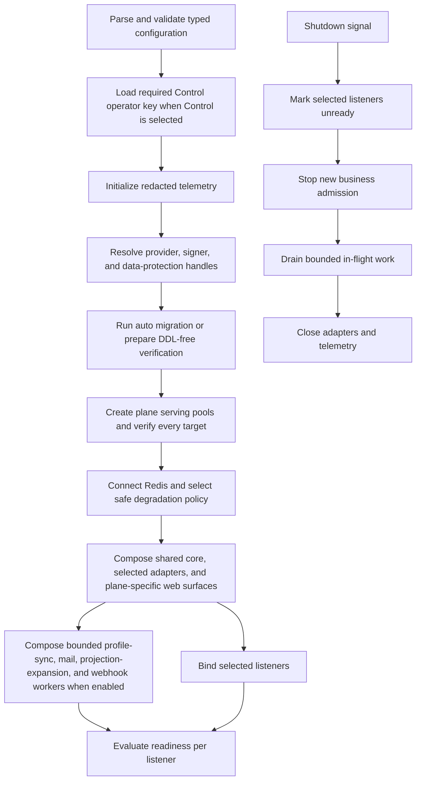
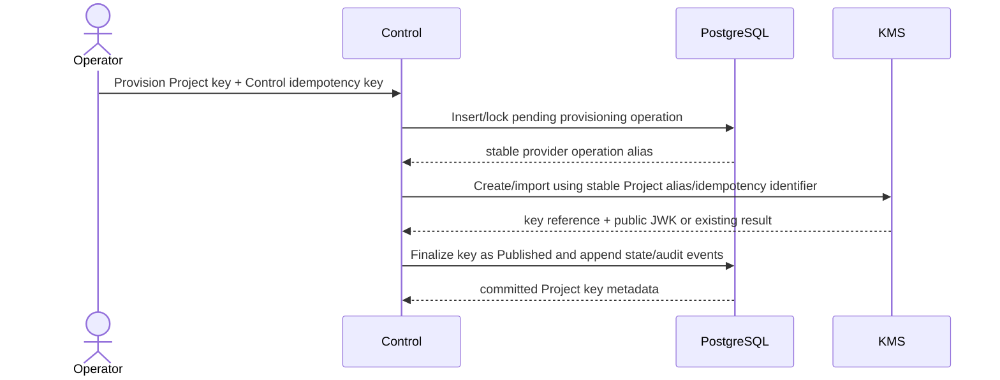
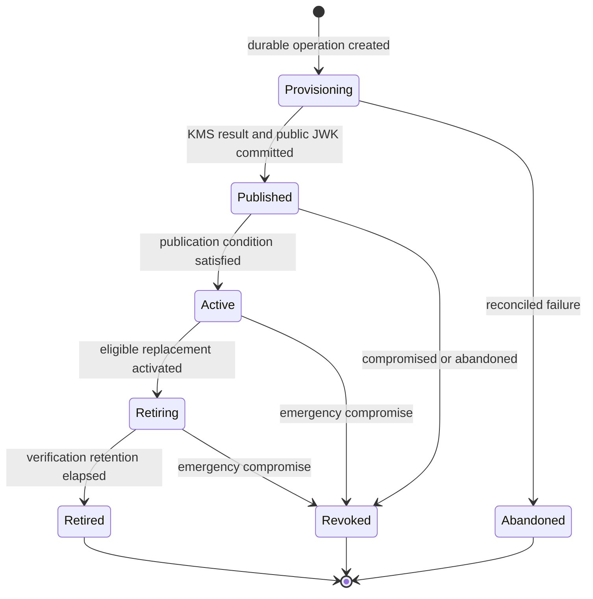
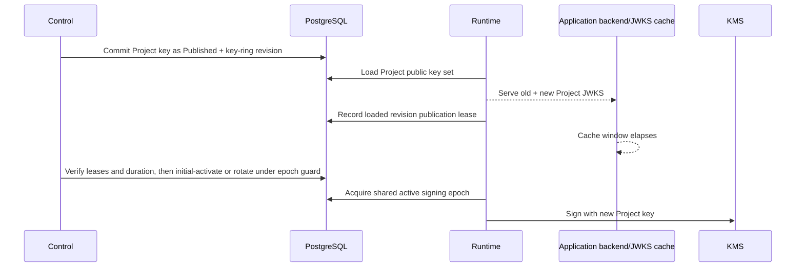

# 06 — Process composition, Project keys, and operational security

## Composition modes

One `owlauth-server` artifact supports:

| Mode | Runtime listener | Control listener | Shared core | PostgreSQL schema |
| --- | --- | --- | --- | --- |
| `all` | enabled | enabled | one in-process instance | shared |
| `runtime` | enabled | absent | Runtime capabilities only | shared |
| `control` | absent | enabled | Control capabilities only | shared |

Mode changes adapter composition, exposure, dependency readiness, and database role; it does not change Project/domain semantics.

Runtime-capable processes (`runtime` and `all`) compose the provider-profile, mail, projection-expansion, and Application-webhook worker executors because these workers support Runtime identity/Application behavior and must not depend on Control availability. `control` alone can configure resources and enqueue mutation-derived events but does not execute these outbound jobs; without a Runtime-capable process they remain durably pending and the corresponding capability reports unavailable/degraded. Multiple Runtime processes may execute workers concurrently through PostgreSQL claims/leases and guarded commits; no singleton worker or Redis lock is correctness authority.

## Process lifecycle



No business route reports ready before schema compatibility and plane-critical dependencies. Migration credentials are absent from serving pools and released before listeners bind. Shutdown has a fixed drain bound and preserves transaction semantics.

## Typed configuration

Configuration has one precedence model, rejects unknown fields, and separates global, Runtime, Control, PostgreSQL serving/migration, Redis, secret-store, signer, data-protection, and telemetry sections.

### Global fields

- immutable deployment external Runtime and Control base URLs; when they share an origin, both use disjoint non-root prefixes so Runtime cookies can remain outside the Control path;
- Project issuer derivation rule;
- immutable environment/instance namespace and its stable non-secret public instance ID used by the well-known CLI descriptor;
- selected plane mode;
- protocol lifetime/clock-skew bounds plus non-overridable email-auth safety floors/ceilings from spec 11; Project configuration may only tighten them;
- trusted secret/key-provider configuration, including distinct retained key sets for short-term transaction/mail state, long-term email PII, and v1 PostgreSQL managed-credential AEAD;
- optional deployment-default SMTP adapter/secret reference with explicit generation and safe fingerprint, unavailable to a Project unless that Project explicitly opts in; its process handle must match the authoritative PostgreSQL generation registry and cannot silently reactivate a disabled/compromised generation;
- outbound provider/SMTP/webhook DNS, proxy, TLS, private-network allowlist, destination, and concurrency policy.

The public instance ID is stable across ordinary upgrade, process replacement, and backup/restore. Deliberate replacement is an administrative service-identity change that causes pinned CLI profiles to fail before key release until the operator explicitly accepts/rebinds the new identity.

Project/provider/Application/email/webhook policy is authoritative PostgreSQL state, not replicated process configuration. Deployment defaults and egress policy constrain Project choices but never imply cross-Project configuration fallback. PostgreSQL stores only deployment-default SMTP generation/status/revision and a safe configuration fingerprint; startup/readiness rejects a configured handle whose generation/fingerprint does not match, while secret bytes remain in protected process/secret-provider configuration.

### Runtime listener fields

- bind address, external origin, TLS/trusted-proxy mode;
- limits, deadlines, concurrency, Project/Application rate policy;
- cookie security and Project namespace behavior;
- public configuration, hosted authentication UI, and JWKS cache bounds;
- exact CORS enforcement mode.

### Control listener fields

- distinct internal bind address and configured external Control base URL;
- TLS and optional mTLS transport roots as hardening, not alternate Control identity;
- the single operator API key from `OWLAUTH_CONTROL_API_KEY`;
- strict request, connection, and authentication rate policy;
- deny-by-default CORS, private-network assumptions, and Management Console security-header policy;
- explicit remote HTTP MCP enablement, canonical path under the Control base, protocol/message/session/stream/concurrency bounds, and external MCP URL published by the well-known descriptor.

`OWLAUTH_CONTROL_API_KEY` is required when mode is `control` or `all`; startup fails before binding Control, Console business routes, or an enabled HTTP MCP endpoint if it is absent or does not match the canonical format below. Mode `runtime` does not require or load it. No configuration field defines additional keys, operator identities, permissions, or Control sessions. Any built-in Control UI invokes the same Control API using the same Bearer key and creates no server-side login/session model.

### Infrastructure fields

- one PostgreSQL serving server/database target, with optional plane-specific login credential references, independent pool bounds, DDL-free roles, and timeouts for that same authority;
- `MIGRATION_MODE`, defaulting to `auto` and accepting only `auto` or `verify`, with semantics owned by spec 04;
- optional separate PostgreSQL migration login credential and non-login owner role used only by `auto` against the one configured serving server/database target; migration configuration cannot override that target;
- Redis endpoint/TLS/credential reference, namespace, bounds, and deadlines;
- signer provider, Project key namespace, allowed algorithms, and opaque references;
- data-protection provider and retained key versions;
- provider endpoint allowlists and Project secret-store adapter;
- production SMTP modes restricted to implicit TLS or mandatory STARTTLS with hostname/certificate validation and no downgrade; explicit plaintext development mode accepts loopback only and is never the default.

Issuer, callback, and redirect decisions never derive from arbitrary `Host`, `Forwarded`, or `X-Forwarded-*`. Proxy headers are honored only from configured trusted proxies.

Provider and cryptographic secrets enter through protected environment/file descriptors, files, or secret managers. The Control operator key specifically enters through `OWLAUTH_CONTROL_API_KEY`, typically populated by the deployment's environment-secret mechanism. Secrets are not ordinary command-line values, serialized config output, public config, health, panic text, telemetry, or OpenAPI examples.

## Operator API-key lifecycle

The canonical operator key is ASCII text in this exact form:

```text
owl_ctrl_v1_<secret>
```

`<secret>` is the 43-character unpadded base64url encoding of exactly 32 cryptographically random bytes. The complete key is therefore 55 ASCII characters and permits only the literal prefix plus `[A-Za-z0-9_-]` in the secret. Whitespace, control characters, padding, alternate encodings, trimming, Unicode normalization, and values outside this exact length/grammar are rejected. The environment value and Bearer token are compared as the same canonical ASCII bytes; shared server/CLI/Console test vectors define parity.

The operator key is held only in immutable process configuration for the lifetime of each Control process. It is never persisted to PostgreSQL or Redis, returned by an endpoint, exposed in OpenAPI examples, or copied into audit/telemetry context. Control accepts only strict `Authorization: Bearer <operator-api-key>` authentication and uses constant-time comparison of the complete canonical value after bounded structural parsing. Runtime uses separate authentication middleware and never compares or accepts this key.

Rotation is an operational rollout, not an OwlAuth API operation:

1. generate and distribute a replacement through the deployment environment-secret mechanism as `OWLAUTH_CONTROL_API_KEY`;
2. restart or roll out every process that composes Control so it loads the replacement;
3. retire the previous environment secret according to deployment policy.

There is one configured value per process and no server-managed overlap set or credential endpoint. Control may be briefly unavailable during a coordinated rotation. In split-process topology, Runtime remains available because it neither loads nor depends on the operator key. In a redundant `all` deployment, a healthy rolling replacement MAY preserve Runtime capacity. Restarting a single-instance `all` process interrupts both listeners even though Runtime credential semantics do not change; uninterrupted Runtime during Control-key rotation is not promised for that topology.

## Network and resource posture

Runtime and Control require TLS directly or through a declared trusted proxy. Control SHOULD bind privately; network isolation supplements application authentication. Runtime serves the Hosted Authentication UI; Control serves the Management Console. Distinct external origins are recommended. An explicitly configured shared origin uses disjoint non-root paths, contains Runtime cookies to the Runtime base, registers no service workers, applies restrictive opener policy, and deliberately shares one browser/XSS boundary; internal listeners, routers, credentials, fallbacks, and resource budgets remain separate as defined by spec 09.

Each listener applies connection/header/body/URI bounds, trusted client-address derivation, correlation, plane rate/concurrency controls, authentication where applicable, and safe response headers before expensive work.

Runtime and Control use separate PostgreSQL pools or quotas. Control list/audit work cannot exhaust capacity reserved for callback, handoff, and refresh transactions. Provider, Redis, signer, and Project-specific expensive operations have independent bounds and circuit state.

CORS is deny-by-default and exact Application-origin based. Provider callbacks and browser redirects are navigation endpoints, not permissive cross-origin APIs.

Outbound webhook admission and every attempt resolve the complete CNAME chain and all A/AAAA answers under the deployment policy; one denied result denies the destination. The socket connects to a validated IP pinned for that attempt while TLS SNI, certificate verification, and HTTP `Host` retain the configured hostname. Redirects, rebinding, mixed public/private answers, IPv4-mapped IPv6 bypasses, link-local/metadata/cross-plane destinations, and proxies without equivalent enforceable destination policy are denied. SMTP uses the same destination-policy framework plus its stricter transport-mode rules. An outbox resolves only its pinned Project/default SMTP generation; config replacement cannot retarget queued mail.

## Key and secret ownership

| Component | May access | Must not access |
| --- | --- | --- |
| Control | Project key metadata/public JWK, lifecycle command, provider secret reference | exportable private key or provider secret bytes in DTOs |
| Runtime | active Project signer reference, Project verification set, provider secret handle, signing/provider operation | arbitrary Project lifecycle mutation or raw private key bytes |
| PostgreSQL | public JWK, opaque signer/provider/SMTP/webhook references, Project/default SMTP generation eligibility and safe default fingerprint, versioned purpose-bound managed-credential and long-term email-PII ciphertext, revisions, lifecycle/provisioning state | plaintext private key, provider/SMTP/webhook secret, managed credential, email PII, or wrapping-key bytes |
| Redis | public Project config/JWKS cache with revision | key/provider authority, secret material, activation locks |
| Signer/KMS | Project-namespaced private material and operation authorization | user/Application policy or routing |
| Secret store | Project provider/SMTP/webhook secret material by opaque purpose-bound reference | Project user/session/profile data or secret read-back DTOs |
| Provider-sync worker | exact linked-identity renewable credential and bounded provider profile operation | Application-selected provider scope/API, downstream token export, or unrelated identity |
| Mail worker | one leased encrypted Project mail job and selected Project/explicit-default SMTP handle | identity/challenge authority, another Project sender, or secret read-back |
| Webhook worker | one leased immutable Application event, exact endpoint, and active signing handle | projection mutation, arbitrary payload/URL, provider token, or Control endpoint |
| Data protector | purpose-separated login/challenge/outbox, long-term email PII, and managed-credential AEAD key versions | token signing authority, external configuration-secret storage, or Project policy |

KMS identities are least-privilege separated: Control provisioning identity creates/manages Project keys; Runtime identity can sign only with authorized active Project key references. Software keys use a dedicated envelope-encrypted store with external wrapping keys.

Data protection uses versioned, purpose-separated AEAD keys. Authenticated context binds deployment, Project, owning aggregate/generation, and field purpose. Short-term login/challenge/mail-outbox versions remain decryptable through the maximum retained usefulness plus clock skew; missing versions cause those transactions/jobs to be cancelled or terminalized before the affected capability is ready.

SMTP proof recovery additionally requires each challenge's pinned Project/default generation and eligibility revision plus the matching active/retained secret handle; generation status remains PostgreSQL authority after restore. Long-term recoverable email PII and active managed credentials follow a stronger retirement rule: every retained ciphertext must be inventoried and successfully re-encrypted/rewrapped under the new version with its uniqueness/generation guards before the old key can retire. A missing long-term key keeps only the affected capability unready or requires an explicit destructive identity/reauthorization workflow; it cannot be treated like disposable login state. Restore inventory also proves email canonicalization/digest versions, active/overlap SMTP and webhook references, signer material, and projection expansion/event/delivery continuation. Missing external references fail their exact purpose closed and enter reconciliation without fallback to another Project/generation.

## Project signing-key provisioning

KMS creation/import is an external side effect with durable idempotency:



A retry resolves the same provisioning operation and provider alias. A pending operation can reconcile by querying the stable provider operation reference. Confirmed orphan material is disabled/deleted only through a provider-specific safe cleanup transition; retry never creates an untracked replacement silently.

## Signing-key lifecycle



- **Provisioning:** durable idempotent operation exists; no JWKS/signing use.
- **Published:** public JWK is in Project JWKS; key cannot sign.
- **Active:** Runtime can sign for this Project/purpose; exactly one per key ring.
- **Retiring:** no new issuance; public JWK remains until retention cutoff.
- **Retired:** absent from ordinary JWKS and unable to sign; metadata remains for audit/recovery.
- **Revoked:** emergency terminal state with immediate signing denial and token-verification consequences below.

## JWKS publication proof and activation

Each ready Runtime process loads the current Project key-ring revision before serving that Project's JWKS/signing path and writes a short PostgreSQL publication lease containing instance identity, loaded revision, the time that revision was first loaded, and lease expiry. Lease renewal extends expiry without resetting the revision-loaded time. Load balancers route only ready Runtime processes; a new/returning process cannot serve signing/JWKS while stale.

Activation requires all of:

1. key state is `Published` and `published_at` is committed;
2. every non-expired ready Runtime publication lease for the Project key ring has `loaded_revision` at or above the published revision;
3. the propagation interval starts at the latest qualifying revision-loaded time among required Runtime leases, not merely `published_at`, and then spans the maximum Runtime key-cache TTL, externally advertised JWKS cache TTL, and propagation margin;
4. activation holds the exclusive signing-epoch guard and follows one of two atomic branches: initial activation changes the sole eligible `Published` key to `Active` when no active key exists; normal rotation changes the old `Active` key to `Retiring` while the eligible `Published` key becomes `Active`.

If there is no current ready Runtime publication lease, activation fails closed. Redis/local invalidation cannot prove publication.



Normal retirement sets `verify_not_after` at transition using the maximum Project access-token lifetime, clock skew, JWKS cache retention, and propagation margin. Concurrent issuance uses shared epoch guards; lifecycle transitions use the conflicting exclusive guard, avoiding a per-token hot-row update while preventing issuance after the cutoff.

## Emergency key revocation

Compromise revocation differs from normal retirement:

- Control atomically marks the key `Revoked`, advances only the Project key-ring/signing epoch, removes it from active signing/JWKS publication, and appends audit/state events. Project security/session revisions advance only when incident scope deliberately includes broader Project or session compromise.
- Runtime immediately rejects signing and its own current-user verification for the revoked `kid` after authoritative revision observation.
- All Project access tokens signed by that `kid` are considered invalid. Offline Application backends may continue accepting a cached key until their bounded JWKS cache refresh; OwlAuth cannot promise instantaneous offline revocation.
- Refresh tokens and opaque sessions are not signed by the compromised key and are not automatically revoked unless incident scope includes broader server/session compromise. They cannot mint a new access token without another eligible active key.
- Runtime token issuance continues only when a previously Published key has already satisfied activation conditions and is activated atomically. Otherwise affected Project issuance is unready/fail-closed while public revocation state propagates.
- Project deployments requiring immediate verifier response use an explicitly designed online status check; Redis invalidation is not sufficient.

## Health and readiness

Liveness answers whether the process event loop responds and does not query every dependency.

Runtime readiness requires compatible PostgreSQL state, resolvable Project key/data-protection capabilities for served Projects, and a safe response to Redis availability. Project-specific provider/KMS/SMTP/protector failures close only the affected provider, signing, email-auth, PII, or managed-sync capability without exposing detail globally. A missing/mismatched deployment-default SMTP registry generation keeps default-backed email challenge admission/claims unready; provider login and active sessions may remain available when only asynchronous profile sync/webhook delivery is degraded. Readiness never discards a pending projection cursor/event or silently substitutes a missing key/secret generation. Control readiness requires PostgreSQL and a valid loaded `OWLAUTH_CONTROL_API_KEY`; key/provider/secret mutations can return operation-specific dependency failure.

Profile-sync, mail, and webhook worker health is reported through bounded queue-age/count/outcome classes without recipient, endpoint path/query, payload, user, or secret labels. Backlog does not make an identity mutation uncommitted. Readiness may fail or a capability may stop admitting new work when configured hard backlog/retention bounds would otherwise lose a promised mail or event; it never drops durable work silently.

In `all`, listeners have independent readiness. Control loss does not force Runtime unready when Runtime authority remains usable. Health exposes no versions, Project names/counts, `belongs_to`, DSNs, Redis keys, provider names, key/secret references, migration SQL, or user/Application existence.

## Observability and audit

Structured telemetry contains time, level, stable event name, plane, operation, outcome class, correlation, and bounded latency. Project/Application IDs appear only in controlled fields where operationally required; `belongs_to`, user/provider subjects, URLs, and arbitrary errors are not metric labels.

Redaction occurs before serialization/export. Authorization headers, cookies, protocol query values, bodies, provider codes/tokens, tickets, access/refresh tokens, PKCE, user profiles, provider secrets, the operator API key, and private keys are denied fields.

Security audit events append through the shared core and follow spec 04 transaction rules. Control audit queries are Project/filter constrained and cannot recover data that was never recorded.

## Retry and backpressure

Every network call has a deadline shorter than the caller's remaining deadline. Retries are bounded/jittered and occur only for classified transient failures. Non-idempotent external effects require a durable operation or reconciliation contract. In particular, provider read-only profile fetch and renewable-credential rotation are separate operations: a rotation is not retried after ambiguous submission unless its adapter declares idempotent replay of the exact durable attempt; otherwise the guarded generation becomes `reauth_required`.

PostgreSQL/Redis pools, provider exchanges, KMS operations, and per-listener/Project concurrency are bounded independently. Backpressure rejects before unbounded queues form. Detailed dependency outcomes are defined by spec 08.
