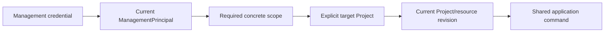

# 07 — Control scopes, external ownership, CLI, and MCP

## Single-operator control model

OwlAuth has one administrative trust domain. Management principals and scopes define which Control operations a credential may perform across the deployment. OwlAuth does not model organizations, tenant memberships, tenant roles, invitations, or organization-scoped credentials.

Project `belongs_to` supports correlation with an external ownership system but does not change this authorization model.

## Management scope vocabulary

Scopes are action capabilities with deny-by-default evaluation. Wildcard/admin aliases may exist only as explicit bundles of concrete scopes; the concrete operation always maps to a stable scope.

| Scope family | Concrete scopes |
| --- | --- |
| Project lifecycle | `projects:create`, `projects:read`, `projects:update`, `projects:disable` |
| External ownership metadata | `projects.belongs_to:read`, `projects.belongs_to:write` |
| Applications | `applications:create`, `applications:read`, `applications:update`, `applications:disable` |
| Application keys/config | `applications.keys:read`, `applications.keys:rotate`, `applications.redirects:write`, `applications.origins:write` |
| Providers | `providers:create`, `providers:read`, `providers:update`, `providers:disable` |
| Provider secrets | `providers.secrets:write`, `providers.secrets:rotate` |
| Project users | `users:read`, `users:update`, `users:disable`, `users:merge` |
| Linked identities | `users.identities:read`, `users.identities:link`, `users.identities:unlink` |
| Sessions | `sessions:read`, `sessions:revoke` |
| Project policies | `policies:read`, `policies:write` |
| Project keys | `keys:read`, `keys:provision`, `keys:publish`, `keys:activate`, `keys:retire`, `keys:revoke` |
| Audit/system | `audit:read`, `system:read` |
| Management access | `management.principals:read`, `management.principals:write`, `management.credentials:rotate`, `management.credentials:revoke` |

Read and write scopes are separate. Secret-reference mutation, key transition, user merge, Project disablement, and management credential operations require step-up/fresh management authentication in addition to the scope. Project/Application/provider/user removal is represented by disablement or merge tombstones; no undefined hard-delete Control capability exists.

These scopes authorize Control actions. They are unrelated to Project access-token custom claims or an application's business RBAC.

## Project target and object authorization

A Control operation follows:



Scope answers what the principal may do. OwlAuth Project resolution answers which concrete Project object is being mutated but does not constrain that Project to an external organization. A deployment-wide credential with `users:disable` can disable a user in any Project when given a valid Project target.

High-impact commands include Project/resource expected revision and reject stale state. Child IDs are always resolved under the route Project; a globally valid child ID from another Project yields a non-enumerating not-found/denied result.

## `belongs_to` semantics

`belongs_to` is Project-only, nullable opaque metadata:

- default is null;
- exact value is bounded and indexed, not unique;
- it has no syntax/namespace meaning inside OwlAuth;
- it is not inherited as a duplicated child column;
- it is absent from Runtime configuration, Project tokens, user data, provider callbacks, metrics labels, and default Control representations;
- explicit read/filter requires `projects.belongs_to:read`;
- create/update requires `projects.belongs_to:write`;
- update advances Project metadata revision and emits an audit event;
- no implicit list/search filtering occurs when a caller omits the exact filter.

OwlAuth never interprets a matching `belongs_to` value as proof that the management principal belongs to that owner.

## External RBAC gateway integration

An external product can expose tenant-aware project management by placing its own authenticated gateway before OwlAuth Control.

```mermaid
sequenceDiagram
    actor Admin as External tenant admin
    participant Gateway as External API/RBAC gateway
    participant Control as OwlAuth Control
    participant Core as Shared core
    participant PG as PostgreSQL

    Admin->>Gateway: Manage auth Project for organization
    Gateway->>Gateway: Authenticate admin; check organization membership and RBAC
    Gateway->>Control: Exact Project lookup/list filtered by belongs_to
    Control->>Core: Authorize projects:read + projects.belongs_to:read
    Core->>PG: Read matching Project ID and revision
    PG-->>Gateway: Project metadata permitted by scopes
    Gateway->>Gateway: Confirm target belongs to caller organization
    Gateway->>Control: Project-bound mutation + expected revision
    Control->>Core: Authorize concrete operation scope
    Core->>PG: Conditional Project-scoped mutation + audit
    PG-->>Gateway: committed result or revision conflict
```

The gateway MUST:

- keep its OwlAuth management credential server-side;
- authenticate the external caller and enforce organization membership/role;
- derive `belongs_to` from trusted external identity, never caller-supplied authority alone;
- verify every target Project maps to that value before forwarding a Project-bound command;
- send the observed `project.metadata_revision` on every forwarded Project-bound mutation; OwlAuth compares it in the same transaction as the child mutation so concurrent ownership changes cause conflict;
- expose only an allowlisted mapping from external operations to OwlAuth Control calls;
- prevent generic Control forwarding, arbitrary Project IDs, credential export, and scope escalation;
- treat a changed `belongs_to` as ownership-sensitive and repeat authorization.

OwlAuth provides indexed lookup and revision conditions but does not claim the gateway performed these checks. A product requiring server-enforced tenant credentials or row isolation requires a different multi-tenant Control architecture.

## CLI boundary

`crates/owlauth-cli` is a remote Control client and does not depend on `owlauth-server`. It uses an isolated Control client module/feature rather than extending the default Runtime SDK with administrative methods.

The CLI:

- parses commands and safely acquires credentials;
- authenticates as a management principal and sends no self-asserted authority accepted without verification;
- never opens PostgreSQL/Redis, runs serving repositories, loads Project/provider keys, or hosts listeners;
- cannot bypass Project qualification or Control scopes with internal-looking IDs;
- distinguishes stable machine output from human diagnostics;
- redacts tokens, secrets, provider values, tickets, cookies, user profile data, and key references.

Secrets are read from a TTY prompt, protected file descriptor, OS credential store, or secret-provider integration, never normal arguments/process titles/history. TLS verification is enabled; development overrides are explicit and endpoint-scoped.

Destructive commands require explicit Project/target and expected revision. Interactive confirmation shows a safe summary. Non-interactive confirmation remains deliberate and does not replace server authorization.

## MCP placement and constraints

MCP is an optional server-side Control adapter, never a local authorization server bundled into an agent plugin and never exposed on Runtime. The transport authenticates a management principal through a defined Control credential class.

Every tool maps to one bounded application command/query and defines required scope, step-up condition, Project target, closed input schema, expected revision, deterministic side effects, idempotency, timeout/rate policy, safe output, and audit action.

MCP tools MUST NOT provide raw SQL, arbitrary repository access, generic HTTP forwarding, shell/filesystem execution, unrestricted bulk mutation, or export of provider secrets/tokens, handoff/session credentials, management credentials, private keys, or user profile dumps.

## High-impact MCP flow

```mermaid
sequenceDiagram
    participant Agent as MCP client
    participant Adapter as MCP Control adapter
    participant Core as Shared core
    participant PG as PostgreSQL

    Agent->>Adapter: Preview typed Project command
    Adapter->>Core: Authorize scope and calculate safe summary
    Core->>PG: Read revisions; persist digest of short-lived confirmation capability
    PG-->>Core: authoritative snapshot + capability record
    Core-->>Adapter: raw bound confirmation capability
    Adapter-->>Agent: redacted summary + capability
    Agent->>Adapter: Commit exact command + capability
    Adapter->>Core: Reauthorize principal, scope, Project, payload, freshness
    Core->>PG: Consume capability digest + conditional mutation + audit atomically
    PG-->>Core: committed, replayed, expired, or stale/conflict
    Core-->>Agent: bounded result
```

The capability is high-entropy/integrity protected and bound to principal, tool, exact normalized command, Project, Project metadata revision, target revision, and Control audience. PostgreSQL stores only its digest and atomically sets `consumed_at` with the command/audit transaction, enforcing one use without Redis. Prompt text and UI approval are never authorization.

## Surface separation

- CLI commands are operator workflows, not mechanically generated OpenAPI paths.
- MCP tools are bounded capabilities, not generated CLI commands or generic OpenAPI wrappers.
- Control HTTP, CLI, and MCP share application commands but retain adapter-specific authentication, admission, schema, confirmation, and output mapping.
- Disabling MCP has no Runtime or Control HTTP contract effect.
- Agent plugins may provide discovery/setup but cannot request, relay, persist, or display credentials in agent context.

## Recovery operations

Direct storage, key-store, or offline recovery is not an ordinary CLI/MCP command. Such procedures require separately isolated access, cryptographic authorization, exclusive/maintenance semantics, and audit. Convenience cannot give the public CLI a server dependency or bypass Project/Control policy.
