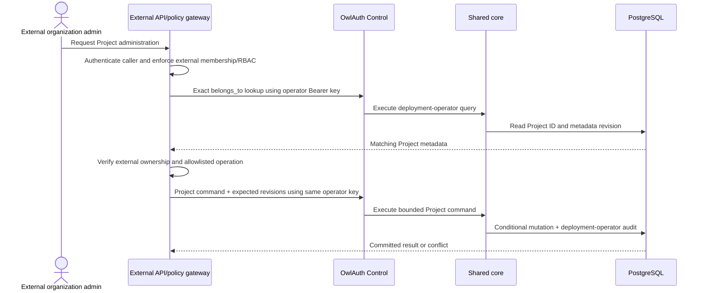

# 07 — Deployment-operator Control, endpoint-discovered CLI, and remote HTTP MCP

## Single deployment-operator model

OwlAuth has one administrative trust domain and one Control actor: the deployment operator. The Control listener accepts only the single API key loaded from `OWLAUTH_CONTROL_API_KEY`. A valid key grants every Control operation across every Project in the deployment.

OwlAuth does not create or store management users, principals, roles, permission grants, API-key records, browser Control sessions, or secondary-authentication state. It exposes no endpoint to issue, inspect, attenuate, rotate, or revoke Control credentials. The fixed audit actor for every Control command is `deployment_operator`.

The operator API key is unrelated to Runtime credentials. Publishable keys, Project access tokens, refresh tokens, browser sessions, handoff tickets, provider credentials, and public Project/Application IDs cannot invoke Control. Conversely, the operator API key is categorically invalid on Runtime routes.

## Control admission

A Control HTTP request is admitted only when it contains exactly:

```http
Authorization: Bearer <operator-api-key>
```

The adapter strictly parses the header, rejects duplicate or conflicting credentials, and compares the presented key with process configuration in constant time. Authentication completes before target lookup or command execution. Optional TLS, mTLS, private networking, proxy policy, and rate limiting are defense in depth; none is an alternate Control identity.

After authentication, Project qualification, expected revisions, command preconditions, state transitions, request bounds, and idempotency still apply. Full deployment authority does not permit a caller to bypass domain invariants or combine child resources from different Projects.

Control idempotency is deployment-operator-scoped. An idempotency key names one normalized request across the deployment, not one request per user or credential. Reusing it with a different request digest is a conflict.

## `belongs_to` semantics

`belongs_to` is Project-only, nullable opaque metadata:

- its value is bounded, exactly comparable, indexed, and not unique;
- it has no syntax, namespace, ownership, or authorization meaning inside OwlAuth;
- it is not inherited or duplicated on child rows;
- it is absent from Runtime configuration, Project tokens, user data, provider callbacks, and metric labels;
- setting or changing it advances the Project metadata revision and emits an audit event;
- exact filtering is supported, but no implicit list/search filtering occurs.

A matching value never reduces the deployment-wide authority of the operator key. OwlAuth does not treat the field as an organization, tenant, membership, role, or policy decision.

## External policy-gateway integration

An external product MAY place its own authenticated policy gateway before OwlAuth Control to expose a narrower organization-aware API.



The gateway MUST:

- keep `OWLAUTH_CONTROL_API_KEY` server-side and never expose it to external administrators, browsers, agents, or tenant workloads;
- authenticate external callers and enforce its own organization membership, roles, plans, and policy;
- derive expected `belongs_to` from trusted external identity rather than caller assertion alone;
- verify each target Project before forwarding a Project-bound operation;
- send the observed Project metadata revision and command-specific target revision so concurrent metadata or state changes fail with conflict;
- map only allowlisted external operations to fixed Control commands;
- prevent generic Control forwarding, arbitrary Project selection, key export, and policy bypass.

OwlAuth provides indexed metadata, revision conditions, Project isolation, and domain validation. It does not provide server-enforced tenant isolation for callers sharing the operator key. Organization membership, arbitrary customer business API keys, tenant RBAC, plans, billing, and hosted multi-tenant orchestration are outside the OwlAuth product. The fixed read-only Project server keys from spec 13 are a separate admitted Server credential class, not tenant-management or business API keys.

## One CLI, endpoint-discovered deployment

`crates/owlauth-cli` publishes one `owlauth` executable for self-hosted administration. A profile stores a trusted administrative service origin. This spec owns the profile and descriptor lifecycle.

The descriptor declares `owlauth-server`, a stable non-secret instance ID, canonical Control API base and versions, an optional remote MCP URL, and the operator-API-key credential class. It contains no Project, user, credential, health, or private capability detail.

### Shared profile and descriptor contract

A saved profile contains the selected HTTPS service origin, a discovered OwlAuth server product/instance/authority/API-base/credential-class pin, a protected credential reference, and non-authoritative version/capability cache.

The profile UX is conceptually:

```text
owlauth profile add <name> --endpoint <https-origin>
owlauth profile inspect <name>
owlauth profile use <name>
owlauth --profile <name> <command>
```

`profile add` performs origin-root `GET /.well-known/owlauth`, validation, display, and confirmation. A deliberate `profile rebind` shows the old and new product, instance, authority, API base, and credential class, then requires confirmation. Committing the rebind atomically replaces the pin, discards the old credential reference, clears every identity-bound Project default and version/capability/output-derived cache, and requires a newly selected credential reference under the new pin. Only service-independent display preferences may survive. It never silently carries credentials or target context across identity change.

The version-1 descriptor is side-effect-free `application/json` with `Cache-Control: no-store`:

```json
{
  "schema_version": "1",
  "product": "owlauth-server",
  "instance_id": "deployment-public-id",
  "api_base_url": "https://admin.example.com/v1/",
  "api_versions": ["v1"],
  "credential_class": "operator-api-key",
  "mcp_url": "https://admin.example.com/mcp"
}
```

`product` is exactly `owlauth-server` and its credential class is exactly `operator-api-key`. `mcp_url` is omitted when disabled. `instance_id` is bounded opaque ASCII and compared exactly. URLs are canonical absolute HTTPS URLs on the selected origin, with no user info, query, fragment, ambiguous encoding, or redirect; API base URLs end in `/`.

The client bounds parsing and rejects redirects, cross-origin URLs, duplicate fields, unknown critical fields, any product or credential class other than the supported pair, and unsupported schema versions. Profile creation confirms discovery before selecting a credential. Every later command validates discovery against the pin before reading or sending the key. A changed product, instance, authority, API base, or credential class, a missing or malformed descriptor, or a TLS/version error fails before credential release. Direct one-shot endpoint use obtains explicit discovery confirmation first. The CLI never infers product identity from `401`, `403`, `404`, or command failure.

The CLI uses `OWLAUTH_CONTROL_API_KEY` by default. Raw keys are absent from profile files and ordinary arguments, URLs, process titles/history, output, and logs.

The CLI never imports `owlauth-server`, opens PostgreSQL/Redis, runs repositories or migrations, loads Project signing keys, hosts Runtime/Control, or launches a local MCP process.

## CLI behavior for a self-hosted endpoint

A profile pinned to discovered `owlauth-server` uses `OWLAUTH_CONTROL_API_KEY` and sends it only as the Control request's Bearer credential. It does not exchange the key for a user identity/session or request reduced authority. The key comes from protected environment/file descriptor, OS credential storage, or secret-provider integration; it is never an ordinary command argument, process-title/history value, output, log field, or OwlAuth persistence value.

The self-hosted adapter:

- requires a validated/pinned self-hosted descriptor, exact Control endpoint, and TLS verification;
- treats every invocation as the fixed deployment operator;
- sends explicit Project/target identifiers and expected revisions for destructive commands;
- emits a Project server credential only from the original successful create response and exposes a separate revision-fenced, idempotent `server-key acknowledge` command that requires explicit confirmation after automation has durably stored it;
- uses deployment-operator-scoped idempotency for eligible retries;
- shows the selected profile/endpoint and a safe summary before destructive commands;
- treats deliberate non-interactive confirmation as intent UX, not extra authority;
- separates stable machine output from human diagnostics;
- exposes Project-user directory list criteria as typed status, safe prefix search, identity/provider-provenance, sort, cursor, and limit arguments, and exposes exact canonical email only through the dedicated body-based lookup command;
- redacts operator/Runtime credentials, provider values, tickets, cookies, email lookup input, user profile data, and private-key references.

## Self-hosted HTTP MCP placement

When enabled, OwlAuth exposes a standards-conformant MCP Streamable HTTP endpoint at `mcp` relative to the configured Control base URL. It is a server-side Control adapter for a trusted deployment operator, never a Runtime route, local plugin process, or distinct authorization server.

Every MCP HTTP request, including protocol initialization, tool discovery, execution, streaming continuation, and session teardown, requires exactly:

```http
Authorization: Bearer owl_ctrl_v1_...
```

The protected MCP host/client supplies this header. The key MUST NOT enter prompt text, model-visible context, tool arguments/schemas/results, protocol errors, URLs, session IDs, logs, or agent-plugin configuration visible to the model. An MCP session identifier is non-authoritative routing/conversation state and never substitutes for per-request key authentication.

The endpoint negotiates a supported MCP protocol version and identifies itself as `owlauth-server` in the `initialize` exchange, then returns its current bounded tools through `tools/list`.

The initial MCP capability set is tools-only. It exposes no prompt/resource catalog and does not request client roots, sampling, or elicitation; adding one requires an explicit data-disclosure and authorization specification. Tool discovery is not authorization. The operator key is reauthenticated and current Project/target revisions are validated for every invocation. MCP is disabled unless explicitly composed; disabling it does not change Control REST, CLI, or Runtime behavior.

## HTTP MCP transport security

The MCP endpoint:

- requires HTTPS except explicit loopback development and remains on the Control network/exposure boundary;
- validates the configured external authority/Host and validates `Origin` when present to prevent DNS-rebinding and browser cross-origin abuse;
- denies broad browser CORS by default;
- bounds protocol messages, batches, request/response bodies, streams, sessions, deadlines, concurrency, and rate;
- rejects unsupported protocol versions/methods without generic HTTP fallback;
- never exposes a stdio transport or causes the CLI/plugin to launch a child MCP process.

POST, optional GET streaming, DELETE, and session-header behavior follow the negotiated standards-conformant Streamable HTTP protocol version rather than a private OwlAuth transport.

## MCP tool constraints

Every tool maps to one bounded application command/query and defines a closed input schema, explicit Project target where applicable, expected revisions, deterministic side effects, idempotency behavior, timeout/rate policy, safe output, audit action, and server-owned impact class that no request parameter can override. Tools are hand-designed and are not generated from OpenAPI or CLI commands.

V1 exposes no mutating MCP tool. Any future mutation is unclassified until a reviewed specification defines its server-enforced impact class, authorization, idempotency, audit, and—when high impact—preview/commit confirmation path. Tool annotations or `tools/list` metadata never replace server-side enforcement.

Tools MUST NOT provide raw SQL, repository access, generic HTTP/OpenAPI forwarding, arbitrary path/method/body invocation, CLI/shell/filesystem execution, unrestricted bulk mutation, or export of provider secrets/tokens, handoff/session credentials, the operator key, private keys, or user profile dumps.

Prompt text, model output, UI approval, tool discovery, and tool arguments are untrusted input. They cannot establish authority; only successful operator-key authentication admits a self-hosted request.

The initial self-hosted catalog contains exactly nine read-only tools: `owlauth_system_get`, Project list/get, Application list/get, webhook endpoint list, webhook delivery list, `owlauth_project_users_list`, and `owlauth_project_user_lookup_email`. The Project-user list tool exposes the same authoritative safe criteria and cursor discipline as Control REST; the exact-email tool accepts email only as a bounded argument and returns zero or one safe user without email, identity subject, picture URL, digest, or credential material. There is no projection-policy tool, mutation tool, preview/commit capability, durable confirmation table, or alternate direct-commit alias. Adding a mutation requires implementing and testing its reviewed design before it enters the catalog.

## Surface and recovery boundaries

- CLI workflows are not mechanically generated OpenAPI paths.
- MCP protocol self-description does not make tools generic OpenAPI wrappers.
- Control HTTP, server CLI, and self-hosted MCP share application commands while retaining adapter-specific parsing, admission, confirmation, and output mapping.
- Disabling CLI use or the MCP endpoint has no Runtime credential/contract effect.
- Agent plugins may document remote endpoint setup but MUST NOT request, relay, persist, display, bundle, launch, supervise, or impersonate an MCP server or operator key in model context.

Direct storage, key-store, or offline disaster recovery is not an ordinary CLI/MCP command. It requires separately isolated operational access, maintenance/exclusion semantics, and audit. It creates no alternate Control identity and bypasses no Project/domain invariant.
