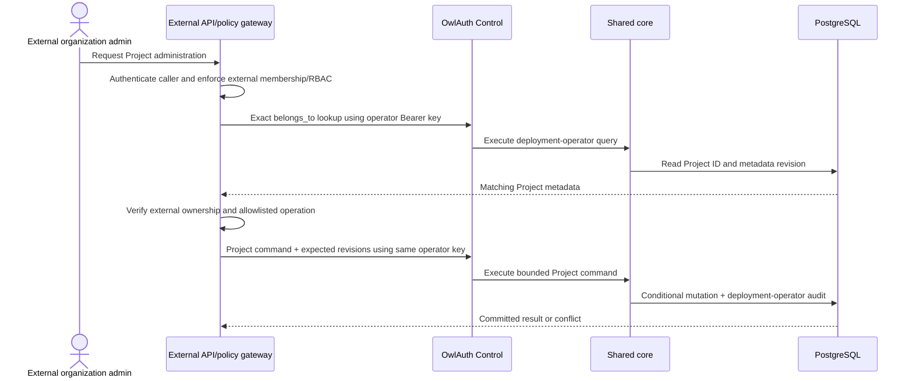
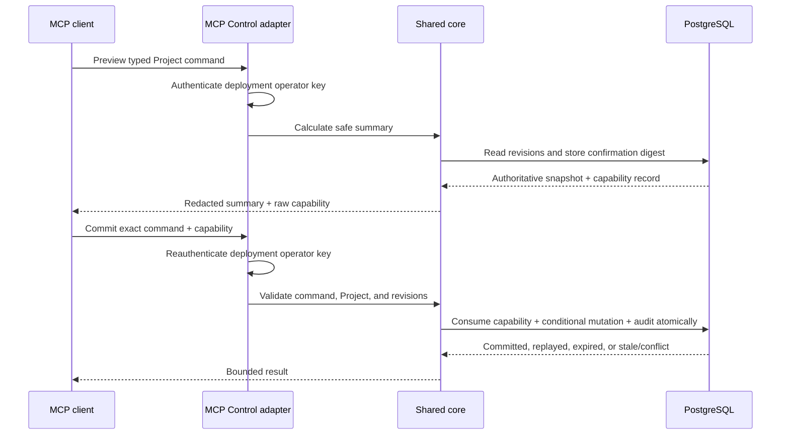

# 07 — Deployment-operator Control, external ownership, CLI, and MCP

## Single deployment-operator model

OwlAuth has one administrative trust domain and one Control actor: the deployment operator. The Control listener accepts only the single API key loaded from `OWLAUTH_CONTROL_API_KEY`. A valid key grants every Control operation across every Project in the deployment.

OwlAuth does not create or store management users, principals, roles, permission grants, API-key records, browser Control sessions, or secondary-authentication state. It exposes no endpoint to issue, inspect, attenuate, rotate, or revoke Control credentials. The fixed audit actor for every Control command is `deployment_operator`.

The operator API key is unrelated to Runtime credentials. Publishable keys, Project access tokens, refresh tokens, browser sessions, handoff tickets, provider credentials, and public Project/Application IDs cannot invoke Control. Conversely, the operator API key is categorically invalid on Runtime routes.

## Control admission

A Control HTTP request is admitted only when it contains exactly:

```http
Authorization: Bearer <operator-api-key>
```

The adapter strictly parses the header, rejects duplicate or conflicting credentials, and compares the presented key with process configuration in constant time. Authentication completes before target lookup or command execution. Optional TLS, mTLS, private networking, proxy policy, and rate limiting are defense in depth; none is an alternate Control identity.

After authentication, Project qualification, expected revisions, command preconditions, state transitions, request bounds, and idempotency still apply. Full deployment authority does not permit a caller to bypass domain invariants or combine child resources from different Projects.

Control idempotency is deployment-operator-scoped. An idempotency key names one normalized request across the deployment, not one request per user or credential. Reusing it with a different request digest is a conflict.

## `belongs_to` semantics

`belongs_to` is Project-only, nullable opaque metadata:

- its value is bounded, exactly comparable, indexed, and not unique;
- it has no syntax, namespace, ownership, or authorization meaning inside OwlAuth;
- it is not inherited or duplicated on child rows;
- it is absent from Runtime configuration, Project tokens, user data, provider callbacks, and metric labels;
- setting or changing it advances the Project metadata revision and emits an audit event;
- exact filtering is supported, but no implicit list/search filtering occurs.

A matching value never reduces the deployment-wide authority of the operator key. OwlAuth does not treat the field as an organization, tenant, membership, role, or policy decision.

## External policy-gateway integration

An external product MAY place its own authenticated policy gateway before OwlAuth Control to expose a narrower organization-aware API.



The gateway MUST:

- keep `OWLAUTH_CONTROL_API_KEY` server-side and never expose it to external administrators, browsers, agents, or tenant workloads;
- authenticate external callers and enforce its own organization membership, roles, plans, and policy;
- derive expected `belongs_to` from trusted external identity rather than caller assertion alone;
- verify each target Project before forwarding a Project-bound operation;
- send the observed Project metadata revision and command-specific target revision so concurrent metadata or state changes fail with conflict;
- map only allowlisted external operations to fixed Control commands;
- prevent generic Control forwarding, arbitrary Project selection, key export, and policy bypass.

OwlAuth provides indexed metadata, revision conditions, Project isolation, and domain validation. It does not provide server-enforced tenant isolation for callers sharing the operator key. Organization membership, SaaS API keys, tenant RBAC, plans, and billing belong to the separate [`spec/saas/`](saas/) architecture, not `owlauth-server`.

## CLI boundary

`crates/owlauth-cli` is a remote client for a trusted deployment operator. It does not depend on `owlauth-server`, open PostgreSQL/Redis, run repositories, load Project signing keys, or host a Control listener. It uses a deliberately isolated Control transport rather than adding administrative methods to the default Runtime SDK.

The CLI uses the same `OWLAUTH_CONTROL_API_KEY` value and sends it only as the Control request's Bearer credential. It does not exchange the key for a user identity or session and cannot request reduced authority from OwlAuth. The key is acquired from protected environment/descriptor, OS credential storage, or secret-provider integration; it is never accepted as a normal command-line argument, placed in process titles/history, printed, logged, included in machine output, or persisted by OwlAuth.

The CLI:

- requires an explicit Control endpoint and TLS verification;
- treats every invocation as the trusted deployment operator;
- sends explicit Project/target identifiers and expected revisions for destructive commands;
- uses deployment-operator-scoped idempotency for eligible retries;
- shows a safe interactive summary before destructive commands, while deliberate non-interactive confirmation does not alter server authority;
- distinguishes stable machine output from human diagnostics;
- redacts the operator key, Runtime credentials, provider values, tickets, cookies, user profile data, and private key references.

## MCP placement and constraints

MCP is an optional Control adapter for a trusted deployment operator. It is never exposed on Runtime and is not a local authorization server embedded in an agent plugin. Its transport uses the same Control API key and therefore has the same deployment-wide authority; OwlAuth does not assign a distinct agent identity or narrower permission set.

Every tool maps to one bounded application command or query and defines a closed input schema, explicit Project target where applicable, expected revisions, deterministic side effects, idempotency behavior, timeout/rate policy, safe output, and audit action. Tools MUST NOT provide raw SQL, arbitrary repository access, generic HTTP forwarding, shell/filesystem execution, unrestricted bulk mutation, or export of provider secrets/tokens, handoff/session credentials, the operator key, private keys, or user profile dumps.

Prompt text, model output, UI approval, and tool arguments are untrusted input. They cannot establish authority; only successful operator-key authentication admits the request.

## High-impact MCP confirmation

High-impact tools use a preview/commit flow to bind operator intent to current state:



The confirmation capability is high entropy and integrity protected. It is bound to:

- the fixed deployment-operator actor and Control audience;
- the exact tool and normalized command digest;
- the explicit Project when Project-bound;
- the Project metadata revision and command-specific target revisions;
- a short expiry and one-use consumption state.

It is not bound to a server-side user, role, permission grant, or secondary-authentication session. PostgreSQL stores only its digest and atomically consumes it with the command and deployment-operator audit event. A capability cannot be moved to another command, Project, revision, deployment, or Runtime route.

## Surface and recovery boundaries

- CLI workflows are not mechanically generated OpenAPI paths.
- MCP tools are bounded operator capabilities, not generated CLI commands or generic OpenAPI wrappers.
- Control HTTP, CLI, and MCP share application commands while retaining adapter-specific parsing, admission, confirmation, and output mapping.
- Disabling CLI use or MCP has no Runtime contract or credential effect.
- Agent plugins may provide discovery/setup but must not request, relay, persist, or display the operator key in agent context.

Direct storage, key-store, or offline disaster recovery is not an ordinary CLI/MCP command. Such procedures require separately isolated operational access, maintenance/exclusion semantics, and audit. They do not create another Control identity or bypass Project/domain invariants.
