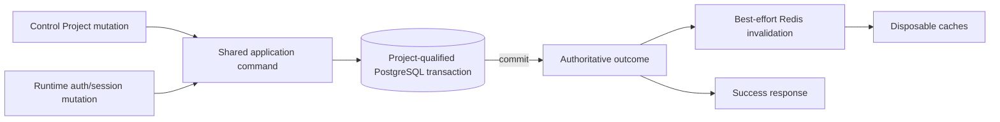
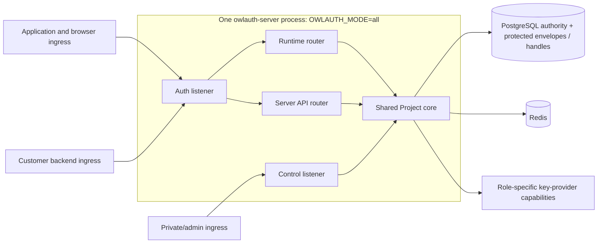
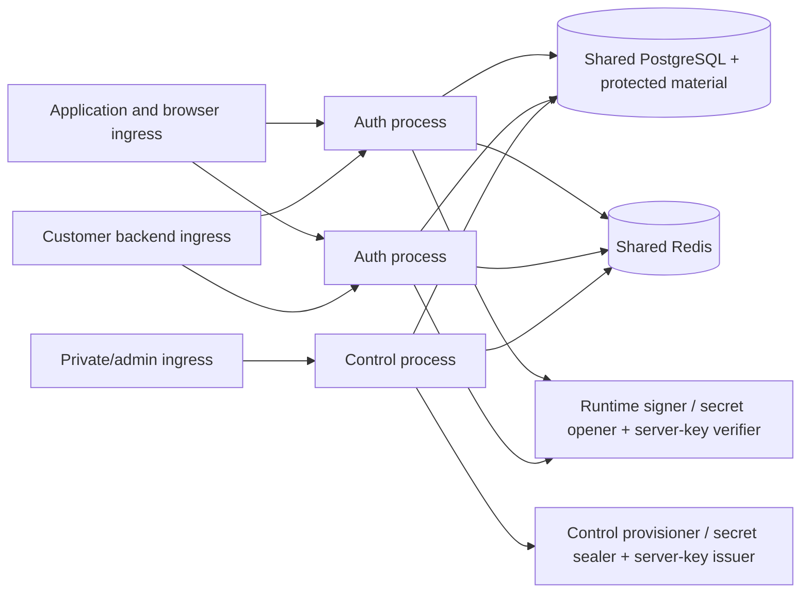

# 08 — Consistency, resilience, and plane separation

## Consistency model

OwlAuth uses one PostgreSQL authority and one shared Project-domain model across Runtime, Server API, and Control. A successful security-state mutation means the corresponding PostgreSQL transaction committed. Redis publication, local cache refresh, telemetry export, and remote observations are not part of commit acknowledgment.

Runtime consults PostgreSQL for mutable Project/Application/user/session/key facts at decision/commit points. No cache acknowledgment is required for success because cache state cannot authorize.

## State categories

| Category                    | Examples                                                                                                                               | Consistency rule                                                                                                                                                 |
| --------------------------- | -------------------------------------------------------------------------------------------------------------------------------------- | ---------------------------------------------------------------------------------------------------------------------------------------------------------------- |
| Project boundary            | Project status/revision, child ownership                                                                                               | every operation is Project-qualified; composite constraints prevent cross-Project links                                                                          |
| One-use auth state          | callback state, handoff ticket, refresh generation                                                                                     | PostgreSQL conditional mutation is the serialization point                                                                                                       |
| Runtime authorization state | Application/provider/user/session/policy status                                                                                        | current Project-scoped revision checked before effect/credential commit                                                                                          |
| Cryptographic state         | Project active key, JWKS publication, key revocation, protected signer/configuration material lifecycle                                | PostgreSQL key ring/publication leases/material IDs and envelopes or handles plus exact key-provider capability; Redis never activates or selects material       |
| External metadata           | Project `belongs_to`                                                                                                                   | PostgreSQL indexed metadata and revision; no Runtime/tenant authority                                                                                            |
| Durable audit               | Project/deployment security events                                                                                                     | same transaction as mutation where atomic attribution is required; Control actor is fixed as `deployment_operator`                                               |
| Public derived data         | Project/Application config and JWKS                                                                                                    | generated from authoritative revision; cacheable with hard TTL                                                                                                   |
| Managed identity sync       | connection/credential generation, durable renewal operation, AEAD ciphertext, and bounded source profile                               | remote I/O occurs outside transaction; non-idempotent renewal is generation-fenced and guarded PostgreSQL commit rejects stale/ambiguous predecessor reuse       |
| Email proof and mail        | newest challenge generation/attempt/consumption plus challenge/outbox pinned to one SMTP selection generation and eligibility revision | PostgreSQL proof completion revalidates current SMTP generation status/revision; SMTP is at-least-once delivery only and replacement never retargets queued mail |
| Application user sync       | user revision, Application binding/projection, immutable event/delivery outbox                                                         | mutation/event commit together; webhook is at-least-once and unordered                                                                                           |
| Admission coordination      | Project/Application/email-digest/IP rate counters                                                                                      | Redis coordinated; loss follows safe endpoint fallback/fail-closed policy                                                                                        |

## Project isolation under concurrency

- Project selection occurs before any child lookup and remains immutable through the command.
- Every row lock, uniqueness check, conditional update, and idempotency record includes the authoritative Project where applicable.
- A request cannot combine Project A route context with Application/user/session/provider/key state from Project B.
- Global UUID uniqueness is defense-in-depth, not a replacement for Project predicates.
- Project disablement revision invalidates Runtime work prepared from an earlier snapshot before final commit.
- `belongs_to` changes do not move children or change Runtime credentials; every external-gateway mutation compares the previously observed Project `metadata_revision` in the same transaction as its child effect.

## Security-change visibility

After Control commit:

- disabled Project rejects all new login, callback completion, handoff, refresh, current-user, and signing operations;
- disabled Application rejects its login/handoff/refresh and invalidates its Application sessions, while Project browser sessions and other Applications remain valid;
- removed redirect/origin rejects new use and pending completion through Application revision mismatch;
- disabled provider rejects login/callback for that Project/provider only;
- provider unassignment advances the Application-provider assignment revision and invalidates matching in-flight callback/handoff completion;
- terminated Project browser session blocks refresh for every derived Application session through authoritative browser-session validation;
- disabled user rejects all credentials for that user within the Project only;
- a Control process admits commands only with the operator key it loaded from `OWLAUTH_CONTROL_API_KEY`; key replacement becomes effective only as Control processes restart/roll out;
- Project signing-key transitions affect signing/JWKS according to spec 06;
- Project server-key revocation affects the next Server API request, while lifecycle-neutral coarsened usage telemetry cannot race it into a conflict.

Already issued self-contained Project access tokens remain subject to signed expiry and backend verifier behavior. New refresh/current-user/session operations observe authoritative changes. Stronger immediate backend invalidation requires an explicitly designed online check.

## Dependency failure semantics

| Dependency/failure                                                                           | Runtime behavior                                                                                                                                                                    | Server API behavior                                                                                               | Control behavior                                                                                                      | Correctness effect                                                                                                          |
| -------------------------------------------------------------------------------------------- | ----------------------------------------------------------------------------------------------------------------------------------------------------------------------------------- | ----------------------------------------------------------------------------------------------------------------- | --------------------------------------------------------------------------------------------------------------------- | --------------------------------------------------------------------------------------------------------------------------- |
| PostgreSQL unavailable/incompatible                                                          | business routes unready/fail closed                                                                                                                                                 | business routes unready/fail closed                                                                               | business routes unready/fail closed                                                                                   | no alternate authority or acknowledged mutation                                                                             |
| Redis unavailable                                                                            | ignore caches; generate public data from authority; use strict bounded local rate fallback or fail closed                                                                           | continue PostgreSQL reads; use bounded local admission fallback or fail closed                                    | direct PostgreSQL commands; omit optional cache/invalidation; strict auth-rate fallback or fail closed                | no Project/auth invariant weakens                                                                                           |
| Project server-key digest version unavailable or inventory/readiness stale                   | unaffected; Runtime never loads the ring                                                                                                                                            | readiness fails when any active key references an unavailable version; requests never try another version         | creation under a new version remains disabled until required Server readiness is authoritative                        | no valid active key silently becomes unverifiable and no fallback digest authority                                          |
| Runtime signer/material unavailable, wrong bundled root, or provider/format/context mismatch | affected Project handoff/refresh issuance fails closed; public JWKS may remain                                                                                                      | directory reads remain available; introspection fails closed if token verification authority is unavailable       | unrelated administration remains; key operation reports bounded dependency/integrity failure                          | no unsigned/wrong-key token, alternate provider, algorithm downgrade, or fallback root                                      |
| Short-term DataProtector key unavailable                                                     | affected login/challenge/mail jobs cannot resume and are cancelled/terminalized                                                                                                     | unaffected                                                                                                        | unrelated operations remain                                                                                           | no state guessed, delivered under another generation, or returned incorrectly                                               |
| Long-term email-PII or managed-credential AEAD key unavailable                               | affected identity/profile/sync capability is unready or requires explicit destructive recovery                                                                                      | exact email lookup or affected projection field fails closed rather than returning guessed/partial protected data | key inventory/recovery remains available without plaintext read-back                                                  | old key cannot retire without proven re-encryption; no silent data loss or credential reuse                                 |
| Projection verified-email write/read key or PostgreSQL version authority unavailable/stale   | affected projection return/repair fails closed                                                                                                                                      | affected Application projection read/introspection fails closed                                                   | identity confirmation that would fan out an affected binding remains ready and rolls back without receipt consumption | no write/read under stale key authority; cutover requires required process observations                                     |
| Configuration-secret opener/material unavailable or invalid                                  | affected Project/provider login, SMTP claim, or webhook signing fails closed; guarded durable work backs off                                                                        | unaffected directory reads; introspection still requires signing verification authority                           | metadata remains manageable; sealing/provider failure is operation-specific                                           | no plaintext guess, cross-Project/generation fallback, stale profile commit, or erased-material resurrection                |
| Remote signing-key provisioner has an ambiguous create result                                | unrelated Runtime continues; no new key is selected                                                                                                                                 | directory reads continue; introspection uses only committed verification authority                                | durable operation remains pending and reconciles the same stable provider identity                                    | no duplicate/untracked external key and no publish before handle/public-key consistency is proven                           |
| SMTP unavailable/permanent rejection or generation disabled/compromised                      | generic login start/method picker remain independent; challenge admission remains enumeration-safe, and jobs retry only while the pinned generation/revision is eligible and useful | unaffected                                                                                                        | metadata/lifecycle remains manageable and test reports safe failure class                                             | completion revalidates pinned eligibility in PostgreSQL; compromise commit denies later proof even after in-flight delivery |
| Webhook endpoint unavailable, duplicate, or out of order                                     | login/current-user/profile mutation success is unchanged                                                                                                                            | committed directory/projection reads remain available                                                             | safe delivery health/replay remains available                                                                         | immutable event persists; receiver deduplicates event ID and compares Application-specific `projection_revision`            |
| Worker crash or lease expiry                                                                 | another worker may repeat bounded external attempt                                                                                                                                  | request processing is independent of workers                                                                      | same durable state is inspectable                                                                                     | PostgreSQL challenge/generation/event state prevents duplicate identity effects                                             |
| Control endpoint unavailable or restarting for operator-key rotation                         | continues in split-process topology; redundant `all` rollout may preserve capacity; single-instance `all` restart interrupts Auth too                                               | continues in split-process topology; single-instance `all` restart interrupts Auth too                            | unavailable                                                                                                           | Auth has no Control RPC dependency or credential crossover; process topology still determines restart availability          |
| Auth endpoint unavailable                                                                    | unavailable                                                                                                                                                                         | unavailable                                                                                                       | Control continues subject to its dependencies                                                                         | Runtime and Server API share one transport lifecycle; Control does not accept Auth credentials or proxy Auth requests       |
| Invalidation lost                                                                            | stale public cache ignored at authoritative decision                                                                                                                                | v1 Server API reads query PostgreSQL on every request; no directory-response cache exists                         | committed mutation remains                                                                                            | derived Runtime staleness only, no stale Server API allow                                                                   |
| Crash during transaction                                                                     | no committed success unless commit completed                                                                                                                                        | read fails without an alternate result                                                                            | same                                                                                                                  | PostgreSQL atomicity defines outcome                                                                                        |
| Lost refresh response                                                                        | retry of consumed token revokes family                                                                                                                                              | not applicable                                                                                                    | not applicable                                                                                                        | containment; Application reauthenticates                                                                                    |
| Stale JWKS publication lease                                                                 | affected key activation rejected                                                                                                                                                    | introspection uses only current committed acceptable verification keys                                            | Control reports unmet publication condition                                                                           | no sign-before-publish                                                                                                      |

A fallback is safe only if bounded and unable to convert cross-Project data, denial, revocation, duplicate use, or unknown state into an allow. Runtime coordinated admission uses one atomic fixed-window Redis evaluation for every bucket in a request; Redis selects the window from its own clock. Redis keys contain only a deployment namespace, schema/endpoint labels, window number, and digests derived from a stable admission-only root, never raw addresses, Project/Application IDs, providers, cookies, states, handoffs, or tokens. Every accepted request also consumes a process-local monotonic rolling-window counter with a quota no greater than `floor(deployment quota / configured maximum Runtime processes)`. Active local entries are never evicted; capacity saturation fails closed until expired entries can be removed. Once Redis is unavailable or invalid in a local window, that process remains on local fallback until its next monotonic window. Because Redis successes, Redis counter loss, and fallback all pass through the same local share, disconnect, flush, failover, recovery, clock skew between Auth processes, and Runtime protection-key rotation cannot add admission quota. Stale authorization is not an availability strategy.

## Retry and idempotency

- Read-only operations may retry classified transient failures within deadline.
- A deliberately classified PostgreSQL serialization/deadlock retry, where implemented, reruns the complete command with the same verified plane actor/Project context.
- PostgreSQL `lock_timeout` is a bounded persistence/contention failure and is not automatically replayed. The current statement or transaction rolls back; any caller retry remains subject to the operation's existing idempotency, exact revision, one-use, and unknown-commit rules.
- Handoff and refresh submissions retain one-use semantics and are not made replay-safe by HTTP retries.
- Control creation/eligible mutation uses deployment-operator-scoped PostgreSQL idempotency with a normalized request digest; the idempotency namespace is deployment-wide.
- Durable-resource creation keys retain a replay result or tombstone for at least the resource lifetime and never expire into permission to execute the same key again. Other retention exceeds every supported retry/reconciliation window; an unknown create is reconciled or escalated, not automatically replayed after expiry.
- Reusing an idempotency key for another digest is conflict.
- Provider code exchange is not blindly retried after an ambiguous effect. Remote signing-key creation uses durable reconciliation from spec 06. A Runtime sign call may retry only when the provider contract classifies replay of the exact algorithm/handle/JWS input as side-effect-free and within the request deadline; no retry may select another key/provider or alter the input.
- Provider-profile read and renewable-credential rotation are classified separately. A read-only fetch may retry only when adapter-declared safe and commits against the same current generation. Before rotation OwlAuth persists a durable expected-generation attempt; an ambiguous response or post-submission lease loss must not reuse the predecessor unless the adapter idempotently replays that exact attempt. Otherwise a guarded generation advance makes the connection `reauth_required`. A received successor commits before optional profile fetch and cannot overwrite reauthorization/disconnect.
- SMTP/webhook attempts may repeat after an ambiguous response because their durable outboxes provide at-least-once delivery. Mail reuses the challenge and exact pinned SMTP generation; webhook reuses immutable event ID/body and signs `timestamp.event_id.raw_body`. Retry never repeats identity proof/mutation or retargets a replacement URL/configuration.

## Resource isolation

Auth and Control have separate listeners and independently own body bytes, request deadline, in-flight requests, transport connections, header count/bytes, and URI bytes under the configuration authority in spec 06. Within Auth, Runtime and Server API have distinct middleware, route-local admission, state, PostgreSQL pool quotas, and readiness inputs, while sharing Auth's transport connection and ordinary HTTP serving budget. Changing Auth cannot resize Control's semaphore or accepted-connection budget, and changing one Auth surface's admission or pool quota cannot resize the other's. HTTP transport budgets, surface admission, and PostgreSQL pool quotas are separate isolation dimensions. Shared process memory or a shared Auth socket does not mean shared caller authentication, router state, admission counters, or pool authority.

Priority protects:

1. callback/handoff/refresh serialization;
2. session/revocation/current-user operations;
3. login start and Project browser interaction;
4. Project JWKS/public config;
5. Control point mutations;
6. Server API user/projection reads;
7. Control list/audit queries.

Per-Project fairness prevents one Project's provider outage, login spike, Server API read load, or audit query from consuming every Runtime/Server API/Control resource. Priority/fairness never bypasses Project qualification or transaction ordering.

## Combined topology

Combined mode preserves both endpoint listeners and all surface-specific credentials, routers, admission, PostgreSQL pools, and readiness inputs while application calls and Project transactions remain in one process. Auth exposes one health route and aggregate readiness for its selected Runtime and Server API dependencies.

## Split-process topology

Split mode uses `OWLAUTH_MODE=auth` for every Auth replica and `OWLAUTH_MODE=control` for Control. It uses the same official binary—or the same deployment-specific statically composed custom binary—schema, application/domain modules, and provider SPI. There is no Auth-to-Control RPC, dynamic plugin discovery, duplicate domain policy, or separate authoritative database. Each process receives only the endpoint-specific credentials/provider capabilities required by its mode; bundled-provider Auth replicas that need signer/opener authority receive the exact same static custody root. Runtime and Server API observe Control changes through PostgreSQL; Redis only reduces existing Runtime derived-cache latency and coordinates non-authoritative admission.

Endpoints may use different serving login credentials and database roles only against the same configured PostgreSQL server/database authority. Runtime, Server API, and Control retain independent serving pools and pool bounds even when Runtime and Server API execute in one Auth process. Matching schema histories on independent targets are insufficient and such configuration is invalid. Schema preparation uses the separately authorized migration capability in spec 04 rather than DDL privileges in serving pools. Auth becomes ready only after both surface pools, exact capability inventory, Runtime publication state, Server digest-version state, and route-local dependencies pass. Control readiness remains independent; `all` does not report an endpoint ready while any of that endpoint's selected inputs are unready.

## Conditions for physical plane separation

Split-process topology is justified only by concrete isolation needs:

- materially different Auth/Control scaling or transport resource quotas;
- private Control network placement;
- multi-region Auth placement, with Runtime and Server API moving together;
- Auth availability during Control process/listener outage;
- different database roles, deployment permissions, change-management authority, or operator ownership.

Physical separation does not authorize different domain implementations, cross-plane RPC for ordinary requests, separate Project databases, async replication as one-use/identity/key authority, Kafka as a protocol commit prerequisite, or configuration synchronization outside PostgreSQL.

A topology that requires these is a different distributed-system architecture.

## Multi-region constraint

Multiple Auth regions can serve only while every security-sensitive mutation reaches PostgreSQL authority with spec 04 transaction semantics. Runtime and Server API are deployed together in each Auth replica; they are not independently placeable modes. Redis replication is not authority. Region caches/rate signals may improve latency, but handoff/refresh, Project state, identity, session, and key decisions cannot be accepted from asynchronously stale replicas.

Project issuer, IDs, users, Application IDs, and key rings remain globally coherent within the deployment. Independently writable regional authorities require a separate conflict/issuance/revocation/recovery design and are not a transparent scaling mode.
