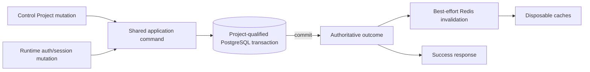
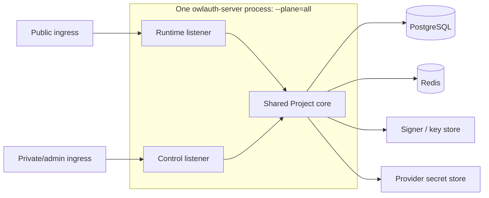
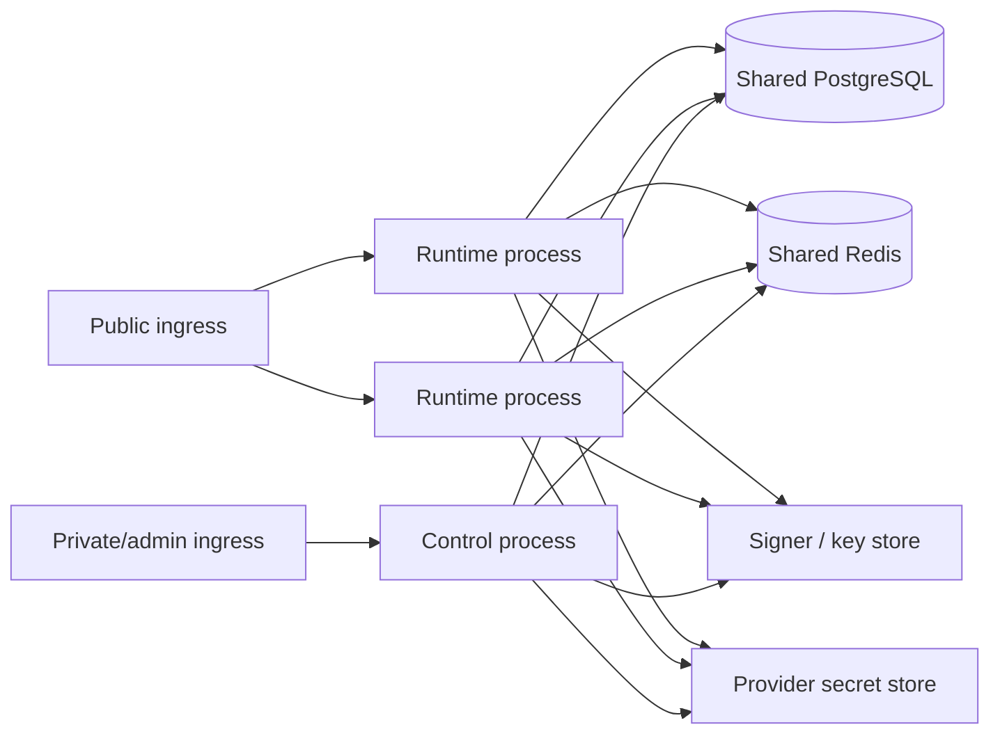

# 08 — Consistency, resilience, and plane separation

## Consistency model

OwlAuth uses one PostgreSQL authority and one shared Project-domain model across Runtime and Control. A successful security-state mutation means the corresponding PostgreSQL transaction committed. Redis publication, local cache refresh, telemetry export, and remote observations are not part of commit acknowledgment.

Runtime consults PostgreSQL for mutable Project/Application/user/session/key facts at decision/commit points. No cache acknowledgment is required for success because cache state cannot authorize.

## State categories

| Category                    | Examples                                                                                                                               | Consistency rule                                                                                                                                                 |
| --------------------------- | -------------------------------------------------------------------------------------------------------------------------------------- | ---------------------------------------------------------------------------------------------------------------------------------------------------------------- |
| Project boundary            | Project status/revision, child ownership                                                                                               | every operation is Project-qualified; composite constraints prevent cross-Project links                                                                          |
| One-use auth state          | callback state, handoff ticket, refresh generation                                                                                     | PostgreSQL conditional mutation is the serialization point                                                                                                       |
| Runtime authorization state | Application/provider/user/session/policy status                                                                                        | current Project-scoped revision checked before effect/credential commit                                                                                          |
| Cryptographic state         | Project active key, JWKS publication, key revocation                                                                                   | PostgreSQL key ring/publication leases plus signer capability; Redis never activates                                                                             |
| External metadata           | Project `belongs_to`                                                                                                                   | PostgreSQL indexed metadata and revision; no Runtime/tenant authority                                                                                            |
| Durable audit               | Project/deployment security events                                                                                                     | same transaction as mutation where atomic attribution is required; Control actor is fixed as `deployment_operator`                                               |
| Public derived data         | Project/Application config and JWKS                                                                                                    | generated from authoritative revision; cacheable with hard TTL                                                                                                   |
| Managed identity sync       | connection/credential generation, durable renewal operation, AEAD ciphertext, and bounded source profile                               | remote I/O occurs outside transaction; non-idempotent renewal is generation-fenced and guarded PostgreSQL commit rejects stale/ambiguous predecessor reuse       |
| Email proof and mail        | newest challenge generation/attempt/consumption plus challenge/outbox pinned to one SMTP selection generation and eligibility revision | PostgreSQL proof completion revalidates current SMTP generation status/revision; SMTP is at-least-once delivery only and replacement never retargets queued mail |
| Application user sync       | user revision, Application binding/projection, immutable event/delivery outbox                                                         | mutation/event commit together; webhook is at-least-once and unordered                                                                                           |
| Admission coordination      | Project/Application/email-digest/IP rate counters                                                                                      | Redis coordinated; loss follows safe endpoint fallback/fail-closed policy                                                                                        |

## Project isolation under concurrency

- Project selection occurs before any child lookup and remains immutable through the command.
- Every row lock, uniqueness check, conditional update, and idempotency record includes the authoritative Project where applicable.
- A request cannot combine Project A route context with Application/user/session/provider/key state from Project B.
- Global UUID uniqueness is defense-in-depth, not a replacement for Project predicates.
- Project disablement revision invalidates Runtime work prepared from an earlier snapshot before final commit.
- `belongs_to` changes do not move children or change Runtime credentials; every external-gateway mutation compares the previously observed Project `metadata_revision` in the same transaction as its child effect.

## Security-change visibility

After Control commit:

- disabled Project rejects all new login, callback completion, handoff, refresh, current-user, and signing operations;
- disabled Application rejects its login/handoff/refresh and invalidates its Application sessions, while Project browser sessions and other Applications remain valid;
- removed redirect/origin rejects new use and pending completion through Application revision mismatch;
- disabled provider rejects login/callback for that Project/provider only;
- provider unassignment advances the Application-provider assignment revision and invalidates matching in-flight callback/handoff completion;
- terminated Project browser session blocks refresh for every derived Application session through authoritative browser-session validation;
- disabled user rejects all credentials for that user within the Project only;
- a Control process admits commands only with the operator key it loaded from `OWLAUTH_CONTROL_API_KEY`; key replacement becomes effective only as Control processes restart/roll out;
- Project key transitions affect signing/JWKS according to spec 06.

Already issued self-contained Project access tokens remain subject to signed expiry and backend verifier behavior. New refresh/current-user/session operations observe authoritative changes. Stronger immediate backend invalidation requires an explicitly designed online check.

## Dependency failure semantics

| Dependency/failure                                                                         | Runtime behavior                                                                                                                                                                    | Control behavior                                                                                                      | Correctness effect                                                                                                                                                                         |
| ------------------------------------------------------------------------------------------ | ----------------------------------------------------------------------------------------------------------------------------------------------------------------------------------- | --------------------------------------------------------------------------------------------------------------------- | ------------------------------------------------------------------------------------------------------------------------------------------------------------------------------------------ |
| PostgreSQL unavailable/incompatible                                                        | business routes unready/fail closed                                                                                                                                                 | business routes unready/fail closed                                                                                   | no alternate authority or acknowledged mutation                                                                                                                                            |
| Redis unavailable                                                                          | ignore caches; generate public data from authority; use strict bounded local rate fallback or fail closed                                                                           | direct PostgreSQL commands; omit optional cache/invalidation; strict auth-rate fallback or fail closed                | no Project/auth invariant weakens                                                                                                                                                          |
| Signer unavailable                                                                         | affected Project handoff/refresh issuance fails closed; public JWKS may remain                                                                                                      | unrelated administration remains; key operation reports operation-specific dependency failure                         | no unsigned/wrong-key token                                                                                                                                                                |
| Short-term DataProtector key unavailable                                                   | affected login/challenge/mail jobs cannot resume and are cancelled/terminalized                                                                                                     | unrelated operations remain                                                                                           | no state guessed, delivered under another generation, or returned incorrectly                                                                                                              |
| Long-term email-PII or managed-credential AEAD key unavailable                             | affected identity/profile/sync capability is unready or requires explicit destructive recovery                                                                                      | key inventory/recovery remains available without plaintext read-back                                                  | old key cannot retire without proven re-encryption; no silent data loss or credential reuse                                                                                                |
| Projection verified-email write/read key or PostgreSQL version authority unavailable/stale | affected projection return/repair fails closed                                                                                                                                      | identity confirmation that would fan out an affected binding remains ready and rolls back without receipt consumption | no write under a configuration-selected stale version; cutover requires all required current-incarnation Runtime observations, while an activated stable version needs no live Runtime RPC |
| Secret store/provider unavailable                                                          | affected Project/provider login returns bounded unavailable result; profile sync retains guarded state and backs off                                                                | configuration metadata remains manageable; secret operation reports dependency failure                                | no other Project identity rewritten and no stale profile commit                                                                                                                            |
| SMTP unavailable/permanent rejection or generation disabled/compromised                    | generic login start/method picker remain independent; challenge admission remains enumeration-safe, and jobs retry only while the pinned generation/revision is eligible and useful | metadata/lifecycle remains manageable and test reports safe failure class                                             | completion revalidates pinned eligibility in PostgreSQL; compromise commit denies later proof even after in-flight delivery                                                                |
| Webhook endpoint unavailable, duplicate, or out of order                                   | login/current-user/profile mutation success is unchanged                                                                                                                            | safe delivery health/replay remains available                                                                         | immutable event persists; receiver deduplicates event ID and compares Application-specific `projection_revision`                                                                           |
| Worker crash or lease expiry                                                               | another worker may repeat bounded external attempt                                                                                                                                  | same durable state is inspectable                                                                                     | PostgreSQL challenge/generation/event state prevents duplicate identity effects                                                                                                            |
| Control unavailable or restarting for operator-key rotation                                | continues in split-process topology; redundant `all` rollout may preserve capacity; single-instance `all` restart interrupts Runtime too                                            | unavailable                                                                                                           | no Runtime-to-Control dependency or credential crossover; process topology still determines restart availability                                                                           |
| Runtime unavailable                                                                        | unavailable                                                                                                                                                                         | Control remains subject to dependencies                                                                               | administration has no Runtime RPC dependency                                                                                                                                               |
| Invalidation lost                                                                          | stale cache ignored at authoritative decision                                                                                                                                       | committed mutation remains                                                                                            | derived staleness only, no stale allow                                                                                                                                                     |
| Crash during transaction                                                                   | no committed success unless commit completed                                                                                                                                        | same                                                                                                                  | PostgreSQL atomicity defines outcome                                                                                                                                                       |
| Lost refresh response                                                                      | retry of consumed token revokes family                                                                                                                                              | not applicable                                                                                                        | containment; Application reauthenticates                                                                                                                                                   |
| Stale JWKS publication lease                                                               | affected key activation rejected                                                                                                                                                    | Control reports unmet publication condition                                                                           | no sign-before-publish                                                                                                                                                                     |

A fallback is safe only if bounded and unable to convert cross-Project data, denial, revocation, duplicate use, or unknown state into an allow. Runtime coordinated admission uses one atomic fixed-window Redis evaluation for every bucket in a request; Redis selects the window from its own clock. Redis keys contain only a deployment namespace, schema/endpoint labels, window number, and digests derived from a stable admission-only root, never raw addresses, Project/Application IDs, providers, cookies, states, handoffs, or tokens. Every accepted request also consumes a process-local monotonic rolling-window counter with a quota no greater than `floor(deployment quota / configured maximum Runtime processes)`. Active local entries are never evicted; capacity saturation fails closed until expired entries can be removed. Once Redis is unavailable or invalid in a local window, that process remains on local fallback until its next monotonic window. Because Redis successes, Redis counter loss, and fallback all pass through the same local share, disconnect, flush, failover, recovery, clock skew between Runtime processes, and Runtime protection-key rotation cannot add admission quota. Stale authorization is not an availability strategy.

## Retry and idempotency

- Read-only operations may retry classified transient failures within deadline.
- PostgreSQL serialization/deadlock retries rerun the complete command with the same verified plane actor/Project context.
- Handoff and refresh submissions retain one-use semantics and are not made replay-safe by HTTP retries.
- Control creation/eligible mutation uses deployment-operator-scoped PostgreSQL idempotency with a normalized request digest; the idempotency namespace is deployment-wide.
- Durable-resource creation keys retain a replay result or tombstone for at least the resource lifetime and never expire into permission to execute the same key again. Other retention exceeds every supported retry/reconciliation window; an unknown create is reconciled or escalated, not automatically replayed after expiry.
- Reusing an idempotency key for another digest is conflict.
- Provider code exchange and signing are not blindly retried after ambiguous effects; provisioning uses durable reconciliation from spec 06.
- Provider-profile read and renewable-credential rotation are classified separately. A read-only fetch may retry only when adapter-declared safe and commits against the same current generation. Before rotation OwlAuth persists a durable expected-generation attempt; an ambiguous response or post-submission lease loss must not reuse the predecessor unless the adapter idempotently replays that exact attempt. Otherwise a guarded generation advance makes the connection `reauth_required`. A received successor commits before optional profile fetch and cannot overwrite reauthorization/disconnect.
- SMTP/webhook attempts may repeat after an ambiguous response because their durable outboxes provide at-least-once delivery. Mail reuses the challenge and exact pinned SMTP generation; webhook reuses immutable event ID/body and signs `timestamp.event_id.raw_body`. Retry never repeats identity proof/mutation or retargets a replacement URL/configuration.

## Resource isolation

Runtime and Control have separate listeners, middleware, connection/concurrency budgets, and PostgreSQL pool quotas. Shared process memory does not mean shared admission queues.

Priority protects:

1. callback/handoff/refresh serialization;
2. session/revocation/current-user operations;
3. login start and Project browser interaction;
4. Project JWKS/public config;
5. Control point mutations;
6. Control list/audit queries.

Per-Project fairness prevents one Project's provider outage, login spike, or audit query from consuming every Runtime/Control resource. Priority/fairness never bypasses Project qualification or transaction ordering.

## Combined topology

Combined mode preserves listener/auth isolation while application calls and Project transactions remain in one process.

## Split-process topology

Split mode uses the same binary, schema, application/domain modules, and ports. There is no Runtime-to-Control RPC, duplicate domain policy, or separate authoritative database. Runtime observes Control changes through PostgreSQL; Redis only reduces derived-cache latency.

Planes may use different serving login credentials, database roles, and pools only against the same configured PostgreSQL server/database authority. Matching schema histories on independent targets are insufficient and such configuration is invalid. Schema preparation uses the separately authorized migration capability in spec 04 rather than DDL privileges in serving pools.

## Conditions for physical plane separation

Split-process topology is justified only by concrete isolation needs:

- materially different Runtime/Control scaling or resource quotas;
- private Control network placement;
- multi-region Runtime placement;
- Runtime availability during Control process/listener outage;
- different database roles, deployment permissions, change-management authority, or operator ownership.

Physical separation does not authorize different domain implementations, cross-plane RPC for ordinary requests, separate Project databases, async replication as one-use/identity/key authority, Kafka as a protocol commit prerequisite, or configuration synchronization outside PostgreSQL.

A topology that requires these is a different distributed-system architecture.

## Multi-region constraint

Multiple Runtime regions can serve only while every security-sensitive mutation reaches PostgreSQL authority with spec 04 transaction semantics. Redis replication is not authority. Region caches/rate signals may improve latency, but handoff/refresh, Project state, identity, session, and key decisions cannot be accepted from asynchronously stale replicas.

Project issuer, IDs, users, Application IDs, and key rings remain globally coherent within the deployment. Independently writable regional authorities require a separate conflict/issuance/revocation/recovery design and are not a transparent scaling mode.
