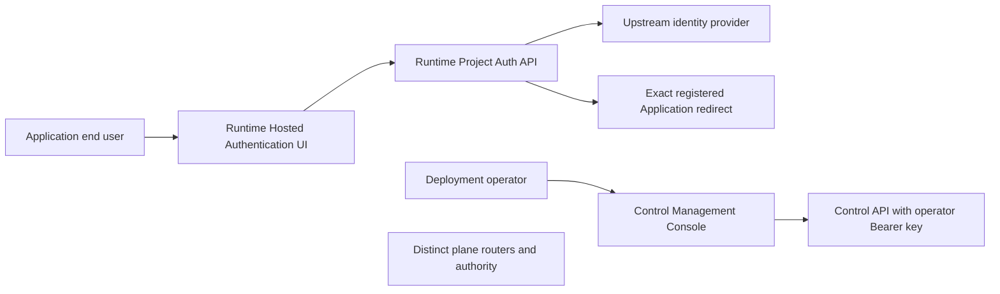
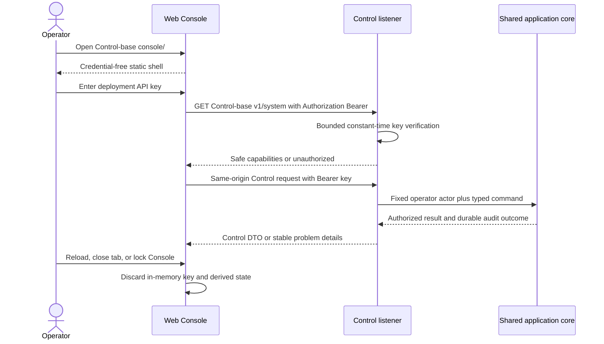

# 09 — Hosted web surfaces and Control API-key interaction

## Scope and product baseline

`owlauth-server` owns two browser surfaces with different actors and authority:

- the **Hosted Authentication UI** on Runtime, similar in product role to hosted authentication pages from Auth0 or Firebase, guides an Application's end user through a Project-bound login interaction and returns only to the exact registered Application redirect;
- the **Management Console** on Control lets the deployment operator administer OwlAuth through the ordinary Control HTTP contract.

Neither surface is a second backend. Both call their plane's reviewed HTTP/application boundary, never repositories directly, and own no alternate business rules. Runtime authentication pages never accept the operator key; the Management Console never acts as an end-user or Application authentication surface. [`Spec 12`](12-product-ui-and-interaction-design.md) owns their information architecture, visual language, and interaction patterns without changing these authority boundaries.

The standalone Control profile accepts exactly one deployment API key supplied through the `OWLAUTH_CONTROL_API_KEY` environment variable. An operator opens the Console, enters that key, and can then administer the deployment. After well-known endpoint discovery, this credential also authenticates the CLI and an enabled remote Streamable HTTP MCP Control endpoint, but never Runtime Project Auth, hosted login interactions, end users, Applications, provider callbacks, or Project tokens.

Additional Control credential classes, persistent management-principal administration, delegated scopes, and browser login/session protocols are outside the initial profile. Adding one requires an explicit specification and technology-selection update; it cannot become an implicit fallback.

## Browser surface separation and external URLs

Runtime and Control retain distinct internal listeners, routers, middleware, credentials, and resource budgets. The JSON-only Client listener is a third internal boundary with no browser surface or CORS; spec 13 owns its external URL and Project client-key rules. Their configured external base URLs MAY use different origins, such as `https://auth.example.com/` and `https://admin.example.com/`, or one origin with disjoint non-root path prefixes, such as Runtime at `https://auth.example.com/runtime/` and Control at `https://auth.example.com/admin/`. Distinct origins are RECOMMENDED because they preserve an additional browser-origin/XSS boundary around the in-memory deployment operator key.

A shared-origin deployment is valid only when explicitly configured through the trusted reverse-proxy model. Both base paths must be non-root, neither may prefix the other, and Runtime cookies must be host-only with `Path` contained by the Runtime base so they are not sent to Control. The proxy and server route each base path to the correct listener, never use a catch-all fallback across planes, register no service workers, and apply restrictive opener policy. Same-origin Runtime script execution can reach the Console browsing context; CORS or separate backend listeners cannot restore browser isolation, so the operator deliberately accepts one browser/XSS trust boundary for both surfaces. Routes below are relative to the configured plane base URL.

Each external base URL is immutable process configuration. Redirect, callback, cookie-path, asset, CSP, and API URL generation use that configured value rather than `Host` or untrusted forwarding headers. Runtime never serves Control routes/assets, and Control never serves hosted end-user authentication routes/assets.

## Management Console surface and ownership

The Management Console is present only on the Control listener in `all` and `control` composition modes.

| Control-base-relative route                                 | Authentication            | Purpose                                                                                               |
| ----------------------------------------------------------- | ------------------------- | ----------------------------------------------------------------------------------------------------- |
| `GET <control-base>/`                                       | none                      | redirect to the canonical `<control-base>/console/` URL when the Control base is dedicated to OwlAuth |
| `GET <control-base>/console/` and fingerprinted asset paths | none                      | load the credential-free Console shell                                                                |
| `GET <control-base>/v1/system`                              | deployment API key        | verify the key and return bounded Console bootstrap capabilities                                      |
| other `<control-base>/v1/*` Control routes                  | deployment API key        | execute the existing Control contract                                                                 |
| Control health route                                        | probe policy from spec 06 | deployment health, not Console login                                                                  |

The Runtime and Client listeners MUST NOT mount the Control-relative `console/` tree, Control assets, Control OpenAPI, or Control API routes. An unauthenticated Console shell contains no deployment data, Project identifiers, topology, version detail beyond ordinary static asset metadata, or credential-derived state.

## Hosted Authentication UI

The Hosted Authentication UI is present on the Runtime listener in `all` and `runtime` modes. It is Project/Application interaction UI, not the downstream Application itself and not a general OAuth authorization endpoint.

A representative Runtime-base-relative partition is:

| Route class                                                                  | Purpose                                                                                                                                                                                                                                                         |
| ---------------------------------------------------------------------------- | --------------------------------------------------------------------------------------------------------------------------------------------------------------------------------------------------------------------------------------------------------------- |
| `<runtime-base>/auth/interactions/{opaque_handle}`                           | first top-level GET conditionally binds one Runtime browser/CSRF context, then renders or continues one bounded Project/Application interaction                                                                                                                 |
| `<runtime-base>/auth/browser-logout/{opaque_preparation}`                    | render the no-store confirmation for one access-token-prepared Project browser logout; mutation requires matching cookie plus same-origin CSRF POST                                                                                                             |
| `<runtime-base>/auth/interactions/{opaque_handle}/email-link#<opaque_proof>` | load a no-store confirmation view, remove the fragment proof from history, and consume only through an explicit same-origin POST                                                                                                                                |
| `<runtime-base>/auth/managed-reauthorizations/{opaque_interaction}`          | bind and render one Control-created exact managed-connection reauthorization; explicit provider start and callback may replace only its fenced renewable credential generation and never issue Application credentials                                          |
| `<runtime-base>/auth/identity-mutations/{opaque_intent}`                     | bind and render only one Control-created identity-mutation proof ceremony; proof completion may attach one server-side slot receipt, and only a separate explicit final POST may mark all-current slots ready; neither can mutate identity or issue credentials |
| `<runtime-base>/auth/assets/{fingerprinted_asset}`                           | serve credential-free, version-matched hosted UI assets                                                                                                                                                                                                         |
| `<runtime-base>/projects/{project_public_id}/auth/callback/{provider_key}`   | stable exact upstream provider callback; no alias or generic fallback                                                                                                                                                                                           |
| `<runtime-base>/v1/projects/{project_id}/auth/*`                             | Runtime Project Auth API, including generic login start, transaction method selection, method-specific proof, handoff, session, and logout operations                                                                                                           |

Exact stable interaction paths are finalized with the Runtime HTTP contract, but they MUST stay outside the Control base and cannot use a generic fallback over `v1/*` or provider callback routes.

A hosted interaction resolves exactly one persisted class before rendering: an ordinary Application `login` transaction, a Control-created `identity_mutation` intent with immutable proof slots, or a Control-created `managed_reauthorization` interaction for one exact existing connection. There is no class fallback or conversion. Generic Application login start snapshots Project branding references, assigned active provider/email methods and revisions, Application metadata, exact redirect, PKCE, and policy without selecting a method or binding a browser. Only the first eligible top-level Hosted GET conditionally binds a fresh Runtime browser credential and CSRF state and advances that exact class's initial state. That bootstrap must be a top-level document navigation; it may legitimately be cross-origin from the Application or Control-delivered Hosted target, while subresources, API fetches, framed requests, page input, and a copied URL after another browser wins cannot bind or disclose it. Fetch Metadata distinguishes navigation from cross-origin fetch/subresource traffic rather than requiring a same-origin initiator. The page derives bounded presentation and safe next actions from that state. Each snapshotted provider method includes only its bounded key, operator-controlled display name, and the closed server-derived `oidc`, `google`, or `github` kind. Hosted renders the display name as untrusted text and may use only bundled local visuals selected by that kind; custom OIDC receives a neutral local treatment. It never receives or fetches issuer, discovery metadata, endpoint, remote logo, HTML, CSS, font, or script. Selection or fixed-provider start sends one same-origin CSRF-protected Runtime command with the expected interaction revision; the server revalidates the current captured assignment and compare-and-swaps exactly one admitted method/action. Query parameters and safe presentation hints cannot select/enable a method or replace stored Project, Application, provider assignment, email policy, managed connection, browser binding, PKCE challenge, callback, or redirect. Once provider authorization or email proof state begins, switching is rejected and restart creates a new typed interaction.

The email path owns enumeration-safe address entry/check-email, OTP entry/resend, magic-link completion, expiry/restart, and bounded delivery-unavailable screens. It clears proof values from URL/history/controls at the earliest safe point, never renders whether an account exists, and uses the newest generation/attempt rules in spec 11. Provider reauthorization and identity linking require distinct explicit transaction states and fresh proof; a matching email may be presented only as a non-authoritative suggestion and cannot silently link. Managed reauthorization opens only from one create-response-only Control target, renders one fixed provider for the frozen existing connection, requests exactly the adapter-declared managed scopes, and on success replaces only that connection's generation without user/session/handoff/receipt effects. A link/unlink/merge proof ceremony opens only from the create-response-only opaque Hosted target of one Control-created identity-mutation intent. The Hosted page renders only that intent's exact server-owned proof slots and their captured Application method-policy authority, binds one browser/CSRF context, and may attach successful provider/email receipts server-side; page input cannot name or replace users, identities, purpose, disposition, Project, Application, or assignment. A prospective link proof stores only immutable candidate evidence and cannot create/attach an identity. Its explicit final POST can only mark the intent `ready`. It returns no receipt value and performs no identity mutation; the Console later confirms the exact ready intent through Control under the operator key and expected intent revision.

Only successful provider or email authentication for an ordinary `login` interaction resolves the Project user and creates the one-use handoff described by spec 03. Navigation returns only to the exact Application redirect stored in the transaction. The return carries only the short-lived, one-use, Application/redirect/PKCE-bound handoff material permitted by spec 03; provider tokens, the operator key, refresh credentials, internal errors, and arbitrary caller-supplied redirect targets are never rendered or forwarded.

Hosted pages may provide admitted-method selection, selected-provider presentation, login progress, safe local error/restart, and logout interactions. When current policy and a valid hardened cookie permit Project browser-session reuse, the page may separately show a bounded “continue as” confirmation. Its POST supplies only CSRF/expected transaction revision; Runtime derives and revalidates the exact same-Project session/user/auth age and atomically competes with method selection on `awaiting_method_selection`. Page input cannot name a session/user or silently reuse one. The implemented picker is only a view over the explicit transaction selection contract and never trusts an arbitrary page value. They MUST NOT expose Project administration, cross-Project discovery, raw user directories, provider secrets, Control endpoint discovery, or Console links containing authority.

Hosted HTML, interaction responses, and error pages use `Cache-Control: no-store`, restrictive CSP/framing/referrer/permissions policies, and no third-party executable assets. Opaque interaction handles are redacted from access logs, telemetry, error reports, and referrers. Runtime cookies remain `Secure`, `HttpOnly`, host-only where possible, and scoped to the narrowest configured Runtime path. Hosted pages treat branding/profile/error content as untrusted and do not load caller-controlled remote scripts, styles, fonts, images, or navigation URLs.

Hosted Authentication UI and Management Console source/built assets belong to `crates/owlauth-server`. Under accepted selection TS-002, they use one private React/TypeScript/Vite package in the repository pnpm workspace but compile as independent Runtime and Control entry graphs, output roots, Vite manifests, normalized server manifests, OpenAPI clients, and `rust-embed` roots. Shared source is authority-free and no emitted chunk is shared across planes. Rust generates external-only production shells from validated manifests and configured plane bases; it does not use Vite-authored HTML, `<base>`, inline runtime configuration, or a generic filesystem/SPA fallback. Release packaging embeds both production trees into the single server binary/container; production does not require Node.js, a separate static-file service, CDN, or Internet access. Exact tool and validation boundaries are owned by [`TS-002`](technology/ts-002-hosted-web-and-asset-pipeline.md) and registered by spec 10.

## Control API-key configuration and verification

- `OWLAUTH_CONTROL_API_KEY` is required whenever the Control listener or remote HTTP MCP endpoint is enabled. Startup fails before binding those surfaces when it is absent, empty, malformed, or below the documented minimum strength. Runtime-only mode does not require it.
- The value uses the exact canonical `owl_ctrl_v1_<secret>` ASCII grammar from spec 06: `<secret>` is the 43-character unpadded base64url encoding of exactly 32 unpredictable bytes. OwlAuth does not accept alternate encodings or silently trim, normalize, generate, print, or persist it.
- Configuration keeps the secret in a redacted secret type. Request verification uses bounded parsing and constant-time verification; plaintext copies are not retained beyond what the process environment and verification mechanism require.
- A Control client sends `Authorization: Bearer <api-key>`. No query parameter, URL user info, form/body field, cookie, WebSocket subprotocol, forwarding header, or alternate legacy header is accepted as the key.
- Successful verification creates the fixed deployment-operator actor context with full Control authority as defined by spec 07. The key value, verifier, prefix, and derived fingerprint never appear in an actor identifier, response, metric, trace, log, or audit field.
- Authentication failure returns the stable non-enumerating Control unauthorized response. Rate and concurrency limits apply before expensive parsing or application work.
- Rotation replaces the environment secret and restarts or rolls every Control-capable process. A process accepts only its currently configured key; there is no undocumented previous-key grace period. Mixed-key rolling operation is an operator rollout concern and MUST NOT weaken request verification.

The environment variable is the initial deployment interface, not permission to expose secrets through generated configuration, process diagnostics, `/proc` guidance, crash output, or command-line arguments. Production deployment guidance SHOULD source it from the platform's protected secret injection mechanism.

## Management Console credential lifecycle

After capture, the Console clears the key input control and keeps the API key only in the active page's JavaScript memory. It MUST NOT write it to cookies, `localStorage`, `sessionStorage`, IndexedDB, Cache Storage, service workers, URL/history, DOM attributes, logs, telemetry, error reports, or exported settings. Reloading, closing, or explicitly locking the Console requires the key to be entered again. Before a `pagehide` document can be frozen into the browser back/forward cache, it clears the key, client, API responses, and authenticated rendered state. A later persisted `pageshow` remains locked and cannot restore or flash the prior authenticated DOM.

The Console sends the operator key only to routes under its configured Control base URL. It does not send or proxy it to the Runtime or Client base path, provider, analytics, error-reporting, font, image, or any third-party origin. API responses and rendered state are cleared when the Console is locked or authentication fails.

### One-time Project client-key reveal

Project client-key administration is an ordinary operator-authenticated Control workflow. The create dialog accepts only a bounded label, then displays the generated credential exactly once from the original successful response. The credential is kept only in a dedicated ref and imperative code node owned by that active dialog—not React state—and is never inserted into a reusable form default, global query cache, route state, notification history, browser storage, URL, analytics, or error report.

Copy is an explicit user action. The reveal dialog is non-dismissible. After the operator asserts that the credential is stored externally, the Console sends a revision-fenced, idempotent acknowledgement containing no credential; only its authoritative success or exact-key reconciliation showing acknowledgement clears the credential as stored. A recoverable failed acknowledgement leaves the credential and retry visible. Authentication failure instead locks immediately and clears the credential; a concurrent authoritative revoke also clears the now-obsolete credential, while acknowledgement/revoke revision conflicts reconcile one exact safe key record rather than trapping a stale dialog. Locking, navigation, reload, `pagehide`, persisted `pageshow`, or authentication failure unmounts/clears credential and response copies. Safe metadata, including nullable acknowledgement time, remains listable, but the credential cannot be revealed again. Every inventory page carries one bounded nullable active-unacknowledged authority, so create gating never scans unbounded revoked history. Any active unacknowledged row blocks another create across sessions; the operator may revoke it or acknowledge only if the originally revealed value was genuinely retained. An ambiguous create replay identifies the safe unacknowledged key record without promising recovery; while that same mount knows no credential was returned, it offers revocation only. Revocation uses the exact observed revision, names the safe key target, and requires destructive confirmation.

## Management Console browser security boundary

- Production Control access requires HTTPS directly or through the trusted-proxy model in spec 06. Loopback HTTP MAY be enabled only by an explicit development configuration.
- Console API calls are same-origin. Control CORS remains deny-by-default; enabling the Console does not create wildcard or reflected-origin CORS.
- The Console uses no credential cookie, so its Bearer-authenticated API requests do not rely on cookie CSRF tokens. State-changing requests still enforce the expected Control origin/fetch-metadata policy and reject cross-origin browser use.
- Production assets use a restrictive Content Security Policy with no third-party origins, no inline script, no `eval`, no workers, and no unreviewed dynamic code loading. Neither web surface registers a service worker or emits `Service-Worker-Allowed`; this is especially important when Runtime and Control share an origin. Framing is denied, referrers are suppressed, MIME sniffing is disabled, and permissions policy is minimal.
- The HTML shell and authenticated API responses use `Cache-Control: no-store`. Fingerprinted credential-free assets MAY be cached immutably.
- Rendering treats all Project, provider, user, audit, and error values as untrusted text. No Control value reaches raw HTML, script, style, navigation, or URL sinks without context-appropriate validation.
- Except for the one-time Project client-key create result defined above, the Console never renders provider secret bytes, API keys, private keys, session/refresh credentials, or arbitrary backend/vendor errors. Secret-setting workflows accept write-only input and display only committed safe metadata.
- A script executing in the Console origin can read the in-memory key; therefore XSS prevention and dependency review are credential-boundary requirements, not cosmetic frontend concerns.

## Console behavior and contract reuse

The Console discovers capabilities from authenticated Control responses and does not infer support from server version strings. It uses the separate Control OpenAPI 3.1 document from `crates/owlauth-types` through the generated `openapi-typescript`/`openapi-fetch` boundary selected in [`TS-002`](technology/ts-002-hosted-web-and-asset-pipeline.md). Runtime uses a separately generated Runtime document and cannot import or construct the Control client.

Every Console action preserves the Control contract's expected revision, idempotency, confirmation, command admission, bounded pagination, and safe error semantics. High-impact actions display the exact safe target and require explicit interaction, but UI confirmation never replaces server authorization or transactional invariants.

Console routing below the Control-base-relative `console/` path MAY use client-side navigation. A direct navigation to a Console route returns the shell without intercepting Control-base-relative `v1/*`, health, the configured Runtime base, hosted interactions, or provider callback routes.

The Console includes contract-backed workflows for provider onboarding and connection capability/state. Provider onboarding presents deliberate server-backed variants rather than one low-level form:

- **Google** first accepts one Project-owned stable provider key, then obtains secret-free registration guidance and shows the exact server-owned issuer, configured-Runtime callback URL, fixed scopes, consent behavior, and managed-profile policy. Client ID, write-only secret, display name, and managed-profile choice are admitted only after that review. No issuer, endpoint, scope, consent, callback, or capability override enters browser state or the request.
- **Custom OIDC** first accepts one Project-owned stable provider key and canonical issuer, then provides an explicit authenticated preflight before client credentials are requested. The result shows the configured-Runtime callback URL that the operator can copy into an upstream static client registration, plus canonical issuer, admitted endpoint origins, current Project egress mode/revision, fixed OwlAuth scopes/capabilities, and safe outcome classes. All canonical HTTPS origins are allowed by default, while exact-origin restriction is recommended. Changing key, issuer, provider variant, or policy invalidates the displayed result and clears secret input. Operators can copy the normalized origins into the separate revision-fenced exact-origin policy workflow, then run preflight again. Create remains available only from the current reviewed form values and the server repeats validation; the browser never constructs callback authority or submits a preflight capability as authorization.
- **GitHub** follows the same key-first registration-guidance path using its fixed named profile and never exposes managed-profile controls.

Provider client secrets remain only in the active password control and one short-lived request object. Variant changes, preflight, submit completion, navigation, lock, and authentication failure clear every secret copy; no result repopulates it. Preflight never accepts a secret. Revision conflicts require an explicit refresh and re-entry rather than automatic mutation replay. Egress failures are presented as actions to update the Project exact-origin policy or provider metadata without showing remote bodies, endpoint paths, or secret references. Policy editing requires the observed policy revision and warns that tightening can immediately make existing custom providers unavailable. The Console explains that `allow_all` trusts provider destinations chosen by the self-hosting operator and that exact origins are an optional least-privilege restriction.

The Console also supports explicit provider synchronize/reauthorize/revoke/disconnect; email method and OTP/magic-link policy; write-only Project SMTP configure/test/activate/default opt-in; user revision/source provenance and explicit identity proof/link/merge; and Application webhook endpoint/secret rotation/delivery health/immutable replay. It renders safe state/reason classes, never raw provider/SMTP/webhook credentials, recipient message bodies, webhook bodies, or vendor errors. Test delivery and webhook replay are explicit audited commands, not generic URL/payload tools.

Accessibility and keyboard operation are release requirements. Responsive layout SHOULD support ordinary desktop and tablet administration; a separate mobile application is not part of this surface.

## Explicit exclusions

The initial Console and API-key profile do not provide:

- end-user sign-in to the administrative Console;
- multiple API keys, per-user operators, delegated scope assignment, or organization RBAC;
- API-key creation, listing, recovery, rotation, or revocation through OwlAuth itself;
- persistent browser login, “remember me,” credential cookies, or local key storage;
- direct PostgreSQL/Redis/key-provider access from the browser;
- a second Console-only API or server-side business implementation;
- Console assets on the Runtime listener;
- third-party analytics, CDN assets, remote fonts, or runtime-loaded plugins.

An external RBAC gateway may keep the deployment API key server-side and expose a narrower product UI, as defined by spec 07. It MUST NOT forward this key to its end-user browser.

## Acceptance criteria

Before the hosted web surfaces are considered implemented:

01. `runtime` and `all` expose hosted authentication only on Runtime; `control` and `all` expose the Management Console only on Control;
02. distinct-origin and explicitly configured shared-origin deployments both preserve internal listener/router separation, generated external URLs, route fallbacks, and opener policy; shared-origin tests prove disjoint non-root bases, Runtime cookie-path containment, no service workers, and documented acceptance that the two surfaces have no browser/XSS credential isolation;
03. every Hosted route recovers exactly one persisted `login`, `identity_mutation`, or `managed_reauthorization` class with no fallback; generic login start snapshots allowed methods without binding a browser, exactly one eligible first top-level GET can bind the exact typed interaction, and browser/CSRF/expected-revision tests prove exactly one later provider/email selection, fixed managed-provider start, or eligible browser-session reuse wins as applicable, while rejecting copied-browser disclosure, method switching, caller-named session/user/connection, stale/logged-out/cross-Project reuse, or replacement of provider, scope, email policy, callback, redirect, browser binding, or PKCE values;
04. successful provider, OTP, or magic-link authentication for `login` returns only to the exact stored Application redirect with the bounded one-use handoff; `identity_mutation` instead enforces server-derived proof roles, exact captured Application method authority, prospective evidence without identity creation, no Project session/redirect/handoff, one receipt per slot, and a separate explicit Hosted ready transition before Control confirmation; `managed_reauthorization` requires the exact existing identity/connection and managed scopes and can commit only its generation-fenced successor/profile/audit with no user/session/handoff/receipt effect; enumeration-safe/check-email/error/restart paths cannot reveal account existence or become open redirects;
05. Runtime never accepts or receives the operator key, and plane-specific asset manifests cannot be served by the other plane;
06. `all` and `control` fail closed without valid `OWLAUTH_CONTROL_API_KEY`; `runtime` starts without loading it;
07. only the Bearer header authenticates Control, comparison is constant-time, and credential values are absent from all observable outputs;
08. the Console can be loaded without a credential, validates an entered key through the Control-base-relative `v1/system`, and then uses only the existing Control API under that base;
09. reload, close, lock, authentication-failure, and back/forward-cache restoration tests prove no supported browser storage contains the key and no persisted page restores authenticated rendered state;
10. CSP, framing, referrer, cache, MIME, permissions, CORS, origin, fetch-metadata, and malicious-rendered-value policies have integration tests for both surfaces;
11. direct client navigation cannot shadow either plane's API, health, hosted interaction, asset, or provider callback routes;
12. the production binary/container serves both embedded asset sets without Node.js, a sidecar, a CDN, or network fetches;
13. generated or checked client drift fails CI when Runtime or Control contracts used by a surface change;
14. high-impact Console workflows preserve expected revisions, idempotency, explicit confirmation, and audit semantics;
15. security tests cover DOM injection, malicious URLs, oversized values, unauthorized responses, rate limits, redirect abuse, cross-plane route confusion, and secret redaction;
16. TS-002 validation proves independent manifest closures, normalized-manifest rejection cases, reproducible compressed variants, debug/release embedding, offline Cargo packaging, and one identical web-assets digest across binary/container release consumers;
17. email entry/resend/OTP/magic-link/expiry and provider-reauthorization/explicit-link screens pass keyboard, accessibility, history/token clearing, generation, generic-error, and malicious-input tests;
18. Console provider-connection, SMTP, user-provenance/linking, and webhook workflows use only generated Control contracts, preserve write-only secrets and immutable replay, and display no credential, message/event body, or unsafe endpoint value;
19. Google onboarding derives and rejects overrides for its exact server policy; Google, GitHub, and custom OIDC all display the server-derived configured-Runtime callback before credentials are requested; both preflight contracts reject secrets and callback overrides and carry no commit authority; custom discovery is repeated before persistence; changing variants/key/issuer clears preflight and secret state; GitHub remains login-only; and Hosted renders only the snapshotted closed kind with local assets and bounded text.
