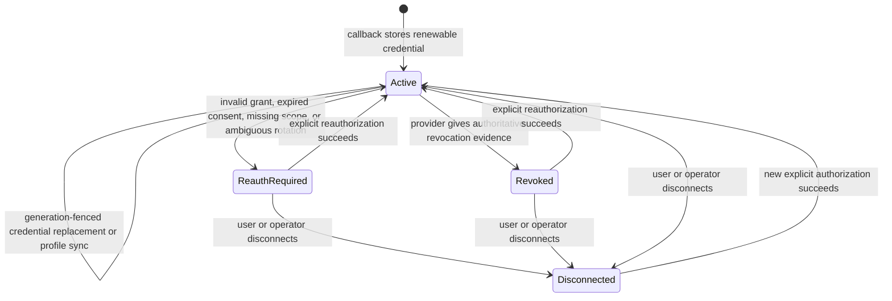
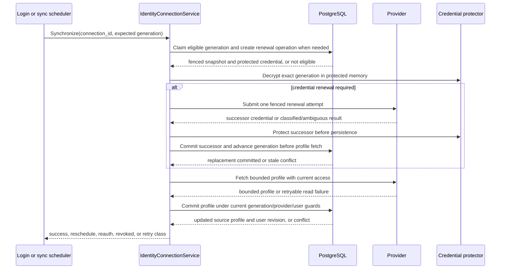
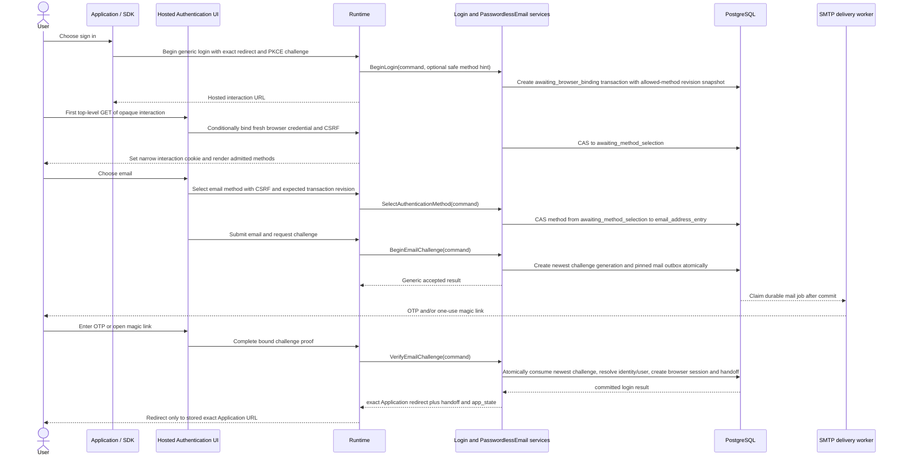
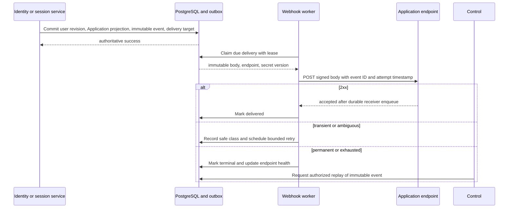

# 11 — Identity connections, passwordless email, and Application user synchronization

## Scope and product decisions

This document owns three related identity-lifecycle concerns that extend the Project Auth model:

1. **managed upstream identity connections:** OwlAuth may retain a provider-issued renewable credential solely to refresh the linked identity's bounded source profile;
2. **first-party passwordless email:** a Project may authenticate a verified email identity with a one-time code or one-use magic link delivered through Project-selected SMTP;
3. **Application user synchronization:** an Application receives a revisioned bounded user projection in Runtime responses and may subscribe to signed, durable asynchronous projection events.

These capabilities remain Project-scoped and use the same Project user, login transaction, handoff, session, and explicit identity-linking rules as specs 03 and 04. They do not turn OwlAuth into an upstream-token broker, mail-marketing service, general event bus, or directory-provisioning product.

The initial profile explicitly excludes:

- returning provider access tokens, refresh tokens, authorization codes, or reusable provider credentials to an Application;
- proxying arbitrary provider APIs or accepting arbitrary provider scopes for downstream use;
- silently linking identities because email, name, picture, or another profile field matches;
- password authentication, password reset, SMS, SAML, SCIM, LDAP, bulk/full user-directory export, or incremental directory feeds;
- arbitrary webhook event bodies, caller-supplied signing algorithms, and synchronous Application callbacks on a login transaction's critical path.

## External capability check and deliberate differences

The product boundary was checked against current official Auth0 and Firebase documentation rather than inferred from product names:

| Observed pattern                                                                                                                                                                                                                                                        | OwlAuth decision                                                                                                                                                              |
| ----------------------------------------------------------------------------------------------------------------------------------------------------------------------------------------------------------------------------------------------------------------------- | ----------------------------------------------------------------------------------------------------------------------------------------------------------------------------- |
| Auth0 supports email OTP and magic links, newest/one-use challenges, short expiry/attempt limits, Application assignment, and custom SMTP. Firebase supports email-link sign-in, verified email ownership, authorized continuation domains, and enumeration protection. | Support both OTP and magic link, with Project/Application/redirect/PKCE binding, generic start responses, Project rate policy, and durable SMTP delivery.                     |
| Auth0 keeps identities separate by default and requires proof of both accounts for linking. Firebase links a fresh provider credential to an already authenticated user.                                                                                                | Preserve issuer/subject identity lookup and require explicit recent proof of both identities. Matching verified email may suggest a link in UI but never performs one.        |
| Auth0 can refresh normalized provider profile attributes on first or every login. Firebase exposes one stable local user plus provider-specific profiles.                                                                                                               | Store a bounded source profile per identity, map it deterministically into a local projection, and support login-triggered plus provider-capability-gated background refresh. |
| Auth0 Connected Accounts can store provider tokens for delegated external API use; Firebase browser flows can expose provider OAuth credentials to a client.                                                                                                            | Deliberately do not provide that capability. A retained credential is server-only, least-scope, and usable only by the identity-profile synchronization adapter.              |
| Auth0 event streams document duplicate/out-of-order delivery and retries; Firebase exposes auth lifecycle functions and privileged user management/listing.                                                                                                             | Provide a smaller per-Application projection webhook with immutable event IDs, monotonic user revisions, HMAC signatures, durable delivery/replay, and no bulk directory API. |

Research sources, snapshots, and the detailed gap analysis are retained in the gitignored `local-reference/identity-expansion/` workspace. The normative behavior is this specification, not competitor behavior.

## Terminology and ownership

| Concept                     | Meaning                                                                                                                                                         |
| --------------------------- | --------------------------------------------------------------------------------------------------------------------------------------------------------------- |
| Provider configuration      | Project-owned OAuth/OIDC client registration and Application assignment from specs 01–05. It is not a user's consent or credential.                             |
| Linked identity             | Stable canonical `(project_id, provider_issuer, provider_subject)` proof attached to one Project user and unique across provider registrations in that Project. |
| Managed provider connection | Optional lifecycle and encrypted renewable credential for one linked identity, used only to retrieve that identity's bounded source profile.                    |
| Email identity              | First-party Project identity proving control of one canonicalized email address; it is not an upstream provider identity.                                       |
| Email challenge             | Short-lived, generation-controlled OTP or magic-link proof with an XOR owner: one ordinary login transaction or one exact identity-mutation intent/proof slot.  |
| Source profile              | Bounded provider/email-origin attributes plus source and observation metadata; never an arbitrary provider payload.                                             |
| User projection             | Versioned, policy-approved representation of one Project user exposed to a particular Application.                                                              |
| Application-user binding    | Durable record that the user has been delivered to that Application; it prevents synchronization to unrelated Applications in the Project.                      |
| Projection event            | Immutable Application-specific snapshot and revision delivered by webhook.                                                                                      |

Spec 04 owns the PostgreSQL representation and transaction constraints. A linked identity's immutable `created_via_provider_configuration_id` records only the same-Project registration that first created it; it is creation provenance, not authorization ownership. A later callback through another registration with the same canonical issuer may resolve that identity only after the current registration and Application assignment are active and the verified issuer exactly matches the current registration's canonical issuer. Spec 05 owns stable wire DTOs and routes. Specs 06 and 08 own worker composition, dependency failure, resource limits, and operations. Spec 09 owns browser routes and security. This document owns lifecycle meaning, information-flow limits, and cross-surface behavior.

## Managed upstream provider connections

### Lifecycle

A linked upstream identity may have at most one managed connection for its provider configuration. The connection state is one of:



- `active` means a current encrypted renewable credential is available and the provider configuration/identity is eligible for synchronization. It does not guarantee that the remote provider is currently reachable.
- `reauth_required` means OwlAuth cannot safely renew the credential or required profile consent is no longer sufficient. Automatic refresh stops. A Control-requested recovery uses only the exact `managed_reauthorization` interaction below and cannot be implemented or satisfied by an ordinary login. A later Application-initiated login may independently retain a new eligible managed credential under current login policy, but it is not a replay or completion of any Control-created reauthorization interaction.
- `revoked` requires provider-origin evidence or a successful explicit provider revocation action. A generic timeout or ambiguous response does not prove revocation.
- `disconnected` is a local terminalization of the current credential generation. Recoverable credential material is erased or made cryptographically inaccessible and background synchronization stops. A later connection is a new generation.

Provider configuration disablement, Application unassignment, and Project/user disablement are separate authoritative states. They make login/synchronization ineligible without inventing a connection-state transition. Unlinking the linked identity disconnects its managed connection in the same Project transaction and must not leave usable credential material.

### Explicit managed reauthorization

Managed reauthorization is a persisted `managed_reauthorization` interaction class distinct from ordinary Application `login` and `identity_mutation`. Control idempotently creates one interaction for an exact existing same-Project user, provider identity row, managed connection, expected connection and credential generations plus relevant user/identity/provider/assignment authority revisions, and one exact active Application/provider assignment used as current authorization-policy authority. V1 maintains a monotonic connection generation for lifecycle/remote-work fencing and a monotonic credential generation for the versioned renewable ciphertext; credential replacement advances both, while a destructive lifecycle transition may advance the connection fence without inventing a successor ciphertext. The server—not page input—freezes the callback, adapter-declared managed scopes/capability revision, provider/assignment revisions, whether provider PKCE is required, the mandatory OIDC-nonce requirement, ten-minute deadline, and opaque Hosted handle at creation. The raw Hosted target is returned only by create and its purpose-bound deployment-operator idempotency replay through expiry; later reads expose only bounded safe status/revision and never the target or credential material. Handle authentication and create-result protection use the dedicated managed-reauthorization target ring described by spec 06: Control holds only its narrow issuer, Runtime holds its verifier, and Control never receives generic Runtime protection roots.

The first eligible top-level Hosted GET binds one fresh interaction-browser credential and CSRF context. A separate explicit same-origin POST atomically advances the exact current interaction from `awaiting_provider_start` to `provider_authorization_started`, generates fresh upstream state, a conditional provider PKCE verifier/challenge, and mandatory OIDC nonce, stores only their required purpose-bound digest/ciphertext validation material, and immediately returns the authorization redirect carrying those exact values. A later request cannot regenerate them, and the start cannot select another provider, connection, user, Application, assignment, scope, callback, proof, or Project. The shared stable provider callback resolves this typed owner before external I/O and atomically claims `provider_exchange_in_progress`. A callback that loses that claim is read-only and cannot terminalize the winner's exchange. Exact wire statuses are `awaiting_browser_binding`, `awaiting_provider_start`, `provider_authorization_started`, `provider_exchange_in_progress`, `completed`, `provider_exchange_failed`, `expired`, and `cancelled`; terminal interactions never reopen, and retry creates a new interaction.

Successful completion requires the exact frozen issuer/subject, existing identity/user/connection, current provider/Application assignment and managed capability, exact managed scopes, and one valid renewable successor. One Project transaction protects and commits the successor, advances both connection and credential generations, makes every predecessor inaccessible, restores `active`, consumes the interaction, and audits. Only after that commit may the memory-only access token drive optional bounded provider profile I/O. Already returned validated callback claims may skip that extra call, but any profile result commits only in the separate current-generation profile-sync transaction, including guarded `user_revision`, affected projections, and immutable event/delivery effects; profile failure or a crash cannot roll back or discard the safer successor. A different or unknown identity, absent renewable credential, scope mismatch, stale generation/revision, or disabled authority terminalizes only when observed by the callback that claimed the interaction, without creating or moving a user or identity. A duplicate callback that loses the claim only receives a bounded in-progress or terminal response. Managed reauthorization creates no Project browser session, Application session, handoff, receipt, candidate evidence, or ownership mutation and cannot fall back to login or identity mutation.

### Credential boundary

A provider adapter declares whether it supports renewable profile access, which exact least-privilege scopes it requires, whether refresh tokens rotate, how revocation is classified, and which bounded source fields it can return. Unsupported providers remain login-only and never create a managed connection.

The v1 named-adapter registry is closed. Generic `oidc` managed access requests exactly `offline_access openid profile`. Google managed access requests exactly `openid profile` and obtains renewable access through Google's authorization parameters `access_type=offline` and `prompt=consent`; `offline_access` is neither advertised nor requested for Google. GitHub requests exactly `read:user`, uses the immutable nonzero numeric REST user ID as subject, and remains login-only. Each kind has a distinct immutable capability key and exact scope snapshot. All adapters validate the OwlAuth Runtime callback with one deployment policy—HTTPS, plus explicitly enabled exact IP-literal loopback HTTP—independently of their upstream endpoint-origin policy.

### Provider registration and onboarding

Adapter behavior and operator onboarding are distinct concepts. The only executable adapter kinds remain
`oidc`, `google`, and `github`. A custom OIDC connection—equivalent in product role to a custom OIDC
connection in products such as Supabase—is a Project-owned registration of the strict `oidc`
adapter, not a caller-defined adapter kind. It accepts one canonical non-reserved issuer, client ID,
write-only client secret, bounded key/display name, managed-profile choice, and Application
assignments. It never accepts custom code, arbitrary OAuth mode, endpoint override, scope, claim
mapping, token forwarding, or downstream provider API authority.

Google is a server-authoritative preset over the named `google` adapter. The operator supplies only
Project-owned presentation/key and client-registration values. OwlAuth derives the exact issuer,
fixed endpoint-origin set, callback, scopes, PKCE/nonce requirements, managed-profile capability,
and managed-consent parameters. GitHub follows the same derived named-profile rule while retaining
its login-only capability. Supplying a named-provider issuer or another low-level override is an
invalid request; values are never silently ignored.

Each Project owns custom OIDC egress policy. The default `allow_all` mode enables direct connection
to any canonical HTTPS provider origin, including destinations in networks managed by the
self-hosting operator. The recommended `exact_origins` mode narrows discovery and every endpoint to
a bounded canonical origin set. This is Project authority, not process-global origin configuration,
and it never changes the fixed Google/GitHub named profiles. OwlAuth does not impose an additional
DNS/IP destination-classification layer. IP-literal loopback HTTP is development-only and requires
the process development opt-in plus a matching origin when exact mode is selected.

Custom OIDC preflight validates only whether the proposed issuer's current discovery metadata can
satisfy OwlAuth's fixed protocol profiles under the current Project policy revision. It proves
neither provider ownership nor future availability and creates no durable registration or trust
token. Creation repeats the same discovery, endpoint-origin, capability, and policy validation before
any provider row or client-secret write. A custom OIDC provider may be created with managed profile
enabled only when that repeated discovery advertises UserInfo plus `offline_access` and the common
strict requirements. Runtime later reads current Project policy and repeats discovery and endpoint
admission for every login, proof, renewal, reauthorization, or profile operation;
metadata or policy drift makes the affected operation unavailable and cannot widen its scope or
destination set. A provider that remains valid for login but loses managed-profile facts cannot
silently downgrade a managed request into ordinary login or retain an unsupported renewable
credential.

Provider display name and closed kind may enter public configuration and the snapshotted Hosted
method roster. Issuer, client ID, discovery metadata, endpoint origins, capability diagnostics,
client secret, and provider tokens do not enter Hosted pages, Application projections, handoffs, or
SDK credentials. Hosted presentation uses only bounded text and local kind-selected assets.

In v1, each renewable credential is versioned, purpose-bound AEAD ciphertext in PostgreSQL under its dedicated managed-credential ring. The authenticated context binds deployment, Project, provider configuration, linked identity, connection generation, credential generation, and field purpose. Provider client secrets, SMTP credentials, and webhook secrets also use PostgreSQL-resident opaque envelopes, but through the separate key-provider SPI and protected-material lifecycle owned by specs 02, 04, and 06. Neither path is an external generic-secret-store/database dual write, and neither exposes plaintext through configuration or DTOs.

A renewable credential:

- is decrypted only inside the provider-profile synchronization adapter for that exact connection generation;
- is replaced only by a generation-fenced commit, and every replacement advances the credential/connection generation even when the provider returns an equivalent token value;
- makes the predecessor locally inaccessible after the replacement commit;
- never enters Runtime/Client/Control DTOs, user projections, webhook payloads, redirects, logs, audit safe context, Redis, or an Application process;
- is not usable to request caller-selected scopes or provider resources.

An adapter separately declares whether its read-only profile fetch is safely retryable and whether renewable-credential rotation supports an idempotent replay mechanism. Rotation is never assumed idempotent. A durable renewal operation records the expected/successor generation and attempt identity. Before the external call, OwlAuth commits it as `submitted`; a crash while merely `prepared` permits a new claim, while any crash/lease loss after `submitted` is conservatively ambiguous even if the remote request may not have left the process. If the response is lost or OwlAuth cannot prove whether the provider consumed/rotated the credential, it must not present the old credential again unless that adapter can replay the exact attempt idempotently. Otherwise a guarded commit advances the generation, destroys access to the old credential, and sets `reauth_required`. A received successor credential is protected and committed before any optional read-only profile fetch; failure of that fetch cannot discard or roll back the safer successor. The successor commit retains the exact connection lease and the Project/provider outbound budget through that post-successor stage. Success, classified failure, and the no-profile path validate and release the same owner; another worker may reclaim only after the retained lease expires. Durable renewal-operation terminalization may complete before this profile-stage lease is released and does not release that scheduling/budget authority by itself.

Provider access tokens obtained by renewal are memory-only and bounded to one synchronization attempt. OwlAuth stores no general provider-token vault. Disconnect attempts provider revocation when the adapter supports it, but local credential destruction does not claim remote revocation after an ambiguous response.

### Login-triggered and background profile synchronization

Provider callback completion always validates the stable issuer/subject first. It then maps a bounded callback profile and, only when explicit consent yielded a renewable credential, prepares a managed-connection update. Profile mapping has an allowlisted schema, per-field size limits, source timestamps, and a deterministic precedence policy. Provider payload extensions are ignored unless a reviewed adapter revision admits them.



No PostgreSQL transaction is held during provider I/O. A short claim/lease bounds concurrent work but is not authority. Read-only profile fetch may be retried only when the adapter declares it safe. Renewal uses the durable operation and expected generation; lease loss after credential submission is an ambiguous protocol outcome, not permission to reuse the predecessor. Final compare-and-swap on connection generation and captured revisions rejects output from a stale, disconnected, unlinked, disabled, or reauthorized connection.

- Login-triggered sync uses the callback result and must not make handoff completion depend on a second optional provider call when required identity claims are already validated. A callback-provided renewable credential still commits as a new generation before later optional sync.
- Background sync is enabled only by Project policy and adapter capability, uses bounded jittered scheduling, and has per-Project/provider concurrency and retry budgets.
- Transient read-only profile failures retain `active`, record a safe failure class, and reschedule with bounded exponential backoff. A transient renewal response is retryable only through an adapter-declared idempotent replay of the same durable attempt.
- `invalid_grant`, expired consent, required-scope loss, or an ambiguous non-replayable rotation moves to `reauth_required` under the expected-generation guard; provider-confirmed revocation moves to `revoked`.
- Profile changes advance `project_users.user_revision` only when the materialized Application-visible base projection or user security state changes. Observation timestamps alone do not create revision churn.
- Every successfully committed renewable-credential replacement advances generation, supersedes prior material, and may restore `active`; this rule is not limited to login.

## First-party passwordless email

### Email identity and linking

An email identity is unique by its canonical address within a Project. OwlAuth applies one versioned canonicalization algorithm before computing versioned keyed lookup digests; it does not perform provider-specific dot removal, plus-address rewriting, Unicode guessing, or mailbox equivalence. Each identity can retain old/new lookup aliases during digest-key rotation. Lookup computes every accepted version, creation rejects a match under any accepted alias, and rotation backfills/uniqueness-checks the new alias before switching writes, so key rotation cannot create a duplicate identity. The recoverable normalized address is protected as Project PII and is returned only when Project/Application projection policy allows it.

In an ordinary Application login, successful OTP or magic-link completion proves control of that email address for that challenge and creates or resolves the Project email identity atomically before producing the ordinary browser session and handoff. It never searches provider identities by email and never attaches itself to a different existing user merely because a provider profile has the same email. Linking an email identity to an existing provider-backed user requires fresh purpose-specific proof; linking two identities that already resolve to different users is always an explicit merge under spec 04 rather than link-by-match.

### Identity-mutation proof interactions

Identity link, unlink, and merge use a persisted `identity_mutation` interaction class distinct from an Application `login` transaction. Control creates one short-lived revisioned intent; the domain derives immutable mandatory roles rather than accepting an arbitrary slot list. Link always requires fresh proof of one exact destination-user identity in `destination_owner` plus one prospective `candidate_identity`; unlink requires fresh `identity_owner` proof of the exact identity removed; merge requires fresh `winner_owner` and `loser_owner` proof bound to their respective users. Control may select an eligible identity/method authority for each required role but cannot omit, duplicate, or weaken a role. Each slot freezes the exact Project, operation/purpose, destination or existing user and expected revisions, identity kind, one active Application used only as proof-policy authority, and the exact provider or email method assignment plus captured revisions. Provider slots therefore use a current assigned provider configuration, its adapter-declared non-renewable authentication/profile-proof scope subset, server-owned callback, mandatory OIDC nonce, and provider-side PKCE only when the reviewed provider profile requires/supports it; they never request offline access or managed scopes and discard any unexpectedly returned renewable credential after bounded proof extraction. Email slots use that Application's current assigned email method/policy and a challenge pinned to its current SMTP generation/eligibility revision. The Application supplies no redirect or PKCE credential and receives no handoff, session, projection, or identity mutation from this interaction. An intent cannot use creation provenance as current provider authorization, and page input cannot replace the frozen Application, assignment, user, identity kind, purpose, or method target.

An unlink or merge role names an exact existing identity; link's destination-owner role does too. Link's candidate role instead freezes the destination user plus intended identity kind and proof eligibility because a new provider subject or email identity does not exist before proof. Successful provider/email candidate proof stores one immutable purpose-bound short-term ciphertext containing canonical provider issuer/subject plus bounded admitted profile/current registration evidence, or every accepted versioned email lookup alias plus normalized address; only kind, key version, context-bound digest, and candidate revision remain outside ciphertext. It does not create or attach a durable identity, user, Project browser session, or handoff. Final Control confirmation decrypts under exact context, rechecks current authority/accepted aliases and the evidence digest/revision, locks the identity namespace, and atomically creates/attaches the identity to the frozen destination user. If the candidate has become owned by any user, link fails without movement; linking two existing owners requires a new merge intent. Successful confirmation copies only admitted durable identity material and deletes candidate evidence in the same transaction. Completion, expiry, or cancellation deletes/crypto-erases temporary candidate evidence within fifteen minutes; restore performs terminal cleanup before claims, and missing short-term candidate keys terminalize only affected intents.

A v1 recent-proof receipt is purpose-, intent-, and slot-bound, one-use, expires no later than five minutes after its successful proof, and binds the exact Project, identity-mutation interaction browser-binding digest/revision, destination/existing user revisions, and either the exact existing identity revision or immutable candidate-evidence revision. Mutation proof neither requires nor creates a Project browser session; any future policy allowing recent-session evidence must define a distinct server-derived slot with exact user/session/security snapshots rather than weakening every receipt. Each required slot accepts at most one receipt; a receipt belongs to exactly one intent/slot and cannot satisfy another slot or intent. Attachment compare-and-swaps only that slot to `proved`, increments the intent revision, and leaves the intent `pending_proof`. After every mandatory role is proved, the separate explicit Hosted browser/CSRF confirmation compare-and-swaps current `pending_proof` to `ready` under the effective deadline and expected intent revision, then increments the intent revision. Receipt capability bytes never cross into Control, URLs, redirects, browser storage, or read DTOs.

The exact intent wire statuses are `pending_proof`, `ready`, `completed`, `expired`, and `cancelled`. Cancellation remains safely readable through bounded intent retention. The effective confirmation deadline is `min(intent_expires_at, earliest_attached_receipt_expires_at)`; expiry atomically terminalizes the intent and any non-consumed slots/receipts. A stale `ready` observation cannot authorize confirmation, and recovery always creates a new intent rather than replacing a receipt or reopening a terminal intent. Control reads expose only operation kind, status, revision, expiry, and safe slot readiness. Control confirms by intent ID plus expected intent revision; the final Project transaction revalidates and consumes attached receipts, creates/attaches/moves or unlinks identities as frozen, completes the intent, and appends the deployment-operator audit. There is no generic receipt-mint/read endpoint, and ordinary login or browser-session reuse cannot attach a receipt to an identity-mutation intent.

Typed ownership applies before every external or one-use effect, not only completion. Mutation method selection stores its exact slot state, callback snapshot, upstream-state digest, conditional provider-PKCE verifier, OIDC nonce, expiry, and captured authority. The shared provider callback resolves the stored class before I/O; one claim transaction compare-and-swaps either the login transaction or exact intent/slot into exchange-in-progress, and completion reuses that class. Email challenge creation likewise owns an XOR reference to either the login transaction or exact intent/slot and compare-and-swaps the typed owner before committing challenge/proofs/outbox. `login` completion follows the ordinary identity/browser-session/handoff kernel. `identity_mutation` completion can only commit candidate/existing-identity evidence, one slot receipt, and the intent/slot revision transition; it cannot resolve/create a Project user, create/rotate a Project browser session, issue a handoff, or mutate identity ownership. Failure is terminal or retryable only under that interaction class's stored state and cannot fall back to ordinary login.

### Login start, method selection, and challenge creation

The Application starts one generic `awaiting_browser_binding` login transaction with active Project/Application, exact redirect, PKCE S256, bounded Application state, trusted Runtime origin, and a snapshot of all currently assigned methods. It may supply a safe presentation hint, but cannot select or start a provider/email proof. The first eligible top-level Hosted GET performs the one-browser/CSRF binding from spec 03 and advances the transaction to `awaiting_method_selection`; only then does the Hosted UI render that snapshot. One explicit Runtime command compare-and-swap selects exactly one method while revalidating current assignment/policy: provider selection starts upstream authorization; email selection moves to address entry, and a later explicit email-challenge command accepts the address and creates the newest challenge/outbox. Once provider exchange or email proof state begins, the method cannot change. Restart creates a new transaction.



The email-challenge response is generic and materially equivalent whether the address is new, existing, disabled, blocked by sign-up policy, or rate-limited. When policy forbids new users, OwlAuth may suppress delivery for an unknown digest but does not disclose that choice. Rate policy combines Project, Application, keyed email digest, trusted client address, and abuse signals without using raw email as a metric label or log field. Transaction state/revision, browser binding, same-origin CSRF, allowed-method snapshot, and current method-policy revision govern every selection/address/resend/proof command.

Creating a challenge and its mail-outbox item is one PostgreSQL transaction. SMTP is never called inside it. A challenge binds:

- Project, Application, exact redirect entry, PKCE S256 challenge, login transaction, and relevant revisions;
- canonical email lookup digest and recoverable address ciphertext/reference;
- allowed proof set (`otp`, `magic_link`, or both), parent generation/expiry, and per-proof digest/attempt policy;
- browser interaction where policy requires it, without weakening Application PKCE when a link opens in another user agent;
- exact Project/default SMTP selection, nullable Project configuration ID, generation, and security-eligibility revision shared by the challenge and its outbox row.

Issuing generation `n+1` invalidates every older unconsumed generation for the same login/email challenge family. Mail retries may produce duplicate copies of the same generation; they never mint a new proof. A new proof requires a new committed generation.

### OTP and magic-link proof

- OTPs are CSPRNG-generated, fixed-length values stored only as a keyed digest with key-version metadata. Comparison is constant-time after bounded structural parsing. Server-enforced v1 floors/ceilings require at least 6 decimal digits, at most 10 minutes of validity, and at most 5 failed attempts per generation.
- A failed OTP attempt increments the authoritative attempt count atomically. Exhaustion terminalizes that generation. Resend is no faster than once per 30 seconds, at most 5 challenge generations may be issued per login transaction, and the complete login transaction uses spec 03's fixed 10-minute lifetime, which Project policy cannot change. Project policy may tighten the email-proof validity, resend, generation, and attempt ceilings but never weaken them; deployment-wide abuse controls may be stricter.
- Magic-link tokens contain at least 128 bits of CSPRNG entropy and have a Project-configurable v1 validity ceiling of 10 minutes. Their effective expiry is `min(configured_magic_link_expiry, login_transaction.expires_at)`, so issuance late in a transaction exposes the shorter remaining lifetime; configuration outside the realizable 10-minute ceiling is rejected. Tokens are stored only as keyed digests. The email link carries the raw proof in the URL fragment so it is not sent in the initial HTTP request; the Hosted UI removes it from URL/history immediately, then requires an explicit user Continue action that submits a same-origin CSRF-protected POST. Link-preview/security scanners performing GET cannot consume the challenge. Hosted pages load no third-party content and use `no-store`/strict referrer policy.
- Same-browser magic-link completion requires the original interaction browser binding. When Project policy permits completion in another user agent, the generic link document may establish only a separate short-lived, purpose-bound transfer-confirmation cookie and CSRF context. That context carries no Project user, browser-session, Application-session, or login authority; its GET neither receives nor validates nor consumes the fragment proof and does not rebind the original interaction. The explicit POST submits the in-memory proof with that transfer CSRF context, then resolves and revalidates the exact stored transaction, challenge, Project/Application/redirect/PKCE facts, policy, newest generation, and expiry. Multiple bounded transfer contexts may race, but the one conditional parent consumption remains the sole winner.
- Successful OTP and magic-link completion derives return-navigation policy from the trusted Application type stored with that exact interaction, never from fragment, form, or response input. Web Applications remain HTTPS-only; native Applications may use only their exact pre-registered native redirect URI/custom scheme under spec 03 validation. The one-use proof is not consumed into a navigation target that would subsequently be rejected merely because the Hosted surface guessed the wrong Application type.
- OTP and magic-link proofs are separate children of one challenge generation when both are enabled. Exactly one verifier can transition the parent newest challenge from pending to consumed, invalidating every sibling proof. Concurrent or later submissions receive the same generic invalid/expired result and cannot receive handoff material.
- Completion revalidates Project/Application/email-method/user status, exact redirect registration, transaction and challenge generation, PKCE challenge, and policy/security revisions.
- The final transaction resolves or creates the email identity and Project user, creates the Project browser session and one-use handoff, advances `user_revision` when necessary, re-materializes/events only already-existing bounded Application bindings affected by that user change, and audits the safe outcome. The initiating Application's first binding/projection is still created only by successful handoff exchange.

The email proof never directly returns an access or refresh token. It produces the ordinary one-use PKCE-bound handoff from spec 03, preserving one downstream protocol across provider and email methods.

### SMTP configuration and durable delivery

A Project may select exactly one active SMTP configuration generation. It contains bounded host/port/TLS mode, safe sender/reply metadata, template/locale configuration, revision/generation, and a stable protected-material ID. Passwords or API credentials are write-only Control input and pass through the configuration-secret sealer under exact Project/configuration/generation context. PostgreSQL atomically stores the resulting bounded opaque envelope/material record with the owning generation; DTOs, Console state after submission, audit, and logs expose neither envelope, fingerprint, ID, nor plaintext. Production SMTP permits implicit TLS or mandatory STARTTLS with hostname and certificate validation and no downgrade. Plaintext SMTP is available only behind explicit development configuration for loopback destinations and is never a default or Project-selectable production mode.

Configuration precedence is explicit:

1. use the active Project SMTP configuration when present;
2. otherwise use the deployment default only when the Project explicitly enables `allow_deployment_default` and that default is configured;
3. otherwise email authentication is unavailable for that Project and cannot be advertised by public auth configuration.

There is no implicit cross-Project fallback or borrowing of another Project's sender, templates, credentials, rate budget, or delivery health. The Console offers a test-delivery command whose recipient and result are bounded/audited; successful test delivery does not activate a configuration without the explicit lifecycle command.

At enqueue, both challenge and mail outbox immutably snapshot `smtp_selection_kind` (`project` or `deployment_default`), nullable Project SMTP configuration ID, and exact SMTP generation plus security-eligibility revision. Project SMTP configuration generations and deployment-default generations have authoritative PostgreSQL status/revision metadata and each references its exact protected-material row. A worker opens only that pinned non-erased generation under the same context; replacing configuration never retargets pending mail.

Runtime startup and bounded reconciliation inventory every active or unexpired-retained Project/default SMTP generation against its exact material ID, provider/format/context metadata, opener capability, and safe fingerprint. A missing, erased, unknown-version, context-invalid, or undecryptable material row marks only that exact generation unavailable: that Project's email method is not advertised or admitted, and no new durable challenge/outbox work may select it, while unrelated Projects and non-email Runtime capabilities remain ready. The unavailable state survives restart and becomes eligible again only after a successful exact reconciliation. Operational output exposes bounded counts/state classes, never opaque references, fingerprints, recipient data, or secret material.

Every SMTP credential material ID has one durable PostgreSQL lifecycle record shared by Project/default creation, generation selection, and cleanup. All paths serialize on that row. A committed live generation prevents crypto-erasure while any active or unexpired pinned use remains; a committed cleanup transition prevents every new live attachment. Successful guarded crypto-erasure clears the envelope and leaves a terminal tombstone, and exact historical idempotency replay returns the retained/retired operation result without resealing, duplicate audit, or secret resurrection. PostgreSQL state—not a filesystem delete, external pre-erase check, or ciphertext equality—is authority.

Planned rotation selects a new generation while retaining an old generation's eligibility revision only through the maximum usefulness of its associated challenges. Disabling or marking either kind of generation compromised atomically advances its PostgreSQL status/revision. Every subsequent mail claim and proof-completion transaction revalidates the pinned generation and revision, so it fails closed immediately after that commit; bounded cleanup then terminalizes/cancels pending jobs and challenges. One SMTP attempt already in flight may complete physically, but the delivered proof cannot authenticate after the eligibility revision changed.

Sensitive payload columns are encrypted and subject to short retention. Workers claim with leases, use stable message IDs, set strict connect/TLS/command/data deadlines, classify SMTP responses, retry transient failures with bounded jitter, terminalize permanent failures, and never retry beyond challenge usefulness. SMTP provides at-least-once attempt semantics; challenge one-use semantics preserve authentication correctness if a message is delivered more than once.

## Revisioned Application user projection

### Projection contract

Every handoff exchange, successful refresh, and current-user response returns the same versioned projection shape for that Application and includes at least:

| Field                      | Meaning                                                                                                                                  |
| -------------------------- | ---------------------------------------------------------------------------------------------------------------------------------------- |
| `user_id`                  | stable Project-scoped local subject                                                                                                      |
| `user_revision`            | monotonic Project-user base profile/security revision                                                                                    |
| `projection_revision`      | monotonic revision of this Application-user materialized projection, including relevant Project/Application projection-policy changes    |
| `projection_schema`        | additive wire-schema identifier understood by the SDK                                                                                    |
| `status`                   | bounded Application-visible active/disabled state                                                                                        |
| `profile`                  | Project policy-approved fields such as display name, picture, locale, and verified email                                                 |
| `identities`               | optional bounded presentation metadata such as method/provider display key; never issuer subject unless explicitly safe policy allows it |
| `created_at`, `updated_at` | bounded local lifecycle timestamps                                                                                                       |

Provider payloads, source-profile fields not admitted by policy, provider subjects by default, connection credential/status internals, SMTP data, secret references, Control metadata, `belongs_to`, and provider tokens are absent. Access-token claims and user projections remain separate contracts; `user_revision` does not imply that every projection field belongs in a JWT.

A deterministic mapper combines local operator-managed attributes and bounded source profiles using explicit per-field ownership/precedence. By default an explicitly set local field wins; otherwise only the user's designated primary profile identity may supply provider-owned display fields, while a first-party email identity supplies only its verified email field. The designation always identifies one exact same-user provider or email identity, not merely an identity kind; the identity that creates the user becomes the initial primary source. Linking or synchronizing another identity never changes that designation implicitly; unlinking the designated source must atomically select another exact proven same-user source or clear its source-owned materialized fields. The `clear` disposition disables the unlinked identity but retains that exact same-user reference as historical provenance, admits none of its source-owned fields, and requires a later explicit mutation to select a different source; it does not create a null-primary ordinary user or silently select another linked identity. An upstream source cannot overwrite local security status, identifiers, policy, or operator-owned attributes. Canonical base-profile comparison advances `user_revision` only for base/security changes; each Application binding separately snapshots the independent Project and Application projection-policy revisions, compares its canonical projection digest, and advances `projection_revision` when either the base, the Project snapshot, or the Application snapshot changes. Timestamp-only observations advance neither revision.

Control and Runtime use distinct typed identity-mutation repository facades over shared PostgreSQL SQL/storage helpers. Control create/read/cancel/prepare/final-confirm methods carry no Runtime process-incarnation fence; every Runtime Hosted/proof/callback/mail/ready mutation carries the exact current Runtime incarnation fence. No optional fence or runtime authority branch exists in one facade.

Control exposes one operator-authenticated identity inventory for an exact Project user. It probes at most 101 mixed provider/email rows and fails closed above 100 rather than truncating. The read model contains exact identity, Project and user references, status, revision, exact primary-reference equality, and lifecycle timestamps. Provider presentation contains only the immutable `provider_key` creation-provenance label; email presentation is the fixed `redacted` marker. Its query must not select issuer, subject, raw or encrypted email, aliases/digests, provider clients or secrets, renewable credentials, receipts, or candidate evidence.

Candidate evidence uses a dedicated versioned `OWLAUTH_IDENTITY_MUTATION_EVIDENCE_*` ring required by every serving plane and globally root-separated across active and retained versions. Runtime receives only a producer/receipt facade; Control receives only a verifier/decrypt facade. Neither facade is a generic Runtime protector, and Control-only composition never parses or retains generic Runtime roots. Rotation keeps prior in-flight evidence readable only through explicitly retained evidence versions; the format and cryptographic domain remain explicit and versioned.

A user may have at most 64 Application bindings within one Project. Binding creation enforces this hard limit under the locked Project user, and user-base mutation defensively reads at most 65 rows before failing closed. Merge computes the distinct Application-binding union under both canonically locked users before consuming proof receipts or moving state; a union above 64 atomically terminalizes the exact ready intent as `cancelled`, expires its unconsumed receipts, records only the safe conflict outcome, and performs no identity, binding, session, or connection movement. A different winner/disposition requires a new intent. A user-base mutation commits each affected projection and, when the webhook event contract is installed, immutable event atomically with that mutation. A Control-confirmed identity mutation uses a narrow transaction-scoped projection materializer: it may read only the exact designated durable email under the email-identity ring and write context-bound `verified_email` projection ciphertext under the exact Project/Application/user/projection-revision context. The Control service receives neither plaintext nor a general Runtime protector, and the materializer participates in the same PostgreSQL transaction rather than deferring an observably stale projection repair. A Project/Application projection-policy update does not update an unbounded directory in its command transaction: it commits the policy revision plus a durable expansion operation. Runtime detects a stale policy snapshot and re-materializes the requested binding before returning a projection; Runtime-capable workers scan affected bindings in bounded resumable batches, and each binding's projection revision/event/delivery commits atomically. Policy commit therefore makes new reads authoritative immediately and webhook convergence durable without one unbounded transaction.

### Application-user visibility boundary

Applications in one Project share a user directory for authentication, but an Application does not automatically receive every user in that Project. The first successful handoff exchange for `(project_id, application_id, user_id)` creates an Application-user binding and the initial materialized projection in the handoff transaction. Only an existing active binding can receive later projection webhooks. Deploying webhook support or creating an endpoint later does not invent a retroactive `user.projection.created` event for an existing binding; the Application already received that snapshot in its handoff. A later real projection change emits `updated` or `disabled` as applicable. Disabling an Application stops delivery; removing a webhook endpoint does not delete the binding or user.

There is no Runtime list-all-users or change-feed endpoint. Control can search users for administration under the deployment operator key, but that capability is never added to Runtime SDKs. The separate Project-client-key-authenticated Client API may list the bounded Project base user read model and may retrieve one existing materialized Application projection exactly as defined by spec 13. It does not create a binding, re-project unbound users, expose provider payloads, or gain webhook replay/change-feed authority.

## Signed Application webhooks

### Endpoint and event model

An Application may have a bounded number of active webhook endpoints configured through Control. Each endpoint has an immutable exact HTTPS URL, subscribed event types, status, secret versions, delivery policy, and safe health metadata. A URL change creates and tests a new endpoint resource before disabling the old one; pending/history from the old endpoint is never silently retargeted.

Private/loopback destinations are denied by default; an operator may enable specific private destinations only through deployment egress allowlists. Creation, testing, and every delivery attempt resolve and validate the complete CNAME chain plus every A/AAAA result; any denied answer rejects the destination. The attempt connects only to one validated pinned IP while preserving the configured hostname for TLS SNI, certificate verification, and HTTP `Host`. Redirects are not followed. IPv4-mapped IPv6, link-local, cloud-metadata, cross-plane listener, mixed public/private answers, and DNS rebinding are handled as denied destinations. An outbound proxy is permitted only when it enforces equivalent resolution and destination policy and cannot bypass OwlAuth's allow/deny decision.

The initial event vocabulary is deliberately small:

- `user.projection.created` — first Application-user binding and projection;
- `user.projection.updated` — later projection digest/revision change;
- `user.projection.disabled` — user state becomes unusable by that Application.

An immutable event contains `event_id`, event type, Project/Application public IDs, Project-scoped user ID, `user_revision`, Application-specific `projection_revision`, projection schema, occurred time, and the bounded Application-specific projection snapshot appropriate to the type. It contains no credentials or fields beyond the corresponding Runtime projection policy. A terminal disabled projection always has `verified_email: null`; its materialization never reloads email-identity PII. Event retention is anchored to the durable Application-user binding attribution, not to the mutable current projection. Merge first emits a terminal `user.projection.disabled` transition for every active losing binding; an active loser-only binding can then move and emit the winner's updated projection, while a duplicate losing binding remains for attribution and its obsolete current projection is erased. An already-disabled binding has no current visibility to fan out, so merge erases its obsolete projection before moving its durable attribution. In every case immutable events and delivery history remain available through their retention boundary.

The user/profile mutation, Application-specific materialized projection, immutable event, delivery-outbox target, and audit record commit atomically. A successful login or Control mutation never waits for an Application endpoint. Project policy bounds Applications/endpoints per user mutation so transactional fan-out cannot be unbounded.



### Signature and receiver semantics

For each attempt OwlAuth sends:

```text
OwlAuth-Webhook-Id: <immutable event_id>
OwlAuth-Webhook-Timestamp: <attempt unix seconds>
OwlAuth-Webhook-Signature: v1=<unpadded-base64url(HMAC-SHA-256(secret, timestamp "." event_id "." raw_body))>[,v1=<overlap-signature>]
```

The exact canonical byte grammar, comma/whitespace rules, maximum signature count, and shared conformance fixtures live with the public Control/Application integration contract. The attempt timestamp is regenerated and re-signed for retry/replay while `event_id`, event occurrence time, payload, `user_revision`, and `projection_revision` remain immutable. Receivers verify the exact raw body, supported signature version, bounded clock window, signed header event ID, and at least one active/overlap signature. The `OwlAuth-Webhook-Id` value must exactly equal the body `event_id`; mismatch is rejected before deduplication. Receivers durably deduplicate `event_id` and ignore a projection revision older than the stored revision for that Application user. Delivery is at least once and ordering is not guaranteed across endpoints or attempts.

Endpoint secret material is generated by OwlAuth or accepted as write-only input, shown at most once when policy permits, sealed under exact Project/Application/endpoint/generation context, and stored in a PostgreSQL protected-material envelope referenced by stable material ID. Rotation is staged: create/show a pending new version, let the receiver install it, explicitly activate it, emit both old/new `v1` signatures for a bounded overlap, then retire the old version. A failed/abandoned preparation never changes signing. Disabling an endpoint stops new claims while preserving event/delivery history for bounded inspection.

Control may inspect safe delivery status and replay an existing immutable event to the same eligible endpoint. Replay creates a new attempt/delivery record; it cannot edit payload, change target Application/user, substitute a URL, or regenerate current user data under an old event ID. Arbitrary event injection is forbidden.

### Retry and retention

Webhook connect/TLS/request/response deadlines, response-size limits, per-endpoint concurrency, and Project quotas are bounded. A `2xx` response acknowledges delivery; redirects are permanent policy failures; retryable transport/`408`/`425`/`429`/selected `5xx` outcomes use bounded exponential backoff with jitter and optional bounded `Retry-After`; other `4xx` outcomes are terminal unless an operator explicitly replays after correction. An ambiguous lost response is retryable and may duplicate delivery.

PostgreSQL authors a 29-day replay-admission window and a 30-day immutable event/payload retention window from the event occurrence time. Closing replay admission one full day before payload expiry reserves more than the bounded twelve-attempt, one-hour-maximum-backoff delivery schedule: an accepted replay remains claimable while history stays inspectable after replay closes. Delivery metadata excludes response bodies and stores only status, safe outcome class, attempt count, timestamps, and correlation. Payload/PII retention is bounded and erased independently of append-only security audit requirements.

## Control and Hosted UI workflows

### Control lifecycle

The ordinary Control API and Console support:

- provider adapter capability inspection; connection/profile sync policy; per-user connection state, last safe outcome, next sync, explicit synchronize, reauthorize guidance, revoke, and disconnect;
- email-method enablement and Application assignment; OTP length/expiry/attempt/resend bounds; magic-link expiry; sign-up and linking policy;
- create/test/activate/replace/disable/mark-compromised Project SMTP generations; separately reconcile/activate/disable/mark-compromised deployment-scoped default-generation eligibility against the process-configured safe fingerprint; configure each Project's explicit default opt-in; inspect safe delivery health; preserve write-only secret handling;
- user source/profile provenance, `user_revision`, email/provider identities, explicit link/unlink/merge with fresh-proof requirements, and Application bindings;
- webhook endpoint create/test/activate/rotate-secret/disable, event subscription, delivery health, immutable event inspection, and authorized replay.

A Control key can administer these resources deployment-wide but cannot retrieve stored provider/SMTP/webhook secrets. Commands use expected revisions, idempotency for randomized secret-material creation and where a delivery side effect could duplicate, explicit confirmation for disconnect/unlink/merge/revoke, and same-transaction material/owner/audit commit where required.

### Hosted Authentication UI

The Runtime Hosted UI expands its stored transaction-driven flow without becoming a generic account portal:

```mermaid
flowchart TD
    subgraph Login[Ordinary Application login]
        Open[Open bound login interaction] --> Methods[Render assigned active methods]
        Open --> Reuse[Explicit eligible browser-session reuse]
        Methods --> Provider[Complete provider proof]
        Methods --> Email[Complete OTP or magic proof]
        Reuse --> Result[Resolve user and handoff]
        Provider --> Result
        Email --> Result
        Result --> Return[Exact stored Application redirect]
    end

    subgraph Mutation[Control-authorized identity mutation]
        Create[Console creates exact mutation intent] --> Hosted[Open opaque Hosted intent]
        Hosted --> Slots[Render immutable proof slots]
        Slots --> Proof[Complete each provider or email proof]
        Proof --> Ready[Explicit Hosted confirmation marks ready]
        Ready --> Control[Console confirms exact ready revision]
        Control --> Commit[Consume receipts and commit mutation plus audit]
    end
```



For ordinary login, method keys, branding, email address, challenge kind, and next actions come from the persisted login transaction and public Project policy; page/query input cannot enable an unassigned method or replace Application, redirect, PKCE, provider, or Project. For identity mutation, the persisted intent/slot supplies the exact Application proof-policy authority, assignment, target, and purpose, and the page cannot turn that interaction into login or another mutation. Email entry, resend, OTP, expired-link restart, connection reauthorization, and identity-proof screens use generic errors and preserve the route/cookie/CSP/redaction requirements of spec 09.

## Security, consistency, and failure rules

1. PostgreSQL remains authority for connection generation/state, email challenge one-use state, identity uniqueness, user revision, Application visibility, event immutability, and outbox/delivery state. Redis may coordinate rate limits or cache safe presentation only.
2. Upstream-provider, key-provider, SMTP, and webhook calls never occur while a business PostgreSQL transaction is held. A self-contained sealed envelope commits atomically with its protected-material row and owner generation; remote/external results commit only under captured revision/generation guards.
3. Mail and webhook delivery are asynchronous correctness-preserving side effects. Their outage can make email login or synchronization delivery unavailable/degraded but cannot authorize, link, consume, or mutate identity from stale state. Email proof completion conditionally revalidates its pinned SMTP generation/revision, so a committed compromise wins over later proof use even if mail was already delivered.
4. Worker leases are recoverable scheduling aids. Lease loss may duplicate read-only profile fetch or delivery work but is not permission to repeat a non-idempotent renewable-credential rotation. It cannot duplicate challenge consumption, credential-generation activation, event identity, or user revision.
5. Every secret/ciphertext uses purpose and Project/Application/identity context. Runtime uses two independently configured and independently retained rings: the short-term ring protects transactions, challenges, sessions, and outbox data, while the `OWLAUTH_EMAIL_IDENTITY_*` ring alone protects durable email lookup digests and PII. No active or retained root may be reused across these rings, and purpose separation does not substitute for retained-set separation. Short-term key loss terminalizes affected work. Missing long-term email identity material makes only email advertisement, admission, challenge/proof, and mail claims unready until exact-incarnation bounded reconciliation succeeds; provider and session capabilities remain available. Control never receives generic Runtime decryption, lookup-digest, alias, or encryption authority; a Control projection materializer may receive only the exact-context designated-address reader defined by spec 06. Long-term email PII and active managed credentials require proven re-encryption/rewrap before an old protector key retires.
6. Raw email, OTP, magic token, provider credentials/payloads, SMTP body, webhook secret/body, and full user projections are denied from ordinary logs, metrics, traces, error reports, audit safe context, and agent output.
7. Current-user/handoff/refresh projection reads observe authoritative user/Application policy and revision. A disabled user cannot be made active by stale provider sync or webhook state.
8. Backup/restore includes email canonicalization/digest key versions and aliases, long-term email PII protector versions, managed-credential ciphertext and AEAD keys, retained mail challenge/outbox plus identity-mutation candidate-evidence protector versions, SMTP/webhook protected-material envelopes and overlap generations, the separately preserved bundled software custody root or required custom-provider authority, projection expansions/events/deliveries, and required signer/schema state. Missing short-term keys terminalize the affected transactions/jobs; missing long-term PII/active-credential keys keep the affected capability unready and require recovery or explicit destructive reauthorization. Restored workers resume only from committed generation/cursor/outbox state.

## Acceptance criteria

This concern is implemented only when all of the following hold:

01. provider adapters explicitly declare managed-sync capability and least scopes; login-only adapters retain no renewable credential;
02. active/reauth-required/revoked/disconnected transitions, credential rotation, stale-result rejection, disconnect erasure, and provider failure classification pass concurrency and recovery tests;
03. provider tokens cannot appear in any Runtime/Client/Control DTO, Application projection/webhook, redirect, Redis value, log, audit safe context, or browser asset/configuration;
04. ordinary-login email OTP and magic-link starts are enumeration-safe and bind the exact Project/Application/redirect/PKCE transaction; identity-mutation email proof instead binds the exact intent/slot and captured Application email-policy authority without creating a handoff; a mutation magic GET creates only a separate challenge-scoped, purpose-separated transfer cookie and CSRF gate without reading or consuming fragment proof, while the explicit same-origin POST resolves the stored owner and consumes the newest proof/context once; newest-generation, expiry, attempt, one-use, copied-context, fresh-user-agent, concurrent verification, and restart behavior are tested for both typed interaction classes;
05. no matching provider/email profile silently links users; prospective link evidence creates/attaches the identity only in final Control confirmation, an already owned candidate requires merge, explicit linking proves every required slot recently, and merge preserves Project/issuer/subject/email-alias uniqueness; every explicit replacement primary source freezes its typed identity ID and positive expected identity revision into idempotency and final confirmation authority;
06. Project SMTP, explicit deployment fallback, write-only secrets, test/activate transitions, production TLS/no-downgrade policy, immutable challenge/outbox generation+revision pinning, disable/compromise versus proof-completion races, in-flight delivery followed by proof denial, durable outbox, duplicate delivery, retry cutoff, and redaction have integration tests;
07. handoff, refresh, and current-user return one generated-contract projection with monotonic `user_revision` and Application-specific `projection_revision`; source observation-only changes churn neither, while relevant projection-policy changes advance only affected bound projections;
08. an Application receives events only after its own Application-user binding and never receives another Application's projection or an unrelated Project user;
09. webhook events and payloads commit with the materialized projection, retain both revisions immutably on retry/replay, sign `timestamp.event_id.raw_body`, reject header/body ID mismatch, tolerate duplicates/out-of-order delivery, and enforce DNS-chain/IP-pinning/proxy/redirect/response bounds;
10. Control and Hosted UI workflows preserve plane separation, expected revisions, idempotency, exact redirects, generic errors, accessibility, and no browser secret persistence;
11. worker shutdown/restart, expired leases, PostgreSQL/Redis/provider/SMTP/endpoint outages, backup/restore, and secret/protector rotation preserve the failure rules above;
12. SCIM, bulk directory, arbitrary provider API access, provider-token brokering, password authentication, and silent email linking are absent from routes, DTOs, UI claims, and documentation.

## Official comparison sources

- [Auth0: Passwordless Authentication with Email](https://auth0.com/docs/authenticate/passwordless/authentication-methods/email-otp)
- [Auth0: Passwordless Authentication with Magic Links](https://auth0.com/docs/authenticate/passwordless/authentication-methods/email-magic-link)
- [Auth0: Configure an Email Provider using SMTP](https://auth0.com/docs/customize/email/smtp-email-providers/configure-custom-external-smtp-email-provider)
- [Auth0: Configure Identity Provider Connection for User Profile Updates](https://auth0.com/docs/manage-users/user-accounts/user-profiles/configure-connection-sync-with-auth0)
- [Auth0: User Account Linking](https://auth0.com/docs/manage-users/user-accounts/user-account-linking)
- [Auth0: Connected Accounts for Token Vault](https://auth0.com/docs/secure/tokens/token-vault/connected-accounts-for-token-vault)
- [Auth0: Events Best Practices](https://auth0.com/docs/customize/events/events-best-practices)
- [Firebase: Email Link Authentication](https://firebase.google.com/docs/auth/web/email-link-auth)
- [Firebase: Account Linking](https://firebase.google.com/docs/auth/web/account-linking)
- [Firebase: Manage Users](https://firebase.google.com/docs/auth/web/manage-users)
- [Firebase: Admin User Management](https://firebase.google.com/docs/auth/admin/manage-users)
- [Firebase: Extend Authentication with Cloud Functions](https://firebase.google.com/docs/auth/extend-with-functions)
