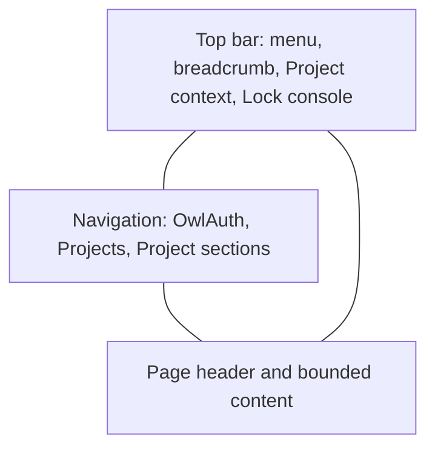
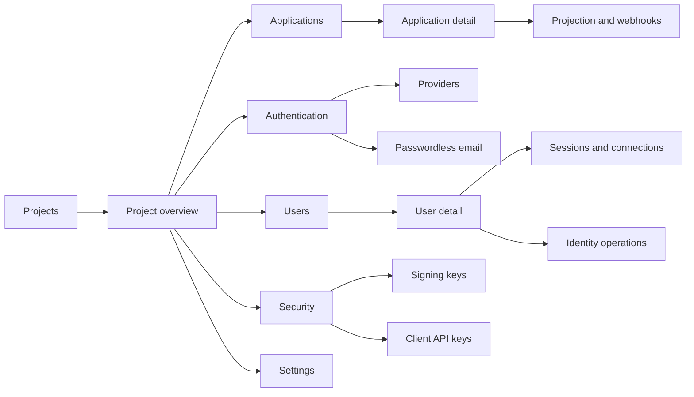

# 12 — Product UI and interaction design

## Purpose and authority

This specification defines the product presentation, information architecture, visual language, and interaction conventions for OwlAuth's two embedded browser surfaces:

- the Control **Management Console** used by the deployment operator; and
- the Runtime **Hosted Authentication UI** used by Application end users and by bounded identity ceremonies.

[`spec/09`](09-hosted-web-surfaces-and-control-auth.md) remains authoritative for browser authority, credentials, routes, security behavior, and allowed workflows. [`spec/11`](11-identity-connections-passwordless-email-and-user-sync.md) remains authoritative for identity, provider, email, and synchronization behavior. [`TS-002`](technology/ts-002-hosted-web-and-asset-pipeline.md) remains authoritative for the React, CSS, build, client, CSP, and embedding boundaries. This document owns how those capabilities are organized and presented; it MUST NOT create a second business contract, imply unsupported capabilities, or weaken a security requirement for visual convenience.

The target is a focused self-hosted SaaS-quality product rather than an unstyled collection of administrative forms. OwlAuth borrows the following proven patterns without copying either product's branding or unsupported product model:

- [Auth0's Dashboard](https://auth0.com/docs/get-started/auth0-overview/dashboard) provides the reference for domain-oriented identity administration, clear separation of Applications, Authentication, User Management, Security, and Settings, and a contextual deployment or tenant switcher;
- [Auth0 Universal Login](https://auth0.com/docs/authenticate/login/auth0-universal-login) provides the reference for a centralized, bounded, accessible authentication flow with inline validation and one clear next action;
- [Supabase's UI approach](https://supabase.com/blog/supabase-ui-library) provides the reference for a compact developer-facing product identity, responsive primitives, and a green-accented visual direction.

These references are non-normative inspiration and are not build-time or runtime dependencies. OwlAuth remains its own product. It has Projects rather than Auth0 tenants or Supabase organizations, one deployment operator key rather than administrative identities, no billing or organization hierarchy, and only the capabilities admitted by its Runtime, Client, and Control contracts.

## Product design principles

01. **Project context is always obvious.** After Console unlock, every Project-scoped page displays the selected Project in the persistent shell and breadcrumb. Cross-Project actions never look like local edits.
02. **One page has one primary job.** Resource lists, detail views, configuration forms, and destructive actions are separated instead of rendering every available form in one document.
03. **Progressive disclosure beats form walls.** Default views summarize committed state. Editing, creation, secret replacement, and exact plan review open only when requested.
04. **State is visible before action.** Status, revision conflict, pending reconciliation, unavailable dependency, and disabled state appear next to the affected resource with a safe next action.
05. **Security language is calm and exact.** The UI explains why a sensitive confirmation is required without exposing secrets, internal topology, or vendor errors.
06. **Color reinforces hierarchy but never carries meaning alone.** Labels, icons, and text accompany every status and validation state.
07. **The Hosted UI minimizes decisions.** It presents the exact persisted interaction, no Console chrome, no unrelated navigation, and one dominant next action per step.
08. **The Console feels dense, not cramped.** Tables and split views are used for inventory; generous spacing is reserved for page hierarchy, forms, and confirmations rather than wrapping every block in a card.
09. **Real data only.** The Console MUST NOT invent activity charts, percentages, health scores, counts, trends, or readiness claims that are not returned by an ordinary Control contract.
10. **Accessibility is a design input.** Semantic structure, keyboard flow, focus, reflow, readable contrast, and reduced motion are part of each component's definition rather than a later theme pass.

## Surface identity

The two applications use one recognizable OwlAuth family while retaining different composition and authority.

| Concern            | Management Console                         | Hosted Authentication UI                                             |
| ------------------ | ------------------------------------------ | -------------------------------------------------------------------- |
| Primary actor      | deployment operator                        | Application end user or identity-ceremony participant                |
| Composition        | persistent workspace shell                 | focused, centered interaction card                                   |
| Navigation         | deployment and Project resource navigation | no global product navigation                                         |
| Density            | compact lists, tables, tabs, and forms     | comfortable single-column steps                                      |
| Product identity   | OwlAuth wordmark and selected Project      | Project and Application display text with subtle OwlAuth attribution |
| Credential         | page-memory operator key                   | Runtime browser/CSRF interaction state only                          |
| Cross-surface link | none containing authority                  | none to the Console                                                  |

Authority separation also applies to presentation assets. Authority-free tokens and primitives MAY be authored in `src/shared`, but Runtime and Control retain independent entry graphs, emitted chunks, manifests, clients, shells, and embed roots as required by TS-002.

## Visual foundation

### Canonical theme

V1 uses one deliberate dark teal-neutral theme. It MUST NOT expose a theme selector or persist a visual preference. This keeps the product coherent, avoids a storage exception in the Console credential boundary, and gives implementation and accessibility testing one canonical baseline. A later light theme is a reversible presentation extension, not a prerequisite for the redesign.

The visual character is near-black and low-chroma rather than navy. Teal is reserved for focus, selected navigation, primary actions, and positive emphasis. Large areas remain neutral so operational status colors and untrusted content stay legible.

### Semantic color tokens

The following values define the canonical palette. Components consume semantic CSS custom properties rather than raw palette values.

| Semantic token         | Canonical value | Use                                                               |
| ---------------------- | --------------- | ----------------------------------------------------------------- |
| `--owl-canvas`         | `#0b1110`       | page background                                                   |
| `--owl-sidebar`        | `#0d1513`       | persistent Console navigation                                     |
| `--owl-surface`        | `#121b18`       | primary panels, fields, and Runtime card                          |
| `--owl-surface-raised` | `#17231f`       | menus, dialogs, selected rows, and raised controls                |
| `--owl-surface-hover`  | `#1d2b27`       | neutral hover state                                               |
| `--owl-border`         | `#293833`       | nonessential structural boundaries and dividers                   |
| `--owl-border-strong`  | `#587069`       | essential control boundaries and emphasized structure             |
| `--owl-text`           | `#f1f7f5`       | primary text                                                      |
| `--owl-text-muted`     | `#a7b4af`       | descriptions and secondary metadata                               |
| `--owl-text-subtle`    | `#7f8e88`       | tertiary metadata that is not required to complete a task         |
| `--owl-accent`         | `#2dd4bf`       | focus, selection, and decorative accent                           |
| `--owl-accent-strong`  | `#087a68`       | primary button background; white text has at least 4.5:1 contrast |
| `--owl-accent-soft`    | `#153d35`       | selected navigation and informational emphasis                    |
| `--owl-danger`         | `#fca5a5`       | destructive text and icon                                         |
| `--owl-danger-surface` | `#3b1d22`       | destructive confirmation surface                                  |
| `--owl-warning`        | `#fbbf24`       | warning text and icon                                             |
| `--owl-info`           | `#93c5fd`       | informational text and icon                                       |
| `--owl-success`        | `#5eead4`       | successful state text and icon                                    |
| `--owl-focus`          | `#5eead4`       | focus ring                                                        |

Primary text and muted text exceed WCAG AA contrast against the canvas and ordinary surfaces. `--owl-border` is decorative and MUST NOT be the only visual boundary of a control; fields, buttons, and other essential components use `--owl-border-strong` or another measured combination with at least `3:1` non-text contrast. Implementations MUST remeasure contrast after changing any value. Accent color alone MUST NOT represent success because selected or active controls also use teal.

### Typography

No remote or runtime-loaded font is permitted. The stack is `Inter, ui-sans-serif, system-ui, -apple-system, BlinkMacSystemFont, "Segoe UI", sans-serif`; the browser falls back to a local system face when Inter is unavailable. IDs, timestamps, revisions, callback URLs, and exact origins use `ui-monospace, "SFMono-Regular", Consolas, "Liberation Mono", monospace`.

| Role                       | Size / line height    | Weight     |
| -------------------------- | --------------------- | ---------- |
| Console page title         | `1.5rem / 2rem`       | 650        |
| Runtime title              | `1.75rem / 2.25rem`   | 650        |
| Section heading            | `1.125rem / 1.6rem`   | 650        |
| Body                       | `0.9375rem / 1.5rem`  | 400        |
| Compact table and metadata | `0.8125rem / 1.25rem` | 400 or 550 |
| Label and button           | `0.875rem / 1.25rem`  | 550 or 600 |

Sentence case is used for headings, buttons, tabs, and navigation. Uppercase is limited to short machine-state badges only when the underlying value is already conventional; letter-spaced eyebrow text is not a general heading pattern.

### Spacing, shape, and elevation

- Spacing follows a `0.25rem` base scale: `0.25`, `0.5`, `0.75`, `1`, `1.5`, `2`, and `3rem`.
- Ordinary controls are at least `2.5rem` high; primary Runtime actions and touch-critical controls are at least `2.75rem` high.
- Fields and buttons use a `0.5rem` radius. Cards, dialogs, and sheets use `0.75rem`. Pills are reserved for status and compact filters.
- Borders, spacing, and surface contrast define structure. Essential control boundaries use the measured strong border; low-contrast ordinary dividers remain decorative. Shadows are subtle and used only for dialogs, menus, the Runtime interaction card, and sticky overlap.
- Gradients MAY provide a low-contrast teal glow on the canvas, but MUST NOT sit behind body text, animate, reduce contrast, or become the primary brand treatment.
- Motion is limited to `120–180ms` opacity, color, or transform transitions. `prefers-reduced-motion: reduce` removes nonessential movement. Loading progress does not rely on decorative animation.

### Iconography and brand assets

Icons are small, locally authored and bundled SVG components with a consistent `1.5px` or `2px` stroke. Decorative icons are `aria-hidden`; interactive icon-only controls require an accessible name and visible tooltip on hover and keyboard focus. Provider visuals are selected only from the closed server-derived provider kind and bundled locally as required by spec 09. OwlAuth MUST NOT fetch remote logos, avatars, fonts, favicons, or provider art.

V1 uses a compact OwlAuth text wordmark with a simple local mark if one is present in the repository. It MUST NOT delay the information architecture redesign on a custom illustration or logo project.

## Management Console

### Locked entry

Before key verification, the Console renders a credential-free connection page rather than an empty version of the administrative shell.

- A centered panel is at most `28rem` wide and contains the OwlAuth wordmark, the title **Connect to this deployment**, one operator API-key field, one **Unlock console** primary button, and a short statement that the key remains only in this page's memory.
- No Project navigation, identifiers, resource counts, version detail, or authenticated page skeleton is rendered.
- The key field starts focused on ordinary direct navigation. Verification disables repeat submission and exposes a textual busy state.
- Authentication failure uses the stable generic message **The API key could not be verified.** It does not distinguish malformed, expired, or incorrect values.
- Lock, reload, close, `pagehide`, or authentication failure returns to this page and clears authenticated rendered state as specified by spec 09. A document entering the back/forward cache clears the key and authenticated DOM before it can be frozen; a persisted `pageshow` restores only the locked entry and never flashes stale Project data.

### Unlocked application shell

After verification, the Console becomes a full-width SaaS workspace. It MUST NOT remain inside the Runtime-sized centered card.

At desktop widths:

- a `15.5rem` persistent sidebar owns the OwlAuth wordmark, Project switcher, resource navigation, and a bottom placement for **Lock console**;
- a `3.75rem` top bar owns the breadcrumb, narrow-page navigation control when applicable, and exact current context;
- content uses fluid width with a `92rem` maximum, `2rem` desktop padding, and no single global card;
- page headers contain title, one-line purpose text when needed, resource status, and at most one visually primary action;
- success/error status messages appear in a consistent notification region below the page header and move focus only when required by the initiating workflow.

Content width follows the task rather than one universal narrow column:

- inventories, operational tables, and overview grids may use the full bounded `92rem` workspace;
- ordinary read/edit forms and prose use a `44–48rem` measure so labels, help, and errors remain scannable;
- list/detail work such as user selection and exact resource inspection may use an `18–22rem` selection pane plus the remaining detail width;
- exact plans, multi-party identity operations, and other comparison-heavy ceremonies may use a wider dedicated section, but unrelated fields are not stretched to fill it; and
- these profiles collapse to one column at their content-driven breakpoint as defined below.

The shell MUST NOT imitate multi-user SaaS chrome that OwlAuth does not have. It has no operator avatar, organization switcher, notification bell, support upsell, billing link, role badge, or fake global search.

### Information architecture

The Console is Project-first. The deployment-level Projects directory is the entry route. Selecting a Project reveals its resource navigation and persists only in the current URL and active page state, never browser storage.

The target client routes are relative to the configured `console/` base:

| Route                                                  | Page responsibility                                                                                                                         |
| ------------------------------------------------------ | ------------------------------------------------------------------------------------------------------------------------------------------- |
| `/`                                                    | Project directory, empty state, and create-Project action                                                                                   |
| `/projects/{project_id}`                               | readiness-oriented Project overview and safe resource summaries                                                                             |
| `/projects/{project_id}/applications`                  | Application inventory and create action                                                                                                     |
| `/projects/{project_id}/applications/{application_id}` | metadata, exact browser configuration, user projection, webhook endpoints, delivery state, and replay actions grouped into tabs or sections |
| `/projects/{project_id}/authentication/providers`      | provider inventory, onboarding, configuration state, Application assignments, provisioning reconciliation, and disablement                  |
| `/projects/{project_id}/authentication/email`          | email method policy, Application assignments, and SMTP generations                                                                          |
| `/projects/{project_id}/users`                         | bounded Project-user inventory                                                                                                              |
| `/projects/{project_id}/users/{user_id}`               | user provenance, identities, sessions, exact managed-connection synchronization/reauthorization/revoke/disconnect, and link/unlink/merge    |
| `/projects/{project_id}/security/signing-keys`         | signing-key inventory, provisioning, activation, rotation state, and recovery                                                               |
| `/projects/{project_id}/security/client-keys`          | Project client-key safe inventory, create-once reveal, overlap rotation guidance, and revisioned revocation                                 |
| `/projects/{project_id}/settings`                      | Project metadata, policy, projection defaults, egress policy when supported, and a separated danger zone                                    |

These routes organize existing or contract-backed workflows; they do not require a second API. A route whose Control capability does not exist MUST remain absent rather than showing a disabled future-product placeholder. Direct navigation returns the Console shell only within the route partition allowed by spec 09 and TS-002.

### Project directory and overview

The Project directory uses a compact table on ordinary desktop widths and a stacked row treatment at narrow widths. Each row displays display name, public ID, status, optional `belongs_to` metadata, and the safe revision or update metadata that is actually returned. The whole row MAY be clickable, but its name remains a real link and row actions remain keyboard-operable controls.

Project creation opens a focused dialog or narrow side sheet instead of placing a permanent create form above the inventory. The surface contains only display name and optional external-owner metadata, preserves idempotency, and moves to the created Project overview after success.

The Project overview is an operational starting point, not an analytics dashboard. It MAY show:

- a readiness checklist backed by real capability and resource state;
- Applications, active authentication methods, signing-key state, and email-delivery configuration summaries when returned by reviewed Control queries;
- direct links to incomplete configuration steps; and
- public identifiers or callback guidance safe for the operator to copy.

It MUST NOT infer health from browser-visible heuristics or claim that a deployment is production-ready.

### Resource lists and detail pages

- Inventories with repeated structured fields use semantic tables. Cards are reserved for heterogeneous summaries, choices, or small collections.
- Table headers remain visible when a bounded page region scrolls. Horizontal overflow, when unavoidable for exact identifiers, is contained to the table region rather than the document.
- Default rows expose the primary identifier, safe status, and one or two high-frequency actions. Secondary actions use an overflow menu with full keyboard behavior.
- Selecting a resource navigates to a stable detail route. Large editable detail forms do not expand inline inside inventory rows.
- Detail pages use a summary header followed by tabs only when there are at least two durable conceptual sections. Tabs update the URL or a stable fragment, have correct tab semantics, and do not hide unsaved changes silently.
- Exact IDs, origins, callback URLs, timestamps, and revisions are selectable monospace text. A copy action MAY be supplied only for non-secret values and must announce success without replacing the visible value.
- Empty states explain why the collection is empty and offer one permitted next action. They do not use decorative illustrations as a substitute for guidance.

### Forms and editing

- Read-only committed state is the default. **Edit**, **Configure**, **Replace secret**, or **Create** explicitly enters a form.
- Short creation forms use a modal dialog or side sheet. Long configuration and exact-plan review use a full page or dedicated page section.
- Labels are always visible and associated with controls. Placeholder text is an example, never the label or the only format guidance.
- Required and optional state is stated in text. Help appears below the field and validation appears adjacent to the field plus in an accessible error summary when submission has multiple errors.
- The primary submit action is right-aligned with **Cancel** or **Back** as a secondary action. A page with multiple independent forms gives each form its own clear section and submit action.
- Submit buttons use verbs and targets, such as **Create Project**, **Save email policy**, or **Replace client secret**. Generic **Submit** and ambiguous **Update** labels are avoided.
- Pending submission disables only actions that would duplicate or invalidate the operation. Inputs remain readable. Completion, uncertain outcome, and retry guidance use the operation semantics from the server.
- A `409` revision conflict never silently replays a mutation. The UI refreshes safe state, states what changed in general terms, and requires review and explicit resubmission as specified by spec 09.
- Unsaved navigation is guarded only when a meaningful edit exists. The guard is page-memory UI state and does not persist form values.

### Status and feedback

Status uses a label plus an icon or shape. The canonical families are:

| Family               | Presentation                           | Examples                            |
| -------------------- | -------------------------------------- | ----------------------------------- |
| active / ready       | teal text on restrained teal surface   | active, published, ready            |
| pending              | blue text on restrained blue surface   | provisioning, reconciling, queued   |
| attention            | amber text on restrained amber surface | unavailable, expiring, partial      |
| disabled             | neutral text on neutral surface        | disabled, revoked, disconnected     |
| failed / destructive | red text on restrained red surface     | failed, rejected, integrity failure |

Server vocabulary remains visible when operators need exact state. The UI MAY add a plain-language explanation but MUST NOT collapse materially different states into one optimistic badge.

Use the following feedback hierarchy:

1. field-level error for one invalid value;
2. inline section alert for a recoverable resource error;
3. page notification for a completed page-level action;
4. blocking dialog only for explicit confirmation or an outcome that prevents safe continuation;
5. full-page unavailable state only when the route cannot be rendered safely.

Toast-only error reporting is forbidden. Time-limited notifications MAY supplement, but never replace, persistent accessible feedback.

### Secrets, confirmations, and danger zones

Write-only provider, SMTP, webhook, and other submitted secrets render only in the active native password control and short-lived request object permitted by spec 09. The UI does not provide reveal, copy, recovery, or retained masked-value affordances. A committed submitted secret is represented only by safe metadata such as configured/not configured, generation, or last safe outcome.

The generated Project client key is the one explicit exception: its non-dismissible create dialog renders the original response credential exactly once with a copy action and an external-storage assertion. The Console commits the revision-fenced server acknowledgement before disposing the credential or closing; failure keeps both reveal and retry visible. Later inventory shows only label, public key ID/display prefix, status, revision, created/acknowledged/last-used/revoked time. Any active unacknowledged key blocks another create across reload and offers truthful retained-credential acknowledgement or revocation. No marker or credential is persisted in browser storage. The page offers overlap guidance—create, store, deploy, then revoke—without a fake rotate/reveal action. An ambiguous create outcome never claims the secret can be recovered.

High-impact actions use an OwlAuth-owned accessible confirmation dialog rather than `window.confirm`. The dialog displays the exact safe target name and consequence. Routine reversible actions require one clear confirmation; irreversible or broad actions MAY require typing a bounded display name when the owning behavior calls for stronger intent. Confirmation text never asks the operator to paste a secret or internal identifier.

Destructive controls are not styled as the page's primary teal action. Project and Application disablement, Project client-key revocation, provider disconnect, session revocation, identity mutation, key retirement, and webhook replay retain their existing expected-revision, idempotency, exact-plan, and audit semantics. The Project settings page places irreversible or deployment-affecting actions in a visually separated **Danger zone** after ordinary settings.

## Hosted Authentication UI

### Composition

The Runtime surface remains a centered, single-column interaction card, but it receives a polished authentication-specific shell rather than sharing the Console workspace or its current generic shell.

- The page canvas uses the canonical near-black background and an optional static low-contrast teal glow.
- The ordinary sign-in, email, reauthorization, logout, progress, and terminal-state card is at most `30rem` wide, uses `1.5–2rem` responsive padding, and has a subtle border and shadow.
- Identity mutation or another exact-review ceremony MAY enter a `40–42rem` wide card when its proof-slot comparison or immutable plan needs it. The wider profile is flow-owned, not viewport-filling, and returns to one column on narrow screens.
- The header displays bounded Project and Application context. The Application name is the task title for ordinary login; the Project name is supporting trust context.
- A small **Secured by OwlAuth** attribution MAY appear after the interaction content. It is not a Console link and conveys no deployment topology.
- The footer contains no marketing, documentation, privacy URL, or arbitrary operator-provided navigation unless a future public branding contract validates and admits that exact field.
- On a narrow viewport the card becomes an edge-to-edge surface with safe page padding rather than a miniature desktop card.

### Ordinary sign-in

The initial method picker presents a short instruction and one vertically stacked method button per admitted snapshotted method. Because the Runtime contract carries email availability separately from its ordered provider snapshot, the canonical V1 presentation is email first when admitted, followed by providers in the exact order returned by the server; the browser does not reorder providers.

- Provider buttons are neutral surface buttons with the local kind-selected visual, operator-controlled display name rendered as text, and the label **Continue with {provider}**.
- Email uses the same hierarchy as providers; its canonical first position is a deterministic presentation rule, not preselection or greater authority.
- No method is preselected by color, query input, or focus. Hover and focus are distinct from selection.
- Explicit current-session reuse is separated by an **or** divider and a clearly worded confirmation block. It never appears as an already-selected account or silent shortcut.
- When there are many admitted methods, the card remains a bounded document with ordinary page scrolling. V1 does not add client-side search, categorization, or provider reordering.

### Email steps

- Email entry uses one labeled email field and one full-width primary action.
- Enumeration-safe copy is brief and neutral. It does not overemphasize account-existence policy to the point of confusing ordinary users.
- The check-email view states whether the newest code, newest link, or either is accepted and shows expiry in readable local time when available.
- OTP input uses `inputmode="numeric"`, `autocomplete="one-time-code"`, a visible label, and grouped visual spacing without splitting the value into inaccessible independent controls.
- Resend is secondary, includes the same address re-entry required by current behavior, and clearly states that a newer message invalidates older proof material.
- Magic-link confirmation explains that the proof was removed from history and requires one explicit **Continue sign-in** action.
- Invalid, expired, or uncertain results provide one safe recovery action: return to the Application and start again, or request the exact new interaction allowed by the owning flow.

### Identity and managed-connection ceremonies

Identity mutation, managed reauthorization, and logout use the same card and typography but must be visually distinguishable from ordinary login through explicit purpose text.

- Identity mutation shows the exact operation kind, required proof slots, completed/pending state for each slot, and the final explicit ready transition. It does not imply that proof completion itself mutated identity.
- Managed reauthorization names the fixed safe provider display and explains that it replaces one managed credential rather than signing the person into an Application.
- Logout uses a restrained danger treatment for the confirmation action and neutral styling for cancel.
- Exact-plan or high-impact identity confirmation uses grouped sections and visible target summaries; it never relies on a raw JSON dump or dense paragraph.
- Progress and terminal states move programmatic focus to the state heading, retain an `aria-live` announcement where appropriate, and avoid indefinite spinners when the safe outcome is uncertain.

### Hosted copy and trust

Hosted text uses end-user language such as **sign in**, **email code**, and **identity provider**, not internal transaction, revision, handoff, outbox, or adapter terminology. Safe technical detail is reserved for recovery instructions where it helps the user act.

All Project, Application, provider, presentation-hint, and error values remain untrusted text. Branding is bounded by the public contracts; this visual specification does not admit arbitrary HTML, CSS, remote logos, remote fonts, colors that bypass contrast gates, or caller-supplied navigation.

## Shared UI primitives

The initial redesign SHOULD implement a small OwlAuth-owned primitive set rather than adopting another styling or component framework:

- `Button` with primary, secondary, quiet, and danger variants;
- `Field`, `FieldError`, `FormErrorSummary`, `Input`, `Select`, and `Textarea` wrappers over semantic native controls;
- `StatusBadge`, `InlineAlert`, and notification region;
- `Dialog`, `SideSheet`, and `Menu` only where their complete keyboard/focus behavior is implemented and tested;
- `PageHeader`, `Breadcrumbs`, `Tabs`, `DataTable`, `EmptyState`, and `DescriptionList` for the Console;
- `HostedCard`, `MethodButton`, and `TerminalState` for Runtime.

Shared UI primitives contain presentation and accessibility behavior only. `src/shared` MAY also retain authority-free infrastructure such as configured-base parsing and same-origin URL confinement. Shared source MUST NOT import either generated contract, create a plane client, interpret server state into authority, retain credentials, perform plane-specific navigation, or cause shared emitted chunks. CSS Modules and semantic custom properties remain the styling mechanism; this spec does not select Tailwind, CSS-in-JS, a component package, a form library, or a global state library.

## Responsive and reflow behavior

Canonical review widths are `1440px`, `1024px`, `768px`, and `320px` at 100% zoom, plus 200% browser zoom on an ordinary desktop viewport.

- At `64rem` and above, the Console sidebar is persistent.
- Below `64rem`, navigation becomes a modal side sheet opened from the top bar. It closes after route selection, on Escape, and when focus is restored to the trigger.
- Console content padding decreases from `2rem` to `1.5rem` and then `1rem`; page actions wrap beneath titles rather than compressing labels.
- Two-column forms and split user/inventory views collapse to one column below their content-driven breakpoint.
- Tables use a contained horizontal scroll region or a purpose-built stacked row; the page itself does not horizontally scroll at `320px` except for a user-controlled exact-code region.
- Dialogs become near-full-screen sheets on narrow viewports while retaining a visible heading, close action, and reachable submit controls.
- The Hosted UI remains fully usable at `320px` without horizontal scrolling, clipped focus rings, or fixed-height content.

Responsive web support does not create a separate mobile application or broaden the Control trust model.

## Accessibility requirements

Both surfaces target WCAG 2.2 AA and preserve the stronger requirements already selected by TS-002.

01. Every page has one descriptive `h1`; headings form a logical hierarchy independent of visual size.
02. A skip link reaches main content in the unlocked Console. Landmarks identify navigation, top bar, main content, and contextual aside regions.
03. All controls are reachable and operable by keyboard. Focus order follows visual/task order, and focus is never trapped outside an active modal surface.
04. `:focus-visible` uses a minimum `2px` high-contrast ring with offset; focus is not indicated by color fill alone.
05. Route changes focus the page heading. Dialog close restores the trigger. Validation focuses the error summary or first invalid field according to the form pattern. Async completion moves focus only when continuation otherwise becomes unclear.
06. Visible labels, descriptions, errors, busy state, status changes, and required state are programmatically associated. Placeholder-only labels and tooltip-only errors are forbidden.
07. Text contrast is at least `4.5:1`; large text and essential component boundaries meet their applicable WCAG thresholds. Disabled controls remain understandable even when not actionable.
08. Pointer targets are at least `24×24px` with adequate spacing, and task-primary or touch-heavy controls target `44px` height.
09. Content reflows at 200% zoom. Text is not truncated without an available complete value, and exact identifiers wrap or scroll in a bounded region.
10. Status, provider kind, required action, and error are not communicated only by hue, icon, location, or animation.
11. `prefers-reduced-motion` removes nonessential transitions. No content flashes, auto-rotates, or advances on a timer.
12. Automated axe checks supplement keyboard, screen-reader-informed semantics, zoom, high-contrast/forced-color, reduced-motion, and manual visual review.

## Loading, failure, and empty-state behavior

- The shell and current context render immediately from safe page state; authenticated resources use bounded skeleton rows or a textual loading state that matches the expected layout.
- Skeletons have no accessible name and never replace a live busy announcement. Existing content remains visible during a safe refresh when stale presentation cannot authorize an action.
- A failed collection load offers **Retry** only when replaying that query is safe. A failed or uncertain mutation follows the owning command semantics and never becomes a generic automatic retry.
- Authentication failure locks and clears the Console rather than rendering an error over stale Project data.
- `404` and unsupported routes use a plane-local page with a link back to the Projects directory or current safe parent. They never fall through to Runtime or another resource.
- Empty states distinguish **not configured**, **no results**, **not available**, and **failed to load**. These states do not share one vague illustration or message.

## Explicit anti-patterns

The redesign MUST NOT:

- keep the unlocked Console inside one centered `34rem` card;
- render all Project, Application, provider, user, email, key, and webhook forms in one scrolling page;
- use one generic button style for primary, secondary, quiet, and destructive actions;
- use cards for every section when a table, description list, divider, or page route gives clearer structure;
- add gradients, glass effects, oversized headings, glowing borders, or animated backgrounds that compete with operational content;
- copy Auth0 or Supabase logos, exact layouts, wording, color values, or product concepts;
- expose future menu items, fake charts, sample data, or disabled upgrade features;
- retain secrets or form drafts in browser storage to improve convenience;
- introduce remote assets, analytics, a CDN, unsafe HTML, inline styles/scripts, or a service worker;
- hide security-significant state behind hover-only tooltips, icon-only controls, or transient toasts;
- silently select a Project, Application, user, provider, session, or identity target after a conflict;
- make Runtime resemble the administrative Console or expose Control links and terminology.

## Rewrite and test migration strategy

The target implementation is a full replacement of the current UI source and component tree, not a visual patch over the current monolithic screens. The current generic `Shell`, plane `App` compositions, permanent all-in-one workspaces, panels, and their CSS MAY be deleted as each vertical flow reaches equivalent coverage. The redesign MUST retain rather than reimplement the stable boundaries: Rust HTTP/domain behavior, Runtime/Control separation, generated plane OpenAPI types and internal `openapi-fetch` clients, configured-base confinement, disposable Control-client lifecycle, server-authored Runtime bootstrap and safe navigation, independent Vite graphs/manifests/embed roots, and static-serving rules.

`@owlauth/client` remains the independently released downstream Application SDK. Hosted Web MUST NOT depend on it: it does not expose Control administration or own Hosted interaction selection, navigation, credential custody, or server-version-matched Runtime ceremonies. Browser and Node end-to-end tests SHOULD continue to exercise its packaged candidate as an external Application consumer against the real server.

Tests migrate by contract value:

- keep pure configured-base, client-disposal, validation, Rust HTTP/asset, and protocol tests where their boundary is unchanged;
- preserve exact request bodies, revisions, CSRF values, idempotency identity, secret/proof disposal, abort behavior, safe navigation, terminal-state restrictions, plane isolation, and real-server outcomes;
- replace tests that encode obsolete component names, DOM IDs, element nesting, tag choices, element order, or old all-in-one navigation instead of carrying a compatibility DOM into the new UI;
- use accessible role/name queries for user-facing controls and small semantic screen/page drivers for repeated route and workflow operations; use a stable test hook only for a machine value that has no appropriate user-visible semantic locator; and
- keep exact copy assertions only where the text itself is a security, enumeration, honesty, or recovery contract. Other copy tests assert meaning, available actions, state, and accessibility rather than freezing every sentence.

Old and new applications MUST NOT remain as long-lived parallel implementations. A vertical flow removes its replaced component and DOM-specific tests only after equivalent invariant, semantic, and real-browser evidence exists.

## Delivery sequence

The UI redesign is one source replacement capability delivered in reviewable vertical stages while preserving working contracts:

1. **Foundation:** define semantic tokens and accessible primitives; split the current generic `Shell` into independent Console locked/workspace shells and a Runtime hosted card while preserving independent builds.
2. **Console structure:** introduce route-backed Project context, sidebar, top bar, page headers, notifications, and the Project directory/overview. Move existing workflows into the target resource pages without changing their HTTP semantics.
3. **Console workflows:** replace permanent create forms and browser-native confirmations with focused forms, detail routes, dialogs/sheets, tables, status treatment, exact-plan review, and danger zones.
4. **Hosted flow:** restyle method selection, email, identity mutation, reauthorization, logout, progress, and terminal states using the hosted composition and local provider visuals.
5. **Qualification:** complete responsive, keyboard, focus, zoom, forced-color, reduced-motion, malicious-content, credential-disposal, screenshot review, and real-server browser gates at the canonical viewports.

A stage MUST NOT leave a security-sensitive workflow reachable only through an unfinished visual affordance. The final route graph replaces obsolete routes directly; there is no compatibility router, second application, or alternate API.

## Acceptance criteria

Before this UI scheme is considered implemented:

01. the unauthenticated Console shows only the bounded connection panel, and unlock/deny/lock/reload/close plus navigation-away/back-forward-cache restoration prove page-memory-only operator-key custody and absence of stale authenticated DOM;
02. the unlocked Console uses the full workspace shell with persistent Project context, breadcrumb, resource navigation, and a visible lock action rather than the centered Hosted card;
03. every target Console route maps to an ordinary Control contract-backed workflow, direct navigation is plane-local, and absent capabilities create no placeholder navigation;
04. Project, Application, provider, email, user, session, connection, key, projection, webhook, and settings workflows are separated into comprehensible inventory/detail/configuration pages without changing revision, idempotency, confirmation, or audit semantics;
05. Project creation and other short forms use focused modal/sheet patterns, long exact configuration uses dedicated content, and no page reproduces the current all-forms-at-once layout;
06. every write-only secret is cleared on all transitions required by spec 09 and is absent from read views, DOM remnants, storage, URL/history, logs, errors, and screenshots;
07. destructive and high-impact actions use accessible explicit confirmation with exact safe targets and retain server-side authorization and revision checks;
08. all implemented server states have text-first status and recovery treatment; pending, failed, unavailable, disabled, and uncertain states are not collapsed into optimistic generic feedback;
09. Runtime ordinary login, email OTP/magic link, current-session reuse, identity mutation, managed reauthorization, logout, progress, and terminal views use the dedicated hosted card with one clear next action and no Console chrome;
10. provider presentation uses only bounded text and local visuals selected by the closed server-derived kind, with no remote resource request or caller-controlled rendering sink;
11. the canonical token palette passes measured contrast gates, focus is consistently visible, and no status or action depends on color alone;
12. both applications work at `1440`, `1024`, `768`, and `320px`, at 200% zoom, with no document-level horizontal overflow except a bounded exact-value region;
13. keyboard-only route navigation, dialogs, menus, tabs, forms, confirmation, async completion, error recovery, and lock restore predictable focus and expose correct semantics;
14. axe, semantic-role queries, reduced-motion, forced-color, zoom/reflow, and manual visual review cover representative Console and every Runtime flow family in Chromium and Firefox as required by TS-002;
15. malicious text, oversized safe values, long IDs, empty collections, loading, `401`, `404`, `409`, rate limit, unavailable dependency, and uncertain mutation outcomes remain readable and cannot break layout or navigation safety;
16. shared UI source remains authority-free and build validation still proves separate Runtime and Control contracts, import graphs, chunks, manifests, assets, embed roots, CSP, and cross-plane retrieval denial;
17. production remains self-contained and loads no remote font, logo, icon, script, style, analytics, or other third-party resource;
18. visual review confirms a consistent teal-neutral SaaS identity, compact information density, restrained elevation, and clear hierarchy without copying the referenced products;
19. workspace, ordinary-form, list/detail, Hosted compact, and Hosted wide-ceremony profiles use the selected width bounds and collapse without forcing every workflow into either a narrow card or full-width form;
20. obsolete UI components and their DOM/IA-specific tests are removed as equivalent invariant and semantic coverage lands, with no persistent legacy UI, duplicate API, or compatibility DOM; and
21. Hosted Web continues to use its server-version-matched plane clients while the packaged `@owlauth/client` is proven only in its intended external Application role.
