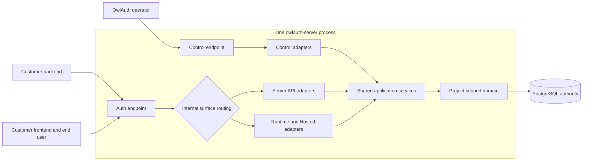

# 13 — Project Server API and customer caller boundaries

## Purpose and scope

OwlAuth has three caller boundaries with non-interchangeable credentials:

1. OwlAuth administration tools use the deployment-scoped Control Plane and operator API key;
2. customer backends use the Project-scoped Server Plane and Project server keys;
3. customer frontends and end users use the Runtime / Protocol Plane with public Application context and end-user session credentials.

The Server API gives a trusted customer backend a bounded Project user read model and authoritative online access-token introspection. It does not grant Project administration, expose upstream-provider credentials, or turn OwlAuth into a SaaS framework. OwlAuth publishes a complete Server OpenAPI document; customers own generated servers, business repositories, BFF/framework integration, authorization, billing, organizations, and application-specific user metadata.

Existing TypeScript, Python, and Rust SDKs remain Project Auth Runtime clients. They do not accept Project server keys or wrap the Server API.

## Caller and credential model

| Caller                                                             | Surface              | Credential                                                                               | Authority                                                                       |
| ------------------------------------------------------------------ | -------------------- | ---------------------------------------------------------------------------------------- | ------------------------------------------------------------------------------- |
| Management Console, `owlauth` CLI, remote Control MCP              | Control              | one deployment operator API key                                                          | all administrative operations in the deployment                                 |
| Customer backend, server-side BFF module, generated OpenAPI server | Server               | one active Project server key                                                            | fixed read-only Server API authority for exactly one active Project             |
| Customer browser/native frontend                                   | Runtime              | public Project/Application context, Hosted browser state, PKCE, and end-user credentials | login and the caller's exact Application session/user operations                |
| End-user request reaching a customer backend                       | customer application | OwlAuth Project access token or customer-owned session                                   | authenticated user evidence; customer backend still owns business authorization |

No credential is accepted by another surface:

- a Project server key is not a Control credential, Runtime publishable identifier, Project access token, or refresh token;
- the operator key is never accepted by Server or Runtime;
- a publishable identifier and end-user credential never authorize Server or Control;
- a Project server key for Project A never identifies, enumerates, or authorizes Project B.

## Auth endpoint and internal surface boundaries



Auth has one bind address, external base URL, transport budget, process identity, health endpoint, and aggregate readiness endpoint. Behind that listener, Runtime and Server API remain distinct routers with separate state, credentials, response policy, CORS policy, admission services, metrics, PostgreSQL pools, and readiness inputs. Control retains its own listener and every operator boundary.

Server API serves JSON only. It serves no HTML, cookies, redirects, service worker, permissive CORS, or credentialed browser response. Server API CORS is deny-by-default with no v1 allowlist because Project server keys must never enter browser code. Sharing the Auth transport does not make Server API browser-callable and does not permit routing Server API requests through Runtime middleware or state.

Composition modes are exactly `all`, `auth`, and `control`. `auth` always composes both Runtime and Server API surfaces; they cannot be deployed as separate processes. Control creates/revokes Server credentials; Server API verifies and uses them; Runtime receives neither capability.

## Project server key model

A Project may have multiple independently named active keys so an operator can overlap deployment and rotation. V1 keys all grant the same fixed, read-only Server API authority for their exact Project. OwlAuth does not expose decorative scopes that cannot yet constrain distinct write capabilities.

A durable key record contains only:

- immutable key UUID and canonical public key ID;
- exact Project UUID;
- operator-supplied label of 1–64 characters after trimming surrounding whitespace, with control characters rejected;
- status `active` or `revoked`;
- versioned credential-digest key version and 32-byte digest;
- non-secret display prefix;
- monotonic revision;
- created, optional explicit credential-delivery acknowledgement, coarsened last-used, and optional revoked timestamps.

It never contains raw credential bytes, reversible ciphertext, a customer Application secret, provider material, or the operator key. PostgreSQL constraints enforce Project ownership, status/timestamp coherence, and immutable identity/digest fields. `credential_acknowledged_at` is only the safe operator assertion that the one-time value was stored outside OwlAuth; it is not proof of the credential bytes and never carries them. The owning create transaction locks the Project row, rejects creation while any active key remains unacknowledged, and enforces a simple maximum of ten active keys per Project. At most one active unacknowledged key may exist for a Project.

### Credential format

The canonical v1 credential is:

```text
owl_server_v1.<public-key-id>.<43-character-base64url-secret>
```

The public key ID is exactly 16 independent CSPRNG bytes encoded as 22 canonical unpadded base64url characters. Creation retries a bounded number of times on its database uniqueness collision and otherwise fails safely. The secret component is exactly 32 separate CSPRNG bytes encoded as 43 canonical unpadded base64url characters. The non-secret display prefix is exactly `owl_server_v1.<public-key-id>`; it supports inventory, indexed lookup, safe log redaction, and secret-scanning patterns without disclosing any secret component. Alternate alphabets, padding, whitespace, duplicate separators, unknown versions, and non-canonical lengths are rejected before database access.

The full credential is confidential, redacted in `Debug`/`Display`, bounded, non-serializable except at its single explicit HTTP reveal, zeroized where supported, and never logged, traced, audited, placed in a URL, query, cookie, response header, or OpenAPI example.

### Digest and verification

OwlAuth computes a purpose- and owner-bound HMAC-SHA-256 digest over a versioned length-delimited context containing the credential version, Project UUID, key UUID, public key ID, and 32 raw secret bytes. A dedicated versioned `OWLAUTH_SERVER_KEY_DIGEST_KEY` key ring is available only to Control creation and Server verification composition. Every digest version referenced by an active key is retained in backup and every Auth process. Auth readiness fails when the authoritative active-key inventory references an unavailable verifier version.

Each Auth process has one stable configured process ID and startup incarnation shared by its Runtime and Server API surfaces. Its Server verifier publishes a bounded PostgreSQL readiness lease listing the exact digest versions it can verify. Control has the same configured required-Auth roster. A create transaction may use its configured active digest version only when every required process ID has one current-incarnation, unexpired observation containing that version; an empty/missing/stale/mismatched roster fails closed. Server renewals do not authorize requests and expiry affects readiness/new creation, not verification by an already loaded process. Rollout installs the new retained version on Server first and waits for the complete roster before enabling Control creation; rollback keeps both versions. Retirement requires an authoritative zero-active-reference inventory after old keys are explicitly revoked. Loss or compromise cannot be repaired by rehashing: the operator restores the exact uncompromised version or revokes and reissues every affected key.

Verification:

1. accepts exactly one `Authorization: Bearer <credential>` header and no query/body alternative;
2. parses and bounds the canonical credential before storage access;
3. performs indexed lookup by public key ID joined to the exact active Project;
4. computes the digest for the stored readable key version and compares fixed-length bytes in constant time;
5. verifies that Project and key remain active in the same authoritative read;
6. returns one private typed Server actor containing Project/key identity, never raw credential bytes.

Unknown, malformed, revoked, wrong-Project, disabled-Project, wrong-version, and wrong-digest credentials return the same bounded `401` response and `WWW-Authenticate: Bearer` challenge. Admission control applies before and after key resolution using safe source and purpose-keyed credential dimensions. Redis may coordinate limits but cannot authenticate a key.

A successful request may advance `last_used_at` at most once per fifteen-minute bucket through a best-effort update guarded by `status = active` and an older stored bucket. Usage metadata is lifecycle-neutral: it does not advance the key revision, cannot make an expected-revision revoke conflict, and cannot update a row after revocation wins. It never authorizes, revokes, or delays the request and has no per-request audit cardinality.

## Lifecycle and one-time reveal

Control owns key lifecycle under a Project:

- list cursor-paginated safe key metadata together with one bounded `active_unacknowledged_key` authority independent of historical page count;
- get one exact Project/key-qualified safe metadata record for conflict reconciliation;
- create one key with a bounded unique-enough operator label;
- acknowledge external storage of one exact active key with expected revision, explicit confirmation, and no credential in the request;
- revoke one exact active key with expected revision and confirmation.

Creation commits the active key with `credential_acknowledged_at = NULL`, the Control idempotency result, and audit event atomically, then reveals the raw credential exactly once from request-local memory. The durable idempotency result contains key metadata but not the credential. An exact replay after an ambiguous response returns a bounded `secret_unavailable` conflict naming only the created public key ID; it never reconstructs or re-reveals the secret. The unacknowledged row is therefore the cross-session safety authority: another create remains blocked until the operator revokes it or truthfully acknowledges that the originally revealed credential was retained in external secret storage.

The acknowledgement mutation is Project/key qualified, expected-revision fenced, idempotent, and audited. It advances the key revision and sets the timestamp exactly once while the key remains active. An acknowledgement request contains only the explicit storage assertion and expected revision—never the credential. Failure or ambiguity leaves the reveal open when it is still present; reconciliation reads the exact safe key record and retains the same idempotency identity while the outcome is ambiguous. A revision/lifecycle conflict resolves to authoritative acknowledged or revoked metadata, clears an obsolete reveal, or refreshes the still-unacknowledged revision. Authentication failure instead clears the reveal and locks the Console. Revocation is always allowed for an active unacknowledged key and clears the creation risk without inventing acknowledgement.

Creating a replacement does not revoke another key. Safe rotation is create, deploy, observe, then explicitly revoke. Revocation is immediate for subsequent authoritative Server requests, irreversible, revision-checked, audited, and never hard-deletes the record. V1 has no reveal, recover, enable, expiry, automatic rotation, wildcard Project key, Application key, user-created key, or key-authenticated key-management endpoint.

The Console keeps the one-time credential only in the active dialog's local memory, never React state, browser storage, URL, history, logs, analytics, or a copyable hidden field. Locking, reload, navigation, `pagehide`, persisted `pageshow`, authentication failure, and unmount clear the value. The reveal is non-dismissible: after the operator asserts external secret-manager storage, the Console must commit the server acknowledgement before clearing the value and closing. A recoverable failed acknowledgement keeps the credential and retry action visible; an ambiguous acknowledgement reconciles exact safe metadata without re-revealing any secret. After reload, the bounded server delivery-gate authority reconstructs the unacknowledged gate without scanning unbounded revoked history and offers only truthful retained-credential acknowledgement or revocation. While the same mount knows an ambiguous create never returned a credential, its implicated key is revocation-only; a later mount may offer acknowledgement only under an explicit truthful retained-credential assertion. CLI machine output emits the credential only for the original successful create command, preserves existing terminal/file safety rules, and exposes an explicit revision-fenced `server-key acknowledge` command for automation that has durably stored that output.

## Server HTTP contract

Server operations are Project-qualified even though the credential also owns one Project. The route uses the Project public ID; middleware requires exact agreement with the credential's authoritative Project. Mismatch returns the generic credential denial and performs no alternate Project lookup.

Representative v1 routes are:

| Route                                                                         | Purpose                                                                    | Additional authority                                                                   |
| ----------------------------------------------------------------------------- | -------------------------------------------------------------------------- | -------------------------------------------------------------------------------------- |
| `GET /v1/projects/{project_id}/users`                                         | bounded cursor page of Project users                                       | active matching Project server key                                                     |
| `POST /v1/projects/{project_id}/users/lookup`                                 | zero-or-one exact normalized-email lookup with email only in the JSON body | active matching Project server key                                                     |
| `GET /v1/projects/{project_id}/users/{user_id}`                               | one bounded Project user                                                   | active matching Project server key and same-Project user                               |
| `GET /v1/projects/{project_id}/applications/{application_id}/users/{user_id}` | exact materialized Application user projection                             | matching key, active same-Project Application, existing binding/projection             |
| `POST /v1/projects/{project_id}/tokens/introspect`                            | authoritative online status for one OwlAuth Project access token           | matching key; optional expected Application must match current token/session authority |
| `GET /health`                                                                 | Auth listener liveness and aggregate readiness                             | no credential; no Project/key/topology disclosure                                      |

The Server API has no route for creating/updating/disabling/merging users, linking identities, changing metadata, revoking sessions, rotating keys, configuring providers, reading audits, replaying webhooks, or exporting a directory. Those remain Control responsibilities or are deliberately out of scope.

### Pagination and lookup

User listing uses deterministic ascending keyset ordering by immutable `(created_at, user_id)` and an opaque bounded cursor owned by the Server contract. Default and maximum limits are 50 and 100. The cursor is an ordinary bounded base64url encoding containing only the last ordering tuple and a format version; it is not a capability and does not need signing or expiry. Malformed cursors are rejected, and every resulting query remains Project-qualified.

Exact email lookup is a read-only `POST` whose bounded JSON body contains one canonical email value; email never appears in the route, query string, redirect, or response. It is not prefix/fuzzy search. OwlAuth applies the same versioned canonicalization and keyed lookup authority used by email identities, then returns zero or one Project user without exposing a cross-Project existence distinction. List and exact lookup never return arbitrary provider payloads or renewable credentials.

### Server user representation

The base Server user is a bounded Project-owned read model containing:

- stable user public ID and Project public ID; route `user_id` values use this public ID rather than an internal UUID;
- status;
- approved display name, avatar URL, and the automatically eligible designated primary verified email with source-safe nullability;
- monotonic `user_revision`;
- created and updated timestamps.

It excludes provider access/refresh tokens, provider server identifiers/secrets, raw claims/payloads, identity proof evidence, email lookup digests, `belongs_to`, protected-material IDs, Control revisions not needed by the read model, audits, session credentials, and another Application's private state.

The Application route returns the existing materialized Application projection and `projection_revision`, not an ad hoc re-projection. It exists only after the first successful Application handoff created the binding. Later Project policy expansion does not retroactively reveal fields without a committed projection update. This preserves spec 11 webhook and ordering semantics.

### Token introspection

Introspection accepts one bounded Project access token in the JSON request body. It never accepts a refresh token. The response follows the non-enumerating shape:

- inactive or invalid authority returns HTTP `200` with `{ "active": false }`;
- active returns Project/Application/user/session IDs, token type, issued/expiry timestamps, current user/session/application revisions, and the bounded current Application projection;
- optional expected Application input must exactly match the token and current Application session.

The operation verifies signature algorithm, `kid`, issuer, audience, token type, time bounds, Project/Application/user/session ownership, current Project/Application/user status and security revisions, signing-key acceptability, and authoritative Application session/refresh-family state. It does not return the token, refresh family material, provider identity payload, or a reason that distinguishes inactive cases.

Public Project JWKS remains on Runtime. Customer backends may validate short-lived tokens locally against exact issuer/audience/algorithm/token-type policy; introspection is the explicit online path when current revocation and session state are required.

## Error, cache, and consistency rules

Server uses a separate complete OpenAPI error vocabulary. Authentication failures are generic. An authenticated request may receive bounded `404`, conflict, rate-limit, or unavailable errors only for resources inside its own Project.

User/projection responses use `private, no-store`; key lifecycle responses use Control's no-store policy. Server responses never vary authority from cookies or browser origin. Request and response bounds are explicit, and Server does not follow or return cross-origin redirects.

Default authenticated Server limits are deliberately generous, deployment-configurable abuse guards rather than product quotas. They use resolved Project/key plus coarse source dimensions, allow ordinary backend bursts, and should not produce `429` during healthy expected SaaS traffic. Unknown/malformed credential attempts retain stricter source-based protection. OwlAuth does not add per-operation quota products or billing scopes.

Project disablement and key revocation affect the next authoritative request. Server-key authentication, user/email/projection reads, and token introspection consult PostgreSQL authority on every request and are never accepted from Redis or a process cache in v1. This keeps externally observable Server reads at the latest committed PostgreSQL state without inventing a directory-cache consistency protocol. Redis may still carry non-authoritative admission counters and post-commit invalidation hints for existing Runtime public caches; it never caches raw credentials, Authorization headers, email lookup bodies, introspection tokens, Server response bodies, or Server authentication decisions. Customer backends may cache minimized directory responses under their own product policy, but must not represent them as online revocation checks; Server introspection is the authoritative online token/session path.

## OpenAPI and implementation ownership

`crates/owlauth-types` owns three independent complete OpenAPI documents: Runtime, Server, and Control. Server DTOs and security schemes live in their own module and cannot import Control commands or Runtime credential requests. Documents are generated from reviewed Rust definitions and are not committed. The `owlauth-types` exporter is the build-time authority, and each server release attaches exact-version `owlauth-runtime-openapi.json`, `owlauth-server-openapi.json`, and `owlauth-control-openapi.json` artifacts generated from the same qualified source. No listener serves an OpenAPI route, so schema retrieval requires neither a Project key nor an exposed server endpoint.

`owlauth-server` implements the Server router and private application/repository ports. No published server repository, row, router, or private application error becomes public.

OwlAuth does not publish a Server API SDK in TypeScript, Python, Rust, or another language. Public docs show `curl` and OpenAPI generation examples without selecting a framework or generated-server vendor. Existing `sdks/*` consume only Runtime Project Auth OpenAPI and must reject any generated/import dependency on Server or Control types.

## Observability and audit

Control create/revoke events audit deployment operator, Project, key public ID, label-safe target, revision, outcome, correlation, and idempotency identity without digest, prefix beyond the already public display prefix, or credential bytes.

Server metrics use bounded route, outcome, Project-safe internal dimension, and key public ID only where cardinality policy permits. Logs and traces never contain `Authorization`, parsed secret components, token introspection input, email lookup-body plaintext, user profile values, or response bodies. Authentication denial does not reveal whether a public key ID exists.

## Required evidence

The capability is incomplete until tests prove:

- canonical key generation, entropy, redaction, zeroization, purpose/Project/key binding, constant-time digest comparison, malformed input rejection, and digest-key version behavior;
- one-time reveal, ambiguous replay without re-reveal, maximum active keys, overlap rotation, revisioned revoke, lifecycle-neutral last-used updates, disabled Project, and cross-Project denial;
- PostgreSQL constraints, migrations, concurrent create/revoke/authentication, last-used coarsening, digest-version fleet readiness/rollout/rollback/retirement, recovery inventory, audit atomicity, and restart behavior;
- listener/router/OpenAPI isolation and rejection of operator, publishable, end-user, refresh, wrong-Project, revoked, and malformed credentials;
- bounded cursor pagination, exact email lookup, base user minimization, frozen materialized Application projection, and inactive introspection non-enumeration;
- Console and CLI secret disposal, denial of browser persistence, real Chromium/Firefox page lifecycle behavior, and no Server credential support in Hosted/browser assets;
- independent Runtime, Server, and Control OpenAPI generation with clean regeneration and import-purity gates;
- existing TypeScript, Python, and Rust Project Auth SDK packages remain Runtime-only and pass their real-server regression suites;
- real PostgreSQL Server API journeys and an independent security/architecture review have no unresolved supported P0/P1 finding.
