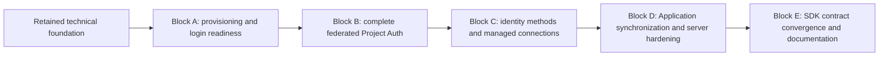

# OwlAuth server and hosted-web implementation plan

> **Status:** tracked implementation plan; non-normative.
>
> The behavioral authorities are [`spec/01`](01-system-context-and-goals.md) through
> [`spec/11`](11-identity-connections-passwordless-email-and-user-sync.md), with the
> technology selections in [`spec/10`](10-implementation-technology-selections.md),
> [`TS-001`](technology/ts-001-postgresql-repositories-and-migrations.md), and
> [`TS-002`](technology/ts-002-hosted-web-and-asset-pipeline.md). If this plan and an
> owning specification differ, the owning specification wins and this plan is updated.
> Delivery-block order below expresses hard capability dependencies, not releases or
> compatibility promises.

## 1. Purpose and delivery rules

This document turns the target architecture into an incremental, bottom-up delivery
sequence for the single `owlauth-server` package, the Runtime Hosted Authentication UI,
and the Control Management Console. It includes the server-side well-known descriptor and
remote HTTP MCP adapter. Official SDK contract convergence and documentation are a later,
server-independent Block E; the server blocks do not wait on SDK design. This plan does not cover
platform/framework SDK wrappers, define another product contract, or move behavioral authority out
of the concern-specific specifications.

The repository retains the production-shaped technical foundation selected by TS-001 and TS-002,
and Blocks A through C now provide real provisioning, Project Auth, identity, email, and managed
connection journeys. The remaining plan extends the server in substantial end-to-end capability
blocks rather than treating tables, routes, static pages, or SDK packaging as server milestones.

The following rules apply to every delivery block:

01. **Dependencies point inward.** Domain and application code know semantic ports, not
    Axum, SeaORM, SQLx, Redis, provider/SMTP payloads, React, or public DTOs.
02. **PostgreSQL proves security facts.** One-use state, Project ownership, revisions,
    sessions, credential generations, outboxes, and audit outcomes are committed there.
    Redis can improve admission and derived-data latency only.
03. **Each increment is usable through its real boundary.** A UI workflow is enabled only
    after its ordinary HTTP contract and application service exist. Browser tests start
    the real Rust server; they do not replace missing backend behavior with a mock server.
04. **A narrow technology spike proves only technology.** The required TS-001 and TS-002
    spikes are retained as production foundations, but do not count as Project Auth,
    Console, or product end-to-end completion.
05. **Schema evolves by expand/migrate/switch/contract.** Released migrations are never
    edited. Each delivery block remains safe for the declared mixed-version overlap before a
    later contraction.
06. **One vertical journey before breadth.** For example, one real upstream provider is
    completed through handoff before adding other provider adapters; one complete Console
    resource workflow precedes broad CRUD coverage.
07. **No hidden alternate implementations.** CLI, MCP, HTTP, workers, and both web surfaces
    invoke the same application services. Test-only helpers may substitute external ports,
    but never domain authorization, repository transactions, or one-use semantics.
08. **Security and operations ship with the behavior.** Redaction, audit, limits,
    idempotency, deadlines, readiness, recovery, and negative tests are block exit
    conditions rather than a final cleanup pass.
09. **Capability blocks are completion boundaries, not one-commit mandates.** A block may
    use several reviewable commits and parallel work lanes, but intermediate infrastructure
    is not advertised as a completed product capability.
10. **Prepare the execution detail just in time.** Before implementation begins for each
    block, create or refresh an English detailed plan under the gitignored
    `local-reference/` tree. That local plan inventories the current code, migration and
    contract deltas, work lanes, dependency gates, test matrix, recovery concerns, and
    explicit exclusions. It guides execution but is not behavioral authority and is not a
    substitute for updating this tracked plan when the block boundary changes.

## 2. Planned implementation shape

Names in this section are organizational guidance, not stable Rust API names. Server-only
modules remain internal to `crates/owlauth-server` unless a real independent boundary is
approved.

```text
crates/owlauth-types/src/
  runtime/                 Runtime DTOs, errors, endpoint metadata, OpenAPI root
  control/                 Control DTOs, problem details, endpoint metadata, OpenAPI root
  health/                  listener-safe probe vocabulary
  export/                  deterministic separate Runtime/Control OpenAPI export

crates/owlauth-server/src/
  domain/                  IDs, aggregates, value objects, state machines, domain errors
    project/ application/ identity/ connection/ login/ email/
    session/ token/ key/ projection/ webhook/ audit/
  application/             commands, queries, orchestration, actor/context types
    ports/                  semantic repositories/UoW and external-effect ports
  adapters/
    postgres/               private SeaORM entities, repositories, UoW, error mapping
    migrations/             SQLx startup migrator and DDL-free verifier
    redis/                  cache, invalidation, and rate coordination only
    providers/              GitHub, Google, and generic OIDC implementations
    secrets/                provider/SMTP/webhook configuration-secret storage
    crypto/                 signer, verification directory, data protection, digests,
                            PostgreSQL managed-credential AEAD protection
    smtp/                   bounded SMTP transport
    http/runtime/           Runtime parsing, middleware, routers, response mapping
    http/control/           Control authentication, routers, response mapping
    web_assets/             separate Runtime/Control manifests, shells, embedding
    workers/                mail, provider-sync, and Application-webhook dispatchers
    telemetry/              redacted logging, metrics, tracing, and audit integration
  composition/              typed config, all/runtime/control roots, lifecycle/readiness

crates/owlauth-server/migrations/
  ordered reviewed SQL      schema authority; no SeaORM schema synchronization

crates/owlauth-server/web/
  src/runtime/              Hosted Authentication UI graph
  src/control/              Management Console graph
  src/shared/               authority-free primitives only
  src/generated/            committed, separate type-only OpenAPI outputs
  scripts/                  generation, manifest validation, deterministic compression
  dist/runtime/             prepared Runtime embed tree (generated)
  dist/control/             prepared Control embed tree (generated)
```

### 2.1 Core application ports

Implement ports when the first consuming vertical slice needs them; do not build a generic
framework in advance.

| Port family                                     | Semantic responsibility                                                                                                                     | First consumer                  |
| ----------------------------------------------- | ------------------------------------------------------------------------------------------------------------------------------------------- | ------------------------------- |
| `UnitOfWork` and Project-qualified repositories | transactional commands, conditional state changes, durable audit append, conflict classification                                            | Block A provisioning            |
| `Clock`, `EntropySource`, digest service        | deterministic time tests and CSPRNG-backed opaque credentials                                                                               | provisioning and login          |
| `Signer`, `VerificationKeyDirectory`            | Project-purpose signing and public key lookup by opaque key reference                                                                       | key lifecycle/token issuance    |
| `DataProtector`                                 | purpose- and context-bound encryption of short-term transaction state and long-term email PII                                               | federated login and email login |
| `ManagedCredentialProtector`                    | protect/unprotect a renewable credential as versioned AEAD ciphertext bound to exact Project/identity/generation context                    | managed identity connection     |
| `ConfigurationSecretProvisioner`                | durably write/reconcile a Project provider, SMTP, or webhook secret and return only its opaque purpose-bound reference                      | Block A provider setup          |
| `ProviderSecretResolver`                        | resolve a Project provider client secret from its opaque configuration reference                                                            | provider callback               |
| `UpstreamProviderClient`                        | authorization, one code exchange, issuer/subject verification, separately classified credential renewal and bounded read-only profile fetch | federated login                 |
| `MailTransport`                                 | one bounded SMTP submission from a claimed durable message                                                                                  | passwordless email              |
| `UserProjectionPublisher`/webhook transport     | sign and deliver one immutable Application event attempt                                                                                    | Application synchronization     |
| `Cache`, `RateLimiter`, invalidation publisher  | disposable revisioned data and coordinated admission; never an allow authority                                                              | first public Runtime endpoint   |
| `AuditAppender`                                 | transactional append where required; a sink only for non-transactional telemetry                                                            | first mutation                  |

Ports return bounded semantic results such as `Conflict`, `Unavailable`, `Rejected`,
`AmbiguousExternalOutcome`, or `IntegrityFailure`. Vendor error strings and recoverable
credentials stop at adapters.

### 2.2 Schema increments

Do not land one giant initial schema. Each migration group accompanies the application
behavior that owns it, while preserving direct `project_id` qualification and same-Project
foreign-key constraints.

| Increment              | Durable state introduced or expanded                                                                                                                                                                                                                        |
| ---------------------- | ----------------------------------------------------------------------------------------------------------------------------------------------------------------------------------------------------------------------------------------------------------- |
| Provisioning           | Projects, Applications, redirects, origins, publishable identifiers, policies, Control idempotency, and audit on the retained SQLx history                                                                                                                  |
| Login readiness        | key rings, signing keys, key state events, provisioning operations, Runtime publication leases, provider configurations, and assignments                                                                                                                    |
| Federated Project Auth | generic method-selection login transactions, linked identities, users, browser sessions, handoff tickets, and minimal Application-user binding/materialized projection with both revisions                                                                  |
| Application sessions   | Application sessions, refresh families/tokens, revision snapshots and revocation state                                                                                                                                                                      |
| Passwordless email     | normalized verification-address evidence as defined by spec 11, email challenges/attempt state, versioned SMTP configuration references and durable secret operations, immutable delivery-generation pin, durable mail outbox                               |
| Managed connections    | connection lifecycle, PostgreSQL managed-credential AEAD ciphertext/key version, durable generation-fenced renewal operation, sync metadata, lease/attempt state; never downstream token-broker grants                                                      |
| Application sync       | projection-policy expansion cursor, immutable events, webhook endpoint/signing-secret references and durable secret operations, delivery outbox, attempts, replay/idempotency state; existing bindings/projections are extended rather than introduced here |
| Control automation     | short-lived one-use MCP confirmation-capability digests bound to exact command, Project, revisions, fixed deployment-operator actor, MCP/Control audience, deployment, and audit transaction                                                                |

Literal table/column names and migration grouping are reviewed against specs 04, 07, and 11
before SQL is merged. Sensitive values use digests, authenticated ciphertext, or opaque
secret-store references as required. V1 provider renewable credentials are purpose-bound
AEAD ciphertext in PostgreSQL so replacement is one authoritative transaction; provider
client secrets, SMTP passwords, webhook signing secrets, and private signing keys remain
external references. None are ordinary plaintext columns.

### 2.3 Server contracts and hosted-web generated clients

`owlauth-types` exports two complete OpenAPI 3.1 documents without compiling
`owlauth-server`. Runtime and Control DTO modules remain disjoint. A contract increment
lands in this order:

1. define bounded wire vocabulary, stable errors, endpoint metadata, and serialization
   tests in `owlauth-types`;
2. map DTOs explicitly to already-tested application commands/results;
3. export each plane document and prove plane purity;
4. regenerate and review only that plane's committed TypeScript type file;
5. implement its Rust HTTP adapter tests;
6. enable the corresponding web workflow and browser tests.

Representative contract families are those owned by specs 05 and 11:

- Runtime public config, generic login start, hosted transaction method selection,
  provider callback, email challenge/verification, handoff exchange, refresh, current
  user, logout, and Project JWKS;
- Control Project/Application/provider/connection/SMTP/webhook configuration, users and
  identities, sessions, policy, keys, audit, replay, and bounded system capabilities;
- the revisioned bounded user projection on successful handoff/current-user/refresh
  results, plus immutable signed webhook event envelopes for Application backends.

Existing SDK code may follow an implemented Runtime contract, but it is not an exit dependency for
Blocks A through D. Block E will select and enforce one language-neutral contract/conformance
scheme after the server surface is stable, then converge the TypeScript, Python, and Rust SDKs and
documentation together. Until then, server and hosted-web changes remain authoritative through
`owlauth-types`, exported OpenAPI, serialization tests, and real server/browser journeys.

This plan does not freeze route spellings that spec 11 has not assigned. Contract review
must prove exact Project/Application/redirect/PKCE binding, enumeration-safe email
responses, unknown-enum policy, input bounds, idempotency, revision conflicts, and secret
redaction before exposure.

## 3. Cross-block test model

| Layer                                            | What it proves                                                                                           | What it must not pretend to prove                 |
| ------------------------------------------------ | -------------------------------------------------------------------------------------------------------- | ------------------------------------------------- |
| Domain unit/state-machine tests                  | transitions, revisions, expiry, link/merge rules, projection bounds                                      | SQL concurrency or HTTP behavior                  |
| Application tests with explicit port substitutes | orchestration and classified external outcomes                                                           | production adapters or product E2E                |
| PostgreSQL integration tests                     | real migrations, constraints, locks, UoW rollback, one-use races, outbox claiming                        | browser behavior                                  |
| Adapter contract tests                           | provider, secret store, SMTP, signer, and webhook protocol mapping with controlled external test servers | a complete user journey                           |
| In-process HTTP tests                            | middleware order, route isolation, DTO/error mapping, bounds, auth/CORS                                  | asset/browser security or real socket topology    |
| Rust-server browser tests                        | real routers, embedded assets, configured bases, real implemented API behavior                           | unsupported flows hidden behind fixture responses |
| Server-backed product E2E                        | complete implemented journey through PostgreSQL and normal application services                          | future endpoints or core logic replaced by mocks  |
| Release/package tests                            | offline crate, binary/container assets, migration/readiness and digest parity                            | semantic correctness already owned below          |

A provider test server, SMTP capture server, KMS test adapter, or webhook receiver may stand
in for an external dependency while exercising OwlAuth's real adapter and core. Seeding
normal prerequisite configuration is allowed. Directly inserting impossible terminal
state, mocking the Runtime/Control API under a UI, or replacing application services does
not qualify as E2E.

Concurrency suites include callback double-submit, handoff double exchange, refresh reuse,
email OTP/magic-link races, provider connection sync versus revoke/disconnect, projection
revision races, duplicate outbox claims, webhook replay, and Project disablement between
prepare and commit. Cross-Project variants accompany every Project-owned repository and
public command.

## 4. Delivery blocks

The technical foundation is retained as completed work. Product delivery proceeds through
four substantial capability blocks. The order is bottom-up: each block establishes the
authoritative state and security semantics required by the next block, then carries them
through application services, public boundaries, browser surfaces, and real end-to-end
verification.



A block is the externally meaningful completion boundary. Its internal migration groups,
modules, adapters, contracts, and commits remain reviewable increments, but they do not
create smaller product claims. Before starting a block, its detailed execution plan is
prepared under `local-reference/` according to rule 10 in section 1.

### Retained technical foundation — completed

**Capability claim:** none beyond trustworthy build, migration, composition, discovery,
and credential-free web-shell foundations.

The retained repository foundation includes:

- strict typed configuration with unknown-field rejection and redacted secret wrappers;
- embedded SQLx `auto` migrations, DDL-free checksum-prefix/compatibility-floor `verify`, bounded migration
  locking, and independent Runtime/Control SeaORM serving pools;
- a private transaction-bound Project Unit of Work proving the selected repository shape;
- distinct `all`, `runtime`, and `control` composition roots, listeners, routers, lifecycle,
  liveness/readiness foundations, and Control Bearer admission;
- origin-root self-hosted endpoint discovery and credential-before-release CLI
  dispatch foundations;
- separate Runtime and Control OpenAPI roots and deterministic embedded hosted-web build
  pipelines, manifests, asset trees, and credential-free shells;
- redaction-first telemetry, bounded dependency plumbing, real PostgreSQL/Redis container
  tests, container smoke coverage, and reproducible package artifacts.

These foundations remain production code and are extended rather than replaced. They do
not establish Project/Application domain behavior, signing readiness, a real Console
administration journey, or end-user authentication.

**Retained acceptance:** migration and web-asset validation gates continue to pass; plane
routing and assets remain isolated; `runtime` never loads the operator key; malformed
Control configuration fails before binding; and debug, test, release, unpacked-crate, and
container paths consume the same prepared assets without a Node.js or filesystem fallback.

### Block A — Control provisioning and Runtime login readiness

**Capability outcome:** from a fresh authoritative database, an operator uses the real
Management Console and ordinary Control API to create and configure one Project and
Application, provision and safely activate a Project signing key, register and assign one
upstream provider, and observe the Application's real Runtime public configuration and
Project JWKS. The deployment is operationally ready for login, but no end-user login or
credential issuance is claimed.

#### A.1 Domain and durable-state foundation

1. Implement typed IDs, bounded values, statuses, and revision rules for Project,
   Application, exact redirect/origin registrations, publishable identifiers, initial
   policy, provider configuration/assignment, key ring/provisioning/lifecycle, signing
   epoch, Runtime publication leases, Control idempotency, and durable audit.
2. Add the provisioning migration group for Projects, Applications, redirects, origins,
   publishable identifiers, policy and security revisions, resource-lifetime Control
   idempotency, and append-only audit.
3. Add the login-readiness migration group for key rings, signing-key metadata and state
   events, durable provisioning operations, Runtime publication leases, provider
   registrations and assignments, and opaque provider-secret references.
4. Put direct `project_id` qualification on every Project-owned row. Use same-Project
   composite foreign keys, exact-value uniqueness, immutable public identity where
   required, and database constraints that reject cross-Project children even if an
   application defect reaches the adapter.
5. Keep private signing material and provider secret bytes outside ordinary PostgreSQL
   columns. Store only reviewed public JWK material, digests, durable operation state, and
   opaque purpose-specific references.

#### A.2 Repositories, ports, and external reconciliation

1. Extend the private SeaORM adapter into transaction-bound Project, Application,
   configuration, key, provider, idempotency, and audit repositories exposed through the
   application-owned Unit of Work.
2. Classify conflicts, not-found results, unavailable storage, integrity failures, and
   ambiguous external outcomes semantically; no ORM or vendor type crosses the port.
3. Add the first consumers of `Clock`, `EntropySource`, and digest services for durable
   identifiers, opaque public values, idempotency, and deterministic tests.
4. Implement `Signer`, `VerificationKeyDirectory`, and
   `ConfigurationSecretProvisioner` adapters against production-shaped protocols with
   controlled test systems. KMS/signer/secret calls occur outside database transactions.
5. Reconcile key or secret provisioning through one durable operation identity. Key
   ambiguity follows the adapter's inspected reconciliation or explicit terminal outcome.
   An uncertain provider-secret write is always reconciled across timeout, retry, and
   restart before committing its opaque reference/configuration revision; it cannot be
   treated as absent until the adapter proves no usable external effect. Neither path can
   create an unrecorded duplicate external resource.
6. Implement Runtime publication observation and bounded leases. Key activation requires
   resolvable signer capability, published public material at the expected revision, and
   the full propagation interval. Redis never activates a key.

#### A.3 Application services and authoritative queries

Implement and compose:

- `ProjectApplicationService` for create/read/update/disable and approved metadata;
- `ApplicationConfigurationService` for registration, status, exact redirects/origins,
  publishable identifiers, and policy;
- `KeyLifecycleService` for durable provision/reconcile/publish/activate/retire and
  distinct emergency compromise-revocation behavior;
- `ProviderConfigurationService` for write-only secret setup, provider lifecycle, and
  exact same-Project Application assignment;
- bounded Runtime public-configuration and Project JWKS queries.

Every Control mutation uses the fixed `deployment_operator` actor, expected revisions when
required, and transactionally attributed audit. Only eligible retry-sensitive operations
use idempotency: durable resource creation retains its replay/tombstone record for at least
the resource lifetime, while other eligible commands use a documented bounded window
longer than every supported client retry/reconciliation window. Commands that do not need
idempotency create no such record. Every Runtime query derives its result from current
PostgreSQL state; a revisioned cache may accelerate reads but cannot authorize or preserve
an obsolete method assignment.

#### A.4 Public contracts and browser surfaces

1. Define bounded Control DTOs, stable problem details, endpoint metadata, serialization
   tests, and OpenAPI for system capabilities, Project/Application configuration, key
   lifecycle, provider configuration, and provider assignment.
2. Define separate Runtime DTOs and OpenAPI for exact-Application public configuration and
   Project JWKS. They expose no provider secret, signer reference, private key, operator
   metadata, `belongs_to`, database topology, or unsupported login operation.
3. Map the already-tested application commands/results explicitly into the HTTP adapters;
   authenticate Control before resource resolution and keep Runtime credential classes
   categorically separate.
4. Regenerate and review the Control and Runtime type-only web clients independently and
   preserve plane-pure imports and output closures.
5. Turn the Control shell into the complete provisioning Console journey: page-memory key
   capture/validation/disposal; Project/Application create/list/detail; exact
   redirect/origin and policy forms; idempotent retry; revision-conflict recovery; signing
   provisioning/publication/activation/retirement/compromise-revocation status; provider
   registration/assignment; safe problem rendering; and explicit high-impact confirmations.
6. Allow Runtime only to bootstrap stored public branding/configuration and JWKS. Do not
   render a working sign-in action or synthetic completion path before Block B.

#### A.5 Parallel work lanes

The block has one dependency spine and three bounded parallel lanes:

- **domain/data spine:** invariants, migrations, repositories, Unit of Work, and application
  services;
- **crypto/secrets lane:** signer, verification directory, secret provisioner, durable
  reconciliation, and publication observation, joining before key/provider services exit;
- **contract/Console lane:** wire design may proceed from reviewed service meanings, but
  generated clients and workflows join only after real application boundaries exist;
- **verification lane:** PostgreSQL fixtures, controlled external systems, browser harness,
  redaction assertions, and split-plane scenarios are prepared early and prove the joined
  capability at exit.

These are execution lanes, not separately advertised milestones.

#### A.6 Risk gates and acceptance

The block exits only when all of the following pass:

- real PostgreSQL tests cover migration from the retained foundation, UoW rollback with
  audit, idempotent replay, payload-digest mismatch, revision conflicts, duplicate exact
  registrations, and cross-Project child injection; durable-resource creation records
  remain replay/tombstones for the resource lifetime, bounded eligible command records
  respect documented retry/reconciliation retention, and an expired unknown create outcome
  requires reconciliation rather than permission to execute again;
- route/body Project mismatches, cross-Project identifiers, and not-found variants do not
  leak another Project's existence;
- Project/Application disablement and provider disable/unassignment advance the owning
  revisions and invalidate prepared stale Runtime work at the final decision point;
- provisioning retry resolves the same durable external operation; provider-secret timeout
  before or after an external write, retry, process restart, and configuration revision
  conflict converge on one opaque reference/configuration outcome with no duplicate or
  orphan-authoritative state and no exposed bytes; key ambiguity follows its explicit
  reconciliation outcome, and no network I/O holds a database transaction;
- missing/stale publication evidence and propagation delay reject key activation;
  concurrent activation preserves the one-active-key invariant and signing epoch guard;
  emergency compromise revocation atomically marks the key revoked, advances the signing
  epoch, removes it from signing and Runtime JWKS publication, and appends state/audit
  events without silently broadening Project/session revocation scope;
- public config is exact-Project/Application and JWKS is exact-Project; both are
  representation-correct, bounded, and safe with Redis flushed, stale, or unavailable;
- provider secret bytes, private signing material, opaque references unsuitable for
  display, operator-key material, and fingerprints are absent from public DTOs, read DTOs,
  OpenAPI examples, Console state, browser storage, Redis, logs, metrics, traces, and audit;
- Console reload, close, explicit lock, and authentication failure leave no supported
  storage, DOM, URL/history, cache, log, or exported copy of the operator key;
- Playwright starts the real Rust Control and Runtime listeners with real PostgreSQL and
  completes the full operator journey through public config/JWKS; Runtime receives neither
  Control routes/assets nor an Authorization value from the Console;
- combined and split topologies read one PostgreSQL authority, survive the other plane's
  process outage within their owned behavior, and fail configuration when database targets
  differ even if migration histories match.

**Explicit exclusions and honest claim:** login transactions, provider authorization/code
exchange, Project users, linked identities, browser/Application sessions, handoff tickets,
access/refresh tokens, current-user/logout, and Hosted UI method selection are absent. The
supported statement is “this Project/Application is provisioned and operationally ready
for login,” not “OwlAuth supports user login.”

### Block B — Complete federated Project Auth

**Capability outcome:** one Application starts generic PKCE S256 login; the real Hosted UI
renders the admitted snapshot and explicitly selects one production upstream provider; the
real adapter validates one callback; OwlAuth resolves or creates a Project user and browser
session; the Application exchanges a one-use handoff for a signed access token, rotating
refresh family, and authoritative bounded user projection; and the Application can use
current-user, refresh, Application logout, Project browser logout, revocation, and explicit
same-Project browser-session reuse. This block is the first supported end-user login
product, not a one-shot callback demo.

#### B.1 Domain and durable-state foundation

1. Implement the generic login transaction and one-way admitted-method selection,
   provider callback claim/completion, explicit browser-session reuse confirmation, linked
   identity, Project user, Project browser session, handoff, Application-user binding and
   materialized projection, Application session, refresh family/generation, token claims,
   expiry, logout, revocation, and security-revision state machines. The access-token model
   fixes `iss` from trusted Runtime configuration plus immutable Project identity, `aud`
   as the exact immutable Project public ID, Project-scoped `sub`, initiating `app_id`, session
   `sid`, `iat`/`nbf`/`exp`, unique `jti`, token `typ`, `auth_time`, `claims_rev`, and only
   bounded namespaced custom claims; provider/email internals, credentials, `belongs_to`,
   operator material, and secret references are forbidden.
2. Preserve issuer/subject as the federated identity key. Email, name, picture, or another
   profile value never silently links users.
3. Introduce the minimum identity kernel required at first handoff: monotonic
   `user_revision`, unique `(project_id, application_id, user_id)` binding, monotonic
   `projection_revision`, and one deterministic bounded materialized projection per
   binding.
4. Add login/session migrations with allowed-method and authoritative revision snapshots,
   transaction/browser/CSRF binding, keyed digests, purpose-bound encrypted recoverable
   state, exact redirect/callback/provider/PKCE snapshots, one-use constraints, browser
   and Application sessions, refresh generations, binding/projection uniqueness, and
   transactional audit.
5. Add only the indexes and constraints required by callback, handoff, current-user,
   refresh, and revision critical paths; no Redis authority or unbounded revocation fan-out
   is introduced.

#### B.2 Conditional repositories and external adapters

1. Implement conditional repository operations for generic start, one-way method
   selection, explicit session-reuse confirmation, callback claim/completion, identity
   resolution/creation, browser-session creation, handoff consumption, session/family
   creation, refresh rotation/replay revocation, current-user, and logout.
2. Add `DataProtector`, `ProviderSecretResolver`, opaque-value digest, one production
   upstream-provider adapter, and the signer path required for token issuance. External
   provider exchange and signing occur outside a database transaction with bounded
   classified outcomes.
3. Treat an ambiguous provider code exchange as terminal; never blindly retry the code.
   Discard a prepared signed output when the final signing epoch or authoritative revision
   no longer matches.
4. Make ticket consumption, first binding/projection materialization, Application session,
   refresh family/token, and audit one PostgreSQL commit. A losing exchange receives no
   credential material.
5. Rotate one refresh generation per transaction. Any later or concurrent reuse of a
   consumed generation revokes the complete family, including a successor created by a
   competing request; there is no stable winner after replay is observed.
6. Add revisioned disposable config/JWKS caches, invalidation hints, and coordinated
   endpoint rate admission only after equivalent PostgreSQL-authoritative paths pass. Each
   endpoint has an explicit bounded Redis-loss policy; cache or limiter state never proves
   Project ownership, method eligibility, session validity, or one-use success.

#### B.3 Application services, Runtime contracts, and Hosted UI

1. Implement generic login start, method selection, explicit browser-session reuse,
   callback completion, identity resolution, browser-session creation, handoff exchange,
   deterministic projection mapping, token issuance, refresh/current-user, Application
   logout, Project browser logout, and Control user/session disable/revoke services.
2. Revalidate current Project, Application, provider assignment, redirect, callback,
   user/session, policy, authentication age, and signing epoch at every owning
   decision/commit point. Prepared state cannot survive authoritative disablement.
3. Add Runtime contracts for public login start, hosted interaction state, method
   selection, session reuse, provider callback, handoff exchange, refresh, current-user,
   Application logout, Project browser logout, and Project JWKS consumption metadata.
4. Keep callback route/value classes separate from Application redirects. The optional
   start hint affects presentation only and cannot select, enable, or authorize a method.
5. Add the Control user/session metadata and disable/revoke operations needed to operate
   the complete lifecycle; do not expose provider credentials or source payloads.
6. Enable the Hosted UI's admitted-method picker, bounded “continue as” confirmation,
   selected-provider/progress/completion states, safe local restart/error paths,
   accessibility, and exact Application return. It receives only opaque interaction state
   and bounded public presentation data.
7. Keep any existing SDK protocol code limited to real Runtime paths, without making SDK design,
   packaging, or cross-language parity an exit dependency for this server block.
8. Defer language-neutral SDK contract selection, three-language convergence, server-backed SDK
   conformance, and SDK release claims to Block E.

#### B.4 Risk gates and acceptance

The block exits only when:

- generic start snapshots only currently admitted assigned methods; browser/CSRF/revision
  races prove exactly one provider selection or explicit eligible browser-session reuse
  wins, while a safe hint cannot select;
- caller-named, cross-Project, expired, logged-out, stale-policy, or otherwise ineligible
  browser sessions fail generically and cannot fall back to a caller-selected identity;
- callback double-submit produces one committed winner; wrong state, browser, Project,
  provider, callback, assignment revision, or terminal transaction receives no handoff;
- unknown verified identity creation and existing issuer/subject resolution are atomic;
  matching email never silently links, and the same upstream subject in two Projects
  creates independent Project users;
- handoff double exchange, wrong Application/Project/PKCE/redirect, expiry, disablement,
  and signing-key transitions yield at most one complete committed session response and no
  token material for a loser;
- the first successful handoff creates exactly one Application binding/projection with
  both revisions; another Application remains unbound and cannot observe the user;
- handoff, refresh, and current-user return the same generated bounded projection shape;
- shared claim vectors prove exact Project issuer/audience, `sub`, `app_id`, `sid`, unique
  `jti`, access-token `typ`, bounded time/authentication/revision claims, allowlisted
  algorithm and `kid`, bounded namespaced custom claims, and forbidden-field exclusion;
  negative vectors reject cross-Project issuer/audience, wrong Application policy where
  additionally restricted, unknown/revoked `kid`, algorithm confusion, wrong type, and
  premature/expired tokens;
- concurrent refresh and later reuse revoke the complete family; an ambiguous lost response
  requires reauthentication rather than repeated use of the old token, while the real test
  Application explicitly serializes each family and atomically replaces or quarantines caller-owned
  credentials;
- Application logout leaves other Applications and the Project browser session valid,
  while Project browser logout blocks refresh for every derived Application session;
- Project/Application/user/provider/assignment disablement is observed after PostgreSQL
  commit at every new callback, handoff, refresh, current-user, and signing decision;
  emergency active-key revocation immediately stops OwlAuth signing and current-user
  verification for the revoked `kid`, advances the epoch/JWKS revision, and lets refresh
  mint only through a previously Published key that has already satisfied activation
  conditions and is activated atomically; cached offline verifiers
  are tested against their documented bounded JWKS refresh rather than promised instant
  revocation;
- provider access tokens are transient and absent from PostgreSQL, redirect, projection,
  browser, audit, Redis, and telemetry; no downstream provider-token-broker route exists;
- product browser E2E separately uses the actual embedded Runtime UI/API, real PostgreSQL,
  real application services, and a controlled standards-compatible provider through the
  production adapter; a real Application backend exchanges the handoff, verifies the JWT
  signature and complete trust namespace against Project JWKS, and performs
  refresh/current-user/logout, including cross-Project and malformed-token rejection;
- redirect abuse, DOM injection, CSP, no-store, referrer suppression, cookie path,
  same-origin CSRF, origin/fetch metadata, and cross-plane asset/route tests pass;
- Redis loss or staleness never converts denial, revocation, duplicate use, or
  cross-Project input into allow.

**Explicit exclusions and honest claim:** passwordless email, retained renewable provider
credentials, background profile synchronization, signed projection webhooks, SCIM, and
bulk directory APIs remain absent. Browser/native navigation, persistent credential stores,
automatic session managers, request interceptors, and framework bindings are not part of
the core SDK claim and may be delivered by separately versioned integration libraries. One
reviewed provider now has a complete maintainable Project Auth and session journey;
additional providers must reuse the same port and conformance suite rather than fork
policy.

### Block C — Identity methods and managed connections — completed

**Capability outcome:** the stable Project Auth kernel gains first-party verified email
OTP and magic-link login, managed provider-connection lifecycle, bounded login-time and
background profile synchronization, and explicit identity lifecycle controls. Both
identity-source lanes converge on the same Project user, login transaction, handoff,
session, revision, and deterministic projection semantics established by Block B.

The email and managed-connection lanes may execute in parallel after their shared identity
model is reviewed. They join before public lifecycle and projection behavior is declared
complete; neither lane may fork the login/session kernel.

#### C.1 Shared identity and projection foundation

1. Complete bounded source-profile, provenance, primary-profile ownership, explicit
   link/unlink/merge, profile precedence, and revision rules. Observation timestamps alone
   do not churn `user_revision` or `projection_revision`.
2. Require recent proof of both identities for linking. Matching verified email may be a
   safe UI suggestion but never links automatically. Merge is same-Project only,
   revision-guarded, resolves identity/binding/session conflicts explicitly, and audits the
   final disposition.
3. Extend the deterministic mapper so local operator-managed values and bounded provider
   or verified-email source values produce the same Application projection contract used
   by handoff, refresh, and current-user.
4. Preserve bounded Application-binding fan-out. Existing bound Applications may observe
   a real relevant user change; unbound Applications do not gain directory visibility.

#### C.2 Passwordless email lane

1. Extend the generic Block B transaction with one-way email selection, address entry,
   newest challenge generation, separate sibling OTP/magic proofs, attempts, expiry,
   consumption, enumeration-safe outcomes, and verified-email identity evidence. Enforce
   spec 11's non-overridable v1 entropy, length, expiry, attempt, resend, and per-transaction
   challenge limits while allowing Project policy only to tighten them.
2. Add versioned email canonicalization/digest aliases, purpose-bound encrypted long-term
   email PII, per-Project SMTP configurations and opaque secret references, durable SMTP
   secret-provisioning operations, the explicit deployment-default SMTP
   generation/status/revision registry, email challenges/proofs, and a durable mail outbox.
   Both challenge and message pin the exact Project or opted-in deployment-default SMTP
   selection, generation, and eligibility revision. Canonicalization or digest-key changes
   use dual lookup, uniqueness-safe alias backfill, conflict reconciliation, and explicit
   cutover; long-term PII key retirement requires proven re-encryption and inventory.
3. Bind every proof to Project, Application, exact redirect, PKCE, purpose, current
   security revisions, and one parent challenge. OTP and magic-link completion retain the
   browser interaction when policy requires it; a policy-permitted magic link may complete
   in another user agent without weakening the stored Application PKCE, login transaction,
   explicit-continue, CSRF, newest-generation, or one-use checks. Store proof material as
   keyed digests or purpose-bound ciphertext only where recoverability is required.
4. Implement challenge-plus-outbox enqueue as one transaction, lease-safe worker claiming,
   bounded retry/backoff and attempts, terminal handling, and retention. The final proof
   transaction revalidates the current pinned SMTP generation/status/revision, consumes the
   parent challenge, resolves or creates the email identity and Project user, advances the
   required revisions and already-bound projections, and creates the browser session,
   ordinary handoff, and audit atomically.
5. Implement `MailTransport` with bounded submission and the shared outbound destination
   policy: resolve the complete CNAME chain and every A/AAAA answer, deny every destination
   disallowed by deployment policy and every mixed allowed/denied result, and permit a
   specific private destination only through the deployment private-network allowlist.
   Mapped, link-local, metadata, and cross-plane targets remain unconditionally denied. Pin
   the validated connected IP while retaining the configured hostname for TLS
   SNI/certificate validation, reject
   redirects/rebinding, and allow only an equivalently enforcing proxy. Require implicit
   TLS or mandatory STARTTLS without downgrade, with explicit loopback-only plaintext
   development behavior. Startup/readiness matches the configured default
   generation/fingerprint to PostgreSQL.
6. Add Runtime method-select, challenge begin/resend, OTP verify, fragment-staged magic
   proof POST, and completion flows; add Control email-method enablement, explicit
   Application assignment, bounded policy, write-only SMTP setup/status, and identity
   metadata operations. SMTP secret writes reconcile one durable purpose-bound operation
   across timeout, retry, and restart before committing the opaque reference and
   configuration revision. Add accessible Hosted UI check-mail/code/link/expiry/restart
   states.
7. Compose the mail worker in Runtime-capable modes with PostgreSQL leases, bounded claims,
   retry/readiness/drain behavior, and no dependency on one process, Redis ownership, or
   Control availability.

#### C.3 Managed provider-connection lane

1. Implement `active`, `reauth_required`, `revoked`, and `disconnected` lifecycle states,
   legal transitions, revision guards, timestamps, source-profile metadata, sync cursors,
   reauthorization, retention, and explicit revoke/disconnect behavior.
2. Store the least-scope renewable credential only as versioned, purpose- and exact
   Project/identity/connection/generation-bound AEAD ciphertext in PostgreSQL. When current
   Project policy and adapter capability enable management, callback completion establishes
   or updates the connection and credential generation atomically with the identity/user
   result; login-only providers retain none. The credential exists solely for bounded
   profile synchronization and is never an Application credential.
3. Add durable generation-fenced renewal operations with expected/successor generation,
   adapter attempt ID, prepared/submitted/terminal state, and lease metadata. Commit the
   submitted marker before external rotation; post-marker ambiguity is never treated as a
   safe unrecorded retry.
4. Separate read-only profile fetch from rotating renewal behind provider capability
   declarations. Read retry requires adapter-declared safety; absent exact idempotent replay,
   ambiguous rotation destroys predecessor usability and moves to `reauth_required`.
5. Commit successor ciphertext before optional profile fetch. Login-time sync has a bounded
   latency budget and stale-safe fallback; background work is revision-conditional and late
   work cannot overwrite revoke, disconnect, reauthorization, or user changes.
6. Add only metadata/action contracts and Console/Hosted UI states required to inspect,
   reauthorize, revoke, disconnect, link, unlink, or merge. No route returns or brokers a
   provider access/refresh token or accepts Application-requested provider scopes.
7. Compose provider-sync workers in Runtime-capable modes with PostgreSQL leases, bounded
   per-Project work and latency, readiness/drain behavior, and no Control-process or Redis
   authority.

#### C.4 Risk gates and acceptance

The block exits only when:

- known, unknown, disabled, already-linked, policy-blocked, and rate-limited email
  addresses have materially equivalent public response classes and bounded timing/rate
  behavior without a logs/metrics/Console side channel;
- OTP and magic link are sibling proofs of the newest parent challenge, and consumption of
  either, resend, expiry, attempt exhaustion, or newer generation makes every obsolete
  proof unusable across all Project/Application/redirect/PKCE/purpose boundaries;
- magic-link material is staged in the URL fragment, removed from history, and consumed
  only by explicit same-origin POST; GET previews and security scanners cannot consume it;
  same-browser completion enforces its interaction binding, while a policy-permitted
  different-user-agent completion preserves the exact transaction and Application PKCE;
  policy-denied transfer, wrong PKCE, stale revision, or replay still fails generically;
- Project SMTP and explicit deployment fallback, generation replacement,
  disable/compromise races, delivery retry/exhaustion, restart, restored-state validation, TLS
  downgrade/certificate failure, and redaction pass through real outbox and SMTP adapters; the
  repository documents the consistent backup set but does not operate deployment backups;
  destination tests cover full CNAME/A/AAAA chains, an explicitly allowlisted private SMTP
  relay, unlisted private targets, mixed allowed/denied answers, IPv4-mapped IPv6,
  link-local/metadata/cross-plane targets, IP pinning, rebinding, redirect denial, and proxy
  equivalence;
- SMTP secret-store timeout before/after an external write, retry, process restart, and
  revision conflict reconcile to one opaque reference/configuration outcome without
  duplicate or orphan-authoritative state and without exposing bytes;
- a delivered proof is denied after its pinned SMTP generation becomes compromised;
  email canonicalization/digest changes preserve uniqueness through dual lookup and alias
  backfill without duplicate identities; long-term PII key rotation proves re-encryption
  before retirement, documented restore invariants preserve alias and key-version inventory plus
  ciphertext, and missing required long-term key material makes the affected email
  capability explicitly unready/fail-closed rather than guessing or losing identities;
- managed-connection transition, stale-revision, login-time/background sync,
  revoke/disconnect, lease, process-crash, family-rotation, successor-commit, and ambiguity
  matrices pass against PostgreSQL;
- no uncertain predecessor credential becomes usable again; invalid/expired grant or
  non-replayable ambiguity moves to `reauth_required`, queued work cannot restore a
  revoked/disconnected connection, and missing managed-credential key material fails
  closed with explicit reauthorization rather than guessed recovery;
- profile changes advance only the correct user/binding revisions and produce the same
  handoff/refresh/current-user projection contract; observation-only changes create no
  revision churn;
- link/merge requires current proof and same-Project revision guards; identity conflicts,
  binding disposition, primary profile, and sessions resolve atomically or not at all;
- provider renewable credentials, source payloads, SMTP secrets, unsuitable references,
  and email proof internals are absent from Runtime/Control read DTOs, projections,
  browser state, Redis, audit, logs, and telemetry;
- browser E2E exercises real Runtime UI/API, PostgreSQL, mail outbox worker, SMTP capture,
  provider adapter, handoff/session kernel, and reauthorization paths without UI-level
  mocked completion.

#### C.5 Closure record

Block C closes on the server capability itself, not on repeated full-repository, packaging, SDK, or
production-operations reviews. The frozen capability includes identity/email/managed-connection
state, PostgreSQL authority and migrations, Runtime and Control HTTP contracts, Hosted and Console
flows, cross-language wire facts already consumed by existing clients, and real public-boundary
browser journeys. Its proportional closure evidence is:

- one immutable checksum for the consolidated pre-release initial schema, plus
  clean/populated/concurrent/verify and repository rollback coverage; the first published server
  release freezes that baseline and all later schema changes become additive;
- focused PostgreSQL identity, email, managed-connection, projection, session, recovery, and
  key-inventory suites;
- server formatting, Clippy, library tests, hosted-web check/build/contract/plane-boundary gates,
  and the focused real PostgreSQL identity browser specification;
- `make dev` startup with Runtime health/readiness and the Control Console reachable from the public
  disposable `.env.example` configuration.

A deliberately slow five-minute browser wait is not required because expiry authority is already
proved against PostgreSQL; browser tests prove transport and presentation rather than duplicate the
clock. Partial state/cookie swaps are tested, while theft of the complete bearer-cookie capability
set is not claimed detectable.

Deployment backup scheduling, restore orchestration, and production operations are outside this
repository. Block D documents the authoritative PostgreSQL/external-store backup set, PostgreSQL
backup/PITR and restore best practices, verify-mode restart, and fail-closed server semantics; it
does not build an operations platform. Server hardening, image/package qualification, and
Application synchronization remain Block D. Three-language SDK convergence, SDK packaging matrices,
and end-user documentation belong to Block E. None of these reopen Block C.

**Explicit exclusions and honest claim:** Applications still receive user state only in
synchronous Runtime projection responses. Signed asynchronous projection webhooks,
application-wide directory export, SCIM, LDAP, password authentication, SMS, and downstream
provider-token brokering remain absent.

### Block D — Application synchronization and server hardening

**Capability outcome:** Applications can maintain a bounded local user view through the existing
revisioned Runtime projection and signed durable asynchronous projection events; operators can
configure, inspect, rotate, and replay that delivery safely; and the standalone server is hardened
for combined/split operation, worker recovery semantics, CLI/MCP administration, and server release
packaging. Deployment backup/restore and production operations remain operator responsibilities;
the repository provides PostgreSQL-oriented guidance and validation boundaries. SDK convergence and
documentation are independent Block E work.

#### D.1 Projection evolution and immutable event state

1. Complete reviewed field ownership, Project/Application projection policy, schema and
   size bounds, event kinds, immutable envelope, and distinction between Project-user
   `user_revision` and binding-specific `projection_revision`. Raw profiles, credentials,
   secrets, `belongs_to`, and unbounded values never enter a projection or event.
2. Add immutable events, Project/Application policy-expansion operations and resumable
   cursors, webhook endpoint metadata, opaque signing-secret versions and durable
   secret-provisioning operations, delivery outbox/attempt/lease/replay lineage, and
   retention state.
3. Preserve existing Block B/C bindings as existing visibility state. Installing event
   support creates no retroactive `user.projection.created`; a new handoff emits `created`
   only when that same transaction first creates the binding, while later real changes emit
   the reviewed update/disable kinds.
4. Make each relevant user mutation commit every affected bounded binding projection and
   required immutable event/delivery target together or commit none. Projection-policy
   changes enqueue one durable bounded expansion operation rather than unbounded work in a
   Control request; Runtime reads lazily repair stale policy when required.

#### D.2 Signed delivery and safe operations

1. Sign exact `timestamp "." event_id "." raw_body` bytes with Application-scoped secret
   versions. Require header and body event IDs to match and publish shared conformance
   vectors for signature, timestamp, overlap, and replay handling.
2. Treat endpoint URLs as immutable versions. Provision and rotate secrets through one
   durable purpose-bound external operation that reconciles timeout, retry, process restart,
   and revision conflict before committing the opaque reference/configuration revision.
   Rotate by prepare/install/activate/dual-sign-overlap/retire and never reveal secret bytes
   after the write boundary.
3. On endpoint creation, testing, and every attempt, resolve and validate the complete
   CNAME/A/AAAA set; reject denied, mixed, mapped, metadata, or cross-plane targets; pin the
   connected IP while retaining the hostname for SNI/certificate/Host; reject redirects
   and DNS rebinding; permit a proxy only when it enforces equivalent policy.
4. Use stable event/delivery IDs, bounded exponential backoff with jitter, per-Application
   fairness, explicit terminal states, lease-safe at-least-once attempts, and replay as a
   new delivery of the same immutable event rather than mutation re-execution.
5. Add Control endpoint/version setup, delivery inspection, signing-secret rotation,
   bounded replay preview/confirmation, idempotency, revision conflict, and audit
   contracts; preserve the existing Runtime handoff/current-user/refresh projection wire
   contract and add the Application receiver event contract.
6. Add Console setup, safe attempt inspection, rotation state, explicit replay, and
   recovery workflows through the generated Control client. Application receiver E2E uses
   the real server, worker, signer, PostgreSQL outbox, and HTTP receiver across restart.

#### D.3 Server hardening and release qualification

1. Add remaining approved provider adapters only through the established provider
   conformance suite, then complete reviewed Control user/identity/session/policy/audit
   views. Unsupported controls remain absent rather than disabled placeholders.
2. Complete and harden Runtime-capable worker composition for mail, provider sync,
   projection expansion, and webhooks with PostgreSQL leases, independent budgets,
   graceful drain, readiness/capability reporting, bounded cleanup, and safe multi-process
   duplication.
   Control can enqueue/inspect but does not execute outbound jobs.
3. Complete per-plane pools, priority and Project fairness, Redis degradation, circuit and
   deadline policy, retention, audit query bounds, Project-specific capability health, and
   load/backlog controls so background work cannot starve callback/handoff/refresh.
4. Exercise signer, data-protection, email digest/PII, managed-credential, SMTP, webhook,
   and operator-key rotation; migration lock contention; external outages; shutdown; and short- and
   long-term key loss. Document the exact PostgreSQL/external-store/key backup set, consistent
   snapshot or PITR requirement, restore ordering, verify-mode restart, and fail-closed missing
   reference behavior without implementing backup scheduling or restore orchestration.
5. Prove expand/migrate/switch/contract compatibility, identical embedded asset digests,
   source-free/no-network runtime images, server package contents/licenses, and server
   release/container smoke behavior.
6. Retain the server-owned origin-root well-known descriptor and add the self-hosted
   Streamable HTTP MCP Control adapter over stable reviewed application services:
   standards-conformant initialization/tool discovery, per-request `owl_ctrl` admission,
   bounded hand-designed tools, server-owned impact classes with fail-safe high-impact
   defaults, preview/commit confirmation, Control-only routing,
   Host/Origin/DNS-rebinding defenses, and no stdio/local process mode. Preview stores only
   a PostgreSQL digest of a high-entropy integrity-protected capability bound to the fixed
   `deployment_operator`, MCP/Control audience, deployment and exact Control endpoint,
   exact tool and normalized command, explicit Project, current target revisions, and short
   expiry; commit reauthenticates and consumes it exactly once in the same conditional
   transaction as mutation and audit. The operator key remains outside model-visible
   prompts, tool schemas/arguments/results, protocol errors,
   URLs, session identifiers, logs, and plugin configuration; MCP session state never
   becomes authorization.
7. Complete the CLI's self-hosted descriptor-pin lifecycle and typed Control client for
   implemented commands. Discovery, identity-pin changes, credential release, and failure
   behavior never infer endpoint identity from authenticated requests.

#### D.4 Risk gates and acceptance

The block exits only when:

- user-base and relevant projection-policy changes preserve monotonic per-user and
  per-binding revisions and atomically create required immutable event state; crash/restart
  of bounded expansion skips or duplicates neither authoritative outcome;
- an Application receives events only after its own binding and never observes another
  Application's projection or an unbound Project user;
- receivers validate exact signature vectors, header/body ID, timestamp, duplicate and
  out-of-order delivery, projection revision, and signing-secret overlap; webhook
  secret-store timeout before/after write, retry, restart, and revision conflict reconcile
  one opaque version without duplicate/orphan-authoritative state or byte exposure; replay
  preserves original event identity/payload/revisions and records a new authorized delivery
  lineage;
- webhook tests cover full DNS chains, mixed public/private results, rebinding,
  IPv4-mapped IPv6, metadata/cross-plane targets, endpoint versioning, proxy equivalence,
  redirect denial, timeout/body/response bounds, retry exhaustion, and process crashes
  before/after ambiguous HTTP outcomes;
- combined and split topologies pass the specs 03, 04, 08, 09, and 11 concurrency/failure
  matrices against one PostgreSQL authority; Runtime survives Control outage, and neither
  plane introduces cross-plane RPC authority;
- load tests prove bounded callback/handoff/refresh, mail, provider-sync, webhook, cleanup,
  audit, and Control-list behavior with Project fairness and no unbounded queue or query;
- after an operator restores a consistent PostgreSQL/external-store/key snapshot, verify-mode
  startup accepts only checksum-matching embedded history plus compatibility-floor-approved forward expansion history and server recovery uses only committed generations,
  cursors, leases, and outboxes; loss of an external reference fails its purpose closed, Redis
  remains disposable, and retained key material is not retired before proven re-encryption or
  expiry;
- CLI discovery tests cover first use, confirmation, malformed/unsupported descriptors,
  redirect/TLS/cross-origin rejection, every identity pin, invalid product/credential
  pairing, and authenticated transport/version failures with proof of no pre-release
  credential access, fallback, or cross-product probing; rebind clears old credentials,
  identity-bound target context, and derived caches before selecting the new client;
- MCP conformance proves protocol/version behavior, Control-only credential use,
  bounded hand-designed schemas, DNS/Host/Origin defenses, and one enforced
  preview/commit path for every high-impact mutation with no lower-impact alias; durable
  confirmation tests cover replay, expiry, stale revision, cross-command, cross-Project,
  wrong audience/deployment/endpoint, Runtime-route use, concurrent commit, and process
  restart, with exactly one
  atomic capability-consumption/mutation/audit winner;
- server package, offline crate, binary, container, licenses, migration/readiness, and web
  digests pass the server release qualification matrix;
- no password authentication, silent email linking, downstream provider-token broker,
  SCIM, bulk directory, server-side Control principal/session, local MCP process, or hosted
  multi-tenant/RBAC behavior has entered the product accidentally.

**Exit condition:** server release evidence covers every implemented product journey, security
boundary, external-effect ambiguity, split-plane failure, and recovery path. A green build of
isolated mocks, static shells, or SDK-only tests is insufficient.

#### D.5 Closure record

Block D closes the planned standalone-server delivery through Application synchronization and
server hardening. The frozen capability includes bounded revisioned Application projections;
exact-scope immutable events; signed durable webhook delivery, retry, replay, and retention;
Control and Console administration; the self-hosted remote HTTP MCP adapter; descriptor-pinned
self-hosted CLI dispatch; independent Runtime worker/recovery budgets; combined and split topology;
and server package and container qualification. This is a capability-plan closure, not a claim that
future maintenance, defect fixes, or release work can never change the server.

The proportional closure evidence is:

- the consolidated pre-release initial migration, frozen by checksum
  `80256fafc981565ae414e3ea3ab4cc0779d175dff96b5f546d6b5ba6b756fe5e`, with real-PostgreSQL
  migration, exact Project/Application webhook-graph, transaction, concurrency, lease, retention,
  key-reference, and recovery coverage;
- a Docker-required server-library run with 321 tests, 23 CLI tests, 12 public-types tests, and
  workspace all-target Clippy with warnings denied;
- hosted-web boundaries, lint, format, type checking, 68 Vitest tests, and 11 script tests, plus
  Chromium public-boundary Application-sync and identity journeys and focused Chromium/Firefox
  accessibility coverage;
- combined and split listener isolation, durable `verify` restarts, bounded SIGTERM shutdown,
  offline server-package/license qualification, and a container smoke test covering `tini`, health,
  readiness, and graceful stop; and
- cumulative independent review. The initial review's one P1 and three P2 findings were resolved;
  its first fix re-review's additional email-primary merge P1 and disabled loser-only coverage P2
  were also resolved. The final fix re-review reported no remaining P0–P3 finding or discussion
  item.

Block E remains independently responsible for language-neutral SDK contract selection,
three-language conformance, SDK packaging matrices, and SDK documentation. Deployment backup
scheduling, restore orchestration, and production operations remain operator
responsibilities; Block D supplies only the documented backup set, PostgreSQL/PITR guidance,
verify-mode restart, and fail-closed recovery semantics. Future server maintenance and release
execution do not reopen this capability block unless they invalidate one of its stated boundaries.

### Block E — SDK contract convergence and documentation

**Capability outcome:** after the server contract is stable, the TypeScript, Python, and Rust SDKs
consume one language-neutral protocol authority, prove equivalent safety semantics against the same
started server, and publish documentation that describes only implemented behavior. Existing SDK
code is input to this block and may be retained where it already conforms; it does not constrain
server design.

#### E.1 Contract authority and conformance model

1. Treat Rust DTOs and the two exported OpenAPI documents as the wire-shape authority. Select one
   reproducible normalization/generation workflow for SDK inputs without requiring every SDK
   implementation to be mechanically generated.
2. Maintain one language-neutral conformance corpus under `sdks/spec/` for requests, responses,
   errors, unknown values, PKCE/token lifecycle, one-use and ambiguous outcomes, redaction, and
   projection semantics. Fixtures describe public protocol facts, never server internals.
3. Add a drift gate that exports the server contracts, derives or validates the SDK contract input,
   and runs all three SDK suites against the same started server. Contract drift must fail before
   publication; no fake server E2E substitutes for this gate.

#### E.2 SDK convergence and documentation

1. Audit the existing TypeScript, Python, and Rust clients against the common contract and fixtures;
   keep correct code, remove divergent handwritten wire assumptions, and preserve each language's
   idioms without changing protocol meaning.
2. Keep core SDK ownership limited to transport safety, explicit pending/credential state, PKCE,
   token lifecycle, stable errors, and redaction. Navigation, persistence, framework sessions, and
   automatic refresh coordination remain Application or integration-library concerns.
3. Publish one `@owlauth/client` Web-standard core across its declared browser and Node.js matrices,
   plus independently versioned Python and Rust packages with aligned capability declarations.
4. Build reference and journey documentation from the stable server contract and real examples.
   Document exclusions and custody boundaries explicitly; do not document planned or simulated
   capabilities as available.

#### E.3 Risk gates and acceptance

Block E exits only when contract export is reproducible, all three clients pass the shared fixture
and same-server conformance suites, supported runtime matrices exercise the published artifacts,
package contents and licenses pass, and documentation links every claimed SDK operation to a real
server route and tested journey.

#### E.4 Closure record

Block E is complete for the initial Beta Project Auth SDK surface:

- Rust DTOs and reproducibly exported Runtime/Control OpenAPI remain wire authority. Canonical
  provenance binds the full Runtime and claimed-surface contract digests, while the reviewed schema
  version 3 corpus binds `cases.json` and every fixture byte through one deterministic tree digest.
- TypeScript, Python, and Rust implement the same eight operation identifiers: public Application
  configuration, Project JWKS, login start, one-use handoff exchange, atomic refresh, current user,
  Application logout, and browser-logout preparation. Shared fixtures and language runners enforce
  equivalent context, projection, error, ambiguity, one-use, and redaction semantics.
- One immutable npm tarball is qualified on Node.js 20, 22, and 24 and in Chromium and Firefox; one
  immutable Python wheel is qualified on Python 3.11 through 3.14; and one immutable Rust crate is
  qualified on stable Rust. Clean external consumers digest-check and install those archives, never
  workspace source or a rebuilt substitute, and package-content gates require the license and
  reviewed public files.
- A single real Runtime topology exercises browser-direct and backend-custody Applications plus all
  three exact SDK artifacts in isolated Project/Application assignments. The candidate evidence
  window is reset and proved empty after provisioning; its observations then derive from successful
  Runtime requests and require each SDK's exact eight-operation set. Actual post-dispatch
  disconnects prove the handoff, refresh, and Application
  logout ambiguity subset; one-use replay, concurrent refresh family invalidation, both logout
  modes, wrong-context rejection, browser confinement, CORS, Web Crypto, and callback behavior are
  exercised in the same journeys.
- Candidate descriptors bind archive digest, source commit, workflow run/attempt, build inputs,
  contract coordinate, corpus coordinate, capabilities, and claimed operations. Aggregation accepts
  only complete package/browser matrices on one coordinate and emits component final manifests;
  release workflows reverify those manifests and publish the already-qualified bytes without a
  rebuild. Candidate archives, descriptors, Rust upload metadata, and final manifests are retained
  or attested on the applicable non-PR path, and final manifests are attached to releases.
- Proportional unit, conformance, package, hosted-web, documentation, workflow, and clean-worktree
  Chromium/Firefox same-server gates passed. Cumulative independent review findings covering raw
  evidence provenance, corpus completeness, child-process authority, documentation accuracy,
  measurement-window isolation, asynchronous projection advancement, and snapshot ordering were
  fixed; the final re-review reported no remaining P0–P3 finding.

These results establish compatibility only for each manifest's exact source, server contract,
corpus, artifact, and runtime coordinate. They do not establish a broad server-version range,
production certification, or stability beyond the current Beta packages. Core SDKs still do
not own navigation, browser history, persistence, refresh coordination, framework session state,
Application access-token verification, provider credentials, or downstream token brokering.
Platform/framework integrations and future compatibility-range promotion remain separate work and
do not reopen Block E unless they invalidate one of these boundaries.

## 5. Journey-to-block traceability

| Actor journey                                                                            | First complete block | Later extension                                               |
| ---------------------------------------------------------------------------------------- | -------------------- | ------------------------------------------------------------- |
| Engineer builds, migrates, composes planes, and serves isolated shells                   | Retained foundation  | continuously revalidated in every block                       |
| Operator provisions a Project/Application/key/provider and Runtime publishes config/JWKS | A                    | lifecycle breadth and recovery in D                           |
| End user federates; Application exchanges handoff and maintains a session                | B                    | source/profile freshness in C; async projection in D          |
| User explicitly reuses a same-Project browser session for another Application            | B                    | policy and operational breadth in D                           |
| Application receives its first binding/projection at handoff                             | B                    | additional identity-driven revisions in C; signed events in D |
| Application refreshes/current-user; user or operator logs out/revokes                    | B                    | complete Control inspection and hardening in D                |
| End user signs in by OTP or magic link                                                   | C                    | signed projection events in D                                 |
| End user/operator links, reauthorizes, revokes, disconnects, or merges identities        | C                    | delivery and operational inspection in D                      |
| Application receives signed changes and operator replays immutable events                | D                    | ongoing compatibility and release qualification               |
| Operator CLI discovers/pins self-hosted endpoint and remote MCP exposes bounded tools    | D                    | ongoing compatibility and release qualification               |
| Operator follows documented PostgreSQL backup/restore guidance; server validates restart | D                    | deployment operations remain outside the repository           |
| Developer integrates through aligned TypeScript, Python, or Rust SDK and documentation   | E                    | independently versioned SDK and docs releases                 |

## 6. Global definition of done for an implemented capability

A capability is complete only when all applicable items below are true:

- its behavior is owned by a reviewed normative spec and its public vocabulary by
  `owlauth-types`;
- its block-level execution detail was prepared under `local-reference/`, reconciled with
  the current code before implementation, and any changed tracked boundary was reflected
  back into this plan;
- domain invariants and error meanings have no adapter/vendor types;
- Project ownership is explicit in commands, repository predicates, and PostgreSQL
  constraints;
- the migration is reviewed, embedded, verifiable without DDL, rollback/recovery aware,
  and compatible with the declared rolling window;
- mutations, idempotency, revisions, one-use state, outbox records, and audit commit at the
  owning transaction boundary;
- every external call has an endpoint policy, timeout, bounds, retry/ambiguity rule,
  idempotency/reconciliation story, and redaction tests;
- Runtime and Control DTOs/OpenAPI/clients remain plane-pure and clean regeneration is
  deterministic;
- when Block E claims SDK support, every official client preserves explicit state custody,
  one-use/ambiguous request safety, and redaction without claiming platform navigation,
  persistence, refresh coordination, automatic session management, or framework behavior it does
  not own;
- any web workflow uses the real contract, configured plane base, embedded assets, strict
  security headers, accessible interaction, and no secret-bearing browser persistence;
- combined and relevant split-mode composition, readiness, drain, restored-state validation,
  and dependency-loss behavior are tested, while deployment backup/restore operation remains a
  documented operator responsibility;
- unit, real-PostgreSQL integration, adapter, HTTP, browser, and server-backed E2E labels
  accurately describe what they exercise;
- unsupported behavior is absent rather than simulated, including silent email linking,
  Application provider-token brokering, SCIM, and bulk-directory synchronization.

## 7. Primary sequencing risks and controls

| Risk                                                                              | Control in this plan                                                                                                                                                    |
| --------------------------------------------------------------------------------- | ----------------------------------------------------------------------------------------------------------------------------------------------------------------------- |
| Large capability blocks become an initial schema/domain big bang                  | Each block owns focused migration groups and introduces ports only for its real consumers; internal commits remain reviewable without becoming false product milestones |
| Execution starts from stale assumptions                                           | A just-in-time English plan under `local-reference/` inventories current code, deltas, gates, tests, and exclusions before each block                                   |
| UI outruns real server behavior                                                   | Generated-client order and block exits forbid mocked-core product E2E and unsupported visible workflows                                                                 |
| Provisioning readiness is mislabeled as authentication                            | Block A explicitly excludes login/session state; only Block B may claim supported Project Auth                                                                          |
| Provider, signer, email, renewal, or webhook effects cross a database transaction | Durable operation/claim/reconcile/outbox patterns; no external network call while holding the owning transaction                                                        |
| Outboxes become a hidden broker authority                                         | PostgreSQL remains authoritative; workers use bounded leases, at-least-once delivery, immutable state, and idempotent consumers                                         |
| Identity is silently unified by email                                             | Issuer/subject and explicit recent-proof rules are tested in federation, email, linking, sync, and projection behavior                                                  |
| Managed connections become token brokering                                        | Purpose-bound generation-fenced AEAD, metadata-only contracts, least-scope provider capabilities, and explicit route/source negative tests                              |
| Projection/webhook payload grows into a directory dump                            | Application binding gates visibility; bounded allowlisted revisioned projection; no SCIM/bulk v1                                                                        |
| Console key leaks as workflows grow                                               | Page-memory client construction/disposal and storage/DOM/network checks accompany every Console capability                                                              |
| Shared web tooling erodes plane separation                                        | Independent client/graph/manifest/embed closure and cross-plane byte/route retrieval tests on every build                                                               |
| Background work starves authentication                                            | Independent pools/budgets, Project fairness, bounded claims, critical-path priority, and load gates before release                                                      |
| A final hardening block hides missing security                                    | Every earlier block ships its own security/operations exit gates; Block D integrates and qualifies rather than inventing them                                           |
| Four large blocks are mistaken for four mandatory releases or giant commits       | Blocks express dependency and honest capability claims only; release timing and reviewable commit boundaries remain independent                                         |

Blocks A through E are complete for the capability and evidence boundaries recorded above.
Subsequent work is independently scoped maintenance, release execution, or compatibility promotion;
it does not reopen a completed block unless a change invalidates that block's stated contract,
security, custody, or acceptance boundary.
