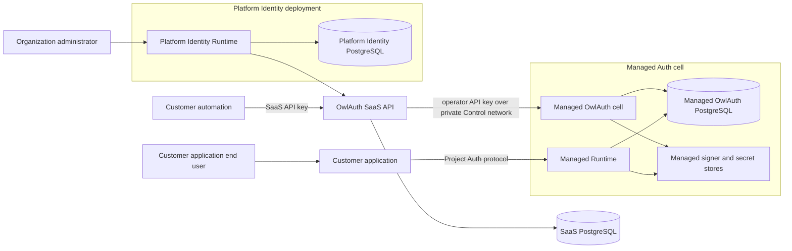
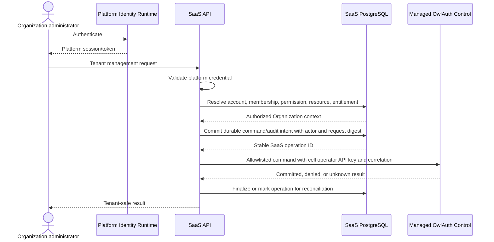

# 01 — SaaS system context and trust boundaries

## Product model

OwlAuth SaaS is a multi-tenant administration and fleet-control product built over ordinary OwlAuth deployments. It lets Organizations provision and manage isolated OwlAuth Projects without granting those Organizations direct administrative access to an `owlauth-server` Control plane.

OwlAuth SaaS owns:

- SaaS accounts and Organization membership;
- tenant roles, permissions, invitations, service accounts, and SaaS API keys;
- Organization-to-Project ownership and cell assignment;
- customer-facing management APIs, console, the `owlauth` CLI's `saas` profile, and the remote SaaS HTTP MCP server;
- subscriptions, entitlements, quotas, billing, and support workflows;
- managed-cell provisioning, reconciliation, and fleet operations.

A managed `owlauth-server` owns only Project Auth state and behavior. It does not become tenant-aware because the SaaS layer sets `Project.belongs_to`.

## Three-system composition

Production separates three systems with different authorities:

### OwlAuth SaaS control service

The SaaS control service is the tenant policy-enforcement point and commercial authority. It has an independent transactional database and exposes tenant-aware product operations, not a generic OwlAuth Control proxy.

### Platform Identity deployment

Platform Identity is a separate OwlAuth deployment used only to authenticate SaaS accounts. It normally contains one platform Project with console and related Applications. Its Project users establish stable platform subjects; the SaaS database establishes account status, Organization membership, role, and billing authority.

Platform Identity is not a managed customer cell. Its Control listener, PostgreSQL, operator key, signer, secret store, backup, and recovery path are isolated from customer Managed Auth.

### Managed Auth cells

A cell is one `owlauth-server` deployment plus its PostgreSQL, Redis, signer/KMS, provider secret store, Runtime ingress, private Control ingress, deployment configuration, and operational ownership. A cell may host Projects for many Organizations because the only OwlAuth operator is the SaaS control service.

The SaaS layer MAY allocate a dedicated cell to an Organization for contractual, compliance, regional, or blast-radius isolation. Shared and dedicated cells use the same OwlAuth server contract.

## Request paths

### Human administration

The durable intent is committed before any Managed Control side effect, so a crash cannot leave only the fixed OwlAuth `deployment_operator` audit actor. Reconciliation advances the existing SaaS operation to committed, denied, failed, or unknown/reconciled state; it never invents the original tenant actor afterward.

A Platform Identity credential proves authentication only. It does not contain authoritative Organization membership or grant direct Managed Auth access.

### Customer automation

Customer automation presents a SaaS API key to the SaaS API. The SaaS layer resolves the key to one external principal and Organization, applies the same authorization and target checks as a human request, then invokes an allowlisted managed Control operation. A SaaS API key is never forwarded to OwlAuth.

### End-user authentication

Customer applications and their end users use the Managed Runtime directly through the Project Auth protocol. Runtime requests do not traverse the SaaS control service merely for tenancy, RBAC, subscription lookup, or billing.

## Administrative trust domains

Each OwlAuth deployment remains one administrative trust domain:

- a valid operator API key grants full Control authority within that deployment;
- OwlAuth has no tenant principal or Organization-scoped Control authorization;
- `belongs_to` does not narrow the operator key;
- every tenant restriction is enforced before the SaaS layer invokes Control.

The SaaS layer reduces fleet-wide blast radius by using a different operator API key for every cell. Compromise of one cell key MUST NOT authorize Platform Identity or another cell.

## Platform isolation and bootstrap

Platform Identity and Managed Auth MUST be separate production deployments. This prevents a managed-cell operator key or customer Runtime incident from also controlling the authentication system used to enter the SaaS console.

Platform Identity MUST have a recovery path that does not require a functioning SaaS console or ordinary Platform Identity login. Recovery uses separately protected operator access, infrastructure authorization, and documented break-glass procedures. Break-glass access is not a tenant feature and is never exposed through customer APIs.

Development MAY compose these roles more closely for convenience, but development topology does not weaken the production boundary or make a shared deployment a supported security assumption.

## Runtime independence

The following failures MUST NOT make a healthy Managed Runtime depend synchronously on the failed component:

- SaaS API or console outage;
- Platform Identity outage;
- payment-provider outage;
- managed Control listener outage;
- SaaS background reconciliation outage.

Commercial policy that must affect Runtime is distributed as explicit, versioned local state or enforced at a defined Runtime ingress. It is never implemented as an unbounded synchronous call from an authentication transaction to the SaaS database or payment provider.

## Surface boundaries

The SaaS product exposes its own contracts:

- tenant-aware SaaS HTTP API;
- SaaS console;
- the shared `owlauth` CLI when its selected endpoint profile discovers and pins `owlauth-saas`;
- a remote SaaS Streamable HTTP MCP endpoint authenticated only by SaaS API key;
- webhooks and billing/customer integrations.

These surfaces MAY internally use OwlAuth Control, but MUST NOT expose:

- generic Control forwarding;
- arbitrary managed Project IDs without Organization resolution;
- a managed cell's Control origin or operator API key;
- OwlAuth internal database identifiers or repositories;
- provider secret bytes, signing private keys, Runtime credentials, or raw audit payloads.

The same `owlauth` executable uses endpoint profiles without a user-configured product type. A standard public descriptor declares and pins product, instance, authority, API base, and credential class before credential release; the discovered product selects the isolated operator or tenant client. Discovery failure or identity change fails rather than probing/falling back. The two products likewise expose separate self-describing HTTP MCP endpoints as specified by SaaS spec 07.

## Out of scope for `owlauth-server`

The following remain outside the root OwlAuth server architecture even when OwlAuth SaaS implements them:

- Organization and membership lifecycle;
- invitations and tenant roles;
- SaaS account linking or cross-Organization identity;
- customer service accounts and API keys;
- plans, subscriptions, invoices, payment-provider integration, and billing;
- tenant support roles and impersonation workflows;
- fleet placement, cell capacity, and dedicated deployments;
- tenant-visible usage and commercial quotas;
- server-enforced Organization-scoped Control credentials.

If a future server version directly enforces tenant-scoped Control grants, that is a new root architecture and cannot be introduced by reinterpreting `belongs_to` or an operator API key.
