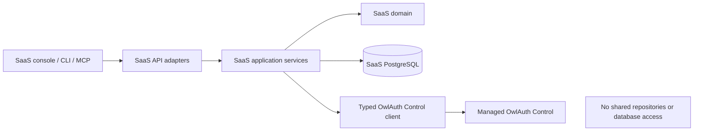
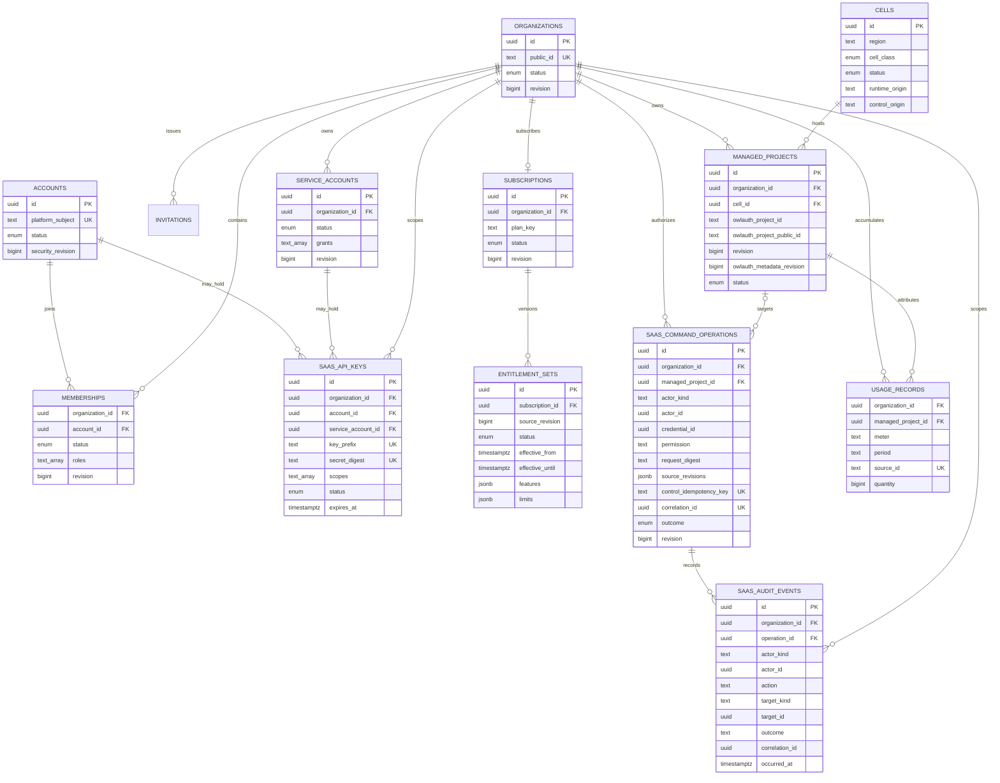

# 02 — SaaS domain and data ownership

## Dependency and ownership rule

The SaaS layer depends on published OwlAuth contracts. It MUST NOT depend on `crates/owlauth-server`, call server application services in process, reuse server repository types, connect to an OwlAuth PostgreSQL database, or mutate OwlAuth rows directly.

Likewise, `owlauth-server` does not depend on the SaaS implementation or its domain model. The relationship is a network integration across the public Control and Runtime contracts.

## Identity vocabulary

Three identities that may refer to the same human remain semantically separate:

| Identity | Meaning | Authority |
| --- | --- | --- |
| SaaS Account | a person allowed to authenticate to the SaaS product | Platform Identity subject plus SaaS account status |
| Organization Member | a SaaS Account associated with one Organization and role set | SaaS membership state |
| Project User | an end user authenticating to one managed customer Project | Managed OwlAuth Project state |

A Project User does not become a SaaS Account or Organization Member automatically. Provider email, display name, or provider subject MUST NOT be used to infer tenant administration rights. Any explicit invitation/account-linking workflow is owned and audited by the SaaS layer.

## Core aggregates

| Aggregate | Representative state | Owned invariants |
| --- | --- | --- |
| Account | stable platform subject, status, profile projection, security revision | one active Account per accepted Platform Identity subject; disabled Account cannot administer Organizations |
| Organization | stable public ID, name, status, commercial owner, revision | tenant management and billing boundary; no implicit relationship to Project Users |
| Membership | Organization, Account, status, roles, revision | unique active relationship; role changes are current-state authorization facts |
| Invitation | Organization, intended recipient/reference, proposed role, expiry, one-use state | cannot grant more authority than inviter; acceptance binds an authenticated Account |
| Service account | Organization, name, status, permission grants, revision | non-human principal belongs to exactly one Organization |
| SaaS API key | principal, Organization, digest, prefix, scopes, status, expiry | one-time secret disclosure; never grants more authority than its principal grants |
| Cell | deployment ID, region, class, Runtime/Control origins, status, capacity metadata | one independent OwlAuth administrative and operational trust domain |
| Managed Project | Organization, cell, OwlAuth Project IDs, SaaS revision, OwlAuth `metadata_revision`, lifecycle state | one Organization owner; stable cell/issuer assignment; SaaS lifecycle and OwlAuth metadata revisions remain distinct |
| SaaS command operation | actor/credential, Organization, permission, target, request digest, source revisions, external correlation, outcome | durable tenant attribution exists before a Managed Control effect; retries/reconciliation advance one operation |
| Subscription | Organization, plan, status, billing linkage, period/revision | current commercial agreement and transition policy |
| Entitlement set | Organization/Project feature and limit values, source revision, effective interval | immutable versioned commercial policy; no inference from tenant role |
| Usage ledger/aggregate | Organization, Project, meter, period, idempotent source | durable measurement only when a meter contract exists |
| SaaS audit event | external actor, Organization, operation, action, target, outcome, correlation | immutable tenant actor attribution without recoverable secrets |

Names describe domain concepts, not mandatory SQL table names.

## Logical data model

Nullable actor links on `SAAS_API_KEYS` are constrained so exactly one Account or Service Account owns a key. `saas_command_operations.managed_project_id` is nullable for Organization-level effects, while its actor/credential fields follow closed actor-kind constraints. Entitlement versions are unique by `(subscription_id, source_revision)` and have non-overlapping effective intervals; `effective_until` is nullable only for the open current interval. Actual storage MAY normalize roles, grants, features, and limits rather than storing arrays/JSON; authorization behavior is the invariant.

## Organization and Project cardinality

An Organization may own zero or more managed Projects. Typical reasons for multiple Projects include separate products, environments, user directories, provider configurations, or token trust boundaries.

A managed Project has exactly one Organization owner in the SaaS registry. The corresponding OwlAuth Project stores that Organization's stable opaque public ID in `belongs_to`. Multiple Projects therefore may share one `belongs_to` value.

`belongs_to` is a checked replica, not the primary ownership record:

- the SaaS registry selects the Organization, cell, and Project;
- the gateway verifies that OwlAuth returns the expected exact `belongs_to` and metadata revision;
- a mismatch blocks mutation and enters reconciliation;
- direct caller input never becomes ownership merely because it equals a stored `belongs_to` value.

Organization transfer of an existing managed Project is not a normal metadata edit. The SaaS API MUST reject it until a dedicated transfer design defines authorization by both parties, subscription effects, audit, secrets, active sessions, issuer stability, rollback, and reconciliation. Updating `belongs_to` alone is not a transfer.

## Stable placement and identifiers

The SaaS layer assigns every managed Project to one cell before provisioning. It records both the OwlAuth internal Control identifier needed by the typed client and the stable public Project identifier used by Runtime clients.

The pair `(cell_id, owlauth_project_id)` is unique. Public IDs SHOULD be globally unique across the SaaS fleet even if an individual OwlAuth deployment guarantees uniqueness only inside itself. They MUST be fleet-global before a shared Runtime edge routes requests by `{project_id}` alone; otherwise the public Runtime URL includes an authoritative cell/region namespace or remains cell-specific.

Cell assignment is stable because Runtime origin, issuer derivation, callbacks, secret namespaces, keys, and recovery authority are deployment-sensitive. Reassigning a Project to another cell is a migration product with an explicit compatibility and recovery design, not an ordinary scheduler update.

## Lifecycle state and reconciliation

Resources that span the SaaS database and OwlAuth cannot be committed atomically. Managed Project lifecycle therefore uses explicit states such as:

- `provisioning`;
- `active`;
- `updating`;
- `suspending`;
- `disabled`;
- `reconciliation_required`;
- `provisioning_failed`.

The Managed Project's SaaS `revision` protects registry status, placement, and lifecycle independently from OwlAuth `metadata_revision`. Lifecycle transitions, worker claims, and before-effect revalidation use compare-and-swap on the SaaS revision; an old worker cannot continue merely because OwlAuth metadata is unchanged.

Before any Managed Control side effect, the SaaS transaction commits a `SaaS command operation` with the authenticated actor/credential, Organization, permission, target, normalized request digest, current Organization/Managed Project/entitlement revisions, Control idempotency key, and correlation. The same transaction claims the relevant SaaS resource revision. External outcomes advance that operation to committed, denied, failed, or unknown/reconciliation-required, preserving attribution across crashes.

A success response is returned only after the required OwlAuth effect is confirmed and the SaaS state transition is committed. Unknown outcomes are reconciled using retained idempotent Control results or authoritative reads; they are not guessed. If a Control idempotency tombstone/result is unavailable after unsupported delay or authority restore, the create remains `reconciliation_required` and is never replayed automatically. A replacement resource requires an explicit operator-resolved workflow, not timeout-based retry.

## Secret ownership

| Secret | Owner | Storage rule |
| --- | --- | --- |
| Platform Identity operator API key | platform infrastructure operator | isolated secret injection; never stored in SaaS tenant tables |
| Managed cell operator API key | SaaS fleet operator | secret manager/runtime injection; referenced by cell, never returned to tenant surfaces |
| SaaS API key | SaaS principal | only digest and non-secret prefix stored after one-time display |
| Customer provider secret | managed secret-store workflow | secret bytes never persist in ordinary SaaS or OwlAuth PostgreSQL; OwlAuth receives an opaque secret reference |
| Project signing private key | managed signer/KMS | never available to SaaS tenant APIs or ordinary SaaS persistence |
| Payment-provider secret | SaaS billing adapter | isolated from OwlAuth deployments and tenant-visible configuration |

## Data deletion and retention

Disabling an Organization prevents new administrative effects according to subscription/support policy but does not silently hard-delete managed OwlAuth Projects or end-user identity state. Deletion, export, retention, and legal-hold behavior require explicit asynchronous workflows with per-system completion and audit.

SaaS account/profile projections contain only data needed for the product. Managed Project user profiles remain in the assigned OwlAuth authority and are accessed only through tenant-authorized product operations. The SaaS layer MUST NOT build an unbounded cross-Project identity index as a side effect of fleet administration.
