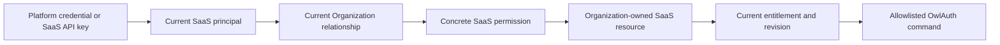

# 03 — SaaS authentication, authorization, and API keys

## Separation of credentials

The SaaS architecture uses distinct credentials for distinct trust domains:

| Credential | Presented to | Establishes | MUST NOT establish |
| --- | --- | --- | --- |
| Platform Identity credential | SaaS API | authenticated SaaS Account subject | Organization membership, tenant role, billing authority, or managed Project access by itself |
| SaaS API key | SaaS API | authenticated Account or Service Account plus key scope ceiling | direct OwlAuth Control or Runtime authority |
| Managed cell operator API key | managed OwlAuth Control | full deployment operator authority | SaaS caller identity, Organization membership, or per-Project tenant restriction |
| Publishable Application key | managed OwlAuth Runtime | public Application identification and abuse/quota attribution | administration or user authentication |
| Project access/refresh credential | managed OwlAuth Runtime or customer backend as defined by Project Auth | managed Project user/session context | SaaS administration or Organization membership |

No credential is accepted across these boundaries merely because it uses an HTTP `Authorization` header.

## Human authentication

Platform Identity authenticates people who use the SaaS console or API. The SaaS API validates a platform credential against the exact configured Platform Identity Project issuer, audience, token type, signature, lifetime, Application/session context, and current account policy required by the selected session design.

After cryptographic validation, the SaaS layer resolves the platform subject to a current Account row. Account disablement, membership changes, role changes, and Organization status are checked from SaaS authority; stale token claims cannot preserve removed tenant authority.

A browser-facing SaaS session uses secure, HTTP-only, same-site cookies and CSRF protection where cookie authentication is used. A bearer-token client uses an explicit SaaS audience. Platform Runtime credentials are never forwarded to a managed cell.

## Organization roles and permissions

SaaS permissions are product capabilities, not OwlAuth Control scopes and not Project access-token claims. Each customer-facing operation maps to one stable SaaS permission, for example:

| Permission family | Representative permissions |
| --- | --- |
| Organization | `organization:read`, `organization:update`, `members:read`, `members:invite`, `members:update` |
| Managed Projects | `auth-projects:create`, `auth-projects:read`, `auth-projects:update`, `auth-projects:disable` |
| Applications | `auth-applications:read`, `auth-applications:write` |
| Providers | `auth-providers:read`, `auth-providers:write`, `auth-provider-secrets:write` |
| Project users/sessions | `auth-users:read`, `auth-users:disable`, `auth-sessions:read`, `auth-sessions:revoke` |
| Project policy/keys | `auth-policy:read`, `auth-policy:write`, `auth-keys:read`, `auth-keys:rotate` |
| Tenant audit | `audit:read` |
| Automation | `service-accounts:read`, `service-accounts:write`, `api-keys:read`, `api-keys:write` |
| Billing | `billing:read`, `billing:write` |

The concrete vocabulary is versioned with the SaaS API. It remains independent of the internal sequence of OwlAuth Control calls.

Initial products SHOULD use a small fixed role set such as owner, admin, developer, viewer, and billing. Roles are named bundles of concrete permissions. Custom roles or general ABAC are added only when product requirements justify their policy, migration, and support cost.

At least one recoverable owner path MUST exist for an active Organization. Last-owner removal, self-demotion, invitation acceptance, and Organization disablement use explicit concurrency and recovery rules.

## Service accounts

A Service Account is a non-human SaaS principal owned by exactly one Organization. It has explicit permission grants or a fixed service role and no Platform Identity login.

Disabling the Organization or Service Account invalidates all of its API keys. Deleting a human Account does not silently transfer Service Account ownership or credentials. Service Account lifecycle and key lifecycle produce separate audit events.

## SaaS API key lifecycle

A SaaS API key is a customer credential for the SaaS API only.

### Canonical transport and format

A client sends a SaaS API key only as:

```http
Authorization: Bearer owl_saas_v1_<key-id>_<secret>
```

`<key-id>` is a 26-character canonical lowercase Crockford Base32 public lookup identifier. `<secret>` is the 43-character unpadded base64url encoding of exactly 32 cryptographically random bytes. Whitespace, control characters, padding, alternate encodings, trimming, Unicode normalization, duplicate Authorization headers, and simultaneous Platform/SaaS credentials are rejected. The `owl_saas_v1_` prefix distinguishes customer SaaS credentials from `owl_ctrl_v1_` deployment operator keys and Project tokens. The full key is accepted only by the SaaS API and is never forwarded.

### Creation

Creation requires current `api-keys:write` authority in the target Organization. An Account-owned key can be created only by that authenticated Account; administrators use an Organization-owned Service Account for delegated automation rather than minting a credential that impersonates another human. A Service Account key requires authority to manage that Service Account. The request selects an expiry and an explicit scope subset. The granted scope MUST be a subset of the creator's delegable permissions and the target principal's current maximum permissions.

The service generates a cryptographically random secret and returns it exactly once through the explicitly human-facing SaaS API/Console flow. The initial CLI and MCP catalogs do not expose creation because their ordinary output/result channels cannot carry the raw secret safely. The service stores only:

- key ID and non-secret lookup prefix;
- a versioned keyed digest of the secret;
- owning Organization and principal;
- explicit scope ceiling;
- status, creation time, expiry, and safe usage metadata;
- creator and audit references that cannot recover the secret.

Keys MUST be high entropy and MUST NOT be derived from passwords, Organization names, Project IDs, or operator keys. API key values never appear in URLs, logs, traces, metrics, errors, webhook payloads, support tools, or agent context.

### Authentication

Authentication strictly parses the canonical Bearer form, resolves `<key-id>`, computes the versioned keyed digest over the complete canonical key, and compares it in constant time. No query parameter, cookie, form/body field, URL user info, forwarding header, or alternate legacy header is accepted. Invalid-key attempts use dedicated rate limits without revealing whether the key ID, Organization, principal, scope, status, or expiry caused denial.

### SaaS HTTP MCP admission

The remote SaaS MCP endpoint is API-key-only even though ordinary SaaS browser/API surfaces may authenticate a human through Platform Identity. Every MCP HTTP request, including initialization, tool discovery, execution, streaming continuation, and teardown, must contain exactly the canonical SaaS API-key Bearer credential.

The MCP endpoint rejects Platform Identity bearer tokens, browser/session cookies, managed-cell operator keys, Runtime credentials, mixed credentials, query/body credentials, and forwarding headers. It then executes the same current principal, Organization, scope, permission, ownership, entitlement, revision, audit, and enumeration checks as the corresponding SaaS API operation. Any negotiated transport session is non-authoritative and bound to the exact product/instance/audience, API-key ID, principal kind/ID, and key-owning Organization; every session request reauthenticates and matches that binding before session state is read or emitted. Tool discovery MAY omit unavailable tools for usability but is never an authorization grant; each invocation reauthenticates and reauthorizes current state. SaaS spec 07 owns the complete session and transport behavior.

### Effective permission

For an Account-owned key:

```text
key effective permission
  = current Account permission in the Organization
  intersect key scope ceiling
```

For a Service Account-owned key:

```text
key effective permission
  = current Service Account grants
  intersect key scope ceiling
```

Consequently, removing membership, disabling a principal, or reducing current grants immediately removes authority even if the key row remains active. Expanding the principal's role does not automatically expand the key beyond its original scope ceiling.

### Rotation and revocation

Rotation creates a new independent key, returns its secret once through the same explicitly human-facing delivery boundary, and explicitly revokes the old key after a bounded customer-controlled transition. The initial CLI and MCP catalogs do not expose rotation. A key is never overwritten with a replacement secret. Revocation is authoritative SaaS state and takes effect before another tenant command can be admitted.

API key list responses contain prefixes and metadata only. No API can recover or redisplay secret material.

## Request authorization algorithm

Every tenant management request follows this order:

1. Parse and bound the request before expensive work.
2. Authenticate exactly one external principal using a Platform Identity credential or SaaS API key.
3. Resolve current Account/Service Account status.
4. Resolve the Organization from an authoritative route/resource relationship, not an untrusted request assertion alone.
5. Resolve current membership, role/grants, key scope ceiling where applicable, and Organization status.
6. Authorize the concrete SaaS permission for the operation.
7. Resolve the target Managed Project or child resource through the SaaS registry and verify it belongs to the same Organization.
8. Evaluate current entitlement and command-specific lifecycle/revision rules.
9. Build one allowlisted typed OwlAuth Control command; the caller cannot supply the cell, Control origin, operator key, or arbitrary target Project.
10. Before any external side effect, commit a durable SaaS command/audit intent containing the actor, credential/key ID, Organization, permission, target, request digest, source revisions, and stable operation/correlation identity.
11. Execute the Control command, then finalize the existing intent as committed, denied, failed, or unknown/reconciliation-required. Never wait until after the external effect to persist tenant actor attribution.



A failed check cannot be repaired by caller-supplied `belongs_to`, Project ID, role, scope, forwarded identity header, or knowledge of a Control route.

## Operator API key boundary

Each managed cell's `OWLAUTH_CONTROL_API_KEY` is held only by the SaaS fleet/control integration and protected infrastructure. It grants all Control actions in that cell. The SaaS authorization result decides whether to use it; the key itself carries no tenant context or scope.

The SaaS layer MUST NOT:

- return, display, mint, delegate, or proxy the operator API key to a tenant;
- store it in Organization/API-key rows;
- use one managed-cell key for Platform Identity or another cell;
- accept it as a customer SaaS API key;
- treat successful OwlAuth authentication as proof that SaaS authorization was correct;
- provide a generic endpoint that signs or forwards arbitrary Control requests.

Key rotation is a fleet operation and is not a customer API-key lifecycle action.

## Support and internal administration

SaaS support access is a separate SaaS principal class with explicit roles, case/reason binding, time bounds, approval where required, and tenant-visible or security audit according to policy. Support staff do not receive managed-cell operator keys.

Impersonation, if implemented, does not erase the support actor. Audit records preserve the real actor, effective tenant context, approver, reason, target, start/end, and commands. Platform break-glass and infrastructure recovery remain outside ordinary support workflows.

## Audit attribution

The SaaS audit is authoritative for the external actor and tenant policy decision. Every operation capable of a Managed Control side effect first commits a pending command/audit intent in the same SaaS transaction that authorizes and claims the operation. Completion and reconciliation advance that immutable actor-bound record rather than creating attribution after the fact. It records:

- Account or Service Account identity and credential class/key ID;
- Organization and concrete permission;
- SaaS operation and target resource;
- authorization outcome and safe reason class;
- request/idempotency correlation;
- selected cell and managed Project references where authorized;
- resulting OwlAuth correlation and revision where available.

The managed OwlAuth audit records its fixed deployment operator because all accepted Control calls use the same operator key. Correlation links the two audit streams; arbitrary forwarded actor headers do not change OwlAuth authorization or become trusted attribution.

## Error and enumeration policy

Unauthenticated, unauthorized, cross-Organization, missing, disabled, and entitlement-denied cases use stable SaaS error classes without exposing another tenant's existence, cell placement, `belongs_to`, account membership, key prefix status, or operator configuration. Detailed internal reasons are redacted and correlated to authorized audit/support views.
