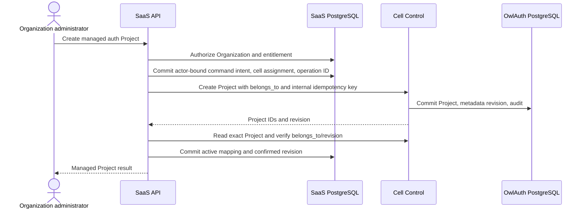
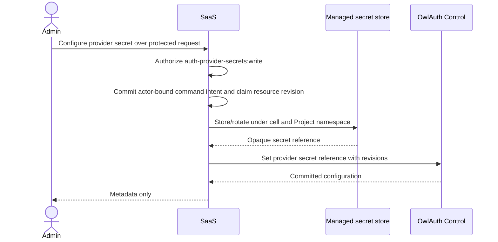

# 04 — Managed cells and Control workflows

## Cell model

A managed cell is the unit of OwlAuth administrative trust, credential isolation, capacity, recovery, and operational blast radius. It contains:

- one OwlAuth deployment in combined or split Runtime/Control composition;
- one authoritative OwlAuth PostgreSQL database;
- a cell-specific Redis namespace/deployment;
- cell-specific signer/KMS and provider secret-store access;
- public or customer-facing Runtime ingress;
- private Control ingress;
- one cell-specific `OWLAUTH_CONTROL_API_KEY`;
- backup, restore, observability, and incident ownership.

A cell MAY serve many Organizations. That sharing is safe only under the assumption that OwlAuth SaaS is the sole cell operator and every tenant operation passes through SaaS authorization. `owlauth-server` itself does not enforce an Organization boundary.

## Cell registry

The SaaS registry stores non-secret operational metadata such as:

- stable cell ID, region, class, status, and capacity state;
- trusted Runtime and private Control origins;
- supported OwlAuth server/API version and feature capabilities;
- secret-manager reference for the cell operator key, never the key value in tenant data;
- deployment/issuer namespace needed for placement decisions;
- maintenance and admission state;
- safe health and last-reconciliation timestamps.

A tenant caller never selects a Control origin or operator-key reference. Placement services select an eligible cell from trusted registry state and persist the assignment before provisioning.

## Project provisioning workflow

Provisioning crosses two PostgreSQL authorities and therefore uses an explicit durable saga rather than a distributed transaction.



The workflow MUST:

1. derive the Organization ID from authorized SaaS state;
2. reserve a stable SaaS Managed Project ID and cell assignment with an initial SaaS revision;
3. commit the authenticated actor, credential/key ID, permission, request digest, source revisions, and deterministic operation/idempotency identity before calling Control;
4. set OwlAuth `belongs_to` to the Organization's stable opaque public ID;
5. persist returned OwlAuth internal/public Project IDs only after validating the response;
6. read back or otherwise authoritatively confirm exact `belongs_to` and metadata revision;
7. return success only after the SaaS registry commits the confirmed mapping;
8. classify failures as retryable, terminal, or unknown and enter reconciliation where necessary.

If OwlAuth creation committed but final SaaS state confirmation failed, retry or reconciliation uses the retained idempotent result and the already committed SaaS operation intent. A create key remains protected by the root resource-lifetime replay/tombstone contract. If an unsupported restore or delay makes the outcome unprovable, the operation remains `reconciliation_required`; the SaaS layer MUST NOT replay the create or silently create a replacement Project.

A customer-supplied SaaS idempotency key is scoped by the authenticated principal, Organization, and SaaS operation in SaaS authority. It is never forwarded verbatim into OwlAuth's deployment-wide idempotency namespace. The gateway derives or allocates a globally unique internal Control idempotency key from the durable SaaS operation ID so one tenant cannot collide with or replay another tenant's Control operation.

## Target resolution and confused-deputy prevention

A customer-facing route identifies a SaaS resource under an Organization, for example:

```text
/organizations/{organization}/auth-projects/{managed_project}/applications
```

Before every OwlAuth Control call, the gateway resolves:

```text
(authorized organization, managed project)
  -> trusted cell
  -> exact OwlAuth project identifier
  -> expected belongs_to
  -> last confirmed metadata revision
```

The gateway then obtains current OwlAuth Project metadata when required and verifies exact ownership. Child IDs are accepted only under the resolved Managed Project and are sent through Project-qualified Control routes. A caller-supplied OwlAuth Project ID, cell ID, `belongs_to`, Control origin, or internal child ID cannot override the registry context.

Every forwarded Project-bound mutation includes the observed OwlAuth Project `metadata_revision` as required by the root Control contract. OwlAuth compares it in the same transaction as the child effect. A concurrent `belongs_to` change therefore yields a conflict rather than applying an action under stale SaaS authorization.

A mismatch between the SaaS registry and OwlAuth metadata:

- fails the tenant request closed;
- does not attempt a best-effort mutation;
- marks the mapping for reconciliation;
- emits correlated SaaS security/operations audit;
- requires authoritative repair policy rather than trusting whichever value arrived in the request.

## Allowlisted command mapping

The SaaS gateway exposes product operations and maps each one to a closed sequence of typed Control calls. Each mapping defines:

- required SaaS permission and entitlement;
- accepted SaaS resource states and revisions;
- the pre-effect transaction that commits actor-bound command/audit intent and claims the current SaaS resource revision;
- target resolution procedure;
- exact OwlAuth operation and bounded fields;
- idempotency and retry policy;
- expected OwlAuth Project/resource revisions;
- provider/KMS external effects;
- safe response projection and error mapping;
- SaaS and OwlAuth audit correlation;
- reconciliation for ambiguous outcomes.

The gateway MUST NOT expose raw path/method/body forwarding, arbitrary OpenAPI invocation, generic JSON patching, arbitrary bulk mutation, direct database access, or Control response fields not deliberately included in the SaaS contract. It never begins a side-effecting Control call until the corresponding SaaS command operation and tenant actor attribution are committed.

A valid operator API key authorizes the entire cell at OwlAuth. Command allowlisting and tenant authorization are therefore mandatory SaaS security boundaries, not convenience validation.

## Control authentication and transport

The SaaS integration sends the cell's operator API key in the canonical Control `Authorization: Bearer` header. It uses the exact trusted Control origin from the cell registry, TLS verification, bounded requests/responses, deadlines, and no untrusted redirects. Control SHOULD be reachable only from fleet/control workloads over a private network; mTLS or workload identity MAY supplement network authentication but does not replace the OwlAuth operator API key.

The integration never retries an unsafe command blindly after an ambiguous response. It reuses the same Control idempotency key where the root contract supports idempotency, otherwise reads authoritative state and follows command-specific reconciliation.

## Project updates

A managed Project update has two distinct classes:

### SaaS-only metadata

Display name, tags, internal support metadata, billing labels, or customer presentation that have no OwlAuth behavior remain in the SaaS database and do not produce OwlAuth Control calls.

### OwlAuth security or behavior state

Application, provider, redirect/origin, user, session, policy, `belongs_to`, and key operations use typed Control commands and OwlAuth revision semantics. The SaaS layer does not mirror detailed OwlAuth state as a competing authority; projections are explicitly cache/reconciliation state and carry source revisions.

Organization ownership is not an ordinary Project update. `belongs_to` changes outside a dedicated transfer/recovery workflow are denied by SaaS policy even though the deployment operator can technically issue them.

## Provider secret workflow

Customer provider secret bytes require a dedicated write-only path:



Secret bytes are redacted before logging/telemetry and are not stored in ordinary SaaS PostgreSQL, Control DTO responses, tenant audit context, support exports, or operation error text. Failed workflows reconcile or destroy confirmed orphan secret versions according to the secret-provider contract.

## Runtime routing and configuration

The SaaS layer returns only public Project/Application Runtime configuration needed by customer SDKs. Managed Runtime traffic can route directly to the assigned cell or through a deliberately designed stable Runtime edge. In either case:

- Project routing is derived from trusted public identifiers;
- Runtime ingress cannot reach Control;
- Runtime does not call SaaS authorization for each login, callback, handoff, refresh, or current-user operation;
- the Project issuer and externally registered callback identities remain stable;
- a cell move is not assumed to preserve issuer or credentials automatically.

A global Runtime edge MAY hide cell placement, but it must have an authoritative, safely cached Project-to-cell routing design and cannot weaken root Project isolation or one-use state consistency. If it routes by `{project_id}` alone, managed Project public IDs MUST be unique across the fleet before that route is enabled; otherwise the URL/routing key includes an authoritative cell or region namespace.

## Drift and reconciliation

Direct operator CLI use, recovery, failed sagas, or defects may create drift. Reconciliation is a first-class background process that:

- compares active SaaS mappings with exact OwlAuth Project metadata and revision;
- detects missing, duplicate, disabled, wrong-cell, or wrong-`belongs_to` state;
- never repairs ownership automatically from ambiguous evidence;
- uses bounded per-cell concurrency and pagination;
- distinguishes expected propagation from durable mismatch;
- records safe drift status and correlated audit;
- prevents tenant mutations while ownership is uncertain.

Self-hosted/direct operator changes remain valid in standalone OwlAuth. For a SaaS-managed cell they are exceptional fleet operations and must use change control that updates or reconciles the SaaS registry.

## Cell lifecycle

### Admission and maintenance

A cell in maintenance/draining state accepts no new Project placements. Existing Runtime remains available according to the maintenance plan. Control workflows either continue for allowed operations or fail with a retryable SaaS dependency result.

### Dedicated cells

Dedicated cells differ in placement and operational policy, not in tenant credential semantics. The Organization still calls the SaaS API; it does not receive the cell operator key unless the product explicitly transfers the deployment out of SaaS management under a separate export/handoff contract.

### Removal

A cell cannot be removed while authoritative Managed Project mappings remain. Drain/migration requires a separate Project migration design or confirmed deletion/export. Deleting a registry row is never a data migration.

## Customer CLI and MCP

A SaaS CLI or MCP surface authenticates to the SaaS layer with Platform Identity or SaaS API credentials and invokes the same tenant authorization/application services as the SaaS HTTP API. It MUST NOT wrap the trusted `owlauth` operator CLI, expose cell Control URLs, or relay operator keys into local configuration or agent context.

High-impact SaaS MCP tools use bounded schemas, previews, exact command/Organization/target binding, short-lived one-use confirmation, revision checks, and SaaS audit. Human approval is additional intent evidence; it does not replace SaaS authentication, permission, ownership, or entitlement checks.
