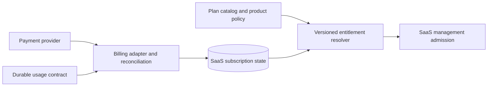

# 05 — Billing, entitlements, and metering

## Commercial authority

Billing is a SaaS concern. `owlauth-server` does not know plans, subscriptions, invoices, payment customers, Organization balances, seats, commercial feature names, or tenant quota policy.

The SaaS database stores the product's current subscription and entitlement interpretation. A payment provider is authoritative only for the provider objects and settlement outcomes defined by the billing integration; provider webhooks are untrusted, replayable inputs until signature, account, event identity, ordering, and expected state are validated and reconciled.

## Plans, subscriptions, and entitlements

A plan is a versioned product definition. A subscription binds one Organization to a plan and commercial lifecycle. An entitlement set is the explicit resolved result used by application logic.

Entitlements distinguish:

- Boolean features, such as dedicated cell eligibility or advanced provider support;
- configuration limits, such as maximum managed Projects or Applications;
- administrative limits, such as member/service-account counts;
- usage allowances, such as measured active users or successful authentications;
- operational class, such as region, retention, support, and isolation tier.

Product code checks named entitlements rather than branching directly on payment-provider price IDs. Price/catalog migration therefore does not silently change authorization semantics.

Each entitlement set is an immutable version carrying its own ID, source subscription revision, status, and `[effective_from, effective_until)` interval. Intervals for one subscription do not overlap; the current projection is selected by committed time and status without overwriting history. Delayed commands retain the entitlement version admitted with their durable SaaS operation, but any command that increases commercial commitment revalidates the current entitlement immediately before its external effect. If the version was superseded or the allowance changed, the command conflicts or is re-authorized rather than applying stale commercial authority.

A command that reserves limited capacity serializes the current entitlement check with the corresponding SaaS resource transition and command-operation intent so concurrent requests cannot all consume the same remaining allowance.

## Initial billing model

The first SaaS release SHOULD prefer meters available from SaaS-authoritative management state:

- fixed Organization subscription;
- number of active managed Projects;
- number of configured Applications or other provisioned resources;
- administrator seats;
- explicitly enabled product features or dedicated-cell class.

These models do not require instrumentation in the OwlAuth Runtime hot path and can be reconciled from SaaS state plus typed Control reads where necessary.

Runtime-volume billing such as MAU, successful login, token issuance, refresh, or provider request count is deferred until an explicit durable measurement contract exists. Ordinary metrics, logs, and security audit events are not silently promoted to invoice authority.

## Meter contract

Every billable meter MUST define:

- stable meter name and version;
- exact qualifying event or state transition;
- attribution to cell, managed Project, Organization, and billing period;
- uniqueness/idempotency identity;
- event time versus receipt time semantics;
- correction, late-arrival, replay, and backfill behavior;
- aggregation precision and whether the value is exact or approximate;
- retention and customer-visible explanation;
- privacy classification and prohibited fields;
- reconciliation against source authority;
- behavior during source, transport, or billing outage.

A billable event never contains provider tokens, Runtime credentials, API keys, raw user profiles, or recoverable secret material. A stable Project user reference MAY be used for a defined MAU meter only under explicit privacy/retention policy and Project/Organization qualification.

## Durable usage collection

If future billing requires Runtime facts, the root OwlAuth architecture must expose a deliberately designed integration such as durable Project usage aggregates or a transactionally produced outbox. The design MUST NOT make successful authentication wait for the SaaS billing service or payment provider.

Required properties include:

1. a Runtime/Control security transaction has its original root-spec success semantics;
2. the usage fact is durable enough for the advertised billing precision;
3. export is asynchronous, bounded, retryable, and idempotent;
4. consumers can resume from checkpoints and detect gaps;
5. duplicate delivery cannot double bill;
6. cell restore, replay, and Project disablement have defined meter effects;
7. usage backlog cannot grow without bound or exhaust capacity needed for authentication;
8. billing identifiers do not enter Runtime tokens or public configuration.

Until such a root contract is specified and implemented, the SaaS layer MUST describe Runtime usage as non-billable observability, an estimate, or an unsupported meter rather than claiming billing-grade accuracy.

## Entitlement enforcement locations

### SaaS management admission

The SaaS API enforces limits on actions it owns, such as creating a Project, inviting a member, enabling a feature, or requesting a dedicated cell. This is the preferred enforcement point because Organization state and entitlement are authoritative there.

### Managed Control configuration

Where an entitlement maps to OwlAuth Project configuration, the SaaS layer validates it and sends an allowlisted Control command. OwlAuth validates its own Project/security invariants but does not understand the commercial reason.

### Runtime enforcement

A hard Runtime quota cannot be enforced only in the SaaS management gateway because customer Runtime requests bypass it. Runtime enforcement requires one of:

- a versioned entitlement/limit snapshot delivered to an explicitly designed local enforcement point;
- a stable Runtime edge that owns the meter and admission rule;
- a new root OwlAuth Project policy with defined consistency and failure semantics.

No design may perform an unbounded synchronous subscription/payment RPC on each login, callback, handoff, refresh, token issue, or current-user request.

## Soft limits, hard limits, and grace

Each limit declares whether it is:

- **advisory:** shown to customers without denying effects;
- **soft:** permits bounded overage and produces usage/billing state;
- **management hard limit:** denies a new SaaS management command;
- **Runtime hard limit:** denies a defined Runtime operation at a local enforcement point.

The plan defines grace periods and transition behavior explicitly. A past-due subscription does not automatically disable customer authentication. Suspension actions are deliberate, audited lifecycle commands with notice, grace, recovery, and support policy.

## Failure semantics

| Failure | Required behavior |
| --- | --- |
| Payment provider unavailable | preserve last confirmed subscription state within bounded policy; queue/reconcile provider operations; do not block Managed Runtime |
| Webhook duplicate/out of order | verify signature and event identity; apply idempotently with provider-specific ordering/reconciliation |
| SaaS billing worker unavailable | management may use current committed entitlements; usage backlog remains bounded/recoverable; Runtime remains independent |
| Usage export delayed | do not invent zero or duplicate usage; mark period provisional and reconcile |
| Entitlement state unknown | fail closed for new paid provisioning that would increase commitment; do not silently revoke established Runtime identity state |
| Subscription cancelled/past due | follow explicit effective time, grace, notification, and suspension policy |
| Invoice correction | append correction/reconciliation state; do not mutate source usage invisibly |

## Subscription lifecycle and Project state

Commercial lifecycle and OwlAuth Project lifecycle are separate state machines. Cancellation may stop renewal or new provisioning without immediately disabling a Project. If product policy eventually disables managed Projects:

- the SaaS layer schedules an explicit, idempotent, audited Control command;
- the command uses current ownership and revision checks;
- partial cell failures enter reconciliation;
- reactivation policy is explicit;
- customer export/retention and legal requirements are respected;
- a payment webhook never calls OwlAuth Control directly without SaaS transaction and policy evaluation.

## Customer-visible usage

Usage and invoices shown to a tenant are always filtered by authorized Organization and stable meter definition. Customer views distinguish final, provisional, estimated, corrected, and unavailable periods. Internal cell IDs, operator credentials, cross-tenant aggregates, raw event payloads, and Project-user identifiers are not exposed unless the product contract explicitly requires a privacy-safe representation.

## Observability is not billing

Metrics may guide capacity and product decisions. Security audit may explain actions. Logs may diagnose failures. None are invoice authority by default because they can be sampled, delayed, redacted, duplicated, dropped, or retained differently.

A meter MAY reuse an underlying event only after the meter contract makes its durability, completeness, idempotency, attribution, and reconciliation normative.
