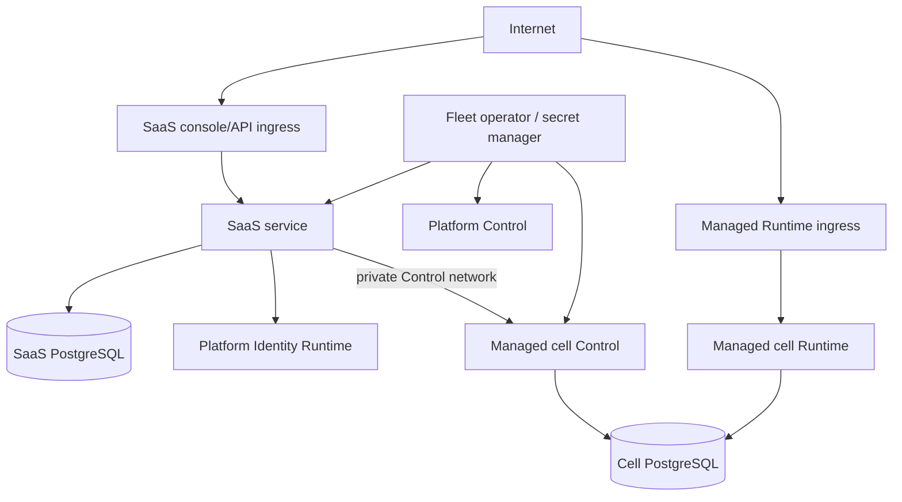

# 06 — SaaS operations, security, and resilience

## Production deployment boundary

A production OwlAuth SaaS environment separates at least:

1. the SaaS control service and SaaS PostgreSQL;
2. the Platform Identity OwlAuth deployment and its PostgreSQL/cryptographic dependencies;
3. one or more Managed Auth cells, each with independent PostgreSQL and operator API key;
4. billing/payment integrations;
5. fleet secret management and infrastructure control.

Sharing a Kubernetes cluster, cloud account, or physical database service does not merge these logical authorities. Credentials, database roles, schemas/databases, KMS namespaces, network policy, backups, and restore procedures preserve the separation.

The diagram shows trust relationships, not a requirement that every arrow be a direct unrestricted network path.

## Network posture

- Platform Identity Runtime is reachable only through the public routes needed for SaaS authentication.
- Platform Identity Control is private and accessible only to platform operators/fleet automation.
- Managed Runtime is public through approved ingress and exposes Runtime routes only.
- Managed Control is private and accepts traffic only from trusted SaaS/fleet workloads.
- Runtime ingress cannot route Control paths or ports.
- SaaS tenant traffic cannot select arbitrary backend origins, trusted proxy headers, or cell addresses.
- Egress from the SaaS service, cells, and provider/billing adapters is allowlisted and bounded according to function.
- TLS verification is mandatory; mTLS/workload identity SHOULD supplement private Control networking where available.

Network position never replaces the OwlAuth Control operator API key or SaaS caller authorization.

## Operator API key operations

Every Platform Identity or Managed Auth deployment has a unique `OWLAUTH_CONTROL_API_KEY`. The same secret is delivered only to that OwlAuth Control process and its authorized operator client/fleet integration.

The key:

- uses the canonical `owl_ctrl_v1_` format and 256-bit random payload defined by the root spec;
- enters processes through protected environment/secret injection;
- never appears in command arguments, images, source, ordinary config serialization, logs, traces, metrics, health, panic text, support bundles, or customer-visible state;
- is not persisted in OwlAuth PostgreSQL or Redis;
- is not copied into SaaS Organization, API-key, audit, or billing rows;
- is redacted as an authorization credential before telemetry serialization;
- grants full Control authority for exactly one deployment.

### Rotation

Because OwlAuth accepts one configured operator key and has no database-backed overlap/revocation set, rotation is an operational rollout:

1. stop or pause new SaaS Control work for the target deployment;
2. drain bounded in-flight Control commands and preserve their reconciliation records;
3. update the secret in the protected client and server deployment configuration;
4. restart/replace the Control process or endpoint according to deployment strategy;
5. verify authenticated health and representative safe Control access;
6. resume SaaS Control work and reconcile unknown outcomes;
7. invalidate old secret delivery paths and audit the operation.

Zero-downtime Control rotation is not guaranteed by the root protocol. Managed Runtime has no logical dependency on Control, but process topology still determines availability: split Runtime processes continue, a redundant `all` rollout MAY preserve capacity, and restarting a single-instance `all` cell interrupts both listeners. Blue/green switching MAY reduce outage only if network routing ensures that a stale endpoint accepting the old key is no longer reachable.

The server has no second built-in admin key, database credential principal, remote bypass header, or ordinary break-glass Control credential. Offline recovery uses separately authorized infrastructure/storage/key-store procedures and does not become a hidden remote API.

### Suspected compromise

A suspected cell-key compromise triggers immediate Control isolation, key rotation, SaaS operation pause, audit review, drift reconciliation, and impact analysis for every Project in that cell. Cell isolation limits credential impact; it does not make compromise tenant-scoped inside the cell.

## SaaS API key operations

SaaS API-key digest/pepper keys, Platform session secrets, payment secrets, and managed-cell operator keys use separate secret namespaces and workload permissions. A compromise of one class MUST NOT validate or derive another class.

SaaS API-key rotation and revocation remain online SaaS domain operations. They do not restart OwlAuth and cannot change cell operator authentication.

## Availability and dependency semantics

| Failure | SaaS management behavior | Managed Runtime behavior |
| --- | --- | --- |
| SaaS PostgreSQL unavailable | tenant management fails closed; no alternate membership/ownership authority | continues from cell authority |
| SaaS API unavailable | console/tenant automation unavailable | continues |
| Platform Identity unavailable | new human login/session refresh affected; API keys follow current SaaS policy | continues |
| Managed cell Control unavailable | affected management commands fail/retry/reconcile | continues when Runtime is a healthy separate process/listener instance; a whole single-instance `all` process outage affects both |
| Managed cell Runtime unavailable | management remains available subject to cell dependencies; customer authentication affected | affected cell/Project unavailable |
| Cell PostgreSQL unavailable | affected management and Runtime fail closed | affected cell unavailable |
| Managed cell operator key mismatch | affected Control authentication fails; rotation/reconciliation required | unaffected |
| Payment provider unavailable | billing transitions queue/reconcile under spec 05 | continues |
| Reconciliation worker unavailable | new ambiguous operations remain pending; ownership-uncertain mutation fails closed | continues unless root cell state itself is invalid |
| Redis unavailable | each service follows its specified safe fallback/fail-closed rules | root spec behavior |

The SaaS layer MUST NOT make a local dependency failure global when cells and Organizations can be isolated safely. Per-cell concurrency, circuit breakers, deadlines, queues, and worker budgets prevent a failing cell from exhausting the fleet control service.

## Transaction and queue discipline

SaaS transactional state changes use PostgreSQL as authority. Every synchronous or background command capable of an external side effect first commits a durable actor-bound command operation and any required outbox/claim in SaaS PostgreSQL. That record contains the credential/key ID, Organization, permission, target, request digest, source resource/entitlement revisions, internal Control idempotency key, correlation, and initial pending outcome. Queues and caches are delivery/performance mechanisms, not Organization membership, ownership, API-key revocation, subscription, audit attribution, or reconciliation authority.

A worker locks or conditionally claims bounded work, revalidates the current Organization, Managed Project SaaS revision, entitlement version, and OwlAuth metadata revision before effect, and records a committed/denied/failed/unknown outcome on the existing operation. Retry reuses the same internal idempotency identity and cannot silently apply an operation to a newly remapped Project. Reconciliation can recover the original actor from durable SaaS state even when OwlAuth committed immediately before a SaaS process crash.

## Backups and recovery

The SaaS database, Platform Identity deployment, and each managed cell have independent backup sets and restore procedures. A valid fleet recovery requires coordinated knowledge of:

- SaaS Organization, membership, subscription, cell, and Managed Project registry state;
- Platform Identity PostgreSQL and required signer/data-protection/provider references;
- each cell's OwlAuth PostgreSQL and required signer/data-protection/provider references;
- stable external Runtime origins and issuer derivation configuration;
- operator-key secret-manager versions or an explicit post-restore rotation plan;
- schema/application compatibility for every restored component;
- payment-provider and usage checkpoints where applicable.

A cell restore preserves Project public IDs, issuer, `belongs_to`, users, sessions/families, keys, and root-spec recovery invariants. The SaaS registry is then reconciled against restored Project metadata before tenant mutations resume.

Restoring the SaaS database from a different time than a cell may produce ownership/revision drift. The system fails ownership-sensitive management closed and reconciles; it never resolves drift by trusting a caller or rewriting `belongs_to` automatically.

Redis and ordinary caches are excluded from authority recovery. Usage pipelines follow their meter-specific checkpoint/replay contract.

## Region and cell placement

Region choice is a SaaS placement and contractual concern. A cell uses the root OwlAuth consistency model; independently writable regional OwlAuth authorities are not a transparent replica of one Project.

The SaaS registry records the stable region/cell assignment. New placements honor capacity, plan, compliance, and data-residency policy. Cross-region Project migration requires an explicit design for Runtime origin/issuer, callbacks, keys, sessions, identity state, provider secrets, downtime, rollback, billing, and customer communication.

## Audit and observability

SaaS and OwlAuth audit streams have different actors. The SaaS command/audit intent is durable before Control is called, and completion or reconciliation advances that same actor-bound record:

- SaaS audit records the human, Service Account, support actor, credential/key ID, Organization, permission, resource, entitlement decision, and product operation;
- OwlAuth audit records the fixed deployment operator, Project/target, Control action, outcome, and correlation.

A generated correlation ID crosses the allowed boundary so authorized operations can be investigated end to end. It contains no authority and is not accepted as an identity assertion.

Operational telemetry uses bounded-cardinality cell/operation/outcome fields. Organization IDs, `belongs_to`, Project-user IDs, provider subjects, URLs, credential prefixes, raw error strings, request bodies, and secrets are not metric labels. Tenant-visible audit/usage views are generated from authorized bounded projections, not raw fleet logs.

Alerting covers at least:

- invalid operator-key attempts and Control exposure anomalies;
- cross-Organization authorization denials and ownership mismatches;
- Managed Project provisioning/reconciliation backlog;
- cell health, saturation, and version skew;
- secret rotation age/failure;
- Platform Identity and SaaS login anomalies;
- usage-meter gaps and payment webhook reconciliation;
- audit/outbox persistence failures.

## Support and emergency access

Ordinary support uses SaaS roles and workflows from spec 03. Infrastructure emergency access is separately isolated, strongly authenticated, time-bounded where possible, and audited outside tenant credentials.

Emergency access does not bypass root Project qualification or database constraints. Direct database/key-store recovery is performed only under exclusive or maintenance conditions with a documented reconciliation step. A repair that changes managed Project metadata, keys, or status marks the SaaS mapping for verification before tenant control resumes.

## Versioning and rollout

The SaaS service records compatible OwlAuth Control/Runtime contract versions and cell capabilities. Fleet rollout proceeds in bounded cohorts with health and reconciliation gates. The SaaS layer does not invoke a new Control operation until the selected cell advertises a compatible contract.

Database migrations for SaaS, Platform Identity, and managed cells are independent and follow their owning service. A SaaS release cannot run SQL against an OwlAuth database, and an OwlAuth migration cannot mutate SaaS tenant tables.

Backward-compatible rollout must preserve:

- existing Platform Identity subject mapping;
- Organization and Managed Project ownership;
- stable Runtime issuer/public identifiers;
- operator-key isolation;
- idempotency/reconciliation of in-flight commands;
- API-key and membership revocation semantics;
- subscription/usage version interpretation.

## Security validation

The SaaS system requires tests and review for:

- cross-Organization object and child-ID substitution;
- caller-supplied cell/Project/`belongs_to` confusion;
- stale metadata/resource revision handling;
- SaaS API-key scope and current-principal intersection;
- disabled Account, Service Account, Organization, or key behavior;
- generic Control proxy/path/header injection prevention;
- operator-key redaction and per-cell separation;
- failed/ambiguous provisioning and reconciliation;
- Platform Identity versus Managed Auth isolation;
- payment webhook replay/order/signature validation;
- Runtime independence from SaaS/Control/billing outages;
- backup time-skew and ownership drift after restore.

A passing OwlAuth server suite does not establish SaaS tenant isolation. Tenant authorization, fleet orchestration, billing, and cross-system recovery require SaaS-specific conformance and end-to-end tests.
