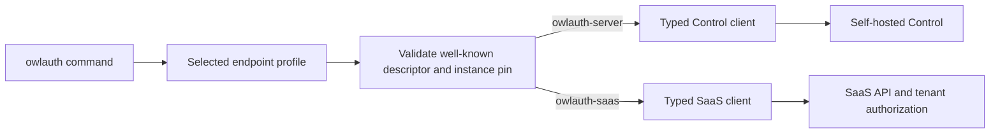
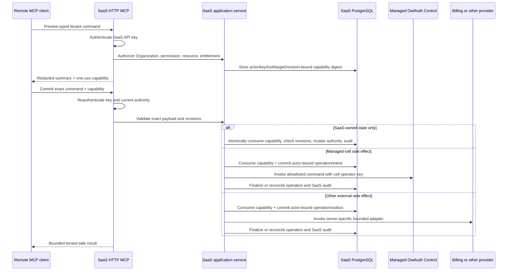

# 07 — Shared CLI and SaaS HTTP MCP surfaces

## Product boundary

OwlAuth publishes one `owlauth` CLI executable for both direct self-hosted administration and OwlAuth SaaS administration. A profile names one remote endpoint; the endpoint declares whether it is `owlauth-server` or `owlauth-saas`. The user does not configure a product type.

After endpoint discovery, the CLI dispatches to one of two isolated clients:

- a self-hosted Control client acting as the deployment operator;
- a tenant-aware SaaS client acting as a SaaS Account or Service Account through an API key.

The SaaS client does not invoke, wrap, or fall back to the server client. No CLI command imports `owlauth-server`, opens either product's database, or receives a managed cell operator key.

Both products also expose their own remote HTTP MCP server. MCP clients select an endpoint and authenticate; protocol initialization and tool discovery describe that endpoint's product and tool set. There is no local MCP process and no client-maintained `server`/`saas` tool-mode table.

## Endpoint-discovered CLI profiles

Root spec 07 owns the common profile fields, origin-root descriptor schema, first-use confirmation, product/instance/authority/API-base/credential-class pinning, rebind behavior, pre-credential validation, and no-probe/no-fallback rules. A profile has no user-configured product type.

For OwlAuth SaaS, the descriptor returns exactly:

- `product = owlauth-saas`;
- the stable public SaaS environment/instance ID owned by spec 06;
- the canonical same-origin SaaS API base and supported versions;
- `credential_class = saas-api-key`;
- the canonical same-origin remote MCP URL when enabled.

It contains no Organization, plan, tenant capability, cell, health, credential, or internal topology data. After validated discovery selects SaaS, the CLI obtains `OWLAUTH_SAAS_API_KEY` or the profile's protected SaaS credential reference and dispatches only to the typed SaaS client. `owl_ctrl_v1_` is rejected locally where recognizable and always by the SaaS API. The self-hosted credential path remains owned by root spec 07; there is no cross-product exchange or fallback.

## Command model

The self-hosted server defines the baseline resource vocabulary for tenant-manageable OwlAuth behavior:

- Projects;
- Applications;
- provider and passwordless-email configuration;
- Project users, identities, sessions, and connections;
- Project policy and signing-key lifecycle;
- Project audit and bounded operational views.

Where SaaS exposes a tenant-safe equivalent, the same top-level CLI command and conceptual flags are available when the selected profile discovers `owlauth-saas`. Dispatch follows the validated endpoint identity:



Reuse of command vocabulary does not mean reuse of credentials, URLs, wire DTOs, authorization, or identifiers:

- a `server` Project target is an OwlAuth Control Project identifier;
- a `saas` Project target is a SaaS Managed Project under an authorized Organization;
- the SaaS adapter resolves Organization ownership and never accepts a raw cell/Control target as an override;
- machine output identifies the discovered product and pinned instance and uses the owning product's stable public resource IDs;
- a common presentation model MAY normalize safe fields, but product-specific fields remain explicit rather than being discarded or guessed.

Deployment-wide standalone operations with no tenant-safe SaaS equivalent remain `server`-only. SaaS adds commands for concerns not present in `owlauth-server`, including:

- Organizations, memberships, invitations, and roles;
- Service Accounts and SaaS API-key metadata, status, and revocation;
- subscriptions, billing, entitlements, quotas, and usage;
- tenant-visible support, region, plan, and dedicated-cell requests;
- SaaS command-operation and tenant audit state.

The CLI rejects a command unsupported by the selected profile before sending a mutation. It does not retry that command against the other product. Help and completion MAY present the profile-specific command set when a profile is selected, while global help clearly marks common, `server`-only, and `saas`-only commands.

## CLI contract and implementation boundary

`crates/owlauth-cli` owns argument parsing, profile selection, credential acquisition, typed remote clients, confirmation UX, output, and error/exit-code mapping. It MUST NOT depend on `crates/owlauth-server` or a SaaS service implementation package.

The two remote clients consume independently reviewed public contracts. A common command handler may share validation and presentation code only after the profile has selected an explicit adapter. It cannot implement business authorization, infer Organization ownership, translate arbitrary JSON, or bypass a server/SaaS application service.

After public descriptor validation selects the client, authenticated capability/version negotiation is product-specific where it could reveal non-public state. It produces a clear unsupported-version/feature error and never causes product rediscovery or fallback. The CLI release has its own compatibility policy and MAY support multiple compatible server and SaaS API versions; SaaS API evolution does not change the self-hosted server contract.

`owlauth update`, version output, and installer behavior are profile-independent.

## CLI authorization and confirmation

For a profile pinned to `owlauth-server`, every command has the fixed `deployment_operator` authority and follows root spec 07 revision, idempotency, audit, and confirmation rules.

For a profile pinned to `owlauth-saas`, every command is authenticated and authorized by the SaaS layer using current Account/Service Account status, Organization membership/grants, API-key scope ceiling, resource ownership, entitlement, and revisions. Local CLI confirmation is intent UX only and never replaces either remote authorization model.

A destructive common command displays the discovered product, pinned instance/authority, Organization where applicable, Project, target, revisions, and bounded effect summary. Non-interactive confirmation is explicit and machine-auditable but does not widen permissions.

SaaS API-key creation and rotation produce a new secret that must be returned exactly once. They are not exposed by the initial CLI or MCP catalog because ordinary CLI output and every MCP result/model-visible channel forbid raw credentials. They remain available only through an explicitly human-facing SaaS API/Console flow with one-time secret display. A future CLI command requires a separately reviewed protected secret-sink contract; a future MCP tool requires a standards-compatible non-model-visible delivery channel. Neither surface may create an unusable key and omit its secret.

## Two remote HTTP MCP servers

### Self-hosted MCP

An enabled `owlauth-server` exposes a standards-conformant MCP Streamable HTTP endpoint on the private Control listener. The canonical route is `mcp` relative to the configured Control base URL. Every protocol request, including initialization, tool discovery, tool execution, and any session continuation, authenticates with:

```http
Authorization: Bearer owl_ctrl_v1_...
```

The endpoint has full deployment-operator authority and follows the root MCP constraints. It is never exposed on Runtime.

### SaaS MCP

OwlAuth SaaS exposes a standards-conformant MCP Streamable HTTP endpoint at `mcp` relative to the SaaS API base URL. Its v1 public authentication accepts only:

```http
Authorization: Bearer owl_saas_v1_<key-id>_<secret>
```

Platform browser sessions/tokens, managed cell operator keys, Runtime credentials, cookies, query parameters, and custom credential-forwarding headers are not accepted by the SaaS MCP endpoint. A human who needs agent access creates an Account-owned SaaS API key; shared automation uses a Service Account key.

Every MCP request revalidates the SaaS API key, current principal, owning Organization relationship, scope ceiling, and relevant resource/entitlement state. At creation, a negotiated transport session is bound to the exact product, instance, endpoint audience, SaaS API-key ID, principal kind/ID, and key-owning Organization. Before reading, changing, streaming, or deleting session state, every POST, GET, DELETE, and continuation must authenticate and exactly match that binding. Key revocation/expiry or loss of the principal/Organization relationship makes the session immediately unusable; mismatches use the same bounded non-enumerating denial as an unknown session. The session ID remains routing/conversation state only: it is not an authentication session and carries no authority.

## Protocol self-description

Each endpoint identifies itself through the MCP `initialize` exchange and returns its current tools through `tools/list`. The self-hosted endpoint describes `owlauth-server`; the SaaS endpoint describes `owlauth-saas` and MAY expose a superset.

A client or agent MUST NOT need a hard-coded OwlAuth product mode to interpret a connection. It connects to the configured MCP URL, authenticates, negotiates a supported MCP protocol version, and uses the returned tool schemas. If one host configures both endpoints, the MCP host's normal server-registration namespace distinguishes them.

The initial capability set is tools-only. Neither endpoint exposes prompt/resource catalogs or requests client roots, sampling, or elicitation; any future addition requires an explicit owning-product data-disclosure and authorization specification. Tool discovery is usability, not authorization. The SaaS endpoint MAY omit tools unavailable to the current key, but every invocation repeats authoritative permission, ownership, entitlement, revision, and input validation. A cached `tools/list` response never preserves revoked authority.

## MCP tool baseline and SaaS extensions

The self-hosted endpoint defines the baseline bounded OwlAuth tools over Project/application/provider/user/session/policy/key/audit application services. Where SaaS offers an equivalent, it SHOULD use the same conceptual tool name and behavior while its discovered input schema adds the required Organization and Managed Project context.

SaaS-only tools cover Organization, membership, Service Account, SaaS API-key metadata/status/revocation, subscription, entitlement, usage, and tenant-operation concerns. API-key creation and rotation are absent because they produce a new raw secret and MCP has no non-model-visible delivery channel. Server-only deployment operations are absent from SaaS discovery. Neither endpoint exposes a generic REST/OpenAPI caller, arbitrary URL/path/method/body forwarding, CLI execution, shell/filesystem access, raw SQL, database records, or a tool that accepts an operator key.

Shared tool names are a portability goal, not permission equivalence. The endpoint's discovered schema and product identity are authoritative for that connection; an agent cannot copy a raw self-hosted Project/cell target into a SaaS tool to bypass registry resolution.

Every SaaS tool has a server-owned impact class that request input cannot lower. A SaaS mapping cannot assign a lower class than the corresponding self-hosted baseline; each SaaS-only tool is classified by the SaaS owner. New or unclassified mutations default to high impact. In addition to the root baseline, membership/role removal or escalation, Service Account disablement, SaaS API-key revocation, subscription/billing changes, entitlement/quota overrides, managed-cell lifecycle changes, and externally visible support/region/dedicated-cell actions are high impact. Catalog conformance tests prove that these tools have no direct-commit alias or lower-class alternate path and that secret-producing API-key creation/rotation have no MCP tool or alias.

## HTTP transport boundary

Both MCP endpoints:

- require HTTPS except explicit loopback development;
- authenticate every HTTP request before protocol dispatch;
- validate the configured external authority/Host and validate `Origin` when present to prevent DNS-rebinding and browser cross-origin abuse;
- deny broad browser CORS by default;
- use bounded request/response bodies, protocol batch/message limits, deadlines, concurrency, and rate controls;
- do not place credentials in URLs, redirects, SSE/event payloads, protocol errors, logs, traces, tool schemas, model-visible context, or tool results;
- reject unsupported protocol versions and methods without falling back to a generic HTTP handler;
- treat any negotiated MCP session identifier as non-authoritative and bind it to the authenticated endpoint context.

Whether the negotiated Streamable HTTP version uses POST, optional GET streaming, DELETE, or session headers follows the supported MCP protocol version. OwlAuth does not invent an incompatible transport and does not expose a stdio/local-process mode.

## High-impact SaaS MCP confirmation

High-impact SaaS tools use a SaaS-owned preview/commit capability:



The capability binds the SaaS principal, API-key ID, Organization, exact tool and normalized command digest, Managed Project/target, SaaS/OwlAuth/entitlement revisions, endpoint audience, short expiry, and one-use state. It is stored only as a digest and does not contain or attenuate a managed cell operator key.

Human approval, prompt text, model output, tool selection, a capability, and an MCP session ID are never independent authorization. Commit reauthenticates and reauthorizes current SaaS state. A SaaS-owned mutation consumes the capability, checks revisions, changes authoritative state, and appends audit in one SaaS PostgreSQL transaction. Any managed-Control, billing-provider, or other external side effect first commits its owner-specific durable actor-bound operation/intent or outbox, then finalizes or reconciles it as required by specs 03, 04, 05, and 06; an external effect is never misrouted through managed Control.

## Audit and redaction

Self-hosted MCP records the fixed `deployment_operator`, tool/Control action, Project/target, outcome, and correlation in OwlAuth audit.

SaaS MCP records the Account or Service Account, SaaS API-key ID, Organization, permission, tool, Managed Project/target, confirmation/operation identity, outcome, and correlation in SaaS audit. The managed cell records only `deployment_operator`; correlation joins the streams without treating forwarded actor text as authority.

Tool lists, previews, results, errors, and audit never expose raw API keys, operator keys, confirmation digests, provider/email/webhook secrets, access/refresh credentials, private keys, unrestricted profiles, cross-tenant existence, or internal cell Control origins.

## Packaging and lifecycle

The `owlauth` CLI remains one independently released binary. Supporting SaaS adds adapters and commands; it does not create a second operator binary or make the CLI depend on the server.

Each HTTP MCP server is deployed with its owning service:

- self-hosted MCP is a server-side Control adapter inside `owlauth-server`;
- SaaS MCP is a SaaS API adapter inside the SaaS service.

Plugins and agent packages MAY document endpoint setup but MUST NOT bundle, launch, download, supervise, or impersonate either MCP server. Disabling MCP changes no Runtime protocol, CLI contract, REST API authority, API-key lifecycle, or underlying application-service semantics.
